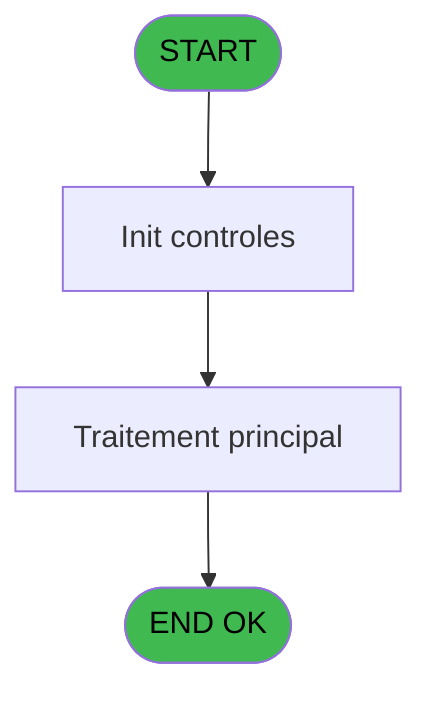
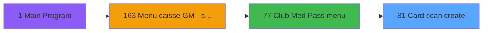
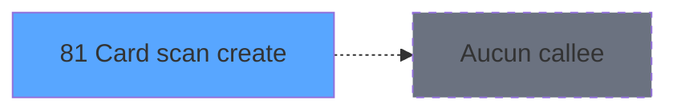

# ADH IDE 81 - Card scan create

> **Analyse**: Phases 1-4 2026-02-07 03:44 -> 03:45 (27s) | Assemblage 03:45
> **Pipeline**: V7.2 Enrichi
> **Structure**: 4 onglets (Resume | Ecrans | Donnees | Connexions)

<!-- TAB:Resume -->

## 1. FICHE D'IDENTITE

| Attribut | Valeur |
|----------|--------|
| Projet | ADH |
| IDE Position | 81 |
| Nom Programme | Card scan create |
| Fichier source | `Prg_81.xml` |
| Dossier IDE | General |
| Taches | 1 (1 ecrans visibles) |
| Tables modifiees | 0 |
| Programmes appeles | 0 |

## 2. DESCRIPTION FONCTIONNELLE

**Card scan create** assure la gestion complete de ce processus, accessible depuis [Club Med Pass menu (IDE 77)](ADH-IDE-77.md).

Le flux de traitement s'organise en **1 blocs fonctionnels** :

- **Creation** (1 tache) : insertion d'enregistrements en base (mouvements, prestations)

**Logique metier** : 1 regles identifiees couvrant conditions metier.

## 3. BLOCS FONCTIONNELS

### 3.1 Creation (1 tache)

Insertion de nouveaux enregistrements en base.

---

#### 81 - EZ Card Creation [[ECRAN]](#ecran-t1)

**Role** : Creation d'enregistrement : EZ Card Creation.
**Ecran** : 366 x 69 DLU (MDI) | [Voir mockup](#ecran-t1)
**Variables liees** : A (p.card id), B (v.card id), C (r.card)

## 5. REGLES METIER

1 regles identifiees:

### Autres (1 regles)

#### [RM-001] Si [H]='V' alors MlsTrans ('Cette carte appartient à')&' :'&Trim ([M])&' '&Trim ([L]) sinon MlsTrans ('Vous ne pouvez pas utiliser cette carte'))

| Element | Detail |
|---------|--------|
| **Condition** | `[H]='V'` |
| **Si vrai** | MlsTrans ('Cette carte appartient à')&' :'&Trim ([M])&' '&Trim ([L]) |
| **Si faux** | MlsTrans ('Vous ne pouvez pas utiliser cette carte')) |
| **Expression source** | Expression 3 : `IF ([H]='V',MlsTrans ('Cette carte appartient à')&' :'&Trim ` |
| **Exemple** | Si [H]='V' → MlsTrans ('Cette carte appartient à')&' :'&Trim ([M])&' '&Trim ([L]). Sinon → MlsTrans ('Vous ne pouvez pas utiliser cette carte')) |

## 6. CONTEXTE

- **Appele par**: [Club Med Pass menu (IDE 77)](ADH-IDE-77.md)
- **Appelle**: 0 programmes | **Tables**: 2 (W:0 R:1 L:1) | **Taches**: 1 | **Expressions**: 11

<!-- TAB:Ecrans -->

## 8. ECRANS

### 8.1 Forms visibles (1 / 1)

| # | Position | Tache | Nom | Type | Largeur | Hauteur | Bloc |
|---|----------|-------|-----|------|---------|---------|------|
| 1 | 81 | 81 | EZ Card Creation | MDI | 366 | 69 | Creation |

### 8.2 Mockups Ecrans

---

#### 81 - EZ Card Creation
**Tache** : [81](#t1) | **Type** : MDI | **Dimensions** : 366 x 69 DLU
**Bloc** : Creation | **Titre IDE** : EZ Card Creation

<!-- FORM-DATA:
{
    "width":  366,
    "vFactor":  4,
    "type":  "MDI",
    "hFactor":  4,
    "controls":  [
                     {
                         "x":  132,
                         "type":  "label",
                         "var":  "",
                         "y":  12,
                         "w":  88,
                         "fmt":  "",
                         "name":  "",
                         "h":  5,
                         "color":  "6",
                         "text":  "Scan Club Med Pass...",
                         "parent":  null
                     },
                     {
                         "x":  0,
                         "type":  "label",
                         "var":  "",
                         "y":  54,
                         "w":  363,
                         "fmt":  "",
                         "name":  "",
                         "h":  13,
                         "color":  "6",
                         "text":  "",
                         "parent":  null
                     },
                     {
                         "x":  198,
                         "type":  "edit",
                         "var":  "",
                         "y":  24,
                         "w":  92,
                         "fmt":  "",
                         "name":  "v.card id",
                         "h":  8,
                         "color":  "",
                         "text":  "",
                         "parent":  null
                     },
                     {
                         "x":  16,
                         "type":  "image",
                         "var":  "",
                         "y":  8,
                         "w":  102,
                         "fmt":  "",
                         "name":  "",
                         "h":  39,
                         "color":  "",
                         "text":  "",
                         "parent":  null
                     },
                     {
                         "x":  148,
                         "type":  "edit",
                         "var":  "",
                         "y":  35,
                         "w":  200,
                         "fmt":  "100",
                         "name":  "",
                         "h":  12,
                         "color":  "143",
                         "text":  "",
                         "parent":  null
                     },
                     {
                         "x":  262,
                         "type":  "button",
                         "var":  "",
                         "y":  57,
                         "w":  99,
                         "fmt":  "Cancel",
                         "name":  "CANCEL",
                         "h":  9,
                         "color":  "",
                         "text":  "",
                         "parent":  null
                     }
                 ],
    "taskId":  "81",
    "height":  69
}
-->

<strong>Champs : 2 champs</strong>

| Pos (x,y) | Nom | Variable | Type |
|-----------|-----|----------|------|
| 198,24 | v.card id | - | edit |
| 148,35 | 100 | - | edit |

<strong>Boutons : 1 boutons</strong>

| Bouton | Pos (x,y) | Action |
|--------|-----------|--------|
| Cancel | 262,57 | Annule et retour au menu |

## 9. NAVIGATION

Ecran unique: **EZ Card Creation**

### 9.3 Structure hierarchique (1 tache)

| Position | Tache | Type | Dimensions | Bloc |
|----------|-------|------|------------|------|
| **81.1** | [**EZ Card Creation** (81)](#t1) [mockup](#ecran-t1) | MDI | 366x69 | Creation |

### 9.4 Algorigramme

> **Legende**: Vert = START/END OK | Rouge = END KO | Bleu = Decisions
> *Algorigramme auto-genere. Utiliser `/algorigramme` pour une synthese metier detaillee.*

<!-- TAB:Donnees -->

## 10. TABLES

### Tables utilisees (2)

| ID | Nom | Description | Type | R | W | L | Usages |
|----|-----|-------------|------|---|---|---|--------|
| 30 | gm-recherche_____gmr | Index de recherche | DB | R |   |   | 1 |
| 312 | ez_card |  | DB |   |   | L | 1 |

### Colonnes par table (2 / 1 tables avec colonnes identifiees)

Table 30 - gm-recherche_____gmr (R) - 1 usages

| Lettre | Variable | Acces | Type |
|--------|----------|-------|------|
| A | p.card id | R | Alpha |
| B | v.card id | R | Alpha |
| C | r.card | R | Logical |

## 11. VARIABLES

### 11.1 Parametres entrants (1)

Variables recues du programme appelant ([Club Med Pass menu (IDE 77)](ADH-IDE-77.md)).

| Lettre | Nom | Type | Usage dans |
|--------|-----|------|-----------|
| A | p.card id | Alpha | - |

### 11.2 Variables de session (1)

Variables persistantes pendant toute la session.

| Lettre | Nom | Type | Usage dans |
|--------|-----|------|-----------|
| B | v.card id | Alpha | 3x session |

### 11.3 Autres (1)

Variables diverses.

| Lettre | Nom | Type | Usage dans |
|--------|-----|------|-----------|
| C | r.card | Logical | 4x refs |

## 12. EXPRESSIONS

**11 / 11 expressions decodees (100%)**

### 12.1 Repartition par type

| Type | Expressions | Regles |
|------|-------------|--------|
| CONCATENATION | 1 | 5 |
| CONSTANTE | 1 | 0 |
| OTHER | 6 | 0 |
| NEGATION | 2 | 0 |
| CONDITION | 1 | 0 |

### 12.2 Expressions cles par type

#### CONCATENATION (1 expressions)

| Type | IDE | Expression | Regle |
|------|-----|------------|-------|
| CONCATENATION | 3 | `IF ([H]='V',MlsTrans ('Cette carte appartient à')&' :'&Trim ([M])&' '&Trim ([L]),MlsTrans ('Vous ne pouvez pas utiliser cette carte'))` | [RM-001](#rm-RM-001) |

#### CONSTANTE (1 expressions)

| Type | IDE | Expression | Regle |
|------|-----|------------|-------|
| CONSTANTE | 2 | `''` | - |

#### OTHER (6 expressions)

| Type | IDE | Expression | Regle |
|------|-----|------------|-------|
| OTHER | 7 | `[G]` | - |
| OTHER | 10 | `v.card id [B]` | - |
| OTHER | 11 | `r.card [C]` | - |
| OTHER | 1 | `v.card id [B]` | - |
| OTHER | 5 | `[E]` | - |
| ... | | *+1 autres* | |

#### NEGATION (2 expressions)

| Type | IDE | Expression | Regle |
|------|-----|------------|-------|
| NEGATION | 9 | `NOT (r.card [C])` | - |
| NEGATION | 4 | `NOT (r.card [C])` | - |

#### CONDITION (1 expressions)

| Type | IDE | Expression | Regle |
|------|-----|------------|-------|
| CONDITION | 8 | `r.card [C] OR Len (Trim (v.card id [B]))<10` | - |

<!-- TAB:Connexions -->

## 13. GRAPHE D'APPELS

### 13.1 Chaine depuis Main (Callers)

Main -> ... -> [Club Med Pass menu (IDE 77)](ADH-IDE-77.md) -> **Card scan create (IDE 81)**

### 13.2 Callers

| IDE | Nom Programme | Nb Appels |
|-----|---------------|-----------|
| [77](ADH-IDE-77.md) | Club Med Pass menu | 1 |

### 13.3 Callees (programmes appeles)

### 13.4 Detail Callees avec contexte

| IDE | Nom Programme | Appels | Contexte |
|-----|---------------|--------|----------|
| - | (aucun) | - | - |

## 14. RECOMMANDATIONS MIGRATION

### 14.1 Profil du programme

| Metrique | Valeur | Impact migration |
|----------|--------|-----------------|
| Lignes de logique | 24 | Programme compact |
| Expressions | 11 | Peu de logique |
| Tables WRITE | 0 | Impact faible |
| Sous-programmes | 0 | Peu de dependances |
| Ecrans visibles | 1 | Ecran unique ou traitement batch |
| Code desactive | 0% (0 / 24) | Code sain |
| Regles metier | 1 | Quelques regles a preserver |

### 14.2 Plan de migration par bloc

#### Creation (1 tache: 1 ecran, 0 traitement)

- **Strategie** : Repository pattern avec Entity Framework Core.
- Insertion via `IRepository<T>.CreateAsync()`

### 14.3 Dependances critiques

| Dependance | Type | Appels | Impact |
|------------|------|--------|--------|

---
*Spec DETAILED generee par Pipeline V7.2 - 2026-02-07 03:45*
