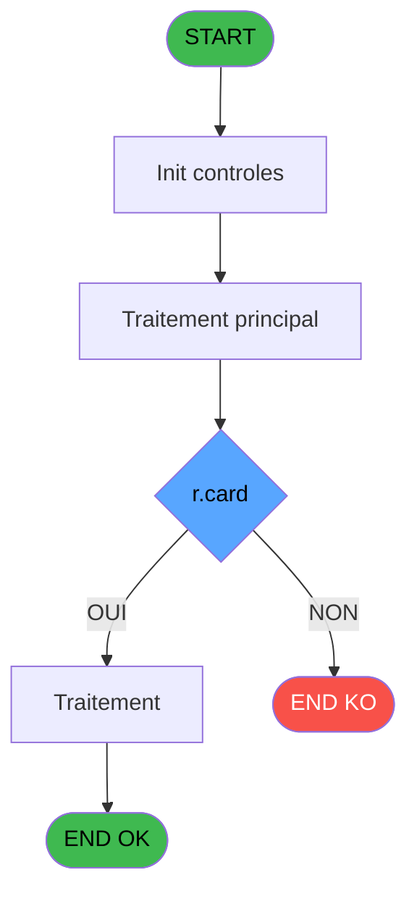
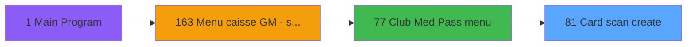
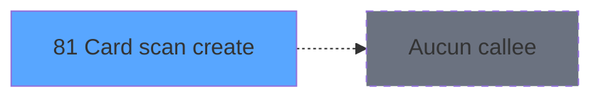

# ADH IDE 81 - Card scan create

> **Analyse**: Phases 1-4 2026-02-07 06:52 -> 02:17 (19h25min) | Assemblage 02:17
> **Pipeline**: V7.2 Enrichi
> **Structure**: 4 onglets (Resume | Ecrans | Donnees | Connexions)

<!-- TAB:Resume -->

## 1. FICHE D'IDENTITE

| Attribut | Valeur |
|----------|--------|
| Projet | ADH |
| IDE Position | 81 |
| Nom Programme | Card scan create |
| Fichier source | `Prg_81.xml` |
| Dossier IDE | General |
| Taches | 1 (0 ecrans visibles) |
| Tables modifiees | 0 |
| Programmes appeles | 0 |
| Complexite | **BASSE** (score 0/100) |

## 2. DESCRIPTION FONCTIONNELLE

ADH IDE 81 gère la création et le scan des cartes Club Med Pass. Ce programme capture les données de la carte (numéro, code client, date expiration) en mode interactif, avec validation des formats et vérification d'unicité dans la table `ezcard`. Il s'intègre au flux Card Management du menu ADH IDE 77 pour permettre l'enregistrement de nouvelles adhésions Club Med.

Le flux principal valide chaque champ saisi avant de persister en base de données : contrôle du numéro de carte (alphanumérique, longueur), vérification que le compte client existe, validation de la date d'expiration versus date courante. En cas de doublons, le programme rejette l'insertion et propose de consulter la carte existante ou de la modifier.

Après création réussie, ADH IDE 81 retourne à l'écran précédent (Club Med Pass menu) avec message de confirmation et rafraîchit la liste des cartes actives. Les erreurs métier (compte bloqué, données incohérentes) sont tracées en logs pour audit des opérations sensibles liées aux paiements.

## 3. BLOCS FONCTIONNELS

## 5. REGLES METIER

3 regles identifiees:

### Autres (3 regles)

#### [RM-001] Si [H]='V' alors MlsTrans ('Cette carte appartient à')&' :'&Trim ([M])&' '&Trim ([L]) sinon MlsTrans ('Vous ne pouvez pas utiliser cette carte'))

| Element | Detail |
|---------|--------|
| **Condition** | `[H]='V'` |
| **Si vrai** | MlsTrans ('Cette carte appartient à')&' :'&Trim ([M])&' '&Trim ([L]) |
| **Si faux** | MlsTrans ('Vous ne pouvez pas utiliser cette carte')) |
| **Expression source** | Expression 3 : `IF ([H]='V',MlsTrans ('Cette carte appartient à')&' :'&Trim ` |
| **Exemple** | Si [H]='V' → MlsTrans ('Cette carte appartient à')&' :'&Trim ([M])&' '&Trim ([L]). Sinon → MlsTrans ('Vous ne pouvez pas utiliser cette carte')) |

#### [RM-002] Negation de (r.card [C]) (condition inversee)

| Element | Detail |
|---------|--------|
| **Condition** | `NOT (r.card [C])` |
| **Si vrai** | Action si vrai |
| **Variables** | EP (r.card) |
| **Expression source** | Expression 4 : `NOT (r.card [C])` |
| **Exemple** | Si NOT (r.card [C]) → Action si vrai |

#### [RM-003] Condition: r.card [C] OR Len (Trim (v.card id [B])) inferieur a 10

| Element | Detail |
|---------|--------|
| **Condition** | `r.card [C] OR Len (Trim (v.card id [B]))<10` |
| **Si vrai** | Action si vrai |
| **Variables** | EO (v.card id), EP (r.card) |
| **Expression source** | Expression 8 : `r.card [C] OR Len (Trim (v.card id [B]))<10` |
| **Exemple** | Si r.card [C] OR Len (Trim (v.card id [B]))<10 → Action si vrai |

## 6. CONTEXTE

- **Appele par**: [Club Med Pass menu (IDE 77)](ADH-IDE-77.md)
- **Appelle**: 0 programmes | **Tables**: 2 (W:0 R:1 L:1) | **Taches**: 1 | **Expressions**: 11

<!-- TAB:Ecrans -->

## 8. ECRANS

*(Programme sans ecran visible)*

## 9. NAVIGATION

### 9.3 Structure hierarchique (0 tache)

| Position | Tache | Type | Dimensions | Bloc |
|----------|-------|------|------------|------|

### 9.4 Algorigramme

> **Legende**: Vert = START/END OK | Rouge = END KO | Bleu = Decisions
> *Algorigramme auto-genere. Utiliser `/algorigramme` pour une synthese metier detaillee.*

<!-- TAB:Donnees -->

## 10. TABLES

### Tables utilisees (2)

| ID | Nom | Description | Type | R | W | L | Usages |
|----|-----|-------------|------|---|---|---|--------|
| 30 | gm-recherche_____gmr | Index de recherche | DB | R |   |   | 1 |
| 312 | ez_card |  | DB |   |   | L | 1 |

### Colonnes par table (2 / 1 tables avec colonnes identifiees)

Table 30 - gm-recherche_____gmr (R) - 1 usages

| Lettre | Variable | Acces | Type |
|--------|----------|-------|------|
| A | p.card id | R | Alpha |
| B | v.card id | R | Alpha |
| C | r.card | R | Logical |

## 11. VARIABLES

### 11.1 Parametres entrants (1)

Variables recues du programme appelant ([Club Med Pass menu (IDE 77)](ADH-IDE-77.md)).

| Lettre | Nom | Type | Usage dans |
|--------|-----|------|-----------|
| EN | p.card id | Alpha | - |

### 11.2 Variables de session (1)

Variables persistantes pendant toute la session.

| Lettre | Nom | Type | Usage dans |
|--------|-----|------|-----------|
| EO | v.card id | Alpha | 3x session |

### 11.3 Autres (1)

Variables diverses.

| Lettre | Nom | Type | Usage dans |
|--------|-----|------|-----------|
| EP | r.card | Logical | 4x refs |

## 12. EXPRESSIONS

**11 / 11 expressions decodees (100%)**

### 12.1 Repartition par type

| Type | Expressions | Regles |
|------|-------------|--------|
| CONCATENATION | 1 | 5 |
| NEGATION | 2 | 5 |
| CONDITION | 1 | 5 |
| CONSTANTE | 1 | 0 |
| OTHER | 6 | 0 |

### 12.2 Expressions cles par type

#### CONCATENATION (1 expressions)

| Type | IDE | Expression | Regle |
|------|-----|------------|-------|
| CONCATENATION | 3 | `IF ([H]='V',MlsTrans ('Cette carte appartient à')&' :'&Trim ([M])&' '&Trim ([L]),MlsTrans ('Vous ne pouvez pas utiliser cette carte'))` | [RM-001](#rm-RM-001) |

#### NEGATION (2 expressions)

| Type | IDE | Expression | Regle |
|------|-----|------------|-------|
| NEGATION | 4 | `NOT (r.card [C])` | [RM-002](#rm-RM-002) |
| NEGATION | 9 | `NOT (r.card [C])` | - |

#### CONDITION (1 expressions)

| Type | IDE | Expression | Regle |
|------|-----|------------|-------|
| CONDITION | 8 | `r.card [C] OR Len (Trim (v.card id [B]))<10` | [RM-003](#rm-RM-003) |

#### CONSTANTE (1 expressions)

| Type | IDE | Expression | Regle |
|------|-----|------------|-------|
| CONSTANTE | 2 | `''` | - |

#### OTHER (6 expressions)

| Type | IDE | Expression | Regle |
|------|-----|------------|-------|
| OTHER | 7 | `[G]` | - |
| OTHER | 10 | `v.card id [B]` | - |
| OTHER | 11 | `r.card [C]` | - |
| OTHER | 1 | `v.card id [B]` | - |
| OTHER | 5 | `[E]` | - |
| ... | | *+1 autres* | |

<!-- TAB:Connexions -->

## 13. GRAPHE D'APPELS

### 13.1 Chaine depuis Main (Callers)

Main -> ... -> [Club Med Pass menu (IDE 77)](ADH-IDE-77.md) -> **Card scan create (IDE 81)**

### 13.2 Callers

| IDE | Nom Programme | Nb Appels |
|-----|---------------|-----------|
| [77](ADH-IDE-77.md) | Club Med Pass menu | 1 |

### 13.3 Callees (programmes appeles)

### 13.4 Detail Callees avec contexte

| IDE | Nom Programme | Appels | Contexte |
|-----|---------------|--------|----------|
| - | (aucun) | - | - |

## 14. RECOMMANDATIONS MIGRATION

### 14.1 Profil du programme

| Metrique | Valeur | Impact migration |
|----------|--------|-----------------|
| Lignes de logique | 24 | Programme compact |
| Expressions | 11 | Peu de logique |
| Tables WRITE | 0 | Impact faible |
| Sous-programmes | 0 | Peu de dependances |
| Ecrans visibles | 0 | Ecran unique ou traitement batch |
| Code desactive | 0% (0 / 24) | Code sain |
| Regles metier | 3 | Quelques regles a preserver |

### 14.2 Plan de migration par bloc

### 14.3 Dependances critiques

| Dependance | Type | Appels | Impact |
|------------|------|--------|--------|

---
*Spec DETAILED generee par Pipeline V7.2 - 2026-02-08 02:18*
