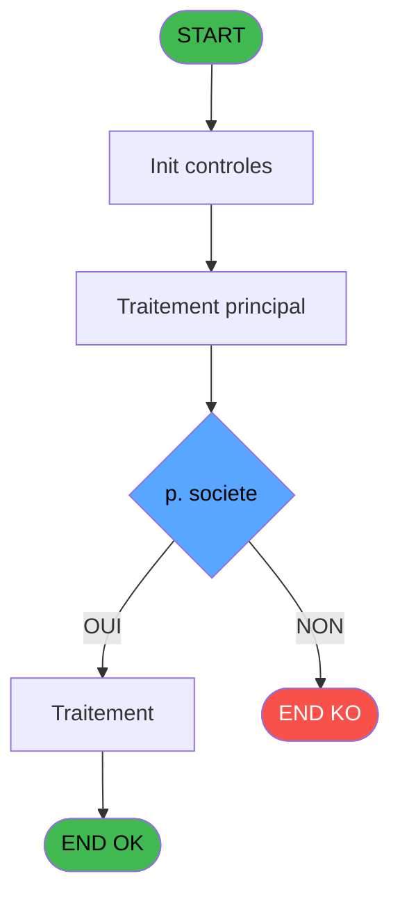
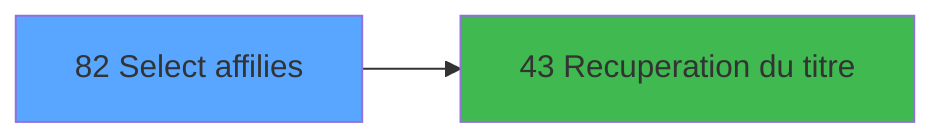

# ADH IDE 82 - Select affilies

> **Analyse**: Phases 1-4 2026-02-07 03:45 -> 02:18 (22h32min) | Assemblage 02:18
> **Pipeline**: V7.2 Enrichi
> **Structure**: 4 onglets (Resume | Ecrans | Donnees | Connexions)

<!-- TAB:Resume -->

## 1. FICHE D'IDENTITE

| Attribut | Valeur |
|----------|--------|
| Projet | ADH |
| IDE Position | 82 |
| Nom Programme | Select affilies |
| Fichier source | `Prg_82.xml` |
| Dossier IDE | General |
| Taches | 2 (1 ecrans visibles) |
| Tables modifiees | 0 |
| Programmes appeles | 1 |
| Complexite | **BASSE** (score 5/100) |

## 2. DESCRIPTION FONCTIONNELLE

**ADH IDE 82** est un composant d'interface de sélection d'affiliés appelé depuis le menu Club Med Pass. Le programme reçoit en entrée une société, code adhérent et filiation, puis affiche une table de 5 lignes listant les affiliés disponibles avec leurs informations (nom/prénom, sexe, âge, numéro, statut EZ Card). L'écran MDI mesure 1010×227 DLU et contient 27 contrôles répartis sur 2 formulaires – un header affichant la société et la date du jour, et un détail avec 16 champs éditables pour consultation des dates de séjour, codes et statuts.

La logique métier repose sur trois règles principales : ajustement dynamique de la hauteur écran (143 ou 110 DLU selon la variable Y), formatage conditionnel de l'âge en années ou mois, et classification du séjour en trois catégories (dernier/prochain/en cours) par comparaison de dates sérialisées. Les données proviennent de 3 tables en lecture seule (gm-recherche, compte_gm et ez_card) – zéro écriture base de données. Le programme appelle IDE 43 pour enrichir le titre, et valide l'accès au compte via une condition de sécurité sur la société avant d'afficher les informations.

C'est un composant terminale de faible complexité (61 lignes, score 5/100), spécialisé et non orphelin puisqu'appelé depuis la chaîne principale via IDE 77. La migration vers .NET/React est directe : créer un service de récupération données, un composant React pour le formulaire, et intégrer l'appel à IDE 43 comme dépendance injectée.

## 3. BLOCS FONCTIONNELS

### 3.1 Traitement (1 tache)

Traitements internes.

---

#### 82 - Ecran [[ECRAN]](#ecran-t1)

**Role** : Traitement : Ecran.
**Ecran** : 1010 x 227 DLU (MDI) | [Voir mockup](#ecran-t1)
**Delegue a** : [Recuperation du titre (IDE 43)](ADH-IDE-43.md)

### 3.2 Calcul (1 tache)

Calculs metier : montants, stocks, compteurs.

---

#### 82.1 - Reaffichage infos compte

**Role** : Reinitialisation : Reaffichage infos compte.
**Variables liees** : ER (< solde compte), ES (< etat compte)

## 5. REGLES METIER

6 regles identifiees:

### Autres (6 regles)

#### [RM-001] Si [Y] alors 143 sinon 110)

| Element | Detail |
|---------|--------|
| **Condition** | `[Y]` |
| **Si vrai** | 143 |
| **Si faux** | 110) |
| **Expression source** | Expression 1 : `IF ([Y],143,110)` |
| **Exemple** | Si [Y] → 143. Sinon → 110) |

#### [RM-002] Negation de ([Y]) (condition inversee)

| Element | Detail |
|---------|--------|
| **Condition** | `NOT ([Y])` |
| **Si vrai** | Action si vrai |
| **Expression source** | Expression 2 : `NOT ([Y])` |
| **Exemple** | Si NOT ([Y]) → Action si vrai |

#### [RM-003] Condition: p. societe [A] egale

| Element | Detail |
|---------|--------|
| **Condition** | `p. societe [A]=''` |
| **Si vrai** | Action si vrai |
| **Variables** | EN (p. societe) |
| **Expression source** | Expression 7 : `p. societe [A]=''` |
| **Exemple** | Si p. societe [A]='' → Action si vrai |

#### [RM-004] Traitement conditionnel si [W]>0,Str ([W],'###'),IF ([X] est a zero

| Element | Detail |
|---------|--------|
| **Condition** | `[W]>0` |
| **Si vrai** | Str ([W] |
| **Si faux** | '###'),IF ([X]=0,'',Str ([W],'##'))) |
| **Expression source** | Expression 18 : `IF ([W]>0,Str ([W],'###'),IF ([X]=0,'',Str ([W],'##')))` |
| **Exemple** | Si [W]>0 → Str ([W]. Sinon → '###'),IF ([X]=0,'',Str ([W],'##'))) |

#### [RM-005] Si [V]<Date () alors MlsTrans ('dernier sejour :') sinon IF ([U]>Date (),MlsTrans ('prochain sejour :'),MlsTrans ('sejour en cours')))

| Element | Detail |
|---------|--------|
| **Condition** | `[V]<Date ()` |
| **Si vrai** | MlsTrans ('dernier sejour :') |
| **Si faux** | IF ([U]>Date (),MlsTrans ('prochain sejour :'),MlsTrans ('sejour en cours'))) |
| **Expression source** | Expression 21 : `IF ([V]<Date (),MlsTrans ('dernier sejour :'),IF ([U]>Date (` |
| **Exemple** | Si [V]<Date () → MlsTrans ('dernier sejour :') |

#### [RM-006] Condition: [R] egale 0

| Element | Detail |
|---------|--------|
| **Condition** | `[R]=0` |
| **Si vrai** | Action si vrai |
| **Expression source** | Expression 25 : `[R]=0` |
| **Exemple** | Si [R]=0 → Action si vrai |

## 6. CONTEXTE

- **Appele par**: [Club Med Pass menu (IDE 77)](ADH-IDE-77.md)
- **Appelle**: 1 programmes | **Tables**: 3 (W:0 R:2 L:1) | **Taches**: 2 | **Expressions**: 27

<!-- TAB:Ecrans -->

## 8. ECRANS

### 8.1 Forms visibles (1 / 2)

| # | Position | Tache | Nom | Type | Largeur | Hauteur | Bloc |
|---|----------|-------|-----|------|---------|---------|------|
| 1 | 82 | 82 | Ecran | MDI | 1010 | 227 | Traitement |

### 8.2 Mockups Ecrans

---

#### 82 - Ecran
**Tache** : [82](#t1) | **Type** : MDI | **Dimensions** : 1010 x 227 DLU
**Bloc** : Traitement | **Titre IDE** : Ecran

<!-- FORM-DATA:
{
    "width":  1010,
    "vFactor":  8,
    "type":  "MDI",
    "hFactor":  8,
    "controls":  [
                     {
                         "x":  0,
                         "type":  "label",
                         "var":  "",
                         "y":  0,
                         "w":  1010,
                         "fmt":  "",
                         "name":  "",
                         "h":  18,
                         "color":  "",
                         "text":  "",
                         "parent":  null
                     },
                     {
                         "x":  0,
                         "type":  "label",
                         "var":  "",
                         "y":  203,
                         "w":  1008,
                         "fmt":  "",
                         "name":  "",
                         "h":  24,
                         "color":  "",
                         "text":  "",
                         "parent":  null
                     },
                     {
                         "x":  22,
                         "type":  "table",
                         "var":  "",
                         "name":  "",
                         "titleH":  15,
                         "color":  "110",
                         "w":  971,
                         "y":  27,
                         "fmt":  "",
                         "parent":  null,
                         "text":  "",
                         "rowH":  31,
                         "h":  171,
                         "cols":  [
                                      {
                                          "title":  "Nom / Prénom",
                                          "layer":  1,
                                          "w":  361
                                      },
                                      {
                                          "title":  "Sexe",
                                          "layer":  2,
                                          "w":  69
                                      },
                                      {
                                          "title":  "Age",
                                          "layer":  3,
                                          "w":  125
                                      },
                                      {
                                          "title":  "Numéro",
                                          "layer":  4,
                                          "w":  255
                                      },
                                      {
                                          "title":  "EZ Card ?",
                                          "layer":  5,
                                          "w":  129
                                      }
                                  ],
                         "rows":  5
                     },
                     {
                         "x":  760,
                         "type":  "label",
                         "var":  "",
                         "y":  57,
                         "w":  20,
                         "fmt":  "",
                         "name":  "",
                         "h":  12,
                         "color":  "110",
                         "text":  "m",
                         "parent":  5
                     },
                     {
                         "x":  34,
                         "type":  "edit",
                         "var":  "",
                         "y":  46,
                         "w":  295,
                         "fmt":  "",
                         "name":  "",
                         "h":  8,
                         "color":  "110",
                         "text":  "",
                         "parent":  5
                     },
                     {
                         "x":  586,
                         "type":  "edit",
                         "var":  "",
                         "y":  46,
                         "w":  120,
                         "fmt":  "",
                         "name":  "",
                         "h":  8,
                         "color":  "110",
                         "text":  "",
                         "parent":  5
                     },
                     {
                         "x":  725,
                         "type":  "edit",
                         "var":  "",
                         "y":  46,
                         "w":  20,
                         "fmt":  "1",
                         "name":  "",
                         "h":  8,
                         "color":  "110",
                         "text":  "",
                         "parent":  5
                     },
                     {
                         "x":  765,
                         "type":  "edit",
                         "var":  "",
                         "y":  46,
                         "w":  42,
                         "fmt":  "",
                         "name":  "",
                         "h":  8,
                         "color":  "110",
                         "text":  "",
                         "parent":  5
                     },
                     {
                         "x":  258,
                         "type":  "edit",
                         "var":  "",
                         "y":  61,
                         "w":  132,
                         "fmt":  "WWW DD MMMMZ",
                         "name":  "",
                         "h":  8,
                         "color":  "110",
                         "text":  "",
                         "parent":  5
                     },
                     {
                         "x":  546,
                         "type":  "edit",
                         "var":  "",
                         "y":  61,
                         "w":  132,
                         "fmt":  "WWW DD MMMMZ",
                         "name":  "",
                         "h":  8,
                         "color":  "110",
                         "text":  "",
                         "parent":  5
                     },
                     {
                         "x":  893,
                         "type":  "checkbox",
                         "var":  "",
                         "y":  53,
                         "w":  42,
                         "fmt":  "",
                         "name":  "",
                         "h":  14,
                         "color":  "110",
                         "text":  "",
                         "parent":  5
                     },
                     {
                         "x":  6,
                         "type":  "edit",
                         "var":  "",
                         "y":  4,
                         "w":  267,
                         "fmt":  "20",
                         "name":  "",
                         "h":  8,
                         "color":  "",
                         "text":  "",
                         "parent":  1
                     },
                     {
                         "x":  800,
                         "type":  "edit",
                         "var":  "",
                         "y":  4,
                         "w":  203,
                         "fmt":  "WWW DD MMM YYYYT",
                         "name":  "",
                         "h":  8,
                         "color":  "",
                         "text":  "",
                         "parent":  1
                     },
                     {
                         "x":  407,
                         "type":  "edit",
                         "var":  "",
                         "y":  46,
                         "w":  30,
                         "fmt":  "2",
                         "name":  "gmr_sexe",
                         "h":  8,
                         "color":  "110",
                         "text":  "",
                         "parent":  5
                     },
                     {
                         "x":  466,
                         "type":  "edit",
                         "var":  "",
                         "y":  46,
                         "w":  34,
                         "fmt":  "3",
                         "name":  "",
                         "h":  8,
                         "color":  "110",
                         "text":  "",
                         "parent":  5
                     },
                     {
                         "x":  517,
                         "type":  "edit",
                         "var":  "",
                         "y":  46,
                         "w":  52,
                         "fmt":  "4",
                         "name":  "",
                         "h":  8,
                         "color":  "110",
                         "text":  "",
                         "parent":  5
                     },
                     {
                         "x":  742,
                         "type":  "edit",
                         "var":  "",
                         "y":  46,
                         "w":  20,
                         "fmt":  "1",
                         "name":  "",
                         "h":  8,
                         "color":  "110",
                         "text":  "",
                         "parent":  5
                     },
                     {
                         "x":  34,
                         "type":  "edit",
                         "var":  "",
                         "y":  61,
                         "w":  169,
                         "fmt":  "17",
                         "name":  "",
                         "h":  8,
                         "color":  "110",
                         "text":  "",
                         "parent":  5
                     },
                     {
                         "x":  203,
                         "type":  "edit",
                         "var":  "",
                         "y":  61,
                         "w":  53,
                         "fmt":  "4",
                         "name":  "",
                         "h":  8,
                         "color":  "110",
                         "text":  "",
                         "parent":  5
                     },
                     {
                         "x":  498,
                         "type":  "edit",
                         "var":  "",
                         "y":  61,
                         "w":  52,
                         "fmt":  "4",
                         "name":  "",
                         "h":  8,
                         "color":  "110",
                         "text":  "",
                         "parent":  5
                     },
                     {
                         "x":  9,
                         "type":  "button",
                         "var":  "",
                         "y":  206,
                         "w":  168,
                         "fmt":  "\u0026Quitter",
                         "name":  "",
                         "h":  18,
                         "color":  "",
                         "text":  "",
                         "parent":  null
                     },
                     {
                         "x":  192,
                         "type":  "button",
                         "var":  "",
                         "y":  206,
                         "w":  168,
                         "fmt":  "\u0026Select",
                         "name":  "",
                         "h":  18,
                         "color":  "",
                         "text":  "",
                         "parent":  null
                     }
                 ],
    "taskId":  "82",
    "height":  227
}
-->

<strong>Champs : 16 champs</strong>

| Pos (x,y) | Nom | Variable | Type |
|-----------|-----|----------|------|
| 34,46 | (sans nom) | - | edit |
| 586,46 | (sans nom) | - | edit |
| 725,46 | 1 | - | edit |
| 765,46 | (sans nom) | - | edit |
| 258,61 | WWW DD MMMMZ | - | edit |
| 546,61 | WWW DD MMMMZ | - | edit |
| 893,53 | (sans nom) | - | checkbox |
| 6,4 | 20 | - | edit |
| 800,4 | WWW DD MMM YYYYT | - | edit |
| 407,46 | gmr_sexe | - | edit |
| 466,46 | 3 | - | edit |
| 517,46 | 4 | - | edit |
| 742,46 | 1 | - | edit |
| 34,61 | 17 | - | edit |
| 203,61 | 4 | - | edit |
| 498,61 | 4 | - | edit |

<strong>Boutons : 2 boutons</strong>

| Bouton | Pos (x,y) | Action |
|--------|-----------|--------|
| Quitter | 9,206 | Quitte le programme |
| Select | 192,206 | Ouvre la selection |

## 9. NAVIGATION

Ecran unique: **Ecran**

### 9.3 Structure hierarchique (2 taches)

| Position | Tache | Type | Dimensions | Bloc |
|----------|-------|------|------------|------|
| **82.1** | [**Ecran** (82)](#t1) [mockup](#ecran-t1) | MDI | 1010x227 | Traitement |
| **82.2** | [**Reaffichage infos compte** (82.1)](#t2) | MDI | - | Calcul |

### 9.4 Algorigramme

> **Legende**: Vert = START/END OK | Rouge = END KO | Bleu = Decisions
> *Algorigramme auto-genere. Utiliser `/algorigramme` pour une synthese metier detaillee.*

<!-- TAB:Donnees -->

## 10. TABLES

### Tables utilisees (3)

| ID | Nom | Description | Type | R | W | L | Usages |
|----|-----|-------------|------|---|---|---|--------|
| 30 | gm-recherche_____gmr | Index de recherche | DB | R |   |   | 1 |
| 47 | compte_gm________cgm | Comptes GM (generaux) | DB | R |   |   | 1 |
| 312 | ez_card |  | DB |   |   | L | 1 |

### Colonnes par table (3 / 2 tables avec colonnes identifiees)

Table 30 - gm-recherche_____gmr (R) - 1 usages

| Lettre | Variable | Acces | Type |
|--------|----------|-------|------|
| A | p. societe | R | Alpha |
| B | p. code adherent | R | Numeric |
| C | p. filiation | R | Numeric |
| D | p.flag ok | R | Logical |
| E | < solde compte | R | Numeric |
| F | < etat compte | R | Alpha |
| G | < date solde | R | Date |
| H | < garanti O/N | R | Alpha |
| I | v. titre | R | Alpha |
| J | v. nom & prenom | R | Alpha |
| K | r.EZ card | R | Logical |

Table 47 - compte_gm________cgm (R) - 1 usages

| Lettre | Variable | Acces | Type |
|--------|----------|-------|------|
| ER | < solde compte | R | Numeric |
| ES | < etat compte | R | Alpha |

## 11. VARIABLES

### 11.1 Parametres entrants (4)

Variables recues du programme appelant ([Club Med Pass menu (IDE 77)](ADH-IDE-77.md)).

| Lettre | Nom | Type | Usage dans |
|--------|-----|------|-----------|
| EN | p. societe | Alpha | 2x parametre entrant |
| EO | p. code adherent | Numeric | 1x parametre entrant |
| EP | p. filiation | Numeric | - |
| EQ | p.flag ok | Logical | - |

### 11.2 Variables de session (2)

Variables persistantes pendant toute la session.

| Lettre | Nom | Type | Usage dans |
|--------|-----|------|-----------|
| EV | v. titre | Alpha | 1x session |
| EW | v. nom & prenom | Alpha | - |

### 11.3 Autres (5)

Variables diverses.

| Lettre | Nom | Type | Usage dans |
|--------|-----|------|-----------|
| ER | < solde compte | Numeric | - |
| ES | < etat compte | Alpha | - |
| ET | < date solde | Date | - |
| EU | < garanti O/N | Alpha | - |
| EX | r.EZ card | Logical | - |

## 12. EXPRESSIONS

**27 / 27 expressions decodees (100%)**

### 12.1 Repartition par type

| Type | Expressions | Regles |
|------|-------------|--------|
| CONDITION | 6 | 5 |
| NEGATION | 2 | 5 |
| CONSTANTE | 4 | 0 |
| DATE | 1 | 0 |
| OTHER | 9 | 0 |
| CAST_LOGIQUE | 2 | 0 |
| REFERENCE_VG | 1 | 0 |
| STRING | 1 | 0 |
| CONCATENATION | 1 | 0 |

### 12.2 Expressions cles par type

#### CONDITION (6 expressions)

| Type | IDE | Expression | Regle |
|------|-----|------------|-------|
| CONDITION | 21 | `IF ([V]<Date (),MlsTrans ('dernier sejour :'),IF ([U]>Date (),MlsTrans ('prochain sejour :'),MlsTrans ('sejour en cours')))` | [RM-005](#rm-RM-005) |
| CONDITION | 25 | `[R]=0` | [RM-006](#rm-RM-006) |
| CONDITION | 18 | `IF ([W]>0,Str ([W],'###'),IF ([X]=0,'',Str ([W],'##')))` | [RM-004](#rm-RM-004) |
| CONDITION | 1 | `IF ([Y],143,110)` | [RM-001](#rm-RM-001) |
| CONDITION | 7 | `p. societe [A]=''` | [RM-003](#rm-RM-003) |
| ... | | *+1 autres* | |

#### NEGATION (2 expressions)

| Type | IDE | Expression | Regle |
|------|-----|------------|-------|
| NEGATION | 2 | `NOT ([Y])` | [RM-002](#rm-RM-002) |
| NEGATION | 3 | `NOT ([Y])` | - |

#### CONSTANTE (4 expressions)

| Type | IDE | Expression | Regle |
|------|-----|------------|-------|
| CONSTANTE | 20 | `'-'` | - |
| CONSTANTE | 24 | `1` | - |
| CONSTANTE | 8 | `'C'` | - |
| CONSTANTE | 15 | `'V'` | - |

#### DATE (1 expressions)

| Type | IDE | Expression | Regle |
|------|-----|------------|-------|
| DATE | 10 | `Date ()` | - |

#### OTHER (9 expressions)

| Type | IDE | Expression | Regle |
|------|-----|------------|-------|
| OTHER | 22 | `MlsTrans ('du')` | - |
| OTHER | 16 | `Stat (0,'C'MODE)` | - |
| OTHER | 27 | `NOT(Stat(0,'M'MODE))` | - |
| OTHER | 23 | `MlsTrans ('au')` | - |
| OTHER | 14 | `[R]` | - |
| ... | | *+4 autres* | |

#### CAST_LOGIQUE (2 expressions)

| Type | IDE | Expression | Regle |
|------|-----|------------|-------|
| CAST_LOGIQUE | 26 | `'FALSE'LOG` | - |
| CAST_LOGIQUE | 6 | `'TRUE'LOG` | - |

#### REFERENCE_VG (1 expressions)

| Type | IDE | Expression | Regle |
|------|-----|------------|-------|
| REFERENCE_VG | 11 | `VG2` | - |

#### STRING (1 expressions)

| Type | IDE | Expression | Regle |
|------|-----|------------|-------|
| STRING | 9 | `Trim (v. titre [I])` | - |

#### CONCATENATION (1 expressions)

| Type | IDE | Expression | Regle |
|------|-----|------------|-------|
| CONCATENATION | 17 | `Trim ([L])&' '&[M]` | - |

### 12.3 Toutes les expressions (27)

Voir les 27 expressions

#### CONDITION (6)

| IDE | Expression Decodee |
|-----|-------------------|
| 1 | `IF ([Y],143,110)` |
| 7 | `p. societe [A]=''` |
| 18 | `IF ([W]>0,Str ([W],'###'),IF ([X]=0,'',Str ([W],'##')))` |
| 19 | `IF ([W]>0,'ans',IF ([X]=0,'','mois'))` |
| 21 | `IF ([V]<Date (),MlsTrans ('dernier sejour :'),IF ([U]>Date (),MlsTrans ('prochain sejour :'),MlsTrans ('sejour en cours')))` |
| 25 | `[R]=0` |

#### NEGATION (2)

| IDE | Expression Decodee |
|-----|-------------------|
| 2 | `NOT ([Y])` |
| 3 | `NOT ([Y])` |

#### CONSTANTE (4)

| IDE | Expression Decodee |
|-----|-------------------|
| 8 | `'C'` |
| 15 | `'V'` |
| 20 | `'-'` |
| 24 | `1` |

#### DATE (1)

| IDE | Expression Decodee |
|-----|-------------------|
| 10 | `Date ()` |

#### OTHER (9)

| IDE | Expression Decodee |
|-----|-------------------|
| 4 | `[Y]` |
| 5 | `[R]` |
| 12 | `p. societe [A]` |
| 13 | `p. code adherent [B]` |
| 14 | `[R]` |
| 16 | `Stat (0,'C'MODE)` |
| 22 | `MlsTrans ('du')` |
| 23 | `MlsTrans ('au')` |
| 27 | `NOT(Stat(0,'M'MODE))` |

#### CAST_LOGIQUE (2)

| IDE | Expression Decodee |
|-----|-------------------|
| 6 | `'TRUE'LOG` |
| 26 | `'FALSE'LOG` |

#### REFERENCE_VG (1)

| IDE | Expression Decodee |
|-----|-------------------|
| 11 | `VG2` |

#### STRING (1)

| IDE | Expression Decodee |
|-----|-------------------|
| 9 | `Trim (v. titre [I])` |

#### CONCATENATION (1)

| IDE | Expression Decodee |
|-----|-------------------|
| 17 | `Trim ([L])&' '&[M]` |

<!-- TAB:Connexions -->

## 13. GRAPHE D'APPELS

### 13.1 Chaine depuis Main (Callers)

Main -> ... -> [Club Med Pass menu (IDE 77)](ADH-IDE-77.md) -> **Select affilies (IDE 82)**

### 13.2 Callers

| IDE | Nom Programme | Nb Appels |
|-----|---------------|-----------|
| [77](ADH-IDE-77.md) | Club Med Pass menu | 1 |

### 13.3 Callees (programmes appeles)

### 13.4 Detail Callees avec contexte

| IDE | Nom Programme | Appels | Contexte |
|-----|---------------|--------|----------|
| [43](ADH-IDE-43.md) | Recuperation du titre | 1 | Recuperation donnees |

## 14. RECOMMANDATIONS MIGRATION

### 14.1 Profil du programme

| Metrique | Valeur | Impact migration |
|----------|--------|-----------------|
| Lignes de logique | 61 | Programme compact |
| Expressions | 27 | Peu de logique |
| Tables WRITE | 0 | Impact faible |
| Sous-programmes | 1 | Peu de dependances |
| Ecrans visibles | 1 | Ecran unique ou traitement batch |
| Code desactive | 0% (0 / 61) | Code sain |
| Regles metier | 6 | Quelques regles a preserver |

### 14.2 Plan de migration par bloc

#### Traitement (1 tache: 1 ecran, 0 traitement)

- **Strategie** : 1 composant(s) UI (Razor/React) avec formulaires et validation.
- 1 sous-programme(s) a migrer ou a reutiliser depuis les services existants.
- Decomposer les taches en services unitaires testables.

#### Calcul (1 tache: 0 ecran, 1 traitement)

- **Strategie** : Services de calcul purs (Domain Services).
- Migrer la logique de calcul (stock, compteurs, montants)

### 14.3 Dependances critiques

| Dependance | Type | Appels | Impact |
|------------|------|--------|--------|
| [Recuperation du titre (IDE 43)](ADH-IDE-43.md) | Sous-programme | 1x | Normale - Recuperation donnees |

---
*Spec DETAILED generee par Pipeline V7.2 - 2026-02-08 02:19*
