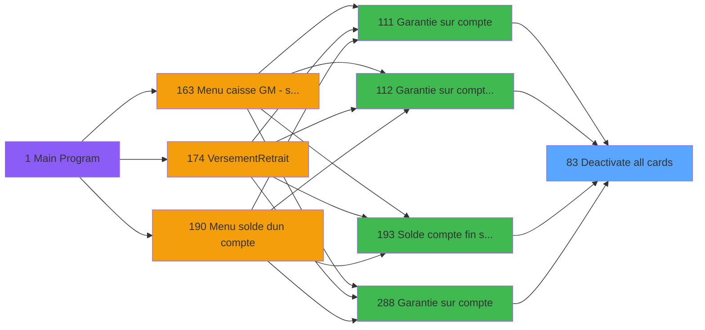

# ADH IDE 83 - Deactivate all cards

> **Analyse**: Phases 1-4 2026-02-07 06:53 -> 02:19 (19h26min) | Assemblage 02:19
> **Pipeline**: V7.2 Enrichi
> **Structure**: 4 onglets (Resume | Ecrans | Donnees | Connexions)

<!-- TAB:Resume -->

## 1. FICHE D'IDENTITE

| Attribut | Valeur |
|----------|--------|
| Projet | ADH |
| IDE Position | 83 |
| Nom Programme | Deactivate all cards |
| Fichier source | `Prg_83.xml` |
| Dossier IDE | General |
| Taches | 1 (0 ecrans visibles) |
| Tables modifiees | 1 |
| Programmes appeles | 0 |
| Complexite | **BASSE** (score 7/100) |

## 2. DESCRIPTION FONCTIONNELLE

# ADH IDE 83 - Deactivate all cards

Programme de gestion administrative des cartes Club Med. Appelé depuis les écrans de garantie (ADH IDE 111, 112, 288) et solde fin de séjour (ADH IDE 193) pour désactiver l'ensemble des cartes associées à un compte membre lors de la clôture de son séjour ou en cas de problème de garantie.

La logique désactive toutes les ezcard liées au compte en mettant à jour la table `ez_card` avec le statut d'opposition 'O' (Opposition). Cette désactivation en masse empêche tout achat ou transaction ultérieure avec ces cartes, protégeant le compte du club contre les fraudes post-départ.

Opération transactionnelle critique qui doit garantir la cohérence des données : une carte ne peut pas rester active si le compte est fermé ou en litige. Le programme est appelé systématiquement dans le workflow de fermeture de caisse (ADH IDE 121) et lors des traitements de fin de séjour pour assurer que les droits d'accès sont révoqués immédiatement.

## 3. BLOCS FONCTIONNELS

## 5. REGLES METIER

*(Aucune regle metier identifiee dans les expressions)*

## 6. CONTEXTE

- **Appele par**: [Garantie sur compte (IDE 111)](ADH-IDE-111.md), [Garantie sur compte PMS-584 (IDE 112)](ADH-IDE-112.md), [Garantie sur compte (IDE 288)](ADH-IDE-288.md), [Solde compte fin sejour (IDE 193)](ADH-IDE-193.md)
- **Appelle**: 0 programmes | **Tables**: 1 (W:1 R:0 L:0) | **Taches**: 1 | **Expressions**: 8

<!-- TAB:Ecrans -->

## 8. ECRANS

*(Programme sans ecran visible)*

## 9. NAVIGATION

### 9.3 Structure hierarchique (0 tache)

| Position | Tache | Type | Dimensions | Bloc |
|----------|-------|------|------------|------|

### 9.4 Algorigramme

> **Legende**: Vert = START/END OK | Rouge = END KO | Bleu = Decisions
> *Algorigramme auto-genere. Utiliser `/algorigramme` pour une synthese metier detaillee.*

<!-- TAB:Donnees -->

## 10. TABLES

### Tables utilisees (1)

| ID | Nom | Description | Type | R | W | L | Usages |
|----|-----|-------------|------|---|---|---|--------|
| 312 | ez_card |  | DB |   | **W** |   | 1 |

### Colonnes par table (1 / 1 tables avec colonnes identifiees)

Table 312 - ez_card (**W**) - 1 usages

| Lettre | Variable | Acces | Type |
|--------|----------|-------|------|
| A | p.societe | W | Alpha |
| B | p.code-8chiffres | W | Numeric |
| C | p.nb carte valides | W | Numeric |

## 11. VARIABLES

### 11.1 Parametres entrants (3)

Variables recues du programme appelant ([Garantie sur compte (IDE 111)](ADH-IDE-111.md)).

| Lettre | Nom | Type | Usage dans |
|--------|-----|------|-----------|
| EN | p.societe | Alpha | 1x parametre entrant |
| EO | p.code-8chiffres | Numeric | 1x parametre entrant |
| EP | p.nb carte valides | Numeric | 1x parametre entrant |

## 12. EXPRESSIONS

**8 / 8 expressions decodees (100%)**

### 12.1 Repartition par type

| Type | Expressions | Regles |
|------|-------------|--------|
| CALCULATION | 1 | 0 |
| CONSTANTE | 2 | 0 |
| DATE | 1 | 0 |
| OTHER | 3 | 0 |
| REFERENCE_VG | 1 | 0 |

### 12.2 Expressions cles par type

#### CALCULATION (1 expressions)

| Type | IDE | Expression | Regle |
|------|-----|------------|-------|
| CALCULATION | 8 | `p.nb carte valides [C]+1` | - |

#### CONSTANTE (2 expressions)

| Type | IDE | Expression | Regle |
|------|-----|------------|-------|
| CONSTANTE | 4 | `'V'` | - |
| CONSTANTE | 3 | `'O'` | - |

#### DATE (1 expressions)

| Type | IDE | Expression | Regle |
|------|-----|------------|-------|
| DATE | 5 | `Date ()` | - |

#### OTHER (3 expressions)

| Type | IDE | Expression | Regle |
|------|-----|------------|-------|
| OTHER | 6 | `Time ()` | - |
| OTHER | 2 | `p.code-8chiffres [B]` | - |
| OTHER | 1 | `p.societe [A]` | - |

#### REFERENCE_VG (1 expressions)

| Type | IDE | Expression | Regle |
|------|-----|------------|-------|
| REFERENCE_VG | 7 | `VG1` | - |

<!-- TAB:Connexions -->

## 13. GRAPHE D'APPELS

### 13.1 Chaine depuis Main (Callers)

Main -> ... -> [Garantie sur compte (IDE 111)](ADH-IDE-111.md) -> **Deactivate all cards (IDE 83)**

Main -> ... -> [Garantie sur compte PMS-584 (IDE 112)](ADH-IDE-112.md) -> **Deactivate all cards (IDE 83)**

Main -> ... -> [Garantie sur compte (IDE 288)](ADH-IDE-288.md) -> **Deactivate all cards (IDE 83)**

Main -> ... -> [Solde compte fin sejour (IDE 193)](ADH-IDE-193.md) -> **Deactivate all cards (IDE 83)**

### 13.2 Callers

| IDE | Nom Programme | Nb Appels |
|-----|---------------|-----------|
| [111](ADH-IDE-111.md) | Garantie sur compte | 2 |
| [112](ADH-IDE-112.md) | Garantie sur compte PMS-584 | 2 |
| [288](ADH-IDE-288.md) | Garantie sur compte | 2 |
| [193](ADH-IDE-193.md) | Solde compte fin sejour | 1 |

### 13.3 Callees (programmes appeles)

### 13.4 Detail Callees avec contexte

| IDE | Nom Programme | Appels | Contexte |
|-----|---------------|--------|----------|
| - | (aucun) | - | - |

## 14. RECOMMANDATIONS MIGRATION

### 14.1 Profil du programme

| Metrique | Valeur | Impact migration |
|----------|--------|-----------------|
| Lignes de logique | 16 | Programme compact |
| Expressions | 8 | Peu de logique |
| Tables WRITE | 1 | Impact faible |
| Sous-programmes | 0 | Peu de dependances |
| Ecrans visibles | 0 | Ecran unique ou traitement batch |
| Code desactive | 0% (0 / 16) | Code sain |
| Regles metier | 0 | Pas de regle identifiee |

### 14.2 Plan de migration par bloc

### 14.3 Dependances critiques

| Dependance | Type | Appels | Impact |
|------------|------|--------|--------|
| ez_card | Table WRITE (Database) | 1x | Schema + repository |

---
*Spec DETAILED generee par Pipeline V7.2 - 2026-02-08 02:20*
