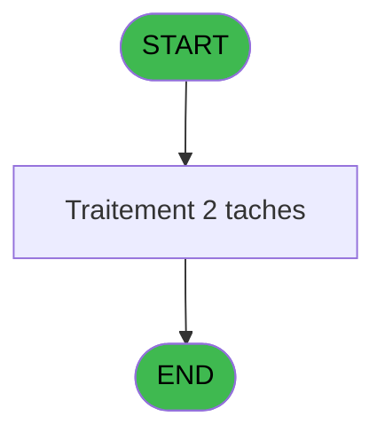
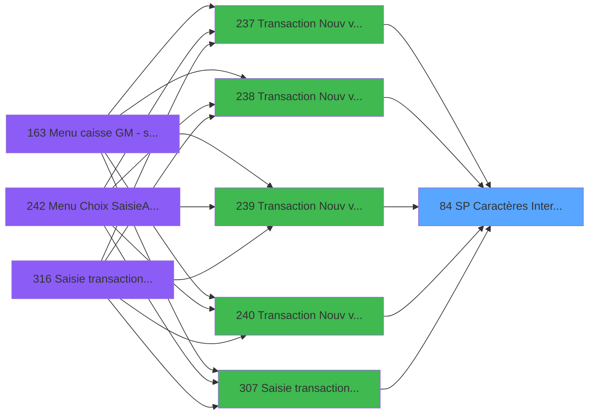

# ADH IDE 84 - SP Caractères Interdits

> **Analyse**: Phases 1-4 2026-02-07 03:45 -> 03:45 (27s) | Assemblage 06:53
> **Pipeline**: V7.2 Enrichi
> **Structure**: 4 onglets (Resume | Ecrans | Donnees | Connexions)

<!-- TAB:Resume -->

## 1. FICHE D'IDENTITE

| Attribut | Valeur |
|----------|--------|
| Projet | ADH |
| IDE Position | 84 |
| Nom Programme | SP Caractères Interdits |
| Fichier source | `Prg_84.xml` |
| Dossier IDE | EzCard |
| Taches | 2 (0 ecrans visibles) |
| Tables modifiees | 0 |
| Programmes appeles | 0 |

## 2. DESCRIPTION FONCTIONNELLE

**SP Caractères Interdits** assure la gestion complete de ce processus, accessible depuis [Transaction Nouv vente avec GP (IDE 237)](ADH-IDE-237.md), [Transaction Nouv vente PMS-584 (IDE 238)](ADH-IDE-238.md), [Transaction Nouv vente PMS-721 (IDE 239)](ADH-IDE-239.md), [Transaction Nouv vente PMS-710 (IDE 240)](ADH-IDE-240.md), [Saisie transaction 154  N.U (IDE 307)](ADH-IDE-307.md), [Saisie transaction Nouv vente (IDE 310)](ADH-IDE-310.md), [Saisie transaction Nouv vente (IDE 316)](ADH-IDE-316.md).

Le flux de traitement s'organise en **2 blocs fonctionnels** :

- **Validation** (1 tache) : controles et verifications de coherence
- **Traitement** (1 tache) : traitements metier divers

Detail : phases du traitement

#### Phase 1 : Traitement (1 tache)

- **T1** - Caractères Interdits

#### Phase 2 : Validation (1 tache)

- **T2** - Verification Chaine

## 3. BLOCS FONCTIONNELS

### 3.1 Traitement (1 tache)

Traitements internes.

---

#### T1 - Caractères Interdits

**Role** : Traitement : Caractères Interdits.

### 3.2 Validation (1 tache)

Controles de coherence : 1 tache verifie les donnees et conditions.

---

#### T2 - Verification Chaine

**Role** : Verification : Verification Chaine.

## 5. REGLES METIER

*(Aucune regle metier identifiee)*

## 6. CONTEXTE

- **Appele par**: [Transaction Nouv vente avec GP (IDE 237)](ADH-IDE-237.md), [Transaction Nouv vente PMS-584 (IDE 238)](ADH-IDE-238.md), [Transaction Nouv vente PMS-721 (IDE 239)](ADH-IDE-239.md), [Transaction Nouv vente PMS-710 (IDE 240)](ADH-IDE-240.md), [Saisie transaction 154  N.U (IDE 307)](ADH-IDE-307.md), [Saisie transaction Nouv vente (IDE 310)](ADH-IDE-310.md), [Saisie transaction Nouv vente (IDE 316)](ADH-IDE-316.md)
- **Appelle**: 0 programmes | **Tables**: 0 (W:0 R:0 L:0) | **Taches**: 2 | **Expressions**: 2

<!-- TAB:Ecrans -->

## 8. ECRANS

*(Programme sans ecran visible)*

## 9. NAVIGATION

### 9.3 Structure hierarchique (2 taches)

| Position | Tache | Type | Dimensions | Bloc |
|----------|-------|------|------------|------|
| **84.1** | [**Caractères Interdits** (T1)](#t1) | MDI | - | Traitement |
| **84.2** | [**Verification Chaine** (T2)](#t2) | MDI | - | Validation |

### 9.4 Algorigramme

> *algo-data indisponible. Utiliser `/algorigramme` pour generer.*

<!-- TAB:Donnees -->

## 10. TABLES

### Tables utilisees (0)

| ID | Nom | Description | Type | R | W | L | Usages |
|----|-----|-------------|------|---|---|---|--------|

### Colonnes par table (0 / 0 tables avec colonnes identifiees)

## 11. VARIABLES

### 11.1 Autres (4)

Variables diverses.

| Lettre | Nom | Type | Usage dans |
|--------|-----|------|-----------|
| A | P0-Code | Alpha | - |
| B | P0-Accord Suite | Alpha | - |
| C | P0-N/P | Alpha | - |
| D | W0-Fin de Tache | Alpha | 1x refs |

## 12. EXPRESSIONS

**2 / 2 expressions decodees (100%)**

### 12.1 Repartition par type

| Type | Expressions | Regles |
|------|-------------|--------|
| CONSTANTE | 1 | 0 |
| CONDITION | 1 | 0 |

### 12.2 Expressions cles par type

#### CONSTANTE (1 expressions)

| Type | IDE | Expression | Regle |
|------|-----|------------|-------|
| CONSTANTE | 1 | `'F'` | - |

#### CONDITION (1 expressions)

| Type | IDE | Expression | Regle |
|------|-----|------------|-------|
| CONDITION | 2 | `W0-Fin de Tache [D]='F'` | - |

<!-- TAB:Connexions -->

## 13. GRAPHE D'APPELS

### 13.1 Chaine depuis Main (Callers)

Main -> ... -> [Transaction Nouv vente avec GP (IDE 237)](ADH-IDE-237.md) -> **SP Caractères Interdits (IDE 84)**

Main -> ... -> [Transaction Nouv vente PMS-584 (IDE 238)](ADH-IDE-238.md) -> **SP Caractères Interdits (IDE 84)**

Main -> ... -> [Transaction Nouv vente PMS-721 (IDE 239)](ADH-IDE-239.md) -> **SP Caractères Interdits (IDE 84)**

Main -> ... -> [Transaction Nouv vente PMS-710 (IDE 240)](ADH-IDE-240.md) -> **SP Caractères Interdits (IDE 84)**

Main -> ... -> [Saisie transaction 154  N.U (IDE 307)](ADH-IDE-307.md) -> **SP Caractères Interdits (IDE 84)**

Main -> ... -> [Saisie transaction Nouv vente (IDE 310)](ADH-IDE-310.md) -> **SP Caractères Interdits (IDE 84)**

Main -> ... -> [Saisie transaction Nouv vente (IDE 316)](ADH-IDE-316.md) -> **SP Caractères Interdits (IDE 84)**

### 13.2 Callers

| IDE | Nom Programme | Nb Appels |
|-----|---------------|-----------|
| [237](ADH-IDE-237.md) | Transaction Nouv vente avec GP | 2 |
| [238](ADH-IDE-238.md) | Transaction Nouv vente PMS-584 | 2 |
| [239](ADH-IDE-239.md) | Transaction Nouv vente PMS-721 | 2 |
| [240](ADH-IDE-240.md) | Transaction Nouv vente PMS-710 | 2 |
| [307](ADH-IDE-307.md) | Saisie transaction 154  N.U | 2 |
| [310](ADH-IDE-310.md) | Saisie transaction Nouv vente | 2 |
| [316](ADH-IDE-316.md) | Saisie transaction Nouv vente | 2 |

### 13.3 Callees (programmes appeles)

### 13.4 Detail Callees avec contexte

| IDE | Nom Programme | Appels | Contexte |
|-----|---------------|--------|----------|
| - | (aucun) | - | - |

## 14. RECOMMANDATIONS MIGRATION

### 14.1 Profil du programme

| Metrique | Valeur | Impact migration |
|----------|--------|-----------------|
| Lignes de logique | 19 | Programme compact |
| Expressions | 2 | Peu de logique |
| Tables WRITE | 0 | Impact faible |
| Sous-programmes | 0 | Peu de dependances |
| Ecrans visibles | 0 | Ecran unique ou traitement batch |
| Code desactive | 0% (0 / 19) | Code sain |
| Regles metier | 0 | Pas de regle identifiee |

### 14.2 Plan de migration par bloc

#### Traitement (1 tache: 0 ecran, 1 traitement)

- **Strategie** : 1 service(s) backend injectable(s) (Domain Services).
- Decomposer les taches en services unitaires testables.

#### Validation (1 tache: 0 ecran, 1 traitement)

- **Strategie** : FluentValidation avec validators specifiques.
- Chaque tache de validation -> un validator injectable

### 14.3 Dependances critiques

| Dependance | Type | Appels | Impact |
|------------|------|--------|--------|

---
*Spec DETAILED generee par Pipeline V7.2 - 2026-02-07 06:53*
