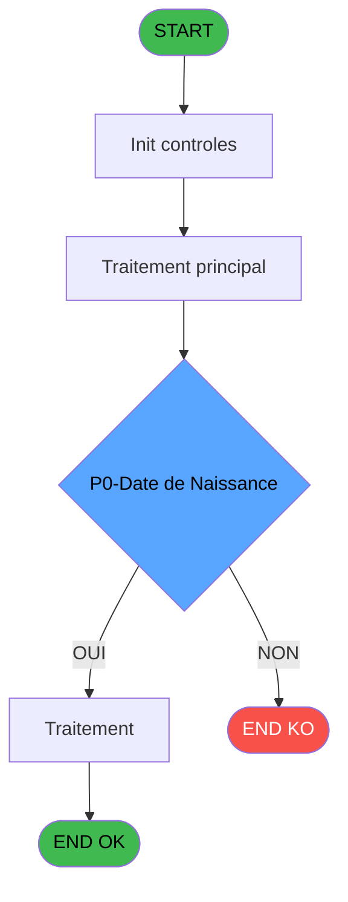

# ADH IDE 85 - Determine Age Debut Sejour

> **Analyse**: Phases 1-4 2026-02-07 06:53 -> 02:20 (19h27min) | Assemblage 02:20
> **Pipeline**: V7.2 Enrichi
> **Structure**: 4 onglets (Resume | Ecrans | Donnees | Connexions)

<!-- TAB:Resume -->

## 1. FICHE D'IDENTITE

| Attribut | Valeur |
|----------|--------|
| Projet | ADH |
| IDE Position | 85 |
| Nom Programme | Determine Age Debut Sejour |
| Fichier source | `Prg_85.xml` |
| Dossier IDE | General |
| Taches | 1 (0 ecrans visibles) |
| Tables modifiees | 0 |
| Programmes appeles | 0 |
| Complexite | **BASSE** (score 0/100) |
| Statut | **ORPHELIN_POTENTIEL** |

## 2. DESCRIPTION FONCTIONNELLE

ADH IDE 85 calcule l'âge d'un adhérent au moment du début de son séjour. Ce programme reçoit en paramètres la date de naissance et la date de début de séjour, puis retourne l'âge calculé. C'est une fonction utilitaire simple, couramment utilisée dans les modules de gestion de séjours pour déterminer la tranche d'âge d'un client et appliquer les tarifs ou restrictions correspondantes.

La logique repose sur une soustraction simple entre l'année du début de séjour et l'année de naissance, ajustée selon que l'anniversaire est survenu ou non dans l'année en cours. Le programme gère les cas limites comme les dates invalides ou les naissances futures, et retourne un résultat entier représentant l'âge en années complètes.

Ce programme s'inscrit dans la chaîne de gestion des adhérents (ADH) et est probablement appelé lors de la création ou modification d'une réservation de séjour. Il fait partie des utilitaires de calcul métier standard du système de gestion des clubs, similaires aux autres programmes de calcul d'âge ou de durée présents dans le module ADH.

## 3. BLOCS FONCTIONNELS

## 5. REGLES METIER

9 regles identifiees:

### Autres (9 regles)

#### [RM-001] Si P0-Date debut Sejour [B]='00/00/0000'DATE alors Date () sinon P0-Date debut Sejour [B])

| Element | Detail |
|---------|--------|
| **Condition** | `P0-Date debut Sejour [B]='00/00/0000'DATE` |
| **Si vrai** | Date () |
| **Si faux** | P0-Date debut Sejour [B]) |
| **Variables** | EO (P0-Date debut Sejour) |
| **Expression source** | Expression 1 : `IF (P0-Date debut Sejour [B]='00/00/0000'DATE,Date (),P0-Dat` |
| **Exemple** | Si P0-Date debut Sejour [B]='00/00/0000'DATE → Date (). Sinon → P0-Date debut Sejour [B]) |

#### [RM-002] Condition: P0-Date de Naissance [A] superieur a 0

| Element | Detail |
|---------|--------|
| **Condition** | `P0-Date de Naissance [A]>0` |
| **Si vrai** | Action si vrai |
| **Variables** | EN (P0-Date de Naissance) |
| **Expression source** | Expression 2 : `P0-Date de Naissance [A]>0` |
| **Exemple** | Si P0-Date de Naissance [A]>0 → Action si vrai |

#### [RM-003] Condition composite: Month (W0 Date debut sejour [F])=Month (P0-Date de Naissance [A]) AND Day (W0 Date debut sejour [F])<Day (P0-Date de Naissance [A])

| Element | Detail |
|---------|--------|
| **Condition** | `Month (W0 Date debut sejour [F])=Month (P0-Date de Naissance [A]) AND Day (W0 Date debut sejour [F])<Day (P0-Date de Naissance [A])` |
| **Si vrai** | Action si vrai |
| **Variables** | ES (W0 Date debut sejour), EN (P0-Date de Naissance) |
| **Expression source** | Expression 6 : `Month (W0 Date debut sejour [F])=Month (P0-Date de Naissance` |
| **Exemple** | Si Month (W0 Date debut sejour [F])=Month (P0-Date de Naissance [A]) AND Day (W0 Date debut sejour [F])<Day (P0-Date de Naissance [A]) → Action si vrai |

#### [RM-004] Condition: P0-Age [C] superieur a 0

| Element | Detail |
|---------|--------|
| **Condition** | `P0-Age [C]>0` |
| **Si vrai** | Action si vrai |
| **Variables** | EP (P0-Age) |
| **Expression source** | Expression 7 : `P0-Age [C]>0` |
| **Exemple** | Si P0-Age [C]>0 → Action si vrai |

#### [RM-005] Si P0-Age [C]>100 alors ASCIIChr (200) sinon ASCIIChr (P0-Age [C]+100))

| Element | Detail |
|---------|--------|
| **Condition** | `P0-Age [C]>100` |
| **Si vrai** | ASCIIChr (200) |
| **Si faux** | ASCIIChr (P0-Age [C]+100)) |
| **Variables** | EP (P0-Age) |
| **Expression source** | Expression 8 : `IF (P0-Age [C]>100,ASCIIChr (200),ASCIIChr (P0-Age [C]+100))` |
| **Exemple** | Si P0-Age [C]>100 → ASCIIChr (200). Sinon → ASCIIChr (P0-Age [C]+100)) |

#### [RM-006] Condition: P0-Age [C] egale 0

| Element | Detail |
|---------|--------|
| **Condition** | `P0-Age [C]=0` |
| **Si vrai** | Action si vrai |
| **Variables** | EP (P0-Age) |
| **Expression source** | Expression 9 : `P0-Age [C]=0` |
| **Exemple** | Si P0-Age [C]=0 → Action si vrai |

#### [RM-007] Si Month (W0 Date debut sejour [F])<=Month (P0-Date de Naissance [A]) alors Month (W0 Date debut sejour [F])+12-Month (P0-Date de Naissance [A]) sinon Month (W0 Date debut sejour [F])-Month (P0-Date de Naissance [A]))

| Element | Detail |
|---------|--------|
| **Condition** | `Month (W0 Date debut sejour [F])<=Month (P0-Date de Naissance [A])` |
| **Si vrai** | Month (W0 Date debut sejour [F])+12-Month (P0-Date de Naissance [A]) |
| **Si faux** | Month (W0 Date debut sejour [F])-Month (P0-Date de Naissance [A])) |
| **Variables** | ES (W0 Date debut sejour), EN (P0-Date de Naissance) |
| **Expression source** | Expression 10 : `IF (Month (W0 Date debut sejour [F])<=Month (P0-Date de Nais` |
| **Exemple** | Si Month (W0 Date debut sejour [F])<=Month (P0-Date de Naissance [A]) → Month (W0 Date debut sejour [F])+12-Month (P0-Date de Naissance [A]) |

#### [RM-008] Condition: W0 Nb de Mois [G]=0 OR W0 Nb de Mois [G] egale 12

| Element | Detail |
|---------|--------|
| **Condition** | `W0 Nb de Mois [G]=0 OR W0 Nb de Mois [G]=12` |
| **Si vrai** | Action si vrai |
| **Variables** | ET (W0 Nb de Mois) |
| **Expression source** | Expression 13 : `W0 Nb de Mois [G]=0 OR W0 Nb de Mois [G]=12` |
| **Exemple** | Si W0 Nb de Mois [G]=0 OR W0 Nb de Mois [G]=12 → Action si vrai |

#### [RM-009] Condition: P0-Date de Naissance [A] <= 0

| Element | Detail |
|---------|--------|
| **Condition** | `P0-Date de Naissance [A]<=0` |
| **Si vrai** | Action si vrai |
| **Variables** | EN (P0-Date de Naissance) |
| **Expression source** | Expression 16 : `P0-Date de Naissance [A]<=0` |
| **Exemple** | Si P0-Date de Naissance [A]<=0 → Action si vrai |

## 6. CONTEXTE

- **Appele par**: (aucun)
- **Appelle**: 0 programmes | **Tables**: 0 (W:0 R:0 L:0) | **Taches**: 1 | **Expressions**: 19

<!-- TAB:Ecrans -->

## 8. ECRANS

*(Programme sans ecran visible)*

## 9. NAVIGATION

### 9.3 Structure hierarchique (0 tache)

| Position | Tache | Type | Dimensions | Bloc |
|----------|-------|------|------------|------|

### 9.4 Algorigramme

> **Legende**: Vert = START/END OK | Rouge = END KO | Bleu = Decisions
> *Algorigramme auto-genere. Utiliser `/algorigramme` pour une synthese metier detaillee.*

<!-- TAB:Donnees -->

## 10. TABLES

### Tables utilisees (0)

| ID | Nom | Description | Type | R | W | L | Usages |
|----|-----|-------------|------|---|---|---|--------|

### Colonnes par table (0 / 0 tables avec colonnes identifiees)

## 11. VARIABLES

### 11.1 Variables de travail (2)

Variables internes au programme.

| Lettre | Nom | Type | Usage dans |
|--------|-----|------|-----------|
| ES | W0 Date debut sejour | Date | 5x calcul interne |
| ET | W0 Nb de Mois | Numeric | 4x calcul interne |

### 11.2 Autres (5)

Variables diverses.

| Lettre | Nom | Type | Usage dans |
|--------|-----|------|-----------|
| EN | P0-Date de Naissance | Date | 7x refs |
| EO | P0-Date debut Sejour | Date | 1x refs |
| EP | P0-Age | Numeric | 4x refs |
| EQ | P0-Age Codifie | Alpha | - |
| ER | P0-Nb mois | Numeric | - |

## 12. EXPRESSIONS

**19 / 19 expressions decodees (100%)**

### 12.1 Repartition par type

| Type | Expressions | Regles |
|------|-------------|--------|
| CALCULATION | 4 | 0 |
| CONDITION | 11 | 9 |
| CONSTANTE | 2 | 0 |
| OTHER | 2 | 0 |

### 12.2 Expressions cles par type

#### CALCULATION (4 expressions)

| Type | IDE | Expression | Regle |
|------|-----|------------|-------|
| CALCULATION | 12 | `W0 Nb de Mois [G]-1` | - |
| CALCULATION | 15 | `ASCIIChr (80+W0 Nb de Mois [G])` | - |
| CALCULATION | 3 | `Year (W0 Date debut sejour [F])-Year (P0-Date de Naissance [A])` | - |
| CALCULATION | 5 | `P0-Age [C]-1` | - |

#### CONDITION (11 expressions)

| Type | IDE | Expression | Regle |
|------|-----|------------|-------|
| CONDITION | 10 | `IF (Month (W0 Date debut sejour [F])<=Month (P0-Date de Naissance [A]),Month (W0 Date debut sejour [F])+12-Month (P0-Date de Naissance [A]),Month (W0 Date debut sejour [F])-Month (P0-Date de Naissance [A]))` | [RM-007](#rm-RM-007) |
| CONDITION | 9 | `P0-Age [C]=0` | [RM-006](#rm-RM-006) |
| CONDITION | 16 | `P0-Date de Naissance [A]<=0` | [RM-009](#rm-RM-009) |
| CONDITION | 13 | `W0 Nb de Mois [G]=0 OR W0 Nb de Mois [G]=12` | [RM-008](#rm-RM-008) |
| CONDITION | 8 | `IF (P0-Age [C]>100,ASCIIChr (200),ASCIIChr (P0-Age [C]+100))` | [RM-005](#rm-RM-005) |
| ... | | *+6 autres* | |

#### CONSTANTE (2 expressions)

| Type | IDE | Expression | Regle |
|------|-----|------------|-------|
| CONSTANTE | 17 | `0` | - |
| CONSTANTE | 14 | `1` | - |

#### OTHER (2 expressions)

| Type | IDE | Expression | Regle |
|------|-----|------------|-------|
| OTHER | 19 | `W0 Nb de Mois [G]` | - |
| OTHER | 18 | `ASCIIChr (80)` | - |

<!-- TAB:Connexions -->

## 13. GRAPHE D'APPELS

### 13.1 Chaine depuis Main (Callers)

**Chemin**: (pas de callers directs)

### 13.2 Callers

| IDE | Nom Programme | Nb Appels |
|-----|---------------|-----------|
| - | (aucun) | - |

### 13.3 Callees (programmes appeles)

### 13.4 Detail Callees avec contexte

| IDE | Nom Programme | Appels | Contexte |
|-----|---------------|--------|----------|
| - | (aucun) | - | - |

## 14. RECOMMANDATIONS MIGRATION

### 14.1 Profil du programme

| Metrique | Valeur | Impact migration |
|----------|--------|-----------------|
| Lignes de logique | 30 | Programme compact |
| Expressions | 19 | Peu de logique |
| Tables WRITE | 0 | Impact faible |
| Sous-programmes | 0 | Peu de dependances |
| Ecrans visibles | 0 | Ecran unique ou traitement batch |
| Code desactive | 0% (0 / 30) | Code sain |
| Regles metier | 9 | Quelques regles a preserver |

### 14.2 Plan de migration par bloc

### 14.3 Dependances critiques

| Dependance | Type | Appels | Impact |
|------------|------|--------|--------|

---
*Spec DETAILED generee par Pipeline V7.2 - 2026-02-08 02:21*
