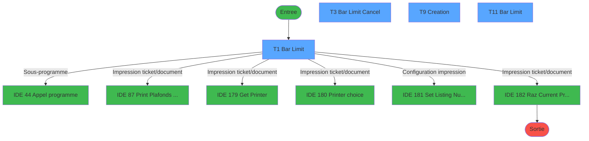
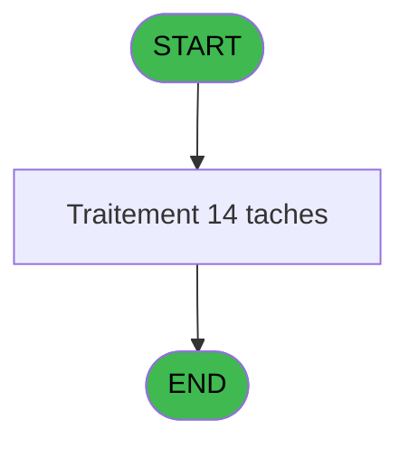
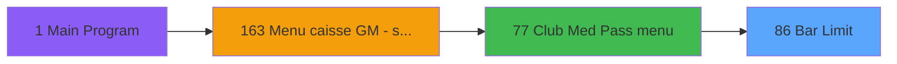

# ADH IDE 86 - Bar Limit

> **Analyse**: Phases 1-4 2026-02-07 03:45 -> 03:45 (27s) | Assemblage 06:54
> **Pipeline**: V7.2 Enrichi
> **Structure**: 4 onglets (Resume | Ecrans | Donnees | Connexions)

<!-- TAB:Resume -->

## 1. FICHE D'IDENTITE

| Attribut | Valeur |
|----------|--------|
| Projet | ADH |
| IDE Position | 86 |
| Nom Programme | Bar Limit |
| Fichier source | `Prg_86.xml` |
| Dossier IDE | EzCard |
| Taches | 14 (4 ecrans visibles) |
| Tables modifiees | 1 |
| Programmes appeles | 6 |

## 2. DESCRIPTION FONCTIONNELLE

**Bar Limit** assure la gestion complete de ce processus, accessible depuis [Club Med Pass menu (IDE 77)](ADH-IDE-77.md).

Le flux de traitement s'organise en **3 blocs fonctionnels** :

- **Traitement** (9 taches) : traitements metier divers
- **Creation** (3 taches) : insertion d'enregistrements en base (mouvements, prestations)
- **Validation** (2 taches) : controles et verifications de coherence

**Donnees modifiees** : 1 tables en ecriture (ez_card).

Detail : phases du traitement

#### Phase 1 : Traitement (9 taches)

- **T1** - Bar Limit **[ECRAN]**
- **T3** - Bar Limit Cancel **[ECRAN]**
- **T5** - Plafond actuel
- **T6** - plafond reste
- **T7** - derniere annulation
- **T11** - Bar Limit **[ECRAN]**
- **T12** - Plafond actuel
- **T13** - derniere annulation
- **T14** - plafond reste

Delegue a : [Appel programme (IDE 44)](ADH-IDE-44.md), [Set Listing Number (IDE 181)](ADH-IDE-181.md)

#### Phase 2 : Creation (3 taches)

- **T2** - Create **[ECRAN]**
- **T8** - Create **[ECRAN]**
- **T9** - Creation **[ECRAN]**

#### Phase 3 : Validation (2 taches)

- **T4** - validate D/C GO **[ECRAN]**
- **T10** - validate D/C GO **[ECRAN]**

#### Tables impactees

| Table | Operations | Role metier |
|-------|-----------|-------------|
| ez_card | R/**W** (4 usages) |  |

## 3. BLOCS FONCTIONNELS

### 3.1 Traitement (9 taches)

Traitements internes.

---

#### T1 - Bar Limit [ECRAN]

**Role** : Tache d'orchestration : point d'entree du programme (9 sous-taches). Coordonne l'enchainement des traitements.
**Ecran** : 806 x 235 DLU (MDI) | [Voir mockup](#ecran-t1)

8 sous-taches directes

| Tache | Nom | Bloc |
|-------|-----|------|
| [T3](#t3) | Bar Limit Cancel **[ECRAN]** | Traitement |
| [T5](#t5) | Plafond actuel | Traitement |
| [T6](#t6) | plafond reste | Traitement |
| [T7](#t7) | derniere annulation | Traitement |
| [T11](#t11) | Bar Limit **[ECRAN]** | Traitement |
| [T12](#t12) | Plafond actuel | Traitement |
| [T13](#t13) | derniere annulation | Traitement |
| [T14](#t14) | plafond reste | Traitement |

**Delegue a** : [Appel programme (IDE 44)](ADH-IDE-44.md), [Set Listing Number (IDE 181)](ADH-IDE-181.md)

---

#### T3 - Bar Limit Cancel [ECRAN]

**Role** : Traitement : Bar Limit Cancel.
**Ecran** : 627 x 121 DLU (MDI) | [Voir mockup](#ecran-t3)
**Delegue a** : [Appel programme (IDE 44)](ADH-IDE-44.md), [Set Listing Number (IDE 181)](ADH-IDE-181.md)

---

#### T5 - Plafond actuel

**Role** : Traitement : Plafond actuel.
**Variables liees** : G (v.plafond actuel), H (v.plafond reste)
**Delegue a** : [Appel programme (IDE 44)](ADH-IDE-44.md), [Set Listing Number (IDE 181)](ADH-IDE-181.md)

---

#### T6 - plafond reste

**Role** : Traitement : plafond reste.
**Variables liees** : G (v.plafond actuel), H (v.plafond reste)
**Delegue a** : [Appel programme (IDE 44)](ADH-IDE-44.md), [Set Listing Number (IDE 181)](ADH-IDE-181.md)

---

#### T7 - derniere annulation

**Role** : Traitement : derniere annulation.
**Variables liees** : J (V.Date derniere annulation), K (V.Time derniere annulation)
**Delegue a** : [Appel programme (IDE 44)](ADH-IDE-44.md), [Set Listing Number (IDE 181)](ADH-IDE-181.md)

---

#### T11 - Bar Limit [ECRAN]

**Role** : Traitement : Bar Limit.
**Ecran** : 803 x 121 DLU (Modal) | [Voir mockup](#ecran-t11)
**Delegue a** : [Appel programme (IDE 44)](ADH-IDE-44.md), [Set Listing Number (IDE 181)](ADH-IDE-181.md)

---

#### T12 - Plafond actuel

**Role** : Traitement : Plafond actuel.
**Variables liees** : G (v.plafond actuel), H (v.plafond reste)
**Delegue a** : [Appel programme (IDE 44)](ADH-IDE-44.md), [Set Listing Number (IDE 181)](ADH-IDE-181.md)

---

#### T13 - derniere annulation

**Role** : Traitement : derniere annulation.
**Variables liees** : J (V.Date derniere annulation), K (V.Time derniere annulation)
**Delegue a** : [Appel programme (IDE 44)](ADH-IDE-44.md), [Set Listing Number (IDE 181)](ADH-IDE-181.md)

---

#### T14 - plafond reste

**Role** : Traitement : plafond reste.
**Variables liees** : G (v.plafond actuel), H (v.plafond reste)
**Delegue a** : [Appel programme (IDE 44)](ADH-IDE-44.md), [Set Listing Number (IDE 181)](ADH-IDE-181.md)

### 3.2 Creation (3 taches)

Insertion de nouveaux enregistrements en base.

---

#### T2 - Create [ECRAN]

**Role** : Traitement : Create.
**Ecran** : 144 x 59 DLU (MDI) | [Voir mockup](#ecran-t2)

---

#### T8 - Create [ECRAN]

**Role** : Traitement : Create.
**Ecran** : 144 x 59 DLU (MDI) | [Voir mockup](#ecran-t8)

---

#### T9 - Creation [ECRAN]

**Role** : Creation d'enregistrement : Creation.
**Ecran** : 627 x 121 DLU (MDI) | [Voir mockup](#ecran-t9)

### 3.3 Validation (2 taches)

Controles de coherence : 2 taches verifient les donnees et conditions.

---

#### T4 - validate D/C GO [ECRAN]

**Role** : Verification : validate D/C GO.
**Ecran** : 127 x 81 DLU (MDI) | [Voir mockup](#ecran-t4)

---

#### T10 - validate D/C GO [ECRAN]

**Role** : Verification : validate D/C GO.
**Ecran** : 127 x 81 DLU (MDI) | [Voir mockup](#ecran-t10)

## 5. REGLES METIER

*(Aucune regle metier identifiee)*

## 6. CONTEXTE

- **Appele par**: [Club Med Pass menu (IDE 77)](ADH-IDE-77.md)
- **Appelle**: 6 programmes | **Tables**: 3 (W:1 R:3 L:1) | **Taches**: 14 | **Expressions**: 11

<!-- TAB:Ecrans -->

## 8. ECRANS

### 8.1 Forms visibles (4 / 14)

| # | Position | Tache | Nom | Type | Largeur | Hauteur | Bloc |
|---|----------|-------|-----|------|---------|---------|------|
| 1 | 86 | T1 | Bar Limit | MDI | 806 | 235 | Traitement |
| 2 | 86.1.1 | T3 | Bar Limit Cancel | MDI | 627 | 121 | Traitement |
| 3 | 86.2.1 | T9 | Creation | MDI | 627 | 121 | Creation |
| 4 | 86.3 | T11 | Bar Limit | Modal | 803 | 121 | Traitement |

### 8.2 Mockups Ecrans

---

#### 86 - Bar Limit
**Tache** : [T1](#t1) | **Type** : MDI | **Dimensions** : 806 x 235 DLU
**Bloc** : Traitement | **Titre IDE** : Bar Limit

<!-- FORM-DATA:
{
    "width":  806,
    "vFactor":  8,
    "type":  "MDI",
    "hFactor":  8,
    "controls":  [
                     {
                         "x":  0,
                         "type":  "label",
                         "var":  "",
                         "y":  1,
                         "w":  806,
                         "fmt":  "",
                         "name":  "",
                         "h":  21,
                         "color":  "",
                         "text":  "",
                         "parent":  null
                     },
                     {
                         "x":  0,
                         "type":  "label",
                         "var":  "",
                         "y":  211,
                         "w":  806,
                         "fmt":  "",
                         "name":  "",
                         "h":  24,
                         "color":  "",
                         "text":  "",
                         "parent":  null
                     },
                     {
                         "x":  52,
                         "type":  "label",
                         "var":  "",
                         "y":  150,
                         "w":  459,
                         "fmt":  "",
                         "name":  "",
                         "h":  56,
                         "color":  "",
                         "text":  "",
                         "parent":  null
                     },
                     {
                         "x":  56,
                         "type":  "label",
                         "var":  "",
                         "y":  152,
                         "w":  449,
                         "fmt":  "",
                         "name":  "",
                         "h":  53,
                         "color":  "",
                         "text":  "",
                         "parent":  8
                     },
                     {
                         "x":  59,
                         "type":  "label",
                         "var":  "",
                         "y":  154,
                         "w":  42,
                         "fmt":  "",
                         "name":  "",
                         "h":  50,
                         "color":  "",
                         "text":  "",
                         "parent":  8
                     },
                     {
                         "x":  112,
                         "type":  "label",
                         "var":  "",
                         "y":  158,
                         "w":  170,
                         "fmt":  "",
                         "name":  "",
                         "h":  9,
                         "color":  "142",
                         "text":  "Création",
                         "parent":  8
                     },
                     {
                         "x":  112,
                         "type":  "label",
                         "var":  "",
                         "y":  174,
                         "w":  170,
                         "fmt":  "",
                         "name":  "",
                         "h":  9,
                         "color":  "142",
                         "text":  "Annulation",
                         "parent":  8
                     },
                     {
                         "x":  112,
                         "type":  "label",
                         "var":  "",
                         "y":  190,
                         "w":  170,
                         "fmt":  "",
                         "name":  "",
                         "h":  9,
                         "color":  "142",
                         "text":  "Edition",
                         "parent":  8
                     },
                     {
                         "x":  305,
                         "type":  "label",
                         "var":  "",
                         "y":  190,
                         "w":  120,
                         "fmt":  "",
                         "name":  "",
                         "h":  9,
                         "color":  "",
                         "text":  "Votre choix",
                         "parent":  8
                     },
                     {
                         "x":  433,
                         "type":  "edit",
                         "var":  "",
                         "y":  190,
                         "w":  26,
                         "fmt":  "UA",
                         "name":  "v.choix action",
                         "h":  9,
                         "color":  "6",
                         "text":  "",
                         "parent":  8
                     },
                     {
                         "x":  5,
                         "type":  "image",
                         "var":  "",
                         "y":  3,
                         "w":  59,
                         "fmt":  "",
                         "name":  "",
                         "h":  18,
                         "color":  "",
                         "text":  "",
                         "parent":  null
                     },
                     {
                         "x":  77,
                         "type":  "edit",
                         "var":  "",
                         "y":  7,
                         "w":  267,
                         "fmt":  "30",
                         "name":  "",
                         "h":  8,
                         "color":  "",
                         "text":  "",
                         "parent":  null
                     },
                     {
                         "x":  514,
                         "type":  "edit",
                         "var":  "",
                         "y":  7,
                         "w":  259,
                         "fmt":  "WWW DD MMM YYYYT",
                         "name":  "",
                         "h":  8,
                         "color":  "",
                         "text":  "",
                         "parent":  null
                     },
                     {
                         "x":  594,
                         "type":  "image",
                         "var":  "",
                         "y":  152,
                         "w":  159,
                         "fmt":  "",
                         "name":  "",
                         "h":  53,
                         "color":  "",
                         "text":  "",
                         "parent":  null
                     },
                     {
                         "x":  67,
                         "type":  "button",
                         "var":  "",
                         "y":  158,
                         "w":  27,
                         "fmt":  "A",
                         "name":  "A",
                         "h":  9,
                         "color":  "",
                         "text":  "",
                         "parent":  null
                     },
                     {
                         "x":  67,
                         "type":  "button",
                         "var":  "",
                         "y":  174,
                         "w":  27,
                         "fmt":  "B",
                         "name":  "B",
                         "h":  9,
                         "color":  "",
                         "text":  "",
                         "parent":  null
                     },
                     {
                         "x":  67,
                         "type":  "button",
                         "var":  "",
                         "y":  190,
                         "w":  27,
                         "fmt":  "C",
                         "name":  "C",
                         "h":  9,
                         "color":  "",
                         "text":  "",
                         "parent":  null
                     },
                     {
                         "x":  8,
                         "type":  "button",
                         "var":  "",
                         "y":  214,
                         "w":  154,
                         "fmt":  "\u0026Quitter",
                         "name":  "",
                         "h":  18,
                         "color":  "",
                         "text":  "",
                         "parent":  6
                     },
                     {
                         "x":  631,
                         "type":  "button",
                         "var":  "",
                         "y":  214,
                         "w":  168,
                         "fmt":  "Printer",
                         "name":  "",
                         "h":  18,
                         "color":  "",
                         "text":  "",
                         "parent":  null
                     },
                     {
                         "x":  0,
                         "type":  "subform",
                         "var":  "",
                         "y":  23,
                         "w":  805,
                         "fmt":  "",
                         "name":  "LISTEOPE",
                         "h":  126,
                         "color":  "",
                         "text":  "",
                         "parent":  null
                     }
                 ],
    "taskId":  "86",
    "height":  235
}
-->

<strong>Champs : 3 champs</strong>

| Pos (x,y) | Nom | Variable | Type |
|-----------|-----|----------|------|
| 433,190 | v.choix action | - | edit |
| 77,7 | 30 | - | edit |
| 514,7 | WWW DD MMM YYYYT | - | edit |

<strong>Boutons : 5 boutons</strong>

| Bouton | Pos (x,y) | Action |
|--------|-----------|--------|
| A | 67,158 | Bouton fonctionnel |
| B | 67,174 | Bouton fonctionnel |
| C | 67,190 | Bouton fonctionnel |
| Quitter | 8,214 | Quitte le programme |
| Printer | 631,214 | Appel [    Print Plafonds alloués (IDE 87)](ADH-IDE-87.md) |

---

#### 86.1.1 - Bar Limit Cancel
**Tache** : [T3](#t3) | **Type** : MDI | **Dimensions** : 627 x 121 DLU
**Bloc** : Traitement | **Titre IDE** : Bar Limit Cancel

<!-- FORM-DATA:
{
    "width":  627,
    "vFactor":  8,
    "type":  "MDI",
    "hFactor":  8,
    "controls":  [
                     {
                         "x":  2,
                         "type":  "label",
                         "var":  "",
                         "y":  1,
                         "w":  621,
                         "fmt":  "",
                         "name":  "",
                         "h":  21,
                         "color":  "",
                         "text":  "",
                         "parent":  null
                     },
                     {
                         "x":  258,
                         "type":  "label",
                         "var":  "",
                         "y":  39,
                         "w":  162,
                         "fmt":  "",
                         "name":  "",
                         "h":  11,
                         "color":  "",
                         "text":  "Actual Bar Limit",
                         "parent":  null
                     },
                     {
                         "x":  258,
                         "type":  "label",
                         "var":  "",
                         "y":  57,
                         "w":  162,
                         "fmt":  "",
                         "name":  "",
                         "h":  11,
                         "color":  "",
                         "text":  "Balance",
                         "parent":  null
                     },
                     {
                         "x":  272,
                         "type":  "label",
                         "var":  "",
                         "y":  75,
                         "w":  309,
                         "fmt":  "",
                         "name":  "",
                         "h":  10,
                         "color":  "143",
                         "text":  "Bar Limit Cancelation",
                         "parent":  null
                     },
                     {
                         "x":  0,
                         "type":  "label",
                         "var":  "",
                         "y":  97,
                         "w":  621,
                         "fmt":  "",
                         "name":  "",
                         "h":  24,
                         "color":  "",
                         "text":  "",
                         "parent":  null
                     },
                     {
                         "x":  438,
                         "type":  "edit",
                         "var":  "",
                         "y":  39,
                         "w":  151,
                         "fmt":  "## ### ### ###.###Z",
                         "name":  "",
                         "h":  11,
                         "color":  "6",
                         "text":  "",
                         "parent":  null
                     },
                     {
                         "x":  438,
                         "type":  "edit",
                         "var":  "",
                         "y":  57,
                         "w":  151,
                         "fmt":  "N## ### ### ###.###Z",
                         "name":  "",
                         "h":  11,
                         "color":  "6",
                         "text":  "",
                         "parent":  null
                     },
                     {
                         "x":  315,
                         "type":  "button",
                         "var":  "",
                         "y":  100,
                         "w":  296,
                         "fmt":  "Confirm Bar \\Limit Cancelation",
                         "name":  "VALID",
                         "h":  18,
                         "color":  "",
                         "text":  "",
                         "parent":  null
                     },
                     {
                         "x":  7,
                         "type":  "image",
                         "var":  "",
                         "y":  3,
                         "w":  59,
                         "fmt":  "",
                         "name":  "",
                         "h":  18,
                         "color":  "",
                         "text":  "",
                         "parent":  null
                     },
                     {
                         "x":  79,
                         "type":  "edit",
                         "var":  "",
                         "y":  7,
                         "w":  267,
                         "fmt":  "30",
                         "name":  "",
                         "h":  8,
                         "color":  "",
                         "text":  "",
                         "parent":  null
                     },
                     {
                         "x":  371,
                         "type":  "edit",
                         "var":  "",
                         "y":  7,
                         "w":  238,
                         "fmt":  "WWW DD MMM YYYYT",
                         "name":  "",
                         "h":  8,
                         "color":  "",
                         "text":  "",
                         "parent":  null
                     },
                     {
                         "x":  27,
                         "type":  "image",
                         "var":  "",
                         "y":  38,
                         "w":  159,
                         "fmt":  "",
                         "name":  "",
                         "h":  53,
                         "color":  "",
                         "text":  "",
                         "parent":  null
                     },
                     {
                         "x":  8,
                         "type":  "button",
                         "var":  "",
                         "y":  100,
                         "w":  154,
                         "fmt":  "\u0026Quitter",
                         "name":  "",
                         "h":  18,
                         "color":  "",
                         "text":  "",
                         "parent":  11
                     }
                 ],
    "taskId":  "86.1.1",
    "height":  121
}
-->

<strong>Champs : 4 champs</strong>

| Pos (x,y) | Nom | Variable | Type |
|-----------|-----|----------|------|
| 438,39 | ## ### ### ###.###Z | - | edit |
| 438,57 | N## ### ### ###.###Z | - | edit |
| 79,7 | 30 | - | edit |
| 371,7 | WWW DD MMM YYYYT | - | edit |

<strong>Boutons : 2 boutons</strong>

| Bouton | Pos (x,y) | Action |
|--------|-----------|--------|
| Confirm Bar \Limit Cancelation | 315,100 | Valide la saisie et enregistre Annule et retour au menu |
| Quitter | 8,100 | Quitte le programme |

---

#### 86.2.1 - Creation
**Tache** : [T9](#t9) | **Type** : MDI | **Dimensions** : 627 x 121 DLU
**Bloc** : Creation | **Titre IDE** : Creation

<!-- FORM-DATA:
{
    "width":  627,
    "vFactor":  8,
    "type":  "MDI",
    "hFactor":  8,
    "controls":  [
                     {
                         "x":  2,
                         "type":  "label",
                         "var":  "",
                         "y":  1,
                         "w":  621,
                         "fmt":  "",
                         "name":  "",
                         "h":  21,
                         "color":  "",
                         "text":  "",
                         "parent":  null
                     },
                     {
                         "x":  291,
                         "type":  "label",
                         "var":  "",
                         "y":  53,
                         "w":  111,
                         "fmt":  "",
                         "name":  "",
                         "h":  12,
                         "color":  "",
                         "text":  "Amount",
                         "parent":  null
                     },
                     {
                         "x":  0,
                         "type":  "label",
                         "var":  "",
                         "y":  97,
                         "w":  621,
                         "fmt":  "",
                         "name":  "",
                         "h":  24,
                         "color":  "",
                         "text":  "",
                         "parent":  null
                     },
                     {
                         "x":  412,
                         "type":  "edit",
                         "var":  "",
                         "y":  53,
                         "w":  151,
                         "fmt":  "## ### ### ###.###Z",
                         "name":  "v.montant",
                         "h":  12,
                         "color":  "6",
                         "text":  "",
                         "parent":  null
                     },
                     {
                         "x":  459,
                         "type":  "button",
                         "var":  "",
                         "y":  100,
                         "w":  154,
                         "fmt":  "\u0026Creation",
                         "name":  "VALID",
                         "h":  18,
                         "color":  "",
                         "text":  "",
                         "parent":  null
                     },
                     {
                         "x":  7,
                         "type":  "image",
                         "var":  "",
                         "y":  3,
                         "w":  59,
                         "fmt":  "",
                         "name":  "",
                         "h":  18,
                         "color":  "",
                         "text":  "",
                         "parent":  null
                     },
                     {
                         "x":  79,
                         "type":  "edit",
                         "var":  "",
                         "y":  7,
                         "w":  267,
                         "fmt":  "30",
                         "name":  "",
                         "h":  8,
                         "color":  "",
                         "text":  "",
                         "parent":  null
                     },
                     {
                         "x":  371,
                         "type":  "edit",
                         "var":  "",
                         "y":  7,
                         "w":  238,
                         "fmt":  "WWW DD MMM YYYYT",
                         "name":  "",
                         "h":  8,
                         "color":  "",
                         "text":  "",
                         "parent":  null
                     },
                     {
                         "x":  27,
                         "type":  "image",
                         "var":  "",
                         "y":  38,
                         "w":  159,
                         "fmt":  "",
                         "name":  "",
                         "h":  53,
                         "color":  "",
                         "text":  "",
                         "parent":  null
                     },
                     {
                         "x":  8,
                         "type":  "button",
                         "var":  "",
                         "y":  100,
                         "w":  154,
                         "fmt":  "\u0026Quitter",
                         "name":  "",
                         "h":  18,
                         "color":  "",
                         "text":  "",
                         "parent":  8
                     }
                 ],
    "taskId":  "86.2.1",
    "height":  121
}
-->

<strong>Champs : 3 champs</strong>

| Pos (x,y) | Nom | Variable | Type |
|-----------|-----|----------|------|
| 412,53 | v.montant | - | edit |
| 79,7 | 30 | - | edit |
| 371,7 | WWW DD MMM YYYYT | - | edit |

<strong>Boutons : 2 boutons</strong>

| Bouton | Pos (x,y) | Action |
|--------|-----------|--------|
| Creation | 459,100 | Bouton fonctionnel |
| Quitter | 8,100 | Quitte le programme |

---

#### 86.3 - Bar Limit
**Tache** : [T11](#t11) | **Type** : Modal | **Dimensions** : 803 x 121 DLU
**Bloc** : Traitement | **Titre IDE** : Bar Limit

<!-- FORM-DATA:
{
    "width":  803,
    "vFactor":  8,
    "type":  "Modal",
    "hFactor":  8,
    "controls":  [
                     {
                         "x":  32,
                         "type":  "label",
                         "var":  "",
                         "y":  0,
                         "w":  101,
                         "fmt":  "",
                         "name":  "",
                         "h":  10,
                         "color":  "",
                         "text":  "Account # :",
                         "parent":  null
                     },
                     {
                         "x":  32,
                         "type":  "label",
                         "var":  "",
                         "y":  101,
                         "w":  192,
                         "fmt":  "",
                         "name":  "",
                         "h":  14,
                         "color":  "6",
                         "text":  "Last Bar Limit",
                         "parent":  null
                     },
                     {
                         "x":  407,
                         "type":  "label",
                         "var":  "",
                         "y":  101,
                         "w":  192,
                         "fmt":  "",
                         "name":  "",
                         "h":  14,
                         "color":  "6",
                         "text":  "Balance",
                         "parent":  null
                     },
                     {
                         "x":  32,
                         "type":  "table",
                         "var":  "",
                         "name":  "",
                         "titleH":  12,
                         "color":  "6",
                         "w":  739,
                         "y":  14,
                         "fmt":  "",
                         "parent":  null,
                         "text":  "",
                         "rowH":  14,
                         "h":  84,
                         "cols":  [
                                      {
                                          "title":  "Montant",
                                          "layer":  1,
                                          "w":  304
                                      },
                                      {
                                          "title":  "Opération",
                                          "layer":  2,
                                          "w":  401
                                      }
                                  ],
                         "rows":  2
                     },
                     {
                         "x":  221,
                         "type":  "edit",
                         "var":  "",
                         "y":  101,
                         "w":  169,
                         "fmt":  "N## ### ### ###.###Z",
                         "name":  "",
                         "h":  14,
                         "color":  "6",
                         "text":  "",
                         "parent":  5
                     },
                     {
                         "x":  596,
                         "type":  "edit",
                         "var":  "",
                         "y":  101,
                         "w":  169,
                         "fmt":  "N## ### ### ###.###Z",
                         "name":  "",
                         "h":  14,
                         "color":  "6",
                         "text":  "",
                         "parent":  7
                     },
                     {
                         "x":  245,
                         "type":  "edit",
                         "var":  "",
                         "y":  0,
                         "w":  42,
                         "fmt":  "",
                         "name":  "p.filiation",
                         "h":  10,
                         "color":  "",
                         "text":  "",
                         "parent":  null
                     },
                     {
                         "x":  354,
                         "type":  "edit",
                         "var":  "",
                         "y":  28,
                         "w":  126,
                         "fmt":  "##/##/####Z",
                         "name":  "",
                         "h":  10,
                         "color":  "6",
                         "text":  "",
                         "parent":  9
                     },
                     {
                         "x":  496,
                         "type":  "edit",
                         "var":  "",
                         "y":  28,
                         "w":  80,
                         "fmt":  "HH:MMZ",
                         "name":  "",
                         "h":  10,
                         "color":  "6",
                         "text":  "",
                         "parent":  9
                     },
                     {
                         "x":  595,
                         "type":  "edit",
                         "var":  "",
                         "y":  28,
                         "w":  126,
                         "fmt":  "",
                         "name":  "",
                         "h":  10,
                         "color":  "6",
                         "text":  "",
                         "parent":  9
                     },
                     {
                         "x":  135,
                         "type":  "edit",
                         "var":  "",
                         "y":  0,
                         "w":  98,
                         "fmt":  "",
                         "name":  "p.code-8chiffres",
                         "h":  10,
                         "color":  "",
                         "text":  "",
                         "parent":  null
                     },
                     {
                         "x":  307,
                         "type":  "edit",
                         "var":  "",
                         "y":  0,
                         "w":  299,
                         "fmt":  "60",
                         "name":  "",
                         "h":  10,
                         "color":  "",
                         "text":  "",
                         "parent":  null
                     },
                     {
                         "x":  66,
                         "type":  "edit",
                         "var":  "",
                         "y":  28,
                         "w":  194,
                         "fmt":  "30",
                         "name":  "",
                         "h":  10,
                         "color":  "6",
                         "text":  "",
                         "parent":  9
                     }
                 ],
    "taskId":  "86.3",
    "height":  121
}
-->

<strong>Champs : 9 champs</strong>

| Pos (x,y) | Nom | Variable | Type |
|-----------|-----|----------|------|
| 221,101 | N## ### ### ###.###Z | - | edit |
| 596,101 | N## ### ### ###.###Z | - | edit |
| 245,0 | p.filiation | - | edit |
| 354,28 | ##/##/####Z | - | edit |
| 496,28 | HH:MMZ | - | edit |
| 595,28 | (sans nom) | - | edit |
| 135,0 | p.code-8chiffres | - | edit |
| 307,0 | 60 | - | edit |
| 66,28 | 30 | - | edit |

## 9. NAVIGATION

### 9.1 Enchainement des ecrans

**Detail par enchainement :**

| Depuis | Action | Vers | Retour |
|--------|--------|------|--------|
| Bar Limit | Sous-programme | [Appel programme (IDE 44)](ADH-IDE-44.md) | Retour ecran |
| Bar Limit | Impression ticket/document | [    Print Plafonds alloués (IDE 87)](ADH-IDE-87.md) | Retour ecran |
| Bar Limit | Impression ticket/document | [Get Printer (IDE 179)](ADH-IDE-179.md) | Retour ecran |
| Bar Limit | Impression ticket/document | [Printer choice (IDE 180)](ADH-IDE-180.md) | Retour ecran |
| Bar Limit | Configuration impression | [Set Listing Number (IDE 181)](ADH-IDE-181.md) | Retour ecran |
| Bar Limit | Impression ticket/document | [Raz Current Printer (IDE 182)](ADH-IDE-182.md) | Retour ecran |

### 9.3 Structure hierarchique (14 taches)

| Position | Tache | Type | Dimensions | Bloc |
|----------|-------|------|------------|------|
| **86.1** | [**Bar Limit** (T1)](#t1) [mockup](#ecran-t1) | MDI | 806x235 | Traitement |
| 86.1.1 | [Bar Limit Cancel (T3)](#t3) [mockup](#ecran-t3) | MDI | 627x121 | |
| 86.1.2 | [Plafond actuel (T5)](#t5) | MDI | - | |
| 86.1.3 | [plafond reste (T6)](#t6) | MDI | - | |
| 86.1.4 | [derniere annulation (T7)](#t7) | MDI | - | |
| 86.1.5 | [Bar Limit (T11)](#t11) [mockup](#ecran-t11) | Modal | 803x121 | |
| 86.1.6 | [Plafond actuel (T12)](#t12) | MDI | - | |
| 86.1.7 | [derniere annulation (T13)](#t13) | MDI | - | |
| 86.1.8 | [plafond reste (T14)](#t14) | MDI | - | |
| **86.2** | [**Create** (T2)](#t2) [mockup](#ecran-t2) | MDI | 144x59 | Creation |
| 86.2.1 | [Create (T8)](#t8) [mockup](#ecran-t8) | MDI | 144x59 | |
| 86.2.2 | [Creation (T9)](#t9) [mockup](#ecran-t9) | MDI | 627x121 | |
| **86.3** | [**validate D/C GO** (T4)](#t4) [mockup](#ecran-t4) | MDI | 127x81 | Validation |
| 86.3.1 | [validate D/C GO (T10)](#t10) [mockup](#ecran-t10) | MDI | 127x81 | |

### 9.4 Algorigramme

> *algo-data indisponible. Utiliser `/algorigramme` pour generer.*

<!-- TAB:Donnees -->

## 10. TABLES

### Tables utilisees (3)

| ID | Nom | Description | Type | R | W | L | Usages |
|----|-----|-------------|------|---|---|---|--------|
| 19 | bl_detail |  | DB | R |   | L | 7 |
| 30 | gm-recherche_____gmr | Index de recherche | DB | R |   |   | 1 |
| 312 | ez_card |  | DB | R | **W** |   | 4 |

### Colonnes par table (3 / 3 tables avec colonnes identifiees)

Table 19 - bl_detail (R/L) - 7 usages

| Lettre | Variable | Acces | Type |
|--------|----------|-------|------|
| A | v.plafond actuel | R | Numeric |
| B | v.plafond reste liste | R | Numeric |

Table 30 - gm-recherche_____gmr (R) - 1 usages

| Lettre | Variable | Acces | Type |
|--------|----------|-------|------|
| A | p.societe | R | Alpha |
| B | p.code-8chiffres | R | Numeric |
| C | p.filiation | R | Numeric |
| D | p.masque montant | R | Alpha |
| E | p.masque cumul | R | Alpha |
| F | p.card code | R | Alpha |
| G | v.plafond actuel | R | Numeric |
| H | v.plafond reste | R | Numeric |
| I | v.choix action | R | Alpha |
| J | V.Date derniere annulation | R | Date |
| K | V.Time derniere annulation | R | Time |

Table 312 - ez_card (R/**W**) - 4 usages

| Lettre | Variable | Acces | Type |
|--------|----------|-------|------|
| F | p.card code | W | Alpha |

## 11. VARIABLES

### 11.1 Parametres entrants (6)

Variables recues du programme appelant ([Club Med Pass menu (IDE 77)](ADH-IDE-77.md)).

| Lettre | Nom | Type | Usage dans |
|--------|-----|------|-----------|
| A | p.societe | Alpha | 1x parametre entrant |
| B | p.code-8chiffres | Numeric | 1x parametre entrant |
| C | p.filiation | Numeric | 1x parametre entrant |
| D | p.masque montant | Alpha | - |
| E | p.masque cumul | Alpha | - |
| F | p.card code | Alpha | - |

### 11.2 Variables de session (5)

Variables persistantes pendant toute la session.

| Lettre | Nom | Type | Usage dans |
|--------|-----|------|-----------|
| G | v.plafond actuel | Numeric | - |
| H | v.plafond reste | Numeric | - |
| I | v.choix action | Alpha | - |
| J | V.Date derniere annulation | Date | - |
| K | V.Time derniere annulation | Time | - |

## 12. EXPRESSIONS

**11 / 11 expressions decodees (100%)**

### 12.1 Repartition par type

| Type | Expressions | Regles |
|------|-------------|--------|
| CONSTANTE | 3 | 0 |
| DATE | 1 | 0 |
| REFERENCE_VG | 1 | 0 |
| OTHER | 3 | 0 |
| CONDITION | 3 | 0 |

### 12.2 Expressions cles par type

#### CONSTANTE (3 expressions)

| Type | IDE | Expression | Regle |
|------|-----|------------|-------|
| CONSTANTE | 8 | `'LISTEOPE'` | - |
| CONSTANTE | 7 | `40` | - |
| CONSTANTE | 1 | `''` | - |

#### DATE (1 expressions)

| Type | IDE | Expression | Regle |
|------|-----|------------|-------|
| DATE | 2 | `Date ()` | - |

#### REFERENCE_VG (1 expressions)

| Type | IDE | Expression | Regle |
|------|-----|------------|-------|
| REFERENCE_VG | 3 | `VG1` | - |

#### OTHER (3 expressions)

| Type | IDE | Expression | Regle |
|------|-----|------------|-------|
| OTHER | 6 | `p.filiation [C]` | - |
| OTHER | 5 | `p.code-8chiffres [B]` | - |
| OTHER | 4 | `p.societe [A]` | - |

#### CONDITION (3 expressions)

| Type | IDE | Expression | Regle |
|------|-----|------------|-------|
| CONDITION | 11 | `[N]='C'` | - |
| CONDITION | 10 | `[N]='B'` | - |
| CONDITION | 9 | `[N]='A'` | - |

<!-- TAB:Connexions -->

## 13. GRAPHE D'APPELS

### 13.1 Chaine depuis Main (Callers)

Main -> ... -> [Club Med Pass menu (IDE 77)](ADH-IDE-77.md) -> **Bar Limit (IDE 86)**

### 13.2 Callers

| IDE | Nom Programme | Nb Appels |
|-----|---------------|-----------|
| [77](ADH-IDE-77.md) | Club Med Pass menu | 1 |

### 13.3 Callees (programmes appeles)

### 13.4 Detail Callees avec contexte

| IDE | Nom Programme | Appels | Contexte |
|-----|---------------|--------|----------|
| [44](ADH-IDE-44.md) | Appel programme | 1 | Sous-programme |
| [87](ADH-IDE-87.md) |     Print Plafonds alloués | 1 | Impression ticket/document |
| [179](ADH-IDE-179.md) | Get Printer | 1 | Impression ticket/document |
| [180](ADH-IDE-180.md) | Printer choice | 1 | Impression ticket/document |
| [181](ADH-IDE-181.md) | Set Listing Number | 1 | Configuration impression |
| [182](ADH-IDE-182.md) | Raz Current Printer | 1 | Impression ticket/document |

## 14. RECOMMANDATIONS MIGRATION

### 14.1 Profil du programme

| Metrique | Valeur | Impact migration |
|----------|--------|-----------------|
| Lignes de logique | 177 | Programme compact |
| Expressions | 11 | Peu de logique |
| Tables WRITE | 1 | Impact faible |
| Sous-programmes | 6 | Dependances moderees |
| Ecrans visibles | 4 | Quelques ecrans |
| Code desactive | 0% (0 / 177) | Code sain |
| Regles metier | 0 | Pas de regle identifiee |

### 14.2 Plan de migration par bloc

#### Traitement (9 taches: 3 ecrans, 6 traitements)

- **Strategie** : Orchestrateur avec 3 ecrans (Razor/React) et 6 traitements backend (services).
- Les ecrans deviennent des composants UI, les traitements invisibles deviennent des services injectables.
- 6 sous-programme(s) a migrer ou a reutiliser depuis les services existants.
- Decomposer les taches en services unitaires testables.

#### Creation (3 taches: 3 ecrans, 0 traitement)

- **Strategie** : Repository pattern avec Entity Framework Core.
- Insertion via `IRepository<T>.CreateAsync()`

#### Validation (2 taches: 2 ecrans, 0 traitement)

- **Strategie** : FluentValidation avec validators specifiques.
- Chaque tache de validation -> un validator injectable

### 14.3 Dependances critiques

| Dependance | Type | Appels | Impact |
|------------|------|--------|--------|
| ez_card | Table WRITE (Database) | 2x | Schema + repository |
| [Printer choice (IDE 180)](ADH-IDE-180.md) | Sous-programme | 1x | Normale - Impression ticket/document |
| [Set Listing Number (IDE 181)](ADH-IDE-181.md) | Sous-programme | 1x | Normale - Configuration impression |
| [Raz Current Printer (IDE 182)](ADH-IDE-182.md) | Sous-programme | 1x | Normale - Impression ticket/document |
| [Appel programme (IDE 44)](ADH-IDE-44.md) | Sous-programme | 1x | Normale - Sous-programme |
| [    Print Plafonds alloués (IDE 87)](ADH-IDE-87.md) | Sous-programme | 1x | Normale - Impression ticket/document |
| [Get Printer (IDE 179)](ADH-IDE-179.md) | Sous-programme | 1x | Normale - Impression ticket/document |

---
*Spec DETAILED generee par Pipeline V7.2 - 2026-02-07 06:54*
