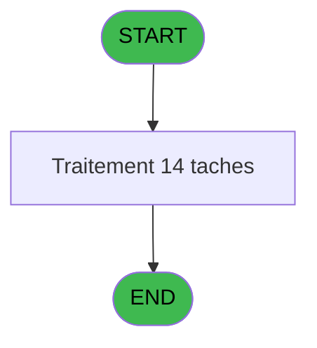

# ADH IDE 87 - Print Plafonds alloués

> **Analyse**: Phases 1-4 2026-02-07 03:46 -> 03:46 (29s) | Assemblage 06:54
> **Pipeline**: V7.2 Enrichi
> **Structure**: 4 onglets (Resume | Ecrans | Donnees | Connexions)

<!-- TAB:Resume -->

## 1. FICHE D'IDENTITE

| Attribut | Valeur |
|----------|--------|
| Projet | ADH |
| IDE Position | 87 |
| Nom Programme | Print Plafonds alloués |
| Fichier source | `Prg_87.xml` |
| Dossier IDE | EzCard |
| Taches | 14 (1 ecrans visibles) |
| Tables modifiees | 0 |
| Programmes appeles | 1 |

## 2. DESCRIPTION FONCTIONNELLE

**Print Plafonds alloués** assure la gestion complete de ce processus, accessible depuis [Bar Limit (IDE 86)](ADH-IDE-86.md).

Le flux de traitement s'organise en **3 blocs fonctionnels** :

- **Impression** (12 taches) : generation de tickets et documents
- **Traitement** (1 tache) : traitements metier divers
- **Initialisation** (1 tache) : reinitialisation d'etats et de variables de travail

Detail : phases du traitement

#### Phase 1 : Traitement (1 tache)

- **T1** - Veuillez patienter... **[ECRAN]**

Delegue a : [Recupere devise local (IDE 21)](ADH-IDE-21.md)

#### Phase 2 : Initialisation (1 tache)

- **T2** - Init village **[ECRAN]**

#### Phase 3 : Impression (12 taches)

- **T3** - Printer 1 **[ECRAN]**
- **T4** - edition extrait compte **[ECRAN]**
- **T5** - edition extrait compte **[ECRAN]**
- **T6** - Printer 4 **[ECRAN]**
- **T7** - edition extrait compte **[ECRAN]**
- **T8** - edition extrait compte **[ECRAN]**
- **T9** - Printer 5 **[ECRAN]**
- **T10** - edition extrait compte **[ECRAN]**
- **T11** - Printer 8 **[ECRAN]**
- **T12** - edition extrait compte **[ECRAN]**
- **T13** - Printer 9 **[ECRAN]**
- **T14** - edition extrait compte **[ECRAN]**

## 3. BLOCS FONCTIONNELS

### 3.1 Traitement (1 tache)

Traitements internes.

---

#### T1 - Veuillez patienter... [ECRAN]

**Role** : Traitement : Veuillez patienter....
**Ecran** : 422 x 56 DLU (MDI) | [Voir mockup](#ecran-t1)
**Delegue a** : [Recupere devise local (IDE 21)](ADH-IDE-21.md)

### 3.2 Initialisation (1 tache)

Reinitialisation d'etats et variables de travail.

---

#### T2 - Init village [ECRAN]

**Role** : Reinitialisation : Init village.
**Ecran** : 274 x 204 DLU (MDI) | [Voir mockup](#ecran-t2)
**Variables liees** : F (W0 nom village)

### 3.3 Impression (12 taches)

Generation des documents et tickets.

---

#### T3 - Printer 1 [ECRAN]

**Role** : Generation du document : Printer 1.
**Ecran** : 1058 x 791 DLU (MDI) | [Voir mockup](#ecran-t3)

---

#### T4 - edition extrait compte [ECRAN]

**Role** : Generation du document : edition extrait compte.
**Ecran** : 1058 x 791 DLU (MDI) | [Voir mockup](#ecran-t4)

---

#### T5 - edition extrait compte [ECRAN]

**Role** : Generation du document : edition extrait compte.
**Ecran** : 1058 x 791 DLU (MDI) | [Voir mockup](#ecran-t5)

---

#### T6 - Printer 4 [ECRAN]

**Role** : Generation du document : Printer 4.
**Ecran** : 1058 x 791 DLU (MDI) | [Voir mockup](#ecran-t6)

---

#### T7 - edition extrait compte [ECRAN]

**Role** : Generation du document : edition extrait compte.
**Ecran** : 1058 x 791 DLU (MDI) | [Voir mockup](#ecran-t7)

---

#### T8 - edition extrait compte [ECRAN]

**Role** : Generation du document : edition extrait compte.
**Ecran** : 1058 x 791 DLU (MDI) | [Voir mockup](#ecran-t8)

---

#### T9 - Printer 5 [ECRAN]

**Role** : Generation du document : Printer 5.
**Ecran** : 1058 x 791 DLU (MDI) | [Voir mockup](#ecran-t9)

---

#### T10 - edition extrait compte [ECRAN]

**Role** : Generation du document : edition extrait compte.
**Ecran** : 1058 x 791 DLU (MDI) | [Voir mockup](#ecran-t10)

---

#### T11 - Printer 8 [ECRAN]

**Role** : Generation du document : Printer 8.
**Ecran** : 1058 x 791 DLU (MDI) | [Voir mockup](#ecran-t11)

---

#### T12 - edition extrait compte [ECRAN]

**Role** : Generation du document : edition extrait compte.
**Ecran** : 1058 x 791 DLU (MDI) | [Voir mockup](#ecran-t12)

---

#### T13 - Printer 9 [ECRAN]

**Role** : Generation du document : Printer 9.
**Ecran** : 1058 x 791 DLU (MDI) | [Voir mockup](#ecran-t13)

---

#### T14 - edition extrait compte [ECRAN]

**Role** : Generation du document : edition extrait compte.
**Ecran** : 1058 x 791 DLU (MDI) | [Voir mockup](#ecran-t14)

## 5. REGLES METIER

*(Aucune regle metier identifiee)*

## 6. CONTEXTE

- **Appele par**: [Bar Limit (IDE 86)](ADH-IDE-86.md)
- **Appelle**: 1 programmes | **Tables**: 4 (W:0 R:2 L:2) | **Taches**: 14 | **Expressions**: 8

<!-- TAB:Ecrans -->

## 8. ECRANS

### 8.1 Forms visibles (1 / 14)

| # | Position | Tache | Nom | Type | Largeur | Hauteur | Bloc |
|---|----------|-------|-----|------|---------|---------|------|
| 1 | 87 | T1 | Veuillez patienter... | MDI | 422 | 56 | Traitement |

### 8.2 Mockups Ecrans

---

#### 87 - Veuillez patienter...
**Tache** : [T1](#t1) | **Type** : MDI | **Dimensions** : 422 x 56 DLU
**Bloc** : Traitement | **Titre IDE** : Veuillez patienter...

<!-- FORM-DATA:
{
    "width":  422,
    "vFactor":  8,
    "type":  "MDI",
    "hFactor":  8,
    "controls":  [
                     {
                         "x":  0,
                         "type":  "label",
                         "var":  "",
                         "y":  0,
                         "w":  423,
                         "fmt":  "",
                         "name":  "",
                         "h":  29,
                         "color":  "",
                         "text":  "",
                         "parent":  null
                     },
                     {
                         "x":  120,
                         "type":  "label",
                         "var":  "",
                         "y":  10,
                         "w":  221,
                         "fmt":  "",
                         "name":  "",
                         "h":  8,
                         "color":  "7",
                         "text":  "Impression en cours ...",
                         "parent":  null
                     },
                     {
                         "x":  0,
                         "type":  "label",
                         "var":  "",
                         "y":  29,
                         "w":  423,
                         "fmt":  "",
                         "name":  "",
                         "h":  27,
                         "color":  "",
                         "text":  "",
                         "parent":  null
                     },
                     {
                         "x":  27,
                         "type":  "label",
                         "var":  "",
                         "y":  38,
                         "w":  375,
                         "fmt":  "",
                         "name":  "",
                         "h":  8,
                         "color":  "",
                         "text":  "Edition du reçu",
                         "parent":  null
                     },
                     {
                         "x":  4,
                         "type":  "image",
                         "var":  "",
                         "y":  2,
                         "w":  72,
                         "fmt":  "",
                         "name":  "",
                         "h":  25,
                         "color":  "",
                         "text":  "",
                         "parent":  null
                     }
                 ],
    "taskId":  "87",
    "height":  56
}
-->

## 9. NAVIGATION

Ecran unique: **Veuillez patienter...**

### 9.3 Structure hierarchique (14 taches)

| Position | Tache | Type | Dimensions | Bloc |
|----------|-------|------|------------|------|
| **87.1** | [**Veuillez patienter...** (T1)](#t1) [mockup](#ecran-t1) | MDI | 422x56 | Traitement |
| **87.2** | [**Init village** (T2)](#t2) [mockup](#ecran-t2) | MDI | 274x204 | Initialisation |
| **87.3** | [**Printer 1** (T3)](#t3) [mockup](#ecran-t3) | MDI | 1058x791 | Impression |
| 87.3.1 | [edition extrait compte (T4)](#t4) [mockup](#ecran-t4) | MDI | 1058x791 | |
| 87.3.2 | [edition extrait compte (T5)](#t5) [mockup](#ecran-t5) | MDI | 1058x791 | |
| 87.3.3 | [Printer 4 (T6)](#t6) [mockup](#ecran-t6) | MDI | 1058x791 | |
| 87.3.4 | [edition extrait compte (T7)](#t7) [mockup](#ecran-t7) | MDI | 1058x791 | |
| 87.3.5 | [edition extrait compte (T8)](#t8) [mockup](#ecran-t8) | MDI | 1058x791 | |
| 87.3.6 | [Printer 5 (T9)](#t9) [mockup](#ecran-t9) | MDI | 1058x791 | |
| 87.3.7 | [edition extrait compte (T10)](#t10) [mockup](#ecran-t10) | MDI | 1058x791 | |
| 87.3.8 | [Printer 8 (T11)](#t11) [mockup](#ecran-t11) | MDI | 1058x791 | |
| 87.3.9 | [edition extrait compte (T12)](#t12) [mockup](#ecran-t12) | MDI | 1058x791 | |
| 87.3.10 | [Printer 9 (T13)](#t13) [mockup](#ecran-t13) | MDI | 1058x791 | |
| 87.3.11 | [edition extrait compte (T14)](#t14) [mockup](#ecran-t14) | MDI | 1058x791 | |

### 9.4 Algorigramme

> *algo-data indisponible. Utiliser `/algorigramme` pour generer.*

<!-- TAB:Donnees -->

## 10. TABLES

### Tables utilisees (4)

| ID | Nom | Description | Type | R | W | L | Usages |
|----|-----|-------------|------|---|---|---|--------|
| 19 | bl_detail |  | DB |   |   | L | 7 |
| 31 | gm-complet_______gmc |  | DB | R |   |   | 7 |
| 69 | initialisation___ini |  | DB | R |   |   | 1 |
| 312 | ez_card |  | DB |   |   | L | 7 |

### Colonnes par table (0 / 2 tables avec colonnes identifiees)

Table 31 - gm-complet_______gmc (R) - 7 usages

*Table utilisee uniquement en Link ou aucune colonne Real identifiee dans le DataView.*

Table 69 - initialisation___ini (R) - 1 usages

*Table utilisee uniquement en Link ou aucune colonne Real identifiee dans le DataView.*

## 11. VARIABLES

### 11.1 Parametres entrants (5)

Variables recues du programme appelant ([Bar Limit (IDE 86)](ADH-IDE-86.md)).

| Lettre | Nom | Type | Usage dans |
|--------|-----|------|-----------|
| A | P0 societe | Alpha | - |
| B | P0 code adherent | Numeric | - |
| C | P0 filiation | Numeric | - |
| D | P0 masque montant | Alpha | - |
| E | P0 masque cumul | Alpha | - |

### 11.2 Variables de travail (9)

Variables internes au programme.

| Lettre | Nom | Type | Usage dans |
|--------|-----|------|-----------|
| F | W0 nom village | Alpha | - |
| G | W0 nom | Alpha | - |
| H | W0 prenom | Alpha | - |
| I | W0 titre | Alpha | - |
| J | W0 n° adherent | Numeric | - |
| K | W0 lettre contrôle | Alpha | - |
| L | W0 filiation | Numeric | - |
| M | W0 langue parlee | Alpha | - |
| N | W0 devise locale | Alpha | - |

## 12. EXPRESSIONS

**8 / 8 expressions decodees (100%)**

### 12.1 Repartition par type

| Type | Expressions | Regles |
|------|-------------|--------|
| OTHER | 2 | 0 |
| CONDITION | 5 | 0 |
| CAST_LOGIQUE | 1 | 0 |

### 12.2 Expressions cles par type

#### OTHER (2 expressions)

| Type | IDE | Expression | Regle |
|------|-----|------------|-------|
| OTHER | 2 | `SetCrsr (2)` | - |
| OTHER | 1 | `SetCrsr (1)` | - |

#### CONDITION (5 expressions)

| Type | IDE | Expression | Regle |
|------|-----|------------|-------|
| CONDITION | 6 | `GetParam ('CURRENTPRINTERNUM')=8` | - |
| CONDITION | 7 | `GetParam ('CURRENTPRINTERNUM')=9` | - |
| CONDITION | 5 | `GetParam ('CURRENTPRINTERNUM')=5` | - |
| CONDITION | 3 | `GetParam ('CURRENTPRINTERNUM')=1` | - |
| CONDITION | 4 | `GetParam ('CURRENTPRINTERNUM')=4` | - |

#### CAST_LOGIQUE (1 expressions)

| Type | IDE | Expression | Regle |
|------|-----|------------|-------|
| CAST_LOGIQUE | 8 | `'TRUE'LOG` | - |

<!-- TAB:Connexions -->

## 13. GRAPHE D'APPELS

### 13.1 Chaine depuis Main (Callers)

Main -> ... -> [Bar Limit (IDE 86)](ADH-IDE-86.md) -> **Print Plafonds alloués (IDE 87)**

### 13.2 Callers

| IDE | Nom Programme | Nb Appels |
|-----|---------------|-----------|
| [86](ADH-IDE-86.md) | Bar Limit | 1 |

### 13.3 Callees (programmes appeles)

### 13.4 Detail Callees avec contexte

| IDE | Nom Programme | Appels | Contexte |
|-----|---------------|--------|----------|
| [21](ADH-IDE-21.md) | Recupere devise local | 1 | Recuperation donnees |

## 14. RECOMMANDATIONS MIGRATION

### 14.1 Profil du programme

| Metrique | Valeur | Impact migration |
|----------|--------|-----------------|
| Lignes de logique | 281 | Taille moyenne |
| Expressions | 8 | Peu de logique |
| Tables WRITE | 0 | Impact faible |
| Sous-programmes | 1 | Peu de dependances |
| Ecrans visibles | 1 | Ecran unique ou traitement batch |
| Code desactive | 0% (0 / 281) | Code sain |
| Regles metier | 0 | Pas de regle identifiee |

### 14.2 Plan de migration par bloc

#### Traitement (1 tache: 1 ecran, 0 traitement)

- **Strategie** : 1 composant(s) UI (Razor/React) avec formulaires et validation.
- 1 sous-programme(s) a migrer ou a reutiliser depuis les services existants.
- Decomposer les taches en services unitaires testables.

#### Initialisation (1 tache: 1 ecran, 0 traitement)

- **Strategie** : Constructeur/methode `InitAsync()` dans l'orchestrateur.

#### Impression (12 taches: 12 ecrans, 0 traitement)

- **Strategie** : Templates HTML -> PDF via wkhtmltopdf ou Puppeteer.
- `PrintService` injectable avec choix imprimante

### 14.3 Dependances critiques

| Dependance | Type | Appels | Impact |
|------------|------|--------|--------|
| [Recupere devise local (IDE 21)](ADH-IDE-21.md) | Sous-programme | 1x | Normale - Recuperation donnees |

---
*Spec DETAILED generee par Pipeline V7.2 - 2026-02-07 06:54*
