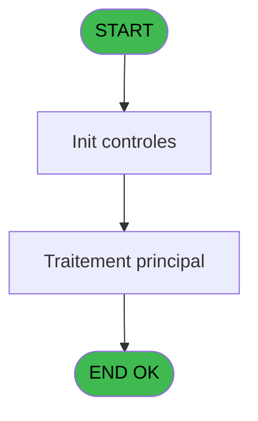

# ADH IDE 87 - Print Plafonds alloués

> **Analyse**: Phases 1-4 2026-02-07 03:46 -> 02:22 (22h35min) | Assemblage 02:22
> **Pipeline**: V7.2 Enrichi
> **Structure**: 4 onglets (Resume | Ecrans | Donnees | Connexions)

<!-- TAB:Resume -->

## 1. FICHE D'IDENTITE

| Attribut | Valeur |
|----------|--------|
| Projet | ADH |
| IDE Position | 87 |
| Nom Programme | Print Plafonds alloués |
| Fichier source | `Prg_87.xml` |
| Dossier IDE | Impression |
| Taches | 14 (1 ecrans visibles) |
| Tables modifiees | 0 |
| Programmes appeles | 1 |
| Complexite | **BASSE** (score 12/100) |

## 2. DESCRIPTION FONCTIONNELLE

Le programme **ADH IDE 87 - Print Plafonds alloués** est un utilitaire d'impression intégré au workflow de gestion des limites de crédit (Bar Limit). Il récupère dynamiquement la devise locale via **ADH IDE 21** avant de générer et d'imprimer un document récapitulatif des plafonds alloués à un compte membre.

Son flux d'exécution débute par une tâche d'attente utilisateur, suivie d'une initialisation du contexte village (données de localisation/configuration). Ensuite, il alimente le gestionnaire d'impression (Printer 1) avec les données de plafonds formatées, puis exécute deux cycles d'édition/impression d'extrait de compte (tâches 3 et 4), permettant ainsi une visualisation du compte avant impression du détail plafond. Les tâches finales (Printer 4) gèrent les dernières phases d'impression et fermeture du gestionnaire.

Ce programme est typiquement appelé quand un agent caisse consulte ou valide les limites crédit d'un compte (ADH IDE 86 - Bar Limit). Il assure une traçabilité papier des plafonds autorisés, avec contexte devise pour éviter les ambiguïtés monétaires sur le ticket imprimé.

## 3. BLOCS FONCTIONNELS

### 3.1 Traitement (1 tache)

Traitements internes.

---

#### 87 - Veuillez patienter... [[ECRAN]](#ecran-t1)

**Role** : Traitement : Veuillez patienter....
**Ecran** : 422 x 56 DLU (MDI) | [Voir mockup](#ecran-t1)
**Delegue a** : [Recupere devise local (IDE 21)](ADH-IDE-21.md)

### 3.2 Initialisation (1 tache)

Reinitialisation d'etats et variables de travail.

---

#### 87.1 - Init village [[ECRAN]](#ecran-t2)

**Role** : Reinitialisation : Init village.
**Ecran** : 274 x 204 DLU (MDI) | [Voir mockup](#ecran-t2)
**Variables liees** : ES (W0 nom village)

### 3.3 Impression (12 taches)

Generation des documents et tickets.

---

#### 87.2 - Printer 1 [[ECRAN]](#ecran-t3)

**Role** : Generation du document : Printer 1.
**Ecran** : 1058 x 791 DLU (MDI) | [Voir mockup](#ecran-t3)

---

#### 87.2.1 - edition extrait compte [[ECRAN]](#ecran-t4)

**Role** : Generation du document : edition extrait compte.
**Ecran** : 1058 x 791 DLU (MDI) | [Voir mockup](#ecran-t4)

---

#### 87.2.2 - edition extrait compte [[ECRAN]](#ecran-t5)

**Role** : Generation du document : edition extrait compte.
**Ecran** : 1058 x 791 DLU (MDI) | [Voir mockup](#ecran-t5)

---

#### 87.3 - Printer 4 [[ECRAN]](#ecran-t6)

**Role** : Generation du document : Printer 4.
**Ecran** : 1058 x 791 DLU (MDI) | [Voir mockup](#ecran-t6)

---

#### 87.3.1 - edition extrait compte [[ECRAN]](#ecran-t7)

**Role** : Generation du document : edition extrait compte.
**Ecran** : 1058 x 791 DLU (MDI) | [Voir mockup](#ecran-t7)

---

#### 87.3.2 - edition extrait compte [[ECRAN]](#ecran-t8)

**Role** : Generation du document : edition extrait compte.
**Ecran** : 1058 x 791 DLU (MDI) | [Voir mockup](#ecran-t8)

---

#### 87.4 - Printer 5 [[ECRAN]](#ecran-t9)

**Role** : Generation du document : Printer 5.
**Ecran** : 1058 x 791 DLU (MDI) | [Voir mockup](#ecran-t9)

---

#### 87.4.1 - edition extrait compte [[ECRAN]](#ecran-t10)

**Role** : Generation du document : edition extrait compte.
**Ecran** : 1058 x 791 DLU (MDI) | [Voir mockup](#ecran-t10)

---

#### 87.5 - Printer 8 [[ECRAN]](#ecran-t11)

**Role** : Generation du document : Printer 8.
**Ecran** : 1058 x 791 DLU (MDI) | [Voir mockup](#ecran-t11)

---

#### 87.5.1 - edition extrait compte [[ECRAN]](#ecran-t12)

**Role** : Generation du document : edition extrait compte.
**Ecran** : 1058 x 791 DLU (MDI) | [Voir mockup](#ecran-t12)

---

#### 87.6 - Printer 9 [[ECRAN]](#ecran-t13)

**Role** : Generation du document : Printer 9.
**Ecran** : 1058 x 791 DLU (MDI) | [Voir mockup](#ecran-t13)

---

#### 87.6.1 - edition extrait compte [[ECRAN]](#ecran-t14)

**Role** : Generation du document : edition extrait compte.
**Ecran** : 1058 x 791 DLU (MDI) | [Voir mockup](#ecran-t14)

## 5. REGLES METIER

5 regles identifiees:

### Impression (5 regles)

#### [RM-001] Verification que l'imprimante courante est la n1

| Element | Detail |
|---------|--------|
| **Condition** | `GetParam ('CURRENTPRINTERNUM')=1` |
| **Si vrai** | Action si CURRENTPRINTERNUM = 1 |
| **Expression source** | Expression 3 : `GetParam ('CURRENTPRINTERNUM')=1` |
| **Exemple** | Si GetParam ('CURRENTPRINTERNUM')=1 → Action si CURRENTPRINTERNUM = 1 |
| **Impact** | [87.2 - Printer 1](#t3) |

#### [RM-002] Verification que l'imprimante courante est la n4

| Element | Detail |
|---------|--------|
| **Condition** | `GetParam ('CURRENTPRINTERNUM')=4` |
| **Si vrai** | Action si CURRENTPRINTERNUM = 4 |
| **Expression source** | Expression 4 : `GetParam ('CURRENTPRINTERNUM')=4` |
| **Exemple** | Si GetParam ('CURRENTPRINTERNUM')=4 → Action si CURRENTPRINTERNUM = 4 |
| **Impact** | [87.2 - Printer 1](#t3) |

#### [RM-003] Verification que l'imprimante courante est la n5

| Element | Detail |
|---------|--------|
| **Condition** | `GetParam ('CURRENTPRINTERNUM')=5` |
| **Si vrai** | Action si CURRENTPRINTERNUM = 5 |
| **Expression source** | Expression 5 : `GetParam ('CURRENTPRINTERNUM')=5` |
| **Exemple** | Si GetParam ('CURRENTPRINTERNUM')=5 → Action si CURRENTPRINTERNUM = 5 |
| **Impact** | [87.2 - Printer 1](#t3) |

#### [RM-004] Verification que l'imprimante courante est la n8

| Element | Detail |
|---------|--------|
| **Condition** | `GetParam ('CURRENTPRINTERNUM')=8` |
| **Si vrai** | Action si CURRENTPRINTERNUM = 8 |
| **Expression source** | Expression 6 : `GetParam ('CURRENTPRINTERNUM')=8` |
| **Exemple** | Si GetParam ('CURRENTPRINTERNUM')=8 → Action si CURRENTPRINTERNUM = 8 |
| **Impact** | [87.2 - Printer 1](#t3) |

#### [RM-005] Verification que l'imprimante courante est la n9

| Element | Detail |
|---------|--------|
| **Condition** | `GetParam ('CURRENTPRINTERNUM')=9` |
| **Si vrai** | Action si CURRENTPRINTERNUM = 9 |
| **Expression source** | Expression 7 : `GetParam ('CURRENTPRINTERNUM')=9` |
| **Exemple** | Si GetParam ('CURRENTPRINTERNUM')=9 → Action si CURRENTPRINTERNUM = 9 |
| **Impact** | [87.2 - Printer 1](#t3) |

## 6. CONTEXTE

- **Appele par**: [Bar Limit (IDE 86)](ADH-IDE-86.md)
- **Appelle**: 1 programmes | **Tables**: 4 (W:0 R:2 L:2) | **Taches**: 14 | **Expressions**: 8

<!-- TAB:Ecrans -->

## 8. ECRANS

### 8.1 Forms visibles (1 / 14)

| # | Position | Tache | Nom | Type | Largeur | Hauteur | Bloc |
|---|----------|-------|-----|------|---------|---------|------|
| 1 | 87 | 87 | Veuillez patienter... | MDI | 422 | 56 | Traitement |

### 8.2 Mockups Ecrans

---

#### 87 - Veuillez patienter...
**Tache** : [87](#t1) | **Type** : MDI | **Dimensions** : 422 x 56 DLU
**Bloc** : Traitement | **Titre IDE** : Veuillez patienter...

<!-- FORM-DATA:
{
    "width":  422,
    "vFactor":  8,
    "type":  "MDI",
    "hFactor":  8,
    "controls":  [
                     {
                         "x":  0,
                         "type":  "label",
                         "var":  "",
                         "y":  0,
                         "w":  423,
                         "fmt":  "",
                         "name":  "",
                         "h":  29,
                         "color":  "",
                         "text":  "",
                         "parent":  null
                     },
                     {
                         "x":  120,
                         "type":  "label",
                         "var":  "",
                         "y":  10,
                         "w":  221,
                         "fmt":  "",
                         "name":  "",
                         "h":  8,
                         "color":  "7",
                         "text":  "Impression en cours ...",
                         "parent":  null
                     },
                     {
                         "x":  0,
                         "type":  "label",
                         "var":  "",
                         "y":  29,
                         "w":  423,
                         "fmt":  "",
                         "name":  "",
                         "h":  27,
                         "color":  "",
                         "text":  "",
                         "parent":  null
                     },
                     {
                         "x":  27,
                         "type":  "label",
                         "var":  "",
                         "y":  38,
                         "w":  375,
                         "fmt":  "",
                         "name":  "",
                         "h":  8,
                         "color":  "",
                         "text":  "Edition du reçu",
                         "parent":  null
                     },
                     {
                         "x":  4,
                         "type":  "image",
                         "var":  "",
                         "y":  2,
                         "w":  72,
                         "fmt":  "",
                         "name":  "",
                         "h":  25,
                         "color":  "",
                         "text":  "",
                         "parent":  null
                     }
                 ],
    "taskId":  "87",
    "height":  56
}
-->

## 9. NAVIGATION

Ecran unique: **Veuillez patienter...**

### 9.3 Structure hierarchique (14 taches)

| Position | Tache | Type | Dimensions | Bloc |
|----------|-------|------|------------|------|
| **87.1** | [**Veuillez patienter...** (87)](#t1) [mockup](#ecran-t1) | MDI | 422x56 | Traitement |
| **87.2** | [**Init village** (87.1)](#t2) [mockup](#ecran-t2) | MDI | 274x204 | Initialisation |
| **87.3** | [**Printer 1** (87.2)](#t3) [mockup](#ecran-t3) | MDI | 1058x791 | Impression |
| 87.3.1 | [edition extrait compte (87.2.1)](#t4) [mockup](#ecran-t4) | MDI | 1058x791 | |
| 87.3.2 | [edition extrait compte (87.2.2)](#t5) [mockup](#ecran-t5) | MDI | 1058x791 | |
| 87.3.3 | [Printer 4 (87.3)](#t6) [mockup](#ecran-t6) | MDI | 1058x791 | |
| 87.3.4 | [edition extrait compte (87.3.1)](#t7) [mockup](#ecran-t7) | MDI | 1058x791 | |
| 87.3.5 | [edition extrait compte (87.3.2)](#t8) [mockup](#ecran-t8) | MDI | 1058x791 | |
| 87.3.6 | [Printer 5 (87.4)](#t9) [mockup](#ecran-t9) | MDI | 1058x791 | |
| 87.3.7 | [edition extrait compte (87.4.1)](#t10) [mockup](#ecran-t10) | MDI | 1058x791 | |
| 87.3.8 | [Printer 8 (87.5)](#t11) [mockup](#ecran-t11) | MDI | 1058x791 | |
| 87.3.9 | [edition extrait compte (87.5.1)](#t12) [mockup](#ecran-t12) | MDI | 1058x791 | |
| 87.3.10 | [Printer 9 (87.6)](#t13) [mockup](#ecran-t13) | MDI | 1058x791 | |
| 87.3.11 | [edition extrait compte (87.6.1)](#t14) [mockup](#ecran-t14) | MDI | 1058x791 | |

### 9.4 Algorigramme

> **Legende**: Vert = START/END OK | Rouge = END KO | Bleu = Decisions
> *Algorigramme auto-genere. Utiliser `/algorigramme` pour une synthese metier detaillee.*

<!-- TAB:Donnees -->

## 10. TABLES

### Tables utilisees (4)

| ID | Nom | Description | Type | R | W | L | Usages |
|----|-----|-------------|------|---|---|---|--------|
| 31 | gm-complet_______gmc |  | DB | R |   |   | 7 |
| 69 | initialisation___ini |  | DB | R |   |   | 1 |
| 19 | bl_detail |  | DB |   |   | L | 7 |
| 312 | ez_card |  | DB |   |   | L | 7 |

### Colonnes par table (0 / 2 tables avec colonnes identifiees)

Table 31 - gm-complet_______gmc (R) - 7 usages

*Table utilisee uniquement en Link ou aucune colonne Real identifiee dans le DataView.*

Table 69 - initialisation___ini (R) - 1 usages

*Table utilisee uniquement en Link ou aucune colonne Real identifiee dans le DataView.*

## 11. VARIABLES

### 11.1 Parametres entrants (5)

Variables recues du programme appelant ([Bar Limit (IDE 86)](ADH-IDE-86.md)).

| Lettre | Nom | Type | Usage dans |
|--------|-----|------|-----------|
| EN | P0 societe | Alpha | - |
| EO | P0 code adherent | Numeric | - |
| EP | P0 filiation | Numeric | - |
| EQ | P0 masque montant | Alpha | - |
| ER | P0 masque cumul | Alpha | - |

### 11.2 Variables de travail (9)

Variables internes au programme.

| Lettre | Nom | Type | Usage dans |
|--------|-----|------|-----------|
| ES | W0 nom village | Alpha | - |
| ET | W0 nom | Alpha | - |
| EU | W0 prenom | Alpha | - |
| EV | W0 titre | Alpha | - |
| EW | W0 n° adherent | Numeric | - |
| EX | W0 lettre contrôle | Alpha | - |
| EY | W0 filiation | Numeric | - |
| EZ | W0 langue parlee | Alpha | - |
| FA | W0 devise locale | Alpha | - |

## 12. EXPRESSIONS

**8 / 8 expressions decodees (100%)**

### 12.1 Repartition par type

| Type | Expressions | Regles |
|------|-------------|--------|
| CONDITION | 5 | 5 |
| OTHER | 2 | 0 |
| CAST_LOGIQUE | 1 | 0 |

### 12.2 Expressions cles par type

#### CONDITION (5 expressions)

| Type | IDE | Expression | Regle |
|------|-----|------------|-------|
| CONDITION | 6 | `GetParam ('CURRENTPRINTERNUM')=8` | [RM-004](#rm-RM-004) |
| CONDITION | 7 | `GetParam ('CURRENTPRINTERNUM')=9` | [RM-005](#rm-RM-005) |
| CONDITION | 5 | `GetParam ('CURRENTPRINTERNUM')=5` | [RM-003](#rm-RM-003) |
| CONDITION | 3 | `GetParam ('CURRENTPRINTERNUM')=1` | [RM-001](#rm-RM-001) |
| CONDITION | 4 | `GetParam ('CURRENTPRINTERNUM')=4` | [RM-002](#rm-RM-002) |

#### OTHER (2 expressions)

| Type | IDE | Expression | Regle |
|------|-----|------------|-------|
| OTHER | 2 | `SetCrsr (2)` | - |
| OTHER | 1 | `SetCrsr (1)` | - |

#### CAST_LOGIQUE (1 expressions)

| Type | IDE | Expression | Regle |
|------|-----|------------|-------|
| CAST_LOGIQUE | 8 | `'TRUE'LOG` | - |

<!-- TAB:Connexions -->

## 13. GRAPHE D'APPELS

### 13.1 Chaine depuis Main (Callers)

Main -> ... -> [Bar Limit (IDE 86)](ADH-IDE-86.md) -> **Print Plafonds alloués (IDE 87)**

### 13.2 Callers

| IDE | Nom Programme | Nb Appels |
|-----|---------------|-----------|
| [86](ADH-IDE-86.md) | Bar Limit | 1 |

### 13.3 Callees (programmes appeles)

### 13.4 Detail Callees avec contexte

| IDE | Nom Programme | Appels | Contexte |
|-----|---------------|--------|----------|
| [21](ADH-IDE-21.md) | Recupere devise local | 1 | Recuperation donnees |

## 14. RECOMMANDATIONS MIGRATION

### 14.1 Profil du programme

| Metrique | Valeur | Impact migration |
|----------|--------|-----------------|
| Lignes de logique | 281 | Taille moyenne |
| Expressions | 8 | Peu de logique |
| Tables WRITE | 0 | Impact faible |
| Sous-programmes | 1 | Peu de dependances |
| Ecrans visibles | 1 | Ecran unique ou traitement batch |
| Code desactive | 0% (0 / 281) | Code sain |
| Regles metier | 5 | Quelques regles a preserver |

### 14.2 Plan de migration par bloc

#### Traitement (1 tache: 1 ecran, 0 traitement)

- **Strategie** : 1 composant(s) UI (Razor/React) avec formulaires et validation.
- 1 sous-programme(s) a migrer ou a reutiliser depuis les services existants.
- Decomposer les taches en services unitaires testables.

#### Initialisation (1 tache: 1 ecran, 0 traitement)

- **Strategie** : Constructeur/methode `InitAsync()` dans l'orchestrateur.

#### Impression (12 taches: 12 ecrans, 0 traitement)

- **Strategie** : Templates HTML -> PDF via wkhtmltopdf ou Puppeteer.
- `PrintService` injectable avec choix imprimante

### 14.3 Dependances critiques

| Dependance | Type | Appels | Impact |
|------------|------|--------|--------|
| [Recupere devise local (IDE 21)](ADH-IDE-21.md) | Sous-programme | 1x | Normale - Recuperation donnees |

---
*Spec DETAILED generee par Pipeline V7.2 - 2026-02-08 02:22*
