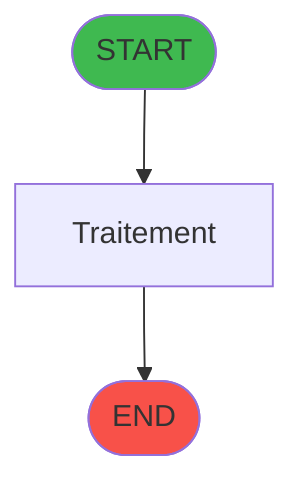
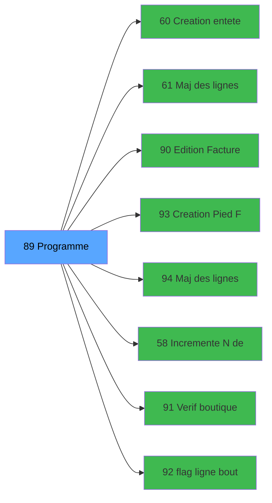

# ADH IDE 89 - Factures (Tble Compta&Vent

> **Version spec**: 3.5
> **Analyse**: 2026-01-27 17:57
> **Source**: `Prg_XXX.xml`

---

<!-- TAB:Fonctionnel -->

## SPECIFICATION FONCTIONNELLE

### 1.1 Objectif metier

| Element | Description |
|---------|-------------|
| **Qui** | Operateur |
| **Quoi** | Factures (Tble Compta&Vent
 |
| **Pourquoi** | A documenter |
| **Declencheur** | A identifier |

### 1.2 Regles metier

| Code | Regle | Condition |
|------|-------|-----------|
| RM-001 | A documenter | - |

### 1.3 Flux utilisateur

1. Demarrage programme
2. Traitement principal
3. Fin programme

### 1.4 Cas d'erreur

| Erreur | Comportement |
|--------|--------------|
| - | A documenter |

---

<!-- TAB:Technique -->

## SPECIFICATION TECHNIQUE

### 2.1 Identification

| Attribut | Valeur |
|----------|--------|
| **Format IDE** | ADH IDE 89 |
| **Description** | Factures (Tble Compta&Vent
 |
| **Module** | ADH |

### 2.2 Tables

| # | Nom physique | Acces | Usage |
|---|--------------|-------|-------|
| #30 | `Table_30` | LINK | 2x |
| #31 | `Table_31` | LINK | 1x |
| #40 | `Table_40` | LINK | 1x |
| #40 | `Table_40` | **W** | 1x |
| #68 | `Table_68` | **W** | 1x |
| #263 | `Table_263` | LINK | 2x |
| #372 | `Table_372` | LINK | 1x |
| #382 | `Table_382` | LINK | 2x |
| #400 | `Table_400` | LINK | 2x |
| #744 | `Table_744` | LINK | 2x |
| #746 | `Table_746` | LINK | 1x |
| #746 | `Table_746` | **W** | 1x |
| #755 | `Table_755` | LINK | 2x |
| #756 | `Table_756` | LINK | 2x |
| #866 | `Table_866` | LINK | 3x |
| #866 | `Table_866` | R | 6x |
| #866 | `Table_866` | **W** | 7x |
| #867 | `Table_867` | LINK | 1x |
| #867 | `Table_867` | R | 2x |
| #868 | `Table_868` | LINK | 1x |
| #868 | `Table_868` | R | 3x |
| #868 | `Table_868` | **W** | 6x |
| #870 | `Table_870` | LINK | 7x |
| #870 | `Table_870` | R | 1x |
| #870 | `Table_870` | **W** | 4x |
| #871 | `Table_871` | LINK | 2x |
| #932 | `Table_932` | LINK | 1x |
| #932 | `Table_932` | **W** | 1x |
### 2.3 Parametres d'entree

### 2.4 Algorigramme

### 2.5 Expressions cles

### 2.6 Variables importantes

### 2.7 Statistiques

---

<!-- TAB:Cartographie -->

## CARTOGRAPHIE APPLICATIVE

### 3.1 Chaine d'appels depuis Main

### 3.2 Callers directs

| IDE | Programme | Nb appels |
|-----|-----------|-----------|
| - | **Aucun caller** (point d'entree ou orphelin) | - |
### 3.3 Callees

| Niv | IDE | Programme | Nb appels |
|-----|-----|-----------|-----------|
| 1 | 60 | Creation entete facture | 3 |
| 1 | 61 | Maj des lignes saisies | 3 |
| 1 | 90 | Edition Facture Tva(Compta&Ve) | 3 |
| 1 | 93 | Creation Pied Facture | 3 |
| 1 | 94 | Maj des lignes saisies archive | 3 |
| 1 | 58 | Incremente N° de Facture | 2 |
| 1 | 91 | Verif boutique | 2 |
| 1 | 92 | flag ligne boutique | 2 |
| 1 | 57 | Factures_Sejour | 1 |
| 1 | 59 | Facture - chargement boutique | 1 |
| 1 | 62 | Maj Hebergement Tempo | 1 |
| 1 | 95 | Facture - Sejour archive | 1 |
### 3.4 Verification orphelin

| Critere | Resultat |
|---------|----------|
| Callers actifs | A verifier |
| **Conclusion** | A analyser |

---

## HISTORIQUE

| Date | Action | Auteur |
|------|--------|--------|
| 2026-01-27 19:45 | **DATA POPULATED** - Tables, Callgraph (45 expr) | Script |
| 2026-01-27 17:57 | **Upgrade V3.5** - TAB markers, Mermaid | Claude |

---

*Specification V3.5 - Format avec TAB markers et Mermaid*
