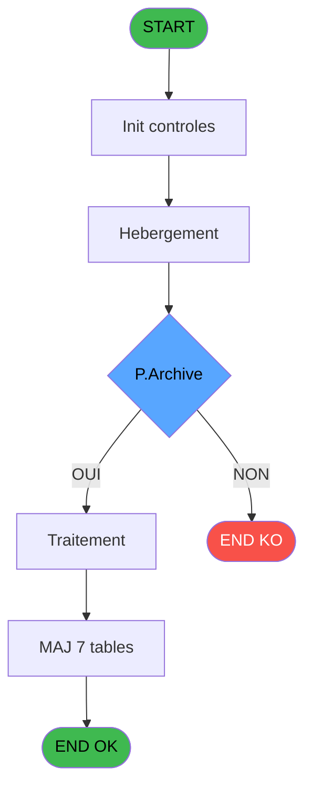
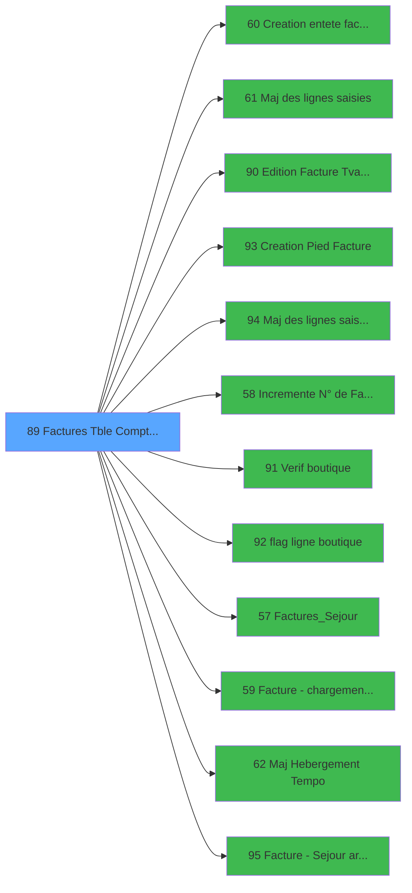

# ADH IDE 89 - Factures (Tble Compta&Vent

> **Analyse**: Phases 1-4 2026-02-07 03:46 -> 02:27 (22h40min) | Assemblage 02:27
> **Pipeline**: V7.2 Enrichi
> **Structure**: 4 onglets (Resume | Ecrans | Donnees | Connexions)

<!-- TAB:Resume -->

## 1. FICHE D'IDENTITE

| Attribut | Valeur |
|----------|--------|
| Projet | ADH |
| IDE Position | 89 |
| Nom Programme | Factures (Tble Compta&Vent |
| Fichier source | `Prg_89.xml` |
| Dossier IDE | Facturation |
| Taches | 35 (5 ecrans visibles) |
| Tables modifiees | 7 |
| Programmes appeles | 12 |
| Complexite | **MOYENNE** (score 55/100) |
| Statut | **ORPHELIN_POTENTIEL** |

## 2. DESCRIPTION FONCTIONNELLE

# ADH IDE 89 - Factures (Table Compta&Ventes)

ADH IDE 89 gère la création et la mise à jour des factures de ventes, en coordonnant plusieurs tâches spécialisées pour traiter les différents types d'articles (hébergement, boutique, gift pass). Le programme appelle une chaîne de 12 programmes externes pour couvrir l'ensemble du cycle de facturation : création de l'en-tête (IDE 60), saisie des lignes (IDE 61), vérification boutique (IDE 91), édition TVA (IDE 90), et création du pied de facture (IDE 93). Les lignes saisies sont mises à jour dans les tables de vente et d'archive (IDE 94, 95), tandis que les compteurs sont incrémentés (IDE 58).

Les modifications portent sur 7 tables clés : la table comptable, les compteurs, les affectations de gift pass, les rayons boutique, et les paramètres de taxe additionnelle. Le flux traite séparément l'hébergement temporaire (mise à jour différée), les ventes boutique (avec flagging ligne), et les factures de séjour archivées. Cette architecture modulaire permet de traiter chaque étape de la facturation de manière isolée tout en maintenant la cohérence des données à travers les mises à jour transactionnelles.

Le programme constitue le point d'entrée critique pour la génération de tous les documents de facturation clients, s'inscrivant dans un processus plus large qui inclut validation TVA, gestion des stocks boutique, et archivage des transactions historiques. Son orchestration de multiples tâches en cascade assure que chaque facture est complète et conforme avant d'être livrée au client.

## 3. BLOCS FONCTIONNELS

### 3.1 Saisie (6 taches)

L'operateur saisit les donnees de la transaction via 6 ecrans (Factures Bis(Ventes), Maj des lignes saisies, Creation Lg Vente, Ventes, Maj des lignes saisies, Creation Lg Vente).

---

#### 89 - Factures Bis(Ventes) [[ECRAN]](#ecran-t1)

**Role** : Tache d'orchestration : point d'entree du programme (6 sous-taches). Coordonne l'enchainement des traitements.
**Ecran** : 881 x 411 DLU | [Voir mockup](#ecran-t1)

5 sous-taches directes

| Tache | Nom | Bloc |
|-------|-----|------|
| [89.1](#t2) | Maj des lignes saisies **[[ECRAN]](#ecran-t2)** | Saisie |
| [89.2.3](#t7) | Creation Lg Vente **[[ECRAN]](#ecran-t7)** | Saisie |
| [89.4.1](#t11) | Ventes **[[ECRAN]](#ecran-t11)** | Saisie |
| [89.6](#t19) | Maj des lignes saisies **[[ECRAN]](#ecran-t19)** | Saisie |
| [89.9.3](#t26) | Creation Lg Vente **[[ECRAN]](#ecran-t26)** | Saisie |

**Delegue a** : [Maj des lignes saisies (IDE 61)](ADH-IDE-61.md), [Maj des lignes saisies archive (IDE 94)](ADH-IDE-94.md), [Factures_Sejour (IDE 57)](ADH-IDE-57.md)

---

#### 89.1 - Maj des lignes saisies [[ECRAN]](#ecran-t2)

**Role** : Saisie des donnees : Maj des lignes saisies.
**Ecran** : 562 x 0 DLU | [Voir mockup](#ecran-t2)
**Delegue a** : [Maj des lignes saisies (IDE 61)](ADH-IDE-61.md), [Maj des lignes saisies archive (IDE 94)](ADH-IDE-94.md)

---

#### 89.2.3 - Creation Lg Vente [[ECRAN]](#ecran-t7)

**Role** : Saisie des donnees : Creation Lg Vente.
**Ecran** : 630 x 0 DLU | [Voir mockup](#ecran-t7)
**Variables liees** : EV (v.ExistFactureVente)
**Delegue a** : [Creation entete facture (IDE 60)](ADH-IDE-60.md), [Maj des lignes saisies (IDE 61)](ADH-IDE-61.md), [Creation Pied Facture (IDE 93)](ADH-IDE-93.md)

---

#### 89.4.1 - Ventes [[ECRAN]](#ecran-t11)

**Role** : Saisie des donnees : Ventes.
**Ecran** : 650 x 233 DLU | [Voir mockup](#ecran-t11)
**Delegue a** : [Maj des lignes saisies (IDE 61)](ADH-IDE-61.md), [Maj des lignes saisies archive (IDE 94)](ADH-IDE-94.md)

---

#### 89.6 - Maj des lignes saisies [[ECRAN]](#ecran-t19)

**Role** : Saisie des donnees : Maj des lignes saisies.
**Ecran** : 562 x 0 DLU | [Voir mockup](#ecran-t19)
**Delegue a** : [Maj des lignes saisies (IDE 61)](ADH-IDE-61.md), [Maj des lignes saisies archive (IDE 94)](ADH-IDE-94.md)

---

#### 89.9.3 - Creation Lg Vente [[ECRAN]](#ecran-t26)

**Role** : Saisie des donnees : Creation Lg Vente.
**Ecran** : 630 x 0 DLU | [Voir mockup](#ecran-t26)
**Variables liees** : EV (v.ExistFactureVente)
**Delegue a** : [Creation entete facture (IDE 60)](ADH-IDE-60.md), [Maj des lignes saisies (IDE 61)](ADH-IDE-61.md), [Creation Pied Facture (IDE 93)](ADH-IDE-93.md)

### 3.2 Traitement (20 taches)

Traitements internes.

---

#### 89.2 - Hebergement [[ECRAN]](#ecran-t3)

**Role** : Traitement : Hebergement.
**Ecran** : 630 x 0 DLU | [Voir mockup](#ecran-t3)
**Variables liees** : FK (V.Date Début Hebergement), FL (V.Date Fin Hebergement)

---

#### 89.2.1 - Création

**Role** : Traitement : Création.

---

#### 89.2.2.1 - Maj Hebergement Temp

**Role** : Traitement : Maj Hebergement Temp.
**Variables liees** : FK (V.Date Début Hebergement), FL (V.Date Fin Hebergement)

---

#### 89.2.3.1 - Maj Hebergement Temp

**Role** : Traitement : Maj Hebergement Temp.
**Variables liees** : FK (V.Date Début Hebergement), FL (V.Date Fin Hebergement)

---

#### 89.4 - Hebergement [[ECRAN]](#ecran-t10)

**Role** : Traitement : Hebergement.
**Ecran** : 866 x 250 DLU | [Voir mockup](#ecran-t10)
**Variables liees** : FK (V.Date Début Hebergement), FL (V.Date Fin Hebergement)

---

#### 89.4.1.1 - Lignes boutique [[ECRAN]](#ecran-t12)

**Role** : Traitement : Lignes boutique.
**Ecran** : 704 x 239 DLU | [Voir mockup](#ecran-t12)

---

#### 89.4.1.1.2 - Suppr fact pro boutique

**Role** : Traitement : Suppr fact pro boutique.
**Variables liees** : ET (V.Lien Pied de facture), EU (V.EntetFacture?), EV (v.ExistFactureVente), EW (V.Existe facture ?), FC (V.Facture Sans Nom)

---

#### 89.4.2 - Flag All [[ECRAN]](#ecran-t15)

**Role** : Traitement : Flag All.
**Ecran** : 541 x 291 DLU | [Voir mockup](#ecran-t15)
**Variables liees** : FQ (V.Existe flaguee ?)

---

#### 89.4.3 - Pied de Facture [[ECRAN]](#ecran-t16)

**Role** : Traitement : Pied de Facture.
**Ecran** : 207 x 102 DLU | [Voir mockup](#ecran-t16)
**Variables liees** : ET (V.Lien Pied de facture), EU (V.EntetFacture?), EV (v.ExistFactureVente), EW (V.Existe facture ?), FC (V.Facture Sans Nom)

---

#### 89.5 - Incremente N° de Facture

**Role** : Traitement : Incremente N° de Facture.
**Variables liees** : ET (V.Lien Pied de facture), EU (V.EntetFacture?), EV (v.ExistFactureVente), EW (V.Existe facture ?), FC (V.Facture Sans Nom)

---

#### 89.9 - Hebergement [[ECRAN]](#ecran-t22)

**Role** : Traitement : Hebergement.
**Ecran** : 630 x 0 DLU | [Voir mockup](#ecran-t22)
**Variables liees** : FK (V.Date Début Hebergement), FL (V.Date Fin Hebergement)

---

#### 89.9.1 - Création

**Role** : Traitement : Création.

---

#### 89.9.2.1 - Maj Hebergement Temp

**Role** : Traitement : Maj Hebergement Temp.
**Variables liees** : FK (V.Date Début Hebergement), FL (V.Date Fin Hebergement)

---

#### 89.9.3.1 - Maj Hebergement Temp

**Role** : Traitement : Maj Hebergement Temp.
**Variables liees** : FK (V.Date Début Hebergement), FL (V.Date Fin Hebergement)

---

#### 89.10 - Maj Hebergement Tempo [[ECRAN]](#ecran-t28)

**Role** : Traitement : Maj Hebergement Tempo.
**Ecran** : 672 x 0 DLU | [Voir mockup](#ecran-t28)
**Variables liees** : FK (V.Date Début Hebergement), FL (V.Date Fin Hebergement)

---

#### 89.11 - flag ligne boutique

**Role** : Traitement : flag ligne boutique.
**Variables liees** : FQ (V.Existe flaguee ?)

---

#### 89.11.1 - flag ligne

**Role** : Traitement : flag ligne.
**Variables liees** : FQ (V.Existe flaguee ?)

---

#### 89.13 - chargement boutique

**Role** : Traitement : chargement boutique.

---

#### 89.15 - SQL parcourt facture [[ECRAN]](#ecran-t34)

**Role** : Traitement : SQL parcourt facture.
**Ecran** : 609 x 195 DLU | [Voir mockup](#ecran-t34)
**Variables liees** : ET (V.Lien Pied de facture), EU (V.EntetFacture?), EV (v.ExistFactureVente), EW (V.Existe facture ?), FC (V.Facture Sans Nom)

---

#### 89.16 - SQL parcourt facture [[ECRAN]](#ecran-t35)

**Role** : Traitement : SQL parcourt facture.
**Ecran** : 609 x 195 DLU | [Voir mockup](#ecran-t35)
**Variables liees** : ET (V.Lien Pied de facture), EU (V.EntetFacture?), EV (v.ExistFactureVente), EW (V.Existe facture ?), FC (V.Facture Sans Nom)

### 3.3 Calcul (2 taches)

Calculs metier : montants, stocks, compteurs.

---

#### 89.2.2 - Creation Lg Compta

**Role** : Creation d'enregistrement : Creation Lg Compta.
**Delegue a** : [Creation entete facture (IDE 60)](ADH-IDE-60.md), [Creation Pied Facture (IDE 93)](ADH-IDE-93.md)

---

#### 89.9.2 - Creation Lg Compta

**Role** : Creation d'enregistrement : Creation Lg Compta.
**Delegue a** : [Creation entete facture (IDE 60)](ADH-IDE-60.md), [Creation Pied Facture (IDE 93)](ADH-IDE-93.md)

### 3.4 Validation (4 taches)

Controles de coherence : 4 taches verifient les donnees et conditions.

---

#### 89.3 - verif non flaguee

**Role** : Verification : verif non flaguee.
**Variables liees** : FQ (V.Existe flaguee ?)
**Delegue a** : [Verif boutique (IDE 91)](ADH-IDE-91.md)

---

#### 89.4.1.1.1 - Controle ttc

**Role** : Verification : Controle ttc.
**Delegue a** : [Verif boutique (IDE 91)](ADH-IDE-91.md)

---

#### 89.4.4 - verif boutique

**Role** : Verification : verif boutique.
**Delegue a** : [Verif boutique (IDE 91)](ADH-IDE-91.md)

---

#### 89.12 - verif non flaguee

**Role** : Verification : verif non flaguee.
**Variables liees** : FQ (V.Existe flaguee ?)
**Delegue a** : [Verif boutique (IDE 91)](ADH-IDE-91.md)

### 3.5 Creation (2 taches)

Insertion de nouveaux enregistrements en base.

---

#### 89.7 - Creation Pied Facture [[ECRAN]](#ecran-t20)

**Role** : Creation d'enregistrement : Creation Pied Facture.
**Ecran** : 586 x 0 DLU | [Voir mockup](#ecran-t20)
**Variables liees** : ET (V.Lien Pied de facture), EU (V.EntetFacture?), EV (v.ExistFactureVente), EW (V.Existe facture ?), FC (V.Facture Sans Nom)
**Delegue a** : [Creation entete facture (IDE 60)](ADH-IDE-60.md), [Creation Pied Facture (IDE 93)](ADH-IDE-93.md)

---

#### 89.14 - Creation entete

**Role** : Creation d'enregistrement : Creation entete.
**Delegue a** : [Creation entete facture (IDE 60)](ADH-IDE-60.md), [Creation Pied Facture (IDE 93)](ADH-IDE-93.md)

### 3.6 Consultation (1 tache)

Ecrans de recherche et consultation.

---

#### 89.8 - Recherche si Fact déjà éditée

**Role** : Traitement : Recherche si Fact déjà éditée.
**Variables liees** : ET (V.Lien Pied de facture), EU (V.EntetFacture?), EV (v.ExistFactureVente), EW (V.Existe facture ?), FC (V.Facture Sans Nom)

## 5. REGLES METIER

11 regles identifiees:

### Autres (11 regles)

#### [RM-001] Si [CF] alors Trim([CA]) sinon IF(P.Archive [E],Trim(V.Nom Fichier PDF [T])&' '&Trim(V.Pos , [U]),Trim(v_Nom_fichierxx [BG])&' '&Trim([BH])))

| Element | Detail |
|---------|--------|
| **Condition** | `[CF]` |
| **Si vrai** | Trim([CA]) |
| **Si faux** | IF(P.Archive [E],Trim(V.Nom Fichier PDF [T])&' '&Trim(V.Pos , [U]),Trim(v_Nom_fichierxx [BG])&' '&Trim([BH]))) |
| **Variables** | ER (P.Archive), EX (V.Nom), FG (V.Nom Fichier PDF), FH (V.Pos ,), FT (v_Nom_fichierxx) |
| **Expression source** | Expression 7 : `IF([CF],Trim([CA]),IF(P.Archive [E],Trim(V.Nom Fichier PDF [` |
| **Exemple** | Si [CF] → Trim([CA]) |

#### [RM-002] Condition: [CN] egale 6

| Element | Detail |
|---------|--------|
| **Condition** | `[CN]=6` |
| **Si vrai** | Action si vrai |
| **Expression source** | Expression 16 : `[CN]=6` |
| **Exemple** | Si [CN]=6 → Action si vrai |

#### [RM-003] Negation de [CZ] (condition inversee)

| Element | Detail |
|---------|--------|
| **Condition** | `NOT [CZ]` |
| **Si vrai** | Action si vrai |
| **Expression source** | Expression 30 : `NOT [CZ]` |
| **Exemple** | Si NOT [CZ] → Action si vrai |

#### [RM-004] Negation de P.Archive [E] (condition inversee)

| Element | Detail |
|---------|--------|
| **Condition** | `NOT P.Archive [E]` |
| **Si vrai** | Action si vrai |
| **Variables** | ER (P.Archive) |
| **Expression source** | Expression 32 : `NOT P.Archive [E]` |
| **Exemple** | Si NOT P.Archive [E] → Action si vrai |

#### [RM-005] Si P.Archive [E] alors V.Nom [K] sinon B.Imprimer [Z])

| Element | Detail |
|---------|--------|
| **Condition** | `P.Archive [E]` |
| **Si vrai** | V.Nom [K] |
| **Si faux** | B.Imprimer [Z]) |
| **Variables** | ER (P.Archive), EX (V.Nom), FM (B.Imprimer) |
| **Expression source** | Expression 34 : `IF(P.Archive [E],V.Nom [K],B.Imprimer [Z])` |
| **Exemple** | Si P.Archive [E] → V.Nom [K]. Sinon → B.Imprimer [Z]) |

#### [RM-006] Condition: Trim([CG]) egale

| Element | Detail |
|---------|--------|
| **Condition** | `Trim([CG])=''` |
| **Si vrai** | Action si vrai |
| **Expression source** | Expression 37 : `Trim([CG])=''` |
| **Exemple** | Si Trim([CG])='' → Action si vrai |

#### [RM-007] Condition: Trim([CH]) egale

| Element | Detail |
|---------|--------|
| **Condition** | `Trim([CH])=''` |
| **Si vrai** | Action si vrai |
| **Expression source** | Expression 38 : `Trim([CH])=''` |
| **Exemple** | Si Trim([CH])='' → Action si vrai |

#### [RM-008] Condition: Trim([CG])<>'' AND Trim([CH]) different de

| Element | Detail |
|---------|--------|
| **Condition** | `Trim([CG])<>'' AND Trim([CH])<>''` |
| **Si vrai** | Action si vrai |
| **Expression source** | Expression 39 : `Trim([CG])<>'' AND Trim([CH])<>''` |
| **Exemple** | Si Trim([CG])<>'' AND Trim([CH])<>'' → Action si vrai |

#### [RM-009] Negation de [CF] (condition inversee)

| Element | Detail |
|---------|--------|
| **Condition** | `NOT [CF]` |
| **Si vrai** | Action si vrai |
| **Expression source** | Expression 42 : `NOT [CF]` |
| **Exemple** | Si NOT [CF] → Action si vrai |

#### [RM-010] Condition composite: [BX] AND [CE]

| Element | Detail |
|---------|--------|
| **Condition** | `[BX] AND [CE]` |
| **Si vrai** | Action si vrai |
| **Expression source** | Expression 44 : `[BX] AND [CE]` |
| **Exemple** | Si [BX] AND [CE] → Action si vrai |

#### [RM-011] Condition composite: [CS] AND NOT(FileExist(Translate ('%club_exportdata%')&'PDF\'&Trim([CP])))

| Element | Detail |
|---------|--------|
| **Condition** | `[CS] AND NOT(FileExist(Translate ('%club_exportdata%')&'PDF\'&Trim([CP])))` |
| **Si vrai** | Action si vrai |
| **Expression source** | Expression 45 : `[CS] AND NOT(FileExist(Translate ('%club_exportdata%')&'PDF\` |
| **Exemple** | Si [CS] AND NOT(FileExist(Translate ('%club_exportdata%')&'PDF\'&Trim([CP]))) → Action si vrai |

## 6. CONTEXTE

- **Appele par**: (aucun)
- **Appelle**: 12 programmes | **Tables**: 18 (W:7 R:4 L:17) | **Taches**: 35 | **Expressions**: 45

<!-- TAB:Ecrans -->

## 8. ECRANS

### 8.1 Forms visibles (5 / 35)

| # | Position | Tache | Nom | Type | Largeur | Hauteur | Bloc |
|---|----------|-------|-----|------|---------|---------|------|
| 1 | 89 | 89 | Factures Bis(Ventes) | Type0 | 881 | 411 | Saisie |
| 2 | 89.4 | 89.4 | Hebergement | Type0 | 866 | 250 | Traitement |
| 3 | 89.4.1 | 89.4.1 | Ventes | Type0 | 650 | 233 | Saisie |
| 4 | 89.4.1.1 | 89.4.1.1 | Lignes boutique | Type0 | 704 | 239 | Traitement |
| 5 | 89.4.3 | 89.4.3 | Pied de Facture | Type0 | 207 | 102 | Traitement |

### 8.2 Mockups Ecrans

---

#### 89 - Factures Bis(Ventes)
**Tache** : [89](#t1) | **Type** : Type0 | **Dimensions** : 881 x 411 DLU
**Bloc** : Saisie | **Titre IDE** : Factures Bis(Ventes)

<!-- FORM-DATA:
{
    "width":  881,
    "vFactor":  8,
    "type":  "Type0",
    "hFactor":  4,
    "controls":  [
                     {
                         "x":  270,
                         "type":  "label",
                         "var":  "",
                         "y":  7,
                         "w":  38,
                         "fmt":  "",
                         "name":  "",
                         "h":  9,
                         "color":  "",
                         "text":  "P.Societe",
                         "parent":  null
                     },
                     {
                         "x":  2,
                         "type":  "label",
                         "var":  "",
                         "y":  29,
                         "w":  318,
                         "fmt":  "",
                         "name":  "",
                         "h":  107,
                         "color":  "",
                         "text":  "",
                         "parent":  null
                     },
                     {
                         "x":  326,
                         "type":  "label",
                         "var":  "",
                         "y":  29,
                         "w":  196,
                         "fmt":  "",
                         "name":  "",
                         "h":  107,
                         "color":  "",
                         "text":  "",
                         "parent":  null
                     },
                     {
                         "x":  424,
                         "type":  "label",
                         "var":  "",
                         "y":  31,
                         "w":  94,
                         "fmt":  "",
                         "name":  "",
                         "h":  11,
                         "color":  "",
                         "text":  "Paramètres Facture",
                         "parent":  null
                     },
                     {
                         "x":  228,
                         "type":  "label",
                         "var":  "",
                         "y":  32,
                         "w":  84,
                         "fmt":  "",
                         "name":  "",
                         "h":  11,
                         "color":  "",
                         "text":  "Identité du Client",
                         "parent":  null
                     },
                     {
                         "x":  6,
                         "type":  "line",
                         "var":  "",
                         "y":  60,
                         "w":  307,
                         "fmt":  "",
                         "name":  "",
                         "h":  0,
                         "color":  "",
                         "text":  "",
                         "parent":  null
                     },
                     {
                         "x":  326,
                         "type":  "line",
                         "var":  "",
                         "y":  60,
                         "w":  196,
                         "fmt":  "",
                         "name":  "",
                         "h":  0,
                         "color":  "",
                         "text":  "",
                         "parent":  null
                     },
                     {
                         "x":  335,
                         "type":  "label",
                         "var":  "",
                         "y":  67,
                         "w":  168,
                         "fmt":  "",
                         "name":  "",
                         "h":  12,
                         "color":  "",
                         "text":  "Facture sans mention du nom",
                         "parent":  null
                     },
                     {
                         "x":  6,
                         "type":  "line",
                         "var":  "",
                         "y":  80,
                         "w":  307,
                         "fmt":  "",
                         "name":  "",
                         "h":  0,
                         "color":  "",
                         "text":  "",
                         "parent":  null
                     },
                     {
                         "x":  335,
                         "type":  "label",
                         "var":  "",
                         "y":  83,
                         "w":  168,
                         "fmt":  "",
                         "name":  "",
                         "h":  12,
                         "color":  "",
                         "text":  "Facture sans mention de l\u0027adresse\t",
                         "parent":  null
                     },
                     {
                         "x":  9,
                         "type":  "label",
                         "var":  "",
                         "y":  84,
                         "w":  29,
                         "fmt":  "",
                         "name":  "",
                         "h":  12,
                         "color":  "",
                         "text":  "Nom",
                         "parent":  null
                     },
                     {
                         "x":  9,
                         "type":  "label",
                         "var":  "",
                         "y":  98,
                         "w":  43,
                         "fmt":  "",
                         "name":  "",
                         "h":  10,
                         "color":  "",
                         "text":  "Adresse",
                         "parent":  null
                     },
                     {
                         "x":  9,
                         "type":  "label",
                         "var":  "",
                         "y":  110,
                         "w":  43,
                         "fmt":  "",
                         "name":  "",
                         "h":  10,
                         "color":  "",
                         "text":  "CP,Ville",
                         "parent":  null
                     },
                     {
                         "x":  9,
                         "type":  "label",
                         "var":  "",
                         "y":  122,
                         "w":  52,
                         "fmt":  "",
                         "name":  "",
                         "h":  10,
                         "color":  "",
                         "text":  "Téléphone",
                         "parent":  null
                     },
                     {
                         "x":  614,
                         "type":  "edit",
                         "var":  "",
                         "y":  3,
                         "w":  259,
                         "fmt":  "WWW DD MMM YYYYT",
                         "name":  "",
                         "h":  8,
                         "color":  "",
                         "text":  "",
                         "parent":  null
                     },
                     {
                         "x":  4,
                         "type":  "image",
                         "var":  "",
                         "y":  4,
                         "w":  33,
                         "fmt":  "",
                         "name":  "",
                         "h":  18,
                         "color":  "",
                         "text":  "",
                         "parent":  null
                     },
                     {
                         "x":  40,
                         "type":  "edit",
                         "var":  "",
                         "y":  8,
                         "w":  267,
                         "fmt":  "20",
                         "name":  "",
                         "h":  8,
                         "color":  "",
                         "text":  "",
                         "parent":  null
                     },
                     {
                         "x":  6,
                         "type":  "image",
                         "var":  "",
                         "y":  32,
                         "w":  46,
                         "fmt":  "",
                         "name":  "",
                         "h":  26,
                         "color":  "",
                         "text":  "",
                         "parent":  null
                     },
                     {
                         "x":  335,
                         "type":  "image",
                         "var":  "",
                         "y":  32,
                         "w":  46,
                         "fmt":  "",
                         "name":  "",
                         "h":  26,
                         "color":  "",
                         "text":  "",
                         "parent":  null
                     },
                     {
                         "x":  9,
                         "type":  "edit",
                         "var":  "",
                         "y":  66,
                         "w":  304,
                         "fmt":  "30",
                         "name":  "",
                         "h":  12,
                         "color":  "",
                         "text":  "",
                         "parent":  null
                     },
                     {
                         "x":  504,
                         "type":  "checkbox",
                         "var":  "",
                         "y":  67,
                         "w":  12,
                         "fmt":  "",
                         "name":  "V.Facture Sans Nom",
                         "h":  12,
                         "color":  "",
                         "text":  "",
                         "parent":  null
                     },
                     {
                         "x":  504,
                         "type":  "checkbox",
                         "var":  "",
                         "y":  83,
                         "w":  12,
                         "fmt":  "",
                         "name":  "V.Facture Sans Adresse_0001",
                         "h":  12,
                         "color":  "",
                         "text":  "",
                         "parent":  null
                     },
                     {
                         "x":  63,
                         "type":  "edit",
                         "var":  "",
                         "y":  84,
                         "w":  250,
                         "fmt":  "100",
                         "name":  "V.Nom",
                         "h":  12,
                         "color":  "6",
                         "text":  "",
                         "parent":  null
                     },
                     {
                         "x":  63,
                         "type":  "edit",
                         "var":  "",
                         "y":  98,
                         "w":  250,
                         "fmt":  "100",
                         "name":  "gmc_num_dans_la_rue",
                         "h":  10,
                         "color":  "6",
                         "text":  "",
                         "parent":  null
                     },
                     {
                         "x":  63,
                         "type":  "edit",
                         "var":  "",
                         "y":  110,
                         "w":  54,
                         "fmt":  "",
                         "name":  "gmc_code_postal",
                         "h":  10,
                         "color":  "6",
                         "text":  "",
                         "parent":  null
                     },
                     {
                         "x":  119,
                         "type":  "edit",
                         "var":  "",
                         "y":  110,
                         "w":  194,
                         "fmt":  "",
                         "name":  "V.Ville",
                         "h":  10,
                         "color":  "6",
                         "text":  "",
                         "parent":  null
                     },
                     {
                         "x":  63,
                         "type":  "edit",
                         "var":  "",
                         "y":  122,
                         "w":  250,
                         "fmt":  "",
                         "name":  "V.Telephone_0001",
                         "h":  10,
                         "color":  "6",
                         "text":  "",
                         "parent":  null
                     },
                     {
                         "x":  4,
                         "type":  "subform",
                         "var":  "",
                         "y":  139,
                         "w":  874,
                         "fmt":  "",
                         "name":  "Hébergement",
                         "h":  250,
                         "color":  "",
                         "text":  "",
                         "parent":  null
                     },
                     {
                         "x":  14,
                         "type":  "button",
                         "var":  "",
                         "y":  392,
                         "w":  68,
                         "fmt":  "\u0026Quitter",
                         "name":  "B.Quitter",
                         "h":  14,
                         "color":  "",
                         "text":  "",
                         "parent":  null
                     },
                     {
                         "x":  85,
                         "type":  "button",
                         "var":  "",
                         "y":  392,
                         "w":  68,
                         "fmt":  "\u0026Imprimer",
                         "name":  "B.Imprimer",
                         "h":  14,
                         "color":  "",
                         "text":  "",
                         "parent":  null
                     }
                 ],
    "taskId":  "89",
    "height":  411
}
-->

<strong>Champs : 10 champs</strong>

| Pos (x,y) | Nom | Variable | Type |
|-----------|-----|----------|------|
| 614,3 | WWW DD MMM YYYYT | - | edit |
| 40,8 | 20 | - | edit |
| 9,66 | 30 | - | edit |
| 504,67 | V.Facture Sans Nom | - | checkbox |
| 504,83 | V.Facture Sans Adresse_0001 | - | checkbox |
| 63,84 | V.Nom | - | edit |
| 63,98 | gmc_num_dans_la_rue | - | edit |
| 63,110 | gmc_code_postal | - | edit |
| 119,110 | V.Ville | - | edit |
| 63,122 | V.Telephone_0001 | - | edit |

<strong>Boutons : 2 boutons</strong>

| Bouton | Pos (x,y) | Action |
|--------|-----------|--------|
| Quitter | 14,392 | Quitte le programme |
| Imprimer | 85,392 | Lance l'impression |

---

#### 89.4 - Hebergement
**Tache** : [89.4](#t10) | **Type** : Type0 | **Dimensions** : 866 x 250 DLU
**Bloc** : Traitement | **Titre IDE** : Hebergement

<!-- FORM-DATA:
{
    "width":  866,
    "vFactor":  8,
    "type":  "Type0",
    "hFactor":  4,
    "controls":  [
                     {
                         "x":  0,
                         "type":  "label",
                         "var":  "",
                         "y":  2,
                         "w":  204,
                         "fmt":  "",
                         "name":  "",
                         "h":  13,
                         "color":  "6",
                         "text":  "Date de séjour",
                         "parent":  null
                     },
                     {
                         "x":  19,
                         "type":  "label",
                         "var":  "",
                         "y":  25,
                         "w":  45,
                         "fmt":  "",
                         "name":  "",
                         "h":  9,
                         "color":  "",
                         "text":  "Date début",
                         "parent":  null
                     },
                     {
                         "x":  19,
                         "type":  "label",
                         "var":  "",
                         "y":  42,
                         "w":  32,
                         "fmt":  "",
                         "name":  "",
                         "h":  9,
                         "color":  "",
                         "text":  "Date fin",
                         "parent":  null
                     },
                     {
                         "x":  428,
                         "type":  "label",
                         "var":  "",
                         "y":  236,
                         "w":  112,
                         "fmt":  "",
                         "name":  "",
                         "h":  10,
                         "color":  "",
                         "text":  "Editer tous les articles",
                         "parent":  null
                     },
                     {
                         "x":  214,
                         "type":  "subform",
                         "var":  "",
                         "y":  0,
                         "w":  652,
                         "fmt":  "",
                         "name":  "Ventes",
                         "h":  233,
                         "color":  "",
                         "text":  "",
                         "parent":  null
                     },
                     {
                         "x":  67,
                         "type":  "edit",
                         "var":  "",
                         "y":  25,
                         "w":  61,
                         "fmt":  "",
                         "name":  "date_debut",
                         "h":  10,
                         "color":  "6",
                         "text":  "",
                         "parent":  null
                     },
                     {
                         "x":  67,
                         "type":  "edit",
                         "var":  "",
                         "y":  41,
                         "w":  61,
                         "fmt":  "",
                         "name":  "date_fin",
                         "h":  10,
                         "color":  "6",
                         "text":  "",
                         "parent":  null
                     },
                     {
                         "x":  0,
                         "type":  "subform",
                         "var":  "",
                         "y":  141,
                         "w":  212,
                         "fmt":  "",
                         "name":  "Pied",
                         "h":  109,
                         "color":  "",
                         "text":  "",
                         "parent":  null
                     },
                     {
                         "x":  539,
                         "type":  "checkbox",
                         "var":  "",
                         "y":  235,
                         "w":  12,
                         "fmt":  "",
                         "name":  "Tous Articles",
                         "h":  12,
                         "color":  "",
                         "text":  "",
                         "parent":  null
                     }
                 ],
    "taskId":  "89.4",
    "height":  250
}
-->

<strong>Champs : 3 champs</strong>

| Pos (x,y) | Nom | Variable | Type |
|-----------|-----|----------|------|
| 67,25 | date_debut | - | edit |
| 67,41 | date_fin | - | edit |
| 539,235 | Tous Articles | - | checkbox |

---

#### 89.4.1 - Ventes
**Tache** : [89.4.1](#t11) | **Type** : Type0 | **Dimensions** : 650 x 233 DLU
**Bloc** : Saisie | **Titre IDE** : Ventes

<!-- FORM-DATA:
{
    "width":  650,
    "vFactor":  8,
    "type":  "Type0",
    "hFactor":  4,
    "controls":  [
                     {
                         "x":  0,
                         "type":  "table",
                         "var":  "",
                         "name":  "",
                         "titleH":  12,
                         "color":  "6",
                         "w":  641,
                         "y":  20,
                         "fmt":  "",
                         "parent":  null,
                         "text":  "",
                         "rowH":  16,
                         "h":  200,
                         "cols":  [
                                      {
                                          "title":  "Date",
                                          "layer":  1,
                                          "w":  61
                                      },
                                      {
                                          "title":  "Description",
                                          "layer":  2,
                                          "w":  72
                                      },
                                      {
                                          "title":  "P.U TTC",
                                          "layer":  3,
                                          "w":  71
                                      },
                                      {
                                          "title":  "Montant Remise",
                                          "layer":  4,
                                          "w":  71
                                      },
                                      {
                                          "title":  "P.U Net",
                                          "layer":  5,
                                          "w":  62
                                      },
                                      {
                                          "title":  "P.U HT",
                                          "layer":  6,
                                          "w":  64
                                      },
                                      {
                                          "title":  "Tva",
                                          "layer":  7,
                                          "w":  37
                                      },
                                      {
                                          "title":  "Qté",
                                          "layer":  8,
                                          "w":  25
                                      },
                                      {
                                          "title":  "Total HT",
                                          "layer":  9,
                                          "w":  66
                                      },
                                      {
                                          "title":  "Montant TTC",
                                          "layer":  10,
                                          "w":  63
                                      },
                                      {
                                          "title":  "Editer",
                                          "layer":  11,
                                          "w":  29
                                      }
                                  ],
                         "rows":  11
                     },
                     {
                         "x":  4,
                         "type":  "edit",
                         "var":  "",
                         "y":  36,
                         "w":  57,
                         "fmt":  "",
                         "name":  "ven_date_d_operation",
                         "h":  10,
                         "color":  "6",
                         "text":  "",
                         "parent":  1
                     },
                     {
                         "x":  442,
                         "type":  "edit",
                         "var":  "",
                         "y":  36,
                         "w":  18,
                         "fmt":  "",
                         "name":  "ven_nbre_d_articles",
                         "h":  10,
                         "color":  "6",
                         "text":  "",
                         "parent":  1
                     },
                     {
                         "x":  64,
                         "type":  "edit",
                         "var":  "",
                         "y":  36,
                         "w":  67,
                         "fmt":  "",
                         "name":  "ven_libelle",
                         "h":  10,
                         "color":  "6",
                         "text":  "",
                         "parent":  1
                     },
                     {
                         "x":  207,
                         "type":  "edit",
                         "var":  "",
                         "y":  36,
                         "w":  65,
                         "fmt":  "N10.2Z",
                         "name":  "Remise",
                         "h":  10,
                         "color":  "6",
                         "text":  "",
                         "parent":  1
                     },
                     {
                         "x":  340,
                         "type":  "edit",
                         "var":  "",
                         "y":  36,
                         "w":  57,
                         "fmt":  "N12.3",
                         "name":  "V PU HT",
                         "h":  10,
                         "color":  "6",
                         "text":  "",
                         "parent":  1
                     },
                     {
                         "x":  402,
                         "type":  "edit",
                         "var":  "",
                         "y":  36,
                         "w":  34,
                         "fmt":  "2.2Z +,%;",
                         "name":  "art_tva",
                         "h":  10,
                         "color":  "6",
                         "text":  "",
                         "parent":  1
                     },
                     {
                         "x":  467,
                         "type":  "edit",
                         "var":  "",
                         "y":  36,
                         "w":  57,
                         "fmt":  "N12.2Z",
                         "name":  "V TOTAL HT",
                         "h":  10,
                         "color":  "6",
                         "text":  "",
                         "parent":  1
                     },
                     {
                         "x":  533,
                         "type":  "edit",
                         "var":  "",
                         "y":  36,
                         "w":  57,
                         "fmt":  "N12.2Z",
                         "name":  "ven_montant",
                         "h":  10,
                         "color":  "6",
                         "text":  "",
                         "parent":  1
                     },
                     {
                         "x":  601,
                         "type":  "checkbox",
                         "var":  "",
                         "y":  36,
                         "w":  12,
                         "fmt":  "",
                         "name":  "flag",
                         "h":  10,
                         "color":  "6",
                         "text":  "",
                         "parent":  1
                     },
                     {
                         "x":  134,
                         "type":  "edit",
                         "var":  "",
                         "y":  36,
                         "w":  65,
                         "fmt":  "N12.3",
                         "name":  "V.PU TTC_0001",
                         "h":  10,
                         "color":  "6",
                         "text":  "",
                         "parent":  1
                     },
                     {
                         "x":  278,
                         "type":  "edit",
                         "var":  "",
                         "y":  36,
                         "w":  57,
                         "fmt":  "N12.3",
                         "name":  "V.PU NET",
                         "h":  10,
                         "color":  "6",
                         "text":  "",
                         "parent":  1
                     },
                     {
                         "x":  571,
                         "type":  "button",
                         "var":  "",
                         "y":  218,
                         "w":  68,
                         "fmt":  "\u0026Boutique",
                         "name":  "B.Boutique",
                         "h":  14,
                         "color":  "",
                         "text":  "",
                         "parent":  null
                     }
                 ],
    "taskId":  "89.4.1",
    "height":  233
}
-->

<strong>Champs : 11 champs</strong>

| Pos (x,y) | Nom | Variable | Type |
|-----------|-----|----------|------|
| 4,36 | ven_date_d_operation | - | edit |
| 442,36 | ven_nbre_d_articles | - | edit |
| 64,36 | ven_libelle | - | edit |
| 207,36 | Remise | - | edit |
| 340,36 | V PU HT | - | edit |
| 402,36 | art_tva | - | edit |
| 467,36 | V TOTAL HT | - | edit |
| 533,36 | ven_montant | - | edit |
| 601,36 | flag | - | checkbox |
| 134,36 | V.PU TTC_0001 | - | edit |
| 278,36 | V.PU NET | - | edit |

<strong>Boutons : 1 boutons</strong>

| Bouton | Pos (x,y) | Action |
|--------|-----------|--------|
| Boutique | 571,218 | Appel [Verif boutique (IDE 91)](ADH-IDE-91.md) |

---

#### 89.4.1.1 - Lignes boutique
**Tache** : [89.4.1.1](#t12) | **Type** : Type0 | **Dimensions** : 704 x 239 DLU
**Bloc** : Traitement | **Titre IDE** : Lignes boutique

<!-- FORM-DATA:
{
    "width":  704,
    "vFactor":  8,
    "type":  "Type0",
    "hFactor":  4,
    "controls":  [
                     {
                         "x":  39,
                         "type":  "table",
                         "var":  "",
                         "name":  "",
                         "titleH":  12,
                         "color":  "6",
                         "w":  647,
                         "y":  20,
                         "fmt":  "",
                         "parent":  null,
                         "text":  "",
                         "rowH":  16,
                         "h":  186,
                         "cols":  [
                                      {
                                          "title":  "Description",
                                          "layer":  1,
                                          "w":  168
                                      },
                                      {
                                          "title":  "P.U TTC",
                                          "layer":  2,
                                          "w":  73
                                      },
                                      {
                                          "title":  "% remise",
                                          "layer":  3,
                                          "w":  71
                                      },
                                      {
                                          "title":  "P.U Net",
                                          "layer":  4,
                                          "w":  62
                                      },
                                      {
                                          "title":  "Tva",
                                          "layer":  5,
                                          "w":  37
                                      },
                                      {
                                          "title":  "P.U HT",
                                          "layer":  6,
                                          "w":  64
                                      },
                                      {
                                          "title":  "Qté",
                                          "layer":  7,
                                          "w":  25
                                      },
                                      {
                                          "title":  "Total HT",
                                          "layer":  8,
                                          "w":  66
                                      },
                                      {
                                          "title":  "Montant TTC",
                                          "layer":  9,
                                          "w":  63
                                      }
                                  ],
                         "rows":  9
                     },
                     {
                         "x":  12,
                         "type":  "label",
                         "var":  "",
                         "y":  3,
                         "w":  68,
                         "fmt":  "",
                         "name":  "",
                         "h":  10,
                         "color":  "",
                         "text":  "Montant à répartir",
                         "parent":  null
                     },
                     {
                         "x":  556,
                         "type":  "label",
                         "var":  "",
                         "y":  199,
                         "w":  56,
                         "fmt":  "",
                         "name":  "",
                         "h":  9,
                         "color":  "",
                         "text":  "Total TTC",
                         "parent":  null
                     },
                     {
                         "x":  42,
                         "type":  "edit",
                         "var":  "",
                         "y":  36,
                         "w":  165,
                         "fmt":  "",
                         "name":  "lg_ven_libelle",
                         "h":  10,
                         "color":  "6",
                         "text":  "",
                         "parent":  1
                     },
                     {
                         "x":  210,
                         "type":  "edit",
                         "var":  "",
                         "y":  36,
                         "w":  65,
                         "fmt":  "N12.3Z",
                         "name":  "lg_bout_pu_ttc",
                         "h":  10,
                         "color":  "6",
                         "text":  "",
                         "parent":  1
                     },
                     {
                         "x":  283,
                         "type":  "edit",
                         "var":  "",
                         "y":  36,
                         "w":  65,
                         "fmt":  "2.2Z +,%;",
                         "name":  "lg_pourcent_remise",
                         "h":  10,
                         "color":  "6",
                         "text":  "",
                         "parent":  1
                     },
                     {
                         "x":  354,
                         "type":  "edit",
                         "var":  "",
                         "y":  36,
                         "w":  57,
                         "fmt":  "N12.3Z",
                         "name":  "V.PU NET",
                         "h":  10,
                         "color":  "6",
                         "text":  "",
                         "parent":  1
                     },
                     {
                         "x":  414,
                         "type":  "edit",
                         "var":  "",
                         "y":  36,
                         "w":  34,
                         "fmt":  "2.2Z +,%;",
                         "name":  "lg_ven_taux_tva",
                         "h":  10,
                         "color":  "6",
                         "text":  "",
                         "parent":  1
                     },
                     {
                         "x":  454,
                         "type":  "edit",
                         "var":  "",
                         "y":  36,
                         "w":  57,
                         "fmt":  "N12.2Z",
                         "name":  "V PU HT",
                         "h":  10,
                         "color":  "6",
                         "text":  "",
                         "parent":  1
                     },
                     {
                         "x":  518,
                         "type":  "edit",
                         "var":  "",
                         "y":  36,
                         "w":  18,
                         "fmt":  "3Z",
                         "name":  "lg_ven_nbre_d_articles",
                         "h":  10,
                         "color":  "6",
                         "text":  "",
                         "parent":  1
                     },
                     {
                         "x":  543,
                         "type":  "edit",
                         "var":  "",
                         "y":  36,
                         "w":  57,
                         "fmt":  "N12.2Z",
                         "name":  "V TOTAL HT",
                         "h":  10,
                         "color":  "6",
                         "text":  "",
                         "parent":  1
                     },
                     {
                         "x":  610,
                         "type":  "edit",
                         "var":  "",
                         "y":  36,
                         "w":  57,
                         "fmt":  "N12.2Z",
                         "name":  "total_ttc",
                         "h":  10,
                         "color":  "6",
                         "text":  "",
                         "parent":  1
                     },
                     {
                         "x":  623,
                         "type":  "button",
                         "var":  "",
                         "y":  218,
                         "w":  68,
                         "fmt":  "\u0026Quitter",
                         "name":  "B.Quitter",
                         "h":  14,
                         "color":  "",
                         "text":  "",
                         "parent":  null
                     },
                     {
                         "x":  85,
                         "type":  "edit",
                         "var":  "",
                         "y":  3,
                         "w":  80,
                         "fmt":  "N12.3",
                         "name":  "V TOTAL TTC",
                         "h":  10,
                         "color":  "",
                         "text":  "",
                         "parent":  null
                     },
                     {
                         "x":  391,
                         "type":  "button",
                         "var":  "",
                         "y":  218,
                         "w":  68,
                         "fmt":  "\u0026Créer",
                         "name":  "B.Creer",
                         "h":  14,
                         "color":  "",
                         "text":  "",
                         "parent":  null
                     },
                     {
                         "x":  468,
                         "type":  "button",
                         "var":  "",
                         "y":  218,
                         "w":  68,
                         "fmt":  "\u0026Supprimer",
                         "name":  "B.Supprimer",
                         "h":  14,
                         "color":  "",
                         "text":  "",
                         "parent":  null
                     },
                     {
                         "x":  545,
                         "type":  "button",
                         "var":  "",
                         "y":  218,
                         "w":  68,
                         "fmt":  "\u0026Annuler",
                         "name":  "B.Annuler",
                         "h":  14,
                         "color":  "",
                         "text":  "",
                         "parent":  null
                     },
                     {
                         "x":  614,
                         "type":  "edit",
                         "var":  "",
                         "y":  198,
                         "w":  57,
                         "fmt":  "N12.2Z",
                         "name":  "V.TTC boutique_0001",
                         "h":  10,
                         "color":  "2",
                         "text":  "",
                         "parent":  null
                     }
                 ],
    "taskId":  "89.4.1.1",
    "height":  239
}
-->

<strong>Champs : 11 champs</strong>

| Pos (x,y) | Nom | Variable | Type |
|-----------|-----|----------|------|
| 42,36 | lg_ven_libelle | - | edit |
| 210,36 | lg_bout_pu_ttc | - | edit |
| 283,36 | lg_pourcent_remise | - | edit |
| 354,36 | V.PU NET | - | edit |
| 414,36 | lg_ven_taux_tva | - | edit |
| 454,36 | V PU HT | - | edit |
| 518,36 | lg_ven_nbre_d_articles | - | edit |
| 543,36 | V TOTAL HT | - | edit |
| 610,36 | total_ttc | - | edit |
| 85,3 | V TOTAL TTC | - | edit |
| 614,198 | V.TTC boutique_0001 | - | edit |

<strong>Boutons : 4 boutons</strong>

| Bouton | Pos (x,y) | Action |
|--------|-----------|--------|
| Quitter | 623,218 | Quitte le programme |
| Créer | 391,218 | Bouton fonctionnel |
| Supprimer | 468,218 | Supprime l'element selectionne |
| Annuler | 545,218 | Annule et retour au menu |

---

#### 89.4.3 - Pied de Facture
**Tache** : [89.4.3](#t16) | **Type** : Type0 | **Dimensions** : 207 x 102 DLU
**Bloc** : Traitement | **Titre IDE** : Pied de Facture

<!-- FORM-DATA:
{
    "width":  207,
    "vFactor":  8,
    "type":  "Type0",
    "hFactor":  4,
    "controls":  [
                     {
                         "x":  0,
                         "type":  "label",
                         "var":  "",
                         "y":  0,
                         "w":  204,
                         "fmt":  "",
                         "name":  "",
                         "h":  13,
                         "color":  "6",
                         "text":  "Cumul / Taux TVA",
                         "parent":  null
                     },
                     {
                         "x":  0,
                         "type":  "table",
                         "var":  "",
                         "name":  "",
                         "titleH":  12,
                         "color":  "6",
                         "w":  204,
                         "y":  16,
                         "fmt":  "",
                         "parent":  null,
                         "text":  "",
                         "rowH":  15,
                         "h":  83,
                         "cols":  [
                                      {
                                          "title":  "TVA",
                                          "layer":  1,
                                          "w":  32
                                      },
                                      {
                                          "title":  "Montant TVA",
                                          "layer":  2,
                                          "w":  50
                                      },
                                      {
                                          "title":  "Montant HT",
                                          "layer":  3,
                                          "w":  57
                                      },
                                      {
                                          "title":  "Montant TTC",
                                          "layer":  4,
                                          "w":  57
                                      }
                                  ],
                         "rows":  4
                     },
                     {
                         "x":  4,
                         "type":  "edit",
                         "var":  "",
                         "y":  34,
                         "w":  27,
                         "fmt":  "7",
                         "name":  "taux_tva",
                         "h":  7,
                         "color":  "6",
                         "text":  "",
                         "parent":  2
                     },
                     {
                         "x":  33,
                         "type":  "edit",
                         "var":  "",
                         "y":  34,
                         "w":  49,
                         "fmt":  "N12.2",
                         "name":  "montant_tva_0001",
                         "h":  7,
                         "color":  "6",
                         "text":  "",
                         "parent":  2
                     },
                     {
                         "x":  86,
                         "type":  "edit",
                         "var":  "",
                         "y":  34,
                         "w":  50,
                         "fmt":  "N12.2",
                         "name":  "montant_ht",
                         "h":  7,
                         "color":  "6",
                         "text":  "",
                         "parent":  2
                     },
                     {
                         "x":  143,
                         "type":  "edit",
                         "var":  "",
                         "y":  34,
                         "w":  50,
                         "fmt":  "N12.2",
                         "name":  "montant_ttc_0001",
                         "h":  7,
                         "color":  "6",
                         "text":  "",
                         "parent":  2
                     }
                 ],
    "taskId":  "89.4.3",
    "height":  102
}
-->

<strong>Champs : 4 champs</strong>

| Pos (x,y) | Nom | Variable | Type |
|-----------|-----|----------|------|
| 4,34 | taux_tva | - | edit |
| 33,34 | montant_tva_0001 | - | edit |
| 86,34 | montant_ht | - | edit |
| 143,34 | montant_ttc_0001 | - | edit |

## 9. NAVIGATION

### 9.1 Enchainement des ecrans

```mermaid
flowchart TD
    START([Entree])
    style START fill:#3fb950
    VF1[89 Factures BisVentes]
    style VF1 fill:#58a6ff
    VF10[89.4 Hebergement]
    style VF10 fill:#58a6ff
    VF11[89.4.1 Ventes]
    style VF11 fill:#58a6ff
    VF12[89.4.1.1 Lignes boutique]
    style VF12 fill:#58a6ff
    VF16[89.4.3 Pied de Facture]
    style VF16 fill:#58a6ff
    EXT60[IDE 60 Creation entete...]
    style EXT60 fill:#3fb950
    EXT61[IDE 61 Maj des lignes ...]
    style EXT61 fill:#3fb950
    EXT90[IDE 90 Edition Facture...]
    style EXT90 fill:#3fb950
    EXT93[IDE 93 Creation Pied F...]
    style EXT93 fill:#3fb950
    EXT94[IDE 94 Maj des lignes ...]
    style EXT94 fill:#3fb950
    EXT58[IDE 58 Incremente N° d...]
    style EXT58 fill:#3fb950
    EXT91[IDE 91 Verif boutique]
    style EXT91 fill:#3fb950
    EXT92[IDE 92 flag ligne bout...]
    style EXT92 fill:#3fb950
    EXT57[IDE 57 Factures_Sejour]
    style EXT57 fill:#3fb950
    EXT59[IDE 59 Facture - charg...]
    style EXT59 fill:#3fb950
    EXT62[IDE 62 Maj Hebergement...]
    style EXT62 fill:#3fb950
    EXT95[IDE 95 Facture - Sejou...]
    style EXT95 fill:#3fb950
    FIN([Sortie])
    style FIN fill:#f85149
    START --> VF1
    VF1 -->|Sous-programme| EXT60
    VF1 -->|Mise a jour donnees| EXT61
    VF1 -->|Impression ticket/document| EXT90
    VF1 -->|Sous-programme| EXT93
    VF1 -->|Mise a jour donnees| EXT94
    VF1 -->|Sous-programme| EXT58
    VF1 -->|Controle/validation| EXT91
    VF1 -->|Sous-programme| EXT92
    EXT95 --> FIN
```

**Detail par enchainement :**

| Depuis | Action | Vers | Retour |
|--------|--------|------|--------|
| Factures Bis(Ventes) | Sous-programme | [Creation entete facture (IDE 60)](ADH-IDE-60.md) | Retour ecran |
| Factures Bis(Ventes) | Mise a jour donnees | [Maj des lignes saisies (IDE 61)](ADH-IDE-61.md) | Retour ecran |
| Factures Bis(Ventes) | Impression ticket/document | [Edition Facture Tva(Compta&Ve) (IDE 90)](ADH-IDE-90.md) | Retour ecran |
| Factures Bis(Ventes) | Sous-programme | [Creation Pied Facture (IDE 93)](ADH-IDE-93.md) | Retour ecran |
| Factures Bis(Ventes) | Mise a jour donnees | [Maj des lignes saisies archive (IDE 94)](ADH-IDE-94.md) | Retour ecran |
| Factures Bis(Ventes) | Sous-programme | [Incremente N° de Facture (IDE 58)](ADH-IDE-58.md) | Retour ecran |
| Factures Bis(Ventes) | Controle/validation | [Verif boutique (IDE 91)](ADH-IDE-91.md) | Retour ecran |
| Factures Bis(Ventes) | Sous-programme | [flag ligne boutique (IDE 92)](ADH-IDE-92.md) | Retour ecran |
| Factures Bis(Ventes) | Sous-programme | [Factures_Sejour (IDE 57)](ADH-IDE-57.md) | Retour ecran |
| Factures Bis(Ventes) | Sous-programme | [Facture - chargement boutique (IDE 59)](ADH-IDE-59.md) | Retour ecran |
| Factures Bis(Ventes) | Mise a jour donnees | [Maj Hebergement Tempo (IDE 62)](ADH-IDE-62.md) | Retour ecran |
| Factures Bis(Ventes) | Sous-programme | [Facture - Sejour archive (IDE 95)](ADH-IDE-95.md) | Retour ecran |

### 9.3 Structure hierarchique (35 taches)

| Position | Tache | Type | Dimensions | Bloc |
|----------|-------|------|------------|------|
| **89.1** | [**Factures Bis(Ventes)** (89)](#t1) [mockup](#ecran-t1) | - | 881x411 | Saisie |
| 89.1.1 | [Maj des lignes saisies (89.1)](#t2) [mockup](#ecran-t2) | - | 562x0 | |
| 89.1.2 | [Creation Lg Vente (89.2.3)](#t7) [mockup](#ecran-t7) | - | 630x0 | |
| 89.1.3 | [Ventes (89.4.1)](#t11) [mockup](#ecran-t11) | - | 650x233 | |
| 89.1.4 | [Maj des lignes saisies (89.6)](#t19) [mockup](#ecran-t19) | - | 562x0 | |
| 89.1.5 | [Creation Lg Vente (89.9.3)](#t26) [mockup](#ecran-t26) | - | 630x0 | |
| **89.2** | [**Hebergement** (89.2)](#t3) [mockup](#ecran-t3) | - | 630x0 | Traitement |
| 89.2.1 | [Création (89.2.1)](#t4) | - | - | |
| 89.2.2 | [Maj Hebergement Temp (89.2.2.1)](#t6) | - | - | |
| 89.2.3 | [Maj Hebergement Temp (89.2.3.1)](#t8) | - | - | |
| 89.2.4 | [Hebergement (89.4)](#t10) [mockup](#ecran-t10) | - | 866x250 | |
| 89.2.5 | [Lignes boutique (89.4.1.1)](#t12) [mockup](#ecran-t12) | - | 704x239 | |
| 89.2.6 | [Suppr fact pro boutique (89.4.1.1.2)](#t14) | - | - | |
| 89.2.7 | [Flag All (89.4.2)](#t15) [mockup](#ecran-t15) | - | 541x291 | |
| 89.2.8 | [Pied de Facture (89.4.3)](#t16) [mockup](#ecran-t16) | - | 207x102 | |
| 89.2.9 | [Incremente N° de Facture (89.5)](#t18) | - | - | |
| 89.2.10 | [Hebergement (89.9)](#t22) [mockup](#ecran-t22) | - | 630x0 | |
| 89.2.11 | [Création (89.9.1)](#t23) | - | - | |
| 89.2.12 | [Maj Hebergement Temp (89.9.2.1)](#t25) | - | - | |
| 89.2.13 | [Maj Hebergement Temp (89.9.3.1)](#t27) | - | - | |
| 89.2.14 | [Maj Hebergement Tempo (89.10)](#t28) [mockup](#ecran-t28) | - | 672x0 | |
| 89.2.15 | [flag ligne boutique (89.11)](#t29) | - | - | |
| 89.2.16 | [flag ligne (89.11.1)](#t30) | - | - | |
| 89.2.17 | [chargement boutique (89.13)](#t32) | - | - | |
| 89.2.18 | [SQL parcourt facture (89.15)](#t34) [mockup](#ecran-t34) | - | 609x195 | |
| 89.2.19 | [SQL parcourt facture (89.16)](#t35) [mockup](#ecran-t35) | - | 609x195 | |
| **89.3** | [**Creation Lg Compta** (89.2.2)](#t5) | - | - | Calcul |
| 89.3.1 | [Creation Lg Compta (89.9.2)](#t24) | - | - | |
| **89.4** | [**verif non flaguee** (89.3)](#t9) | - | - | Validation |
| 89.4.1 | [Controle ttc (89.4.1.1.1)](#t13) | - | - | |
| 89.4.2 | [verif boutique (89.4.4)](#t17) | - | - | |
| 89.4.3 | [verif non flaguee (89.12)](#t31) | - | - | |
| **89.5** | [**Creation Pied Facture** (89.7)](#t20) [mockup](#ecran-t20) | - | 586x0 | Creation |
| 89.5.1 | [Creation entete (89.14)](#t33) | - | - | |
| **89.6** | [**Recherche si Fact déjà éditée** (89.8)](#t21) | - | - | Consultation |

### 9.4 Algorigramme

> **Legende**: Vert = START/END OK | Rouge = END KO | Bleu = Decisions
> *Algorigramme auto-genere. Utiliser `/algorigramme` pour une synthese metier detaillee.*

<!-- TAB:Donnees -->

## 10. TABLES

### Tables utilisees (18)

| ID | Nom | Description | Type | R | W | L | Usages |
|----|-----|-------------|------|---|---|---|--------|
| 866 | maj_appli_tpe |  | DB | R | **W** | L | 16 |
| 870 | Rayons_Boutique |  | DB | R | **W** | L | 12 |
| 868 | Affectation_Gift_Pass |  | DB | R | **W** | L | 10 |
| 40 | comptable________cte |  | DB |   | **W** | L | 2 |
| 746 | projet |  | DB |   | **W** | L | 2 |
| 932 | taxe_add_param |  | DB |   | **W** | L | 2 |
| 68 | compteurs________cpt | Comptes GM (generaux) | DB |   | **W** |   | 1 |
| 867 | log_maj_tpe |  | DB | R |   | L | 3 |
| 871 | Activite |  | DB |   |   | L | 2 |
| 400 | pv_cust_rentals |  | DB |   |   | L | 2 |
| 30 | gm-recherche_____gmr | Index de recherche | DB |   |   | L | 2 |
| 382 | pv_discount_reasons |  | DB |   |   | L | 2 |
| 744 | pv_lieux_vente | Donnees de ventes | DB |   |   | L | 2 |
| 756 | Country_ISO |  | DB |   |   | L | 2 |
| 263 | vente | Donnees de ventes | DB |   |   | L | 2 |
| 755 | cafil_address_tmp | Services / filieres | DB |   |   | L | 2 |
| 372 | pv_budget |  | DB |   |   | L | 1 |
| 31 | gm-complet_______gmc |  | DB |   |   | L | 1 |

### Colonnes par table (9 / 8 tables avec colonnes identifiees)

Table 866 - maj_appli_tpe (R/**W**/L) - 16 usages

| Lettre | Variable | Acces | Type |
|--------|----------|-------|------|
| A | P.Date début | W | Date |
| B | P.Date fin | W | Date |
| C | P.Flag | W | Logical |
| D | V.PU TTC | W | Numeric |
| E | V.PU NET | W | Numeric |
| F | V.Mtt REMISé | W | Numeric |
| G | V.Total HT | W | Numeric |
| H | V.Total TTC | W | Numeric |
| I | V TOTAL HT | W | Numeric |
| J | V TOTAL TTC | W | Numeric |
| K | v.Editer tous les articles | W | Logical |
| L | V.ligne boutique manquante ? | W | Logical |

Table 870 - Rayons_Boutique (R/**W**/L) - 12 usages

| Lettre | Variable | Acces | Type |
|--------|----------|-------|------|
| EN | v.Existe ligne boutique ? | W | Logical |
| ER | V.Boutique manquante ? | W | Logical |
| ET | V.TTC toutes lignes boutique | W | Numeric |
| EU | V.Existe ligne detail boutique | W | Logical |
| EY | V.ligne boutique manquante ? | W | Logical |

Table 868 - Affectation_Gift_Pass (R/**W**/L) - 10 usages

| Lettre | Variable | Acces | Type |
|--------|----------|-------|------|
| A | P.Société | W | Alpha |
| B | P.Num compte | W | Numeric |
| C | P.Fliliation | W | Numeric |
| D | V.Lien Hebergement_Pro | W | Logical |
| E | V.Boutique manquante ? | W | Logical |

Table 40 - comptable________cte (**W**/L) - 2 usages

| Lettre | Variable | Acces | Type |
|--------|----------|-------|------|
| A | P.Flague | W | Logical |
| B | V retour Compta | W | Logical |
| C | v Retour Vente | W | Logical |
| D | v Trouvé Compta | W | Logical |
| E | v Trouvé Vente | W | Logical |

Table 746 - projet (**W**/L) - 2 usages

| Lettre | Variable | Acces | Type |
|--------|----------|-------|------|
| A | P.Flague | W | Logical |
| B | V retour Compta | W | Logical |
| C | v Retour Vente | W | Logical |
| D | v Trouvé Compta | W | Logical |
| E | v Trouvé Vente | W | Logical |

Table 932 - taxe_add_param (**W**/L) - 2 usages

*Table utilisee uniquement en Link ou aucune colonne Real identifiee dans le DataView.*

Table 68 - compteurs________cpt (**W**) - 1 usages

*Table utilisee uniquement en Link ou aucune colonne Real identifiee dans le DataView.*

Table 867 - log_maj_tpe (R/L) - 3 usages

| Lettre | Variable | Acces | Type |
|--------|----------|-------|------|
| A | P.Societe | R | Alpha |
| B | P.Code_Gm | R | Numeric |
| C | P.Filiation | R | Numeric |
| D | P.Application | R | Alpha |
| E | P.Archive | R | Logical |
| F | V.Lien Gm_Complet | R | Logical |
| G | V.Lien Pied de facture | R | Logical |
| H | V.EntetFacture? | R | Logical |
| I | v.ExistFactureVente | R | Logical |
| J | V.Existe facture ? | R | Logical |
| K | V.Nom | R | Alpha |
| L | V.Adresse | R | Alpha |
| M | V.CP | R | Alpha |
| N | V.Ville | R | Alpha |
| O | V.Telephone | R | Alpha |
| P | V.Facture Sans Nom | R | Logical |
| Q | V.Facture Sans Adresse | R | Logical |
| R | V.Reponse Imprimer | R | Numeric |
| S | V.No Facture | R | Numeric |
| T | V.Nom Fichier PDF | R | Alpha |
| U | V.Pos , | R | Numeric |
| V | V.Service | R | Alpha |
| W | V.Fact déjà editée | R | Logical |
| X | V.Date Début Hebergement | R | Date |
| Y | V.Date Fin Hebergement | R | Date |
| Z | B.Imprimer | R | Alpha |
| BA | B.Quitter | R | Alpha |
| BB | B.Raz | R | Alpha |
| BC | V.Existe non facturee ? | R | Logical |
| BD | V.Existe flaguee ? | R | Logical |
| BE | V.Erreur addresse ? | R | Logical |
| BF | v_num_Facture | R | Numeric |
| BG | v_Nom_fichierxx | R | Alpha |

## 11. VARIABLES

### 11.1 Parametres entrants (5)

Variables recues en parametre.

| Lettre | Nom | Type | Usage dans |
|--------|-----|------|-----------|
| EN | P.Societe | Alpha | 2x parametre entrant |
| EO | P.Code_Gm | Numeric | 2x parametre entrant |
| EP | P.Filiation | Numeric | 2x parametre entrant |
| EQ | P.Application | Alpha | - |
| ER | P.Archive | Logical | 10x parametre entrant |

### 11.2 Variables de session (23)

Variables persistantes pendant toute la session.

| Lettre | Nom | Type | Usage dans |
|--------|-----|------|-----------|
| ES | V.Lien Gm_Complet | Logical | - |
| ET | V.Lien Pied de facture | Logical | [89](#t1), [89.4.3](#t16), [89.5](#t18) |
| EU | V.EntetFacture? | Logical | 1x session |
| EV | v.ExistFactureVente | Logical | - |
| EW | V.Existe facture ? | Logical | - |
| EX | V.Nom | Alpha | 2x session |
| EY | V.Adresse | Alpha | 1x session |
| EZ | V.CP | Alpha | 1x session |
| FA | V.Ville | Alpha | 1x session |
| FB | V.Telephone | Alpha | - |
| FC | V.Facture Sans Nom | Logical | - |
| FD | V.Facture Sans Adresse | Logical | 1x session |
| FE | V.Reponse Imprimer | Numeric | 1x session |
| FF | V.No Facture | Numeric | [89](#t1), [89.4.3](#t16), [89.5](#t18) |
| FG | V.Nom Fichier PDF | Alpha | 1x session |
| FH | V.Pos , | Numeric | 1x session |
| FI | V.Service | Alpha | 1x session |
| FJ | V.Fact déjà editée | Logical | [89.8](#t21) |
| FK | V.Date Début Hebergement | Date | - |
| FL | V.Date Fin Hebergement | Date | - |
| FP | V.Existe non facturee ? | Logical | 1x session |
| FQ | V.Existe flaguee ? | Logical | [89.3](#t9), [89.12](#t31) |
| FR | V.Erreur addresse ? | Logical | 1x session |

### 11.3 Autres (5)

Variables diverses.

| Lettre | Nom | Type | Usage dans |
|--------|-----|------|-----------|
| FM | B.Imprimer | Alpha | 1x refs |
| FN | B.Quitter | Alpha | 1x refs |
| FO | B.Raz | Alpha | 1x refs |
| FS | v_num_Facture | Numeric | 1x refs |
| FT | v_Nom_fichierxx | Alpha | 1x refs |

Toutes les 33 variables (liste complete)

| Cat | Lettre | Nom Variable | Type |
|-----|--------|--------------|------|
| P0 | **EN** | P.Societe | Alpha |
| P0 | **EO** | P.Code_Gm | Numeric |
| P0 | **EP** | P.Filiation | Numeric |
| P0 | **EQ** | P.Application | Alpha |
| P0 | **ER** | P.Archive | Logical |
| V. | **ES** | V.Lien Gm_Complet | Logical |
| V. | **ET** | V.Lien Pied de facture | Logical |
| V. | **EU** | V.EntetFacture? | Logical |
| V. | **EV** | v.ExistFactureVente | Logical |
| V. | **EW** | V.Existe facture ? | Logical |
| V. | **EX** | V.Nom | Alpha |
| V. | **EY** | V.Adresse | Alpha |
| V. | **EZ** | V.CP | Alpha |
| V. | **FA** | V.Ville | Alpha |
| V. | **FB** | V.Telephone | Alpha |
| V. | **FC** | V.Facture Sans Nom | Logical |
| V. | **FD** | V.Facture Sans Adresse | Logical |
| V. | **FE** | V.Reponse Imprimer | Numeric |
| V. | **FF** | V.No Facture | Numeric |
| V. | **FG** | V.Nom Fichier PDF | Alpha |
| V. | **FH** | V.Pos , | Numeric |
| V. | **FI** | V.Service | Alpha |
| V. | **FJ** | V.Fact déjà editée | Logical |
| V. | **FK** | V.Date Début Hebergement | Date |
| V. | **FL** | V.Date Fin Hebergement | Date |
| V. | **FP** | V.Existe non facturee ? | Logical |
| V. | **FQ** | V.Existe flaguee ? | Logical |
| V. | **FR** | V.Erreur addresse ? | Logical |
| Autre | **FM** | B.Imprimer | Alpha |
| Autre | **FN** | B.Quitter | Alpha |
| Autre | **FO** | B.Raz | Alpha |
| Autre | **FS** | v_num_Facture | Numeric |
| Autre | **FT** | v_Nom_fichierxx | Alpha |

## 12. EXPRESSIONS

**45 / 45 expressions decodees (100%)**

### 12.1 Repartition par type

| Type | Expressions | Regles |
|------|-------------|--------|
| CALCULATION | 2 | 0 |
| CONDITION | 12 | 7 |
| NEGATION | 3 | 3 |
| CONCATENATION | 2 | 5 |
| CONSTANTE | 4 | 0 |
| FORMAT | 4 | 0 |
| DATE | 1 | 0 |
| OTHER | 14 | 0 |
| REFERENCE_VG | 1 | 0 |
| CAST_LOGIQUE | 2 | 0 |

### 12.2 Expressions cles par type

#### CALCULATION (2 expressions)

| Type | IDE | Expression | Regle |
|------|-----|------------|-------|
| CALCULATION | 43 | `CallProg('{96,-1}'PROG,P.Societe [A],P.Code_Gm [B],P.Filiation [C],[BY])` | - |
| CALCULATION | 21 | `MID(GetParam('SERVICE'),4,[CQ]-4)` | - |

#### CONDITION (12 expressions)

| Type | IDE | Expression | Regle |
|------|-----|------------|-------|
| CONDITION | 37 | `Trim([CG])=''` | [RM-006](#rm-RM-006) |
| CONDITION | 34 | `IF(P.Archive [E],V.Nom [K],B.Imprimer [Z])` | [RM-005](#rm-RM-005) |
| CONDITION | 38 | `Trim([CH])=''` | [RM-007](#rm-RM-007) |
| CONDITION | 44 | `[BX] AND [CE]` | [RM-010](#rm-RM-010) |
| CONDITION | 39 | `Trim([CG])<>'' AND Trim([CH])<>''` | [RM-008](#rm-RM-008) |
| ... | | *+7 autres* | |

#### NEGATION (3 expressions)

| Type | IDE | Expression | Regle |
|------|-----|------------|-------|
| NEGATION | 42 | `NOT [CF]` | [RM-009](#rm-RM-009) |
| NEGATION | 32 | `NOT P.Archive [E]` | [RM-004](#rm-RM-004) |
| NEGATION | 30 | `NOT [CZ]` | [RM-003](#rm-RM-003) |

#### CONCATENATION (2 expressions)

| Type | IDE | Expression | Regle |
|------|-----|------------|-------|
| CONCATENATION | 45 | `[CS] AND NOT(FileExist(Translate ('%club_exportdata%')&'PDF\'&Trim([CP])))` | [RM-011](#rm-RM-011) |
| CONCATENATION | 27 | `Translate ('%club_exportdata%')&'PDF\'&Trim([CP])` | - |

#### CONSTANTE (4 expressions)

| Type | IDE | Expression | Regle |
|------|-----|------------|-------|
| CONSTANTE | 13 | `'Imprimer'` | - |
| CONSTANTE | 14 | `'R.à.z'` | - |
| CONSTANTE | 1 | `'Hébergement'` | - |
| CONSTANTE | 12 | `'Quitter'` | - |

#### FORMAT (4 expressions)

| Type | IDE | Expression | Regle |
|------|-----|------------|-------|
| FORMAT | 11 | `'Numéro d''adhérent'&' '&IF(P.Archive [E],Trim(Str(V.Ville [N],'10Z')),Trim(Str(v_num_Facture [BF],'10Z')))` | - |
| FORMAT | 22 | `InStr(GetParam('SERVICE'),',')` | - |
| FORMAT | 17 | `Trim([BP])&Trim(Str(Year(Date()),'4'))&Trim(Str(Month(Date()),'2P0'))&Trim(Str([CO],'8P0'))&'_F.pdf'` | - |
| FORMAT | 18 | `Trim([BP])&Trim(Str(Year(Date()),'4'))&Trim(Str(Month(Date()),'2P0'))&Trim(Str([CO],'8P0'))&'_NF.pdf'` | - |

#### DATE (1 expressions)

| Type | IDE | Expression | Regle |
|------|-----|------------|-------|
| DATE | 24 | `Date()` | - |

#### OTHER (14 expressions)

| Type | IDE | Expression | Regle |
|------|-----|------------|-------|
| OTHER | 29 | `[CY]` | - |
| OTHER | 25 | `[CO]` | - |
| OTHER | 20 | `[CS]` | - |
| OTHER | 31 | `[CZ]` | - |
| OTHER | 41 | `[CD]` | - |
| ... | | *+9 autres* | |

#### REFERENCE_VG (1 expressions)

| Type | IDE | Expression | Regle |
|------|-----|------------|-------|
| REFERENCE_VG | 23 | `VG2` | - |

#### CAST_LOGIQUE (2 expressions)

| Type | IDE | Expression | Regle |
|------|-----|------------|-------|
| CAST_LOGIQUE | 28 | `'FALSE'LOG` | - |
| CAST_LOGIQUE | 26 | `'TRUE'LOG` | - |

### 12.3 Toutes les expressions (45)

Voir les 45 expressions

#### CALCULATION (2)

| IDE | Expression Decodee |
|-----|-------------------|
| 21 | `MID(GetParam('SERVICE'),4,[CQ]-4)` |
| 43 | `CallProg('{96,-1}'PROG,P.Societe [A],P.Code_Gm [B],P.Filiation [C],[BY])` |

#### CONDITION (12)

| IDE | Expression Decodee |
|-----|-------------------|
| 7 | `IF([CF],Trim([CA]),IF(P.Archive [E],Trim(V.Nom Fichier PDF [T])&' '&Trim(V.Pos , [U]),Trim(v_Nom_fichierxx [BG])&' '&Trim([BH])))` |
| 8 | `IF([CF],Trim([BZ]),IF(P.Archive [E],Trim(V.No Facture [S])&' '&Trim(V.Reponse Imprimer [R])&' '&Trim(V.Facture Sans Adresse [Q]),Trim(V.Existe non facturee ? [BC])&' '&Trim(V.Erreur addresse ? [BE])&' '&Trim(V.Existe flaguee ? [BD])))` |
| 9 | `IF([CF],Trim([CB]),IF(P.Archive [E],Trim(V.Service [V]),Trim([BI])))` |
| 10 | `IF([CF],Trim([CC]),IF(P.Archive [E],Trim(V.Fact déjà editée [W]),Trim([BK])))` |
| 16 | `[CN]=6` |
| 34 | `IF(P.Archive [E],V.Nom [K],B.Imprimer [Z])` |
| 35 | `IF(P.Archive [E],V.Adresse [L],B.Quitter [BA])` |
| 36 | `IF(P.Archive [E],V.CP [M],B.Raz [BB])` |
| 37 | `Trim([CG])=''` |
| 38 | `Trim([CH])=''` |
| 39 | `Trim([CG])<>'' AND Trim([CH])<>''` |
| 44 | `[BX] AND [CE]` |

#### NEGATION (3)

| IDE | Expression Decodee |
|-----|-------------------|
| 30 | `NOT [CZ]` |
| 32 | `NOT P.Archive [E]` |
| 42 | `NOT [CF]` |

#### CONCATENATION (2)

| IDE | Expression Decodee |
|-----|-------------------|
| 45 | `[CS] AND NOT(FileExist(Translate ('%club_exportdata%')&'PDF\'&Trim([CP])))` |
| 27 | `Translate ('%club_exportdata%')&'PDF\'&Trim([CP])` |

#### CONSTANTE (4)

| IDE | Expression Decodee |
|-----|-------------------|
| 1 | `'Hébergement'` |
| 12 | `'Quitter'` |
| 13 | `'Imprimer'` |
| 14 | `'R.à.z'` |

#### FORMAT (4)

| IDE | Expression Decodee |
|-----|-------------------|
| 17 | `Trim([BP])&Trim(Str(Year(Date()),'4'))&Trim(Str(Month(Date()),'2P0'))&Trim(Str([CO],'8P0'))&'_F.pdf'` |
| 18 | `Trim([BP])&Trim(Str(Year(Date()),'4'))&Trim(Str(Month(Date()),'2P0'))&Trim(Str([CO],'8P0'))&'_NF.pdf'` |
| 11 | `'Numéro d''adhérent'&' '&IF(P.Archive [E],Trim(Str(V.Ville [N],'10Z')),Trim(Str(v_num_Facture [BF],'10Z')))` |
| 22 | `InStr(GetParam('SERVICE'),',')` |

#### DATE (1)

| IDE | Expression Decodee |
|-----|-------------------|
| 24 | `Date()` |

#### OTHER (14)

| IDE | Expression Decodee |
|-----|-------------------|
| 2 | `P.Societe [A]` |
| 3 | `P.Code_Gm [B]` |
| 4 | `P.Filiation [C]` |
| 5 | `V.Lien Pied de facture [G]` |
| 6 | `V.EntetFacture? [H]` |
| 15 | `MlsTrans('Confirmez vous l''édition de cette facture ?')` |
| 19 | `NOT([CS])` |
| 20 | `[CS]` |
| 25 | `[CO]` |
| 29 | `[CY]` |
| 31 | `[CZ]` |
| 33 | `P.Archive [E]` |
| 40 | `[BW]` |
| 41 | `[CD]` |

#### REFERENCE_VG (1)

| IDE | Expression Decodee |
|-----|-------------------|
| 23 | `VG2` |

#### CAST_LOGIQUE (2)

| IDE | Expression Decodee |
|-----|-------------------|
| 26 | `'TRUE'LOG` |
| 28 | `'FALSE'LOG` |

<!-- TAB:Connexions -->

## 13. GRAPHE D'APPELS

### 13.1 Chaine depuis Main (Callers)

**Chemin**: (pas de callers directs)

### 13.2 Callers

| IDE | Nom Programme | Nb Appels |
|-----|---------------|-----------|
| - | (aucun) | - |

### 13.3 Callees (programmes appeles)

### 13.4 Detail Callees avec contexte

| IDE | Nom Programme | Appels | Contexte |
|-----|---------------|--------|----------|
| [60](ADH-IDE-60.md) | Creation entete facture | 3 | Sous-programme |
| [61](ADH-IDE-61.md) | Maj des lignes saisies | 3 | Mise a jour donnees |
| [90](ADH-IDE-90.md) | Edition Facture Tva(Compta&Ve) | 3 | Impression ticket/document |
| [93](ADH-IDE-93.md) | Creation Pied Facture | 3 | Sous-programme |
| [94](ADH-IDE-94.md) | Maj des lignes saisies archive | 3 | Mise a jour donnees |
| [58](ADH-IDE-58.md) | Incremente N° de Facture | 2 | Sous-programme |
| [91](ADH-IDE-91.md) | Verif boutique | 2 | Controle/validation |
| [92](ADH-IDE-92.md) | flag ligne boutique | 2 | Sous-programme |
| [57](ADH-IDE-57.md) | Factures_Sejour | 1 | Sous-programme |
| [59](ADH-IDE-59.md) | Facture - chargement boutique | 1 | Sous-programme |
| [62](ADH-IDE-62.md) | Maj Hebergement Tempo | 1 | Mise a jour donnees |
| [95](ADH-IDE-95.md) | Facture - Sejour archive | 1 | Sous-programme |

## 14. RECOMMANDATIONS MIGRATION

### 14.1 Profil du programme

| Metrique | Valeur | Impact migration |
|----------|--------|-----------------|
| Lignes de logique | 1383 | Programme volumineux |
| Expressions | 45 | Peu de logique |
| Tables WRITE | 7 | Fort impact donnees |
| Sous-programmes | 12 | Forte dependance |
| Ecrans visibles | 5 | Quelques ecrans |
| Code desactive | 0.3% (4 / 1383) | Code sain |
| Regles metier | 11 | Logique metier riche |

### 14.2 Plan de migration par bloc

#### Saisie (6 taches: 6 ecrans, 0 traitement)

- **Strategie** : Formulaire React/Blazor avec validation Zod/FluentValidation.
- Reproduire 6 ecrans : Factures Bis(Ventes), Maj des lignes saisies, Creation Lg Vente, Ventes, Maj des lignes saisies, Creation Lg Vente
- Validation temps reel cote client + serveur

#### Traitement (20 taches: 9 ecrans, 11 traitements)

- **Strategie** : Orchestrateur avec 9 ecrans (Razor/React) et 11 traitements backend (services).
- Les ecrans deviennent des composants UI, les traitements invisibles deviennent des services injectables.
- 12 sous-programme(s) a migrer ou a reutiliser depuis les services existants.
- Decomposer les taches en services unitaires testables.

#### Calcul (2 taches: 0 ecran, 2 traitements)

- **Strategie** : Services de calcul purs (Domain Services).
- Migrer la logique de calcul (stock, compteurs, montants)

#### Validation (4 taches: 0 ecran, 4 traitements)

- **Strategie** : FluentValidation avec validators specifiques.
- Chaque tache de validation -> un validator injectable

#### Creation (2 taches: 1 ecran, 1 traitement)

- **Strategie** : Repository pattern avec Entity Framework Core.
- Insertion via `IRepository<T>.CreateAsync()`

#### Consultation (1 tache: 0 ecran, 1 traitement)

- **Strategie** : Composants de recherche/selection en modales.

### 14.3 Dependances critiques

| Dependance | Type | Appels | Impact |
|------------|------|--------|--------|
| comptable________cte | Table WRITE (Database) | 1x | Schema + repository |
| compteurs________cpt | Table WRITE (Database) | 1x | Schema + repository |
| projet | Table WRITE (Database) | 1x | Schema + repository |
| maj_appli_tpe | Table WRITE (Database) | 7x | Schema + repository |
| Affectation_Gift_Pass | Table WRITE (Database) | 6x | Schema + repository |
| Rayons_Boutique | Table WRITE (Database) | 4x | Schema + repository |
| taxe_add_param | Table WRITE (Database) | 1x | Schema + repository |
| [Creation Pied Facture (IDE 93)](ADH-IDE-93.md) | Sous-programme | 3x | **CRITIQUE** - Sous-programme |
| [Maj des lignes saisies archive (IDE 94)](ADH-IDE-94.md) | Sous-programme | 3x | **CRITIQUE** - Mise a jour donnees |
| [Edition Facture Tva(Compta&Ve) (IDE 90)](ADH-IDE-90.md) | Sous-programme | 3x | **CRITIQUE** - Impression ticket/document |
| [Creation entete facture (IDE 60)](ADH-IDE-60.md) | Sous-programme | 3x | **CRITIQUE** - Sous-programme |
| [Maj des lignes saisies (IDE 61)](ADH-IDE-61.md) | Sous-programme | 3x | **CRITIQUE** - Mise a jour donnees |
| [flag ligne boutique (IDE 92)](ADH-IDE-92.md) | Sous-programme | 2x | Haute - Sous-programme |
| [Verif boutique (IDE 91)](ADH-IDE-91.md) | Sous-programme | 2x | Haute - Controle/validation |
| [Incremente N° de Facture (IDE 58)](ADH-IDE-58.md) | Sous-programme | 2x | Haute - Sous-programme |
| [Maj Hebergement Tempo (IDE 62)](ADH-IDE-62.md) | Sous-programme | 1x | Normale - Mise a jour donnees |
| [Facture - Sejour archive (IDE 95)](ADH-IDE-95.md) | Sous-programme | 1x | Normale - Sous-programme |

---
*Spec DETAILED generee par Pipeline V7.2 - 2026-02-08 02:27*
