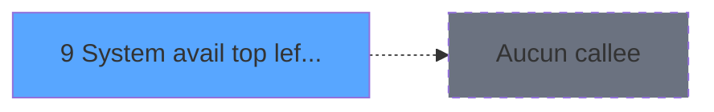

# ADH IDE 9 - System avail (top left corner

> **Analyse**: Phases 1-4 2026-02-07 03:39 -> 01:06 (21h26min) | Assemblage 01:06
> **Pipeline**: V7.2 Enrichi
> **Structure**: 4 onglets (Resume | Ecrans | Donnees | Connexions)

<!-- TAB:Resume -->

## 1. FICHE D'IDENTITE

| Attribut | Valeur |
|----------|--------|
| Projet | ADH |
| IDE Position | 9 |
| Nom Programme | System avail (top left corner |
| Fichier source | `Prg_9.xml` |
| Dossier IDE | General |
| Taches | 1 (0 ecrans visibles) |
| Tables modifiees | 1 |
| Programmes appeles | 0 |
| Complexite | **BASSE** (score 7/100) |

## 2. DESCRIPTION FONCTIONNELLE

Ce programme affiche un indicateur de disponibilité système dans le coin supérieur gauche de l'interface ADH. Il consulte la variable globale **VG79** pour vérifier l'état opérationnel de l'application et enregistre chaque changement d'état dans la table d'audit **log_affec_auto_detail**. Le traitement est déclenchement lors du chargement du menu de saisie des données (IDe 7 - Menu Data Catching).

La logique est extrêmement compacte : 9 lignes de code distribuées dans une unique tâche sans écrans visibles. Le flux lit VG79, convertit la valeur en booléen normalisé, applique une inversion logique NOT pour certains usages de traçabilité, puis persiste le résultat dans la table d'audit. Aucun sous-programme n'est appelé, ce qui en fait un composant terminal sans impact sur d'autres modules.

De point de vue de la migration vers .NET, c'est l'un des programmes les plus simples du projet ADH : logique métier triviale, une seule dépendance externe (VG79), une table d'audit basique. Transformation vers un service injectable C# peut se faire en quelques heures seulement, avec très peu de risque de régression.

## 3. BLOCS FONCTIONNELS

### 3.1 Traitement (1 tache)

Traitements internes.

---

#### 9 - System avail (top left corner

**Role** : Traitement : System avail (top left corner.

## 5. REGLES METIER

1 regles identifiees:

### Autres (1 regles)

#### [RM-001] Negation de ([C]) (condition inversee)

| Element | Detail |
|---------|--------|
| **Condition** | `NOT ([C])` |
| **Si vrai** | Action si vrai |
| **Expression source** | Expression 3 : `NOT ([C])` |
| **Exemple** | Si NOT ([C]) → Action si vrai |

## 6. CONTEXTE

- **Appele par**: [Menu Data Catching (IDE 7)](ADH-IDE-7.md)
- **Appelle**: 0 programmes | **Tables**: 1 (W:1 R:0 L:0) | **Taches**: 1 | **Expressions**: 3

<!-- TAB:Ecrans -->

## 8. ECRANS

*(Programme sans ecran visible)*

## 9. NAVIGATION

### 9.3 Structure hierarchique (1 tache)

| Position | Tache | Type | Dimensions | Bloc |
|----------|-------|------|------------|------|
| **9.1** | [**System avail (top left corner** (9)](#t1) | MDI | - | Traitement |

### 9.4 Algorigramme

> **Legende**: Vert = START/END OK | Rouge = END KO | Bleu = Decisions
> *Algorigramme auto-genere. Utiliser `/algorigramme` pour une synthese metier detaillee.*

<!-- TAB:Donnees -->

## 10. TABLES

### Tables utilisees (1)

| ID | Nom | Description | Type | R | W | L | Usages |
|----|-----|-------------|------|---|---|---|--------|
| 780 | log_affec_auto_detail |  | DB |   | **W** |   | 1 |

### Colonnes par table (0 / 1 tables avec colonnes identifiees)

Table 780 - log_affec_auto_detail (**W**) - 1 usages

*Table utilisee uniquement en Link ou aucune colonne Real identifiee dans le DataView.*

## 11. VARIABLES

*(Programme sans variables locales mappees)*

## 12. EXPRESSIONS

**3 / 3 expressions decodees (100%)**

### 12.1 Repartition par type

| Type | Expressions | Regles |
|------|-------------|--------|
| NEGATION | 1 | 5 |
| REFERENCE_VG | 1 | 0 |
| CAST_LOGIQUE | 1 | 0 |

### 12.2 Expressions cles par type

#### NEGATION (1 expressions)

| Type | IDE | Expression | Regle |
|------|-----|------------|-------|
| NEGATION | 3 | `NOT ([C])` | [RM-001](#rm-RM-001) |

#### REFERENCE_VG (1 expressions)

| Type | IDE | Expression | Regle |
|------|-----|------------|-------|
| REFERENCE_VG | 1 | `VG79` | - |

#### CAST_LOGIQUE (1 expressions)

| Type | IDE | Expression | Regle |
|------|-----|------------|-------|
| CAST_LOGIQUE | 2 | `'TRUE'LOG` | - |

<!-- TAB:Connexions -->

## 13. GRAPHE D'APPELS

### 13.1 Chaine depuis Main (Callers)

Main -> ... -> [Menu Data Catching (IDE 7)](ADH-IDE-7.md) -> **System avail (top left corner (IDE 9)**

### 13.2 Callers

| IDE | Nom Programme | Nb Appels |
|-----|---------------|-----------|
| [7](ADH-IDE-7.md) | Menu Data Catching | 1 |

### 13.3 Callees (programmes appeles)

### 13.4 Detail Callees avec contexte

| IDE | Nom Programme | Appels | Contexte |
|-----|---------------|--------|----------|
| - | (aucun) | - | - |

## 14. RECOMMANDATIONS MIGRATION

### 14.1 Profil du programme

| Metrique | Valeur | Impact migration |
|----------|--------|-----------------|
| Lignes de logique | 9 | Programme compact |
| Expressions | 3 | Peu de logique |
| Tables WRITE | 1 | Impact faible |
| Sous-programmes | 0 | Peu de dependances |
| Ecrans visibles | 0 | Ecran unique ou traitement batch |
| Code desactive | 0% (0 / 9) | Code sain |
| Regles metier | 1 | Quelques regles a preserver |

### 14.2 Plan de migration par bloc

#### Traitement (1 tache: 0 ecran, 1 traitement)

- **Strategie** : 1 service(s) backend injectable(s) (Domain Services).
- Decomposer les taches en services unitaires testables.

### 14.3 Dependances critiques

| Dependance | Type | Appels | Impact |
|------------|------|--------|--------|
| log_affec_auto_detail | Table WRITE (Database) | 1x | Schema + repository |

---
*Spec DETAILED generee par Pipeline V7.2 - 2026-02-08 01:08*
