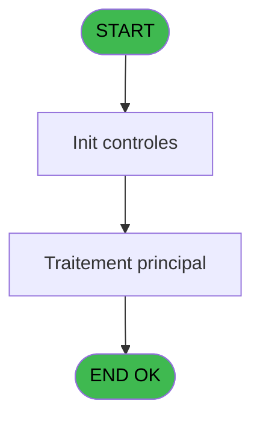
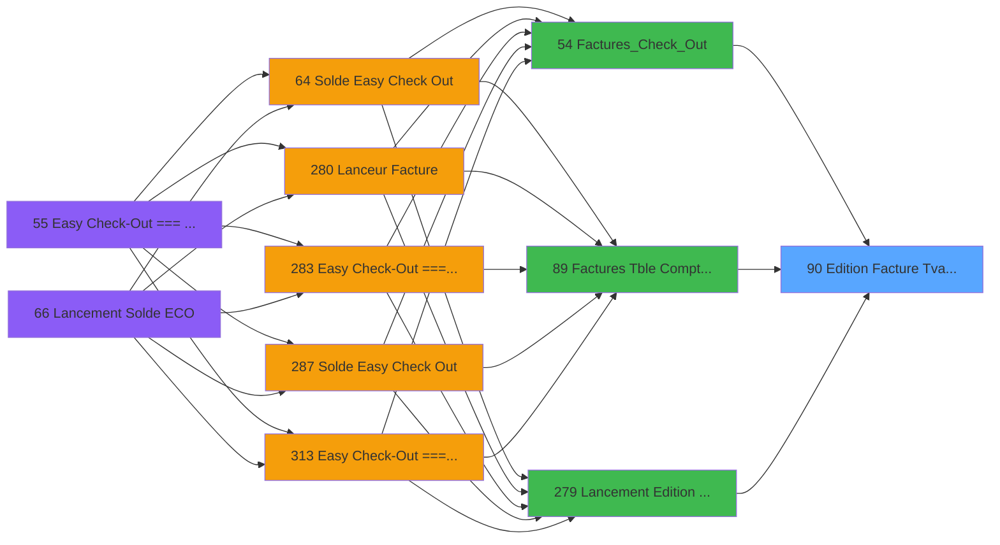

# ADH IDE 90 - Edition Facture Tva(Compta&Ve)

> **Analyse**: Phases 1-4 2026-02-07 03:46 -> 02:27 (22h41min) | Assemblage 02:27
> **Pipeline**: V7.2 Enrichi
> **Structure**: 4 onglets (Resume | Ecrans | Donnees | Connexions)

<!-- TAB:Resume -->

## 1. FICHE D'IDENTITE

| Attribut | Valeur |
|----------|--------|
| Projet | ADH |
| IDE Position | 90 |
| Nom Programme | Edition Facture Tva(Compta&Ve) |
| Fichier source | `Prg_90.xml` |
| Dossier IDE | Facturation |
| Taches | 4 (0 ecrans visibles) |
| Tables modifiees | 0 |
| Programmes appeles | 0 |
| Complexite | **BASSE** (score 0/100) |

## 2. DESCRIPTION FONCTIONNELLE

# ADH IDE 90 - Edition Facture TVA (Compta & Ventes)

Programme de génération et d'édition de factures avec calcul automatique de la TVA. Appelé depuis trois points d'entrée : le tableau de gestion comptable/ventes (IDE 89), le workflow Easy Checkout (IDE 54), ou le menu de lancement manuel (IDE 279). Reçoit en paramètres les références de compte et filiation pour identifier la facture à traiter, puis structure les données pour l'impression.

Décomposé en quatre tâches principales : la tâche principale "Edition Facture TVA (Ventes)" initialise le contexte et récupère les lignes de facture, la tâche "Edition" formate les détails articles avec montants unitaires et totaux, la tâche "Edition du Pied" calcule et affiche les totaux (HT, TVA, TTC) ainsi que les informations de paiement, et la tâche "Total Général" consolide les montants finaux pour la mise en page.

Utilise les tables REF de paramétrage (devises, moyens de paiement, taux TVA) et accède aux données de facturation stockées dans les tables opérationnelles. Produit une édition formatée prête pour impression thermique ou PDF, avec gestion des cas limites (facture vide, arrondis fiscaux, montants zéro).

## 3. BLOCS FONCTIONNELS

### 3.1 Saisie (1 tache)

Ce bloc traite la saisie des donnees de la transaction.

---

#### 90 - Edition Facture Tva(Ventes)

**Role** : Saisie des donnees : Edition Facture Tva(Ventes).
**Variables liees** : ER (P.Num Facture), ET (P.Facture sans Nom), EU (P.Facture sans Adresse), EV (P.Facture flaguee)

### 3.2 Impression (2 taches)

Generation des documents et tickets.

---

#### 90.1 - Edition

**Role** : Generation du document : Edition.

---

#### 90.1.1 - Edition du Pied

**Role** : Generation du document : Edition du Pied.

### 3.3 Traitement (1 tache)

Traitements internes.

---

#### 90.1.1.1 - Total Général

**Role** : Traitement : Total Général.

## 5. REGLES METIER

1 regles identifiees:

### Autres (1 regles)

#### [RM-001] Valeur par defaut si Trim(VG22) est vide

| Element | Detail |
|---------|--------|
| **Condition** | `Trim(VG22)=''` |
| **Si vrai** | 'N12.2Z' |
| **Si faux** | VG22) |
| **Expression source** | Expression 2 : `IF(Trim(VG22)='','N12.2Z',VG22)` |
| **Exemple** | Si Trim(VG22)='' → 'N12.2Z'. Sinon → VG22) |

## 6. CONTEXTE

- **Appele par**: [Factures (Tble Compta&Vent (IDE 89)](ADH-IDE-89.md), [Factures_Check_Out (IDE 54)](ADH-IDE-54.md), [Lancement Edition Facture (IDE 279)](ADH-IDE-279.md)
- **Appelle**: 0 programmes | **Tables**: 8 (W:0 R:3 L:5) | **Taches**: 4 | **Expressions**: 4

<!-- TAB:Ecrans -->

## 8. ECRANS

*(Programme sans ecran visible)*

## 9. NAVIGATION

### 9.3 Structure hierarchique (4 taches)

| Position | Tache | Type | Dimensions | Bloc |
|----------|-------|------|------------|------|
| **90.1** | [**Edition Facture Tva(Ventes)** (90)](#t1) | - | - | Saisie |
| **90.2** | [**Edition** (90.1)](#t2) | - | - | Impression |
| 90.2.1 | [Edition du Pied (90.1.1)](#t3) | - | - | |
| **90.3** | [**Total Général** (90.1.1.1)](#t4) | - | - | Traitement |

### 9.4 Algorigramme

> **Legende**: Vert = START/END OK | Rouge = END KO | Bleu = Decisions
> *Algorigramme auto-genere. Utiliser `/algorigramme` pour une synthese metier detaillee.*

<!-- TAB:Donnees -->

## 10. TABLES

### Tables utilisees (8)

| ID | Nom | Description | Type | R | W | L | Usages |
|----|-----|-------------|------|---|---|---|--------|
| 867 | log_maj_tpe |  | DB | R |   |   | 2 |
| 744 | pv_lieux_vente | Donnees de ventes | DB | R |   |   | 1 |
| 27 | donnees_village__dvi |  | DB | R |   |   | 1 |
| 31 | gm-complet_______gmc |  | DB |   |   | L | 1 |
| 869 | Detail_Import_Boutique |  | DB |   |   | L | 1 |
| 932 | taxe_add_param |  | DB |   |   | L | 1 |
| 372 | pv_budget |  | DB |   |   | L | 1 |
| 866 | maj_appli_tpe |  | DB |   |   | L | 1 |

### Colonnes par table (1 / 3 tables avec colonnes identifiees)

Table 867 - log_maj_tpe (R) - 2 usages

*Table utilisee uniquement en Link ou aucune colonne Real identifiee dans le DataView.*

Table 744 - pv_lieux_vente (R) - 1 usages

*Table utilisee uniquement en Link ou aucune colonne Real identifiee dans le DataView.*

Table 27 - donnees_village__dvi (R) - 1 usages

| Lettre | Variable | Acces | Type |
|--------|----------|-------|------|
| A | P.Societe | R | Alpha |
| B | P.Compte GM | R | Numeric |
| C | P.Filiation | R | Numeric |
| D | P.Nom Fichier PDF | R | Alpha |
| E | P.Num Facture | R | Numeric |
| F | P.Service | R | Alpha |
| G | P.Facture sans Nom | R | Logical |
| H | P.Facture sans Adresse | R | Logical |
| I | P.Facture flaguee | R | Logical |
| J | P.Archive | R | Logical |
| K | P.Easy Check Out | R | Logical |
| L | P.Reediter | R | Logical |

## 11. VARIABLES

### 11.1 Parametres entrants (12)

Variables recues du programme appelant ([Factures (Tble Compta&Vent (IDE 89)](ADH-IDE-89.md)).

| Lettre | Nom | Type | Usage dans |
|--------|-----|------|-----------|
| EN | P.Societe | Alpha | - |
| EO | P.Compte GM | Numeric | - |
| EP | P.Filiation | Numeric | - |
| EQ | P.Nom Fichier PDF | Alpha | - |
| ER | P.Num Facture | Numeric | [90](#t1) |
| ES | P.Service | Alpha | - |
| ET | P.Facture sans Nom | Logical | - |
| EU | P.Facture sans Adresse | Logical | - |
| EV | P.Facture flaguee | Logical | - |
| EW | P.Archive | Logical | - |
| EX | P.Easy Check Out | Logical | - |
| EY | P.Reediter | Logical | - |

## 12. EXPRESSIONS

**4 / 4 expressions decodees (100%)**

### 12.1 Repartition par type

| Type | Expressions | Regles |
|------|-------------|--------|
| CONDITION | 1 | 5 |
| OTHER | 1 | 0 |
| CAST_LOGIQUE | 2 | 0 |

### 12.2 Expressions cles par type

#### CONDITION (1 expressions)

| Type | IDE | Expression | Regle |
|------|-----|------------|-------|
| CONDITION | 2 | `IF(Trim(VG22)='','N12.2Z',VG22)` | [RM-001](#rm-RM-001) |

#### OTHER (1 expressions)

| Type | IDE | Expression | Regle |
|------|-----|------------|-------|
| OTHER | 1 | `P.Num Facture [E]` | - |

#### CAST_LOGIQUE (2 expressions)

| Type | IDE | Expression | Regle |
|------|-----|------------|-------|
| CAST_LOGIQUE | 4 | `INIPut('CompressPDF =Y','FALSE'LOG)` | - |
| CAST_LOGIQUE | 3 | `INIPut('EmbedFonts=N','FALSE'LOG)` | - |

<!-- TAB:Connexions -->

## 13. GRAPHE D'APPELS

### 13.1 Chaine depuis Main (Callers)

Main -> ... -> [Factures (Tble Compta&Vent (IDE 89)](ADH-IDE-89.md) -> **Edition Facture Tva(Compta&Ve) (IDE 90)**

Main -> ... -> [Factures_Check_Out (IDE 54)](ADH-IDE-54.md) -> **Edition Facture Tva(Compta&Ve) (IDE 90)**

Main -> ... -> [Lancement Edition Facture (IDE 279)](ADH-IDE-279.md) -> **Edition Facture Tva(Compta&Ve) (IDE 90)**

### 13.2 Callers

| IDE | Nom Programme | Nb Appels |
|-----|---------------|-----------|
| [89](ADH-IDE-89.md) | Factures (Tble Compta&Vent | 3 |
| [54](ADH-IDE-54.md) | Factures_Check_Out | 2 |
| [279](ADH-IDE-279.md) | Lancement Edition Facture | 1 |

### 13.3 Callees (programmes appeles)

### 13.4 Detail Callees avec contexte

| IDE | Nom Programme | Appels | Contexte |
|-----|---------------|--------|----------|
| - | (aucun) | - | - |

## 14. RECOMMANDATIONS MIGRATION

### 14.1 Profil du programme

| Metrique | Valeur | Impact migration |
|----------|--------|-----------------|
| Lignes de logique | 138 | Programme compact |
| Expressions | 4 | Peu de logique |
| Tables WRITE | 0 | Impact faible |
| Sous-programmes | 0 | Peu de dependances |
| Ecrans visibles | 0 | Ecran unique ou traitement batch |
| Code desactive | 0% (0 / 138) | Code sain |
| Regles metier | 1 | Quelques regles a preserver |

### 14.2 Plan de migration par bloc

#### Saisie (1 tache: 0 ecran, 1 traitement)

- **Strategie** : Formulaire React/Blazor avec validation Zod/FluentValidation.
- Validation temps reel cote client + serveur

#### Impression (2 taches: 0 ecran, 2 traitements)

- **Strategie** : Templates HTML -> PDF via wkhtmltopdf ou Puppeteer.
- `PrintService` injectable avec choix imprimante

#### Traitement (1 tache: 0 ecran, 1 traitement)

- **Strategie** : 1 service(s) backend injectable(s) (Domain Services).
- Decomposer les taches en services unitaires testables.

### 14.3 Dependances critiques

| Dependance | Type | Appels | Impact |
|------------|------|--------|--------|

---
*Spec DETAILED generee par Pipeline V7.2 - 2026-02-08 02:28*
