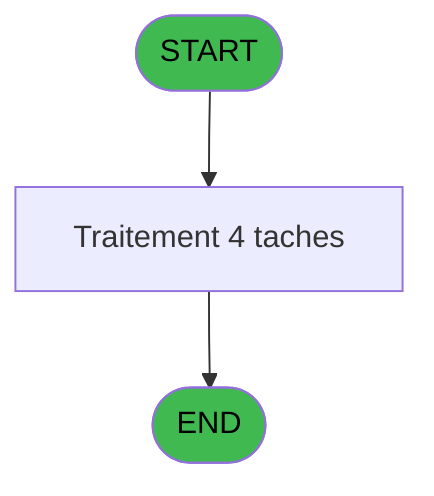

# ADH IDE 90 - Edition Facture Tva(Compta&Ve)

> **Analyse**: Phases 1-4 2026-02-07 03:46 -> 03:46 (28s) | Assemblage 06:55
> **Pipeline**: V7.2 Enrichi
> **Structure**: 4 onglets (Resume | Ecrans | Donnees | Connexions)

<!-- TAB:Resume -->

## 1. FICHE D'IDENTITE

| Attribut | Valeur |
|----------|--------|
| Projet | ADH |
| IDE Position | 90 |
| Nom Programme | Edition Facture Tva(Compta&Ve) |
| Fichier source | `Prg_90.xml` |
| Dossier IDE | Factures |
| Taches | 4 (0 ecrans visibles) |
| Tables modifiees | 0 |
| Programmes appeles | 0 |

## 2. DESCRIPTION FONCTIONNELLE

**Edition Facture Tva(Compta&Ve)** assure la gestion complete de ce processus, accessible depuis [Factures (Tble Compta&Vent (IDE 89)](ADH-IDE-89.md), [Factures_Check_Out (IDE 54)](ADH-IDE-54.md), [Lancement Edition Facture (IDE 279)](ADH-IDE-279.md).

Le flux de traitement s'organise en **3 blocs fonctionnels** :

- **Impression** (2 taches) : generation de tickets et documents
- **Traitement** (1 tache) : traitements metier divers
- **Saisie** (1 tache) : ecrans de saisie utilisateur (formulaires, champs, donnees)

**Logique metier** : 1 regles identifiees couvrant valeurs par defaut.

Detail : phases du traitement

#### Phase 1 : Saisie (1 tache)

- **T1** - Edition Facture Tva(Ventes)

#### Phase 2 : Impression (2 taches)

- **T2** - Edition
- **T3** - Edition du Pied

#### Phase 3 : Traitement (1 tache)

- **T4** - Total Général

## 3. BLOCS FONCTIONNELS

### 3.1 Saisie (1 tache)

Ce bloc traite la saisie des donnees de la transaction.

---

#### T1 - Edition Facture Tva(Ventes)

**Role** : Saisie des donnees : Edition Facture Tva(Ventes).
**Variables liees** : E (P.Num Facture), G (P.Facture sans Nom), H (P.Facture sans Adresse), I (P.Facture flaguee)

### 3.2 Impression (2 taches)

Generation des documents et tickets.

---

#### T2 - Edition

**Role** : Generation du document : Edition.

---

#### T3 - Edition du Pied

**Role** : Generation du document : Edition du Pied.

### 3.3 Traitement (1 tache)

Traitements internes.

---

#### T4 - Total Général

**Role** : Traitement : Total Général.

## 5. REGLES METIER

1 regles identifiees:

### Autres (1 regles)

#### [RM-001] Valeur par defaut si Trim(VG22) est vide

| Element | Detail |
|---------|--------|
| **Condition** | `Trim(VG22)=''` |
| **Si vrai** | 'N12.2Z' |
| **Si faux** | VG22) |
| **Expression source** | Expression 2 : `IF(Trim(VG22)='','N12.2Z',VG22)` |
| **Exemple** | Si Trim(VG22)='' → 'N12.2Z'. Sinon → VG22) |

## 6. CONTEXTE

- **Appele par**: [Factures (Tble Compta&Vent (IDE 89)](ADH-IDE-89.md), [Factures_Check_Out (IDE 54)](ADH-IDE-54.md), [Lancement Edition Facture (IDE 279)](ADH-IDE-279.md)
- **Appelle**: 0 programmes | **Tables**: 8 (W:0 R:3 L:5) | **Taches**: 4 | **Expressions**: 4

<!-- TAB:Ecrans -->

## 8. ECRANS

*(Programme sans ecran visible)*

## 9. NAVIGATION

### 9.3 Structure hierarchique (4 taches)

| Position | Tache | Type | Dimensions | Bloc |
|----------|-------|------|------------|------|
| **90.1** | [**Edition Facture Tva(Ventes)** (T1)](#t1) | - | - | Saisie |
| **90.2** | [**Edition** (T2)](#t2) | - | - | Impression |
| 90.2.1 | [Edition du Pied (T3)](#t3) | - | - | |
| **90.3** | [**Total Général** (T4)](#t4) | - | - | Traitement |

### 9.4 Algorigramme

> *algo-data indisponible. Utiliser `/algorigramme` pour generer.*

<!-- TAB:Donnees -->

## 10. TABLES

### Tables utilisees (8)

| ID | Nom | Description | Type | R | W | L | Usages |
|----|-----|-------------|------|---|---|---|--------|
| 27 | donnees_village__dvi |  | DB | R |   |   | 1 |
| 31 | gm-complet_______gmc |  | DB |   |   | L | 1 |
| 372 | pv_budget |  | DB |   |   | L | 1 |
| 744 | pv_lieux_vente | Donnees de ventes | DB | R |   |   | 1 |
| 866 | maj_appli_tpe |  | DB |   |   | L | 1 |
| 867 | log_maj_tpe |  | DB | R |   |   | 2 |
| 869 | Detail_Import_Boutique |  | DB |   |   | L | 1 |
| 932 | taxe_add_param |  | DB |   |   | L | 1 |

### Colonnes par table (1 / 3 tables avec colonnes identifiees)

Table 27 - donnees_village__dvi (R) - 1 usages

| Lettre | Variable | Acces | Type |
|--------|----------|-------|------|
| A | P.Societe | R | Alpha |
| B | P.Compte GM | R | Numeric |
| C | P.Filiation | R | Numeric |
| D | P.Nom Fichier PDF | R | Alpha |
| E | P.Num Facture | R | Numeric |
| F | P.Service | R | Alpha |
| G | P.Facture sans Nom | R | Logical |
| H | P.Facture sans Adresse | R | Logical |
| I | P.Facture flaguee | R | Logical |
| J | P.Archive | R | Logical |
| K | P.Easy Check Out | R | Logical |
| L | P.Reediter | R | Logical |

Table 744 - pv_lieux_vente (R) - 1 usages

*Table utilisee uniquement en Link ou aucune colonne Real identifiee dans le DataView.*

Table 867 - log_maj_tpe (R) - 2 usages

*Table utilisee uniquement en Link ou aucune colonne Real identifiee dans le DataView.*

## 11. VARIABLES

### 11.1 Parametres entrants (12)

Variables recues du programme appelant ([Factures (Tble Compta&Vent (IDE 89)](ADH-IDE-89.md)).

| Lettre | Nom | Type | Usage dans |
|--------|-----|------|-----------|
| A | P.Societe | Alpha | - |
| B | P.Compte GM | Numeric | - |
| C | P.Filiation | Numeric | - |
| D | P.Nom Fichier PDF | Alpha | - |
| E | P.Num Facture | Numeric | [T1](#t1) |
| F | P.Service | Alpha | - |
| G | P.Facture sans Nom | Logical | - |
| H | P.Facture sans Adresse | Logical | - |
| I | P.Facture flaguee | Logical | - |
| J | P.Archive | Logical | - |
| K | P.Easy Check Out | Logical | - |
| L | P.Reediter | Logical | - |

## 12. EXPRESSIONS

**4 / 4 expressions decodees (100%)**

### 12.1 Repartition par type

| Type | Expressions | Regles |
|------|-------------|--------|
| CONDITION | 1 | 5 |
| OTHER | 1 | 0 |
| CAST_LOGIQUE | 2 | 0 |

### 12.2 Expressions cles par type

#### CONDITION (1 expressions)

| Type | IDE | Expression | Regle |
|------|-----|------------|-------|
| CONDITION | 2 | `IF(Trim(VG22)='','N12.2Z',VG22)` | [RM-001](#rm-RM-001) |

#### OTHER (1 expressions)

| Type | IDE | Expression | Regle |
|------|-----|------------|-------|
| OTHER | 1 | `P.Num Facture [E]` | - |

#### CAST_LOGIQUE (2 expressions)

| Type | IDE | Expression | Regle |
|------|-----|------------|-------|
| CAST_LOGIQUE | 4 | `INIPut('CompressPDF =Y','FALSE'LOG)` | - |
| CAST_LOGIQUE | 3 | `INIPut('EmbedFonts=N','FALSE'LOG)` | - |

<!-- TAB:Connexions -->

## 13. GRAPHE D'APPELS

### 13.1 Chaine depuis Main (Callers)

Main -> ... -> [Factures (Tble Compta&Vent (IDE 89)](ADH-IDE-89.md) -> **Edition Facture Tva(Compta&Ve) (IDE 90)**

Main -> ... -> [Factures_Check_Out (IDE 54)](ADH-IDE-54.md) -> **Edition Facture Tva(Compta&Ve) (IDE 90)**

Main -> ... -> [Lancement Edition Facture (IDE 279)](ADH-IDE-279.md) -> **Edition Facture Tva(Compta&Ve) (IDE 90)**

### 13.2 Callers

| IDE | Nom Programme | Nb Appels |
|-----|---------------|-----------|
| [89](ADH-IDE-89.md) | Factures (Tble Compta&Vent | 3 |
| [54](ADH-IDE-54.md) | Factures_Check_Out | 2 |
| [279](ADH-IDE-279.md) | Lancement Edition Facture | 1 |

### 13.3 Callees (programmes appeles)

### 13.4 Detail Callees avec contexte

| IDE | Nom Programme | Appels | Contexte |
|-----|---------------|--------|----------|
| - | (aucun) | - | - |

## 14. RECOMMANDATIONS MIGRATION

### 14.1 Profil du programme

| Metrique | Valeur | Impact migration |
|----------|--------|-----------------|
| Lignes de logique | 138 | Programme compact |
| Expressions | 4 | Peu de logique |
| Tables WRITE | 0 | Impact faible |
| Sous-programmes | 0 | Peu de dependances |
| Ecrans visibles | 0 | Ecran unique ou traitement batch |
| Code desactive | 0% (0 / 138) | Code sain |
| Regles metier | 1 | Quelques regles a preserver |

### 14.2 Plan de migration par bloc

#### Saisie (1 tache: 0 ecran, 1 traitement)

- **Strategie** : Formulaire React/Blazor avec validation Zod/FluentValidation.
- Validation temps reel cote client + serveur

#### Impression (2 taches: 0 ecran, 2 traitements)

- **Strategie** : Templates HTML -> PDF via wkhtmltopdf ou Puppeteer.
- `PrintService` injectable avec choix imprimante

#### Traitement (1 tache: 0 ecran, 1 traitement)

- **Strategie** : 1 service(s) backend injectable(s) (Domain Services).
- Decomposer les taches en services unitaires testables.

### 14.3 Dependances critiques

| Dependance | Type | Appels | Impact |
|------------|------|--------|--------|

---
*Spec DETAILED generee par Pipeline V7.2 - 2026-02-07 06:55*
