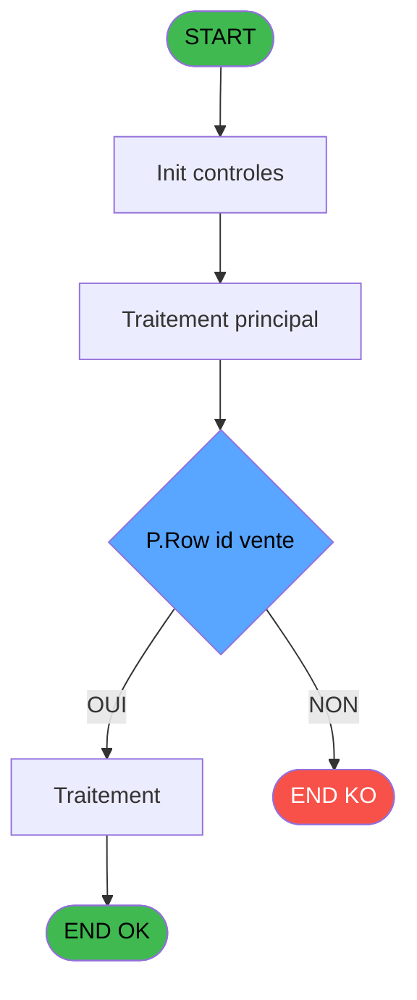
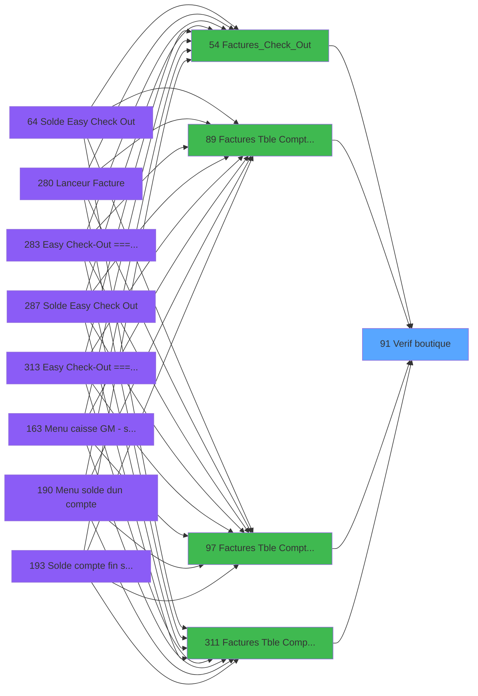

# ADH IDE 91 - Verif boutique

> **Analyse**: Phases 1-4 2026-02-07 06:55 -> 02:28 (19h32min) | Assemblage 02:28
> **Pipeline**: V7.2 Enrichi
> **Structure**: 4 onglets (Resume | Ecrans | Donnees | Connexions)

<!-- TAB:Resume -->

## 1. FICHE D'IDENTITE

| Attribut | Valeur |
|----------|--------|
| Projet | ADH |
| IDE Position | 91 |
| Nom Programme | Verif boutique |
| Fichier source | `Prg_91.xml` |
| Dossier IDE | General |
| Taches | 1 (0 ecrans visibles) |
| Tables modifiees | 0 |
| Programmes appeles | 0 |
| Complexite | **BASSE** (score 0/100) |

## 2. DESCRIPTION FONCTIONNELLE

ADH IDE 91 est un utilitaire de validation qui vérifie l'existence des articles de boutique dans la table de configuration TPE (maj_appli_tpe) avant la création des factures. Le programme reçoit un identifiant de ligne de vente et s'assure que la référence est valide et existe dans la base—si la ligne n'existe pas, il retourne un flag FALSE pour bloquer la génération de la facture. C'est un contrôle qualité essentiel qui prévient les factures orphelines en garantissant la cohérence entre les modules de boutique, ventes et comptabilité.

Le programme fonctionne comme un point de contrôle dans le flux de checkout orchestré par ADH IDE 54 (Factures_Check_Out). Appelé après le chargement des données de boutique (ADH 59) et avant l'édition de la facture (ADH 90), il effectue une simple requête en lecture sur maj_appli_tpe en filtrant par (Societe, Compte, Row_id_vente) pour valider que la ligne existe. Avec seulement 17 lignes de logique et zéro branchement conditionnel, c'est une fonction de validation pure sans effets de bord—idéale pour la migration vers une couche de services.

Le code retourne deux flags logiques : E (existe_ligne_boutique) qui indique si la validation a réussi, et D (ligne_manquante) qui signale les lignes absentes. Cette architecture simple mais efficace permet au caller (ADH 54) de décider de poursuivre ou d'abandonner le processus d'invoice en fonction de l'intégrité des données, évitant ainsi des factures avec des références orphelines.

## 3. BLOCS FONCTIONNELS

## 5. REGLES METIER

1 regles identifiees:

### Autres (1 regles)

#### [RM-001] Negation de [J] (condition inversee)

| Element | Detail |
|---------|--------|
| **Condition** | `NOT [J]` |
| **Si vrai** | Action si vrai |
| **Expression source** | Expression 8 : `NOT [J]` |
| **Exemple** | Si NOT [J] → Action si vrai |

## 6. CONTEXTE

- **Appele par**: [Factures (Tble Compta&Vent (IDE 89)](ADH-IDE-89.md), [Factures (Tble Compta&Vent) V3 (IDE 97)](ADH-IDE-97.md), [Factures (Tble Compta&Vent (IDE 311)](ADH-IDE-311.md), [Factures_Check_Out (IDE 54)](ADH-IDE-54.md)
- **Appelle**: 0 programmes | **Tables**: 1 (W:0 R:1 L:0) | **Taches**: 1 | **Expressions**: 9

<!-- TAB:Ecrans -->

## 8. ECRANS

*(Programme sans ecran visible)*

## 9. NAVIGATION

### 9.3 Structure hierarchique (0 tache)

| Position | Tache | Type | Dimensions | Bloc |
|----------|-------|------|------------|------|

### 9.4 Algorigramme

> **Legende**: Vert = START/END OK | Rouge = END KO | Bleu = Decisions
> *Algorigramme auto-genere. Utiliser `/algorigramme` pour une synthese metier detaillee.*

<!-- TAB:Donnees -->

## 10. TABLES

### Tables utilisees (1)

| ID | Nom | Description | Type | R | W | L | Usages |
|----|-----|-------------|------|---|---|---|--------|
| 866 | maj_appli_tpe |  | DB | R |   |   | 1 |

### Colonnes par table (1 / 1 tables avec colonnes identifiees)

Table 866 - maj_appli_tpe (R) - 1 usages

| Lettre | Variable | Acces | Type |
|--------|----------|-------|------|
| A | P.Societe | R | Alpha |
| B | P.Compte | R | Numeric |
| C | P.Row id vente | R | Numeric |
| D | P.Ligne manquante ? | R | Logical |
| E | v.Existe ligne boutique ? | R | Logical |

## 11. VARIABLES

### 11.1 Parametres entrants (4)

Variables recues du programme appelant ([Factures (Tble Compta&Vent (IDE 89)](ADH-IDE-89.md)).

| Lettre | Nom | Type | Usage dans |
|--------|-----|------|-----------|
| EN | P.Societe | Alpha | 1x parametre entrant |
| EO | P.Compte | Numeric | 1x parametre entrant |
| EP | P.Row id vente | Numeric | 1x parametre entrant |
| EQ | P.Ligne manquante ? | Logical | - |

### 11.2 Variables de session (1)

Variables persistantes pendant toute la session.

| Lettre | Nom | Type | Usage dans |
|--------|-----|------|-----------|
| ER | v.Existe ligne boutique ? | Logical | - |

## 12. EXPRESSIONS

**9 / 9 expressions decodees (100%)**

### 12.1 Repartition par type

| Type | Expressions | Regles |
|------|-------------|--------|
| CONDITION | 1 | 0 |
| NEGATION | 1 | 5 |
| CONSTANTE | 2 | 0 |
| OTHER | 3 | 0 |
| CAST_LOGIQUE | 2 | 0 |

### 12.2 Expressions cles par type

#### CONDITION (1 expressions)

| Type | IDE | Expression | Regle |
|------|-----|------------|-------|
| CONDITION | 3 | `CndRange(P.Row id vente [C]<>0,P.Row id vente [C])` | - |

#### NEGATION (1 expressions)

| Type | IDE | Expression | Regle |
|------|-----|------------|-------|
| NEGATION | 8 | `NOT [J]` | [RM-001](#rm-RM-001) |

#### CONSTANTE (2 expressions)

| Type | IDE | Expression | Regle |
|------|-----|------------|-------|
| CONSTANTE | 6 | `1` | - |
| CONSTANTE | 4 | `'R'` | - |

#### OTHER (3 expressions)

| Type | IDE | Expression | Regle |
|------|-----|------------|-------|
| OTHER | 5 | `[I]` | - |
| OTHER | 2 | `P.Compte [B]` | - |
| OTHER | 1 | `P.Societe [A]` | - |

#### CAST_LOGIQUE (2 expressions)

| Type | IDE | Expression | Regle |
|------|-----|------------|-------|
| CAST_LOGIQUE | 9 | `'FALSE'LOG` | - |
| CAST_LOGIQUE | 7 | `'TRUE'LOG` | - |

<!-- TAB:Connexions -->

## 13. GRAPHE D'APPELS

### 13.1 Chaine depuis Main (Callers)

Main -> ... -> [Factures (Tble Compta&Vent (IDE 89)](ADH-IDE-89.md) -> **Verif boutique (IDE 91)**

Main -> ... -> [Factures (Tble Compta&Vent) V3 (IDE 97)](ADH-IDE-97.md) -> **Verif boutique (IDE 91)**

Main -> ... -> [Factures (Tble Compta&Vent (IDE 311)](ADH-IDE-311.md) -> **Verif boutique (IDE 91)**

Main -> ... -> [Factures_Check_Out (IDE 54)](ADH-IDE-54.md) -> **Verif boutique (IDE 91)**

### 13.2 Callers

| IDE | Nom Programme | Nb Appels |
|-----|---------------|-----------|
| [89](ADH-IDE-89.md) | Factures (Tble Compta&Vent | 2 |
| [97](ADH-IDE-97.md) | Factures (Tble Compta&Vent) V3 | 2 |
| [311](ADH-IDE-311.md) | Factures (Tble Compta&Vent | 2 |
| [54](ADH-IDE-54.md) | Factures_Check_Out | 1 |

### 13.3 Callees (programmes appeles)

### 13.4 Detail Callees avec contexte

| IDE | Nom Programme | Appels | Contexte |
|-----|---------------|--------|----------|
| - | (aucun) | - | - |

## 14. RECOMMANDATIONS MIGRATION

### 14.1 Profil du programme

| Metrique | Valeur | Impact migration |
|----------|--------|-----------------|
| Lignes de logique | 17 | Programme compact |
| Expressions | 9 | Peu de logique |
| Tables WRITE | 0 | Impact faible |
| Sous-programmes | 0 | Peu de dependances |
| Ecrans visibles | 0 | Ecran unique ou traitement batch |
| Code desactive | 0% (0 / 17) | Code sain |
| Regles metier | 1 | Quelques regles a preserver |

### 14.2 Plan de migration par bloc

### 14.3 Dependances critiques

| Dependance | Type | Appels | Impact |
|------------|------|--------|--------|

---
*Spec DETAILED generee par Pipeline V7.2 - 2026-02-08 02:30*
