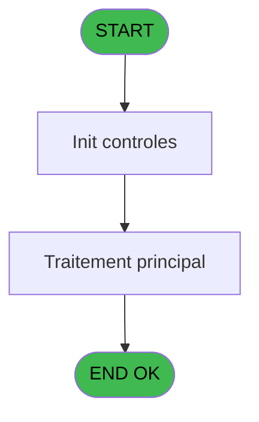

# ADH IDE 93 - Creation Pied Facture

> **Analyse**: Phases 1-4 2026-02-07 03:13 -> 03:13 (29s) | Assemblage 03:13
> **Pipeline**: V7.2 Enrichi
> **Structure**: 4 onglets (Resume | Ecrans | Donnees | Connexions)

<!-- TAB:Resume -->

## 1. FICHE D'IDENTITE

| Attribut | Valeur |
|----------|--------|
| Projet | ADH |
| IDE Position | 93 |
| Nom Programme | Creation Pied Facture |
| Fichier source | `Prg_93.xml` |
| Dossier IDE | Facturation |
| Taches | 1 (0 ecrans visibles) |
| Tables modifiees | 0 |
| Programmes appeles | 0 |
| :warning: Statut | **ORPHELIN_POTENTIEL** |

## 2. DESCRIPTION FONCTIONNELLE

**Creation Pied Facture** assure la gestion complete de ce processus.

**Logique metier** : 1 regles identifiees couvrant conditions metier.

## 3. BLOCS FONCTIONNELS

## 5. REGLES METIER

1 regles identifiees:

### Autres (1 regles)

#### [RM-001] Condition toujours vraie (flag actif)

| Element | Detail |
|---------|--------|
| **Condition** | `VG77` |
| **Si vrai** | 'TRUE'LOG |
| **Si faux** | [AD]<>'R') |
| **Expression source** | Expression 14 : `IF(VG77,'TRUE'LOG,[AD]<>'R')` |
| **Exemple** | Si VG77 → 'TRUE'LOG. Sinon → [AD]<>'R') |

## 6. CONTEXTE

- **Appele par**: (aucun)
- **Appelle**: 0 programmes | **Tables**: 2 (W:0 R:1 L:1) | **Taches**: 1 | **Expressions**: 16

<!-- TAB:Ecrans -->

## 8. ECRANS

*(Programme sans ecran visible)*

## 9. NAVIGATION

### 9.3 Structure hierarchique (0 tache)

| Position | Tache | Type | Dimensions | Bloc |
|----------|-------|------|------------|------|

### 9.4 Algorigramme

> **Legende**: Vert = START/END OK | Rouge = END KO | Bleu = Decisions
> *Algorigramme auto-genere. Utiliser `/algorigramme` pour une synthese metier detaillee.*

<!-- TAB:Donnees -->

## 10. TABLES

### Tables utilisees (2)

| ID | Nom | Description | Type | R | W | L | Usages |
|----|-----|-------------|------|---|---|---|--------|
| 866 | maj_appli_tpe |  | DB | R |   |   | 1 |
| 867 | log_maj_tpe |  | DB |   |   | L | 1 |

### Colonnes par table (1 / 1 tables avec colonnes identifiees)

Table 866 - maj_appli_tpe (R) - 1 usages

| Lettre | Variable | Acces | Type |
|--------|----------|-------|------|
| A | p.Societe | R | Unicode |
| B | p.Compte | R | Numeric |
| C | p.Filiation | R | Numeric |
| D | p.NumFac | R | Numeric |
| E | P.Flaguee | R | Logical |

## 11. VARIABLES

### 11.1 Parametres entrants (5)

Variables recues en parametre.

| Lettre | Nom | Type | Usage dans |
|--------|-----|------|-----------|
| A | p.Societe | Unicode | 1x parametre entrant |
| B | p.Compte | Numeric | 1x parametre entrant |
| C | p.Filiation | Numeric | 1x parametre entrant |
| D | p.NumFac | Numeric | 1x parametre entrant |
| E | P.Flaguee | Logical | - |

## 12. EXPRESSIONS

**16 / 16 expressions decodees (100%)**

### 12.1 Repartition par type

| Type | Expressions | Regles |
|------|-------------|--------|
| CALCULATION | 4 | 0 |
| CALCUL | 2 | 0 |
| CAST_LOGIQUE | 1 | 5 |
| CONSTANTE | 2 | 0 |
| OTHER | 7 | 0 |

### 12.2 Expressions cles par type

#### CALCULATION (4 expressions)

| Type | IDE | Expression | Regle |
|------|-----|------------|-------|
| CALCULATION | 12 | `[AN]+[Z]` | - |
| CALCULATION | 13 | `[AW]+[Z]` | - |
| CALCULATION | 8 | `[AL]+[Y]` | - |
| CALCULATION | 9 | `[AU]+[Y]` | - |

#### CALCUL (2 expressions)

| Type | IDE | Expression | Regle |
|------|-----|------------|-------|
| CALCUL | 11 | `[AV]+Round(([Z]/(1+[X]/100)*[X]/100),12,2)` | - |
| CALCUL | 10 | `[AM]+Round(([Z]/(1+[X]/100)*[X]/100),12,2)` | - |

#### CAST_LOGIQUE (1 expressions)

| Type | IDE | Expression | Regle |
|------|-----|------------|-------|
| CAST_LOGIQUE | 14 | `IF(VG77,'TRUE'LOG,[AD]<>'R')` | [RM-001](#rm-RM-001) |

#### CONSTANTE (2 expressions)

| Type | IDE | Expression | Regle |
|------|-----|------------|-------|
| CONSTANTE | 7 | `0` | - |
| CONSTANTE | 4 | `999` | - |

#### OTHER (7 expressions)

| Type | IDE | Expression | Regle |
|------|-----|------------|-------|
| OTHER | 6 | `p.Filiation [C]` | - |
| OTHER | 15 | `CndRange(VG53,'O')` | - |
| OTHER | 16 | `IsFirstRecordCycle(0)` | - |
| OTHER | 5 | `p.Compte [B]` | - |
| OTHER | 1 | `p.Societe [A]` | - |
| ... | | *+2 autres* | |

<!-- TAB:Connexions -->

## 13. GRAPHE D'APPELS

### 13.1 Chaine depuis Main (Callers)

**Chemin**: (pas de callers directs)

### 13.2 Callers

| IDE | Nom Programme | Nb Appels |
|-----|---------------|-----------|
| - | (aucun) | - |

### 13.3 Callees (programmes appeles)

### 13.4 Detail Callees avec contexte

| IDE | Nom Programme | Appels | Contexte |
|-----|---------------|--------|----------|
| - | (aucun) | - | - |

## 14. RECOMMANDATIONS MIGRATION

### 14.1 Profil du programme

| Metrique | Valeur | Impact migration |
|----------|--------|-----------------|
| Lignes de logique | 72 | Programme compact |
| Expressions | 16 | Peu de logique |
| Tables WRITE | 0 | Impact faible |
| Sous-programmes | 0 | Peu de dependances |
| Ecrans visibles | 0 | Ecran unique ou traitement batch |
| Code desactive | 0% (0 / 72) | Code sain |
| Regles metier | 1 | Quelques regles a preserver |

### 14.2 Plan de migration par bloc

### 14.3 Dependances critiques

| Dependance | Type | Appels | Impact |
|------------|------|--------|--------|

---
*Spec DETAILED generee par Pipeline V7.2 - 2026-02-07 03:13*
