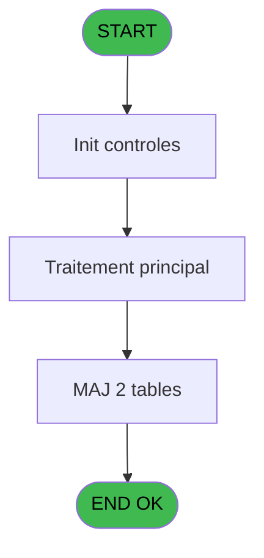
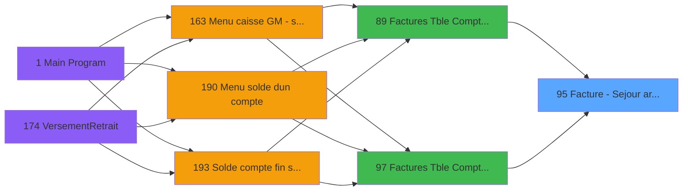

# ADH IDE 95 - Facture - Sejour archive

> **Analyse**: Phases 1-4 2026-02-07 03:47 -> 02:34 (22h47min) | Assemblage 02:34
> **Pipeline**: V7.2 Enrichi
> **Structure**: 4 onglets (Resume | Ecrans | Donnees | Connexions)

<!-- TAB:Resume -->

## 1. FICHE D'IDENTITE

| Attribut | Valeur |
|----------|--------|
| Projet | ADH |
| IDE Position | 95 |
| Nom Programme | Facture - Sejour archive |
| Fichier source | `Prg_95.xml` |
| Dossier IDE | Facturation |
| Taches | 6 (0 ecrans visibles) |
| Tables modifiees | 2 |
| Programmes appeles | 0 |
| Complexite | **BASSE** (score 14/100) |

## 2. DESCRIPTION FONCTIONNELLE

ADH IDE 95 - Facture Séjour archivé gère la création de lignes de facturation pour les séjours archivés. Ce programme est appelé depuis les interfaces de gestion des factures (ADH IDE 89 et 97) et traite les données de facturation comptable et commerciale. Il modifie deux tables principales : Affectation_Gift_Pass (pour gérer les allocations) et Rayons_Boutique (pour les articles de vente).

Le flux principal comporte 6 tâches orchestrées. La tâche "Hebergement" initialise le contexte et charge les données du séjour. Ensuite, "Création" valide la logique métier et prépare les lignes. Les deux tâches "Creation Lg Compta" et "Creation Lg Vente" génèrent respectivement les lignes comptables et commerciales avec les montants et références. Les tâches "Maj Hebergement Temp" synchronisent l'état temporaire avec les modifications effectuées.

Ce programme s'inscrit dans la chaîne de facturation en fin de séjour, transformant les données opérationnelles (hébergement, services) en écritures comptables pour archivage. Il garantit la traçabilité complète entre les opérations initiales et leur enregistrement financier définitif.

## 3. BLOCS FONCTIONNELS

### 3.1 Traitement (4 taches)

Traitements internes.

---

#### 95 - Hebergement [[ECRAN]](#ecran-t1)

**Role** : Traitement : Hebergement.
**Ecran** : 630 x 0 DLU | [Voir mockup](#ecran-t1)

3 sous-taches directes

| Tache | Nom | Bloc |
|-------|-----|------|
| [95.1](#t2) | Création | Traitement |
| [95.2.1](#t4) | Maj Hebergement Temp | Traitement |
| [95.3.1](#t6) | Maj Hebergement Temp | Traitement |

**Variables liees** : ER (V.Lien Hebergement_Pro)

---

#### 95.1 - Création

**Role** : Traitement : Création.

---

#### 95.2.1 - Maj Hebergement Temp

**Role** : Traitement : Maj Hebergement Temp.
**Variables liees** : ER (V.Lien Hebergement_Pro)

---

#### 95.3.1 - Maj Hebergement Temp

**Role** : Traitement : Maj Hebergement Temp.
**Variables liees** : ER (V.Lien Hebergement_Pro)

### 3.2 Calcul (1 tache)

Calculs metier : montants, stocks, compteurs.

---

#### 95.2 - Creation Lg Compta [[ECRAN]](#ecran-t3)

**Role** : Creation d'enregistrement : Creation Lg Compta.
**Ecran** : 1009 x 0 DLU | [Voir mockup](#ecran-t3)

### 3.3 Saisie (1 tache)

L'operateur saisit les donnees de la transaction via 1 ecran (Creation Lg Vente).

---

#### 95.3 - Creation Lg Vente [[ECRAN]](#ecran-t5)

**Role** : Saisie des donnees : Creation Lg Vente.
**Ecran** : 630 x 0 DLU | [Voir mockup](#ecran-t5)

## 5. REGLES METIER

*(Aucune regle metier identifiee dans les expressions)*

## 6. CONTEXTE

- **Appele par**: [Factures (Tble Compta&Vent (IDE 89)](ADH-IDE-89.md), [Factures (Tble Compta&Vent) V3 (IDE 97)](ADH-IDE-97.md)
- **Appelle**: 0 programmes | **Tables**: 6 (W:2 R:1 L:4) | **Taches**: 6 | **Expressions**: 7

<!-- TAB:Ecrans -->

## 8. ECRANS

*(Programme sans ecran visible)*

## 9. NAVIGATION

### 9.3 Structure hierarchique (6 taches)

| Position | Tache | Type | Dimensions | Bloc |
|----------|-------|------|------------|------|
| **95.1** | [**Hebergement** (95)](#t1) [mockup](#ecran-t1) | - | 630x0 | Traitement |
| 95.1.1 | [Création (95.1)](#t2) | - | - | |
| 95.1.2 | [Maj Hebergement Temp (95.2.1)](#t4) | - | - | |
| 95.1.3 | [Maj Hebergement Temp (95.3.1)](#t6) | - | - | |
| **95.2** | [**Creation Lg Compta** (95.2)](#t3) [mockup](#ecran-t3) | - | 1009x0 | Calcul |
| **95.3** | [**Creation Lg Vente** (95.3)](#t5) [mockup](#ecran-t5) | - | 630x0 | Saisie |

### 9.4 Algorigramme

> **Legende**: Vert = START/END OK | Rouge = END KO | Bleu = Decisions
> *Algorigramme auto-genere. Utiliser `/algorigramme` pour une synthese metier detaillee.*

<!-- TAB:Donnees -->

## 10. TABLES

### Tables utilisees (6)

| ID | Nom | Description | Type | R | W | L | Usages |
|----|-----|-------------|------|---|---|---|--------|
| 868 | Affectation_Gift_Pass |  | DB | R | **W** |   | 4 |
| 870 | Rayons_Boutique |  | DB |   | **W** |   | 2 |
| 756 | Country_ISO |  | DB |   |   | L | 2 |
| 746 | projet |  | DB |   |   | L | 1 |
| 744 | pv_lieux_vente | Donnees de ventes | DB |   |   | L | 1 |
| 871 | Activite |  | DB |   |   | L | 1 |

### Colonnes par table (1 / 2 tables avec colonnes identifiees)

Table 868 - Affectation_Gift_Pass (R/**W**) - 4 usages

| Lettre | Variable | Acces | Type |
|--------|----------|-------|------|
| A | P.i.Société | W | Alpha |
| B | P.i.Num compte | W | Numeric |
| C | P.i.Fliliation | W | Numeric |
| D | P.i.Date Purge | W | Date |
| E | V.Lien Hebergement_Pro | W | Logical |

Table 870 - Rayons_Boutique (**W**) - 2 usages

*Table utilisee uniquement en Link ou aucune colonne Real identifiee dans le DataView.*

## 11. VARIABLES

### 11.1 Parametres entrants (4)

Variables recues du programme appelant ([Factures (Tble Compta&Vent (IDE 89)](ADH-IDE-89.md)).

| Lettre | Nom | Type | Usage dans |
|--------|-----|------|-----------|
| EN | P.i.Société | Alpha | 1x parametre entrant |
| EO | P.i.Num compte | Numeric | 1x parametre entrant |
| EP | P.i.Fliliation | Numeric | 1x parametre entrant |
| EQ | P.i.Date Purge | Date | 1x parametre entrant |

### 11.2 Variables de session (1)

Variables persistantes pendant toute la session.

| Lettre | Nom | Type | Usage dans |
|--------|-----|------|-----------|
| ER | V.Lien Hebergement_Pro | Logical | - |

## 12. EXPRESSIONS

**7 / 7 expressions decodees (100%)**

### 12.1 Repartition par type

| Type | Expressions | Regles |
|------|-------------|--------|
| OTHER | 7 | 0 |

### 12.2 Expressions cles par type

#### OTHER (7 expressions)

| Type | IDE | Expression | Regle |
|------|-----|------------|-------|
| OTHER | 5 | `[H]` | - |
| OTHER | 6 | `[I]` | - |
| OTHER | 7 | `NOT([K])` | - |
| OTHER | 4 | `P.i.Date Purge [D]` | - |
| OTHER | 1 | `P.i.Société [A]` | - |
| ... | | *+2 autres* | |

<!-- TAB:Connexions -->

## 13. GRAPHE D'APPELS

### 13.1 Chaine depuis Main (Callers)

Main -> ... -> [Factures (Tble Compta&Vent (IDE 89)](ADH-IDE-89.md) -> **Facture - Sejour archive (IDE 95)**

Main -> ... -> [Factures (Tble Compta&Vent) V3 (IDE 97)](ADH-IDE-97.md) -> **Facture - Sejour archive (IDE 95)**

### 13.2 Callers

| IDE | Nom Programme | Nb Appels |
|-----|---------------|-----------|
| [89](ADH-IDE-89.md) | Factures (Tble Compta&Vent | 1 |
| [97](ADH-IDE-97.md) | Factures (Tble Compta&Vent) V3 | 1 |

### 13.3 Callees (programmes appeles)

### 13.4 Detail Callees avec contexte

| IDE | Nom Programme | Appels | Contexte |
|-----|---------------|--------|----------|
| - | (aucun) | - | - |

## 14. RECOMMANDATIONS MIGRATION

### 14.1 Profil du programme

| Metrique | Valeur | Impact migration |
|----------|--------|-----------------|
| Lignes de logique | 261 | Taille moyenne |
| Expressions | 7 | Peu de logique |
| Tables WRITE | 2 | Impact faible |
| Sous-programmes | 0 | Peu de dependances |
| Ecrans visibles | 0 | Ecran unique ou traitement batch |
| Code desactive | 0% (0 / 261) | Code sain |
| Regles metier | 0 | Pas de regle identifiee |

### 14.2 Plan de migration par bloc

#### Traitement (4 taches: 1 ecran, 3 traitements)

- **Strategie** : Orchestrateur avec 1 ecrans (Razor/React) et 3 traitements backend (services).
- Les ecrans deviennent des composants UI, les traitements invisibles deviennent des services injectables.
- Decomposer les taches en services unitaires testables.

#### Calcul (1 tache: 1 ecran, 0 traitement)

- **Strategie** : Services de calcul purs (Domain Services).
- Migrer la logique de calcul (stock, compteurs, montants)

#### Saisie (1 tache: 1 ecran, 0 traitement)

- **Strategie** : Formulaire React/Blazor avec validation Zod/FluentValidation.
- Reproduire 1 ecran : Creation Lg Vente
- Validation temps reel cote client + serveur

### 14.3 Dependances critiques

| Dependance | Type | Appels | Impact |
|------------|------|--------|--------|
| Affectation_Gift_Pass | Table WRITE (Database) | 3x | Schema + repository |
| Rayons_Boutique | Table WRITE (Database) | 2x | Schema + repository |

---
*Spec DETAILED generee par Pipeline V7.2 - 2026-02-08 02:35*
