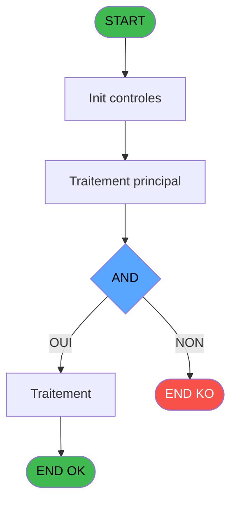

# ADH IDE 96 - ExistFactureVente 2

> **Analyse**: Phases 1-4 2026-02-07 03:47 -> 02:35 (22h47min) | Assemblage 02:35
> **Pipeline**: V7.2 Enrichi
> **Structure**: 4 onglets (Resume | Ecrans | Donnees | Connexions)

<!-- TAB:Resume -->

## 1. FICHE D'IDENTITE

| Attribut | Valeur |
|----------|--------|
| Projet | ADH |
| IDE Position | 96 |
| Nom Programme | ExistFactureVente 2 |
| Fichier source | `Prg_96.xml` |
| Dossier IDE | Ventes |
| Taches | 1 (0 ecrans visibles) |
| Tables modifiees | 0 |
| Programmes appeles | 0 |
| Complexite | **BASSE** (score 0/100) |
| Statut | **ORPHELIN_POTENTIEL** |

## 2. DESCRIPTION FONCTIONNELLE

## ADH IDE 96 - ExistFactureVente 2

**ADH IDE 96** est un utilitaire de vérification d'existence de facture conçu pour être appelé comme fonction de service par d'autres programmes. Il prend en entrée quatre paramètres (société, compte, filiation, numéro de facture) et retourne un booléen TRUE/FALSE indiquant si la facture existe. Le programme est entièrement en lecture seule, accédant aux tables comptables et de vente sans aucune modification de données.

La logique métier repose sur une condition composée de quatre branches alternatives (OU logique) qui testent différentes sources ou états possibles de la facture. Cette approche multi-critères permet de vérifier l'existence d'une facture à travers plusieurs canaux ou archives, ce qui est typique dans un système de gestion de caisse où les factures peuvent être traitées, archivées ou être dans différents états comptables.

Le programme est autonome (aucun appel interne), ce qui en fait un bloc de code réutilisable. Bien qu'aucun caller direct ne soit actuellement détecté, il est probablement invoqué par des programmes d'édition, modification ou annulation de factures (ADH IDE 237 Vente, ADH IDE 97 Saisie_facture_tva, ou processus de facturation), servant de pré-vérification avant d'autoriser des opérations critiques. Son statut d'orphelin potentiel doit être confirmé en vérifiant son nom public dans le registre des programmes callable.

## 3. BLOCS FONCTIONNELS

### 3.1 Saisie (1 tache)

Ce bloc traite la saisie des donnees de la transaction.

---

#### 96 - ExistFactureVente 2

**Role** : Saisie des donnees : ExistFactureVente 2.

## 5. REGLES METIER

1 regles identifiees:

### Saisie (1 regles)

#### [RM-001] Condition composite: (v.Vente? [F] AND [J] > 0) OR ([K] AND [O] > 0) OR ([P] AND [T] > 0) OR ([U] AND [Y] > 0)

| Element | Detail |
|---------|--------|
| **Condition** | `(v.Vente? [F] AND [J] > 0) OR ([K] AND [O] > 0) OR ([P] AND [T] > 0) OR ([U] AND [Y] > 0)` |
| **Si vrai** | Action si vrai |
| **Variables** | ES (v.Vente?) |
| **Expression source** | Expression 8 : `(v.Vente? [F] AND [J] > 0) OR ([K] AND [O] > 0) OR ([P] AND ` |
| **Exemple** | Si (v.Vente? [F] AND [J] > 0) OR ([K] AND [O] > 0) OR ([P] AND [T] > 0) OR ([U] AND [Y] > 0) → Action si vrai |
| **Impact** | Bloc Saisie |

## 6. CONTEXTE

- **Appele par**: (aucun)
- **Appelle**: 0 programmes | **Tables**: 4 (W:0 R:1 L:3) | **Taches**: 1 | **Expressions**: 8

<!-- TAB:Ecrans -->

## 8. ECRANS

*(Programme sans ecran visible)*

## 9. NAVIGATION

### 9.3 Structure hierarchique (1 tache)

| Position | Tache | Type | Dimensions | Bloc |
|----------|-------|------|------------|------|
| **96.1** | [**ExistFactureVente 2** (96)](#t1) | - | - | Saisie |

### 9.4 Algorigramme

> **Legende**: Vert = START/END OK | Rouge = END KO | Bleu = Decisions
> *Algorigramme auto-genere. Utiliser `/algorigramme` pour une synthese metier detaillee.*

<!-- TAB:Donnees -->

## 10. TABLES

### Tables utilisees (4)

| ID | Nom | Description | Type | R | W | L | Usages |
|----|-----|-------------|------|---|---|---|--------|
| 40 | comptable________cte |  | DB | R |   |   | 1 |
| 263 | vente | Donnees de ventes | DB |   |   | L | 1 |
| 746 | projet |  | DB |   |   | L | 1 |
| 871 | Activite |  | DB |   |   | L | 1 |

### Colonnes par table (2 / 1 tables avec colonnes identifiees)

Table 40 - comptable________cte (R) - 1 usages

| Lettre | Variable | Acces | Type |
|--------|----------|-------|------|
| A | P.Societe | R | Unicode |
| B | P.Compte | R | Numeric |
| C | P.Filiation | R | Numeric |
| D | P.Facture | R | Numeric |
| E | v.Result | R | Logical |
| F | v.Vente? | R | Logical |
| G | v.Compta? | R | Logical |
| H | v.ArcCompta? | R | Logical |
| I | v.ArcVente | R | Logical |

## 11. VARIABLES

### 11.1 Parametres entrants (4)

Variables recues en parametre.

| Lettre | Nom | Type | Usage dans |
|--------|-----|------|-----------|
| EN | P.Societe | Unicode | 1x parametre entrant |
| EO | P.Compte | Numeric | 1x parametre entrant |
| EP | P.Filiation | Numeric | 1x parametre entrant |
| EQ | P.Facture | Numeric | 1x parametre entrant |

### 11.2 Variables de session (5)

Variables persistantes pendant toute la session.

| Lettre | Nom | Type | Usage dans |
|--------|-----|------|-----------|
| ER | v.Result | Logical | 1x session |
| ES | v.Vente? | Logical | 1x session |
| ET | v.Compta? | Logical | - |
| EU | v.ArcCompta? | Logical | - |
| EV | v.ArcVente | Logical | - |

## 12. EXPRESSIONS

**8 / 8 expressions decodees (100%)**

### 12.1 Repartition par type

| Type | Expressions | Regles |
|------|-------------|--------|
| CONDITION | 1 | 5 |
| OTHER | 5 | 0 |
| CAST_LOGIQUE | 2 | 0 |

### 12.2 Expressions cles par type

#### CONDITION (1 expressions)

| Type | IDE | Expression | Regle |
|------|-----|------------|-------|
| CONDITION | 8 | `(v.Vente? [F] AND [J] > 0) OR ([K] AND [O] > 0) OR ([P] AND [T] > 0) OR ([U] AND [Y] > 0)` | [RM-001](#rm-RM-001) |

#### OTHER (5 expressions)

| Type | IDE | Expression | Regle |
|------|-----|------------|-------|
| OTHER | 4 | `P.Facture [D]` | - |
| OTHER | 5 | `v.Result [E]` | - |
| OTHER | 3 | `P.Filiation [C]` | - |
| OTHER | 1 | `P.Societe [A]` | - |
| OTHER | 2 | `P.Compte [B]` | - |

#### CAST_LOGIQUE (2 expressions)

| Type | IDE | Expression | Regle |
|------|-----|------------|-------|
| CAST_LOGIQUE | 7 | `'TRUE'LOG` | - |
| CAST_LOGIQUE | 6 | `'FALSE'LOG` | - |

<!-- TAB:Connexions -->

## 13. GRAPHE D'APPELS

### 13.1 Chaine depuis Main (Callers)

**Chemin**: (pas de callers directs)

### 13.2 Callers

| IDE | Nom Programme | Nb Appels |
|-----|---------------|-----------|
| - | (aucun) | - |

### 13.3 Callees (programmes appeles)

### 13.4 Detail Callees avec contexte

| IDE | Nom Programme | Appels | Contexte |
|-----|---------------|--------|----------|
| - | (aucun) | - | - |

## 14. RECOMMANDATIONS MIGRATION

### 14.1 Profil du programme

| Metrique | Valeur | Impact migration |
|----------|--------|-----------------|
| Lignes de logique | 45 | Programme compact |
| Expressions | 8 | Peu de logique |
| Tables WRITE | 0 | Impact faible |
| Sous-programmes | 0 | Peu de dependances |
| Ecrans visibles | 0 | Ecran unique ou traitement batch |
| Code desactive | 0% (0 / 45) | Code sain |
| Regles metier | 1 | Quelques regles a preserver |

### 14.2 Plan de migration par bloc

#### Saisie (1 tache: 0 ecran, 1 traitement)

- **Strategie** : Formulaire React/Blazor avec validation Zod/FluentValidation.
- Validation temps reel cote client + serveur

### 14.3 Dependances critiques

| Dependance | Type | Appels | Impact |
|------------|------|--------|--------|

---
*Spec DETAILED generee par Pipeline V7.2 - 2026-02-08 02:36*
