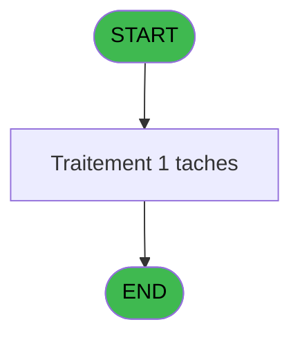

# ADH IDE 97 - ExistFactureVente 2

> **Analyse**: Phases 1-4 2026-02-07 06:57 -> 06:57 (16s) | Assemblage 06:57
> **Pipeline**: V7.2 Enrichi
> **Structure**: 4 onglets (Resume | Ecrans | Donnees | Connexions)

<!-- TAB:Resume -->

## 1. FICHE D'IDENTITE

| Attribut | Valeur |
|----------|--------|
| Projet | ADH |
| IDE Position | 97 |
| Nom Programme | ExistFactureVente 2 |
| Fichier source | `Prg_97.xml` |
| Dossier IDE | Factures |
| Taches | 1 (0 ecrans visibles) |
| Tables modifiees | 0 |
| Programmes appeles | 0 |
| :warning: Statut | **ORPHELIN_POTENTIEL** |

## 2. DESCRIPTION FONCTIONNELLE

**ExistFactureVente 2** assure la gestion complete de ce processus.

## 3. BLOCS FONCTIONNELS

## 5. REGLES METIER

*(Aucune regle metier identifiee)*

## 6. CONTEXTE

- **Appele par**: (aucun)
- **Appelle**: 0 programmes | **Tables**: 4 (W:0 R:1 L:3) | **Taches**: 1 | **Expressions**: 8

<!-- TAB:Ecrans -->

## 8. ECRANS

*(Programme sans ecran visible)*

## 9. NAVIGATION

### 9.3 Structure hierarchique (0 tache)

| Position | Tache | Type | Dimensions | Bloc |
|----------|-------|------|------------|------|

### 9.4 Algorigramme

> *algo-data indisponible. Utiliser `/algorigramme` pour generer.*

<!-- TAB:Donnees -->

## 10. TABLES

### Tables utilisees (4)

| ID | Nom | Description | Type | R | W | L | Usages |
|----|-----|-------------|------|---|---|---|--------|
| 40 | comptable________cte |  | DB | R |   |   | 1 |
| 263 | vente | Donnees de ventes | DB |   |   | L | 1 |
| 746 | projet |  | DB |   |   | L | 1 |
| 871 | Activite |  | DB |   |   | L | 1 |

### Colonnes par table (2 / 1 tables avec colonnes identifiees)

Table 40 - comptable________cte (R) - 1 usages

| Lettre | Variable | Acces | Type |
|--------|----------|-------|------|
| A | P.Societe | R | Unicode |
| B | P.Compte | R | Numeric |
| C | P.Filiation | R | Numeric |
| D | P.Facture | R | Numeric |
| E | v.Result | R | Logical |
| F | v.Vente? | R | Logical |
| G | v.Compta? | R | Logical |
| H | v.ArcCompta? | R | Logical |
| I | v.ArcVente | R | Logical |

## 11. VARIABLES

### 11.1 Parametres entrants (4)

Variables recues en parametre.

| Lettre | Nom | Type | Usage dans |
|--------|-----|------|-----------|
| A | P.Societe | Unicode | 1x parametre entrant |
| B | P.Compte | Numeric | 1x parametre entrant |
| C | P.Filiation | Numeric | 1x parametre entrant |
| D | P.Facture | Numeric | 1x parametre entrant |

### 11.2 Variables de session (5)

Variables persistantes pendant toute la session.

| Lettre | Nom | Type | Usage dans |
|--------|-----|------|-----------|
| E | v.Result | Logical | 1x session |
| F | v.Vente? | Logical | 1x session |
| G | v.Compta? | Logical | - |
| H | v.ArcCompta? | Logical | - |
| I | v.ArcVente | Logical | - |

## 12. EXPRESSIONS

**8 / 8 expressions decodees (100%)**

### 12.1 Repartition par type

| Type | Expressions | Regles |
|------|-------------|--------|
| OTHER | 5 | 0 |
| CAST_LOGIQUE | 2 | 0 |
| CONDITION | 1 | 0 |

### 12.2 Expressions cles par type

#### OTHER (5 expressions)

| Type | IDE | Expression | Regle |
|------|-----|------------|-------|
| OTHER | 4 | `P.Facture [D]` | - |
| OTHER | 5 | `v.Result [E]` | - |
| OTHER | 3 | `P.Filiation [C]` | - |
| OTHER | 1 | `P.Societe [A]` | - |
| OTHER | 2 | `P.Compte [B]` | - |

#### CAST_LOGIQUE (2 expressions)

| Type | IDE | Expression | Regle |
|------|-----|------------|-------|
| CAST_LOGIQUE | 7 | `'TRUE'LOG` | - |
| CAST_LOGIQUE | 6 | `'FALSE'LOG` | - |

#### CONDITION (1 expressions)

| Type | IDE | Expression | Regle |
|------|-----|------------|-------|
| CONDITION | 8 | `(v.Vente? [F] AND [J] > 0) OR ([K] AND [O] > 0) OR ([P] AND [T] > 0) OR ([U] AND [Y] > 0)` | - |

<!-- TAB:Connexions -->

## 13. GRAPHE D'APPELS

### 13.1 Chaine depuis Main (Callers)

**Chemin**: (pas de callers directs)

### 13.2 Callers

| IDE | Nom Programme | Nb Appels |
|-----|---------------|-----------|
| - | (aucun) | - |

### 13.3 Callees (programmes appeles)

### 13.4 Detail Callees avec contexte

| IDE | Nom Programme | Appels | Contexte |
|-----|---------------|--------|----------|
| - | (aucun) | - | - |

## 14. RECOMMANDATIONS MIGRATION

### 14.1 Profil du programme

| Metrique | Valeur | Impact migration |
|----------|--------|-----------------|
| Lignes de logique | 45 | Programme compact |
| Expressions | 8 | Peu de logique |
| Tables WRITE | 0 | Impact faible |
| Sous-programmes | 0 | Peu de dependances |
| Ecrans visibles | 0 | Ecran unique ou traitement batch |
| Code desactive | 0% (0 / 45) | Code sain |
| Regles metier | 0 | Pas de regle identifiee |

### 14.2 Plan de migration par bloc

### 14.3 Dependances critiques

| Dependance | Type | Appels | Impact |
|------------|------|--------|--------|

---
*Spec DETAILED generee par Pipeline V7.2 - 2026-02-07 06:57*
