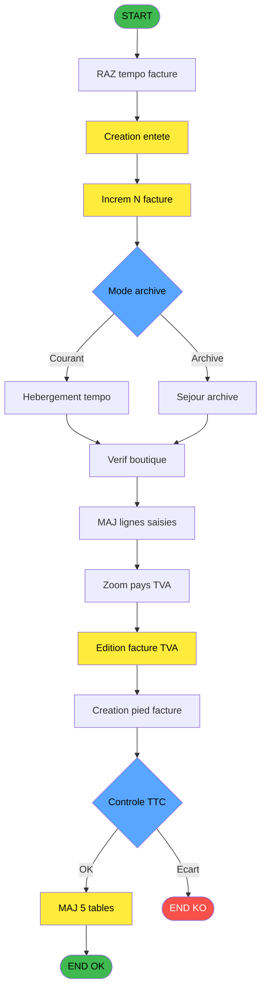
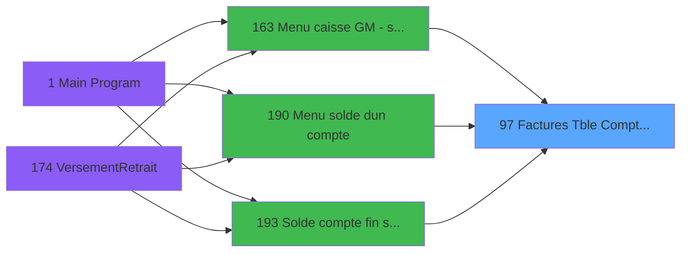
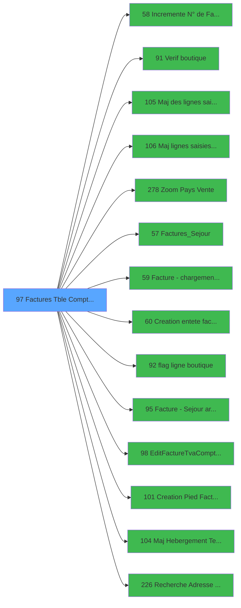

# ADH IDE 97 - Factures (Tble Compta&Vent) V3

> **Analyse**: Phases 1-4 2026-02-23 18:22 -> 18:22 (1s) | Assemblage 13:17
> **Pipeline**: V7.2 Enrichi
> **Structure**: 4 onglets (Resume | Ecrans | Donnees | Connexions)

<!-- TAB:Resume -->

## 1. FICHE D'IDENTITE

| Attribut | Valeur |
|----------|--------|
| Projet | ADH |
| IDE Position | 97 |
| Nom Programme | Factures (Tble Compta&Vent) V3 |
| Fichier source | `Prg_97.xml` |
| Dossier IDE | Facturation |
| Taches | 21 (8 ecrans visibles) |
| Tables modifiees | 5 |
| Programmes appeles | 14 |
| Complexite | **MOYENNE** (score 51/100) |

## 2. DESCRIPTION FONCTIONNELLE

**Factures (Tble Compta&Vent) V3** gere la creation et l'edition complete des factures en mode Comptabilite et Ventes. Appele depuis trois contextes ([Menu caisse GM (IDE 163)](ADH-IDE-163.md), [Menu solde d'un compte (IDE 190)](ADH-IDE-190.md), et [Solde compte fin sejour (IDE 193)](ADH-IDE-193.md)), il orchestre 21 taches sur 8 ecrans pour produire des factures consolidant hebergement, ventes boutique et services. Le programme modifie 5 tables et delegue a 14 sous-programmes.

### Edition et assemblage de la facture

L'ecran principal (T1 - Edition de Facture, 881x427 DLU) orchestre l'assemblage complet du document. L'en-tete est cree via [Creation entete facture (IDE 60)](ADH-IDE-60.md), le corps (lignes TVA) via [EditFactureTva V3 (IDE 98)](ADH-IDE-98.md), et le pied via [Creation Pied Facture V3 (IDE 101)](ADH-IDE-101.md). Le numero de facture est incremente atomiquement via [Incremente N de Facture (IDE 58)](ADH-IDE-58.md), appele 2 fois (facture + avoir potentiel). Cette separation en sous-programmes garantit la coherence : si l'un echoue, la facture n'est pas numerotee, evitant des trous dans la sequence comptable qui provoqueraient un rejet lors de l'audit fiscal.

3 taches : T1, T2, T20

- **T1** - Edition de Facture [ECRAN] (assemblage principal, variables FF=No Facture, EV=Existe facture?)
- **T2** - Raz tempo facture (reinitialisation des variables temporaires avant nouvelle facture)
- **T20** - Traitement final (finalisation et validation)

### Verification et validation boutique

Quatre taches de verification (T3, T7, T11, T13) controlent la coherence des donnees avant ecriture. La verification "non flaguee" via [Verif boutique (IDE 91)](ADH-IDE-91.md) s'assure que les lignes de vente boutique ne sont pas deja flaguees (marquees pour un traitement anterieur). Le [flag ligne boutique (IDE 92)](ADH-IDE-92.md) marque les lignes traitees pour empecher un double comptage. Le controle TTC (T7) verifie que les montants hors taxes + taxes correspondent au total TTC. Sans cette verification, une erreur d'arrondi TVA pourrait generer un ecart comptable signale par le rapprochement de fin de journee, bloquant la cloture.

4 taches : T3, T7, T11, T13

- **T3** - verif non flaguee (lit FU = V.Existe flaguee?, appelle IDE 91)
- **T7** - Controle ttc (verification coherence montants TVA)
- **T11** - verif boutique (controle des lignes boutique)
- **T13** - verif non flaguee (verification post-archivage)

### Traitement hebergement et sejour

Le volet hebergement (T4) gere les factures liees aux chambres et prestations sejour. [Factures_Sejour (IDE 57)](ADH-IDE-57.md) charge les donnees de sejour courant, tandis que [Facture - Sejour archive (IDE 95)](ADH-IDE-95.md) traite les sejours passes. La mise a jour temporaire est effectuee via [Maj Hebergement Tempo V3 (IDE 104)](ADH-IDE-104.md), qui ecrit dans une table temporaire avant synchronisation. Ce pattern "tempo" est central dans l'architecture V3 : les modifications sont d'abord enregistrees dans des tables temporaires, puis validees et synchronisees vers les tables de production, minimisant les verrous sur les tables partagees et permettant un rollback transparent en cas d'erreur.

4 taches : T4, T5, T14, T15

- **T4** - Hebergement [ECRAN] (affichage et selection des prestations sejour)
- **T5** - Sejour (chargement donnees sejour courant via IDE 57)
- **T14** - Hebergement [ECRAN] (ecran archivage)
- **T15** - Sejour archive (traitement sejour archive via IDE 95)

### Lignes de vente et boutique

Les lignes de vente sont mises a jour par deux sous-programmes jumeles : [Maj des lignes saisies V3 (IDE 105)](ADH-IDE-105.md) pour les ventes courantes et [Maj lignes saisies archive V3 (IDE 106)](ADH-IDE-106.md) pour les archives, chacun appele 2 fois. La table `Rayons_Boutique` (Read/Write, 7 usages) structure les lignes par rayon de vente. `Affectation_Gift_Pass` gere l'affectation des Gift Pass aux lignes de facture. Le chargement initial des donnees boutique est effectue par [Facture - chargement boutique (IDE 59)](ADH-IDE-59.md). Le [Zoom Pays Vente (IDE 278)](ADH-IDE-278.md) (appele 2 fois) permet de selectionner le pays de vente pour appliquer les regles TVA specifiques, car les taux different selon la zone fiscale.

6 taches : T6, T8, T9, T10, T16, T17

- **T6** - Vente [ECRAN] (saisie des lignes de vente courantes)
- **T8** - Boutique (chargement boutique via IDE 59)
- **T9** - Lignes saisies (mise a jour via IDE 105)
- **T10** - Lignes archive (mise a jour archive via IDE 106)
- **T16** - Vente [ECRAN] (ecran vente archivee)
- **T17** - Lignes archive (mise a jour archive alternative)

### Tracabilite et audit

Le programme ecrit dans `comptable` (en-tetes comptables), `maj_appli_tpe` (6 ecritures Write, tracabilite des modifications applicatives TPE), et `log_booker` (journal d'audit). La table `log_maj_tpe` est lue pour verifier l'historique des modifications precedentes. La [Recherche Adresse Mail (IDE 226)](ADH-IDE-226.md) recupere l'email du client pour l'envoi electronique de la facture. L'absence de tracabilite dans `log_booker` empeche la reconstruction de l'historique des operations en cas de contestation client ou d'audit comptable.

## 3. BLOCS FONCTIONNELS

### 3.1 Impression (1 tache)

Generation des documents et tickets.

---

#### T1 - Edition de Facture [ECRAN]

**Role** : Generation du document : Edition de Facture.
**Ecran** : 881 x 427 DLU | [Voir mockup](#ecran-t1)
**Variables liees** : EU (V.Lien Pied de facture), EV (V.Existe facture ?), FC (V.Facture Sans Nom), FD (V.Facture Sans Adresse), FF (V.No Facture)

### 3.2 Initialisation (1 tache)

Reinitialisation d'etats et variables de travail.

---

#### T2 - Raz tempo facture

**Role** : Reinitialisation : Raz tempo facture.
**Variables liees** : EU (V.Lien Pied de facture), EV (V.Existe facture ?), FC (V.Facture Sans Nom), FD (V.Facture Sans Adresse), FF (V.No Facture)

### 3.3 Validation (4 taches)

Controles de coherence : 4 taches verifient les donnees et conditions.

---

#### T3 - verif non flaguee

**Role** : Verification : verif non flaguee.
**Variables liees** : FU (V.Existe flaguee ?)
**Delegue a** : [Verif boutique (IDE 91)](ADH-IDE-91.md)

---

#### T7 - Controle ttc

**Role** : Verification : Controle ttc.
**Delegue a** : [Verif boutique (IDE 91)](ADH-IDE-91.md)

---

#### T11 - verif boutique

**Role** : Verification : verif boutique.
**Delegue a** : [Verif boutique (IDE 91)](ADH-IDE-91.md)

---

#### T13 - verif non flaguee

**Role** : Verification : verif non flaguee.
**Variables liees** : FU (V.Existe flaguee ?)
**Delegue a** : [Verif boutique (IDE 91)](ADH-IDE-91.md)

### 3.4 Traitement (11 taches)

Traitements internes.

---

#### T4 - Hebergement [ECRAN]

**Role** : Traitement : Hebergement.
**Ecran** : 866 x 250 DLU | [Voir mockup](#ecran-t4)
**Variables liees** : FK (V.Date Début Hebergement), FL (V.Date Fin Hebergement)

---

#### T6 - Lignes boutique [ECRAN]

**Role** : Traitement : Lignes boutique.
**Ecran** : 704 x 239 DLU | [Voir mockup](#ecran-t6)

---

#### T8 - Suppr fact pro boutique

**Role** : Traitement : Suppr fact pro boutique.
**Variables liees** : EU (V.Lien Pied de facture), EV (V.Existe facture ?), FC (V.Facture Sans Nom), FD (V.Facture Sans Adresse), FF (V.No Facture)

---

#### T9 - Flag All [ECRAN]

**Role** : Traitement : Flag All.
**Ecran** : 541 x 291 DLU | [Voir mockup](#ecran-t9)
**Variables liees** : FU (V.Existe flaguee ?)

---

#### T10 - Pied de Facture [ECRAN]

**Role** : Traitement : Pied de Facture.
**Ecran** : 207 x 102 DLU | [Voir mockup](#ecran-t10)
**Variables liees** : EU (V.Lien Pied de facture), EV (V.Existe facture ?), FC (V.Facture Sans Nom), FD (V.Facture Sans Adresse), FF (V.No Facture)

---

#### T14 - SQL parcourt facture [ECRAN]

**Role** : Traitement : SQL parcourt facture.
**Ecran** : 609 x 195 DLU | [Voir mockup](#ecran-t14)
**Variables liees** : EU (V.Lien Pied de facture), EV (V.Existe facture ?), FC (V.Facture Sans Nom), FD (V.Facture Sans Adresse), FF (V.No Facture)

---

#### T15 - SendMail

**Role** : Traitement : SendMail.

---

#### T16 - Saisir un email [ECRAN]

**Role** : Traitement : Saisir un email.
**Ecran** : 320 x 55 DLU | [Voir mockup](#ecran-t16)
**Variables liees** : FX (V.ConfirmEnvoieMail?)

---

#### T17 - VisuHebergement tempo

**Role** : Traitement : VisuHebergement tempo.

---

#### T18 - visu Fac_tva [ECRAN]

**Role** : Traitement : visu Fac_tva.
**Ecran** : 457 x 200 DLU | [Voir mockup](#ecran-t18)

---

#### T19 - Confirmation [ECRAN]

**Role** : Traitement : Confirmation.
**Ecran** : 397 x 110 DLU (Type6) | [Voir mockup](#ecran-t19)

### 3.5 Saisie (3 taches)

L'operateur saisit les donnees de la transaction via 3 ecrans (Ventes, Maj des lignes saisies, Abondonner lignes saisies V3).

---

#### T5 - Ventes [ECRAN]

**Role** : Saisie des donnees : Ventes.
**Ecran** : 650 x 233 DLU | [Voir mockup](#ecran-t5)
**Delegue a** : [Maj des lignes saisies V3 (IDE 105)](ADH-IDE-105.md), [Maj lignes saisies archive V3 (IDE 106)](ADH-IDE-106.md), [Zoom Pays Vente (IDE 278)](ADH-IDE-278.md)

---

#### T20 - Maj des lignes saisies [ECRAN]

**Role** : Saisie des donnees : Maj des lignes saisies.
**Ecran** : 562 x 0 DLU | [Voir mockup](#ecran-t20)
**Delegue a** : [Maj des lignes saisies V3 (IDE 105)](ADH-IDE-105.md), [Maj lignes saisies archive V3 (IDE 106)](ADH-IDE-106.md), [Zoom Pays Vente (IDE 278)](ADH-IDE-278.md)

---

#### T21 - Abondonner lignes saisies V3 [ECRAN]

**Role** : Saisie des donnees : Abondonner lignes saisies V3.
**Ecran** : 562 x 0 DLU | [Voir mockup](#ecran-t21)
**Delegue a** : [Maj des lignes saisies V3 (IDE 105)](ADH-IDE-105.md), [Maj lignes saisies archive V3 (IDE 106)](ADH-IDE-106.md), [Zoom Pays Vente (IDE 278)](ADH-IDE-278.md)

### 3.6 Consultation (1 tache)

Ecrans de recherche et consultation.

---

#### T12 - Recherche si Fact déjà éditée

**Role** : Traitement : Recherche si Fact déjà éditée.
**Variables liees** : EU (V.Lien Pied de facture), EV (V.Existe facture ?), FC (V.Facture Sans Nom), FD (V.Facture Sans Adresse), FF (V.No Facture)
**Delegue a** : [Recherche Adresse Mail (IDE 226)](ADH-IDE-226.md)

## 5. REGLES METIER

25 regles identifiees:

### Validation (1 regles)

#### [RM-006] Si P.i.Archive [E] alors V.Ville [M] sinon B.Valider [BD])

| Element | Detail |
|---------|--------|
| **Condition** | `P.i.Archive [E]` |
| **Si vrai** | V.Ville [M] |
| **Si faux** | B.Valider [BD]) |
| **Variables** | ER (P.i.Archive), EZ (V.Ville), FQ (B.Valider) |
| **Expression source** | Expression 34 : `IF(P.i.Archive [E],V.Ville [M],B.Valider [BD])` |
| **Exemple** | Si P.i.Archive [E] → V.Ville [M]. Sinon → B.Valider [BD]) |
| **Impact** | Bloc Validation |

### Autres (24 regles)

#### [RM-001] Condition composite: NOT([DA]) OR [DP]

| Element | Detail |
|---------|--------|
| **Condition** | `NOT([DA]) OR [DP]` |
| **Si vrai** | Action si vrai |
| **Expression source** | Expression 16 : `NOT([DA]) OR [DP]` |
| **Exemple** | Si NOT([DA]) OR [DP] → Action si vrai |

#### [RM-002] Condition: [DA] AND NOT([DP]) AND [DU] superieur a 2

| Element | Detail |
|---------|--------|
| **Condition** | `[DA] AND NOT([DP]) AND [DU] > 2` |
| **Si vrai** | Action si vrai |
| **Expression source** | Expression 17 : `[DA] AND NOT([DP]) AND [DU] > 2` |
| **Exemple** | Si [DA] AND NOT([DP]) AND [DU] > 2 → Action si vrai |

#### [RM-003] Negation de [DQ] (condition inversee)

| Element | Detail |
|---------|--------|
| **Condition** | `NOT [DQ]` |
| **Si vrai** | Action si vrai |
| **Expression source** | Expression 28 : `NOT [DQ]` |
| **Exemple** | Si NOT [DQ] → Action si vrai |

#### [RM-004] Condition: [DU] superieur a 2

| Element | Detail |
|---------|--------|
| **Condition** | `[DU] > 2` |
| **Si vrai** | Action si vrai |
| **Expression source** | Expression 29 : `[DU] > 2` |
| **Exemple** | Si [DU] > 2 → Action si vrai |

#### [RM-005] Negation de P.i.Archive [E] (condition inversee)

| Element | Detail |
|---------|--------|
| **Condition** | `NOT P.i.Archive [E]` |
| **Si vrai** | Action si vrai |
| **Variables** | ER (P.i.Archive) |
| **Expression source** | Expression 32 : `NOT P.i.Archive [E]` |
| **Exemple** | Si NOT P.i.Archive [E] → Action si vrai |

#### [RM-007] Condition: Trim([CN]) egale

| Element | Detail |
|---------|--------|
| **Condition** | `Trim([CN])=''` |
| **Si vrai** | Action si vrai |
| **Expression source** | Expression 37 : `Trim([CN])=''` |
| **Exemple** | Si Trim([CN])='' → Action si vrai |

#### [RM-008] Condition: Trim([CO]) egale

| Element | Detail |
|---------|--------|
| **Condition** | `Trim([CO])=''` |
| **Si vrai** | Action si vrai |
| **Expression source** | Expression 38 : `Trim([CO])=''` |
| **Exemple** | Si Trim([CO])='' → Action si vrai |

#### [RM-009] Condition: Trim([CP]) egale

| Element | Detail |
|---------|--------|
| **Condition** | `Trim([CP])=''` |
| **Si vrai** | Action si vrai |
| **Expression source** | Expression 39 : `Trim([CP])=''` |
| **Exemple** | Si Trim([CP])='' → Action si vrai |

#### [RM-010] Condition: Trim([CQ]) egale

| Element | Detail |
|---------|--------|
| **Condition** | `Trim([CQ])=''` |
| **Si vrai** | Action si vrai |
| **Expression source** | Expression 40 : `Trim([CQ])=''` |
| **Exemple** | Si Trim([CQ])='' → Action si vrai |

#### [RM-011] Condition: Trim([CR])='' AND [DW] egale

| Element | Detail |
|---------|--------|
| **Condition** | `Trim([CR])='' AND [DW]=''` |
| **Si vrai** | Action si vrai |
| **Expression source** | Expression 41 : `Trim([CR])='' AND [DW]=''` |
| **Exemple** | Si Trim([CR])='' AND [DW]='' → Action si vrai |

#### [RM-012] Si [DD] <> '' alors [DD] & ' Adresse' sinon 'Adresse')

| Element | Detail |
|---------|--------|
| **Condition** | `[DD] <> ''` |
| **Si vrai** | [DD] & ' Adresse' |
| **Si faux** | 'Adresse') |
| **Expression source** | Expression 46 : `IF([DD] <> '',[DD] & ' Adresse','Adresse')` |
| **Exemple** | Si [DD] <> '' → [DD] & ' Adresse'. Sinon → 'Adresse') |

#### [RM-013] Condition: Trim([DD]) different de

| Element | Detail |
|---------|--------|
| **Condition** | `Trim([DD]) <> ''` |
| **Si vrai** | Action si vrai |
| **Expression source** | Expression 51 : `Trim([DD]) <> ''` |
| **Exemple** | Si Trim([DD]) <> '' → Action si vrai |

#### [RM-014] Condition composite: NOT([DI]) OR ([DI] AND [DE]=0)

| Element | Detail |
|---------|--------|
| **Condition** | `NOT([DI]) OR ([DI] AND [DE]=0)` |
| **Si vrai** | Action si vrai |
| **Expression source** | Expression 52 : `NOT([DI]) OR ([DI] AND [DE]=0)` |
| **Exemple** | Si NOT([DI]) OR ([DI] AND [DE]=0) → Action si vrai |

#### [RM-015] Negation de [CF] (condition inversee)

| Element | Detail |
|---------|--------|
| **Condition** | `NOT [CF]` |
| **Si vrai** | Action si vrai |
| **Expression source** | Expression 55 : `NOT [CF]` |
| **Exemple** | Si NOT [CF] → Action si vrai |

#### [RM-016] Condition: [DU] egale 1

| Element | Detail |
|---------|--------|
| **Condition** | `[DU] = 1` |
| **Si vrai** | Action si vrai |
| **Expression source** | Expression 65 : `[DU] = 1` |
| **Exemple** | Si [DU] = 1 → Action si vrai |

#### [RM-017] Condition: [DU] = 1 OR [DU] egale 2

| Element | Detail |
|---------|--------|
| **Condition** | `[DU] = 1 OR [DU] = 2` |
| **Si vrai** | Action si vrai |
| **Expression source** | Expression 66 : `[DU] = 1 OR [DU] = 2` |
| **Exemple** | Si [DU] = 1 OR [DU] = 2 → Action si vrai |

#### [RM-018] Condition: [DU] egale 2

| Element | Detail |
|---------|--------|
| **Condition** | `[DU] = 2` |
| **Si vrai** | Action si vrai |
| **Expression source** | Expression 67 : `[DU] = 2` |
| **Exemple** | Si [DU] = 2 → Action si vrai |

#### [RM-019] Condition: [CN] egale

| Element | Detail |
|---------|--------|
| **Condition** | `[CN]=''` |
| **Si vrai** | Action si vrai |
| **Expression source** | Expression 71 : `[CN]=''` |
| **Exemple** | Si [CN]='' → Action si vrai |

#### [RM-020] Condition composite: VG53 AND [DI] AND NOT(P.i.Archive [E])

| Element | Detail |
|---------|--------|
| **Condition** | `VG53 AND [DI] AND NOT(P.i.Archive [E])` |
| **Si vrai** | Action si vrai |
| **Variables** | ER (P.i.Archive) |
| **Expression source** | Expression 73 : `VG53 AND [DI] AND NOT(P.i.Archive [E])` |
| **Exemple** | Si VG53 AND [DI] AND NOT(P.i.Archive [E]) → Action si vrai |

#### [RM-021] Condition: [CO] egale

| Element | Detail |
|---------|--------|
| **Condition** | `[CO]=''` |
| **Si vrai** | Action si vrai |
| **Expression source** | Expression 74 : `[CO]=''` |
| **Exemple** | Si [CO]='' → Action si vrai |

#### [RM-022] Condition: [CP] egale

| Element | Detail |
|---------|--------|
| **Condition** | `[CP]=''` |
| **Si vrai** | Action si vrai |
| **Expression source** | Expression 75 : `[CP]=''` |
| **Exemple** | Si [CP]='' → Action si vrai |

#### [RM-023] Condition: [CQ] egale

| Element | Detail |
|---------|--------|
| **Condition** | `[CQ]=''` |
| **Si vrai** | Action si vrai |
| **Expression source** | Expression 76 : `[CQ]=''` |
| **Exemple** | Si [CQ]='' → Action si vrai |

#### [RM-024] Condition: [DW] egale

| Element | Detail |
|---------|--------|
| **Condition** | `[DW]=''` |
| **Si vrai** | Action si vrai |
| **Expression source** | Expression 77 : `[DW]=''` |
| **Exemple** | Si [DW]='' → Action si vrai |

#### [RM-025] Si [CF] alors [CH] sinon IF(P.i.Archive [E],Trim(V.Fact déjà editée [W])&' '&Trim(V.Service [V])&' '&Trim(V.Pos , [U]),Trim(V.Existe non facturee ? [BG])&' '&Trim(V.Erreur addresse ? [BI])&' '&Trim(V.Existe flaguee ? [BH])))

| Element | Detail |
|---------|--------|
| **Condition** | `[CF]` |
| **Si vrai** | [CH] |
| **Si faux** | IF(P.i.Archive [E],Trim(V.Fact déjà editée [W])&' '&Trim(V.Service [V])&' '&Trim(V.Pos , [U]),Trim(V.Existe non facturee ? [BG])&' '&Trim(V.Erreur addresse ? [BI])&' '&Trim(V.Existe flaguee ? [BH]))) |
| **Variables** | ER (P.i.Archive), FH (V.Pos ,), FI (V.Service), FJ (V.Fact déjà editée), FT (V.Existe non facturee ?), FU (V.Existe flaguee ?), FV (V.Erreur addresse ?) |
| **Expression source** | Expression 79 : `IF([CF],[CH],IF(P.i.Archive [E],Trim(V.Fact déjà editée [W])` |
| **Exemple** | Si [CF] → [CH] |
| **Impact** | [T9 - Flag All](#t9) |

## 6. CONTEXTE

- **Appele par**: [Menu caisse GM - scroll (IDE 163)](ADH-IDE-163.md), [Menu solde d'un compte (IDE 190)](ADH-IDE-190.md), [Solde compte fin sejour (IDE 193)](ADH-IDE-193.md)
- **Appelle**: 14 programmes | **Tables**: 16 (W:5 R:4 L:12) | **Taches**: 21 | **Expressions**: 85

<!-- TAB:Ecrans -->

## 8. ECRANS

### 8.1 Forms visibles (8 / 21)

| # | Position | Tache | Nom | Type | Largeur | Hauteur | Bloc |
|---|----------|-------|-----|------|---------|---------|------|
| 1 | 97 | T1 | Edition de Facture | Type0 | 881 | 427 | Impression |
| 2 | 97.3 | T4 | Hebergement | Type0 | 866 | 250 | Traitement |
| 3 | 97.3.1 | T5 | Ventes | Type0 | 650 | 233 | Saisie |
| 4 | 97.3.1.1 | T6 | Lignes boutique | Type0 | 704 | 239 | Traitement |
| 5 | 97.3.3 | T10 | Pied de Facture | Type0 | 207 | 102 | Traitement |
| 6 | 97.6.2 | T16 | Saisir un email | Type0 | 320 | 55 | Traitement |
| 7 | 97.8 | T18 | visu Fac_tva | Type0 | 457 | 200 | Traitement |
| 8 | 97.9 | T19 | Confirmation | Type6 | 397 | 110 | Traitement |

### 8.2 Mockups Ecrans

---

#### 97 - Edition de Facture
**Tache** : [T1](#t1) | **Type** : Type0 | **Dimensions** : 881 x 427 DLU
**Bloc** : Impression | **Titre IDE** : Edition de Facture

<!-- FORM-DATA:
{
    "width":  881,
    "vFactor":  8,
    "type":  "Type0",
    "hFactor":  4,
    "controls":  [
                     {
                         "x":  2,
                         "type":  "label",
                         "var":  "",
                         "y":  29,
                         "w":  318,
                         "fmt":  "",
                         "name":  "",
                         "h":  124,
                         "color":  "",
                         "text":  "",
                         "parent":  null
                     },
                     {
                         "x":  326,
                         "type":  "label",
                         "var":  "",
                         "y":  29,
                         "w":  196,
                         "fmt":  "",
                         "name":  "",
                         "h":  124,
                         "color":  "",
                         "text":  "",
                         "parent":  null
                     },
                     {
                         "x":  530,
                         "type":  "label",
                         "var":  "",
                         "y":  29,
                         "w":  328,
                         "fmt":  "",
                         "name":  "",
                         "h":  124,
                         "color":  "",
                         "text":  "",
                         "parent":  null
                     },
                     {
                         "x":  424,
                         "type":  "label",
                         "var":  "",
                         "y":  31,
                         "w":  94,
                         "fmt":  "",
                         "name":  "",
                         "h":  11,
                         "color":  "",
                         "text":  "Paramètres Facture",
                         "parent":  null
                     },
                     {
                         "x":  551,
                         "type":  "label",
                         "var":  "",
                         "y":  31,
                         "w":  94,
                         "fmt":  "",
                         "name":  "",
                         "h":  11,
                         "color":  "48",
                         "text":  "Facture éditée",
                         "parent":  6
                     },
                     {
                         "x":  228,
                         "type":  "label",
                         "var":  "",
                         "y":  32,
                         "w":  84,
                         "fmt":  "",
                         "name":  "",
                         "h":  11,
                         "color":  "",
                         "text":  "Identité du Client",
                         "parent":  null
                     },
                     {
                         "x":  551,
                         "type":  "label",
                         "var":  "",
                         "y":  44,
                         "w":  187,
                         "fmt":  "",
                         "name":  "",
                         "h":  11,
                         "color":  "48",
                         "text":  "Date",
                         "parent":  6
                     },
                     {
                         "x":  84,
                         "type":  "label",
                         "var":  "",
                         "y":  47,
                         "w":  228,
                         "fmt":  "",
                         "name":  "",
                         "h":  11,
                         "color":  "",
                         "text":  "Coordonnées à modifier si nécessaire",
                         "parent":  null
                     },
                     {
                         "x":  551,
                         "type":  "label",
                         "var":  "",
                         "y":  56,
                         "w":  187,
                         "fmt":  "",
                         "name":  "",
                         "h":  11,
                         "color":  "48",
                         "text":  "Heure",
                         "parent":  6
                     },
                     {
                         "x":  6,
                         "type":  "line",
                         "var":  "",
                         "y":  60,
                         "w":  307,
                         "fmt":  "",
                         "name":  "",
                         "h":  0,
                         "color":  "",
                         "text":  "",
                         "parent":  null
                     },
                     {
                         "x":  326,
                         "type":  "line",
                         "var":  "",
                         "y":  60,
                         "w":  196,
                         "fmt":  "",
                         "name":  "",
                         "h":  0,
                         "color":  "",
                         "text":  "",
                         "parent":  null
                     },
                     {
                         "x":  335,
                         "type":  "label",
                         "var":  "",
                         "y":  67,
                         "w":  168,
                         "fmt":  "",
                         "name":  "",
                         "h":  12,
                         "color":  "",
                         "text":  "Facture sans mention du nom",
                         "parent":  null
                     },
                     {
                         "x":  550,
                         "type":  "label",
                         "var":  "",
                         "y":  69,
                         "w":  220,
                         "fmt":  "",
                         "name":  "",
                         "h":  11,
                         "color":  "48",
                         "text":  "Nom GO",
                         "parent":  6
                     },
                     {
                         "x":  6,
                         "type":  "line",
                         "var":  "",
                         "y":  80,
                         "w":  307,
                         "fmt":  "",
                         "name":  "",
                         "h":  0,
                         "color":  "",
                         "text":  "",
                         "parent":  null
                     },
                     {
                         "x":  335,
                         "type":  "label",
                         "var":  "",
                         "y":  83,
                         "w":  168,
                         "fmt":  "",
                         "name":  "",
                         "h":  12,
                         "color":  "",
                         "text":  "Facture sans mention de l\u0027adresse",
                         "parent":  null
                     },
                     {
                         "x":  9,
                         "type":  "label",
                         "var":  "",
                         "y":  84,
                         "w":  52,
                         "fmt":  "",
                         "name":  "",
                         "h":  12,
                         "color":  "",
                         "text":  "Nom",
                         "parent":  null
                     },
                     {
                         "x":  9,
                         "type":  "label",
                         "var":  "",
                         "y":  98,
                         "w":  53,
                         "fmt":  "",
                         "name":  "",
                         "h":  10,
                         "color":  "",
                         "text":  "Adresse",
                         "parent":  null
                     },
                     {
                         "x":  9,
                         "type":  "label",
                         "var":  "",
                         "y":  110,
                         "w":  51,
                         "fmt":  "",
                         "name":  "",
                         "h":  10,
                         "color":  "",
                         "text":  "CP,Ville",
                         "parent":  null
                     },
                     {
                         "x":  9,
                         "type":  "label",
                         "var":  "",
                         "y":  122,
                         "w":  52,
                         "fmt":  "",
                         "name":  "",
                         "h":  10,
                         "color":  "",
                         "text":  "Pays",
                         "parent":  null
                     },
                     {
                         "x":  550,
                         "type":  "label",
                         "var":  "",
                         "y":  125,
                         "w":  54,
                         "fmt":  "",
                         "name":  "",
                         "h":  11,
                         "color":  "48",
                         "text":  "Legende :",
                         "parent":  6
                     },
                     {
                         "x":  9,
                         "type":  "label",
                         "var":  "",
                         "y":  134,
                         "w":  52,
                         "fmt":  "",
                         "name":  "",
                         "h":  10,
                         "color":  "",
                         "text":  "Téléphone",
                         "parent":  null
                     },
                     {
                         "x":  550,
                         "type":  "label",
                         "var":  "",
                         "y":  137,
                         "w":  234,
                         "fmt":  "",
                         "name":  "",
                         "h":  11,
                         "color":  "48",
                         "text":  "Ligne rouge : article selectionné manuellement",
                         "parent":  6
                     },
                     {
                         "x":  614,
                         "type":  "edit",
                         "var":  "",
                         "y":  3,
                         "w":  259,
                         "fmt":  "WWW DD MMM YYYYT",
                         "name":  "",
                         "h":  8,
                         "color":  "",
                         "text":  "",
                         "parent":  null
                     },
                     {
                         "x":  4,
                         "type":  "image",
                         "var":  "",
                         "y":  4,
                         "w":  33,
                         "fmt":  "",
                         "name":  "",
                         "h":  18,
                         "color":  "",
                         "text":  "",
                         "parent":  null
                     },
                     {
                         "x":  40,
                         "type":  "edit",
                         "var":  "",
                         "y":  8,
                         "w":  267,
                         "fmt":  "20",
                         "name":  "",
                         "h":  8,
                         "color":  "",
                         "text":  "",
                         "parent":  null
                     },
                     {
                         "x":  6,
                         "type":  "image",
                         "var":  "",
                         "y":  32,
                         "w":  46,
                         "fmt":  "",
                         "name":  "",
                         "h":  26,
                         "color":  "",
                         "text":  "",
                         "parent":  null
                     },
                     {
                         "x":  335,
                         "type":  "image",
                         "var":  "",
                         "y":  32,
                         "w":  46,
                         "fmt":  "",
                         "name":  "",
                         "h":  26,
                         "color":  "",
                         "text":  "",
                         "parent":  null
                     },
                     {
                         "x":  9,
                         "type":  "edit",
                         "var":  "",
                         "y":  66,
                         "w":  304,
                         "fmt":  "50",
                         "name":  "",
                         "h":  12,
                         "color":  "",
                         "text":  "",
                         "parent":  null
                     },
                     {
                         "x":  504,
                         "type":  "checkbox",
                         "var":  "",
                         "y":  67,
                         "w":  12,
                         "fmt":  "",
                         "name":  "V.Facture Sans Nom",
                         "h":  12,
                         "color":  "",
                         "text":  "",
                         "parent":  null
                     },
                     {
                         "x":  504,
                         "type":  "checkbox",
                         "var":  "",
                         "y":  83,
                         "w":  12,
                         "fmt":  "",
                         "name":  "V.Facture Sans Adresse_0001",
                         "h":  12,
                         "color":  "",
                         "text":  "",
                         "parent":  null
                     },
                     {
                         "x":  63,
                         "type":  "edit",
                         "var":  "",
                         "y":  84,
                         "w":  250,
                         "fmt":  "100",
                         "name":  "V.Nom",
                         "h":  12,
                         "color":  "6",
                         "text":  "",
                         "parent":  null
                     },
                     {
                         "x":  63,
                         "type":  "edit",
                         "var":  "",
                         "y":  98,
                         "w":  250,
                         "fmt":  "100",
                         "name":  "gmc_num_dans_la_rue",
                         "h":  10,
                         "color":  "6",
                         "text":  "",
                         "parent":  null
                     },
                     {
                         "x":  63,
                         "type":  "edit",
                         "var":  "",
                         "y":  110,
                         "w":  54,
                         "fmt":  "",
                         "name":  "gmc_code_postal",
                         "h":  10,
                         "color":  "6",
                         "text":  "",
                         "parent":  null
                     },
                     {
                         "x":  119,
                         "type":  "edit",
                         "var":  "",
                         "y":  110,
                         "w":  194,
                         "fmt":  "",
                         "name":  "V.Ville",
                         "h":  10,
                         "color":  "6",
                         "text":  "",
                         "parent":  null
                     },
                     {
                         "x":  63,
                         "type":  "edit",
                         "var":  "",
                         "y":  122,
                         "w":  233,
                         "fmt":  "",
                         "name":  "pay_libelle",
                         "h":  10,
                         "color":  "6",
                         "text":  "",
                         "parent":  null
                     },
                     {
                         "x":  297,
                         "type":  "button",
                         "var":  "",
                         "y":  122,
                         "w":  16,
                         "fmt":  "...",
                         "name":  "Bt Zoom Pays",
                         "h":  10,
                         "color":  "",
                         "text":  "",
                         "parent":  null
                     },
                     {
                         "x":  63,
                         "type":  "edit",
                         "var":  "",
                         "y":  134,
                         "w":  250,
                         "fmt":  "",
                         "name":  "V.Telephone",
                         "h":  10,
                         "color":  "6",
                         "text":  "",
                         "parent":  null
                     },
                     {
                         "x":  4,
                         "type":  "subform",
                         "var":  "",
                         "y":  156,
                         "w":  874,
                         "fmt":  "",
                         "name":  "Hébergement",
                         "h":  250,
                         "color":  "",
                         "text":  "",
                         "parent":  null
                     },
                     {
                         "x":  14,
                         "type":  "button",
                         "var":  "",
                         "y":  409,
                         "w":  107,
                         "fmt":  "\u0026Editer",
                         "name":  "B.Quitter",
                         "h":  14,
                         "color":  "",
                         "text":  "",
                         "parent":  null
                     },
                     {
                         "x":  128,
                         "type":  "button",
                         "var":  "",
                         "y":  409,
                         "w":  107,
                         "fmt":  "\u0026Valider la selection",
                         "name":  "B.Valider",
                         "h":  14,
                         "color":  "",
                         "text":  "",
                         "parent":  null
                     },
                     {
                         "x":  242,
                         "type":  "button",
                         "var":  "",
                         "y":  409,
                         "w":  107,
                         "fmt":  "\u0026Duplicata",
                         "name":  "B.Duplicata",
                         "h":  14,
                         "color":  "",
                         "text":  "",
                         "parent":  null
                     },
                     {
                         "x":  356,
                         "type":  "button",
                         "var":  "",
                         "y":  409,
                         "w":  107,
                         "fmt":  "\u0026Abandonner",
                         "name":  "B.Abandonner",
                         "h":  14,
                         "color":  "",
                         "text":  "",
                         "parent":  null
                     }
                 ],
    "taskId":  "97",
    "height":  427
}
-->

<strong>Champs : 11 champs</strong>

| Pos (x,y) | Nom | Variable | Type |
|-----------|-----|----------|------|
| 614,3 | WWW DD MMM YYYYT | - | edit |
| 40,8 | 20 | - | edit |
| 9,66 | 50 | - | edit |
| 504,67 | V.Facture Sans Nom | - | checkbox |
| 504,83 | V.Facture Sans Adresse_0001 | - | checkbox |
| 63,84 | V.Nom | - | edit |
| 63,98 | gmc_num_dans_la_rue | - | edit |
| 63,110 | gmc_code_postal | - | edit |
| 119,110 | V.Ville | - | edit |
| 63,122 | pay_libelle | - | edit |
| 63,134 | V.Telephone | - | edit |

<strong>Boutons : 5 boutons</strong>

| Bouton | Pos (x,y) | Action |
|--------|-----------|--------|
| ... | 297,122 | Bouton fonctionnel |
| Editer | 14,409 | Modifie l'element |
| Valider la selection | 128,409 | Valide la saisie et enregistre Ouvre la selection |
| Duplicata | 242,409 | Bouton fonctionnel |
| Abandonner | 356,409 | Annule et retour au menu |

---

#### 97.3 - Hebergement
**Tache** : [T4](#t4) | **Type** : Type0 | **Dimensions** : 866 x 250 DLU
**Bloc** : Traitement | **Titre IDE** : Hebergement

<!-- FORM-DATA:
{
    "width":  866,
    "vFactor":  8,
    "type":  "Type0",
    "hFactor":  4,
    "controls":  [
                     {
                         "x":  0,
                         "type":  "label",
                         "var":  "",
                         "y":  2,
                         "w":  204,
                         "fmt":  "",
                         "name":  "",
                         "h":  13,
                         "color":  "6",
                         "text":  "Date de séjour",
                         "parent":  null
                     },
                     {
                         "x":  19,
                         "type":  "label",
                         "var":  "",
                         "y":  25,
                         "w":  45,
                         "fmt":  "",
                         "name":  "",
                         "h":  9,
                         "color":  "",
                         "text":  "Date début",
                         "parent":  null
                     },
                     {
                         "x":  19,
                         "type":  "label",
                         "var":  "",
                         "y":  42,
                         "w":  32,
                         "fmt":  "",
                         "name":  "",
                         "h":  9,
                         "color":  "",
                         "text":  "Date fin",
                         "parent":  null
                     },
                     {
                         "x":  214,
                         "type":  "subform",
                         "var":  "",
                         "y":  0,
                         "w":  652,
                         "fmt":  "",
                         "name":  "Ventes",
                         "h":  233,
                         "color":  "",
                         "text":  "",
                         "parent":  null
                     },
                     {
                         "x":  67,
                         "type":  "edit",
                         "var":  "",
                         "y":  25,
                         "w":  61,
                         "fmt":  "",
                         "name":  "date_debut",
                         "h":  10,
                         "color":  "6",
                         "text":  "",
                         "parent":  null
                     },
                     {
                         "x":  67,
                         "type":  "edit",
                         "var":  "",
                         "y":  41,
                         "w":  61,
                         "fmt":  "",
                         "name":  "date_fin",
                         "h":  10,
                         "color":  "6",
                         "text":  "",
                         "parent":  null
                     },
                     {
                         "x":  0,
                         "type":  "subform",
                         "var":  "",
                         "y":  141,
                         "w":  212,
                         "fmt":  "",
                         "name":  "Pied",
                         "h":  109,
                         "color":  "",
                         "text":  "",
                         "parent":  null
                     }
                 ],
    "taskId":  "97.3",
    "height":  250
}
-->

<strong>Champs : 2 champs</strong>

| Pos (x,y) | Nom | Variable | Type |
|-----------|-----|----------|------|
| 67,25 | date_debut | - | edit |
| 67,41 | date_fin | - | edit |

---

#### 97.3.1 - Ventes
**Tache** : [T5](#t5) | **Type** : Type0 | **Dimensions** : 650 x 233 DLU
**Bloc** : Saisie | **Titre IDE** : Ventes

<!-- FORM-DATA:
{
    "width":  650,
    "vFactor":  8,
    "type":  "Type0",
    "hFactor":  4,
    "controls":  [
                     {
                         "x":  0,
                         "type":  "table",
                         "var":  "",
                         "name":  "",
                         "titleH":  12,
                         "color":  "6",
                         "w":  641,
                         "y":  20,
                         "fmt":  "",
                         "parent":  null,
                         "text":  "",
                         "rowH":  16,
                         "h":  200,
                         "cols":  [
                                      {
                                          "title":  "Date",
                                          "layer":  1,
                                          "w":  61
                                      },
                                      {
                                          "title":  "Description",
                                          "layer":  2,
                                          "w":  72
                                      },
                                      {
                                          "title":  "P.U TTC",
                                          "layer":  3,
                                          "w":  71
                                      },
                                      {
                                          "title":  "Montant Remise",
                                          "layer":  4,
                                          "w":  71
                                      },
                                      {
                                          "title":  "P.U Net",
                                          "layer":  5,
                                          "w":  62
                                      },
                                      {
                                          "title":  "Tva",
                                          "layer":  6,
                                          "w":  37
                                      },
                                      {
                                          "title":  "Qté",
                                          "layer":  7,
                                          "w":  25
                                      },
                                      {
                                          "title":  "Total HT",
                                          "layer":  8,
                                          "w":  66
                                      },
                                      {
                                          "title":  "Montant TTC",
                                          "layer":  9,
                                          "w":  63
                                      },
                                      {
                                          "title":  "Paiement",
                                          "layer":  10,
                                          "w":  62
                                      },
                                      {
                                          "title":  "Editer",
                                          "layer":  11,
                                          "w":  29
                                      }
                                  ],
                         "rows":  11
                     },
                     {
                         "x":  4,
                         "type":  "edit",
                         "var":  "",
                         "y":  36,
                         "w":  57,
                         "fmt":  "DD/MM/YYYYZ",
                         "name":  "ven_date_d_operation",
                         "h":  10,
                         "color":  "6",
                         "text":  "",
                         "parent":  1
                     },
                     {
                         "x":  378,
                         "type":  "edit",
                         "var":  "",
                         "y":  36,
                         "w":  18,
                         "fmt":  "3Z",
                         "name":  "ven_nbre_d_articles",
                         "h":  10,
                         "color":  "6",
                         "text":  "",
                         "parent":  1
                     },
                     {
                         "x":  64,
                         "type":  "edit",
                         "var":  "",
                         "y":  36,
                         "w":  67,
                         "fmt":  "",
                         "name":  "ven_libelle",
                         "h":  10,
                         "color":  "6",
                         "text":  "",
                         "parent":  1
                     },
                     {
                         "x":  207,
                         "type":  "edit",
                         "var":  "",
                         "y":  36,
                         "w":  65,
                         "fmt":  "N10.2Z",
                         "name":  "Remise",
                         "h":  10,
                         "color":  "6",
                         "text":  "",
                         "parent":  1
                     },
                     {
                         "x":  338,
                         "type":  "edit",
                         "var":  "",
                         "y":  36,
                         "w":  34,
                         "fmt":  "2.2Z +,%;",
                         "name":  "art_tva",
                         "h":  10,
                         "color":  "6",
                         "text":  "",
                         "parent":  1
                     },
                     {
                         "x":  403,
                         "type":  "edit",
                         "var":  "",
                         "y":  36,
                         "w":  57,
                         "fmt":  "N12.2Z",
                         "name":  "V TOTAL HT",
                         "h":  10,
                         "color":  "6",
                         "text":  "",
                         "parent":  1
                     },
                     {
                         "x":  469,
                         "type":  "edit",
                         "var":  "",
                         "y":  36,
                         "w":  57,
                         "fmt":  "N12.2Z",
                         "name":  "ven_montant",
                         "h":  10,
                         "color":  "6",
                         "text":  "",
                         "parent":  1
                     },
                     {
                         "x":  599,
                         "type":  "checkbox",
                         "var":  "",
                         "y":  36,
                         "w":  12,
                         "fmt":  "",
                         "name":  "flag",
                         "h":  10,
                         "color":  "6",
                         "text":  "",
                         "parent":  1
                     },
                     {
                         "x":  134,
                         "type":  "edit",
                         "var":  "",
                         "y":  36,
                         "w":  65,
                         "fmt":  "N12.3",
                         "name":  "V.PU TTC_0001",
                         "h":  10,
                         "color":  "6",
                         "text":  "",
                         "parent":  1
                     },
                     {
                         "x":  278,
                         "type":  "edit",
                         "var":  "",
                         "y":  36,
                         "w":  57,
                         "fmt":  "N12.3",
                         "name":  "V.PU NET",
                         "h":  10,
                         "color":  "6",
                         "text":  "",
                         "parent":  1
                     },
                     {
                         "x":  571,
                         "type":  "button",
                         "var":  "",
                         "y":  218,
                         "w":  68,
                         "fmt":  "\u0026Boutique",
                         "name":  "B.Boutique",
                         "h":  14,
                         "color":  "",
                         "text":  "",
                         "parent":  null
                     },
                     {
                         "x":  532,
                         "type":  "edit",
                         "var":  "",
                         "y":  36,
                         "w":  56,
                         "fmt":  "",
                         "name":  "lg_ven_mode_de_paiement",
                         "h":  10,
                         "color":  "6",
                         "text":  "",
                         "parent":  1
                     }
                 ],
    "taskId":  "97.3.1",
    "height":  233
}
-->

<strong>Champs : 11 champs</strong>

| Pos (x,y) | Nom | Variable | Type |
|-----------|-----|----------|------|
| 4,36 | ven_date_d_operation | - | edit |
| 378,36 | ven_nbre_d_articles | - | edit |
| 64,36 | ven_libelle | - | edit |
| 207,36 | Remise | - | edit |
| 338,36 | art_tva | - | edit |
| 403,36 | V TOTAL HT | - | edit |
| 469,36 | ven_montant | - | edit |
| 599,36 | flag | - | checkbox |
| 134,36 | V.PU TTC_0001 | - | edit |
| 278,36 | V.PU NET | - | edit |
| 532,36 | lg_ven_mode_de_paiement | - | edit |

<strong>Boutons : 1 boutons</strong>

| Bouton | Pos (x,y) | Action |
|--------|-----------|--------|
| Boutique | 571,218 | Appel [Verif boutique (IDE 91)](ADH-IDE-91.md) |

---

#### 97.3.1.1 - Lignes boutique
**Tache** : [T6](#t6) | **Type** : Type0 | **Dimensions** : 704 x 239 DLU
**Bloc** : Traitement | **Titre IDE** : Lignes boutique

<!-- FORM-DATA:
{
    "width":  704,
    "vFactor":  8,
    "type":  "Type0",
    "hFactor":  4,
    "controls":  [
                     {
                         "x":  39,
                         "type":  "table",
                         "var":  "",
                         "name":  "",
                         "titleH":  12,
                         "color":  "6",
                         "w":  647,
                         "y":  20,
                         "fmt":  "",
                         "parent":  null,
                         "text":  "",
                         "rowH":  16,
                         "h":  186,
                         "cols":  [
                                      {
                                          "title":  "Description",
                                          "layer":  1,
                                          "w":  168
                                      },
                                      {
                                          "title":  "P.U TTC",
                                          "layer":  2,
                                          "w":  73
                                      },
                                      {
                                          "title":  "% remise",
                                          "layer":  3,
                                          "w":  71
                                      },
                                      {
                                          "title":  "P.U Net",
                                          "layer":  4,
                                          "w":  62
                                      },
                                      {
                                          "title":  "Tva",
                                          "layer":  5,
                                          "w":  37
                                      },
                                      {
                                          "title":  "P.U HT",
                                          "layer":  6,
                                          "w":  64
                                      },
                                      {
                                          "title":  "Qté",
                                          "layer":  7,
                                          "w":  25
                                      },
                                      {
                                          "title":  "Total HT",
                                          "layer":  8,
                                          "w":  66
                                      },
                                      {
                                          "title":  "Montant TTC",
                                          "layer":  9,
                                          "w":  63
                                      }
                                  ],
                         "rows":  9
                     },
                     {
                         "x":  12,
                         "type":  "label",
                         "var":  "",
                         "y":  3,
                         "w":  86,
                         "fmt":  "",
                         "name":  "",
                         "h":  10,
                         "color":  "",
                         "text":  "Montant à répartir",
                         "parent":  null
                     },
                     {
                         "x":  515,
                         "type":  "label",
                         "var":  "",
                         "y":  199,
                         "w":  97,
                         "fmt":  "",
                         "name":  "",
                         "h":  9,
                         "color":  "",
                         "text":  "Total TTC",
                         "parent":  null
                     },
                     {
                         "x":  42,
                         "type":  "edit",
                         "var":  "",
                         "y":  36,
                         "w":  165,
                         "fmt":  "",
                         "name":  "lg_ven_libelle",
                         "h":  10,
                         "color":  "6",
                         "text":  "",
                         "parent":  1
                     },
                     {
                         "x":  210,
                         "type":  "edit",
                         "var":  "",
                         "y":  36,
                         "w":  65,
                         "fmt":  "N12.3Z",
                         "name":  "lg_bout_pu_ttc",
                         "h":  10,
                         "color":  "6",
                         "text":  "",
                         "parent":  1
                     },
                     {
                         "x":  283,
                         "type":  "edit",
                         "var":  "",
                         "y":  36,
                         "w":  65,
                         "fmt":  "2.2Z +,%;",
                         "name":  "lg_pourcent_remise",
                         "h":  10,
                         "color":  "6",
                         "text":  "",
                         "parent":  1
                     },
                     {
                         "x":  354,
                         "type":  "edit",
                         "var":  "",
                         "y":  36,
                         "w":  57,
                         "fmt":  "N12.3Z",
                         "name":  "V.PU NET",
                         "h":  10,
                         "color":  "6",
                         "text":  "",
                         "parent":  1
                     },
                     {
                         "x":  414,
                         "type":  "edit",
                         "var":  "",
                         "y":  36,
                         "w":  34,
                         "fmt":  "2.2Z +,%;",
                         "name":  "lg_ven_taux_tva",
                         "h":  10,
                         "color":  "6",
                         "text":  "",
                         "parent":  1
                     },
                     {
                         "x":  454,
                         "type":  "edit",
                         "var":  "",
                         "y":  36,
                         "w":  57,
                         "fmt":  "N12.2Z",
                         "name":  "V PU HT",
                         "h":  10,
                         "color":  "6",
                         "text":  "",
                         "parent":  1
                     },
                     {
                         "x":  518,
                         "type":  "edit",
                         "var":  "",
                         "y":  36,
                         "w":  18,
                         "fmt":  "3Z",
                         "name":  "lg_ven_nbre_d_articles",
                         "h":  10,
                         "color":  "6",
                         "text":  "",
                         "parent":  1
                     },
                     {
                         "x":  543,
                         "type":  "edit",
                         "var":  "",
                         "y":  36,
                         "w":  57,
                         "fmt":  "N12.2Z",
                         "name":  "V TOTAL HT",
                         "h":  10,
                         "color":  "6",
                         "text":  "",
                         "parent":  1
                     },
                     {
                         "x":  610,
                         "type":  "edit",
                         "var":  "",
                         "y":  36,
                         "w":  57,
                         "fmt":  "N12.2Z",
                         "name":  "total_ttc",
                         "h":  10,
                         "color":  "6",
                         "text":  "",
                         "parent":  1
                     },
                     {
                         "x":  623,
                         "type":  "button",
                         "var":  "",
                         "y":  218,
                         "w":  68,
                         "fmt":  "\u0026Quitter",
                         "name":  "B.Quitter",
                         "h":  14,
                         "color":  "",
                         "text":  "",
                         "parent":  null
                     },
                     {
                         "x":  106,
                         "type":  "edit",
                         "var":  "",
                         "y":  3,
                         "w":  80,
                         "fmt":  "N12.3",
                         "name":  "V TOTAL TTC",
                         "h":  10,
                         "color":  "",
                         "text":  "",
                         "parent":  null
                     },
                     {
                         "x":  391,
                         "type":  "button",
                         "var":  "",
                         "y":  218,
                         "w":  68,
                         "fmt":  "\u0026Créer",
                         "name":  "B.Creer",
                         "h":  14,
                         "color":  "",
                         "text":  "",
                         "parent":  null
                     },
                     {
                         "x":  468,
                         "type":  "button",
                         "var":  "",
                         "y":  218,
                         "w":  68,
                         "fmt":  "\u0026Supprimer",
                         "name":  "B.Supprimer",
                         "h":  14,
                         "color":  "",
                         "text":  "",
                         "parent":  null
                     },
                     {
                         "x":  545,
                         "type":  "button",
                         "var":  "",
                         "y":  218,
                         "w":  68,
                         "fmt":  "\u0026Annuler",
                         "name":  "B.Annuler",
                         "h":  14,
                         "color":  "",
                         "text":  "",
                         "parent":  null
                     },
                     {
                         "x":  614,
                         "type":  "edit",
                         "var":  "",
                         "y":  198,
                         "w":  57,
                         "fmt":  "N12.2Z",
                         "name":  "V.TTC boutique_0001",
                         "h":  10,
                         "color":  "2",
                         "text":  "",
                         "parent":  null
                     }
                 ],
    "taskId":  "97.3.1.1",
    "height":  239
}
-->

<strong>Champs : 11 champs</strong>

| Pos (x,y) | Nom | Variable | Type |
|-----------|-----|----------|------|
| 42,36 | lg_ven_libelle | - | edit |
| 210,36 | lg_bout_pu_ttc | - | edit |
| 283,36 | lg_pourcent_remise | - | edit |
| 354,36 | V.PU NET | - | edit |
| 414,36 | lg_ven_taux_tva | - | edit |
| 454,36 | V PU HT | - | edit |
| 518,36 | lg_ven_nbre_d_articles | - | edit |
| 543,36 | V TOTAL HT | - | edit |
| 610,36 | total_ttc | - | edit |
| 106,3 | V TOTAL TTC | - | edit |
| 614,198 | V.TTC boutique_0001 | - | edit |

<strong>Boutons : 4 boutons</strong>

| Bouton | Pos (x,y) | Action |
|--------|-----------|--------|
| Quitter | 623,218 | Quitte le programme |
| Créer | 391,218 | Bouton fonctionnel |
| Supprimer | 468,218 | Supprime l'element selectionne |
| Annuler | 545,218 | Annule et retour au menu |

---

#### 97.3.3 - Pied de Facture
**Tache** : [T10](#t10) | **Type** : Type0 | **Dimensions** : 207 x 102 DLU
**Bloc** : Traitement | **Titre IDE** : Pied de Facture

<!-- FORM-DATA:
{
    "width":  207,
    "vFactor":  8,
    "type":  "Type0",
    "hFactor":  4,
    "controls":  [
                     {
                         "x":  0,
                         "type":  "label",
                         "var":  "",
                         "y":  0,
                         "w":  204,
                         "fmt":  "",
                         "name":  "",
                         "h":  13,
                         "color":  "6",
                         "text":  "Cumul / Taux TVA",
                         "parent":  null
                     },
                     {
                         "x":  0,
                         "type":  "table",
                         "var":  "",
                         "name":  "",
                         "titleH":  12,
                         "color":  "6",
                         "w":  204,
                         "y":  16,
                         "fmt":  "",
                         "parent":  null,
                         "text":  "",
                         "rowH":  15,
                         "h":  83,
                         "cols":  [
                                      {
                                          "title":  "TVA",
                                          "layer":  1,
                                          "w":  32
                                      },
                                      {
                                          "title":  "Montant TVA",
                                          "layer":  2,
                                          "w":  50
                                      },
                                      {
                                          "title":  "Montant HT",
                                          "layer":  3,
                                          "w":  57
                                      },
                                      {
                                          "title":  "Montant TTC",
                                          "layer":  4,
                                          "w":  57
                                      }
                                  ],
                         "rows":  4
                     },
                     {
                         "x":  4,
                         "type":  "edit",
                         "var":  "",
                         "y":  34,
                         "w":  27,
                         "fmt":  "7",
                         "name":  "taux_tva",
                         "h":  7,
                         "color":  "6",
                         "text":  "",
                         "parent":  2
                     },
                     {
                         "x":  33,
                         "type":  "edit",
                         "var":  "",
                         "y":  34,
                         "w":  49,
                         "fmt":  "N12.2",
                         "name":  "montant_tva_0001",
                         "h":  7,
                         "color":  "6",
                         "text":  "",
                         "parent":  2
                     },
                     {
                         "x":  86,
                         "type":  "edit",
                         "var":  "",
                         "y":  34,
                         "w":  50,
                         "fmt":  "N12.2",
                         "name":  "montant_ht",
                         "h":  7,
                         "color":  "6",
                         "text":  "",
                         "parent":  2
                     },
                     {
                         "x":  143,
                         "type":  "edit",
                         "var":  "",
                         "y":  34,
                         "w":  50,
                         "fmt":  "N12.2",
                         "name":  "montant_ttc_0001",
                         "h":  7,
                         "color":  "6",
                         "text":  "",
                         "parent":  2
                     }
                 ],
    "taskId":  "97.3.3",
    "height":  102
}
-->

<strong>Champs : 4 champs</strong>

| Pos (x,y) | Nom | Variable | Type |
|-----------|-----|----------|------|
| 4,34 | taux_tva | - | edit |
| 33,34 | montant_tva_0001 | - | edit |
| 86,34 | montant_ht | - | edit |
| 143,34 | montant_ttc_0001 | - | edit |

---

#### 97.6.2 - Saisir un email
**Tache** : [T16](#t16) | **Type** : Type0 | **Dimensions** : 320 x 55 DLU
**Bloc** : Traitement | **Titre IDE** : Saisir un email

<!-- FORM-DATA:
{
    "width":  320,
    "vFactor":  8,
    "type":  "Type0",
    "hFactor":  4,
    "controls":  [
                     {
                         "x":  12,
                         "type":  "label",
                         "var":  "",
                         "y":  8,
                         "w":  29,
                         "fmt":  "",
                         "name":  "",
                         "h":  10,
                         "color":  "",
                         "text":  "Email",
                         "parent":  null
                     },
                     {
                         "x":  52,
                         "type":  "edit",
                         "var":  "",
                         "y":  8,
                         "w":  252,
                         "fmt":  "",
                         "name":  "Email",
                         "h":  10,
                         "color":  "",
                         "text":  "",
                         "parent":  null
                     },
                     {
                         "x":  246,
                         "type":  "button",
                         "var":  "",
                         "y":  28,
                         "w":  58,
                         "fmt":  "OK",
                         "name":  "b.OK",
                         "h":  20,
                         "color":  "",
                         "text":  "",
                         "parent":  null
                     }
                 ],
    "taskId":  "97.6.2",
    "height":  55
}
-->

<strong>Champs : 1 champs</strong>

| Pos (x,y) | Nom | Variable | Type |
|-----------|-----|----------|------|
| 52,8 | Email | - | edit |

<strong>Boutons : 1 boutons</strong>

| Bouton | Pos (x,y) | Action |
|--------|-----------|--------|
| OK | 246,28 | Valide la saisie et enregistre |

---

#### 97.8 - visu Fac_tva
**Tache** : [T18](#t18) | **Type** : Type0 | **Dimensions** : 457 x 200 DLU
**Bloc** : Traitement | **Titre IDE** : visu Fac_tva

<!-- FORM-DATA:
{
    "width":  457,
    "vFactor":  8,
    "type":  "Type0",
    "hFactor":  4,
    "controls":  [
                     {
                         "x":  4,
                         "type":  "table",
                         "var":  "",
                         "name":  "",
                         "titleH":  12,
                         "color":  "",
                         "w":  436,
                         "y":  8,
                         "fmt":  "",
                         "parent":  null,
                         "text":  "",
                         "rowH":  13,
                         "h":  168,
                         "cols":  [
                                      {
                                          "title":  "societe",
                                          "layer":  1,
                                          "w":  30
                                      },
                                      {
                                          "title":  "compte_gm",
                                          "layer":  2,
                                          "w":  49
                                      },
                                      {
                                          "title":  "filiation",
                                          "layer":  3,
                                          "w":  29
                                      },
                                      {
                                          "title":  "flag",
                                          "layer":  4,
                                          "w":  38
                                      },
                                      {
                                          "title":  "num_facture",
                                          "layer":  5,
                                          "w":  58
                                      }
                                  ],
                         "rows":  5
                     },
                     {
                         "x":  8,
                         "type":  "edit",
                         "var":  "",
                         "y":  23,
                         "w":  9,
                         "fmt":  "",
                         "name":  "societe",
                         "h":  10,
                         "color":  "",
                         "text":  "",
                         "parent":  1
                     },
                     {
                         "x":  38,
                         "type":  "edit",
                         "var":  "",
                         "y":  23,
                         "w":  42,
                         "fmt":  "",
                         "name":  "compte_gm",
                         "h":  10,
                         "color":  "",
                         "text":  "",
                         "parent":  1
                     },
                     {
                         "x":  87,
                         "type":  "edit",
                         "var":  "",
                         "y":  23,
                         "w":  18,
                         "fmt":  "",
                         "name":  "filiation",
                         "h":  10,
                         "color":  "",
                         "text":  "",
                         "parent":  1
                     },
                     {
                         "x":  116,
                         "type":  "edit",
                         "var":  "",
                         "y":  23,
                         "w":  31,
                         "fmt":  "",
                         "name":  "flag",
                         "h":  10,
                         "color":  "",
                         "text":  "",
                         "parent":  1
                     },
                     {
                         "x":  154,
                         "type":  "edit",
                         "var":  "",
                         "y":  23,
                         "w":  51,
                         "fmt":  "",
                         "name":  "num_facture",
                         "h":  10,
                         "color":  "",
                         "text":  "",
                         "parent":  1
                     }
                 ],
    "taskId":  "97.8",
    "height":  200
}
-->

<strong>Champs : 5 champs</strong>

| Pos (x,y) | Nom | Variable | Type |
|-----------|-----|----------|------|
| 8,23 | societe | - | edit |
| 38,23 | compte_gm | - | edit |
| 87,23 | filiation | - | edit |
| 116,23 | flag | - | edit |
| 154,23 | num_facture | - | edit |

---

#### 97.9 - Confirmation
**Tache** : [T19](#t19) | **Type** : Type6 | **Dimensions** : 397 x 110 DLU
**Bloc** : Traitement | **Titre IDE** : Confirmation

<!-- FORM-DATA:
{
    "width":  397,
    "vFactor":  8,
    "type":  "Type6",
    "hFactor":  4,
    "controls":  [
                     {
                         "x":  6,
                         "type":  "label",
                         "var":  "",
                         "y":  24,
                         "w":  355,
                         "fmt":  "",
                         "name":  "",
                         "h":  11,
                         "color":  "",
                         "text":  "Vous pouvez imprimer les factures ou les envoyer par mail avant de quitter.",
                         "parent":  null
                     },
                     {
                         "x":  6,
                         "type":  "button",
                         "var":  "",
                         "y":  93,
                         "w":  68,
                         "fmt":  "\u0026Imprimer",
                         "name":  "B.Imprimer",
                         "h":  14,
                         "color":  "",
                         "text":  "",
                         "parent":  null
                     },
                     {
                         "x":  77,
                         "type":  "button",
                         "var":  "",
                         "y":  93,
                         "w":  98,
                         "fmt":  "\u0026Email",
                         "name":  "Btn.Email",
                         "h":  14,
                         "color":  "",
                         "text":  "",
                         "parent":  null
                     },
                     {
                         "x":  323,
                         "type":  "button",
                         "var":  "",
                         "y":  93,
                         "w":  68,
                         "fmt":  "\u0026Quitter",
                         "name":  "B.Quitter",
                         "h":  14,
                         "color":  "",
                         "text":  "",
                         "parent":  null
                     }
                 ],
    "taskId":  "97.9",
    "height":  110
}
-->

<strong>Boutons : 3 boutons</strong>

| Bouton | Pos (x,y) | Action |
|--------|-----------|--------|
| Imprimer | 6,93 | Lance l'impression |
| Email | 77,93 | Bouton fonctionnel |
| Quitter | 323,93 | Quitte le programme |

## 9. NAVIGATION

### 9.1 Enchainement des ecrans

```mermaid
flowchart TD
    START([Entree])
    style START fill:#3fb950
    VF1[T1 Edition de Facture]
    style VF1 fill:#58a6ff
    VF4[T4 Hebergement]
    style VF4 fill:#58a6ff
    VF5[T5 Ventes]
    style VF5 fill:#58a6ff
    VF6[T6 Lignes boutique]
    style VF6 fill:#58a6ff
    VF10[T10 Pied de Facture]
    style VF10 fill:#58a6ff
    VF16[T16 Saisir un email]
    style VF16 fill:#58a6ff
    VF18[T18 visu Fac_tva]
    style VF18 fill:#58a6ff
    VF19[T19 Confirmation]
    style VF19 fill:#58a6ff
    EXT58[IDE 58 Incremente N° d...]
    style EXT58 fill:#3fb950
    EXT91[IDE 91 Verif boutique]
    style EXT91 fill:#3fb950
    EXT105[IDE 105 Maj des lignes...]
    style EXT105 fill:#3fb950
    EXT106[IDE 106 Maj lignes sai...]
    style EXT106 fill:#3fb950
    EXT278[IDE 278 Zoom Pays Vente]
    style EXT278 fill:#3fb950
    EXT57[IDE 57 Factures_Sejour]
    style EXT57 fill:#3fb950
    EXT59[IDE 59 Facture - charg...]
    style EXT59 fill:#3fb950
    EXT60[IDE 60 Creation entete...]
    style EXT60 fill:#3fb950
    EXT92[IDE 92 flag ligne bout...]
    style EXT92 fill:#3fb950
    EXT95[IDE 95 Facture - Sejou...]
    style EXT95 fill:#3fb950
    EXT98[IDE 98 EditFactureTvaC...]
    style EXT98 fill:#3fb950
    EXT101[IDE 101 Creation Pied ...]
    style EXT101 fill:#3fb950
    EXT104[IDE 104 Maj Hebergemen...]
    style EXT104 fill:#3fb950
    EXT226[IDE 226 Recherche Adre...]
    style EXT226 fill:#3fb950
    FIN([Sortie])
    style FIN fill:#f85149
    START --> VF1
    VF1 -->|Sous-programme| EXT58
    VF1 -->|Controle/validation| EXT91
    VF1 -->|Mise a jour donnees| EXT105
    VF1 -->|Mise a jour donnees| EXT106
    VF1 -->|Selection/consultation| EXT278
    VF1 -->|Sous-programme| EXT57
    VF1 -->|Sous-programme| EXT59
    VF1 -->|Sous-programme| EXT60
    EXT226 --> FIN
```

**Detail par enchainement :**

| Depuis | Action | Vers | Retour |
|--------|--------|------|--------|
| Edition de Facture | Sous-programme | [Incremente N° de Facture (IDE 58)](ADH-IDE-58.md) | Retour ecran |
| Edition de Facture | Controle/validation | [Verif boutique (IDE 91)](ADH-IDE-91.md) | Retour ecran |
| Edition de Facture | Mise a jour donnees | [Maj des lignes saisies V3 (IDE 105)](ADH-IDE-105.md) | Retour ecran |
| Edition de Facture | Mise a jour donnees | [Maj lignes saisies archive V3 (IDE 106)](ADH-IDE-106.md) | Retour ecran |
| Edition de Facture | Selection/consultation | [Zoom Pays Vente (IDE 278)](ADH-IDE-278.md) | Retour ecran |
| Edition de Facture | Sous-programme | [Factures_Sejour (IDE 57)](ADH-IDE-57.md) | Retour ecran |
| Edition de Facture | Sous-programme | [Facture - chargement boutique (IDE 59)](ADH-IDE-59.md) | Retour ecran |
| Edition de Facture | Sous-programme | [Creation entete facture (IDE 60)](ADH-IDE-60.md) | Retour ecran |
| Edition de Facture | Sous-programme | [flag ligne boutique (IDE 92)](ADH-IDE-92.md) | Retour ecran |
| Edition de Facture | Sous-programme | [Facture - Sejour archive (IDE 95)](ADH-IDE-95.md) | Retour ecran |
| Edition de Facture | Sous-programme | [EditFactureTva(Compta&Ve) V3 (IDE 98)](ADH-IDE-98.md) | Retour ecran |
| Edition de Facture | Sous-programme | [Creation Pied Facture V3 (IDE 101)](ADH-IDE-101.md) | Retour ecran |
| Edition de Facture | Mise a jour donnees | [Maj Hebergement Tempo V3 (IDE 104)](ADH-IDE-104.md) | Retour ecran |
| Edition de Facture | Sous-programme | [Recherche Adresse Mail (IDE 226)](ADH-IDE-226.md) | Retour ecran |

### 9.3 Structure hierarchique (21 taches)

| Position | Tache | Type | Dimensions | Bloc |
|----------|-------|------|------------|------|
| **97.1** | [**Edition de Facture** (T1)](#t1) [mockup](#ecran-t1) | - | 881x427 | Impression |
| **97.2** | [**Raz tempo facture** (T2)](#t2) | - | - | Initialisation |
| **97.3** | [**verif non flaguee** (T3)](#t3) | - | - | Validation |
| 97.3.1 | [Controle ttc (T7)](#t7) | - | - | |
| 97.3.2 | [verif boutique (T11)](#t11) | - | - | |
| 97.3.3 | [verif non flaguee (T13)](#t13) | - | - | |
| **97.4** | [**Hebergement** (T4)](#t4) [mockup](#ecran-t4) | - | 866x250 | Traitement |
| 97.4.1 | [Lignes boutique (T6)](#t6) [mockup](#ecran-t6) | - | 704x239 | |
| 97.4.2 | [Suppr fact pro boutique (T8)](#t8) | - | - | |
| 97.4.3 | [Flag All (T9)](#t9) [mockup](#ecran-t9) | - | 541x291 | |
| 97.4.4 | [Pied de Facture (T10)](#t10) [mockup](#ecran-t10) | - | 207x102 | |
| 97.4.5 | [SQL parcourt facture (T14)](#t14) [mockup](#ecran-t14) | - | 609x195 | |
| 97.4.6 | [SendMail (T15)](#t15) | - | - | |
| 97.4.7 | [Saisir un email (T16)](#t16) [mockup](#ecran-t16) | - | 320x55 | |
| 97.4.8 | [VisuHebergement tempo (T17)](#t17) | - | - | |
| 97.4.9 | [visu Fac_tva (T18)](#t18) [mockup](#ecran-t18) | - | 457x200 | |
| 97.4.10 | [Confirmation (T19)](#t19) [mockup](#ecran-t19) | Type6 | 397x110 | |
| **97.5** | [**Ventes** (T5)](#t5) [mockup](#ecran-t5) | - | 650x233 | Saisie |
| 97.5.1 | [Maj des lignes saisies (T20)](#t20) [mockup](#ecran-t20) | - | 562x0 | |
| 97.5.2 | [Abondonner lignes saisies V3 (T21)](#t21) [mockup](#ecran-t21) | - | 562x0 | |
| **97.6** | [**Recherche si Fact déjà éditée** (T12)](#t12) | - | - | Consultation |

### 9.4 Algorigramme

> **Legende**: Vert = START/END OK | Rouge = END KO | Jaune = Flux facturation | Bleu = Decisions

| Noeud | Source | Justification |
|-------|--------|---------------|
| RAZ | Tache T2 | Reinitialisation variables temporaires |
| ENTETE | IDE 60 | Creation entete facture |
| NUMFACT | IDE 58 (x2) | Incrementation atomique numero facture |
| ARCHIV | Variable P.i.Archive | Aiguillage sejour courant vs archive |
| HEBERG | IDE 104 | Maj hebergement tempo V3 |
| SEJARCH | IDE 95 | Facture sejour archive |
| VERIFBT | IDE 91 (x4) / IDE 92 | Verification et flag lignes boutique |
| MAJLIG | IDE 105/106 (x2) | MAJ lignes saisies courantes et archives |
| ZOOMTVA | IDE 278 (x2) | Selection pays vente pour regles TVA |
| EDITFACT | IDE 98 | Edition facture TVA Compta et Ventes |
| PIED | IDE 101 | Creation pied de facture V3 |
| CTRLTTC | Tache T7 | Controle coherence HT + TVA = TTC |
| WRITE | 5 tables | comptable, maj_appli_tpe, Affectation_Gift_Pass, Rayons_Boutique, log_booker |

<!-- TAB:Donnees -->

## 10. TABLES

### Tables utilisees (16)

| ID | Nom | Description | Type | R | W | L | Usages |
|----|-----|-------------|------|---|---|---|--------|
| 866 | maj_appli_tpe |  | DB | R | **W** | L | 12 |
| 870 | Rayons_Boutique |  | DB | R | **W** | L | 7 |
| 868 | Affectation_Gift_Pass |  | DB | R | **W** |   | 2 |
| 911 | log_booker |  | DB |   | **W** |   | 1 |
| 40 | comptable________cte |  | DB |   | **W** |   | 1 |
| 867 | log_maj_tpe |  | DB | R |   |   | 2 |
| 746 | projet |  | DB |   |   | L | 1 |
| 30 | gm-recherche_____gmr | Index de recherche | DB |   |   | L | 1 |
| 372 | pv_budget |  | DB |   |   | L | 1 |
| 744 | pv_lieux_vente | Donnees de ventes | DB |   |   | L | 1 |
| 786 | qualite_avant_reprise |  | DB |   |   | L | 1 |
| 871 | Activite |  | DB |   |   | L | 1 |
| 31 | gm-complet_______gmc |  | DB |   |   | L | 1 |
| 932 | taxe_add_param |  | DB |   |   | L | 1 |
| 263 | vente | Donnees de ventes | DB |   |   | L | 1 |
| 121 | tables_pays_ventes | Donnees de ventes | DB |   |   | L | 1 |

### Colonnes par table (8 / 6 tables avec colonnes identifiees)

Table 866 - maj_appli_tpe (R/**W**/L) - 12 usages

| Lettre | Variable | Acces | Type |
|--------|----------|-------|------|
| A | P.Date début | W | Date |
| B | P.Date fin | W | Date |
| C | P.Flag | W | Logical |
| D | V.PU TTC | W | Numeric |
| E | V.PU NET | W | Numeric |
| F | V.Mtt REMISé | W | Numeric |
| G | V.Total HT | W | Numeric |
| H | V.Total TTC | W | Numeric |
| I | V TOTAL HT | W | Numeric |
| J | V TOTAL TTC | W | Numeric |
| K | v.Editer tous les articles | W | Logical |
| L | V.ligne boutique manquante ? | W | Logical |

Table 870 - Rayons_Boutique (R/**W**/L) - 7 usages

| Lettre | Variable | Acces | Type |
|--------|----------|-------|------|
| EN | v.Existe ligne boutique ? | W | Logical |
| ER | V.Boutique manquante ? | W | Logical |
| ET | V.TTC toutes lignes boutique | W | Numeric |
| EU | V.Existe ligne detail boutique | W | Logical |
| EY | V.ligne boutique manquante ? | W | Logical |

Table 868 - Affectation_Gift_Pass (R/**W**) - 2 usages

| Lettre | Variable | Acces | Type |
|--------|----------|-------|------|
| A | P.Société | W | Alpha |
| B | P.Num compte | W | Numeric |
| C | P.Fliliation | W | Numeric |
| D | V Flag | W | Logical |
| E | V.Boutique manquante ? | W | Logical |

Table 911 - log_booker (**W**) - 1 usages

*Table utilisee uniquement en Link ou aucune colonne Real identifiee dans le DataView.*

Table 40 - comptable________cte (**W**) - 1 usages

| Lettre | Variable | Acces | Type |
|--------|----------|-------|------|
| A | p.Societe | W | Unicode |
| B | p.Compte | W | Numeric |
| C | P.Flague | W | Logical |
| D | V retour Compta | W | Logical |
| E | v Retour Vente | W | Logical |
| F | V retour Arc_Compta | W | Logical |
| G | V Retour Arc_Vente | W | Logical |

Table 867 - log_maj_tpe (R) - 2 usages

| Lettre | Variable | Acces | Type |
|--------|----------|-------|------|
| A | P.i.Societe | R | Alpha |
| B | P.i.Code_Gm | R | Numeric |
| C | P.i.Filiation | R | Numeric |
| D | P.i.Application | R | Alpha |
| E | P.i.Archive | R | Logical |
| F | P.i.Date Purge | R | Date |
| G | V.Lien Gm_Complet | R | Logical |
| H | V.Lien Pied de facture | R | Logical |
| I | V.Existe facture ? | R | Logical |
| J | V.Nom | R | Alpha |
| K | V.Adresse | R | Alpha |
| L | V.CP | R | Alpha |
| M | V.Ville | R | Alpha |
| N | V.Pays | R | Unicode |
| O | V.Telephone | R | Alpha |
| P | V.Facture Sans Nom | R | Logical |
| Q | V.Facture Sans Adresse | R | Logical |
| R | V.Reponse Imprimer | R | Numeric |
| S | V.No Facture | R | Numeric |
| T | V.Nom Fichier PDF | R | Alpha |
| U | V.Pos , | R | Numeric |
| V | V.Service | R | Alpha |
| W | V.Fact déjà editée | R | Logical |
| X | V.Date Début Hebergement | R | Date |
| Y | V.Date Fin Hebergement | R | Date |
| Z | v.MessageValidationIdentite | R | Unicode |
| BA | v.NbrChampsVides | R | Numeric |
| BB | v.PaysLibelle | R | Unicode |
| BC | v.CompteSpecial ? | R | Logical |
| BD | B.Valider | R | Alpha |
| BE | B.Quitter | R | Alpha |
| BF | B.Raz | R | Alpha |
| BG | V.Existe non facturee ? | R | Logical |
| BH | V.Existe flaguee ? | R | Logical |
| BI | V.Erreur addresse ? | R | Logical |
| BJ | V.Au moins une facture ? | R | Logical |
| BK | V.ConfirmEnvoieMail? | R | Numeric |
| BL | PopupResult | R | Numeric |

## 11. VARIABLES

### 11.1 Parametres entrants (6)

Variables recues du programme appelant ([Menu caisse GM - scroll (IDE 163)](ADH-IDE-163.md)).

| Lettre | Nom | Type | Usage dans |
|--------|-----|------|-----------|
| EN | P.i.Societe | Alpha | 1x parametre entrant |
| EO | P.i.Code_Gm | Numeric | 2x parametre entrant |
| EP | P.i.Filiation | Numeric | 1x parametre entrant |
| EQ | P.i.Application | Alpha | - |
| ER | P.i.Archive | Logical | 13x parametre entrant |
| ES | P.i.Date Purge | Date | 1x parametre entrant |

### 11.2 Variables de session (28)

Variables persistantes pendant toute la session.

| Lettre | Nom | Type | Usage dans |
|--------|-----|------|-----------|
| ET | V.Lien Gm_Complet | Logical | - |
| EU | V.Lien Pied de facture | Logical | [T1](#t1), [T2](#t2), [T10](#t10) |
| EV | V.Existe facture ? | Logical | [T1](#t1), [T2](#t2), [T10](#t10) |
| EW | V.Nom | Alpha | - |
| EX | V.Adresse | Alpha | - |
| EY | V.CP | Alpha | 1x session |
| EZ | V.Ville | Alpha | 1x session |
| FA | V.Pays | Unicode | 2x session |
| FB | V.Telephone | Alpha | 1x session |
| FC | V.Facture Sans Nom | Logical | 1x session |
| FD | V.Facture Sans Adresse | Logical | - |
| FE | V.Reponse Imprimer | Numeric | - |
| FF | V.No Facture | Numeric | [T1](#t1), [T2](#t2), [T10](#t10) |
| FG | V.Nom Fichier PDF | Alpha | - |
| FH | V.Pos , | Numeric | 1x session |
| FI | V.Service | Alpha | 1x session |
| FJ | V.Fact déjà editée | Logical | [T12](#t12) |
| FK | V.Date Début Hebergement | Date | [T4](#t4), [T17](#t17) |
| FL | V.Date Fin Hebergement | Date | [T4](#t4), [T17](#t17) |
| FM | v.MessageValidationIdentite | Unicode | - |
| FN | v.NbrChampsVides | Numeric | 1x session |
| FO | v.PaysLibelle | Unicode | 1x session |
| FP | v.CompteSpecial ? | Logical | - |
| FT | V.Existe non facturee ? | Logical | 1x session |
| FU | V.Existe flaguee ? | Logical | [T3](#t3), [T13](#t13) |
| FV | V.Erreur addresse ? | Logical | 1x session |
| FW | V.Au moins une facture ? | Logical | [T1](#t1), [T2](#t2), [T10](#t10) |
| FX | V.ConfirmEnvoieMail? | Numeric | 1x session |

### 11.3 Autres (4)

Variables diverses.

| Lettre | Nom | Type | Usage dans |
|--------|-----|------|-----------|
| FQ | B.Valider | Alpha | 1x refs |
| FR | B.Quitter | Alpha | 1x refs |
| FS | B.Raz | Alpha | 1x refs |
| FY | PopupResult | Numeric | 1x refs |

Toutes les 38 variables (liste complete)

| Cat | Lettre | Nom Variable | Type |
|-----|--------|--------------|------|
| P0 | **EN** | P.i.Societe | Alpha |
| P0 | **EO** | P.i.Code_Gm | Numeric |
| P0 | **EP** | P.i.Filiation | Numeric |
| P0 | **EQ** | P.i.Application | Alpha |
| P0 | **ER** | P.i.Archive | Logical |
| P0 | **ES** | P.i.Date Purge | Date |
| V. | **ET** | V.Lien Gm_Complet | Logical |
| V. | **EU** | V.Lien Pied de facture | Logical |
| V. | **EV** | V.Existe facture ? | Logical |
| V. | **EW** | V.Nom | Alpha |
| V. | **EX** | V.Adresse | Alpha |
| V. | **EY** | V.CP | Alpha |
| V. | **EZ** | V.Ville | Alpha |
| V. | **FA** | V.Pays | Unicode |
| V. | **FB** | V.Telephone | Alpha |
| V. | **FC** | V.Facture Sans Nom | Logical |
| V. | **FD** | V.Facture Sans Adresse | Logical |
| V. | **FE** | V.Reponse Imprimer | Numeric |
| V. | **FF** | V.No Facture | Numeric |
| V. | **FG** | V.Nom Fichier PDF | Alpha |
| V. | **FH** | V.Pos , | Numeric |
| V. | **FI** | V.Service | Alpha |
| V. | **FJ** | V.Fact déjà editée | Logical |
| V. | **FK** | V.Date Début Hebergement | Date |
| V. | **FL** | V.Date Fin Hebergement | Date |
| V. | **FM** | v.MessageValidationIdentite | Unicode |
| V. | **FN** | v.NbrChampsVides | Numeric |
| V. | **FO** | v.PaysLibelle | Unicode |
| V. | **FP** | v.CompteSpecial ? | Logical |
| V. | **FT** | V.Existe non facturee ? | Logical |
| V. | **FU** | V.Existe flaguee ? | Logical |
| V. | **FV** | V.Erreur addresse ? | Logical |
| V. | **FW** | V.Au moins une facture ? | Logical |
| V. | **FX** | V.ConfirmEnvoieMail? | Numeric |
| Autre | **FQ** | B.Valider | Alpha |
| Autre | **FR** | B.Quitter | Alpha |
| Autre | **FS** | B.Raz | Alpha |
| Autre | **FY** | PopupResult | Numeric |

## 12. EXPRESSIONS

**85 / 85 expressions decodees (100%)**

### 12.1 Repartition par type

| Type | Expressions | Regles |
|------|-------------|--------|
| CALCULATION | 2 | 0 |
| CONDITION | 32 | 22 |
| NEGATION | 4 | 3 |
| CONCATENATION | 1 | 0 |
| CONSTANTE | 8 | 0 |
| FORMAT | 6 | 0 |
| DATE | 1 | 0 |
| OTHER | 21 | 0 |
| REFERENCE_VG | 1 | 0 |
| CAST_LOGIQUE | 8 | 0 |
| STRING | 1 | 0 |

### 12.2 Expressions cles par type

#### CALCULATION (2 expressions)

| Type | IDE | Expression | Regle |
|------|-----|------------|-------|
| CALCULATION | 45 | `[DE]+1` | - |
| CALCULATION | 18 | `MID(GetParam('SERVICE'),4,[CY]-4)` | - |

#### CONDITION (32 expressions)

| Type | IDE | Expression | Regle |
|------|-----|------------|-------|
| CONDITION | 66 | `[DU] = 1 OR [DU] = 2` | [RM-017](#rm-RM-017) |
| CONDITION | 67 | `[DU] = 2` | [RM-018](#rm-RM-018) |
| CONDITION | 71 | `[CN]=''` | [RM-019](#rm-RM-019) |
| CONDITION | 51 | `Trim([DD]) <> ''` | [RM-013](#rm-RM-013) |
| CONDITION | 52 | `NOT([DI]) OR ([DI] AND [DE]=0)` | [RM-014](#rm-RM-014) |
| ... | | *+27 autres* | |

#### NEGATION (4 expressions)

| Type | IDE | Expression | Regle |
|------|-----|------------|-------|
| NEGATION | 55 | `NOT [CF]` | [RM-015](#rm-RM-015) |
| NEGATION | 32 | `NOT P.i.Archive [E]` | [RM-005](#rm-RM-005) |
| NEGATION | 28 | `NOT [DQ]` | [RM-003](#rm-RM-003) |
| NEGATION | 70 | `NOT [CF]` | - |

#### CONCATENATION (1 expressions)

| Type | IDE | Expression | Regle |
|------|-----|------------|-------|
| CONCATENATION | 50 | `'Merci de renseigner ' & IF([DE]> 1 ,'les champs ', 'le champ ') & Trim([DD])` | - |

#### CONSTANTE (8 expressions)

| Type | IDE | Expression | Regle |
|------|-----|------------|-------|
| CONSTANTE | 44 | `'Nom'` | - |
| CONSTANTE | 43 | `0` | - |
| CONSTANTE | 69 | `1` | - |
| CONSTANTE | 68 | `''` | - |
| CONSTANTE | 10 | `'Quitter'` | - |
| ... | | *+3 autres* | |

#### FORMAT (6 expressions)

| Type | IDE | Expression | Regle |
|------|-----|------------|-------|
| FORMAT | 9 | `StrBuild(MlsTrans('Numéro d''adhérent @1@'),IF(P.i.Archive [E],Str(V.Facture Sans Nom [P],'10Z'),Str(V.Au moins une facture ? [BJ],'10Z')))` | - |
| FORMAT | 20 | `InStr(GetParam('SERVICE'),',')` | - |
| FORMAT | 60 | `'à ' & TStr([CC],'HH:MM')` | - |
| FORMAT | 14 | `Trim([BS]) &Trim(Str(Year(Date()),'4'))&Trim(Str(Month(Date()),'2P0'))&Trim(Str([CW],'8P0'))&'_F.pdf'` | - |
| FORMAT | 15 | `Trim([BS]) &Trim(Str(Year(Date()),'4'))&Trim(Str(Month(Date()),'2P0'))&Trim(Str([CW],'8P0'))&'_NF.pdf'` | - |
| ... | | *+1 autres* | |

#### DATE (1 expressions)

| Type | IDE | Expression | Regle |
|------|-----|------------|-------|
| DATE | 22 | `Date()` | - |

#### OTHER (21 expressions)

| Type | IDE | Expression | Regle |
|------|-----|------------|-------|
| OTHER | 42 | `[DI]` | - |
| OTHER | 53 | `[CA]` | - |
| OTHER | 33 | `P.i.Archive [E]` | - |
| OTHER | 30 | `[DQ]` | - |
| OTHER | 31 | `[DS]` | - |
| ... | | *+16 autres* | |

#### REFERENCE_VG (1 expressions)

| Type | IDE | Expression | Regle |
|------|-----|------------|-------|
| REFERENCE_VG | 21 | `VG2` | - |

#### CAST_LOGIQUE (8 expressions)

| Type | IDE | Expression | Regle |
|------|-----|------------|-------|
| CAST_LOGIQUE | 58 | `'TRUE'LOG` | - |
| CAST_LOGIQUE | 57 | `'FALSE'LOG` | - |
| CAST_LOGIQUE | 64 | `'FALSE'LOG` | - |
| CAST_LOGIQUE | 63 | `'TRUE'LOG` | - |
| CAST_LOGIQUE | 25 | `'FALSE'LOG` | - |
| ... | | *+3 autres* | |

#### STRING (1 expressions)

| Type | IDE | Expression | Regle |
|------|-----|------------|-------|
| STRING | 61 | `'Par ' & Trim([CD])` | - |

### 12.3 Toutes les expressions (85)

Voir les 85 expressions

#### CALCULATION (2)

| IDE | Expression Decodee |
|-----|-------------------|
| 18 | `MID(GetParam('SERVICE'),4,[CY]-4)` |
| 45 | `[DE]+1` |

#### CONDITION (32)

| IDE | Expression Decodee |
|-----|-------------------|
| 16 | `NOT([DA]) OR [DP]` |
| 17 | `[DA] AND NOT([DP]) AND [DU] > 2` |
| 29 | `[DU] > 2` |
| 34 | `IF(P.i.Archive [E],V.Ville [M],B.Valider [BD])` |
| 35 | `IF(P.i.Archive [E],V.Pays [N],B.Quitter [BE])` |
| 36 | `IF(P.i.Archive [E],V.Telephone [O],B.Raz [BF])` |
| 37 | `Trim([CN])=''` |
| 38 | `Trim([CO])=''` |
| 39 | `Trim([CP])=''` |
| 40 | `Trim([CQ])=''` |
| 41 | `Trim([CR])='' AND [DW]=''` |
| 46 | `IF([DD] <> '',[DD] & ' Adresse','Adresse')` |
| 47 | `IF([DD] <> '',[DD] & ' CP','CP')` |
| 48 | `IF([DD] <> '',[DD] & ' Ville','Ville')` |
| 49 | `IF([DD] <> '',[DD] & ' Pays','Pays')` |
| 51 | `Trim([DD]) <> ''` |
| 52 | `NOT([DI]) OR ([DI] AND [DE]=0)` |
| 65 | `[DU] = 1` |
| 66 | `[DU] = 1 OR [DU] = 2` |
| 67 | `[DU] = 2` |
| 71 | `[CN]=''` |
| 73 | `VG53 AND [DI] AND NOT(P.i.Archive [E])` |
| 74 | `[CO]=''` |
| 75 | `[CP]=''` |
| 76 | `[CQ]=''` |
| 77 | `[DW]=''` |
| 78 | `IF(P.i.Archive [E],V.No Facture [S],V.CP [L])` |
| 79 | `IF([CF],[CH],IF(P.i.Archive [E],Trim(V.Fact déjà editée [W])&' '&Trim(V.Service [V])&' '&Trim(V.Pos , [U]),Trim(V.Existe non facturee ? [BG])&' '&Trim(V.Erreur addresse ? [BI])&' '&Trim(V.Existe flaguee ? [BH])))` |
| 80 | `IF([CF],[CI],IF(P.i.Archive [E],Trim(V.Date Début Hebergement [X])&' '&Trim(V.Date Fin Hebergement [Y]),Trim(V.ConfirmEnvoieMail? [BK])&' '&Trim(PopupResult [BL])))` |
| 81 | `IF([CF],[CJ],IF(P.i.Archive [E],Trim(v.MessageValidationIde... [Z]),Trim([BM])))` |
| 82 | `IF([CF],[CK],IF(P.i.Archive [E],Trim(v.NbrChampsVides [BA]),Trim([BO])))` |
| 83 | `IF([CF],[CM],IF(P.i.Archive [E],Trim(v.PaysLibelle [BB]),Trim([BQ])))` |

#### NEGATION (4)

| IDE | Expression Decodee |
|-----|-------------------|
| 28 | `NOT [DQ]` |
| 32 | `NOT P.i.Archive [E]` |
| 55 | `NOT [CF]` |
| 70 | `NOT [CF]` |

#### CONCATENATION (1)

| IDE | Expression Decodee |
|-----|-------------------|
| 50 | `'Merci de renseigner ' & IF([DE]> 1 ,'les champs ', 'le champ ') & Trim([DD])` |

#### CONSTANTE (8)

| IDE | Expression Decodee |
|-----|-------------------|
| 1 | `'Hébergement'` |
| 10 | `'Quitter'` |
| 11 | `'Imprimer'` |
| 12 | `'R.à.z'` |
| 43 | `0` |
| 44 | `'Nom'` |
| 68 | `''` |
| 69 | `1` |

#### FORMAT (6)

| IDE | Expression Decodee |
|-----|-------------------|
| 14 | `Trim([BS]) &Trim(Str(Year(Date()),'4'))&Trim(Str(Month(Date()),'2P0'))&Trim(Str([CW],'8P0'))&'_F.pdf'` |
| 15 | `Trim([BS]) &Trim(Str(Year(Date()),'4'))&Trim(Str(Month(Date()),'2P0'))&Trim(Str([CW],'8P0'))&'_NF.pdf'` |
| 59 | `'le : ' & DStr([CB],'DD/MM/YY')` |
| 9 | `StrBuild(MlsTrans('Numéro d''adhérent @1@'),IF(P.i.Archive [E],Str(V.Facture Sans Nom [P],'10Z'),Str(V.Au moins une facture ? [BJ],'10Z')))` |
| 20 | `InStr(GetParam('SERVICE'),',')` |
| 60 | `'à ' & TStr([CC],'HH:MM')` |

#### DATE (1)

| IDE | Expression Decodee |
|-----|-------------------|
| 22 | `Date()` |

#### OTHER (21)

| IDE | Expression Decodee |
|-----|-------------------|
| 2 | `P.i.Societe [A]` |
| 3 | `P.i.Code_Gm [B]` |
| 4 | `P.i.Filiation [C]` |
| 5 | `P.i.Date Purge [F]` |
| 6 | `V.Lien Pied de facture [H]` |
| 7 | `P.i.Code_Gm [B]` |
| 8 | `V.Existe facture ? [I]` |
| 13 | `MlsTrans('Confirmez vous l''édition de cette facture ?')` |
| 19 | `[CR]` |
| 23 | `[CW]` |
| 27 | `[DP]` |
| 30 | `[DQ]` |
| 31 | `[DS]` |
| 33 | `P.i.Archive [E]` |
| 42 | `[DI]` |
| 53 | `[CA]` |
| 54 | `[CL]` |
| 62 | `[CF]` |
| 72 | `NOT(VG53)` |
| 84 | `[DH]` |
| 85 | `NOT([DI])` |

#### REFERENCE_VG (1)

| IDE | Expression Decodee |
|-----|-------------------|
| 21 | `VG2` |

#### CAST_LOGIQUE (8)

| IDE | Expression Decodee |
|-----|-------------------|
| 24 | `'TRUE'LOG` |
| 25 | `'FALSE'LOG` |
| 26 | `'FALSE'LOG` |
| 56 | `'FALSE'LOG` |
| 57 | `'FALSE'LOG` |
| 58 | `'TRUE'LOG` |
| 63 | `'TRUE'LOG` |
| 64 | `'FALSE'LOG` |

#### STRING (1)

| IDE | Expression Decodee |
|-----|-------------------|
| 61 | `'Par ' & Trim([CD])` |

<!-- TAB:Connexions -->

## 13. GRAPHE D'APPELS

### 13.1 Chaine depuis Main (Callers)

Main -> ... -> [Menu caisse GM - scroll (IDE 163)](ADH-IDE-163.md) -> **Factures (Tble Compta&Vent) V3 (IDE 97)**

Main -> ... -> [Menu solde d'un compte (IDE 190)](ADH-IDE-190.md) -> **Factures (Tble Compta&Vent) V3 (IDE 97)**

Main -> ... -> [Solde compte fin sejour (IDE 193)](ADH-IDE-193.md) -> **Factures (Tble Compta&Vent) V3 (IDE 97)**

### 13.2 Callers

| IDE | Nom Programme | Nb Appels |
|-----|---------------|-----------|
| [163](ADH-IDE-163.md) | Menu caisse GM - scroll | 1 |
| [190](ADH-IDE-190.md) | Menu solde d'un compte | 1 |
| [193](ADH-IDE-193.md) | Solde compte fin sejour | 1 |

### 13.3 Callees (programmes appeles)

### 13.4 Detail Callees avec contexte

| IDE | Nom Programme | Appels | Contexte |
|-----|---------------|--------|----------|
| [58](ADH-IDE-58.md) | Incremente N° de Facture | 2 | Sous-programme |
| [91](ADH-IDE-91.md) | Verif boutique | 2 | Controle/validation |
| [105](ADH-IDE-105.md) | Maj des lignes saisies V3 | 2 | Mise a jour donnees |
| [106](ADH-IDE-106.md) | Maj lignes saisies archive V3 | 2 | Mise a jour donnees |
| [278](ADH-IDE-278.md) | Zoom Pays Vente | 2 | Selection/consultation |
| [57](ADH-IDE-57.md) | Factures_Sejour | 1 | Sous-programme |
| [59](ADH-IDE-59.md) | Facture - chargement boutique | 1 | Sous-programme |
| [60](ADH-IDE-60.md) | Creation entete facture | 1 | Sous-programme |
| [92](ADH-IDE-92.md) | flag ligne boutique | 1 | Sous-programme |
| [95](ADH-IDE-95.md) | Facture - Sejour archive | 1 | Sous-programme |
| [98](ADH-IDE-98.md) | EditFactureTva(Compta&Ve) V3 | 1 | Sous-programme |
| [101](ADH-IDE-101.md) | Creation Pied Facture V3 | 1 | Sous-programme |
| [104](ADH-IDE-104.md) | Maj Hebergement Tempo V3 | 1 | Mise a jour donnees |
| [226](ADH-IDE-226.md) | Recherche Adresse Mail | 1 | Sous-programme |

## 14. RECOMMANDATIONS MIGRATION

### 14.1 Profil du programme

| Metrique | Valeur | Impact migration |
|----------|--------|-----------------|
| Lignes de logique | 799 | Programme volumineux |
| Expressions | 85 | Logique moderee |
| Tables WRITE | 5 | Impact modere |
| Sous-programmes | 14 | Forte dependance |
| Ecrans visibles | 8 | Interface complexe multi-ecrans |
| Code desactive | 0.8% (6 / 799) | Code sain |
| Regles metier | 25 | Logique metier riche |

### 14.2 Plan de migration par bloc

#### Impression (1 tache: 1 ecran, 0 traitement)

- **Strategie** : Templates HTML -> PDF via wkhtmltopdf ou Puppeteer.
- `PrintService` injectable avec choix imprimante

#### Initialisation (1 tache: 0 ecran, 1 traitement)

- **Strategie** : Constructeur/methode `InitAsync()` dans l'orchestrateur.

#### Validation (4 taches: 0 ecran, 4 traitements)

- **Strategie** : FluentValidation avec validators specifiques.
- Chaque tache de validation -> un validator injectable

#### Traitement (11 taches: 8 ecrans, 3 traitements)

- **Strategie** : Orchestrateur avec 8 ecrans (Razor/React) et 3 traitements backend (services).
- Les ecrans deviennent des composants UI, les traitements invisibles deviennent des services injectables.
- 14 sous-programme(s) a migrer ou a reutiliser depuis les services existants.
- Decomposer les taches en services unitaires testables.

#### Saisie (3 taches: 3 ecrans, 0 traitement)

- **Strategie** : Formulaire React/Blazor avec validation Zod/FluentValidation.
- Reproduire 3 ecrans : Ventes, Maj des lignes saisies, Abondonner lignes saisies V3
- Validation temps reel cote client + serveur

#### Consultation (1 tache: 0 ecran, 1 traitement)

- **Strategie** : Composants de recherche/selection en modales.

### 14.3 Dependances critiques

| Dependance | Type | Appels | Impact |
|------------|------|--------|--------|
| comptable________cte | Table WRITE (Database) | 1x | Schema + repository |
| maj_appli_tpe | Table WRITE (Database) | 6x | Schema + repository |
| Affectation_Gift_Pass | Table WRITE (Database) | 1x | Schema + repository |
| Rayons_Boutique | Table WRITE (Database) | 1x | Schema + repository |
| log_booker | Table WRITE (Database) | 1x | Schema + repository |
| [Maj lignes saisies archive V3 (IDE 106)](ADH-IDE-106.md) | Sous-programme | 2x | Haute - Mise a jour donnees |
| [Zoom Pays Vente (IDE 278)](ADH-IDE-278.md) | Sous-programme | 2x | Haute - Selection/consultation |
| [Maj des lignes saisies V3 (IDE 105)](ADH-IDE-105.md) | Sous-programme | 2x | Haute - Mise a jour donnees |
| [Incremente N° de Facture (IDE 58)](ADH-IDE-58.md) | Sous-programme | 2x | Haute - Sous-programme |
| [Verif boutique (IDE 91)](ADH-IDE-91.md) | Sous-programme | 2x | Haute - Controle/validation |
| [Creation Pied Facture V3 (IDE 101)](ADH-IDE-101.md) | Sous-programme | 1x | Normale - Sous-programme |
| [EditFactureTva(Compta&Ve) V3 (IDE 98)](ADH-IDE-98.md) | Sous-programme | 1x | Normale - Sous-programme |
| [Recherche Adresse Mail (IDE 226)](ADH-IDE-226.md) | Sous-programme | 1x | Normale - Sous-programme |
| [Maj Hebergement Tempo V3 (IDE 104)](ADH-IDE-104.md) | Sous-programme | 1x | Normale - Mise a jour donnees |
| [Facture - Sejour archive (IDE 95)](ADH-IDE-95.md) | Sous-programme | 1x | Normale - Sous-programme |

---
*Spec DETAILED generee par Pipeline V7.2 - 2026-02-25 13:17*
