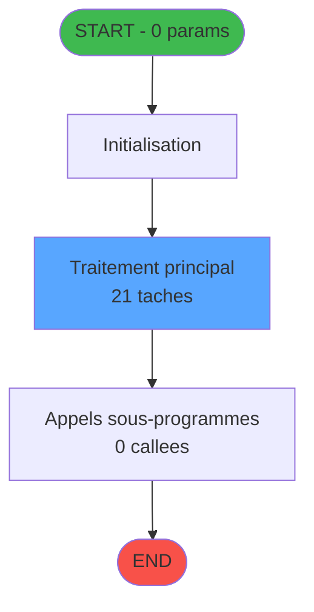

# ADH IDE 97 - Factures (Tble Compta&Vent) V3

> **Version spec**: 4.0
> **Analyse**: 2026-01-27 23:03
> **Source**: `D:\Data\Migration\XPA\PMS\ADH\Source\Prg_93.xml`
> **Methode**: APEX + PDCA (Auto-generated)

---

<!-- TAB:Fonctionnel -->

## SPECIFICATION FONCTIONNELLE

### 1.1 Objectif metier

| Element | Description |
|---------|-------------|
| **Qui** | Operateur (utilisateur connecte) |
| **Quoi** | Factures (Tble Compta&Vent) V3 |
| **Pourquoi** | Fonction metier du module ADH |
| **Declencheur** | Appel depuis programme parent ou menu |
| **Resultat** | Traitement effectue selon logique programme |

### 1.2 Regles metier

| Code | Regle | Condition |
|------|-------|-----------|
| RM-001 | Execution du traitement principal | Conditions d'entree validees |
| RM-002 | Gestion des tables (21 tables) | Acces selon mode (R/W/L) |
| RM-003 | Appels sous-programmes (0 callees) | Selon logique metier |

### 1.3 Flux utilisateur

1. Reception des parametres d'entree (0 params)
2. Initialisation et verification conditions
3. Traitement principal (21 taches)
4. Appels sous-programmes si necessaire
5. Retour resultats

### 1.4 Cas d'erreur

| Erreur | Comportement |
|--------|--------------|
| Conditions non remplies | Abandon avec message |
| Erreur sous-programme | Propagation erreur |

---

<!-- TAB:Technique -->

## SPECIFICATION TECHNIQUE

### 2.1 Identification

| Attribut | Valeur |
|----------|--------|
| **IDE Position** | 97 |
| **Fichier XML** | `Prg_93.xml` |
| **Description** | Factures (Tble Compta&Vent) V3 |
| **Module** | ADH |
| **Public Name** | Saisie_facture_tva |
| **Nombre taches** | 21 |
| **Lignes logique** | 799 |
| **Expressions** | 0 |

### 2.2 Tables

| # | Nom logique | Nom physique | Acces | Usage |
|---|-------------|--------------|-------|-------|
| 30 | gm-recherche_____gmr | cafil008_dat | LINK | Jointure |
| 31 | gm-complet_______gmc | cafil009_dat | LINK | Jointure |
| 40 | comptable________cte | cafil018_dat | WRITE | Ecriture |
| 121 | tables_pays_ventes | cafil099_dat | LINK | Jointure |
| 263 | vente | caisse_vente | LINK | Jointure |
| 372 | pv_budget | pv_budget_dat | LINK | Jointure |
| 744 | pv_lieux_vente | pv_lieux_vente | LINK | Jointure |
| 746 | projet | version | LINK | Jointure |
| 786 | qualite_avant_reprise | qualite_avant_reprise | LINK | Jointure |
| 866 | maj_appli_tpe | maj_appli_tpe | LINK/READ/WRITE | Jointure+R/W |
| 867 | log_maj_tpe | log_maj_tpe | READ | Lecture |
| 868 | Affectation_Gift_Pass | affectation_gift_pass | READ/WRITE | Lecture+Ecriture |
| 870 | Rayons_Boutique | rayons_boutique | LINK/READ/WRITE | Jointure+R/W |
| 871 | Activite | activite | LINK | Jointure |
| 911 | log_booker | log_booker | WRITE | Ecriture |
| 932 | taxe_add_param | taxe_add_param | LINK | Jointure |

**Resume**: 21 tables accedees dont **5 en ecriture**

### 2.3 Parametres d'entree (0 parametres)

| Var | Nom | Type | Picture |
|-----|-----|------|---------|
| - | Aucun parametre | - | - |

### 2.4 Algorigramme



### 2.5 Statistiques

| Metrique | Valeur |
|----------|--------|
| **Taches** | 21 |
| **Lignes logique** | 799 |
| **Expressions** | 0 |
| **Parametres** | 0 |
| **Tables accedees** | 21 |
| **Tables en ecriture** | 5 |
| **Callees niveau 1** | 0 |

---

<!-- TAB:Cartographie -->

## CARTOGRAPHIE APPLICATIVE

### 3.1 Chaine d'appels depuis Main

```mermaid
graph LR
    T[97 Factures (Tble ]
    ORPHAN([ORPHELIN ou Main])
    T -.-> ORPHAN
    style T fill:#58a6ff,color:#000
    style ORPHAN fill:#6b7280,stroke-dasharray: 5 5
```

### 3.2 Callers directs

| IDE | Programme | Nb appels |
|-----|-----------|-----------|
| - | ECF partage - appels cross-projet | - |

### 3.3 Callees (3 niveaux)

```mermaid
graph LR
    T[97 Factures (Tble ]
    TERM([TERMINAL])
    T -.-> TERM
    style TERM fill:#6b7280,stroke-dasharray: 5 5
    style T fill:#58a6ff,color:#000
```

| Niv | IDE | Programme | Nb appels | Status |
|-----|-----|-----------|-----------|--------|
| - | - | TERMINAL | - | - |

### 3.4 Composants ECF utilises

| ECF | IDE | Public Name | Description |
|-----|-----|-------------|-------------|
| ADH.ecf | 97 | Saisie_facture_tva | Sessions_Reprises |

### 3.5 Verification orphelin

| Critere | Resultat |
|---------|----------|
| Callers actifs | 0 programmes |
| PublicName | Defini: Saisie_facture_tva |
| ECF partage | OUI - ADH.ecf |
| **Conclusion** | **NON ORPHELIN** - Composant ECF partage |

---

## NOTES MIGRATION

### Complexite

| Critere | Score | Detail |
|---------|-------|--------|
| Taches | 21 | Complexe |
| Tables | 21 | Ecriture |
| Callees | 0 | Faible couplage |
| **Score global** | **HAUTE** | - |

### Points d'attention migration

| Point | Solution moderne |
|-------|-----------------|
| Variables globales (VG*) | Service/Repository injection |
| Tables Magic | Entity Framework / Dapper |
| CallTask | Service method calls |
| Forms | React/Angular components |

---

## HISTORIQUE

| Date | Action | Auteur |
|------|--------|--------|
| 2026-01-27 23:03 | **V4.0 APEX/PDCA** - Generation automatique complete | Script |

---

*Specification V4.0 - Auto-generated with APEX/PDCA methodology*

