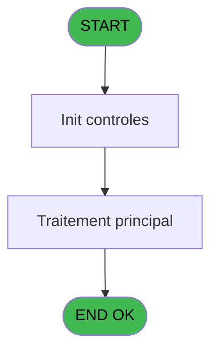
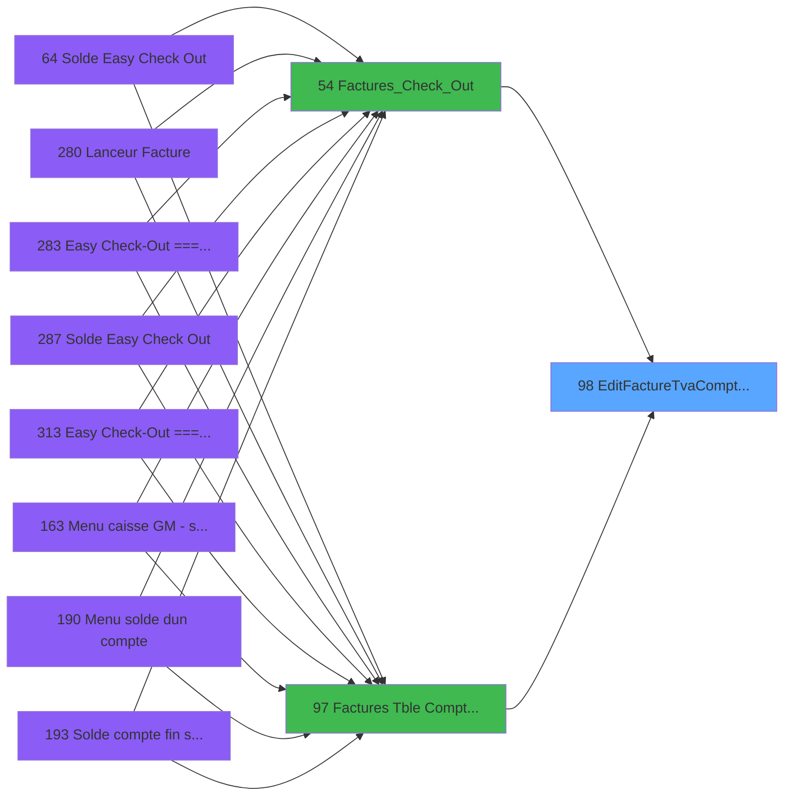

# ADH IDE 98 - EditFactureTva(Compta&Ve) V3

> **Analyse**: Phases 1-4 2026-02-07 03:47 -> 02:37 (22h49min) | Assemblage 02:37
> **Pipeline**: V7.2 Enrichi
> **Structure**: 4 onglets (Resume | Ecrans | Donnees | Connexions)

<!-- TAB:Resume -->

## 1. FICHE D'IDENTITE

| Attribut | Valeur |
|----------|--------|
| Projet | ADH |
| IDE Position | 98 |
| Nom Programme | EditFactureTva(Compta&Ve) V3 |
| Fichier source | `Prg_98.xml` |
| Dossier IDE | Facturation |
| Taches | 4 (0 ecrans visibles) |
| Tables modifiees | 0 |
| Programmes appeles | 0 |
| Complexite | **BASSE** (score 0/100) |

## 2. DESCRIPTION FONCTIONNELLE

ADH IDE 98 est un moteur de génération unifié pour les factures avec TVA. Appelé depuis deux workflows distincts (IDE 54 pour la caisse et IDE 97 pour la comptabilité), il garantit l'application cohérente des règles fiscales et la conformité réglementaire. Le programme orchestre quatre tâches successives qui transforment les données transactionnelles en factures formatées au format PDF avec une TVA correctement appliquée.

Le flux de traitement démarre par la saisie du numéro de facture et la détection de la configuration PDF, puis génère le corps principal de la facture en récupérant les adresses et montants de vente (tables 744, 27). La tâche imbriquée "Edition du Pied" extrait les journaux de terminal (table 867) pour formater le pied de page avec les données de paiement. Enfin, la tâche "Total Général" applique la règle VAT majeure (format VG22 avec fallback 'N12.2Z'), calcule les sous-totaux par tranche fiscale et produit le fichier PDF compressé.

Le programme est entièrement en lecture seule (zéro modification de données) et accède à 9 tables référentielles incluant les emplacements de vente, les paramètres fiscaux et les données de budget. Son architecture orientée services facilite une migration moderne vers un backend avec génération PDF templateisée (Puppeteer/wkhtmltopdf) et un service formatage TVA configurable. C'est un candidat idéal de refactorisation vu la propreté du code (0,7% de lignes désactivées) et l'absence de logique métier complexe dans les conditions.

## 3. BLOCS FONCTIONNELS

### 3.1 Saisie (1 tache)

Ce bloc traite la saisie des donnees de la transaction.

---

#### 98 - Edition Facture Tva(Ventes)

**Role** : Saisie des donnees : Edition Facture Tva(Ventes).
**Variables liees** : ER (P.i.Num Facture), ET (P.i.Facture sans Nom), EU (P.i.Facture sans Adresse), EV (P.i.Facture flaguee)

### 3.2 Impression (2 taches)

Generation des documents et tickets.

---

#### 98.1 - Edition

**Role** : Generation du document : Edition.

---

#### 98.1.1 - Edition du Pied

**Role** : Generation du document : Edition du Pied.

### 3.3 Traitement (1 tache)

Traitements internes.

---

#### 98.1.1.1 - Total Général

**Role** : Traitement : Total Général.

## 5. REGLES METIER

1 regles identifiees:

### Autres (1 regles)

#### [RM-001] Valeur par defaut si Trim(VG22) est vide

| Element | Detail |
|---------|--------|
| **Condition** | `Trim(VG22)=''` |
| **Si vrai** | 'N12.2Z' |
| **Si faux** | VG22) |
| **Expression source** | Expression 2 : `IF(Trim(VG22)='','N12.2Z',VG22)` |
| **Exemple** | Si Trim(VG22)='' → 'N12.2Z'. Sinon → VG22) |

## 6. CONTEXTE

- **Appele par**: [Factures_Check_Out (IDE 54)](ADH-IDE-54.md), [Factures (Tble Compta&Vent) V3 (IDE 97)](ADH-IDE-97.md)
- **Appelle**: 0 programmes | **Tables**: 9 (W:0 R:3 L:6) | **Taches**: 4 | **Expressions**: 4

<!-- TAB:Ecrans -->

## 8. ECRANS

*(Programme sans ecran visible)*

## 9. NAVIGATION

### 9.3 Structure hierarchique (4 taches)

| Position | Tache | Type | Dimensions | Bloc |
|----------|-------|------|------------|------|
| **98.1** | [**Edition Facture Tva(Ventes)** (98)](#t1) | - | - | Saisie |
| **98.2** | [**Edition** (98.1)](#t2) | - | - | Impression |
| 98.2.1 | [Edition du Pied (98.1.1)](#t3) | - | - | |
| **98.3** | [**Total Général** (98.1.1.1)](#t4) | - | - | Traitement |

### 9.4 Algorigramme

> **Legende**: Vert = START/END OK | Rouge = END KO | Bleu = Decisions
> *Algorigramme auto-genere. Utiliser `/algorigramme` pour une synthese metier detaillee.*

<!-- TAB:Donnees -->

## 10. TABLES

### Tables utilisees (9)

| ID | Nom | Description | Type | R | W | L | Usages |
|----|-----|-------------|------|---|---|---|--------|
| 867 | log_maj_tpe |  | DB | R |   |   | 2 |
| 744 | pv_lieux_vente | Donnees de ventes | DB | R |   |   | 1 |
| 27 | donnees_village__dvi |  | DB | R |   |   | 1 |
| 121 | tables_pays_ventes | Donnees de ventes | DB |   |   | L | 1 |
| 31 | gm-complet_______gmc |  | DB |   |   | L | 1 |
| 372 | pv_budget |  | DB |   |   | L | 1 |
| 932 | taxe_add_param |  | DB |   |   | L | 1 |
| 869 | Detail_Import_Boutique |  | DB |   |   | L | 1 |
| 866 | maj_appli_tpe |  | DB |   |   | L | 1 |

### Colonnes par table (2 / 3 tables avec colonnes identifiees)

Table 867 - log_maj_tpe (R) - 2 usages

*Table utilisee uniquement en Link ou aucune colonne Real identifiee dans le DataView.*

Table 744 - pv_lieux_vente (R) - 1 usages

| Lettre | Variable | Acces | Type |
|--------|----------|-------|------|
| A | v.Adresse Gm | R | Alpha |
| B | v.Montant Versements | R | Numeric |

Table 27 - donnees_village__dvi (R) - 1 usages

| Lettre | Variable | Acces | Type |
|--------|----------|-------|------|
| A | P.i.Societe | R | Alpha |
| B | P.i.Compte GM | R | Numeric |
| C | P.i.Filiation | R | Numeric |
| D | P.i.Nom Fichier PDF | R | Alpha |
| E | P.i.Num Facture | R | Numeric |
| F | P.i.Service | R | Alpha |
| G | P.i.Facture sans Nom | R | Logical |
| H | P.i.Facture sans Adresse | R | Logical |
| I | P.i.Facture flaguee | R | Logical |
| J | P.i.Archive | R | Logical |
| K | P.i.Preview ? | R | Logical |
| L | P.i.Titre | R | Alpha |
| M | P.i.Duplicata ? | R | Logical |

## 11. VARIABLES

### 11.1 Parametres entrants (13)

Variables recues du programme appelant ([Factures_Check_Out (IDE 54)](ADH-IDE-54.md)).

| Lettre | Nom | Type | Usage dans |
|--------|-----|------|-----------|
| EN | P.i.Societe | Alpha | - |
| EO | P.i.Compte GM | Numeric | - |
| EP | P.i.Filiation | Numeric | - |
| EQ | P.i.Nom Fichier PDF | Alpha | - |
| ER | P.i.Num Facture | Numeric | [98](#t1) |
| ES | P.i.Service | Alpha | - |
| ET | P.i.Facture sans Nom | Logical | - |
| EU | P.i.Facture sans Adresse | Logical | - |
| EV | P.i.Facture flaguee | Logical | - |
| EW | P.i.Archive | Logical | - |
| EX | P.i.Preview ? | Logical | - |
| EY | P.i.Titre | Alpha | - |
| EZ | P.i.Duplicata ? | Logical | - |

## 12. EXPRESSIONS

**4 / 4 expressions decodees (100%)**

### 12.1 Repartition par type

| Type | Expressions | Regles |
|------|-------------|--------|
| CONDITION | 1 | 5 |
| OTHER | 1 | 0 |
| CAST_LOGIQUE | 2 | 0 |

### 12.2 Expressions cles par type

#### CONDITION (1 expressions)

| Type | IDE | Expression | Regle |
|------|-----|------------|-------|
| CONDITION | 2 | `IF(Trim(VG22)='','N12.2Z',VG22)` | [RM-001](#rm-RM-001) |

#### OTHER (1 expressions)

| Type | IDE | Expression | Regle |
|------|-----|------------|-------|
| OTHER | 1 | `P.i.Num Facture [E]` | - |

#### CAST_LOGIQUE (2 expressions)

| Type | IDE | Expression | Regle |
|------|-----|------------|-------|
| CAST_LOGIQUE | 4 | `INIPut('CompressPDF =Y','FALSE'LOG)` | - |
| CAST_LOGIQUE | 3 | `INIPut('EmbedFonts=N','FALSE'LOG)` | - |

<!-- TAB:Connexions -->

## 13. GRAPHE D'APPELS

### 13.1 Chaine depuis Main (Callers)

Main -> ... -> [Factures_Check_Out (IDE 54)](ADH-IDE-54.md) -> **EditFactureTva(Compta&Ve) V3 (IDE 98)**

Main -> ... -> [Factures (Tble Compta&Vent) V3 (IDE 97)](ADH-IDE-97.md) -> **EditFactureTva(Compta&Ve) V3 (IDE 98)**

### 13.2 Callers

| IDE | Nom Programme | Nb Appels |
|-----|---------------|-----------|
| [54](ADH-IDE-54.md) | Factures_Check_Out | 2 |
| [97](ADH-IDE-97.md) | Factures (Tble Compta&Vent) V3 | 1 |

### 13.3 Callees (programmes appeles)

### 13.4 Detail Callees avec contexte

| IDE | Nom Programme | Appels | Contexte |
|-----|---------------|--------|----------|
| - | (aucun) | - | - |

## 14. RECOMMANDATIONS MIGRATION

### 14.1 Profil du programme

| Metrique | Valeur | Impact migration |
|----------|--------|-----------------|
| Lignes de logique | 150 | Programme compact |
| Expressions | 4 | Peu de logique |
| Tables WRITE | 0 | Impact faible |
| Sous-programmes | 0 | Peu de dependances |
| Ecrans visibles | 0 | Ecran unique ou traitement batch |
| Code desactive | 0.7% (1 / 150) | Code sain |
| Regles metier | 1 | Quelques regles a preserver |

### 14.2 Plan de migration par bloc

#### Saisie (1 tache: 0 ecran, 1 traitement)

- **Strategie** : Formulaire React/Blazor avec validation Zod/FluentValidation.
- Validation temps reel cote client + serveur

#### Impression (2 taches: 0 ecran, 2 traitements)

- **Strategie** : Templates HTML -> PDF via wkhtmltopdf ou Puppeteer.
- `PrintService` injectable avec choix imprimante

#### Traitement (1 tache: 0 ecran, 1 traitement)

- **Strategie** : 1 service(s) backend injectable(s) (Domain Services).
- Decomposer les taches en services unitaires testables.

### 14.3 Dependances critiques

| Dependance | Type | Appels | Impact |
|------------|------|--------|--------|

---
*Spec DETAILED generee par Pipeline V7.2 - 2026-02-08 02:38*
