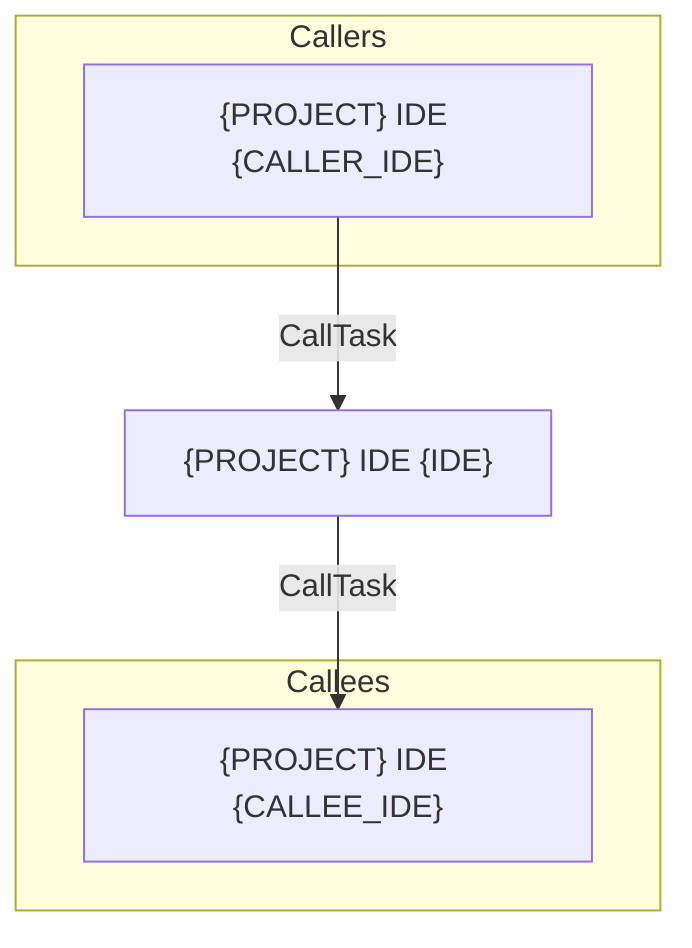

# {PROJECT} IDE {IDE} - {TITLE}

> **Version spec** : 2.0
> **Genere le** : {DATE}
> **Source** : `{SOURCE_PATH}`

---

## 1. IDENTIFICATION

| Attribut | Valeur |
|----------|--------|
| **Format IDE** | {PROJECT} IDE {IDE} |
| **Nom Public** | {PUBLIC_NAME} |
| **Description** | {DESCRIPTION} |
| **Type** | {TYPE} (O=Online, B=Batch) |
| **Module** | {PROJECT} ({MODULE_DESC}) |

> **Regle v2** : JAMAIS utiliser "Prg_XXX" ou "ISN_2=X" - toujours format IDE

---

## 2. OBJECTIF METIER

**Quoi ?** {WHAT}

**Pour qui ?** {FOR_WHO}

**Pourquoi ?** {WHY}

---

## 3. TABLES (100% decodees)

| IDE# | Nom Physique | Nom Logique | Access | Role |
|------|--------------|-------------|--------|------|
| #{TABLE_ID} | `{TABLE_PHYSICAL}` | {TABLE_LOGICAL} | {ACCESS} | {TABLE_ROLE} |

> **Regle v2** : Toujours `#{ID}` + nom physique + nom logique. JAMAIS juste l'ID.

---

## 4. VARIABLES (avec lineage)

### 4.1 Variables de travail (W)

| Var | Nom | Type | Source | Role |
|-----|-----|------|--------|------|
| W0 | {VAR_NAME} | {TYPE} | {SOURCE} | {ROLE} |

### 4.2 Variables globales (VG)

| Ref | Var | Nom | Decode | Role |
|-----|-----|-----|--------|------|
| `{32768,X}` | VG.{LETTER} | {VAR_NAME} | Session_Ouverte | {ROLE} |

> **Regle v2** : Chaque `{N,Y}` doit avoir son decode cote a cote

---

## 5. EXPRESSIONS (100% decodees)

| # | Brut | Decode | Signification |
|---|------|--------|---------------|
| {EXPR_ID} | `{RAW_EXPR}` | `{DECODED_EXPR}` | {MEANING} |

> **Regle v2** : AUCUNE expression `{N,Y}` sans son equivalent decode

---

## 6. REGLES METIER

| Regle | Description | Expression | Variable |
|-------|-------------|------------|----------|
| **RM-001** | {RULE_DESC} | #{EXPR_ID} | {VAR_NAME} |

---

## 7. STRUCTURE DES TACHES

```
{PROJECT} IDE {IDE} - {TITLE}
|
+-- Tache {IDE}.1 - {TASK1_NAME}
|   +-- Type: {TASK1_TYPE}
|   +-- Tables: #{T1}, #{T2}
|   +-- Logic: {TASK1_LOGIC}
|
+-- Tache {IDE}.2 - {TASK2_NAME}
    +-- Type: {TASK2_TYPE}
    +-- Tables: #{T3}
    +-- Logic: {TASK2_LOGIC}
```

---

## 8. CALL GRAPH (liens interactifs)

### 8.1 Programmes appelants (Callers)

| Caller | IDE | Nom | Type Appel | Lien |
|--------|-----|-----|------------|------|
| {PROJECT} IDE {CALLER_IDE} | {CALLER_IDE} | {CALLER_NAME} | {CALL_TYPE} | [Voir spec]({CALLER_FILE}) |

### 8.2 Programmes appeles (Callees)

| Callee | IDE | Nom | Type Appel | Lien |
|--------|-----|-----|------------|------|
| {PROJECT} IDE {CALLEE_IDE} | {CALLEE_IDE} | {CALLEE_NAME} | {CALL_TYPE} | [Voir spec]({CALLEE_FILE}) |

### 8.3 Diagramme de dependances



---

## 9. TABLES PARTAGEES (cross-reference)

| Table | Nom Physique | Programmes utilisant | Lien |
|-------|--------------|---------------------|------|
| #{TABLE_ID} | `{TABLE_PHYSICAL}` | [IDE {PROG1}]({PROG1_FILE}), [IDE {PROG2}]({PROG2_FILE}) | R/W |

---

## 10. AIDE RESOLUTION BUGS

### FAQ Debug

| Question | Ou chercher | Section |
|----------|-------------|---------|
| "Qui modifie variable X?" | Variables + Expressions | §4 + §5 |
| "Quelles tables en ecriture?" | Tables avec Access=W | §3 |
| "Condition qui declenche Y?" | Expressions | §5 Expression #N |
| "Qui appelle ce programme?" | Call Graph Callers | §8.1 |
| "Que fait ce programme?" | Objectif Metier | §2 |

### Variables critiques

| Variable | Decode | Surveillance | Impact |
|----------|--------|--------------|--------|
| `{32768,X}` | VG.{LETTER} | Etat session | Bloque operations si false |

---

## 11. NOTES DE MIGRATION

### 11.1 Complexite

| Critere | Score | Justification |
|---------|-------|---------------|
| Nombre de taches | {NB_TASKS} | {TASKS_COMMENT} |
| Tables en ecriture | {NB_WRITE_TABLES} | {TABLES_COMMENT} |
| Expressions complexes | {NB_EXPRESSIONS} | {EXPR_COMMENT} |
| Appels externes | {NB_CALLS} | {CALLS_COMMENT} |
| **Total** | **{COMPLEXITY}** | |

### 11.2 Points d'attention

1. **{ATTENTION_1}**
2. **{ATTENTION_2}**

### 11.3 Architecture cible suggere

```
API Endpoint: {API_ENDPOINT}
+-- Request: { {REQUEST_PARAMS} }
+-- Middleware: {MIDDLEWARE}
+-- Controller: {CONTROLLER}
+-- Response: { {RESPONSE_PARAMS} }
```

---

## 12. HISTORIQUE

| Date | Action | Auteur |
|------|--------|--------|
| {DATE} | Creation specification v2.0 | Claude |

---

*Template de specification v2.0 - Toutes les expressions 100% decodees*
