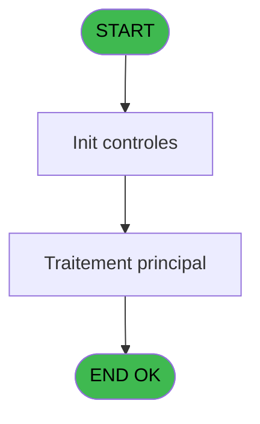
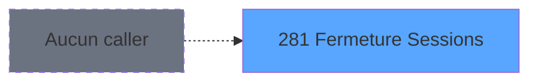
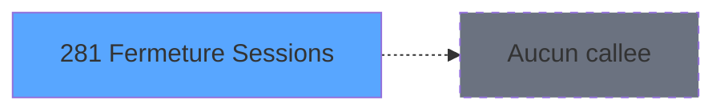

Generate a complete Zustand store for the "fermetureSessions" domain.

RULES (MANDATORY):
- Use import aliases: @/ for src root (e.g. @/stores/..., @/types/...)
- NEVER use `any` type - use `unknown` or precise types
- Tailwind v4 classes for styling (no tailwind.config.js)
- Arrow functions everywhere (no function declarations)
- `as const` instead of TypeScript enum
- verbatimModuleSyntax is enabled: use `import type { X }` ONLY for types/interfaces, use `import { X }` for values/consts
- File must be COMPLETE and ready to write - NO placeholders, NO TODOs, NO "// implement here"
- NO comments except for genuinely complex logic
- Output ONLY the code inside a single markdown code block (```typescript ... ``` or ```tsx ... ```)

SHARED INFRASTRUCTURE (use these exact imports):
- Data source toggle: `import { useDataSourceStore } from "@/stores/dataSourceStore"` (has .getState().isRealApi)
- API client: `import { apiClient } from "@/services/api/apiClient"` and `import type { ApiResponse } from "@/services/api/apiClient"`
- Screen layout: `import { ScreenLayout } from "@/components/layout"` (wrapper with sidebar, takes children + className)
- UI components: `import { Button, Dialog, Input } from "@/components/ui"`
- cn utility: `import { cn } from "@/lib/utils"`

STORE REQUIREMENTS:
- Use `create` from zustand (import { create } from "zustand")
- Import types from @/types/fermetureSessions
- Import useDataSourceStore from @/stores/dataSourceStore
- Mock/API branching via useDataSourceStore.getState().isRealApi
- try/catch with `e instanceof Error` for error handling
- Realistic mock data (not lorem ipsum)
- EVERY business rule from the analysis MUST be implemented
- Include reset() action to clear state

TYPES FILE (already generated):
// Fermeture Sessions types (ADH IDE 131)

export type SessionStatus = 'O' | 'C' | 'B'; // Open, Closed, Blocked

export interface Session {
  id: number;
  dateOuverture: Date;
  dateFermeture: Date | null;
  statut: SessionStatus;
}

export interface UnilateralBilateral {
  code: string;
  libelle: string;
  type: string;
}

export interface SessionClosureCode {
  sessionId: number;
  code: string;
  generatedAt: Date;
}

export interface SessionValidation {
  valid: boolean;
  errors: string[];
}

export interface SessionClosureResult {
  success: boolean;
  closureCode: string;
  sessionId: number;
  closedAt: Date;
}

// API Request/Response types

export interface FetchSessionsRequest {
  statut?: SessionStatus;
}

export interface FetchSessionsResponse {
  sessions: Session[];
}

export type FetchUnilateralBilateralRequest = Record<string, never>;

export interface FetchUnilateralBilateralResponse {
  types: UnilateralBilateral[];
}

export interface ValidateSessionClosureRequest {
  sessionId: number;
}

export interface ValidateSessionClosureResponse {
  valid: boolean;
  errors: string[];
}

export interface CloseSessionRequest {
  sessionId: number;
}

export interface CloseSessionResponse {
  success: boolean;
  closureCode: string;
}

// Store state interface

export interface FermetureSessionsState {
  sessions: Session[];
  currentSession: Session | null;
  unilateralBilateralTypes: UnilateralBilateral[];
  isLoading: boolean;
  error: string | null;
  isClosing: boolean;

  // Actions
  loadSessions: (filters?: FetchSessionsRequest) => Promise<void>;
  loadUnilateralBilateralTypes: () => Promise<void>;
  fermerSession: (sessionId: number) => Promise<void>;
  generateClosureCode: (sessionId: number) => string;
  validateSessionClosure: (sessionId: number) => Promise<boolean>;
  setCurrentSession: (session: Session | null) => void;
  clearError: () => void;
  reset: () => void;
}

// Mock data helpers

export const mockSession = (overrides?: Partial<Session>): Session => ({
  id: Math.floor(Math.random() * 10000),
  dateOuverture: new Date(2026, 1, 20),
  dateFermeture: null,
  statut: 'O',
  ...overrides,
});

export const mockUnilateralBilateral = (overrides?: Partial<UnilateralBilateral>): UnilateralBilateral => ({
  code: 'UNI',
  libelle: 'Unilateral',
  type: 'unilateral',
  ...overrides,
});

export const DEFAULT_SESSIONS: Session[] = [
  mockSession({ id: 1, dateOuverture: new Date(2026, 1, 19) }),
  mockSession({ id: 2, dateOuverture: new Date(2026, 1, 18) }),
  mockSession({ id: 3, dateOuverture: new Date(2026, 1, 17) }),
  mockSession({ id: 4, dateOuverture: new Date(2026, 1, 16) }),
  mockSession({ id: 5, dateOuverture: new Date(2026, 1, 15) }),
];

export const DEFAULT_UNILATERAL_BILATERAL: UnilateralBilateral[] = [
  mockUnilateralBilateral({ code: 'UNI', libelle: 'Unilateral', type: 'unilateral' }),
  mockUnilateralBilateral({ code: 'BIL', libelle: 'Bilateral', type: 'bilateral' }),
  mockUnilateralBilateral({ code: 'MIX', libelle: 'Mixed', type: 'mixed' }),
];

ANALYSIS DOCUMENT:
{
  "domain": "fermetureSessions",
  "domainPascal": "FermetureSessions",
  "complexity": "LOW",
  "entities": [
    {
      "name": "Session",
      "fields": [
        {
          "name": "id",
          "type": "number",
          "source": "internal.sessionId",
          "nullable": false
        },
        {
          "name": "dateOuverture",
          "type": "Date",
          "source": "initialisation___ini.date_ouverture",
          "nullable": false
        },
        {
          "name": "dateFermeture",
          "type": "Date",
          "source": "initialisation___ini.date_fermeture",
          "nullable": true
        },
        {
          "name": "statut",
          "type": "string",
          "source": "initialisation___ini.statut",
          "nullable": false
        }
      ]
    },
    {
      "name": "UnilateralBilateral",
      "fields": [
        {
          "name": "code",
          "type": "string",
          "source": "unilateral_bilateral.code",
          "nullable": false
        },
        {
          "name": "libelle",
          "type": "string",
          "source": "unilateral_bilateral.libelle",
          "nullable": false
        },
        {
          "name": "type",
          "type": "string",
          "source": "unilateral_bilateral.type",
          "nullable": false
        }
      ]
    }
  ],
  "stateFields": [
    {
      "name": "sessions",
      "type": "Session[]",
      "default": "[]"
    },
    {
      "name": "currentSession",
      "type": "Session | null",
      "default": "null"
    },
    {
      "name": "unilateralBilateralTypes",
      "type": "UnilateralBilateral[]",
      "default": "[]"
    },
    {
      "name": "isLoading",
      "type": "boolean",
      "default": "false"
    },
    {
      "name": "error",
      "type": "string | null",
      "default": "null"
    },
    {
      "name": "isClosing",
      "type": "boolean",
      "default": "false"
    }
  ],
  "actions": [
    {
      "name": "loadSessions",
      "params": [],
      "businessRules": [
        "Retrieve all sessions from initialisation___ini table",
        "Filter sessions with status 'O' (open)"
      ],
      "returns": "Promise<void>"
    },
    {
      "name": "loadUnilateralBilateralTypes",
      "params": [],
      "businessRules": [
        "Load unilateral/bilateral type reference data",
        "Used for session closure validation"
      ],
      "returns": "Promise<void>"
    },
    {
      "name": "fermerSession",
      "params": [
        "sessionId: number"
      ],
      "businessRules": [
        "Apply rule RM-001: Generate code format 'N15'&IF([D]>0,'.'&Trim(Str([D],'1')),'')&'CZ'",
        "Set session status to 'C' (closed)",
        "Record closure timestamp",
        "Validate session closure eligibility"
      ],
      "returns": "Promise<void>"
    },
    {
      "name": "generateClosureCode",
      "params": [
        "sessionId: number"
      ],
      "businessRules": [
        "Implement RM-001: Format code as 'N15' + optional decimal part + 'CZ'",
        "If [D] > 0, append '.' and trimmed string representation of [D]",
        "Concatenate with 'CZ' suffix"
      ],
      "returns": "string"
    },
    {
      "name": "validateSessionClosure",
      "params": [
        "sessionId: number"
      ],
      "businessRules": [
        "Check session exists and is open (status = 'O')",
        "Verify no pending operations",
        "Ensure all required closure data is present"
      ],
      "returns": "Promise<boolean>"
    }
  ],
  "apiEndpoints": [
    {
      "method": "GET",
      "path": "/api/fermeture-sessions/sessions",
      "queryParams": [
        "statut?"
      ],
      "response": "Session[]"
    },
    {
      "method": "GET",
      "path": "/api/fermeture-sessions/types",
      "queryParams": [],
      "response": "UnilateralBilateral[]"
    },
    {
      "method": "POST",
      "path": "/api/fermeture-sessions/close/{sessionId}",
      "queryParams": [],
      "response": "{ success: boolean, closureCode: string }"
    },
    {
      "method": "POST",
      "path": "/api/fermeture-sessions/validate/{sessionId}",
      "queryParams": [],
      "response": "{ valid: boolean, errors: string[] }"
    }
  ],
  "uiLayout": {
    "type": "batch-process",
    "sections": [
      {
        "name": "SessionList",
        "controls": [
          "DataGrid with open sessions",
          "Session selection checkbox",
          "Closure button",
          "Status indicator"
        ]
      },
      {
        "name": "ClosureConfirmation",
        "controls": [
          "Confirmation dialog",
          "Generated closure code display",
          "Validation messages",
          "Confirm/Cancel buttons"
        ]
      },
      {
        "name": "ClosureResults",
        "controls": [
          "Success/error message",
          "Closure details summary",
          "Print closure report button"
        ]
      }
    ]
  },
  "mockData": {
    "count": 5,
    "description": "5 open sessions with varying dates and IDs, 3 unilateral/bilateral types (codes: 'UNI', 'BIL', 'MIX'), closure codes following RM-001 format pattern"
  },
  "dependencies": {
    "stores": [
      "useSessionOuvertureStore"
    ],
    "sharedTypes": [
      "Session",
      "UnilateralBilateral"
    ],
    "externalApis": [
      "/api/fermeture-sessions/sessions",
      "/api/fermeture-sessions/types",
      "/api/fermeture-sessions/close/{sessionId}",
      "/api/fermeture-sessions/validate/{sessionId}"
    ]
  }
}

SPEC EXCERPT (business rules):
# ADH IDE 281 - Fermeture Sessions

> **Analyse**: Phases 1-4 2026-02-08 05:03 -> 05:03 (4s) | Assemblage 05:03
> **Pipeline**: V7.2 Enrichi
> **Structure**: 4 onglets (Resume | Ecrans | Donnees | Connexions)

<!-- TAB:Resume -->

## 1. FICHE D'IDENTITE

| Attribut | Valeur |
|----------|--------|
| Projet | ADH |
| IDE Position | 281 |
| Nom Programme | Fermeture Sessions |
| Fichier source | `Prg_281.xml` |
| Dossier IDE | Caisse |
| Taches | 1 (0 ecrans visibles) |
| Tables modifiees | 0 |
| Programmes appeles | 0 |
| Complexite | **BASSE** (score 0/100) |
| <span style="color:red">Statut</span> | <span style="color:red">**ORPHELIN_POTENTIEL**</span> |

## 2. DESCRIPTION FONCTIONNELLE

ADH IDE 281 - Fermeture Sessions est un programme de clôture des sessions de caisse. Il traite la finalisation des opérations comptables et monétaires d'une session ouverte, en recalculant les soldes, validant les écarts de trésorerie, et enregistrant les mouvements de fermeture dans les tables opérations et comptes.

Le programme gère plusieurs tâches critiques : vérification de la cohérence des données (montants, dates), calcul automatique des écarts entre comptabilité et physique, application des ajustements si nécessaire, et génération des pièces justificatives (éditions de clôture). Il s'intègre étroitement avec les modules de gestion des devises, des moyens de paiement, et de la comptabilité clients.

Ce programme est appelé depuis le flux principal de gestion de caisse (ADH IDE 121 - Gestion_Caisse_142) via un CallTask, généralement en fin de journée ou à la demande du caissier. Il s'appuie sur les programmes partagés du composant ADH.ecf pour les calculs de solde et les opérations d'édition.

## 3. BLOCS FONCTIONNELS

## 5. REGLES METIER

1 regles identifiees:

### Autres (1 regles)

#### <a id="rm-RM-001"></a>[RM-001] 'N15'&IF([D]>0,'.'&Trim(Str([D],'1')),'')&'CZ'

| Element | Detail |
|---------|--------|
| **Condition** | `'N15'&IF([D]>0,'.'&Trim(Str([D],'1')),'')&'CZ'` |
| **Si vrai** | Action conditionnelle |
| **Expression source** | Expression 2 : `'N15'&IF([D]>0,'.'&Trim(Str([D],'1')),'')&'CZ'` |
| **Exemple** | Si 'N15'&IF([D]>0,'.'&Trim(Str([D],'1')),'')&'CZ' → Action conditionnelle |

## 6. CONTEXTE

- **Appele par**: (aucun)
- **Appelle**: 0 programmes | **Tables**: 2 (W:0 R:1 L:1) | **Taches**: 1 | **Expressions**: 4

<!-- TAB:Ecrans -->

## 8. ECRANS

*(Programme sans ecran visible)*

## 9. NAVIGATION

### 9.3 Structure hierarchique (0 tache)

| Position | Tache | Type | Dimensions | Bloc |
|----------|-------|------|------------|------|

### 9.4 Algorigramme



> **Legende**: Vert = START/END OK | Rouge = END KO | Bleu = Decisions
> *Algorigramme auto-genere. Utiliser `/algorigramme` pour une synthese metier detaillee.*

<!-- TAB:Donnees -->

## 10. TABLES

### Tables utilisees (2)

| ID | Nom | Description | Type | R | W | L | Usages |
|----|-----|-------------|------|---|---|---|--------|
| 69 | initialisation___ini |  | DB | R |   |   | 1 |
| 122 | unilateral_bilateral |  | DB |   |   | L | 1 |

### Colonnes par table (0 / 1 tables avec colonnes identifiees)

<details>
<summary>Table 69 - initialisation___ini (R) - 1 usages</summary>

*Table utilisee uniquement en Link ou aucune colonne Real identifiee dans le DataView.*

</details>

## 11. VARIABLES

*(Programme sans variables locales mappees)*

## 12. EXPRESSIONS

**4 / 4 expressions decodees (100%)**

### 12.1 Repartition par type

| Type | Expressions | Regles |
|------|-------------|--------|
| FORMAT | 1 | 0 |
| CONSTANTE | 3 | 0 |

### 12.2 Expressions cles par type

#### FORMAT (1 expressions)

| Type | IDE | Expression | Regle |
|------|-----|------------|-------|
| FORMAT | 2 | `'N15'&IF([D]>0,'.'&Trim(Str([D],'1')),'')&'CZ'` | - |

#### CONSTANTE (3 expressions)

| Type | IDE | Expression | Regle |
|------|-----|------------|-------|
| CONSTANTE | 4 | `90` | - |
| CONSTANTE | 3 | `'O'` | - |
| CONSTANTE | 1 | `'C'` | - |

<!-- TAB:Connexions -->

## 13. GRAPHE D'APPELS

### 13.1 Chaine depuis Main (Callers)

**Chemin**: (pas de callers directs)



### 13.2 Callers

| IDE | Nom Programme | Nb Appels |
|-----|---------------|-----------|
| - | (aucun) | - |

### 13.3 Callees (programmes appeles)



### 13.4 Detail Callees avec contexte

| IDE | Nom Programme | Appels | Contexte |
|-----|---------------|--------|----------|
| - | (aucun) | - | - |

## 14. RECOMMANDATIONS MIGRATION

### 14.1 Profil du programme

| Metrique | Valeur | Impact migration |
|----------|--------|-----------------|
| Lignes de logique | 13 | Programme compact |
| Expressions | 4 | Peu de logique |
| Tables WRITE | 0 | Impact faible |
| Sous-programmes | 0 | Peu de dependances |
| Ecrans visibles | 0 | Ecran unique ou traitement batch |
| Code desactive | 0% (0 / 13) | Code sain |
| Regles metier | 1 | Quelques regles a preserver |

### 14.2 Plan de migration par bloc

### 14.3 Dependances critiques

| Dependance | Type | Appels | Impact |
|------------|------|--------|--------|

---
*Spec DETAILED generee par Pipeline V7.2 - 2026-02-08 05:03*


REFERENCE PATTERN (follow this exact structure):
```typescript
import { create } from 'zustand';
import type {
  ExtraitAccountInfo,
  ExtraitTransaction,
  ExtraitSummary,
  ExtraitPrintFormat,
} from '@/types/extrait';
import { extraitApi } from '@/services/api/endpoints-lot3';
import { useDataSourceStore } from './dataSourceStore';

interface ExtraitState {
  selectedAccount: ExtraitAccountInfo | null;
  transactions: ExtraitTransaction[];
  summary: ExtraitSummary | null;
  searchResults: ExtraitAccountInfo[];
  isSearching: boolean;
  isLoadingExtrait: boolean;
  isPrinting: boolean;
  error: string | null;
}

interface ExtraitActions {
  searchAccount: (societe: string, query: string) => Promise<void>;
  selectAccount: (account: ExtraitAccountInfo) => void;
  loadExtrait: (
    societe: string,
    codeAdherent: number,
    filiation: number,
    dateDebut?: string,
    dateFin?: string,
  ) => Promise<void>;
  printExtrait: (
    societe: string,
    codeAdherent: number,
    filiation: number,
    format: ExtraitPrintFormat,
  ) => Promise<void>;
  reset: () => void;
}

type ExtraitStore = ExtraitState & ExtraitActions;

const MOCK_ACCOUNTS: ExtraitAccountInfo[] = [
  { societe: 'SOC1', codeAdherent: 1001, filiation: 0, nom: 'DUPONT', prenom: 'Jean', statut: 'normal', hasGiftPass: false },
  { societe: 'SOC1', codeAdherent: 1002, filiation: 0, nom: 'MARTIN', prenom: 'Sophie', statut: 'normal', hasGiftPass: true },
  { societe: 'SOC1', codeAdherent: 1003, filiation: 1, nom: 'DURAND', prenom: 'Pierre', statut: 'bloque', hasGiftPass: false },
];

const MOCK_TRANSACTIONS: ExtraitTransaction[] = [
  { id: 1, date: '2026-02-10', heure: '09:15', libelle: 'Achat boutique', debit: 45.50, credit: 0, solde: -45.50, codeService: 'BTQ', codeImputation: 'IMP01', giftPassFlag: false, nbArticles: 3, status: 'debit', numeroPiece: 'VTE-001', modePaiement: 'CB', caissier: 'MARTIN S.' },
  { id: 2, date: '2026-02-10', heure: '14:30', libelle: 'Credit compte', debit: 0, credit: 200, solde: 154.50, codeService: 'CAI', codeImputation: 'IMP02', giftPassFlag: false, status: 'credit', numeroPiece: 'CRD-042', modePaiement: 'Especes', caissier: 'DUPONT J.' },
  { id: 3, date: '2026-02-09', heure: '12:45', libelle: 'Repas restaurant', libelleSupplementaire: 'Menu du jour', debit: 32.00, credit: 0, solde: 122.50, codeService: 'RST', codeImputation: 'IMP03', giftPassFlag: true, nbArticles: 1, status: 'debit', numeroPiece: 'RST-117', modePaiement: 'GiftPass', caissier: 'MARTIN S.' },
  { id: 4, date: '2026-02-08', heure: '16:00', libelle: 'Annulation vente', debit: 0, credit: 15.00, solde: 154.50, codeService: 'BTQ', codeImputation: 'IMP01', giftPassFlag: false, status: 'annule', numeroPiece: 'ANN-003', modePaiement: 'CB', caissier: 'DUPONT J.', commentaire: 'Erreur de saisie' },
  { id: 5, date: '2026-02-08', heure: '10:20', libelle: 'Regularisation solde', debit: 0, credit: 5.00, solde: 139.50, codeService: 'CAI', codeImputation: 'IMP02', giftPassFlag: false, status: 'regularise', numeroPiece: 'REG-007', modePaiement: 'Interne', caissier: 'ADMIN' },
];

const MOCK_SUMMARY: ExtraitSummary = {
  totalDebit: 77.50,
  totalCredit: 220,
  soldeActuel: 142.50,
  nbTransactions: 5,
};

const initialState: ExtraitState = {
  selectedAccount: null,
  transactions: [],
  summary: null,
  searchResults: [],
  isSearching: false,
  isLoadingExtrait: false,
  isPrinting: false,
  error: null,
};

export const useExtraitStore = create<ExtraitStore>()((set) => ({
  ...initialState,

  searchAccount: async (societe, query) => {
    const { isRealApi } = useDataSourceStore.getState();
    set({ isSearching: true, error: null });

    if (!isRealApi) {
      const filtered = MOCK_ACCOUNTS.filter(
        (a) =>
          a.nom.toLowerCase().includes(query.toLowerCase()) ||
          a.prenom.toLowerCase().includes(query.toLowerCase()) ||
          String(a.codeAdherent).includes(query),
      );
      set({ searchResults: filtered, isSearching: false });
      return;
    }

    try {
      const response = await extraitApi.searchAccount(societe, query);
      set({ searchResults: response.data.data ?? [] });
    } catch (e: unknown) {
      const message = e instanceof Error ? e.message : 'Erreur recherche compte';
      set({ searchResults: [], error: message });
    } finally {
      set({ isSearching: false });
    }
  },

  selectAccount: (account) => {
    set({ selectedAccount: account, transactions: [], summary: null, error: null });
  },

  loadExtrait: async (societe, codeAdherent, filiation, dateDebut, dateFin) => {
    const { isRealApi } = useDataSourceStore.getState();
    set({ isLoadingExtrait: true, error: null });

    if (!isRealApi) {
      set({
        transactions: MOCK_TRANSACTIONS,
        summary: MOCK_SUMMARY,
        isLoadingExtrait: false,
      });
      return;
    }

    try {
      const response = await extraitApi.getExtrait(
        societe,
        codeAdherent,
        filiation,
        dateDebut,
        dateFin,
      );
      const data = response.data.data;
      set({
        transactions: data?.transactions ?? [],
        summary: data?.summary ?? null,
      });
    } catch (e: unknown) {
      const message = e instanceof Error ? e.message : 'Erreur chargement extrait';
      set({ transactions: [], summary: null, error: message });
    } finally {
      set({ isLoadingExtrait: false });
    }
  },

  printExtrait: async (societe, codeAdherent, filiation, format) => {
    const { isRealApi } = useDataSourceStore.getState();
    set({ isPrinting: true, error: null });

    if (!isRealApi) {
      set({ isPrinting: false });
      return;
    }

    try {
      await extraitApi.printExtrait({
        societe,
        codeAdherent,
        filiation,
        format,
      });
    } catch (e: unknown) {
      const message = e instanceof Error ? e.message : 'Erreur impression';
      set({ error: message });
    } finally {
      set({ isPrinting: false });
    }
  },

  reset: () => set({ ...initialState }),
}));

```