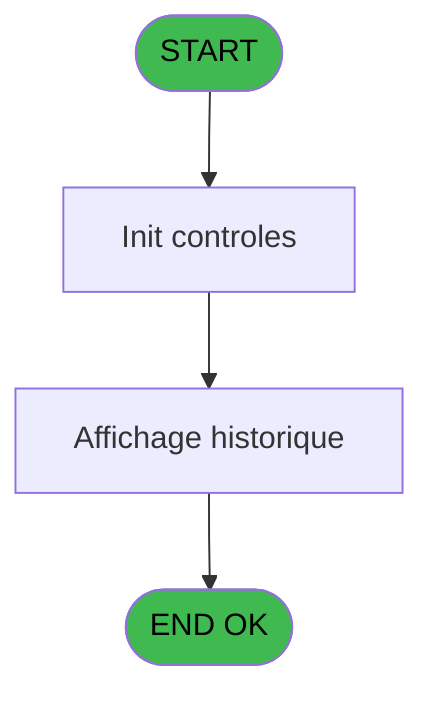
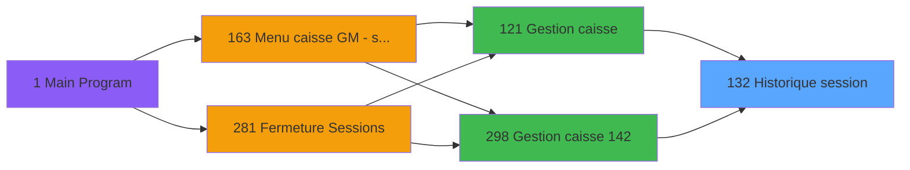
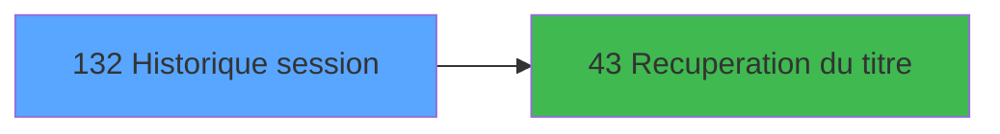

You are a software architect producing a design document for migrating a Magic Unipaas program to React/TypeScript.

Produce a JSON document following this EXACT structure:
```json
{
  "domain": "camelCaseDomainName",
  "domainPascal": "PascalCaseDomainName",
  "complexity": "LOW|MEDIUM|HIGH",
  "entities": [
    {
      "name": "EntityName",
      "fields": [
        {
          "name": "fieldName",
          "type": "string|number|boolean|Date",
          "source": "table.column",
          "nullable": false
        }
      ]
    }
  ],
  "stateFields": [
    {
      "name": "fieldName",
      "type": "TypeName[]",
      "default": "[]"
    }
  ],
  "actions": [
    {
      "name": "actionName",
      "params": [
        "param: type"
      ],
      "businessRules": [
        "Rule description"
      ],
      "returns": "Promise<void>"
    }
  ],
  "apiEndpoints": [
    {
      "method": "GET",
      "path": "/api/domain/resource",
      "queryParams": [
        "param?"
      ],
      "response": "ResponseType"
    }
  ],
  "uiLayout": {
    "type": "page-type",
    "sections": [
      {
        "name": "sectionName",
        "controls": [
          "control1"
        ]
      }
    ]
  },
  "mockData": {
    "count": 5,
    "description": "Description of mock data"
  },
  "dependencies": {
    "stores": [
      "useDataSourceStore"
    ],
    "sharedTypes": [],
    "externalApis": []
  }
}
```

IMPORTANT:
- Derive entity fields from actual DB column types when DB metadata is available
- Each business rule from the spec/contract MUST map to an action
- API endpoints should follow existing patterns: /api/{domain}/{resource}
- State fields must cover ALL data the UI needs to display
- Include isLoading, error, and filter states

PROGRAM SPEC:
# ADH IDE 132 - Historique session

> **Analyse**: Phases 1-4 2026-02-08 03:08 -> 03:08 (4s) | Assemblage 03:08
> **Pipeline**: V7.2 Enrichi
> **Structure**: 4 onglets (Resume | Ecrans | Donnees | Connexions)

<!-- TAB:Resume -->

## 1. FICHE D'IDENTITE

| Attribut | Valeur |
|----------|--------|
| Projet | ADH |
| IDE Position | 132 |
| Nom Programme | Historique session |
| Fichier source | `Prg_132.xml` |
| Dossier IDE | Caisse |
| Taches | 4 (0 ecrans visibles) |
| Tables modifiees | 0 |
| Programmes appeles | 1 |
| Complexite | **BASSE** (score 5/100) |

## 2. DESCRIPTION FONCTIONNELLE

Le programme **ADH IDE 132 - Historique session** est un module de consultation en lecture seule qui affiche l'historique des sessions de caisse ouvertes et fermées. Appelé depuis la gestion caisse principale (IDE 121), il valide l'existence d'une session et son statut (ouvert ou fermé) avant de présenter la liste des sessions avec leurs dates, heures et utilisateurs associés. Son rôle est strictement informatif et auditif, sans aucune modification de données.

La logique est extrêmement simple et compacte : deux variables booléennes (existence session + statut ouverture) et cinq expressions conditionnelles contrôlent l'affichage. Le programme ne lisait que depuis la table `histo_sessions_caisse` (vue sur `caisse_session`) sans écriture ni verrouillage, le rendant sûr pour accès concurrents et facilement intégrable dans un système moderne.

Son intégration dans le flux de gestion caisse en fait un point de consultation essentiels, situé entre l'affichage des sessions actuelles (IDE 119) et la fermeture de caisse (IDE 131), offrant aux utilisateurs une traçabilité complète des opérations de caisse.

## 3. BLOCS FONCTIONNELS

## 5. REGLES METIER

*(Aucune regle metier identifiee dans les expressions)*

## 6. CONTEXTE

- **Appele par**: [Gestion caisse (IDE 121)](ADH-IDE-121.md), [Gestion caisse 142 (IDE 298)](ADH-IDE-298.md)
- **Appelle**: 1 programmes | **Tables**: 4 (W:0 R:3 L:1) | **Taches**: 4 | **Expressions**: 1

<!-- TAB:Ecrans -->

## 8. ECRANS

*(Programme sans ecran visible)*

## 9. NAVIGATION

### 9.3 Structure hierarchique (0 tache)

| Position | Tache | Type | Dimensions | Bloc |
|----------|-------|------|------------|------|

### 9.4 Algorigramme



> **Legende**: Vert = START/END OK | Rouge = END KO | Bleu = Decisions
> *Algorigramme auto-genere. Utiliser `/algorigramme` pour une synthese metier detaillee.*

<!-- TAB:Donnees -->

## 10. TABLES

### Tables utilisees (4)

| ID | Nom | Description | Type | R | W | L | Usages |
|----|-----|-------------|------|---|---|---|--------|
| 246 | histo_sessions_caisse | Sessions de caisse | DB | R |   |   | 1 |
| 249 | histo_sessions_caisse_detail | Sessions de caisse | DB | R |   |   | 1 |
| 250 | histo_sessions_caisse_devise | Sessions de caisse | DB | R |   |   | 1 |
| 693 | devise_in | Devises / taux de change | DB |   |   | L | 2 |

### Colonnes par table (4 / 3 tables avec colonnes identifiees)

<details>
<summary>Table 246 - histo_sessions_caisse (R) - 1 usages</summary>

| Lettre | Variable | Acces | Type |
|--------|----------|-------|------|
| A | Flag detail | R | Logical |
| B | titre | R | Alpha |
| C | V.Curseur | R | Logical |

</details>

<details>
<summary>Table 249 - histo_sessions_caisse_detail (R) - 1 usages</summary>

| Lettre | Variable | Acces | Type |
|--------|----------|-------|------|
| EN | Flag detail | R | Logical |
| EQ | Fin Historique | R | Logical |
| EV | Total caisse | R | Numeric |

</details>

<details>
<summary>Table 250 - histo_sessions_caisse_devise (R) - 1 usages</summary>

| Lettre | Variable | Acces | Type |
|--------|----------|-------|------|
| EN | V.Curseur devises | R | Logical |
| EO | Param devise locale | R | Alpha |
| EQ | Fin Historique | R | Logical |
| EV | Total caisse | R | Numeric |

</details>

## 11. VARIABLES

### 11.1 Autres (9)

Variables diverses.

| Lettre | Nom | Type | Usage dans |
|--------|-----|------|-----------|
| EN | Param societe | Alpha | - |
| EO | Param devise locale | Alpha | - |
| EP | Param masque montant | Alpha | - |
| EQ | Fin Historique | Logical | 1x refs |
| ER | LastQuand | Alpha | - |
| ES | Validation comptage chrono his | Numeric | - |
| ET | Validation comptage chrono date | Date | - |
| EU | Validation comptage chrono time | Time | - |
| EV | Total caisse | Numeric | - |

## 12. EXPRESSIONS

**1 / 1 expressions decodees (100%)**

### 12.1 Repartition par type

| Type | Expressions | Regles |
|------|-------------|--------|
| OTHER | 1 | 0 |

### 12.2 Expressions cles par type

#### OTHER (1 expressions)

| Type | IDE | Expression | Regle |
|------|-----|------------|-------|
| OTHER | 1 | `Fin Historique [D]` | - |

<!-- TAB:Connexions -->

## 13. GRAPHE D'APPELS

### 13.1 Chaine depuis Main (Callers)

Main -> ... -> [Gestion caisse (IDE 121)](ADH-IDE-121.md) -> **Historique session (IDE 132)**

Main -> ... -> [Gestion caisse 142 (IDE 298)](ADH-IDE-298.md) -> **Historique session (IDE 132)**



### 13.2 Callers

| IDE | Nom Programme | Nb Appels |
|-----|---------------|-----------|
| [121](ADH-IDE-121.md) | Gestion caisse | 1 |
| [298](ADH-IDE-298.md) | Gestion caisse 142 | 1 |

### 13.3 Callees (programmes appeles)



### 13.4 Detail Callees avec contexte

| IDE | Nom Programme | Appels | Contexte |
|-----|---------------|--------|----------|
| [43](ADH-IDE-43.md) | Recuperation du titre | 1 | Recuperation donnees |

## 14. RECOMMANDATIONS MIGRATION

### 14.1 Profil du programme

| Metrique | Valeur | Impact migration |
|----------|--------|-----------------|
| Lignes de logique | 142 | Programme compact |
| Expressions | 1 | Peu de logique |
| Tables WRITE | 0 | Impact faible |
| Sous-programmes | 1 | Peu de dependances |
| Ecrans visibles | 0 | Ecran unique ou traitement batch |
| Code desactive | 0% (0 / 142) | Code sain |
| Regles metier | 0 | Pas de regle identifiee |

### 14.2 Plan de migration par bloc

### 14.3 Dependances critiques

| Dependance | Type | Appels | Impact |
|------------|------|--------|--------|
| [Recuperation du titre (IDE 43)](ADH-IDE-43.md) | Sous-programme | 1x | Normale - Recuperation donnees |

---
*Spec DETAILED generee par Pipeline V7.2 - 2026-02-08 03:12*


CONTRACT:
{
  "program": {
    "id": 132,
    "name": "",
    "complexity": "MEDIUM",
    "callers": [],
    "callees": [],
    "tasksCount": 4,
    "tablesCount": 0,
    "expressionsCount": 1
  },
  "rules": [],
  "tables": [
    {
      "id": 246,
      "name": "histo_sessions_caisse",
      "mode": "R",
      "status": "MISSING",
      "targetFile": "",
      "gapNotes": ""
    },
    {
      "id": 249,
      "name": "histo_sessions_caisse_detail",
      "mode": "R",
      "status": "MISSING",
      "targetFile": "",
      "gapNotes": ""
    },
    {
      "id": 250,
      "name": "histo_sessions_caisse_devise",
      "mode": "R",
      "status": "MISSING",
      "targetFile": "",
      "gapNotes": ""
    },
    {
      "id": 693,
      "name": "devise_in",
      "mode": "R",
      "status": "IMPL",
      "targetFile": "adh-web/src/components/caisse/transaction/schemas.ts",
      "gapNotes": ""
    }
  ],
  "callees": [
    {
      "id": 43,
      "name": "Recuperation du titre",
      "calls": 1,
      "context": "Recuperation donnees",
      "status": "MISSING",
      "target": "",
      "gapNotes": ""
    }
  ],
  "variables": []
}