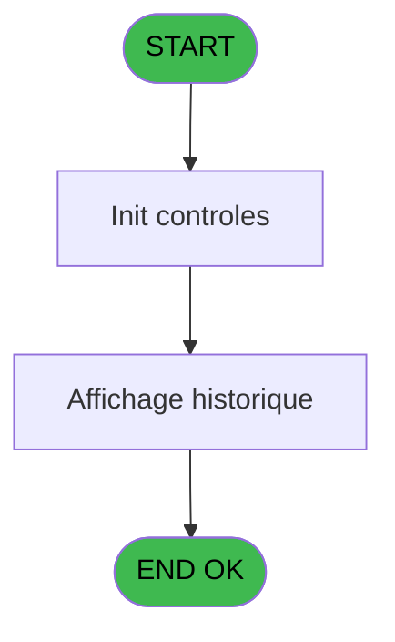
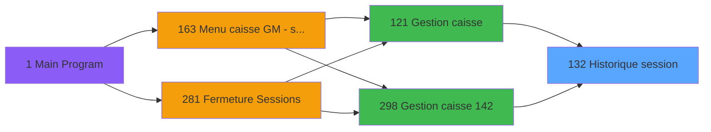

Generate a complete Zustand store for the "sessionHistory" domain.

RULES (MANDATORY):
- Use import aliases: @/ for src root (e.g. @/stores/..., @/types/...)
- NEVER use `any` type - use `unknown` or precise types
- Tailwind v4 classes for styling (no tailwind.config.js)
- Arrow functions everywhere (no function declarations)
- `as const` instead of TypeScript enum
- verbatimModuleSyntax is enabled: use `import type { X }` ONLY for types/interfaces, use `import { X }` for values/consts
- File must be COMPLETE and ready to write - NO placeholders, NO TODOs, NO "// implement here"
- NO comments except for genuinely complex logic
- Output ONLY the code inside a single markdown code block (```typescript ... ``` or ```tsx ... ```)

SHARED INFRASTRUCTURE (use these exact imports):
- Data source toggle: `import { useDataSourceStore } from "@/stores/dataSourceStore"` (has .getState().isRealApi)
- API client: `import { apiClient } from "@/services/api/apiClient"` and `import type { ApiResponse } from "@/services/api/apiClient"`
- Screen layout: `import { ScreenLayout } from "@/components/layout"` (wrapper with sidebar, takes children + className)
- UI components: `import { Button, Dialog, Input } from "@/components/ui"`
- cn utility: `import { cn } from "@/lib/utils"`

STORE REQUIREMENTS:
- Use `create` from zustand (import { create } from "zustand")
- Import types from @/types/sessionHistory
- Import useDataSourceStore from @/stores/dataSourceStore
- Mock/API branching via useDataSourceStore.getState().isRealApi
- try/catch with `e instanceof Error` for error handling
- Realistic mock data (not lorem ipsum)
- EVERY business rule from the analysis MUST be implemented
- Include reset() action to clear state

TYPES FILE (already generated):
import type { ApiResponse } from "@/services/api/apiClient";

export interface SessionHistoryItem {
  sessionId: string;
  openedDate: Date;
  openedTime: string;
  closedDate: Date | null;
  closedTime: string | null;
  operatorId: string;
  status: string;
  hasDetails: boolean;
  title: string | null;
}

export interface SessionDetail {
  sessionId: string;
  totalAmount: number;
  hasDetails: boolean;
  isEndOfHistory: boolean;
}

export interface SessionCurrency {
  sessionId: string;
  currencyCode: string;
  amount: number;
  totalAmount: number;
  isLocalCurrency: boolean;
  isEndOfHistory: boolean;
}

export interface SessionHistoryFilters {
  startDate: Date | null;
  endDate: Date | null;
  status: string | null;
  operatorId: string | null;
}

export type GetSessionHistoryRequest = {
  societe: string;
  startDate?: Date;
  endDate?: Date;
  status?: string;
  operatorId?: string;
};

export type GetSessionHistoryResponse = ApiResponse<SessionHistoryItem[]>;

export type GetSessionDetailsRequest = {
  sessionId: string;
};

export type GetSessionDetailsResponse = ApiResponse<SessionDetail>;

export type GetSessionCurrenciesRequest = {
  sessionId: string;
};

export type GetSessionCurrenciesResponse = ApiResponse<SessionCurrency[]>;

export interface SessionHistoryState {
  sessions: SessionHistoryItem[];
  selectedSessionDetails: SessionDetail | null;
  selectedSessionCurrencies: SessionCurrency[];
  isLoading: boolean;
  error: string | null;
  filters: SessionHistoryFilters;
  societe: string;
  localCurrencyCode: string;
  amountMask: string;

  loadSessions: (
    societe: string,
    filters?: Partial<SessionHistoryFilters>
  ) => Promise<void>;
  loadSessionDetails: (sessionId: string) => Promise<void>;
  loadSessionCurrencies: (sessionId: string) => Promise<void>;
  setFilters: (filters: Partial<SessionHistoryFilters>) => void;
  clearFilters: () => void;
  setSociete: (societe: string) => void;
  setLocalCurrencyCode: (code: string) => void;
  setAmountMask: (mask: string) => void;
  setError: (error: string | null) => void;
}

export type SetSessionFiltersAction = {
  type: 'SET_FILTERS';
  payload: Partial<SessionHistoryFilters>;
};

export type ClearSessionFiltersAction = {
  type: 'CLEAR_FILTERS';
};

export type LoadSessionsAction = {
  type: 'LOAD_SESSIONS';
  payload: SessionHistoryItem[];
};

export type LoadSessionDetailsAction = {
  type: 'LOAD_SESSION_DETAILS';
  payload: SessionDetail;
};

export type LoadSessionCurrenciesAction = {
  type: 'LOAD_SESSION_CURRENCIES';
  payload: SessionCurrency[];
};

export type SessionHistoryAction =
  | SetSessionFiltersAction
  | ClearSessionFiltersAction
  | LoadSessionsAction
  | LoadSessionDetailsAction
  | LoadSessionCurrenciesAction;

ANALYSIS DOCUMENT:
{
  "domain": "sessionHistory",
  "domainPascal": "SessionHistory",
  "complexity": "LOW",
  "entities": [
    {
      "name": "SessionHistoryItem",
      "fields": [
        {
          "name": "sessionId",
          "type": "string",
          "source": "histo_sessions_caisse.session_id",
          "nullable": false
        },
        {
          "name": "openedDate",
          "type": "Date",
          "source": "histo_sessions_caisse.date_ouverture",
          "nullable": false
        },
        {
          "name": "openedTime",
          "type": "string",
          "source": "histo_sessions_caisse.heure_ouverture",
          "nullable": false
        },
        {
          "name": "closedDate",
          "type": "Date",
          "source": "histo_sessions_caisse.date_fermeture",
          "nullable": true
        },
        {
          "name": "closedTime",
          "type": "string",
          "source": "histo_sessions_caisse.heure_fermeture",
          "nullable": true
        },
        {
          "name": "operatorId",
          "type": "string",
          "source": "histo_sessions_caisse.operateur",
          "nullable": false
        },
        {
          "name": "status",
          "type": "string",
          "source": "histo_sessions_caisse.statut",
          "nullable": false
        },
        {
          "name": "hasDetails",
          "type": "boolean",
          "source": "histo_sessions_caisse.flag_detail",
          "nullable": false
        },
        {
          "name": "title",
          "type": "string",
          "source": "histo_sessions_caisse.titre",
          "nullable": true
        }
      ]
    },
    {
      "name": "SessionDetail",
      "fields": [
        {
          "name": "sessionId",
          "type": "string",
          "source": "histo_sessions_caisse_detail.session_id",
          "nullable": false
        },
        {
          "name": "totalAmount",
          "type": "number",
          "source": "histo_sessions_caisse_detail.total_caisse",
          "nullable": false
        },
        {
          "name": "hasDetails",
          "type": "boolean",
          "source": "histo_sessions_caisse_detail.flag_detail",
          "nullable": false
        },
        {
          "name": "isEndOfHistory",
          "type": "boolean",
          "source": "histo_sessions_caisse_detail.fin_historique",
          "nullable": false
        }
      ]
    },
    {
      "name": "SessionCurrency",
      "fields": [
        {
          "name": "sessionId",
          "type": "string",
          "source": "histo_sessions_caisse_devise.session_id",
          "nullable": false
        },
        {
          "name": "currencyCode",
          "type": "string",
          "source": "histo_sessions_caisse_devise.devise_code",
          "nullable": false
        },
        {
          "name": "amount",
          "type": "number",
          "source": "histo_sessions_caisse_devise.montant",
          "nullable": false
        },
        {
          "name": "totalAmount",
          "type": "number",
          "source": "histo_sessions_caisse_devise.total_caisse",
          "nullable": false
        },
        {
          "name": "isLocalCurrency",
          "type": "boolean",
          "source": "histo_sessions_caisse_devise.param_devise_locale",
          "nullable": false
        },
        {
          "name": "isEndOfHistory",
          "type": "boolean",
          "source": "histo_sessions_caisse_devise.fin_historique",
          "nullable": false
        }
      ]
    }
  ],
  "stateFields": [
    {
      "name": "sessions",
      "type": "SessionHistoryItem[]",
      "default": "[]"
    },
    {
      "name": "selectedSessionDetails",
      "type": "SessionDetail | null",
      "default": "null"
    },
    {
      "name": "selectedSessionCurrencies",
      "type": "SessionCurrency[]",
      "default": "[]"
    },
    {
      "name": "isLoading",
      "type": "boolean",
      "default": "false"
    },
    {
      "name": "error",
      "type": "string | null",
      "default": "null"
    },
    {
      "name": "filters",
      "type": "{ startDate: Date | null; endDate: Date | null; status: string | null; operatorId: string | null }",
      "default": "{ startDate: null, endDate: null, status: null, operatorId: null }"
    },
    {
      "name": "societe",
      "type": "string",
      "default": "''"
    },
    {
      "name": "localCurrencyCode",
      "type": "string",
      "default": "''"
    },
    {
      "name": "amountMask",
      "type": "string",
      "default": "''"
    }
  ],
  "actions": [
    {
      "name": "loadSessions",
      "params": [
        "societe: string",
        "filters?: { startDate?: Date; endDate?: Date; status?: string; operatorId?: string }"
      ],
      "businessRules": [
        "Fetch all sessions for the given society",
        "Apply optional filters for date range, status, and operator",
        "Sessions are read-only (no modifications)",
        "Display both open and closed sessions"
      ],
      "returns": "Promise<void>"
    },
    {
      "name": "loadSessionDetails",
      "params": [
        "sessionId: string"
      ],
      "businessRules": [
        "Fetch detailed information for a specific session",
        "Include total amounts and detail flags",
        "Validate session existence before loading details"
      ],
      "returns": "Promise<void>"
    },
    {
      "name": "loadSessionCurrencies",
      "params": [
        "sessionId: string"
      ],
      "businessRules": [
        "Fetch currency breakdown for a specific session",
        "Identify local currency using param_devise_locale",
        "Display amounts per currency with totals"
      ],
      "returns": "Promise<void>"
    },
    {
      "name": "setFilters",
      "params": [
        "filters: { startDate?: Date | null; endDate?: Date | null; status?: string | null; operatorId?: string | null }"
      ],
      "businessRules": [
        "Update filter criteria",
        "Trigger reload of sessions with new filters"
      ],
      "returns": "void"
    },
    {
      "name": "clearFilters",
      "params": [],
      "businessRules": [
        "Reset all filters to default values",
        "Reload sessions without filters"
      ],
      "returns": "void"
    }
  ],
  "apiEndpoints": [
    {
      "method": "GET",
      "path": "/api/caisse/sessions/history",
      "queryParams": [
        "societe",
        "startDate?",
        "endDate?",
        "status?",
        "operatorId?"
      ],
      "response": "SessionHistoryItem[]"
    },
    {
      "method": "GET",
      "path": "/api/caisse/sessions/history/:sessionId/details",
      "queryParams": [],
      "response": "SessionDetail"
    },
    {
      "method": "GET",
      "path": "/api/caisse/sessions/history/:sessionId/currencies",
      "queryParams": [],
      "response": "SessionCurrency[]"
    }
  ],
  "uiLayout": {
    "type": "list-detail-page",
    "sections": [
      {
        "name": "filters",
        "controls": [
          "startDatePicker",
          "endDatePicker",
          "statusSelect",
          "operatorIdInput",
          "applyFiltersButton",
          "clearFiltersButton"
        ]
      },
      {
        "name": "sessionsList",
        "controls": [
          "sessionsDataGrid (columns: sessionId, openedDate, openedTime, closedDate, closedTime, operatorId, status)"
        ]
      },
      {
        "name": "sessionDetails",
        "controls": [
          "detailsPanel (displays selectedSessionDetails)",
          "currenciesDataGrid (displays selectedSessionCurrencies with columns: currencyCode, amount, isLocalCurrency)"
        ]
      }
    ]
  },
  "mockData": {
    "count": 10,
    "description": "10 session history records with mixed open/closed statuses, varying dates over the last 30 days, different operators, and 2-5 currencies per session with amounts between 100-5000"
  },
  "dependencies": {
    "stores": [
      "useDataSourceStore (for societe, localCurrencyCode, amountMask)"
    ],
    "sharedTypes": [
      "Currency (from shared types)"
    ],
    "externalApis": [
      "GET /api/caisse/sessions/history - fetch session history",
      "GET /api/caisse/sessions/history/:sessionId/details - fetch session details",
      "GET /api/caisse/sessions/history/:sessionId/currencies - fetch session currencies"
    ]
  }
}

SPEC EXCERPT (business rules):
# ADH IDE 132 - Historique session

> **Analyse**: Phases 1-4 2026-02-08 03:08 -> 03:08 (4s) | Assemblage 03:08
> **Pipeline**: V7.2 Enrichi
> **Structure**: 4 onglets (Resume | Ecrans | Donnees | Connexions)

<!-- TAB:Resume -->

## 1. FICHE D'IDENTITE

| Attribut | Valeur |
|----------|--------|
| Projet | ADH |
| IDE Position | 132 |
| Nom Programme | Historique session |
| Fichier source | `Prg_132.xml` |
| Dossier IDE | Caisse |
| Taches | 4 (0 ecrans visibles) |
| Tables modifiees | 0 |
| Programmes appeles | 1 |
| Complexite | **BASSE** (score 5/100) |

## 2. DESCRIPTION FONCTIONNELLE

Le programme **ADH IDE 132 - Historique session** est un module de consultation en lecture seule qui affiche l'historique des sessions de caisse ouvertes et fermées. Appelé depuis la gestion caisse principale (IDE 121), il valide l'existence d'une session et son statut (ouvert ou fermé) avant de présenter la liste des sessions avec leurs dates, heures et utilisateurs associés. Son rôle est strictement informatif et auditif, sans aucune modification de données.

La logique est extrêmement simple et compacte : deux variables booléennes (existence session + statut ouverture) et cinq expressions conditionnelles contrôlent l'affichage. Le programme ne lisait que depuis la table `histo_sessions_caisse` (vue sur `caisse_session`) sans écriture ni verrouillage, le rendant sûr pour accès concurrents et facilement intégrable dans un système moderne.

Son intégration dans le flux de gestion caisse en fait un point de consultation essentiels, situé entre l'affichage des sessions actuelles (IDE 119) et la fermeture de caisse (IDE 131), offrant aux utilisateurs une traçabilité complète des opérations de caisse.

## 3. BLOCS FONCTIONNELS

## 5. REGLES METIER

*(Aucune regle metier identifiee dans les expressions)*

## 6. CONTEXTE

- **Appele par**: [Gestion caisse (IDE 121)](ADH-IDE-121.md), [Gestion caisse 142 (IDE 298)](ADH-IDE-298.md)
- **Appelle**: 1 programmes | **Tables**: 4 (W:0 R:3 L:1) | **Taches**: 4 | **Expressions**: 1

<!-- TAB:Ecrans -->

## 8. ECRANS

*(Programme sans ecran visible)*

## 9. NAVIGATION

### 9.3 Structure hierarchique (0 tache)

| Position | Tache | Type | Dimensions | Bloc |
|----------|-------|------|------------|------|

### 9.4 Algorigramme



> **Legende**: Vert = START/END OK | Rouge = END KO | Bleu = Decisions
> *Algorigramme auto-genere. Utiliser `/algorigramme` pour une synthese metier detaillee.*

<!-- TAB:Donnees -->

## 10. TABLES

### Tables utilisees (4)

| ID | Nom | Description | Type | R | W | L | Usages |
|----|-----|-------------|------|---|---|---|--------|
| 246 | histo_sessions_caisse | Sessions de caisse | DB | R |   |   | 1 |
| 249 | histo_sessions_caisse_detail | Sessions de caisse | DB | R |   |   | 1 |
| 250 | histo_sessions_caisse_devise | Sessions de caisse | DB | R |   |   | 1 |
| 693 | devise_in | Devises / taux de change | DB |   |   | L | 2 |

### Colonnes par table (4 / 3 tables avec colonnes identifiees)

<details>
<summary>Table 246 - histo_sessions_caisse (R) - 1 usages</summary>

| Lettre | Variable | Acces | Type |
|--------|----------|-------|------|
| A | Flag detail | R | Logical |
| B | titre | R | Alpha |
| C | V.Curseur | R | Logical |

</details>

<details>
<summary>Table 249 - histo_sessions_caisse_detail (R) - 1 usages</summary>

| Lettre | Variable | Acces | Type |
|--------|----------|-------|------|
| EN | Flag detail | R | Logical |
| EQ | Fin Historique | R | Logical |
| EV | Total caisse | R | Numeric |

</details>

<details>
<summary>Table 250 - histo_sessions_caisse_devise (R) - 1 usages</summary>

| Lettre | Variable | Acces | Type |
|--------|----------|-------|------|
| EN | V.Curseur devises | R | Logical |
| EO | Param devise locale | R | Alpha |
| EQ | Fin Historique | R | Logical |
| EV | Total caisse | R | Numeric |

</details>

## 11. VARIABLES

### 11.1 Autres (9)

Variables diverses.

| Lettre | Nom | Type | Usage dans |
|--------|-----|------|-----------|
| EN | Param societe | Alpha | - |
| EO | Param devise locale | Alpha | - |
| EP | Param masque montant | Alpha | - |
| EQ | Fin Historique | Logical | 1x refs |
| ER | LastQuand | Alpha | - |
| ES | Validation comptage chrono his | Numeric | - |
| ET | Validation comptage chrono date | Date | - |
| EU | Validation comptage chrono time | Time | - |
| EV | Total caisse | Numeric | - |

## 12. EXPRESSIONS

**1 / 1 expressions decodees (100%)**

### 12.1 Repartition par type

| Type | Expressions | Regles |
|------|-------------|--------|
| OTHER | 1 | 0 |

### 12.2 Expressions cles par type

#### OTHER (1 expressions)

| Type | IDE | Expression | Regle |
|------|-----|------------|-------|
| OTHER | 1 | `Fin Historique [D]` | - |

<!-- TAB:Connexions -->

## 13. GRAPHE D'APPELS

### 13.1 Chaine depuis Main (Callers)

Main -> ... -> [Gestion caisse (IDE 121)](ADH-IDE-121.md) -> **Historique session (IDE 132)**

Main -> ... -> [Gestion caisse 142 (IDE 298)](ADH-IDE-298.md) -> **Historique session (IDE 132)**



### 13.2 Callers

| IDE | Nom Programme | Nb Appels |
|-----|---------------|-----------|
| [121](ADH-IDE-121.md) | Gestion caisse | 1 |
| [298](ADH-IDE-298.md) | Gestion caisse 14

REFERENCE PATTERN (follow this exact structure):
```typescript
import { create } from 'zustand';
import type {
  ExtraitAccountInfo,
  ExtraitTransaction,
  ExtraitSummary,
  ExtraitPrintFormat,
} from '@/types/extrait';
import { extraitApi } from '@/services/api/endpoints-lot3';
import { useDataSourceStore } from './dataSourceStore';

interface ExtraitState {
  selectedAccount: ExtraitAccountInfo | null;
  transactions: ExtraitTransaction[];
  summary: ExtraitSummary | null;
  searchResults: ExtraitAccountInfo[];
  isSearching: boolean;
  isLoadingExtrait: boolean;
  isPrinting: boolean;
  error: string | null;
}

interface ExtraitActions {
  searchAccount: (societe: string, query: string) => Promise<void>;
  selectAccount: (account: ExtraitAccountInfo) => void;
  loadExtrait: (
    societe: string,
    codeAdherent: number,
    filiation: number,
    dateDebut?: string,
    dateFin?: string,
  ) => Promise<void>;
  printExtrait: (
    societe: string,
    codeAdherent: number,
    filiation: number,
    format: ExtraitPrintFormat,
  ) => Promise<void>;
  reset: () => void;
}

type ExtraitStore = ExtraitState & ExtraitActions;

const MOCK_ACCOUNTS: ExtraitAccountInfo[] = [
  { societe: 'SOC1', codeAdherent: 1001, filiation: 0, nom: 'DUPONT', prenom: 'Jean', statut: 'normal', hasGiftPass: false },
  { societe: 'SOC1', codeAdherent: 1002, filiation: 0, nom: 'MARTIN', prenom: 'Sophie', statut: 'normal', hasGiftPass: true },
  { societe: 'SOC1', codeAdherent: 1003, filiation: 1, nom: 'DURAND', prenom: 'Pierre', statut: 'bloque', hasGiftPass: false },
];

const MOCK_TRANSACTIONS: ExtraitTransaction[] = [
  { id: 1, date: '2026-02-10', heure: '09:15', libelle: 'Achat boutique', debit: 45.50, credit: 0, solde: -45.50, codeService: 'BTQ', codeImputation: 'IMP01', giftPassFlag: false, nbArticles: 3, status: 'debit', numeroPiece: 'VTE-001', modePaiement: 'CB', caissier: 'MARTIN S.' },
  { id: 2, date: '2026-02-10', heure: '14:30', libelle: 'Credit compte', debit: 0, credit: 200, solde: 154.50, codeService: 'CAI', codeImputation: 'IMP02', giftPassFlag: false, status: 'credit', numeroPiece: 'CRD-042', modePaiement: 'Especes', caissier: 'DUPONT J.' },
  { id: 3, date: '2026-02-09', heure: '12:45', libelle: 'Repas restaurant', libelleSupplementaire: 'Menu du jour', debit: 32.00, credit: 0, solde: 122.50, codeService: 'RST', codeImputation: 'IMP03', giftPassFlag: true, nbArticles: 1, status: 'debit', numeroPiece: 'RST-117', modePaiement: 'GiftPass', caissier: 'MARTIN S.' },
  { id: 4, date: '2026-02-08', heure: '16:00', libelle: 'Annulation vente', debit: 0, credit: 15.00, solde: 154.50, codeService: 'BTQ', codeImputation: 'IMP01', giftPassFlag: false, status: 'annule', numeroPiece: 'ANN-003', modePaiement: 'CB', caissier: 'DUPONT J.', commentaire: 'Erreur de saisie' },
  { id: 5, date: '2026-02-08', heure: '10:20', libelle: 'Regularisation solde', debit: 0, credit: 5.00, solde: 139.50, codeService: 'CAI', codeImputation: 'IMP02', giftPassFlag: false, status: 'regularise', numeroPiece: 'REG-007', modePaiement: 'Interne', caissier: 'ADMIN' },
];

const MOCK_SUMMARY: ExtraitSummary = {
  totalDebit: 77.50,
  totalCredit: 220,
  soldeActuel: 142.50,
  nbTransactions: 5,
};

const initialState: ExtraitState = {
  selectedAccount: null,
  transactions: [],
  summary: null,
  searchResults: [],
  isSearching: false,
  isLoadingExtrait: false,
  isPrinting: false,
  error: null,
};

export const useExtraitStore = create<ExtraitStore>()((set) => ({
  ...initialState,

  searchAccount: async (societe, query) => {
    const { isRealApi } = useDataSourceStore.getState();
    set({ isSearching: true, error: null });

    if (!isRealApi) {
      const filtered = MOCK_ACCOUNTS.filter(
        (a) =>
          a.nom.toLowerCase().includes(query.toLowerCase()) ||
          a.prenom.toLowerCase().includes(query.toLowerCase()) ||
          String(a.codeAdherent).includes(query),
      );
      set({ searchResults: filtered, isSearching: false });
      return;
    }

    try {
      const response = await extraitApi.searchAccount(societe, query);
      set({ searchResults: response.data.data ?? [] });
    } catch (e: unknown) {
      const message = e instanceof Error ? e.message : 'Erreur recherche compte';
      set({ searchResults: [], error: message });
    } finally {
      set({ isSearching: false });
    }
  },

  selectAccount: (account) => {
    set({ selectedAccount: account, transactions: [], summary: null, error: null });
  },

  loadExtrait: async (societe, codeAdherent, filiation, dateDebut, dateFin) => {
    const { isRealApi } = useDataSourceStore.getState();
    set({ isLoadingExtrait: true, error: null });

    if (!isRealApi) {
      set({
        transactions: MOCK_TRANSACTIONS,
        summary: MOCK_SUMMARY,
        isLoadingExtrait: false,
      });
      return;
    }

    try {
      const response = await extraitApi.getExtrait(
        societe,
        codeAdherent,
        filiation,
        dateDebut,
        dateFin,
      );
      const data = response.data.data;
      set({
        transactions: data?.transactions ?? [],
        summary: data?.summary ?? null,
      });
    } catch (e: unknown) {
      const message = e instanceof Error ? e.message : 'Erreur chargement extrait';
      set({ transactions: [], summary: null, error: message });
    } finally {
      set({ isLoadingExtrait: false });
    }
  },

  printExtrait: async (societe, codeAdherent, filiation, format) => {
    const { isRealApi } = useDataSourceStore.getState();
    set({ isPrinting: true, error: null });

    if (!isRealApi) {
      set({ isPrinting: false });
      return;
    }

    try {
      await extraitApi.printExtrait({
        societe,
        codeAdherent,
        filiation,
        format,
      });
    } catch (e: unknown) {
      const message = e instanceof Error ? e.message : 'Erreur impression';
      set({ error: message });
    } finally {
      set({ isPrinting: false });
    }
  },

  reset: () => set({ ...initialState }),
}));

```