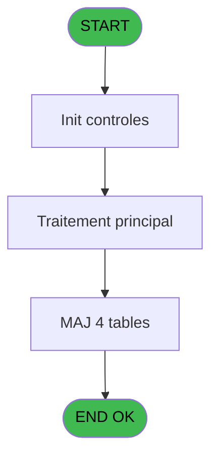

You are a software architect producing a design document for migrating a Magic Unipaas program to React/TypeScript.

Produce a JSON document following this EXACT structure:
```json
{
  "domain": "camelCaseDomainName",
  "domainPascal": "PascalCaseDomainName",
  "complexity": "LOW|MEDIUM|HIGH",
  "entities": [
    {
      "name": "EntityName",
      "fields": [
        {
          "name": "fieldName",
          "type": "string|number|boolean|Date",
          "source": "table.column",
          "nullable": false
        }
      ]
    }
  ],
  "stateFields": [
    {
      "name": "fieldName",
      "type": "TypeName[]",
      "default": "[]"
    }
  ],
  "actions": [
    {
      "name": "actionName",
      "params": [
        "param: type"
      ],
      "businessRules": [
        "Rule description"
      ],
      "returns": "Promise<void>"
    }
  ],
  "apiEndpoints": [
    {
      "method": "GET",
      "path": "/api/domain/resource",
      "queryParams": [
        "param?"
      ],
      "response": "ResponseType"
    }
  ],
  "uiLayout": {
    "type": "page-type",
    "sections": [
      {
        "name": "sectionName",
        "controls": [
          "control1"
        ]
      }
    ]
  },
  "mockData": {
    "count": 5,
    "description": "Description of mock data"
  },
  "dependencies": {
    "stores": [
      "useDataSourceStore"
    ],
    "sharedTypes": [],
    "externalApis": []
  }
}
```

IMPORTANT:
- Derive entity fields from actual DB column types when DB metadata is available
- Each business rule from the spec/contract MUST map to an action
- API endpoints should follow existing patterns: /api/{domain}/{resource}
- State fields must cover ALL data the UI needs to display
- Include isLoading, error, and filter states

PROGRAM SPEC:
# ADH IDE 134 - Mise à jour detail session WS

> **Analyse**: Phases 1-4 2026-02-08 03:12 -> 03:12 (4s) | Assemblage 03:12
> **Pipeline**: V7.2 Enrichi
> **Structure**: 4 onglets (Resume | Ecrans | Donnees | Connexions)

<!-- TAB:Resume -->

## 1. FICHE D'IDENTITE

| Attribut | Valeur |
|----------|--------|
| Projet | ADH |
| IDE Position | 134 |
| Nom Programme | Mise à jour detail session WS |
| Fichier source | `Prg_134.xml` |
| Dossier IDE | Caisse |
| Taches | 18 (0 ecrans visibles) |
| Tables modifiees | 4 |
| Programmes appeles | 0 |
| Complexite | **BASSE** (score 26/100) |

## 2. DESCRIPTION FONCTIONNELLE

Ce programme met à jour les enregistrements de détail dans les quatre tables d'historique de session caisse (`histo_sessions_caisse_article`, `histo_sessions_caisse_detail`, `histo_sessions_caisse_devise`, `histo_sessions_caisse_remise`). Il reçoit en paramètre les identifiants de session et de détail, puis localise et met à jour le bon enregistrement en fonction du type de détail fourni. C'est un programme utilitaire appelé répétitivement lors des opérations de caisse pour journaliser les modifications apportées aux sessions.

Le programme gère quatre catégories de détail : articles vendus, détails de fermeture (comme les écarts de trésorerie), devises échangées, et remises appliquées. Pour chaque type, il cherche le bon enregistrement dans la table correspondante et le met à jour avec les nouvelles valeurs. Cette séparation en quatre tables permet une traçabilité fine de chaque opération caisse et facilite le reporting ultérieur.

Son intégration dans le flux de gestion caisse en fait un maillon critique : chaque appel depuis l'ouverture (IDE 122, 143) ou la fermeture (IDE 131, 144) ou la gestion manuelle (IDE 121, 298) crée ou modifie des traces dans l'historique, formant ainsi un audit trail complet de la session caisse. Les mises à jour sont appliquées directement aux tables sans passer par des vues, garantissant que chaque modification est enregistrée en base.

## 3. BLOCS FONCTIONNELS

## 5. REGLES METIER

6 regles identifiees:

### Autres (6 regles)

#### <a id="rm-RM-001"></a>[RM-001] Condition: Param Type [G] egale 'E'

| Element | Detail |
|---------|--------|
| **Condition** | `Param Type [G]='E'` |
| **Si vrai** | Action si vrai |
| **Variables** | ET (Param Type) |
| **Expression source** | Expression 17 : `Param Type [G]='E'` |
| **Exemple** | Si Param Type [G]='E' → Action si vrai |

#### <a id="rm-RM-002"></a>[RM-002] Condition: Param Nbre devises [N] different de 0

| Element | Detail |
|---------|--------|
| **Condition** | `Param Nbre devises [N]<>0` |
| **Si vrai** | Action si vrai |
| **Variables** | FA (Param Nbre devises) |
| **Expression source** | Expression 18 : `Param Nbre devises [N]<>0` |
| **Exemple** | Si Param Nbre devises [N]<>0 → Action si vrai |

#### <a id="rm-RM-003"></a>[RM-003] Condition: Param Type [G] egale 'V'

| Element | Detail |
|---------|--------|
| **Condition** | `Param Type [G]='V'` |
| **Si vrai** | Action si vrai |
| **Variables** | ET (Param Type) |
| **Expression source** | Expression 19 : `Param Type [G]='V'` |
| **Exemple** | Si Param Type [G]='V' → Action si vrai |

#### <a id="rm-RM-004"></a>[RM-004] Condition: Param Type [G]='V' AND Param montant produits [J] different de 0

| Element | Detail |
|---------|--------|
| **Condition** | `Param Type [G]='V' AND Param montant produits [J]<>0` |
| **Si vrai** | Action si vrai |
| **Variables** | ET (Param Type), EU (Param montant), EW (Param montant produits) |
| **Expression source** | Expression 20 : `Param Type [G]='V' AND Param montant produits [J]<>0` |
| **Exemple** | Si Param Type [G]='V' AND Param montant produits [J]<>0 → Action si vrai |

#### <a id="rm-RM-005"></a>[RM-005] Condition: Param Quand [E]='O' AND Param Type [G] egale 'I'

| Element | Detail |
|---------|--------|
| **Condition** | `Param Quand [E]='O' AND Param Type [G]='I'` |
| **Si vrai** | Action si vrai |
| **Variables** | ER (Param Quand), ET (Param Type) |
| **Expression source** | Expression 21 : `Param Quand [E]='O' AND Param Type [G]='I'` |
| **Exemple** | Si Param Quand [E]='O' AND Param Type [G]='I' → Action si vrai |

#### <a id="rm-RM-006"></a>[RM-006] Si Param ouverture auto [Q] alors 'O' sinon '')

| Element | Detail |
|---------|--------|
| **Condition** | `Param ouverture auto [Q]` |
| **Si vrai** | 'O' |
| **Si faux** | '') |
| **Variables** | FD (Param ouverture auto) |
| **Expression source** | Expression 25 : `IF(Param ouverture auto [Q],'O','')` |
| **Exemple** | Si Param ouverture auto [Q] → 'O'. Sinon → '') |

## 6. CONTEXTE

- **Appele par**: [Fermeture caisse (IDE 131)](ADH-IDE-131.md), [Ouverture caisse (IDE 122)](ADH-IDE-122.md), [Ouverture caisse 143 (IDE 297)](ADH-IDE-297.md), [Fermeture caisse 144 (IDE 299)](ADH-IDE-299.md), [Gestion caisse (IDE 121)](ADH-IDE-121.md), [Gestion caisse 142 (IDE 298)](ADH-IDE-298.md)
- **Appelle**: 0 programmes | **Tables**: 10 (W:4 R:6 L:0) | **Taches**: 18 | **Expressions**: 25

<!-- TAB:Ecrans -->

## 8. ECRANS

*(Programme sans ecran visible)*

## 9. NAVIGATION

### 9.3 Structure hierarchique (0 tache)

| Position | Tache | Type | Dimensions | Bloc |
|----------|-------|------|------------|------|

### 9.4 Algorigramme



> **Legende**: Vert = START/END OK | Rouge = END KO | Bleu = Decisions
> *Algorigramme auto-genere. Utiliser `/algorigramme` pour une synthese metier detaillee.*

<!-- TAB:Donnees -->

## 10. TABLES

### Tables utilisees (10)

| ID | Nom | Description | Type | R | W | L | Usages |
|----|-----|-------------|------|---|---|---|--------|
| 250 | histo_sessions_caisse_devise | Sessions de caisse | DB |   | **W** |   | 4 |
| 247 | histo_sessions_caisse_article | Articles et stock | DB |   | **W** |   | 2 |
| 249 | histo_sessions_caisse_detail | Sessions de caisse | DB |   | **W** |   | 1 |
| 251 | histo_sessions_caisse_remise | Sessions de caisse | DB |   | **W** |   | 1 |
| 196 | gestion_article_session | Articles et stock | DB | R |   |   | 2 |
| 244 | saisie_approvisionnement | Comptage approvisionnement | DB | R |   |   | 2 |
| 232 | gestion_devise_session | Sessions de caisse | DB | R |   |   | 2 |
| 505 | pv_comptable |  | TMP | R |   |   | 1 |
| 139 | moyens_reglement_mor | Reglements / paiements | DB | R |   |   | 1 |
| 50 | moyens_reglement_mor | Reglements / paiements | DB | R |   |   | 1 |

### Colonnes par table (4 / 10 tables avec colonnes identifiees)

<details>
<summary>Table 250 - histo_sessions_caisse_devise (**W**) - 4 usages</summary>

| Lettre | Variable | Acces | Type |
|--------|----------|-------|------|
| EO | Param devise locale | W | Alpha |
| FA | Param Nbre devises | W | Numeric |
| FC | Param commentaire ecart devise | W | Alpha |

</details>

<details>
<summary>Table 247 - histo_sessions_caisse_article (**W**) - 2 usages</summary>

*Table utilisee uniquement en Link ou aucune colonne Real identifiee dans le DataView.*

</details>

<details>
<summary>Table 249 - histo_sessions_caisse_detail (**W**) - 1 usages</summary>

| Lettre | Variable | Acces | Type |
|--------|----------|-------|------|
| A | Param societe | W | Alpha |
| B | Param devise locale | W | Alpha |
| C | Param UNI/BI | W | Alpha |
| D | Param chrono session | W | Numeric |
| E | Param Quand | W | Alpha |
| F | Param Quoi | W | Alpha |
| G | Param Type | W | Alpha |
| H | Param montant | W | Numeric |
| I | Param montant monnaie | W | Numeric |
| J | Param montant produits | W | Numeric |
| K | Param montant cartes | W | Numeric |
| L | Param montant cheques | W | Numeric |
| M | Param montant od | W | Numeric |
| N | Param Nbre devises | W | Numeric |
| O | Param commentaire ecart | W | 

CONTRACT:
{
  "program": {
    "id": 134,
    "name": "Mise a jour detail session WS",
    "complexity": "MOYENNE",
    "callers": [
      131,
      122,
      297,
      299,
      121,
      298
    ],
    "callees": [],
    "tasksCount": 18,
    "tablesCount": 10,
    "expressionsCount": 25
  },
  "rules": [
    {
      "id": "RM-001",
      "description": "Condition Type E - detail type ecarts",
      "condition": "Param Type [G]='E'",
      "variables": [
        "ET (Param Type)"
      ],
      "status": "N/A",
      "targetFile": "",
      "gapNotes": "Backend-only WS - routes detail to histo_sessions_caisse_devise for type E"
    },
    {
      "id": "RM-002",
      "description": "Condition Nbre devises non zero - active devise detail",
      "condition": "Param Nbre devises [N]<>0",
      "variables": [
        "FA (Param Nbre devises)"
      ],
      "status": "N/A",
      "targetFile": "",
      "gapNotes": "Backend-only WS - conditionally writes devise detail rows when devises > 0"
    },
    {
      "id": "RM-003",
      "description": "Condition Type V - detail type ventes",
      "condition": "Param Type [G]='V'",
      "variables": [
        "ET (Param Type)"
      ],
      "status": "N/A",
      "targetFile": "",
      "gapNotes": "Backend-only WS - routes to article session history for sales type V"
    },
    {
      "id": "RM-004",
      "description": "Condition Type V AND montant produits non zero",
      "condition": "Param Type [G]='V' AND Param montant produits [J]<>0",
      "variables": [
        "ET (Param Type)",
        "EU (Param montant)",
        "EW (Param montant produits)"
      ],
      "status": "N/A",
      "targetFile": "",
      "gapNotes": "Backend-only WS - writes article detail when products amount non-zero"
    },
    {
      "id": "RM-005",
      "description": "Condition Quand O AND Type I - ouverture initiale",
      "condition": "Param Quand [E]='O' AND Param Type [G]='I'",
      "variables": [
        "ER (Param Quand)",
        "ET (Param Type)"
      ],
      "status": "N/A",
      "targetFile": "",
      "gapNotes": "Backend-only WS - special handling for initial opening record"
    },
    {
      "id": "RM-006",
      "description": "Si ouverture auto alors O sinon vide",
      "condition": "Param ouverture auto [Q]",
      "variables": [
        "FD (Param ouverture auto)"
      ],
      "status": "N/A",
      "targetFile": "",
      "gapNotes": "Backend-only WS - marks auto-opening flag in histo detail"
    }
  ],
  "tables": [
    {
      "id": 250,
      "name": "histo_sessions_caisse_devise",
      "mode": "W",
      "status": "N/A",
      "targetFile": "",
      "gapNotes": "Backend table write - session devise history"
    },
    {
      "id": 247,
      "name": "histo_sessions_caisse_article",
      "mode": "W",
      "status": "N/A",
      "targetFile": "",
      "gapNotes": "Backend table write - session article history"
    },
    {
      "id": 249,
      "name": "histo_sessions_caisse_detail",
      "mode": "W",
      "status": "N/A",
      "targetFile": "",
      "gapNotes": "Backend table write - session detail history"
    },
    {
      "id": 251,
      "name": "histo_sessions_caisse_remise",
      "mode": "W",
      "status": "N/A",
      "targetFile": "",
      "gapNotes": "Backend table write - session remise history"
    },
    {
      "id": 196,
      "name": "gestion_article_session",
      "mode": "R",
      "status": "N/A",
      "targetFile": "",
      "gapNotes": "Backend table read - article session data"
    },
    {
      "id": 244,
      "name": "saisie_approvisionnement",
      "mode": "R",
      "status": "N/A",
      "targetFile": "",
      "gapNotes": "Backend table read - supply data"
    },
    {
      "id": 232,
      "name": "gestion_devise_session",
      "mode": "R",
      "status": "N/A",
      "targetFile": "",
      "gapNotes": "Backend table read - session devises"
    },
    {
      "id": 505,
      "name": "pv_comptable",
      "mode": "R",
      "status": "N/A",
      "targetFile": "",
      "gapNotes": "Backend temp table read"
    },
    {
      "id": 139,
      "name": "moyens_reglement_mor",
      "mode": "R",
      "status": "N/A",
      "targetFile": "",
      "gapNotes": "Backend table read - payment methods"
    },
    {
      "id": 50,
      "name": "moyens_reglement_mor",
      "mode": "R",
      "status": "N/A",
      "targetFile": "",
      "gapNotes": "Backend table read - payment methods (alt view)"
    }
  ],
  "callees": [],
  "variables": [
    {
      "localId": "EN",
      "name": "Param societe",
      "type": "Parameter",
      "status": "N/A",
      "targetFile": "",
      "gapNotes": "Backend parameter"
    },
    {
      "localId": "EO",
      "name": "Param devise locale",
      "type": "Parameter",
      "status": "N/A",
      "targetFile": "",
      "gapNotes": "Backend parameter"
    },
    {
      "localId": "EP",
      "name": "Param UNI/BI",
      "type": "Parameter",
      "status": "N/A",
      "targetFile": "",
      "gapNotes": "Backend parameter"
    },
    {
      "localId": "EQ",
      "name": "Param chrono session",
      "type": "Parameter",
      "status": "N/A",
      "targetFile": "",
      "gapNotes": "Backend parameter"
    },
    {
      "localId": "ER",
      "name": "Param Quand",
      "type": "Parameter",
      "status": "N/A",
      "targetFile": "",
      "gapNotes": "Backend parameter - O/F context"
    },
    {
      "localId": "ES",
      "name": "Param Quoi",
      "type": "Parameter",
      "status": "N/A",
      "targetFile": "",
      "gapNotes": "Backend parameter"
    },
    {
      "localId": "ET",
      "name": "Param Type",
      "type": "Parameter",
      "status": "N/A",
      "targetFile": "",
      "gapNotes": "Backend parameter - E/V/I routing"
    },
    {
      "localId": "EU",
      "name": "Param montant",
      "type": "Parameter",
      "status": "N/A",
      "targetFile": "",
      "gapNotes": "Backend parameter"
    },
    {
      "localId": "EV",
      "name": "Param montant monnaie",
      "type": "Parameter",
      "status": "N/A",
      "targetFile": "",
      "gapNotes": "Backend parameter"
    },
    {
      "localId": "EW",
      "name": "Param montant produits",
      "type": "Parameter",
      "status": "N/A",
      "targetFile": "",
      "gapNotes": "Backend parameter"
    },
    {
      "localId": "EX",
      "name": "Param montant cartes",
      "type": "Parameter",
      "status": "N/A",
      "targetFile": "",
      "gapNotes": "Backend parameter"
    },
    {
      "localId": "EY",
      "name": "Param montant cheques",
      "type": "Parameter",
      "status": "N/A",
      "targetFile": "",
      "gapNotes": "Backend parameter"
    },
    {
      "localId": "EZ",
      "name": "Param montant od",
      "type": "Parameter",
      "status": "N/A",
      "targetFile": "",
      "gapNotes": "Backend parameter"
    },
    {
      "localId": "FA",
      "name": "Param Nbre devises",
      "type": "Parameter",
      "status": "N/A",
      "targetFile": "",
      "gapNotes": "Backend parameter"
    },
    {
      "localId": "FB",
      "name": "Param commentaire ecart",
      "type": "Parameter",
      "status": "N/A",
      "targetFile": "",
      "gapNotes": "Backend parameter"
    },
    {
      "localId": "FC",
      "name": "Param commentaire ecart devise",
      "type": "Parameter",
      "status": "N/A",
      "targetFile": "",
      "gapNotes": "Backend parameter"
    },
    {
      "localId": "FD",
      "name": "Param ouverture auto",
      "type": "Parameter",
      "status": "N/A",
      "targetFile": "",
      "gapNotes": "Backend parameter"
    }
  ]
}