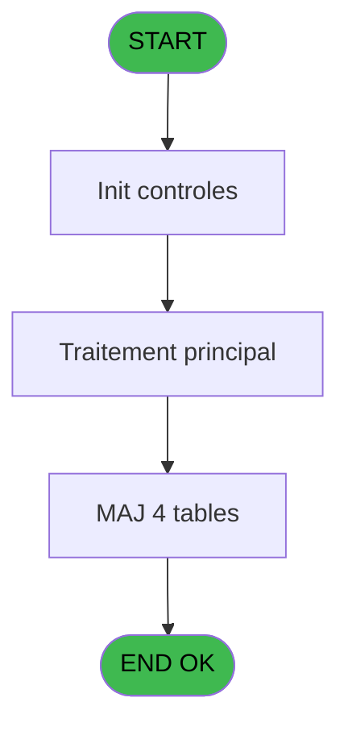

Generate a complete Zustand store for the "sessionDetail" domain.

RULES (MANDATORY):
- Use import aliases: @/ for src root (e.g. @/stores/..., @/types/...)
- NEVER use `any` type - use `unknown` or precise types
- Tailwind v4 classes for styling (no tailwind.config.js)
- Arrow functions everywhere (no function declarations)
- `as const` instead of TypeScript enum
- verbatimModuleSyntax is enabled: use `import type { X }` ONLY for types/interfaces, use `import { X }` for values/consts
- File must be COMPLETE and ready to write - NO placeholders, NO TODOs, NO "// implement here"
- NO comments except for genuinely complex logic
- Output ONLY the code inside a single markdown code block (```typescript ... ``` or ```tsx ... ```)

SHARED INFRASTRUCTURE (use these exact imports):
- Data source toggle: `import { useDataSourceStore } from "@/stores/dataSourceStore"` (has .getState().isRealApi)
- API client: `import { apiClient } from "@/services/api/apiClient"` and `import type { ApiResponse } from "@/services/api/apiClient"`
- Screen layout: `import { ScreenLayout } from "@/components/layout"` (wrapper with sidebar, takes children + className)
- UI components: `import { Button, Dialog, Input } from "@/components/ui"`
- cn utility: `import { cn } from "@/lib/utils"`

STORE REQUIREMENTS:
- Use `create` from zustand (import { create } from "zustand")
- Import types from @/types/sessionDetail
- Import useDataSourceStore from @/stores/dataSourceStore
- Mock/API branching via useDataSourceStore.getState().isRealApi
- try/catch with `e instanceof Error` for error handling
- Realistic mock data (not lorem ipsum)
- EVERY business rule from the analysis MUST be implemented
- Include reset() action to clear state

TYPES FILE (already generated):
import type { ApiResponse } from "@/services/api/apiClient";

export type SessionDetailQuandType = 'O' | 'F';
export type SessionDetailActionType = 'E' | 'V' | 'I';

export interface SessionDetailLog {
  societe: string;
  deviseLocale: string;
  uniBi: string;
  chronoSession: number;
  quand: SessionDetailQuandType;
  quoi: string;
  type: SessionDetailActionType;
  montant: number | null;
  montantMonnaie: number | null;
  montantProduits: number | null;
  montantCartes: number | null;
  montantCheques: number | null;
  montantOd: number | null;
  nbreDevises: number | null;
  commentaireEcart: string | null;
  ouvertureAuto: string | null;
}

export interface LogSessionDetailRequest {
  societe: string;
  deviseLocale: string;
  uniBi: string;
  chronoSession: number;
  quand: SessionDetailQuandType;
  quoi: string;
  type: SessionDetailActionType;
  montant: number;
  montantMonnaie: number;
  montantProduits: number;
  montantCartes: number;
  montantCheques: number;
  montantOd: number;
  nbreDevises: number;
  commentaireEcart: string;
  commentaireEcartDevise: string;
  ouvertureAuto: boolean;
}

export type LogSessionDetailResponse = ApiResponse<void>;

export interface SessionDetailState {
  isLoading: boolean;
  error: string | null;
}

export interface SessionDetailActions {
  logSessionDetail: (request: LogSessionDetailRequest) => Promise<void>;
  setLoading: (loading: boolean) => void;
  setError: (error: string | null) => void;
  reset: () => void;
}

export type SessionDetailStore = SessionDetailState & SessionDetailActions;

ANALYSIS DOCUMENT:
{
  "domain": "sessionDetail",
  "domainPascal": "SessionDetail",
  "complexity": "LOW",
  "entities": [
    {
      "name": "SessionDetailLog",
      "fields": [
        {
          "name": "societe",
          "type": "string",
          "source": "histo_sessions_caisse_detail.societe",
          "nullable": false
        },
        {
          "name": "deviseLocale",
          "type": "string",
          "source": "histo_sessions_caisse_detail.devise_locale",
          "nullable": false
        },
        {
          "name": "uniBi",
          "type": "string",
          "source": "histo_sessions_caisse_detail.uni_bi",
          "nullable": false
        },
        {
          "name": "chronoSession",
          "type": "number",
          "source": "histo_sessions_caisse_detail.chrono_session",
          "nullable": false
        },
        {
          "name": "quand",
          "type": "string",
          "source": "histo_sessions_caisse_detail.quand",
          "nullable": false
        },
        {
          "name": "quoi",
          "type": "string",
          "source": "histo_sessions_caisse_detail.quoi",
          "nullable": false
        },
        {
          "name": "type",
          "type": "string",
          "source": "histo_sessions_caisse_detail.type",
          "nullable": false
        },
        {
          "name": "montant",
          "type": "number",
          "source": "histo_sessions_caisse_detail.montant",
          "nullable": true
        },
        {
          "name": "montantMonnaie",
          "type": "number",
          "source": "histo_sessions_caisse_detail.montant_monnaie",
          "nullable": true
        },
        {
          "name": "montantProduits",
          "type": "number",
          "source": "histo_sessions_caisse_detail.montant_produits",
          "nullable": true
        },
        {
          "name": "montantCartes",
          "type": "number",
          "source": "histo_sessions_caisse_detail.montant_cartes",
          "nullable": true
        },
        {
          "name": "montantCheques",
          "type": "number",
          "source": "histo_sessions_caisse_detail.montant_cheques",
          "nullable": true
        },
        {
          "name": "montantOd",
          "type": "number",
          "source": "histo_sessions_caisse_detail.montant_od",
          "nullable": true
        },
        {
          "name": "nbreDevises",
          "type": "number",
          "source": "histo_sessions_caisse_detail.nbre_devises",
          "nullable": true
        },
        {
          "name": "commentaireEcart",
          "type": "string",
          "source": "histo_sessions_caisse_detail.commentaire_ecart",
          "nullable": true
        },
        {
          "name": "ouvertureAuto",
          "type": "string",
          "source": "histo_sessions_caisse_detail.ouverture_auto",
          "nullable": true
        }
      ]
    }
  ],
  "stateFields": [],
  "actions": [
    {
      "name": "logSessionDetail",
      "params": [
        "societe: string",
        "deviseLocale: string",
        "uniBi: string",
        "chronoSession: number",
        "quand: 'O'|'F'",
        "quoi: string",
        "type: 'E'|'V'|'I'",
        "montant: number",
        "montantMonnaie: number",
        "montantProduits: number",
        "montantCartes: number",
        "montantCheques: number",
        "montantOd: number",
        "nbreDevises: number",
        "commentaireEcart: string",
        "commentaireEcartDevise: string",
        "ouvertureAuto: boolean"
      ],
      "businessRules": [
        "RM-001: If type='E' → write to histo_sessions_caisse_devise",
        "RM-002: If nbreDevises>0 → write devise detail rows",
        "RM-003: If type='V' → write to histo_sessions_caisse_article",
        "RM-004: If type='V' AND montantProduits>0 → write article detail",
        "RM-005: If quand='O' AND type='I' → mark as initial opening",
        "RM-006: ouvertureAuto → set to 'O' else empty string"
      ],
      "returns": "Promise<void>"
    }
  ],
  "apiEndpoints": [
    {
      "method": "POST",
      "path": "/api/session-detail/log",
      "queryParams": [],
      "response": "void"
    }
  ],
  "uiLayout": {
    "type": "backend-only",
    "sections": []
  },
  "mockData": {
    "count": 0,
    "description": "Backend-only WS - no UI mock data required"
  },
  "dependencies": {
    "stores": [],
    "sharedTypes": [
      "SessionDetailType"
    ],
    "externalApis": []
  }
}

SPEC EXCERPT (business rules):
# ADH IDE 134 - Mise à jour detail session WS

> **Analyse**: Phases 1-4 2026-02-08 03:12 -> 03:12 (4s) | Assemblage 03:12
> **Pipeline**: V7.2 Enrichi
> **Structure**: 4 onglets (Resume | Ecrans | Donnees | Connexions)

<!-- TAB:Resume -->

## 1. FICHE D'IDENTITE

| Attribut | Valeur |
|----------|--------|
| Projet | ADH |
| IDE Position | 134 |
| Nom Programme | Mise à jour detail session WS |
| Fichier source | `Prg_134.xml` |
| Dossier IDE | Caisse |
| Taches | 18 (0 ecrans visibles) |
| Tables modifiees | 4 |
| Programmes appeles | 0 |
| Complexite | **BASSE** (score 26/100) |

## 2. DESCRIPTION FONCTIONNELLE

Ce programme met à jour les enregistrements de détail dans les quatre tables d'historique de session caisse (`histo_sessions_caisse_article`, `histo_sessions_caisse_detail`, `histo_sessions_caisse_devise`, `histo_sessions_caisse_remise`). Il reçoit en paramètre les identifiants de session et de détail, puis localise et met à jour le bon enregistrement en fonction du type de détail fourni. C'est un programme utilitaire appelé répétitivement lors des opérations de caisse pour journaliser les modifications apportées aux sessions.

Le programme gère quatre catégories de détail : articles vendus, détails de fermeture (comme les écarts de trésorerie), devises échangées, et remises appliquées. Pour chaque type, il cherche le bon enregistrement dans la table correspondante et le met à jour avec les nouvelles valeurs. Cette séparation en quatre tables permet une traçabilité fine de chaque opération caisse et facilite le reporting ultérieur.

Son intégration dans le flux de gestion caisse en fait un maillon critique : chaque appel depuis l'ouverture (IDE 122, 143) ou la fermeture (IDE 131, 144) ou la gestion manuelle (IDE 121, 298) crée ou modifie des traces dans l'historique, formant ainsi un audit trail complet de la session caisse. Les mises à jour sont appliquées directement aux tables sans passer par des vues, garantissant que chaque modification est enregistrée en base.

## 3. BLOCS FONCTIONNELS

## 5. REGLES METIER

6 regles identifiees:

### Autres (6 regles)

#### <a id="rm-RM-001"></a>[RM-001] Condition: Param Type [G] egale 'E'

| Element | Detail |
|---------|--------|
| **Condition** | `Param Type [G]='E'` |
| **Si vrai** | Action si vrai |
| **Variables** | ET (Param Type) |
| **Expression source** | Expression 17 : `Param Type [G]='E'` |
| **Exemple** | Si Param Type [G]='E' → Action si vrai |

#### <a id="rm-RM-002"></a>[RM-002] Condition: Param Nbre devises [N] different de 0

| Element | Detail |
|---------|--------|
| **Condition** | `Param Nbre devises [N]<>0` |
| **Si vrai** | Action si vrai |
| **Variables** | FA (Param Nbre devises) |
| **Expression source** | Expression 18 : `Param Nbre devises [N]<>0` |
| **Exemple** | Si Param Nbre devises [N]<>0 → Action si vrai |

#### <a id="rm-RM-003"></a>[RM-003] Condition: Param Type [G] egale 'V'

| Element | Detail |
|---------|--------|
| **Condition** | `Param Type [G]='V'` |
| **Si vrai** | Action si vrai |
| **Variables** | ET (Param Type) |
| **Expression source** | Expression 19 : `Param Type [G]='V'` |
| **Exemple** | Si Param Type [G]='V' → Action si vrai |

#### <a id="rm-RM-004"></a>[RM-004] Condition: Param Type [G]='V' AND Param montant produits [J] different de 0

| Element | Detail |
|---------|--------|
| **Condition** | `Param Type [G]='V' AND Param montant produits [J]<>0` |
| **Si vrai** | Action si vrai |
| **Variables** | ET (Param Type), EU (Param montant), EW (Param montant produits) |
| **Expression source** | Expression 20 : `Param Type [G]='V' AND Param montant produits [J]<>0` |
| **Exemple** | Si Param Type [G]='V' AND Param montant produits [J]<>0 → Action si vrai |

#### <a id="rm-RM-005"></a>[RM-005] Condition: Param Quand [E]='O' AND Param Type [G] egale 'I'

| Element | Detail |
|---------|--------|
| **Condition** | `Param Quand [E]='O' AND Param Type [G]='I'` |
| **Si vrai** | Action si vrai |
| **Variables** | ER (Param Quand), ET (Param Type) |
| **Expression source** | Expression 21 : `Param Quand [E]='O' AND Param Type [G]='I'` |
| **Exemple** | Si Param Quand [E]='O' AND Param Type [G]='I' → Action si vrai |

#### <a id="rm-RM-006"></a>[RM-006] Si Param ouverture auto [Q] alors 'O' sinon '')

| Element | Detail |
|---------|--------|
| **Condition** | `Param ouverture auto [Q]` |
| **Si vrai** | 'O' |
| **Si faux** | '') |
| **Variables** | FD (Param ouverture auto) |
| **Expression source** | Expression 25 : `IF(Param ouverture auto [Q],'O','')` |
| **Exemple** | Si Param ouverture auto [Q] → 'O'. Sinon → '') |

## 6. CONTEXTE

- **Appele par**: [Fermeture caisse (IDE 131)](ADH-IDE-131.md), [Ouverture caisse (IDE 122)](ADH-IDE-122.md), [Ouverture caisse 143 (IDE 297)](ADH-IDE-297.md), [Fermeture caisse 144 (IDE 299)](ADH-IDE-299.md), [Gestion caisse (IDE 121)](ADH-IDE-121.md), [Gestion caisse 142 (IDE 298)](ADH-IDE-298.md)
- **Appelle**: 0 programmes | **Tables**: 10 (W:4 R:6 L:0) | **Taches**: 18 | **Expressions**: 25

<!-- TAB:Ecrans -->

## 8. ECRANS

*(Programme sans ecran visible)*

## 9. NAVIGATION

### 9.3 Structure hierarchique (0 tache)

| Position | Tache | Type | Dimensions | Bloc |
|----------|-------|------|------------|------|

### 9.4 Algorigramme



> **Legende**: Vert = START/END OK | Rouge = END KO | Bleu = Decisions
> *Algorigramme auto-genere. Utiliser `/algorigramme` pour une synthese metier detaillee.*

<!-- TAB:Donnees -->

## 10. TABLES

### Tables utilisees (10)

| ID | Nom | Description | Type | R | W | L | Usages |
|----|-----|-------------|------|---|---|---|--------|
| 250 | histo_sessions_caisse_devise | Sessions de caisse | DB |   | **W** |   | 4 

REFERENCE PATTERN (follow this exact structure):
```typescript
import { create } from 'zustand';
import type {
  ExtraitAccountInfo,
  ExtraitTransaction,
  ExtraitSummary,
  ExtraitPrintFormat,
} from '@/types/extrait';
import { extraitApi } from '@/services/api/endpoints-lot3';
import { useDataSourceStore } from './dataSourceStore';

interface ExtraitState {
  selectedAccount: ExtraitAccountInfo | null;
  transactions: ExtraitTransaction[];
  summary: ExtraitSummary | null;
  searchResults: ExtraitAccountInfo[];
  isSearching: boolean;
  isLoadingExtrait: boolean;
  isPrinting: boolean;
  error: string | null;
}

interface ExtraitActions {
  searchAccount: (societe: string, query: string) => Promise<void>;
  selectAccount: (account: ExtraitAccountInfo) => void;
  loadExtrait: (
    societe: string,
    codeAdherent: number,
    filiation: number,
    dateDebut?: string,
    dateFin?: string,
  ) => Promise<void>;
  printExtrait: (
    societe: string,
    codeAdherent: number,
    filiation: number,
    format: ExtraitPrintFormat,
  ) => Promise<void>;
  reset: () => void;
}

type ExtraitStore = ExtraitState & ExtraitActions;

const MOCK_ACCOUNTS: ExtraitAccountInfo[] = [
  { societe: 'SOC1', codeAdherent: 1001, filiation: 0, nom: 'DUPONT', prenom: 'Jean', statut: 'normal', hasGiftPass: false },
  { societe: 'SOC1', codeAdherent: 1002, filiation: 0, nom: 'MARTIN', prenom: 'Sophie', statut: 'normal', hasGiftPass: true },
  { societe: 'SOC1', codeAdherent: 1003, filiation: 1, nom: 'DURAND', prenom: 'Pierre', statut: 'bloque', hasGiftPass: false },
];

const MOCK_TRANSACTIONS: ExtraitTransaction[] = [
  { id: 1, date: '2026-02-10', heure: '09:15', libelle: 'Achat boutique', debit: 45.50, credit: 0, solde: -45.50, codeService: 'BTQ', codeImputation: 'IMP01', giftPassFlag: false, nbArticles: 3, status: 'debit', numeroPiece: 'VTE-001', modePaiement: 'CB', caissier: 'MARTIN S.' },
  { id: 2, date: '2026-02-10', heure: '14:30', libelle: 'Credit compte', debit: 0, credit: 200, solde: 154.50, codeService: 'CAI', codeImputation: 'IMP02', giftPassFlag: false, status: 'credit', numeroPiece: 'CRD-042', modePaiement: 'Especes', caissier: 'DUPONT J.' },
  { id: 3, date: '2026-02-09', heure: '12:45', libelle: 'Repas restaurant', libelleSupplementaire: 'Menu du jour', debit: 32.00, credit: 0, solde: 122.50, codeService: 'RST', codeImputation: 'IMP03', giftPassFlag: true, nbArticles: 1, status: 'debit', numeroPiece: 'RST-117', modePaiement: 'GiftPass', caissier: 'MARTIN S.' },
  { id: 4, date: '2026-02-08', heure: '16:00', libelle: 'Annulation vente', debit: 0, credit: 15.00, solde: 154.50, codeService: 'BTQ', codeImputation: 'IMP01', giftPassFlag: false, status: 'annule', numeroPiece: 'ANN-003', modePaiement: 'CB', caissier: 'DUPONT J.', commentaire: 'Erreur de saisie' },
  { id: 5, date: '2026-02-08', heure: '10:20', libelle: 'Regularisation solde', debit: 0, credit: 5.00, solde: 139.50, codeService: 'CAI', codeImputation: 'IMP02', giftPassFlag: false, status: 'regularise', numeroPiece: 'REG-007', modePaiement: 'Interne', caissier: 'ADMIN' },
];

const MOCK_SUMMARY: ExtraitSummary = {
  totalDebit: 77.50,
  totalCredit: 220,
  soldeActuel: 142.50,
  nbTransactions: 5,
};

const initialState: ExtraitState = {
  selectedAccount: null,
  transactions: [],
  summary: null,
  searchResults: [],
  isSearching: false,
  isLoadingExtrait: false,
  isPrinting: false,
  error: null,
};

export const useExtraitStore = create<ExtraitStore>()((set) => ({
  ...initialState,

  searchAccount: async (societe, query) => {
    const { isRealApi } = useDataSourceStore.getState();
    set({ isSearching: true, error: null });

    if (!isRealApi) {
      const filtered = MOCK_ACCOUNTS.filter(
        (a) =>
          a.nom.toLowerCase().includes(query.toLowerCase()) ||
          a.prenom.toLowerCase().includes(query.toLowerCase()) ||
          String(a.codeAdherent).includes(query),
      );
      set({ searchResults: filtered, isSearching: false });
      return;
    }

    try {
      const response = await extraitApi.searchAccount(societe, query);
      set({ searchResults: response.data.data ?? [] });
    } catch (e: unknown) {
      const message = e instanceof Error ? e.message : 'Erreur recherche compte';
      set({ searchResults: [], error: message });
    } finally {
      set({ isSearching: false });
    }
  },

  selectAccount: (account) => {
    set({ selectedAccount: account, transactions: [], summary: null, error: null });
  },

  loadExtrait: async (societe, codeAdherent, filiation, dateDebut, dateFin) => {
    const { isRealApi } = useDataSourceStore.getState();
    set({ isLoadingExtrait: true, error: null });

    if (!isRealApi) {
      set({
        transactions: MOCK_TRANSACTIONS,
        summary: MOCK_SUMMARY,
        isLoadingExtrait: false,
      });
      return;
    }

    try {
      const response = await extraitApi.getExtrait(
        societe,
        codeAdherent,
        filiation,
        dateDebut,
        dateFin,
      );
      const data = response.data.data;
      set({
        transactions: data?.transactions ?? [],
        summary: data?.summary ?? null,
      });
    } catch (e: unknown) {
      const message = e instanceof Error ? e.message : 'Erreur chargement extrait';
      set({ transactions: [], summary: null, error: message });
    } finally {
      set({ isLoadingExtrait: false });
    }
  },

  printExtrait: async (societe, codeAdherent, filiation, format) => {
    const { isRealApi } = useDataSourceStore.getState();
    set({ isPrinting: true, error: null });

    if (!isRealApi) {
      set({ isPrinting: false });
      return;
    }

    try {
      await extraitApi.printExtrait({
        societe,
        codeAdherent,
        filiation,
        format,
      });
    } catch (e: unknown) {
      const message = e instanceof Error ? e.message : 'Erreur impression';
      set({ error: message });
    } finally {
      set({ isPrinting: false });
    }
  },

  reset: () => set({ ...initialState }),
}));

```