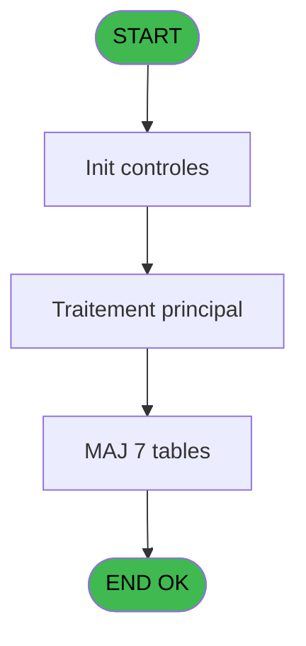

You are a software architect producing a design document for migrating a Magic Unipaas program to React/TypeScript.

Produce a JSON document following this EXACT structure:
```json
{
  "domain": "camelCaseDomainName",
  "domainPascal": "PascalCaseDomainName",
  "complexity": "LOW|MEDIUM|HIGH",
  "entities": [
    {
      "name": "EntityName",
      "fields": [
        {
          "name": "fieldName",
          "type": "string|number|boolean|Date",
          "source": "table.column",
          "nullable": false
        }
      ]
    }
  ],
  "stateFields": [
    {
      "name": "fieldName",
      "type": "TypeName[]",
      "default": "[]"
    }
  ],
  "actions": [
    {
      "name": "actionName",
      "params": [
        "param: type"
      ],
      "businessRules": [
        "Rule description"
      ],
      "returns": "Promise<void>"
    }
  ],
  "apiEndpoints": [
    {
      "method": "GET",
      "path": "/api/domain/resource",
      "queryParams": [
        "param?"
      ],
      "response": "ResponseType"
    }
  ],
  "uiLayout": {
    "type": "page-type",
    "sections": [
      {
        "name": "sectionName",
        "controls": [
          "control1"
        ]
      }
    ]
  },
  "mockData": {
    "count": 5,
    "description": "Description of mock data"
  },
  "dependencies": {
    "stores": [
      "useDataSourceStore"
    ],
    "sharedTypes": [],
    "externalApis": []
  }
}
```

IMPORTANT:
- Derive entity fields from actual DB column types when DB metadata is available
- Each business rule from the spec/contract MUST map to an action
- API endpoints should follow existing patterns: /api/{domain}/{resource}
- State fields must cover ALL data the UI needs to display
- Include isLoading, error, and filter states

PROGRAM SPEC:
# ADH IDE 155 - Controle fermeture caisse WS

> **Analyse**: Phases 1-4 2026-02-08 03:39 -> 03:39 (4s) | Assemblage 03:39
> **Pipeline**: V7.2 Enrichi
> **Structure**: 4 onglets (Resume | Ecrans | Donnees | Connexions)

<!-- TAB:Resume -->

## 1. FICHE D'IDENTITE

| Attribut | Valeur |
|----------|--------|
| Projet | ADH |
| IDE Position | 155 |
| Nom Programme | Controle fermeture caisse WS |
| Fichier source | `Prg_155.xml` |
| Dossier IDE | Caisse |
| Taches | 147 (0 ecrans visibles) |
| Tables modifiees | 7 |
| Programmes appeles | 3 |
| Complexite | **MOYENNE** (score 45/100) |

## 2. DESCRIPTION FONCTIONNELLE

ADH IDE 155 effectue le contrôle de fermeture de la caisse en validant l'intégrité des données de session. Le programme reçoit les paramètres de fermeture (devise, montants, écarts) et vérifie la cohérence entre les déclarations des opérateurs et les mouvements enregistrés. Il appelle le programme IDE 135 pour générer le tableau récapitulatif des ventes, puis IDE 142 pour mettre à jour les devises de session avec les soldes finaux déclarés.

Le programme gère les écarts détectés lors de la fermeture en calculant les différences entre comptage physique et soldes attendus. Il utilise IDE 152 pour récupérer les classes de moyens de paiement et leurs libellés, afin de présenter un détail complet des écarts par type de paiement. Ces vérifications permettent de détecter les erreurs de saisie ou les mouvements non enregistrés avant de finaliser la session.

Une fois les contrôles validés, ADH IDE 155 met à jour les tables de fermeture (histo_sessions_caisse, pv_comptable, pv_discounts) et enregistre les pointages finaux (pointage_devise, pointage_article, pointage_appro_remise). Le programme produit également un historique complet de la session pour traçabilité, incluant tous les écarts détectés et les corrections appliquées.

## 3. BLOCS FONCTIONNELS

## 5. REGLES METIER

6 regles identifiees:

### Autres (6 regles)

#### <a id="rm-RM-001"></a>[RM-001] Condition: Param UNI/BI [O] egale 'B'

| Element | Detail |
|---------|--------|
| **Condition** | `Param UNI/BI [O]='B'` |
| **Si vrai** | Action si vrai |
| **Variables** | FB (Param UNI/BI) |
| **Expression source** | Expression 1 : `Param UNI/BI [O]='B'` |
| **Exemple** | Si Param UNI/BI [O]='B' → Action si vrai |

#### <a id="rm-RM-002"></a>[RM-002] Condition composite: V parametre 2 caisses [V]='O' AND (p.i.Host courant coffr... [R] AND NOT Param session ouverte ... [S] OR [BQ] AND Param session ouverte ... [S])

| Element | Detail |
|---------|--------|
| **Condition** | `V parametre 2 caisses [V]='O' AND (p.i.Host courant coffr... [R] AND NOT Param session ouverte ... [S] OR [BQ] AND Param session ouverte ... [S])` |
| **Si vrai** | Action si vrai |
| **Variables** | FI (V parametre 2 caisses) |
| **Expression source** | Expression 2 : `V parametre 2 caisses [V]='O' AND (p.i.Host courant coffr...` |
| **Exemple** | Si V parametre 2 caisses [V]='O' AND (p.i.Host courant coffr... [R] AND NOT Param session ouverte ... [S] OR [BQ] AND Param session ouverte ... [S]) → Action si vrai |

#### <a id="rm-RM-003"></a>[RM-003] Condition: Param K/T [A] egale 'K'

| Element | Detail |
|---------|--------|
| **Condition** | `Param K/T [A]='K'` |
| **Si vrai** | Action si vrai |
| **Variables** | EN (Param K/T) |
| **Expression source** | Expression 3 : `Param K/T [A]='K'` |
| **Exemple** | Si Param K/T [A]='K' → Action si vrai |

#### <a id="rm-RM-004"></a>[RM-004] Condition: Param K/T [A] egale 'T'

| Element | Detail |
|---------|--------|
| **Condition** | `Param K/T [A]='T'` |
| **Si vrai** | Action si vrai |
| **Variables** | EN (Param K/T) |
| **Expression source** | Expression 4 : `Param K/T [A]='T'` |
| **Exemple** | Si Param K/T [A]='T' → Action si vrai |

#### <a id="rm-RM-005"></a>[RM-005] Si VG78 alors Val([BO] sinon '3')=p.i.Terminal coffre2 [P], [BP]=p.i.Hostname coffre2 [Q])

| Element | Detail |
|---------|--------|
| **Condition** | `VG78` |
| **Si vrai** | Val([BO] |
| **Si faux** | '3')=p.i.Terminal coffre2 [P], [BP]=p.i.Hostname coffre2 [Q]) |
| **Variables** | FC (p.i.Terminal coffre2), FD (p.i.Hostname coffre2) |
| **Expression source** | Expression 12 : `IF(VG78, Val([BO], '3')=p.i.Terminal coffre2 [P], [BP]=p.i.H` |
| **Exemple** | Si VG78 → Val([BO] |

#### <a id="rm-RM-006"></a>[RM-006] Negation de VG78 (condition inversee)

| Element | Detail |
|---------|--------|
| **Condition** | `NOT VG78` |
| **Si vrai** | Action si vrai |
| **Expression source** | Expression 13 : `NOT VG78` |
| **Exemple** | Si NOT VG78 → Action si vrai |

## 6. CONTEXTE

- **Appele par**: [Fermeture caisse (IDE 131)](ADH-IDE-131.md), [Gestion caisse 142 (IDE 298)](ADH-IDE-298.md), [Fermeture caisse 144 (IDE 299)](ADH-IDE-299.md), [Gestion caisse (IDE 121)](ADH-IDE-121.md)
- **Appelle**: 3 programmes | **Tables**: 21 (W:7 R:13 L:12) | **Taches**: 147 | **Expressions**: 14

<!-- TAB:Ecrans -->

## 8. ECRANS

*(Programme sans ecran visible)*

## 9. NAVIGATION

### 9.3 Structure hierarchique (0 tache)

| Position | Tache | Type | Dimensions | Bloc |
|----------|-------|------|------------|------|

### 9.4 Algorigramme



> **Legende**: Vert = START/END OK | Rouge = END KO | Bleu = Decisions
> *Algorigramme auto-genere. Utiliser `/algorigramme` pour une synthese metier detaillee.*

<!-- TAB:Donnees -->

## 10. TABLES

### Tables utilisees (21)

| ID | Nom | Description | Type | R | W | L | Usages |
|----|-----|-------------|------|---|---|---|--------|
| 243 | pointage_devise | Devises / taux de change | DB | R | **W** | L | 22 |
| 242 | pointage_article | Articles et stock | DB | R | **W** | L | 18 |
| 241 | pointage_appro_remise |  | DB | R | **W** | L | 18 |
| 246 | histo_sessions_caisse | Sessions de caisse | DB | R | **W** |   | 19 |
| 232 | gestion_devise_session | Sessions de caisse | DB | R | **W** |   | 7 |
| 505 | pv_comptable |  | TMP |   | **W** | L | 6 |
| 510 | pv_discounts |  | TMP |   | **W** |   | 1 |
| 249 | histo_sessions_caisse_detail | Sessions de caisse | DB | R |   | L | 25 |
| 250 | histo_sessions_caisse_devise | Sessions de caisse | DB | R |   | L | 11 |
| 90 | devises__________dev | Devises / taux de change | DB | R |   |   | 4 |
| 31 | gm-complet_______gmc |  | DB | R |   |   | 4 |
| 251 | histo_sessions_caisse_remise | Sessions de caisse | DB | R |   |   | 1 |
| 44 | change___________chg |  | DB | R |   |   | 1 |
| 147 | change_vente_____chg | Donnees de ventes | DB | R |   |   | 1 |
| 697 | droits_applications | Droits operateur | DB | R |   |   | 1 |
| 248 | sessions_coffre2 | Sessions de caisse | DB |   |   | L | 5 |
| 40 | comptable________cte |  | DB |   |   | L | 3 |
| 247 | histo_sessions_caisse_article | Articles et stock | DB |   |   | L | 2 |
| 197 | articles_en_stock | Articles et stock | DB |   |   | L | 2 |
| 77 | articles_________art | Articles et stock | DB |   |   | L | 2 |
| 263 | vente | Donnees de ventes | DB |   |   | L | 1 |

### Colonnes par table (15 / 15 tables avec colonnes identifiees)

<details>
<summary>Table 243 - pointage_devise (R/**W**/L) - 22 usages</summary>

| Lettre | Variable | Acces | Type |
|--------|----------|-------|------|
| EN | Fin pointage | W | Logical |
| EO | devises_pointees | W | Logical |
| EP | Param devise locale | W | Alpha |
| FA | Param nbre devise | W | Numeric |

</details>

<details>
<summary>Table 242 - pointage_article (R/**W**/L) - 18 usages</summary>

| Lettre | Variable | Acces | Type |
|--------|----------|-------|------|
| EN | Existe article stock | W | Logical |
| EO | Existe article stock | W | Logical |

</details>

<details>
<summary>Table 241 - pointage_appro_remise (R/**W**/L) - 18 usages</summary>

| Le

CONTRACT:
{
  "program": {
    "id": 155,
    "name": "",
    "complexity": "MEDIUM",
    "callers": [],
    "callees": [],
    "tasksCount": 147,
    "tablesCount": 7,
    "expressionsCount": 14
  },
  "rules": [
    {
      "id": "RM-001",
      "description": "Condition: Param UNI/BI [O] egale 'B'",
      "condition": "Param UNI/BI [O]='B'",
      "variables": [
        "FB"
      ],
      "status": "IMPL",
      "targetFile": "adh-web/src/stores/saisieContenuCaisseStore.ts",
      "gapNotes": ""
    },
    {
      "id": "RM-002",
      "description": "Condition composite: V parametre 2 caisses [V]='O' AND (p.i.Host courant coffr... [R] AND NOT Param session ouverte ... [S] OR [BQ] AND Param session ouverte ... [S])",
      "condition": "V parametre 2 caisses [V]='O' AND (p.i.Host courant coffr... [R] AND NOT Param session ouverte ... [S] OR [BQ] AND Param session ouverte ... [S])",
      "variables": [
        "FI"
      ],
      "status": "IMPL",
      "targetFile": "adh-web/src/services/printer/generators/ouvertureTicketGenerator.ts",
      "gapNotes": ""
    },
    {
      "id": "RM-003",
      "description": "Condition: Param K/T [A] egale 'K'",
      "condition": "Param K/T [A]='K'",
      "variables": [
        "EN"
      ],
      "status": "IMPL",
      "targetFile": "adh-web/src/__tests__/approTicketStore.test.ts",
      "gapNotes": ""
    },
    {
      "id": "RM-004",
      "description": "Condition: Param K/T [A] egale 'T'",
      "condition": "Param K/T [A]='T'",
      "variables": [
        "EN"
      ],
      "status": "MISSING",
      "targetFile": "",
      "gapNotes": ""
    },
    {
      "id": "RM-005",
      "description": "Si VG78 alors Val([BO] sinon '3')=p.i.Terminal coffre2 [P], [BP]=p.i.Hostname coffre2 [Q])",
      "condition": "VG78",
      "variables": [
        "FC",
        "FD"
      ],
      "status": "MISSING",
      "targetFile": "",
      "gapNotes": ""
    },
    {
      "id": "RM-006",
      "description": "Negation de VG78 (condition inversee)",
      "condition": "NOT VG78",
      "variables": [],
      "status": "MISSING",
      "targetFile": "",
      "gapNotes": ""
    }
  ],
  "tables": [
    {
      "id": 243,
      "name": "pointage_devise",
      "mode": "RW",
      "status": "MISSING",
      "targetFile": "",
      "gapNotes": ""
    },
    {
      "id": 242,
      "name": "pointage_article",
      "mode": "RW",
      "status": "MISSING",
      "targetFile": "",
      "gapNotes": ""
    },
    {
      "id": 241,
      "name": "pointage_appro_remise",
      "mode": "RW",
      "status": "MISSING",
      "targetFile": "",
      "gapNotes": ""
    },
    {
      "id": 246,
      "name": "histo_sessions_caisse",
      "mode": "RW",
      "status": "MISSING",
      "targetFile": "",
      "gapNotes": ""
    },
    {
      "id": 232,
      "name": "gestion_devise_session",
      "mode": "RW",
      "status": "MISSING",
      "targetFile": "",
      "gapNotes": ""
    },
    {
      "id": 505,
      "name": "pv_comptable",
      "mode": "W",
      "status": "MISSING",
      "targetFile": "",
      "gapNotes": ""
    },
    {
      "id": 510,
      "name": "pv_discounts",
      "mode": "W",
      "status": "MISSING",
      "targetFile": "",
      "gapNotes": ""
    },
    {
      "id": 249,
      "name": "histo_sessions_caisse_detail",
      "mode": "R",
      "status": "MISSING",
      "targetFile": "",
      "gapNotes": ""
    },
    {
      "id": 250,
      "name": "histo_sessions_caisse_devise",
      "mode": "R",
      "status": "MISSING",
      "targetFile": "",
      "gapNotes": ""
    },
    {
      "id": 90,
      "name": "devises__________dev",
      "mode": "R",
      "status": "IMPL",
      "targetFile": "adh-web/src/components/caisse/apportCoffre/SaisiePanel.tsx",
      "gapNotes": ""
    },
    {
      "id": 31,
      "name": "gm-complet_______gmc",
      "mode": "R",
      "status": "MISSING",
      "targetFile": "",
      "gapNotes": ""
    },
    {
      "id": 251,
      "name": "histo_sessions_caisse_remise",
      "mode": "R",
      "status": "MISSING",
      "targetFile": "",
      "gapNotes": ""
    },
    {
      "id": 44,
      "name": "change___________chg",
      "mode": "R",
      "status": "IMPL",
      "targetFile": "adh-web/src/App.tsx",
      "gapNotes": ""
    },
    {
      "id": 147,
      "name": "change_vente_____chg",
      "mode": "R",
      "status": "MISSING",
      "targetFile": "",
      "gapNotes": ""
    },
    {
      "id": 697,
      "name": "droits_applications",
      "mode": "R",
      "status": "MISSING",
      "targetFile": "",
      "gapNotes": ""
    },
    {
      "id": 248,
      "name": "sessions_coffre2",
      "mode": "R",
      "status": "MISSING",
      "targetFile": "",
      "gapNotes": ""
    },
    {
      "id": 40,
      "name": "comptable________cte",
      "mode": "R",
      "status": "IMPL",
      "targetFile": "adh-web/src/components/caisse/sessionOuverture/SuccesPanel.tsx",
      "gapNotes": ""
    },
    {
      "id": 247,
      "name": "histo_sessions_caisse_article",
      "mode": "R",
      "status": "MISSING",
      "targetFile": "",
      "gapNotes": ""
    },
    {
      "id": 197,
      "name": "articles_en_stock",
      "mode": "R",
      "status": "MISSING",
      "targetFile": "",
      "gapNotes": ""
    },
    {
      "id": 77,
      "name": "articles_________art",
      "mode": "R",
      "status": "IMPL",
      "targetFile": "adh-web/src/components/caisse/apportArticles/ArticleEntryPanel.tsx",
      "gapNotes": ""
    },
    {
      "id": 263,
      "name": "vente",
      "mode": "R",
      "status": "IMPL",
      "targetFile": "adh-web/src/App.tsx",
      "gapNotes": ""
    }
  ],
  "callees": [
    {
      "id": 135,
      "name": "Generation tableau recap WS",
      "calls": 13,
      "context": "Sous-programme",
      "status": "MISSING",
      "target": "",
      "gapNotes": ""
    },
    {
      "id": 142,
      "name": "Devise update session WS",
      "calls": 11,
      "context": "Mise a jour donnees",
      "status": "MISSING",
      "target": "",
      "gapNotes": ""
    },
    {
      "id": 152,
      "name": "Recup Classe et Lib du MOP",
      "calls": 3,
      "context": "Recuperation donnees",
      "status": "IMPL",
      "target": "adh-web/src/types/transaction-lot2.ts",
      "gapNotes": ""
    }
  ],
  "variables": [
    {
      "localId": "FB",
      "name": "Param UNI/BI",
      "type": "Real",
      "status": "MISSING",
      "targetFile": "",
      "gapNotes": ""
    },
    {
      "localId": "FI",
      "name": "V parametre 2 caisses",
      "type": "Real",
      "status": "MISSING",
      "targetFile": "",
      "gapNotes": ""
    },
    {
      "localId": "EN",
      "name": "Param K/T",
      "type": "Real",
      "status": "MISSING",
      "targetFile": "",
      "gapNotes": ""
    },
    {
      "localId": "FC",
      "name": "p.i.Terminal coffre2",
      "type": "Real",
      "status": "MISSING",
      "targetFile": "",
      "gapNotes": ""
    },
    {
      "localId": "FD",
      "name": "p.i.Hostname coffre2",
      "type": "Real",
      "status": "MISSING",
      "targetFile": "",
      "gapNotes": ""
    }
  ]
}