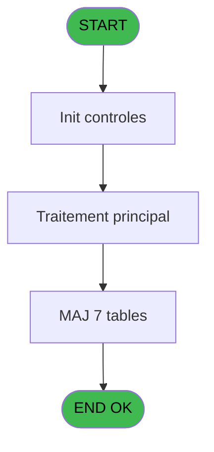

Generate a complete Zustand store for the "controleFermetureCaisse" domain.

RULES (MANDATORY):
- Use import aliases: @/ for src root (e.g. @/stores/..., @/types/...)
- NEVER use `any` type - use `unknown` or precise types
- Tailwind v4 classes for styling (no tailwind.config.js)
- Arrow functions everywhere (no function declarations)
- `as const` instead of TypeScript enum
- verbatimModuleSyntax is enabled: use `import type { X }` ONLY for types/interfaces, use `import { X }` for values/consts
- File must be COMPLETE and ready to write - NO placeholders, NO TODOs, NO "// implement here"
- NO comments except for genuinely complex logic
- Output ONLY the code inside a single markdown code block (```typescript ... ``` or ```tsx ... ```)

SHARED INFRASTRUCTURE (use these exact imports):
- Data source toggle: `import { useDataSourceStore } from "@/stores/dataSourceStore"` (has .getState().isRealApi)
- API client: `import { apiClient } from "@/services/api/apiClient"` and `import type { ApiResponse } from "@/services/api/apiClient"`
- Screen layout: `import { ScreenLayout } from "@/components/layout"` (wrapper with sidebar, takes children + className)
- UI components: `import { Button, Dialog, Input } from "@/components/ui"`
- cn utility: `import { cn } from "@/lib/utils"`

STORE REQUIREMENTS:
- Use `create` from zustand (import { create } from "zustand")
- Import types from @/types/controleFermetureCaisse
- Import useDataSourceStore from @/stores/dataSourceStore
- Mock/API branching via useDataSourceStore.getState().isRealApi
- try/catch with `e instanceof Error` for error handling
- Realistic mock data (not lorem ipsum)
- EVERY business rule from the analysis MUST be implemented
- Include reset() action to clear state

TYPES FILE (already generated):
import type { ApiResponse } from "@/services/api/apiClient";

// ============================================================================
// ENTITIES
// ============================================================================

export interface PointageDevise {
  finPointage: boolean;
  devisesPointees: boolean;
  deviseLocale: string;
  nombreDevises: number;
}

export interface PointageArticle {
  existeArticleStock: boolean;
}

export interface PointageApproRemise {
  id: number;
}

export interface HistoSessionsCaisse {
  sessionId: number;
  dateOuverture: Date;
  dateFermeture: Date | null;
  operateur: string;
}

export interface GestionDeviseSession {
  sessionId: number;
  deviseCode: string;
  montant: number;
}

export interface Ecart {
  deviseCode: string;
  montantAttendu: number;
  montantDeclare: number;
  ecart: number;
  classeMoyenPaiement: string | null;
  libelleMoyenPaiement: string | null;
}

// ============================================================================
// REQUEST/RESPONSE TYPES
// ============================================================================

export interface ValiderParametresRequest {
  paramUniBi: 'U' | 'B';
  paramKT: 'K' | 'T';
  param2Caisses: boolean;
  hostCourant: string;
  sessionOuverte: boolean;
}

export interface ValiderParametresResponse {
  valid: boolean;
  errors: string[];
}

export interface Configuration2CaissesRequest {
  vg78: boolean;
  terminal: number | null;
  hostname: string;
}

export interface GenererTableauRecapRequest {
  sessionId: number;
}

export interface GenererTableauRecapResponse {
  tableauRecap: Record<string, unknown>[];
}

export interface MettreAJourDevisesSessionRequest {
  sessionId: number;
  devises: GestionDeviseSession[];
}

export interface MettreAJourDevisesSessionResponse {
  success: boolean;
}

export interface RecupererClasseMoyenPaiementRequest {
  moyenPaiementId: number;
}

export interface RecupererClasseMoyenPaiementResponse {
  classe: string;
  libelle: string;
}

export interface CalculerEcartsRequest {
  sessionId: number;
  montantsDeclares: Record<string, number>;
}

export interface CalculerEcartsResponse {
  ecarts: Ecart[];
}

export interface FinaliserFermetureRequest {
  sessionId: number;
}

export interface FinaliserFermetureResponse {
  success: boolean;
  histoId: number;
}

export interface ValiderIntegriteDonneesRequest {
  sessionId: number;
}

export interface ValiderIntegriteDonneesResponse {
  valid: boolean;
  errors: string[];
}

export interface PointagesResponse {
  devises: PointageDevise[];
  articles: PointageArticle[];
  approRemises: PointageApproRemise[];
}

// ============================================================================
// STORE STATE
// ============================================================================

export interface ControleFermetureCaisseState {
  sessionId: number | null;
  deviseLocale: string;
  parametreUniBi: 'U' | 'B';
  parametreKT: 'K' | 'T';
  parametre2Caisses: boolean;
  hostCourantCoffre: string;
  sessionOuverte: boolean;
  terminalCoffre2: number | null;
  hostnameCoffre2: string;
  ecarts: Ecart[];
  devisesPointees: PointageDevise[];
  articlesPointes: PointageArticle[];
  approRemisesPointes: PointageApproRemise[];
  histoSessionDetail: Record<string, unknown>[];
  histoSessionDevise: Record<string, unknown>[];
  tableauRecap: Record<string, unknown>[];
  isLoading: boolean;
  error: string | null;
  validationErrors: string[];
}

export interface ControleFermetureCaisseStateActions {
  setSessionId: (sessionId: number | null) => void;
  setDeviseLocale: (devise: string) => void;
  setParametreUniBi: (param: 'U' | 'B') => void;
  setParametreKT: (param: 'K' | 'T') => void;
  setParametre2Caisses: (enabled: boolean) => void;
  setHostCourantCoffre: (host: string) => void;
  setSessionOuverte: (opened: boolean) => void;
  setTerminalCoffre2: (terminal: number | null) => void;
  setHostnameCoffre2: (hostname: string) => void;
  setEcarts: (ecarts: Ecart[]) => void;
  setDevisesPointees: (devises: PointageDevise[]) => void;
  setArticlesPointes: (articles: PointageArticle[]) => void;
  setApproRemisesPointes: (approRemises: PointageApproRemise[]) => void;
  setHistoSessionDetail: (histo: Record<string, unknown>[]) => void;
  setHistoSessionDevise: (histo: Record<string, unknown>[]) => void;
  setTableauRecap: (tableau: Record<string, unknown>[]) => void;
  setIsLoading: (loading: boolean) => void;
  setError: (error: string | null) => void;
  setValidationErrors: (errors: string[]) => void;
  reset: () => void;
}

export interface ControleFermetureCaisseStoreType
  extends ControleFermetureCaisseState,
    ControleFermetureCaisseStateActions {}

// ============================================================================
// ACTION TYPES
// ============================================================================

export interface ValiderParametresUniBiAction {
  type: 'validerParametresUniBi';
  payload: {
    paramUniBi: 'U' | 'B';
  };
}

export interface ValiderConfiguration2CaissesAction {
  type: 'validerConfiguration2Caisses';
  payload: {
    param2Caisses: boolean;
    hostCourant: string;
    sessionOuverte: boolean;
  };
}

export interface TraiterModeKasseAction {
  type: 'traiterModeKasse';
  payload: {
    paramKT: 'K' | 'T';
  };
}

export interface ConfigurerCoffre2Action {
  type: 'configurerCoffre2';
  payload: {
    vg78: boolean;
    terminal: number | null;
    hostname: string;
  };
}

export interface GenererTableauRecapAction {
  type: 'genererTableauRecap';
  payload: {
    sessionId: number;
  };
}

export interface MettreAJourDevisesSessionAction {
  type: 'mettreAJourDevisesSession';
  payload: {
    sessionId: number;
    devises: GestionDeviseSession[];
  };
}

export interface RecupererClasseMoyenPaiementAction {
  type: 'recupererClasseMoyenPaiement';
  payload: {
    moyenPaiementId: number;
  };
}

export interface CalculerEcartsAction {
  type: 'calculerEcarts';
  payload: {
    sessionId: number;
    montantsDeclares: Record<string, number>;
  };
}

export interface FinaliserFermetureAction {
  type: 'finaliserFermeture';
  payload: {
    sessionId: number;
  };
}

export interface ValiderIntegriteDonneesAction {
  type: 'validerIntegriteDonnees';
  payload: {
    sessionId: number;
  };
}

export type ControleFermetureCaisseAction =
  | ValiderParametresUniBiAction
  | ValiderConfiguration2CaissesAction
  | TraiterModeKasseAction
  | ConfigurerCoffre2Action
  | GenererTableauRecapAction
  | MettreAJourDevisesSessionAction
  | RecupererClasseMoyenPaiementAction
  | CalculerEcartsAction
  | FinaliserFermetureAction
  | ValiderIntegriteDonneesAction;

// ============================================================================
// DERIVED TYPES
// ============================================================================

export interface EcartsSummary {
  totalEcarts: number;
  nbEcartsDetectes: number;
  devisesAffectees: string[];
  montantTotalEcart: number;
  hasAlerts: boolean;
}

export interface FermetureFinal {
  sessionId: number;
  operateur: string;
  dateOuverture: Date;
  dateFermeture: Date;
  ecarts: Ecart[];
  tableauRecap: Record<string, unknown>[];
  pointages: {
    devises: PointageDevise[];
    articles: PointageArticle[];
    approRemises: PointageApproRemise[];
  };
  histoId: number;
}

// ============================================================================
// API RESPONSE WRAPPER TYPES
// ============================================================================

export type ValiderParametresApiResponse =
  ApiResponse<ValiderParametresResponse>;
export type GenererTableauRecapApiResponse =
  ApiResponse<GenererTableauRecapResponse>;
export type MettreAJourDevisesSessionApiResponse =
  ApiResponse<MettreAJourDevisesSessionResponse>;
export type RecupererClasseMoyenPaiementApiResponse =
  ApiResponse<RecupererClasseMoyenPaiementResponse>;
export type CalculerEcartsApiResponse = ApiResponse<CalculerEcartsResponse>;
export type FinaliserFermetureApiResponse =
  ApiResponse<FinaliserFermetureResponse>;
export type ValiderIntegriteDonneesApiResponse =
  ApiResponse<ValiderIntegriteDonneesResponse>;
export type PointagesApiResponse = ApiResponse<PointagesResponse>;

ANALYSIS DOCUMENT:
{
  "domain": "controleFermetureCaisse",
  "domainPascal": "ControleFermetureCaisse",
  "complexity": "HIGH",
  "entities": [
    {
      "name": "PointageDevise",
      "fields": [
        {
          "name": "finPointage",
          "type": "boolean",
          "source": "pointage_devise.fin_pointage",
          "nullable": false
        },
        {
          "name": "devisesPointees",
          "type": "boolean",
          "source": "pointage_devise.devises_pointees",
          "nullable": false
        },
        {
          "name": "deviseLocale",
          "type": "string",
          "source": "pointage_devise.devise_locale",
          "nullable": false
        },
        {
          "name": "nombreDevises",
          "type": "number",
          "source": "pointage_devise.nombre_devises",
          "nullable": false
        }
      ]
    },
    {
      "name": "PointageArticle",
      "fields": [
        {
          "name": "existeArticleStock",
          "type": "boolean",
          "source": "pointage_article.existe_article_stock",
          "nullable": false
        }
      ]
    },
    {
      "name": "PointageApproRemise",
      "fields": [
        {
          "name": "id",
          "type": "number",
          "source": "pointage_appro_remise.id",
          "nullable": false
        }
      ]
    },
    {
      "name": "HistoSessionsCaisse",
      "fields": [
        {
          "name": "sessionId",
          "type": "number",
          "source": "histo_sessions_caisse.session_id",
          "nullable": false
        },
        {
          "name": "dateOuverture",
          "type": "Date",
          "source": "histo_sessions_caisse.date_ouverture",
          "nullable": false
        },
        {
          "name": "dateFermeture",
          "type": "Date",
          "source": "histo_sessions_caisse.date_fermeture",
          "nullable": true
        },
        {
          "name": "operateur",
          "type": "string",
          "source": "histo_sessions_caisse.operateur",
          "nullable": false
        }
      ]
    },
    {
      "name": "GestionDeviseSession",
      "fields": [
        {
          "name": "sessionId",
          "type": "number",
          "source": "gestion_devise_session.session_id",
          "nullable": false
        },
        {
          "name": "deviseCode",
          "type": "string",
          "source": "gestion_devise_session.devise_code",
          "nullable": false
        },
        {
          "name": "montant",
          "type": "number",
          "source": "gestion_devise_session.montant",
          "nullable": false
        }
      ]
    },
    {
      "name": "Ecart",
      "fields": [
        {
          "name": "deviseCode",
          "type": "string",
          "source": "derived",
          "nullable": false
        },
        {
          "name": "montantAttendu",
          "type": "number",
          "source": "derived",
          "nullable": false
        },
        {
          "name": "montantDeclare",
          "type": "number",
          "source": "derived",
          "nullable": false
        },
        {
          "name": "ecart",
          "type": "number",
          "source": "derived",
          "nullable": false
        },
        {
          "name": "classeMoyenPaiement",
          "type": "string",
          "source": "derived",
          "nullable": true
        },
        {
          "name": "libelleMoyenPaiement",
          "type": "string",
          "source": "derived",
          "nullable": true
        }
      ]
    }
  ],
  "stateFields": [
    {
      "name": "sessionId",
      "type": "number | null",
      "default": "null"
    },
    {
      "name": "deviseLocale",
      "type": "string",
      "default": "''"
    },
    {
      "name": "parametreUniBi",
      "type": "'U' | 'B'",
      "default": "'U'"
    },
    {
      "name": "parametreKT",
      "type": "'K' | 'T'",
      "default": "'K'"
    },
    {
      "name": "parametre2Caisses",
      "type": "boolean",
      "default": "false"
    },
    {
      "name": "hostCourantCoffre",
      "type": "string",
      "default": "''"
    },
    {
      "name": "sessionOuverte",
      "type": "boolean",
      "default": "false"
    },
    {
      "name": "terminalCoffre2",
      "type": "number | null",
      "default": "null"
    },
    {
      "name": "hostnameCoffre2",
      "type": "string",
      "default": "''"
    },
    {
      "name": "ecarts",
      "type": "Ecart[]",
      "default": "[]"
    },
    {
      "name": "devisesPointees",
      "type": "PointageDevise[]",
      "default": "[]"
    },
    {
      "name": "articlesPointes",
      "type": "PointageArticle[]",
      "default": "[]"
    },
    {
      "name": "approRemisesPointes",
      "type": "PointageApproRemise[]",
      "default": "[]"
    },
    {
      "name": "histoSessionDetail",
      "type": "any[]",
      "default": "[]"
    },
    {
      "name": "histoSessionDevise",
      "type": "any[]",
      "default": "[]"
    },
    {
      "name": "tableauRecap",
      "type": "any[]",
      "default": "[]"
    },
    {
      "name": "isLoading",
      "type": "boolean",
      "default": "false"
    },
    {
      "name": "error",
      "type": "string | null",
      "default": "null"
    },
    {
      "name": "validationErrors",
      "type": "string[]",
      "default": "[]"
    }
  ],
  "actions": [
    {
      "name": "validerParametresUniBi",
      "params": [
        "paramUniBi: 'U' | 'B'"
      ],
      "businessRules": [
        "RM-001: Si paramètre UNI/BI = 'B', activer mode bidirectionnel pour contrôles devises"
      ],
      "returns": "Promise<boolean>"
    },
    {
      "name": "validerConfiguration2Caisses",
      "params": [
        "param2Caisses: boolean",
        "hostCourant: string",
        "sessionOuverte: boolean"
      ],
      "businessRules": [
        "RM-002: Si paramètre 2 caisses = 'O' ET (host courant coffre ET NOT session ouverte OU paramètre session ouverte), activer gestion coffre2"
      ],
      "returns": "Promise<boolean>"
    },
    {
      "name": "traiterModeKasse",
      "params": [
        "paramKT: 'K' | 'T'"
      ],
      "businessRules": [
        "RM-003: Si paramètre K/T = 'K', traiter en mode Kasse (comptage caisse)",
        "RM-004: Si paramètre K/T = 'T', traiter en mode Terminal (comptage terminal)"
      ],
      "returns": "Promise<void>"
    },
    {
      "name": "configurerCoffre2",
      "params": [
        "vg78: boolean",
        "terminal: number | null",
        "hostname: string"
      ],
      "businessRules": [
        "RM-005: Si VG78 alors affecter terminal et hostname coffre2",
        "RM-006: Si NOT VG78 alors ignorer configuration coffre2"
      ],
      "returns": "Promise<void>"
    },
    {
      "name": "genererTableauRecap",
      "params": [
        "sessionId: number"
      ],
      "businessRules": [
        "Appel IDE 135 pour générer le tableau récapitulatif des ventes de la session"
      ],
      "returns": "Promise<any[]>"
    },
    {
      "name": "mettreAJourDevisesSession",
      "params": [
        "sessionId: number",
        "devises: GestionDeviseSession[]"
      ],
      "businessRules": [
        "Appel IDE 142 pour mettre à jour les devises de session avec soldes finaux déclarés"
      ],
      "returns": "Promise<void>"
    },
    {
      "name": "recupererClasseMoyenPaiement",
      "params": [
        "moyenPaiementId: number"
      ],
      "businessRules": [
        "Appel IDE 152 pour récupérer classe et libellé du moyen de paiement"
      ],
      "returns": "Promise<{ classe: string; libelle: string }>"
    },
    {
      "name": "calculerEcarts",
      "params": [
        "sessionId: number",
        "montantsDeclares: Map<string, number>"
      ],
      "businessRules": [
        "Calculer différences entre comptage physique déclaré et soldes attendus de la session",
        "Enrichir avec classes et libellés des moyens de paiement (appel IDE 152)",
        "Détecter erreurs de saisie ou mouvements non enregistrés"
      ],
      "returns": "Promise<Ecart[]>"
    },
    {
      "name": "finaliserFermeture",
      "params": [
        "sessionId: number"
      ],
      "businessRules": [
        "Mettre à jour histo_sessions_caisse avec date fermeture",
        "Enregistrer pointages finaux dans pointage_devise, pointage_article, pointage_appro_remise",
        "Créer entrées historiques pv_comptable et pv_discounts",
        "Produire historique complet session avec traçabilité écarts et corrections"
      ],
      "returns": "Promise<void>"
    },
    {
      "name": "validerIntegriteDonnees",
      "params": [
        "sessionId: number"
      ],
      "businessRules": [
        "Vérifier cohérence entre déclarations opérateurs et mouvements enregistrés",
        "Valider complétude des pointages (devises, articles, appros/remises)",
        "Détecter incohérences avant finalisation"
      ],
      "returns": "Promise<{ valid: boolean; errors: string[] }>"
    }
  ],
  "apiEndpoints": [
    {
      "method": "POST",
      "path": "/api/caisse/fermeture/valider-parametres",
      "queryParams": [],
      "response": "{ valid: boolean; errors: string[] }"
    },
    {
      "method": "POST",
      "path": "/api/caisse/fermeture/generer-recap",
      "queryParams": [
        "sessionId"
      ],
      "response": "{ tableauRecap: any[] }"
    },
    {
      "method": "POST",
      "path": "/api/caisse/fermeture/calculer-ecarts",
      "queryParams": [
        "sessionId"
      ],
      "response": "{ ecarts: Ecart[] }"
    },
    {
      "method": "POST",
      "path": "/api/caisse/fermeture/maj-devises-session",
      "queryParams": [],
      "response": "{ success: boolean }"
    },
    {
      "method": "POST",
      "path": "/api/caisse/fermeture/finaliser",
      "queryParams": [
        "sessionId"
      ],
      "response": "{ success: boolean; histoId: number }"
    },
    {
      "method": "GET",
      "path": "/api/caisse/fermeture/classe-moyen-paiement",
      "queryParams": [
        "moyenPaiementId"
      ],
      "response": "{ classe: string; libelle: string }"
    },
    {
      "method": "GET",
      "path": "/api/caisse/fermeture/pointages",
      "queryParams": [
        "sessionId"
      ],
      "response": "{ devises: PointageDevise[]; articles: PointageArticle[]; approRemises: PointageApproRemise[] }"
    }
  ],
  "uiLayout": {
    "type": "wizard-multi-step",
    "sections": [
      {
        "name": "Validation Paramètres",
        "controls": [
          "Radio UNI/BI",
          "Checkbox 2 Caisses",
          "Radio K/T (Kasse/Terminal)",
          "Input Terminal Coffre2",
          "Input Hostname Coffre2"
        ]
      },
      {
        "name": "Génération Récapitulatif",
        "controls": [
          "Button Générer Tableau Recap",
          "DataGrid Tableau Recap (readonly)",
          "Loader pendant génération"
        ]
      },
      {
        "name": "Calcul Écarts",
        "controls": [
          "DataGrid Écarts (colonnes: Devise, Attendu, Déclaré, Écart, Classe MOP, Libellé)",
          "Badge Alerte si écart détecté",
          "Tooltip avec classe/libellé moyen paiement"
        ]
      },
      {
        "name": "Pointages Finaux",
        "controls": [
          "Section Pointage Devises (liste devises pointées)",
          "Section Pointage Articles (articles en stock)",
          "Section Pointage Appro/Remises",
          "Button Valider Pointages"
        ]
      },
      {
        "name": "Finalisation",
        "controls": [
          "Résumé session (ID, Opérateur, Dates)",
          "Résumé écarts totaux",
          "Button Finaliser Fermeture",
          "Confirmation modale avant finalisation",
          "Loader pendant mise à jour tables"
        ]
      }
    ]
  },
  "mockData": {
    "count": 10,
    "description": "Mock data: 3 sessions avec écarts variés (0€, +50€, -20€), 5 devises (EUR, USD, GBP, CHF, JPY), 8 articles stock, 4 types appro/remise, 12 lignes tableau recap, classes MOP (CB, ESPECE, CHEQUE, VIREMENT)"
  },
  "dependencies": {
    "stores": [
      "useSessionStore",
      "useDeviseStore",
      "useArticleStore",
      "useMoyenPaiementStore"
    ],
    "sharedTypes": [
      "SessionCaisse",
      "Devise",
      "Article",
      "MoyenPaiement"
    ],
    "externalApis": [
      "GET /api/sessions/{id}",
      "GET /api/devises",
      "GET /api/articles",
      "GET /api/moyens-paiement/{id}"
    ]
  }
}

SPEC EXCERPT (business rules):
# ADH IDE 155 - Controle fermeture caisse WS

> **Analyse**: Phases 1-4 2026-02-08 03:39 -> 03:39 (4s) | Assemblage 03:39
> **Pipeline**: V7.2 Enrichi
> **Structure**: 4 onglets (Resume | Ecrans | Donnees | Connexions)

<!-- TAB:Resume -->

## 1. FICHE D'IDENTITE

| Attribut | Valeur |
|----------|--------|
| Projet | ADH |
| IDE Position | 155 |
| Nom Programme | Controle fermeture caisse WS |
| Fichier source | `Prg_155.xml` |
| Dossier IDE | Caisse |
| Taches | 147 (0 ecrans visibles) |
| Tables modifiees | 7 |
| Programmes appeles | 3 |
| Complexite | **MOYENNE** (score 45/100) |

## 2. DESCRIPTION FONCTIONNELLE

ADH IDE 155 effectue le contrôle de fermeture de la caisse en validant l'intégrité des données de session. Le programme reçoit les paramètres de fermeture (devise, montants, écarts) et vérifie la cohérence entre les déclarations des opérateurs et les mouvements enregistrés. Il appelle le programme IDE 135 pour générer le tableau récapitulatif des ventes, puis IDE 142 pour mettre à jour les devises de session avec les soldes finaux déclarés.

Le programme gère les écarts détectés lors de la fermeture en calculant les différences entre comptage physique et soldes attendus. Il utilise IDE 152 pour récupérer les classes de moyens de paiement et leurs libellés, afin de présenter un détail complet des écarts par type de paiement. Ces vérifications permettent de détecter les erreurs de saisie ou les mouvements non enregistrés avant de finaliser la session.

Une fois les contrôles validés, ADH IDE 155 met à jour les tables de fermeture (histo_sessions_caisse, pv_comptable, pv_discounts) et enregistre les pointages finaux (pointage_devise, pointage_article, pointage_appro_remise). Le programme produit également un historique complet de la session pour traçabilité, incluant tous les écarts détectés et les corrections appliquées.

## 3. BLOCS FONCTIONNELS

## 5. REGLES METIER

6 regles identifiees:

### Autres (6 regles)

#### <a id="rm-RM-001"></a>[RM-001] Condition: Param UNI/BI [O] egale 'B'

| Element | Detail |
|---------|--------|
| **Condition** | `Param UNI/BI [O]='B'` |
| **Si vrai** | Action si vrai |
| **Variables** | FB (Param UNI/BI) |
| **Expression source** | Expression 1 : `Param UNI/BI [O]='B'` |
| **Exemple** | Si Param UNI/BI [O]='B' → Action si vrai |

#### <a id="rm-RM-002"></a>[RM-002] Condition composite: V parametre 2 caisses [V]='O' AND (p.i.Host courant coffr... [R] AND NOT Param session ouverte ... [S] OR [BQ] AND Param session ouverte ... [S])

| Element | Detail |
|---------|--------|
| **Condition** | `V parametre 2 caisses [V]='O' AND (p.i.Host courant coffr... [R] AND NOT Param session ouverte ... [S] OR [BQ] AND Param session ouverte ... [S])` |
| **Si vrai** | Action si vrai |
| **Variables** | FI (V parametre 2 caisses) |
| **Expression source** | Expression 2 : `V parametre 2 caisses [V]='O' AND (p.i.Host courant coffr...` |
| **Exemple** | Si V parametre 2 caisses [V]='O' AND (p.i.Host courant coffr... [R] AND NOT Param session ouverte ... [S] OR [BQ] AND Param session ouverte ... [S]) → Action si vrai |

#### <a id="rm-RM-003"></a>[RM-003] Condition: Param K/T [A] egale 'K'

| Element | Detail |
|---------|--------|
| **Condition** | `Param K/T [A]='K'` |
| **Si vrai** | Action si vrai |
| **Variables** | EN (Param K/T) |
| **Expression source** | Expression 3 : `Param K/T [A]='K'` |
| **Exemple** | Si Param K/T [A]='K' → Action si vrai |

#### <a id="rm-RM-004"></a>[RM-004] Condition: Param K/T [A] egale 'T'

| Element | Detail |
|---------|--------|
| **Condition** | `Param K/T [A]='T'` |
| **Si vrai** | Action si vrai |
| **Variables** | EN (Param K/T) |
| **Expression source** | Expression 4 : `Param K/T [A]='T'` |
| **Exemple** | Si Param K/T [A]='T' → Action si vrai |

#### <a id="rm-RM-005"></a>[RM-005] Si VG78 alors Val([BO] sinon '3')=p.i.Terminal coffre2 [P], [BP]=p.i.Hostname coffre2 [Q])

| Element | Detail |
|---------|--------|
| **Condition** | `VG78` |
| **Si vrai** | Val([BO] |
| **Si faux** | '3')=p.i.Terminal coffre2 [P], [BP]=p.i.Hostname coffre2 [Q]) |
| **Variables** | FC (p.i.Terminal coffre2), FD (p.i.Hostname coffre2) |
| **Expression source** | Expression 12 : `IF(VG78, Val([BO], '3')=p.i.Terminal coffre2 [P], [BP]=p.i.H` |
| **Exemple** | Si VG78 → Val([BO] |

#### <a id="rm-RM-006"></a>[RM-006] Negation de VG78 (condition inversee)

| Element | Detail |
|---------|--------|
| **Condition** | `NOT VG78` |
| **Si vrai** | Action si vrai |
| **Expression source** | Expression 13 : `NOT VG78` |
| **Exemple** | Si NOT VG78 → Action si vrai |

## 6. CONTEXTE

- **Appele par**: [Fermeture caisse (IDE 131)](ADH-IDE-131.md), [Gestion caisse 142 (IDE 298)](ADH-IDE-298.md), [Fermeture caisse 144 (IDE 299)](ADH-IDE-299.md), [Gestion caisse (IDE 121)](ADH-IDE-121.md)
- **Appelle**: 3 programmes | **Tables**: 21 (W:7 R:13 L:12) | **Taches**: 147 | **Expressions**: 14

<!-- TAB:Ecrans -->

## 8. ECRANS

*(Programme sans ecran visible)*

## 9. NAVIGATION

### 9.3 Structure hierarchique (0 tache)

| Position | Tache | Type | Dimensions | Bloc |
|----------|-------|------|------------|------|

### 9.4 Algorigramme



> **Legende**: Vert = START/END OK | Rouge = END KO | Bleu = Decisions
> *Algorigramme auto-genere. Utiliser `/algorigramme` pour une synthese metier detaillee.*

<!-- TAB:Donnees -->

## 10. TABLES

### Tables utilisees (21)

| ID | Nom | Description | Type | R | W | L | Usages |
|----|-----|-------------|------|---|---|---|--------|
| 243 | pointage_devise | Devises / taux de change | DB | R | **W** | L | 22 |
| 242 | pointage_article | Articles et stock | DB | R | **W** | L | 18 |
| 241 | pointage_appro_remise |  | DB | R 

REFERENCE PATTERN (follow this exact structure):
```typescript
import { create } from 'zustand';
import type {
  ExtraitAccountInfo,
  ExtraitTransaction,
  ExtraitSummary,
  ExtraitPrintFormat,
} from '@/types/extrait';
import { extraitApi } from '@/services/api/endpoints-lot3';
import { useDataSourceStore } from './dataSourceStore';

interface ExtraitState {
  selectedAccount: ExtraitAccountInfo | null;
  transactions: ExtraitTransaction[];
  summary: ExtraitSummary | null;
  searchResults: ExtraitAccountInfo[];
  isSearching: boolean;
  isLoadingExtrait: boolean;
  isPrinting: boolean;
  error: string | null;
}

interface ExtraitActions {
  searchAccount: (societe: string, query: string) => Promise<void>;
  selectAccount: (account: ExtraitAccountInfo) => void;
  loadExtrait: (
    societe: string,
    codeAdherent: number,
    filiation: number,
    dateDebut?: string,
    dateFin?: string,
  ) => Promise<void>;
  printExtrait: (
    societe: string,
    codeAdherent: number,
    filiation: number,
    format: ExtraitPrintFormat,
  ) => Promise<void>;
  reset: () => void;
}

type ExtraitStore = ExtraitState & ExtraitActions;

const MOCK_ACCOUNTS: ExtraitAccountInfo[] = [
  { societe: 'SOC1', codeAdherent: 1001, filiation: 0, nom: 'DUPONT', prenom: 'Jean', statut: 'normal', hasGiftPass: false },
  { societe: 'SOC1', codeAdherent: 1002, filiation: 0, nom: 'MARTIN', prenom: 'Sophie', statut: 'normal', hasGiftPass: true },
  { societe: 'SOC1', codeAdherent: 1003, filiation: 1, nom: 'DURAND', prenom: 'Pierre', statut: 'bloque', hasGiftPass: false },
];

const MOCK_TRANSACTIONS: ExtraitTransaction[] = [
  { id: 1, date: '2026-02-10', heure: '09:15', libelle: 'Achat boutique', debit: 45.50, credit: 0, solde: -45.50, codeService: 'BTQ', codeImputation: 'IMP01', giftPassFlag: false, nbArticles: 3, status: 'debit', numeroPiece: 'VTE-001', modePaiement: 'CB', caissier: 'MARTIN S.' },
  { id: 2, date: '2026-02-10', heure: '14:30', libelle: 'Credit compte', debit: 0, credit: 200, solde: 154.50, codeService: 'CAI', codeImputation: 'IMP02', giftPassFlag: false, status: 'credit', numeroPiece: 'CRD-042', modePaiement: 'Especes', caissier: 'DUPONT J.' },
  { id: 3, date: '2026-02-09', heure: '12:45', libelle: 'Repas restaurant', libelleSupplementaire: 'Menu du jour', debit: 32.00, credit: 0, solde: 122.50, codeService: 'RST', codeImputation: 'IMP03', giftPassFlag: true, nbArticles: 1, status: 'debit', numeroPiece: 'RST-117', modePaiement: 'GiftPass', caissier: 'MARTIN S.' },
  { id: 4, date: '2026-02-08', heure: '16:00', libelle: 'Annulation vente', debit: 0, credit: 15.00, solde: 154.50, codeService: 'BTQ', codeImputation: 'IMP01', giftPassFlag: false, status: 'annule', numeroPiece: 'ANN-003', modePaiement: 'CB', caissier: 'DUPONT J.', commentaire: 'Erreur de saisie' },
  { id: 5, date: '2026-02-08', heure: '10:20', libelle: 'Regularisation solde', debit: 0, credit: 5.00, solde: 139.50, codeService: 'CAI', codeImputation: 'IMP02', giftPassFlag: false, status: 'regularise', numeroPiece: 'REG-007', modePaiement: 'Interne', caissier: 'ADMIN' },
];

const MOCK_SUMMARY: ExtraitSummary = {
  totalDebit: 77.50,
  totalCredit: 220,
  soldeActuel: 142.50,
  nbTransactions: 5,
};

const initialState: ExtraitState = {
  selectedAccount: null,
  transactions: [],
  summary: null,
  searchResults: [],
  isSearching: false,
  isLoadingExtrait: false,
  isPrinting: false,
  error: null,
};

export const useExtraitStore = create<ExtraitStore>()((set) => ({
  ...initialState,

  searchAccount: async (societe, query) => {
    const { isRealApi } = useDataSourceStore.getState();
    set({ isSearching: true, error: null });

    if (!isRealApi) {
      const filtered = MOCK_ACCOUNTS.filter(
        (a) =>
          a.nom.toLowerCase().includes(query.toLowerCase()) ||
          a.prenom.toLowerCase().includes(query.toLowerCase()) ||
          String(a.codeAdherent).includes(query),
      );
      set({ searchResults: filtered, isSearching: false });
      return;
    }

    try {
      const response = await extraitApi.searchAccount(societe, query);
      set({ searchResults: response.data.data ?? [] });
    } catch (e: unknown) {
      const message = e instanceof Error ? e.message : 'Erreur recherche compte';
      set({ searchResults: [], error: message });
    } finally {
      set({ isSearching: false });
    }
  },

  selectAccount: (account) => {
    set({ selectedAccount: account, transactions: [], summary: null, error: null });
  },

  loadExtrait: async (societe, codeAdherent, filiation, dateDebut, dateFin) => {
    const { isRealApi } = useDataSourceStore.getState();
    set({ isLoadingExtrait: true, error: null });

    if (!isRealApi) {
      set({
        transactions: MOCK_TRANSACTIONS,
        summary: MOCK_SUMMARY,
        isLoadingExtrait: false,
      });
      return;
    }

    try {
      const response = await extraitApi.getExtrait(
        societe,
        codeAdherent,
        filiation,
        dateDebut,
        dateFin,
      );
      const data = response.data.data;
      set({
        transactions: data?.transactions ?? [],
        summary: data?.summary ?? null,
      });
    } catch (e: unknown) {
      const message = e instanceof Error ? e.message : 'Erreur chargement extrait';
      set({ transactions: [], summary: null, error: message });
    } finally {
      set({ isLoadingExtrait: false });
    }
  },

  printExtrait: async (societe, codeAdherent, filiation, format) => {
    const { isRealApi } = useDataSourceStore.getState();
    set({ isPrinting: true, error: null });

    if (!isRealApi) {
      set({ isPrinting: false });
      return;
    }

    try {
      await extraitApi.printExtrait({
        societe,
        codeAdherent,
        filiation,
        format,
      });
    } catch (e: unknown) {
      const message = e instanceof Error ? e.message : 'Erreur impression';
      set({ error: message });
    } finally {
      set({ isPrinting: false });
    }
  },

  reset: () => set({ ...initialState }),
}));

```