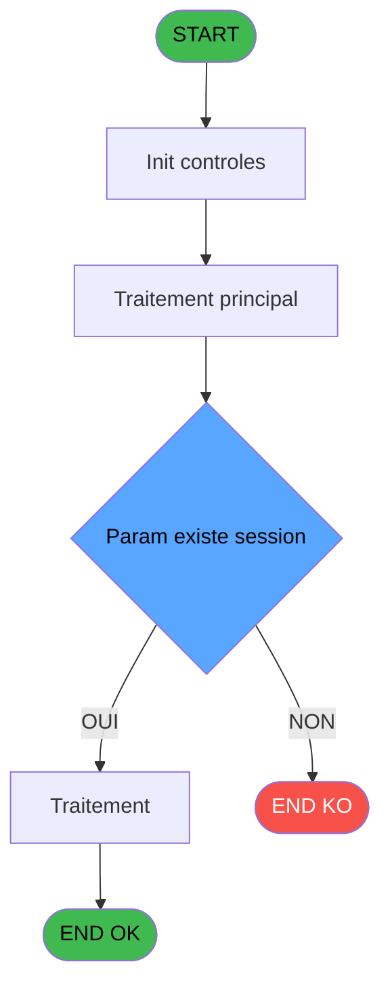
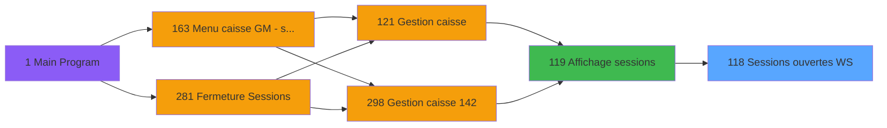

Generate a complete Zustand store for the "sessionsOuvertes" domain.

RULES (MANDATORY):
- Use import aliases: @/ for src root (e.g. @/stores/..., @/types/...)
- NEVER use `any` type - use `unknown` or precise types
- Tailwind v4 classes for styling (no tailwind.config.js)
- Arrow functions everywhere (no function declarations)
- `as const` instead of TypeScript enum
- verbatimModuleSyntax is enabled: use `import type { X }` ONLY for types/interfaces, use `import { X }` for values/consts
- File must be COMPLETE and ready to write - NO placeholders, NO TODOs, NO "// implement here"
- NO comments except for genuinely complex logic
- Output ONLY the code inside a single markdown code block (```typescript ... ``` or ```tsx ... ```)

SHARED INFRASTRUCTURE (use these exact imports):
- Data source toggle: `import { useDataSourceStore } from "@/stores/dataSourceStore"` (has .getState().isRealApi)
- API client: `import { apiClient } from "@/services/api/apiClient"` and `import type { ApiResponse } from "@/services/api/apiClient"`
- Screen layout: `import { ScreenLayout } from "@/components/layout"` (wrapper with sidebar, takes children + className)
- UI components: `import { Button, Dialog, Input } from "@/components/ui"`
- cn utility: `import { cn } from "@/lib/utils"`

STORE REQUIREMENTS:
- Use `create` from zustand (import { create } from "zustand")
- Import types from @/types/sessionsOuvertes
- Import useDataSourceStore from @/stores/dataSourceStore
- Mock/API branching via useDataSourceStore.getState().isRealApi
- try/catch with `e instanceof Error` for error handling
- Realistic mock data (not lorem ipsum)
- EVERY business rule from the analysis MUST be implemented
- Include reset() action to clear state

TYPES FILE (already generated):
export interface SessionOuverte {
  societe: string;
  compte: string;
  filiation: number;
  numeroSession: number;
  operateur: string;
  deviseLocale: string;
  montantCoffre: number;
  dateOuverture: Date;
  heureOuverture: string;
}

export interface SessionsOuvertesState {
  sessions: SessionOuverte[];
  isLoading: boolean;
  error: string | null;
  selectedSession: SessionOuverte | null;
  filtreSociete: string;
  filtreOperateur: string;
  chargerSessionsOuvertes: (societe?: string, operateur?: string) => Promise<void>;
  selectionnerSession: (session: SessionOuverte) => void;
  verifierExistenceSession: (numeroSession: number) => Promise<boolean>;
  rafraichir: () => Promise<void>;
  appliquerFiltres: (societe: string, operateur: string) => Promise<void>;
}

export interface GetSessionsOuvertesRequest {
  societe?: string;
  operateur?: string;
}

export interface GetSessionsOuvertesResponse {
  sessions: SessionOuverte[];
}

export interface VerifierExistenceSessionRequest {
  numeroSession: number;
}

export interface VerifierExistenceSessionResponse {
  existe: boolean;
}

export interface SessionsOuvertesFilters {
  societe: string;
  operateur: string;
}

export const SESSIONS_OUVERTES_STATUS = {
  OUVERT: 'ouvert',
  FERME: 'ferme',
} as const;

export type SessionStatut = typeof SESSIONS_OUVERTES_STATUS[keyof typeof SESSIONS_OUVERTES_STATUS];

ANALYSIS DOCUMENT:
{
  "domain": "sessionsOuvertes",
  "domainPascal": "SessionsOuvertes",
  "complexity": "LOW",
  "entities": [
    {
      "name": "SessionOuverte",
      "fields": [
        {
          "name": "societe",
          "type": "string",
          "source": "histo_sessions_caisse.societe",
          "nullable": false
        },
        {
          "name": "compte",
          "type": "string",
          "source": "histo_sessions_caisse.compte",
          "nullable": false
        },
        {
          "name": "filiation",
          "type": "number",
          "source": "histo_sessions_caisse.filiation",
          "nullable": false
        },
        {
          "name": "numeroSession",
          "type": "number",
          "source": "histo_sessions_caisse.numero_session",
          "nullable": false
        },
        {
          "name": "operateur",
          "type": "string",
          "source": "histo_sessions_caisse.operateur",
          "nullable": false
        },
        {
          "name": "deviseLocale",
          "type": "string",
          "source": "histo_sessions_caisse.devise_locale",
          "nullable": false
        },
        {
          "name": "montantCoffre",
          "type": "number",
          "source": "histo_sessions_caisse.montant_coffre",
          "nullable": false
        },
        {
          "name": "dateOuverture",
          "type": "Date",
          "source": "histo_sessions_caisse.date_ouverture",
          "nullable": false
        },
        {
          "name": "heureOuverture",
          "type": "string",
          "source": "histo_sessions_caisse.heure_ouverture",
          "nullable": false
        }
      ]
    }
  ],
  "stateFields": [
    {
      "name": "sessions",
      "type": "SessionOuverte[]",
      "default": "[]"
    },
    {
      "name": "isLoading",
      "type": "boolean",
      "default": "false"
    },
    {
      "name": "error",
      "type": "string | null",
      "default": "null"
    },
    {
      "name": "selectedSession",
      "type": "SessionOuverte | null",
      "default": "null"
    },
    {
      "name": "filtreSociete",
      "type": "string",
      "default": "\"\""
    },
    {
      "name": "filtreOperateur",
      "type": "string",
      "default": "\"\""
    }
  ],
  "actions": [
    {
      "name": "chargerSessionsOuvertes",
      "params": [
        "societe?: string",
        "operateur?: string"
      ],
      "businessRules": [
        "RM-001: Vérifier existence de sessions ouvertes",
        "RM-002: Filtrer par paramètres société et opérateur si fournis",
        "Retourner uniquement les sessions avec statut ouvert",
        "Trier par date/heure d'ouverture chronologique"
      ],
      "returns": "Promise<void>"
    },
    {
      "name": "selectionnerSession",
      "params": [
        "session: SessionOuverte"
      ],
      "businessRules": [
        "Stocker la session sélectionnée pour usage dans écran parent (IDE 119)"
      ],
      "returns": "Promise<void>"
    },
    {
      "name": "verifierExistenceSession",
      "params": [
        "numeroSession: number"
      ],
      "businessRules": [
        "RM-001: Vérifier si la session existe dans les sessions ouvertes"
      ],
      "returns": "Promise<boolean>"
    },
    {
      "name": "rafraichir",
      "params": [],
      "businessRules": [
        "Recharger la liste des sessions ouvertes avec filtres actuels"
      ],
      "returns": "Promise<void>"
    },
    {
      "name": "appliquerFiltres",
      "params": [
        "societe: string",
        "operateur: string"
      ],
      "businessRules": [
        "RM-002: Filtrer sessions par société ET opérateur",
        "Mettre à jour les états filtreSociete et filtreOperateur",
        "Recharger la liste des sessions"
      ],
      "returns": "Promise<void>"
    }
  ],
  "apiEndpoints": [
    {
      "method": "GET",
      "path": "/api/sessions/ouvertes",
      "queryParams": [
        "societe?",
        "operateur?"
      ],
      "response": "SessionOuverte[]"
    },
    {
      "method": "GET",
      "path": "/api/sessions/existe/{numeroSession}",
      "queryParams": [],
      "response": "{ existe: boolean }"
    }
  ],
  "uiLayout": {
    "type": "data-provider",
    "sections": [
      {
        "name": "dataSource",
        "controls": [
          "Pas d'interface visuelle propre - fournit données pour IDE 119"
        ]
      }
    ]
  },
  "mockData": {
    "count": 8,
    "description": "8 sessions ouvertes réalistes avec variété d'opérateurs (3-4), sociétés (SMRNS1, SMRNS2), devises (EUR, USD, GBP), montants coffre (500-5000), dates/heures échelonnées sur 2 jours, numéros session séquentiels (1001-1008)"
  },
  "dependencies": {
    "stores": [
      "useSessionStore (si store sessions global existe)",
      "useFilterStore (pour filtres partagés)"
    ],
    "sharedTypes": [
      "SessionOuverte (shared avec IDE 119 qui consomme ces données)"
    ],
    "externalApis": [
      "GET /api/sessions/ouvertes",
      "GET /api/sessions/existe/{numeroSession}"
    ]
  }
}

SPEC EXCERPT (business rules):
# ADH IDE 118 - Sessions ouvertes WS

> **Analyse**: Phases 1-4 2026-02-08 02:58 -> 02:58 (4s) | Assemblage 02:58
> **Pipeline**: V7.2 Enrichi
> **Structure**: 4 onglets (Resume | Ecrans | Donnees | Connexions)

<!-- TAB:Resume -->

## 1. FICHE D'IDENTITE

| Attribut | Valeur |
|----------|--------|
| Projet | ADH |
| IDE Position | 118 |
| Nom Programme | Sessions ouvertes WS |
| Fichier source | `Prg_118.xml` |
| Dossier IDE | Caisse |
| Taches | 1 (0 ecrans visibles) |
| Tables modifiees | 0 |
| Programmes appeles | 0 |
| Complexite | **BASSE** (score 0/100) |

## 2. DESCRIPTION FONCTIONNELLE

# ADH IDE 118 - Sessions ouvertes WS

Programme de consultation des sessions ouvertes actuellement, avec affichage des données clés (numéro compte, opérateur, devise, montant). Utilisé comme source de données pour l'écran de gestion des sessions (IDE 119), d'où il est appelé via CallTask pour alimenter une grille/table avec les sessions actives.

Structure basée sur une requête vers la table des sessions (sessions_dat ou équivalent), avec filtrage par statut ouvert et tri par ordre chronologique. Les variables retournées incluent identifiants compte/filiation/société, détails opérateur et métadonnées monétaires (devise locale, montants coffre).

Point d'intégration critique dans le flux "Gestion Caisse" — IDÉ 118 fournit la liste des contextes actifs que l'opérateur doit fermer ou consulter. Pas d'interface visuelle propre (données brutes), mais rôle de data provider pour l'écran IDÉ 119 qui présente ces données à l'utilisateur final.

## 3. BLOCS FONCTIONNELS

## 5. REGLES METIER

2 regles identifiees:

### Autres (2 regles)

#### <a id="rm-RM-001"></a>[RM-001] Condition: [C] egale 0

| Element | Detail |
|---------|--------|
| **Condition** | `[C]=0` |
| **Si vrai** | Action si vrai |
| **Expression source** | Expression 4 : `[C]=0` |
| **Exemple** | Si [C]=0 → Action si vrai |

#### <a id="rm-RM-002"></a>[RM-002] Condition composite: Param existe session [A] AND Param existe session o... [B]

| Element | Detail |
|---------|--------|
| **Condition** | `Param existe session [A] AND Param existe session o... [B]` |
| **Si vrai** | Action si vrai |
| **Variables** | EN (Param existe session) |
| **Expression source** | Expression 5 : `Param existe session [A] AND Param existe session o... [B]` |
| **Exemple** | Si Param existe session [A] AND Param existe session o... [B] → Action si vrai |

## 6. CONTEXTE

- **Appele par**: [Affichage sessions (IDE 119)](ADH-IDE-119.md)
- **Appelle**: 0 programmes | **Tables**: 1 (W:0 R:1 L:0) | **Taches**: 1 | **Expressions**: 5

<!-- TAB:Ecrans -->

## 8. ECRANS

*(Programme sans ecran visible)*

## 9. NAVIGATION

### 9.3 Structure hierarchique (0 tache)

| Position | Tache | Type | Dimensions | Bloc |
|----------|-------|------|------------|------|

### 9.4 Algorigramme



> **Legende**: Vert = START/END OK | Rouge = END KO | Bleu = Decisions
> *Algorigramme auto-genere. Utiliser `/algorigramme` pour une synthese metier detaillee.*

<!-- TAB:Donnees -->

## 10. TABLES

### Tables utilisees (1)

| ID | Nom | Description | Type | R | W | L | Usages |
|----|-----|-------------|------|---|---|---|--------|
| 246 | histo_sessions_caisse | Sessions de caisse | DB | R |   |   | 1 |

### Colonnes par table (1 / 1 tables avec colonnes identifiees)

<details>
<summary>Table 246 - histo_sessions_caisse (R) - 1 usages</summary>

| Lettre | Variable | Acces | Type |
|--------|----------|-------|------|
| A | Param existe session | R | Logical |
| B | Param existe session ouverte | R | Logical |

</details>

## 11. VARIABLES

### 11.1 Autres (2)

Variables diverses.

| Lettre | Nom | Type | Usage dans |
|--------|-----|------|-----------|
| EN | Param existe session | Logical | 1x refs |
| EO | Param existe session ouverte | Logical | - |

## 12. EXPRESSIONS

**5 / 5 expressions decodees (100%)**

### 12.1 Repartition par type

| Type | Expressions | Regles |
|------|-------------|--------|
| CONDITION | 2 | 2 |
| CONSTANTE | 1 | 0 |
| CAST_LOGIQUE | 2 | 0 |

### 12.2 Expressions cles par type

#### CONDITION (2 expressions)

| Type | IDE | Expression | Regle |
|------|-----|------------|-------|
| CONDITION | 5 | `Param existe session [A] AND Param existe session o... [B]` | [RM-002](#rm-RM-002) |
| CONDITION | 4 | `[C]=0` | [RM-001](#rm-RM-001) |

#### CONSTANTE (1 expressions)

| Type | IDE | Expression | Regle |
|------|-----|------------|-------|
| CONSTANTE | 2 | `0` | - |

#### CAST_LOGIQUE (2 expressions)

| Type | IDE | Expression | Regle |
|------|-----|------------|-------|
| CAST_LOGIQUE | 3 | `'TRUE'LOG` | - |
| CAST_LOGIQUE | 1 | `'FALSE'LOG` | - |

<!-- TAB:Connexions -->

## 13. GRAPHE D'APPELS

### 13.1 Chaine depuis Main (Callers)

Main -> ... -> [Affichage sessions (IDE 119)](ADH-IDE-119.md) -> **Sessions ouvertes WS (IDE 118)**



### 13.2 Callers

| I

REFERENCE PATTERN (follow this exact structure):
```typescript
import { create } from 'zustand';
import type {
  ExtraitAccountInfo,
  ExtraitTransaction,
  ExtraitSummary,
  ExtraitPrintFormat,
} from '@/types/extrait';
import { extraitApi } from '@/services/api/endpoints-lot3';
import { useDataSourceStore } from './dataSourceStore';

interface ExtraitState {
  selectedAccount: ExtraitAccountInfo | null;
  transactions: ExtraitTransaction[];
  summary: ExtraitSummary | null;
  searchResults: ExtraitAccountInfo[];
  isSearching: boolean;
  isLoadingExtrait: boolean;
  isPrinting: boolean;
  error: string | null;
}

interface ExtraitActions {
  searchAccount: (societe: string, query: string) => Promise<void>;
  selectAccount: (account: ExtraitAccountInfo) => void;
  loadExtrait: (
    societe: string,
    codeAdherent: number,
    filiation: number,
    dateDebut?: string,
    dateFin?: string,
  ) => Promise<void>;
  printExtrait: (
    societe: string,
    codeAdherent: number,
    filiation: number,
    format: ExtraitPrintFormat,
  ) => Promise<void>;
  reset: () => void;
}

type ExtraitStore = ExtraitState & ExtraitActions;

const MOCK_ACCOUNTS: ExtraitAccountInfo[] = [
  { societe: 'SOC1', codeAdherent: 1001, filiation: 0, nom: 'DUPONT', prenom: 'Jean', statut: 'normal', hasGiftPass: false },
  { societe: 'SOC1', codeAdherent: 1002, filiation: 0, nom: 'MARTIN', prenom: 'Sophie', statut: 'normal', hasGiftPass: true },
  { societe: 'SOC1', codeAdherent: 1003, filiation: 1, nom: 'DURAND', prenom: 'Pierre', statut: 'bloque', hasGiftPass: false },
];

const MOCK_TRANSACTIONS: ExtraitTransaction[] = [
  { id: 1, date: '2026-02-10', heure: '09:15', libelle: 'Achat boutique', debit: 45.50, credit: 0, solde: -45.50, codeService: 'BTQ', codeImputation: 'IMP01', giftPassFlag: false, nbArticles: 3, status: 'debit', numeroPiece: 'VTE-001', modePaiement: 'CB', caissier: 'MARTIN S.' },
  { id: 2, date: '2026-02-10', heure: '14:30', libelle: 'Credit compte', debit: 0, credit: 200, solde: 154.50, codeService: 'CAI', codeImputation: 'IMP02', giftPassFlag: false, status: 'credit', numeroPiece: 'CRD-042', modePaiement: 'Especes', caissier: 'DUPONT J.' },
  { id: 3, date: '2026-02-09', heure: '12:45', libelle: 'Repas restaurant', libelleSupplementaire: 'Menu du jour', debit: 32.00, credit: 0, solde: 122.50, codeService: 'RST', codeImputation: 'IMP03', giftPassFlag: true, nbArticles: 1, status: 'debit', numeroPiece: 'RST-117', modePaiement: 'GiftPass', caissier: 'MARTIN S.' },
  { id: 4, date: '2026-02-08', heure: '16:00', libelle: 'Annulation vente', debit: 0, credit: 15.00, solde: 154.50, codeService: 'BTQ', codeImputation: 'IMP01', giftPassFlag: false, status: 'annule', numeroPiece: 'ANN-003', modePaiement: 'CB', caissier: 'DUPONT J.', commentaire: 'Erreur de saisie' },
  { id: 5, date: '2026-02-08', heure: '10:20', libelle: 'Regularisation solde', debit: 0, credit: 5.00, solde: 139.50, codeService: 'CAI', codeImputation: 'IMP02', giftPassFlag: false, status: 'regularise', numeroPiece: 'REG-007', modePaiement: 'Interne', caissier: 'ADMIN' },
];

const MOCK_SUMMARY: ExtraitSummary = {
  totalDebit: 77.50,
  totalCredit: 220,
  soldeActuel: 142.50,
  nbTransactions: 5,
};

const initialState: ExtraitState = {
  selectedAccount: null,
  transactions: [],
  summary: null,
  searchResults: [],
  isSearching: false,
  isLoadingExtrait: false,
  isPrinting: false,
  error: null,
};

export const useExtraitStore = create<ExtraitStore>()((set) => ({
  ...initialState,

  searchAccount: async (societe, query) => {
    const { isRealApi } = useDataSourceStore.getState();
    set({ isSearching: true, error: null });

    if (!isRealApi) {
      const filtered = MOCK_ACCOUNTS.filter(
        (a) =>
          a.nom.toLowerCase().includes(query.toLowerCase()) ||
          a.prenom.toLowerCase().includes(query.toLowerCase()) ||
          String(a.codeAdherent).includes(query),
      );
      set({ searchResults: filtered, isSearching: false });
      return;
    }

    try {
      const response = await extraitApi.searchAccount(societe, query);
      set({ searchResults: response.data.data ?? [] });
    } catch (e: unknown) {
      const message = e instanceof Error ? e.message : 'Erreur recherche compte';
      set({ searchResults: [], error: message });
    } finally {
      set({ isSearching: false });
    }
  },

  selectAccount: (account) => {
    set({ selectedAccount: account, transactions: [], summary: null, error: null });
  },

  loadExtrait: async (societe, codeAdherent, filiation, dateDebut, dateFin) => {
    const { isRealApi } = useDataSourceStore.getState();
    set({ isLoadingExtrait: true, error: null });

    if (!isRealApi) {
      set({
        transactions: MOCK_TRANSACTIONS,
        summary: MOCK_SUMMARY,
        isLoadingExtrait: false,
      });
      return;
    }

    try {
      const response = await extraitApi.getExtrait(
        societe,
        codeAdherent,
        filiation,
        dateDebut,
        dateFin,
      );
      const data = response.data.data;
      set({
        transactions: data?.transactions ?? [],
        summary: data?.summary ?? null,
      });
    } catch (e: unknown) {
      const message = e instanceof Error ? e.message : 'Erreur chargement extrait';
      set({ transactions: [], summary: null, error: message });
    } finally {
      set({ isLoadingExtrait: false });
    }
  },

  printExtrait: async (societe, codeAdherent, filiation, format) => {
    const { isRealApi } = useDataSourceStore.getState();
    set({ isPrinting: true, error: null });

    if (!isRealApi) {
      set({ isPrinting: false });
      return;
    }

    try {
      await extraitApi.printExtrait({
        societe,
        codeAdherent,
        filiation,
        format,
      });
    } catch (e: unknown) {
      const message = e instanceof Error ? e.message : 'Erreur impression';
      set({ error: message });
    } finally {
      set({ isPrinting: false });
    }
  },

  reset: () => set({ ...initialState }),
}));

```