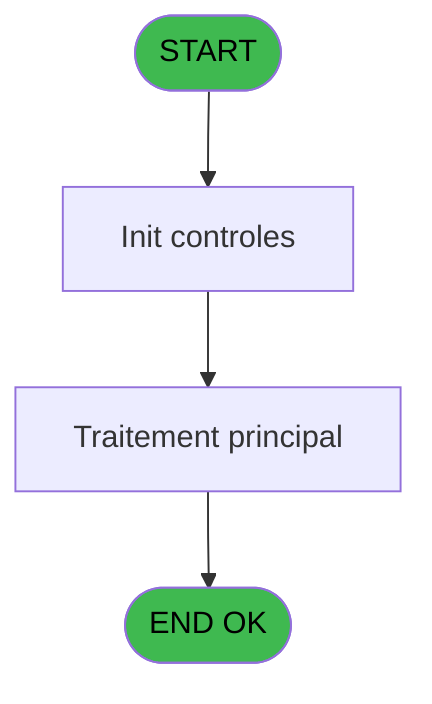

Generate a complete Zustand store for the "controleOuvertureCaisse" domain.

RULES (MANDATORY):
- Use import aliases: @/ for src root (e.g. @/stores/..., @/types/...)
- NEVER use `any` type - use `unknown` or precise types
- Tailwind v4 classes for styling (no tailwind.config.js)
- Arrow functions everywhere (no function declarations)
- `as const` instead of TypeScript enum
- verbatimModuleSyntax is enabled: use `import type { X }` ONLY for types/interfaces, use `import { X }` for values/consts
- File must be COMPLETE and ready to write - NO placeholders, NO TODOs, NO "// implement here"
- NO comments except for genuinely complex logic
- Output ONLY the code inside a single markdown code block (```typescript ... ``` or ```tsx ... ```)

SHARED INFRASTRUCTURE (use these exact imports):
- Data source toggle: `import { useDataSourceStore } from "@/stores/dataSourceStore"` (has .getState().isRealApi)
- API client: `import { apiClient } from "@/services/api/apiClient"` and `import type { ApiResponse } from "@/services/api/apiClient"`
- Screen layout: `import { ScreenLayout } from "@/components/layout"` (wrapper with sidebar, takes children + className)
- UI components: `import { Button, Dialog, Input } from "@/components/ui"`
- cn utility: `import { cn } from "@/lib/utils"`

STORE REQUIREMENTS:
- Use `create` from zustand (import { create } from "zustand")
- Import types from @/types/controleOuvertureCaisse
- Import useDataSourceStore from @/stores/dataSourceStore
- Mock/API branching via useDataSourceStore.getState().isRealApi
- try/catch with `e instanceof Error` for error handling
- Realistic mock data (not lorem ipsum)
- EVERY business rule from the analysis MUST be implemented
- Include reset() action to clear state

TYPES FILE (already generated):
import type { ApiResponse } from "@/services/api/apiClient";

export interface CaisseControl {
  societe: string;
  deviseLocale: string;
  modeUniBi: string;
  chronoSession: number;
  soldeInitial: number;
  soldeInitialMonnaie: number;
  soldeInitialProduits: number;
  soldeInitialCartes: number;
  soldeInitialCheques: number;
  soldeInitialOd: number;
  soldeInitialNbreDevise: number;
  approCoffre: number;
  approArticles: number;
  approNbreDevises: number;
}

export interface CaisseCalculee {
  caisseCalculee: number;
  caisseCalculeeMonnaie: number;
  caisseCalculeeProduits: number;
  caisseCalculeeCartes: number;
  caisseCalculeeCheque: number;
  caisseCalculeeOd: number;
  caisseCalculeeNbDevise: number;
}

export interface ValidationError {
  code: string;
  message: string;
  field: string | null;
}

export interface ModeUniCheck {
  isUni: boolean;
  isBi: boolean;
}

export interface ControleOuvertureCaisseRequest {
  params: CaisseControl;
}

export interface ControleOuvertureCaisseResponse extends ApiResponse {
  data?: CaisseCalculee;
  error?: ValidationError;
}

export interface ControleOuvertureCaisseState {
  isValidating: boolean;
  validationResult: CaisseCalculee | null;
  validationError: ValidationError | null;
  validateOuvertureCaisse: (params: CaisseControl) => Promise<CaisseCalculee>;
  checkModeUniBi: (mode: string) => Promise<ModeUniCheck>;
  clearValidation: () => void;
}

export const VALIDATION_ERROR_CODES = {
  SESSION_ALREADY_OPEN: "ERR_SESSION_ALREADY_OPEN",
  INSUFFICIENT_PERMISSIONS: "ERR_INSUFFICIENT_PERMISSIONS",
  MISSING_PARAMETERS: "ERR_MISSING_PARAMETERS",
  INVALID_MODE: "ERR_INVALID_MODE",
  CALCULATION_ERROR: "ERR_CALCULATION_ERROR",
} as const;

export type ValidationErrorCode = (typeof VALIDATION_ERROR_CODES)[keyof typeof VALIDATION_ERROR_CODES];

export const MODE_UNI_BI = {
  UNI: "U",
  BI: "B",
} as const;

export type ModeUniType = (typeof MODE_UNI_BI)[keyof typeof MODE_UNI_BI];

ANALYSIS DOCUMENT:
{
  "domain": "controleOuvertureCaisse",
  "domainPascal": "ControleOuvertureCaisse",
  "complexity": "LOW",
  "entities": [
    {
      "name": "CaisseControl",
      "fields": [
        {
          "name": "societe",
          "type": "string",
          "source": "parameter.EN",
          "nullable": false
        },
        {
          "name": "deviseLocale",
          "type": "string",
          "source": "parameter.EO",
          "nullable": false
        },
        {
          "name": "modeUniBi",
          "type": "string",
          "source": "parameter.EP",
          "nullable": false
        },
        {
          "name": "chronoSession",
          "type": "number",
          "source": "parameter.EQ",
          "nullable": false
        },
        {
          "name": "soldeInitial",
          "type": "number",
          "source": "parameter.ER",
          "nullable": false
        },
        {
          "name": "soldeInitialMonnaie",
          "type": "number",
          "source": "parameter.ES",
          "nullable": false
        },
        {
          "name": "soldeInitialProduits",
          "type": "number",
          "source": "parameter.ET",
          "nullable": false
        },
        {
          "name": "soldeInitialCartes",
          "type": "number",
          "source": "parameter.EU",
          "nullable": false
        },
        {
          "name": "soldeInitialCheques",
          "type": "number",
          "source": "parameter.EV",
          "nullable": false
        },
        {
          "name": "soldeInitialOd",
          "type": "number",
          "source": "parameter.EW",
          "nullable": false
        },
        {
          "name": "soldeInitialNbreDevise",
          "type": "number",
          "source": "parameter.EX",
          "nullable": false
        },
        {
          "name": "approCoffre",
          "type": "number",
          "source": "parameter.EY",
          "nullable": false
        },
        {
          "name": "approArticles",
          "type": "number",
          "source": "parameter.EZ",
          "nullable": false
        },
        {
          "name": "approNbreDevises",
          "type": "number",
          "source": "parameter.FA",
          "nullable": false
        }
      ]
    },
    {
      "name": "CaisseCalculee",
      "fields": [
        {
          "name": "caisseCalculee",
          "type": "number",
          "source": "calculated.FB",
          "nullable": false
        },
        {
          "name": "caisseCalculeeMonnaie",
          "type": "number",
          "source": "calculated.FC",
          "nullable": false
        },
        {
          "name": "caisseCalculeeProduits",
          "type": "number",
          "source": "calculated.FD",
          "nullable": false
        },
        {
          "name": "caisseCalculeeCartes",
          "type": "number",
          "source": "calculated.FE",
          "nullable": false
        },
        {
          "name": "caisseCalculeeCheque",
          "type": "number",
          "source": "calculated.FF",
          "nullable": false
        },
        {
          "name": "caisseCalculeeOd",
          "type": "number",
          "source": "calculated.FG",
          "nullable": false
        },
        {
          "name": "caisseCalculeeNbDevise",
          "type": "number",
          "source": "calculated.FH",
          "nullable": false
        }
      ]
    },
    {
      "name": "ValidationError",
      "fields": [
        {
          "name": "code",
          "type": "string",
          "source": "error.code",
          "nullable": false
        },
        {
          "name": "message",
          "type": "string",
          "source": "error.message",
          "nullable": false
        },
        {
          "name": "field",
          "type": "string",
          "source": "error.field",
          "nullable": true
        }
      ]
    }
  ],
  "stateFields": [
    {
      "name": "isValidating",
      "type": "boolean",
      "default": "false"
    },
    {
      "name": "validationResult",
      "type": "CaisseCalculee | null",
      "default": "null"
    },
    {
      "name": "validationError",
      "type": "ValidationError | null",
      "default": "null"
    }
  ],
  "actions": [
    {
      "name": "validateOuvertureCaisse",
      "params": [
        "params: CaisseControl"
      ],
      "businessRules": [
        "RM-001: If modeUniBi != 'B', execute UNI-mode specific validation",
        "RM-002: If modeUniBi == 'B', execute BI-mode specific validation",
        "Calculate caisseCalculee = soldeInitial + approCoffre + approArticles (Expression 1)",
        "Calculate caisseCalculeeMonnaie = soldeInitialMonnaie + approCoffre (Expression 2)",
        "Calculate caisseCalculeeProduits = soldeInitialProduits + approArticles (Expression 3)",
        "Calculate caisseCalculeeNbDevise = soldeInitialNbreDevise + approNbreDevises (Expression 7)",
        "Validate session not already open for this chrono",
        "Validate operator has required permissions",
        "Validate all required parameters are present",
        "Return calculated caisse values or error code"
      ],
      "returns": "Promise<CaisseCalculee>"
    },
    {
      "name": "checkModeUniBi",
      "params": [
        "mode: string"
      ],
      "businessRules": [
        "RM-001: Check if mode != 'B' for UNI-specific routing",
        "RM-002: Check if mode == 'B' for BI-specific routing"
      ],
      "returns": "Promise<{ isUni: boolean; isBi: boolean }>"
    }
  ],
  "apiEndpoints": [
    {
      "method": "POST",
      "path": "/api/caisse/controle-ouverture",
      "queryParams": [],
      "response": "CaisseCalculee"
    }
  ],
  "uiLayout": {
    "type": "backend-service",
    "sections": [
      {
        "name": "Backend Validation Service",
        "controls": [
          "No UI - This is a backend validation service called by IDE 122 and IDE 297",
          "Returns calculated caisse totals or error codes",
          "Validates UNI/BI mode routing",
          "Checks session state, operator permissions, and parameter validity"
        ]
      }
    ]
  },
  "mockData": {
    "count": 3,
    "description": "Mock validation scenarios: (1) Successful UNI-mode validation with calculated totals, (2) Successful BI-mode validation, (3) Validation error for already-open session"
  },
  "dependencies": {
    "stores": [
      "useSessionStore"
    ],
    "sharedTypes": [
      "CaisseControl",
      "CaisseCalculee",
      "ValidationError"
    ],
    "externalApis": [
      "/api/caisse/controle-ouverture"
    ]
  }
}

SPEC EXCERPT (business rules):
# ADH IDE 128 - Controle ouverture caisse WS

> **Analyse**: Phases 1-4 2026-02-08 03:06 -> 03:06 (4s) | Assemblage 03:06
> **Pipeline**: V7.2 Enrichi
> **Structure**: 4 onglets (Resume | Ecrans | Donnees | Connexions)

<!-- TAB:Resume -->

## 1. FICHE D'IDENTITE

| Attribut | Valeur |
|----------|--------|
| Projet | ADH |
| IDE Position | 128 |
| Nom Programme | Controle ouverture caisse WS |
| Fichier source | `Prg_128.xml` |
| Dossier IDE | Caisse |
| Taches | 2 (0 ecrans visibles) |
| Tables modifiees | 0 |
| Programmes appeles | 0 |
| Complexite | **BASSE** (score 0/100) |

## 2. DESCRIPTION FONCTIONNELLE

Le programme ADH IDE 128 effectue un contrôle préalable avant l'ouverture d'une session de caisse. Il valide que les conditions nécessaires sont réunies : vérification que la caisse n'est pas déjà ouverte, que l'opérateur dispose des droits requis, et que les paramètres de session sont corrects. Ce programme agit comme un gatekeeper, bloquant les ouvertures invalides avant qu'elles n'affectent les données critiques.

Le flux d'exécution repose sur une série de vérifications conditionnelles. Pour chaque condition d'erreur rencontrée (caisse déjà ouverte, droits insuffisants, paramètres manquants), le programme retourne un code d'erreur spécifique permettant au programme appelant (IDE 122 ou IDE 297) de gérer l'erreur appropriée et d'afficher un message utilisateur adapté. Les validations s'exécutent dans un ordre logique : d'abord les vérifications d'état, puis celles de droits.

Le programme utilise probablement des tables de référence (droits opérateurs, configuration caisse) et des variables de session pour consulter l'état courant. Il s'inscrit dans le workflow critique d'ouverture caisse : tout passage obligatoire avant que l'IDE 122 ou IDE 297 ne créent une nouvelle session avec les mouvements initiaux de comptage.

## 3. BLOCS FONCTIONNELS

## 5. REGLES METIER

2 regles identifiees:

### Autres (2 regles)

#### <a id="rm-RM-001"></a>[RM-001] Condition: Param UNI/BI [C] different de 'B'

| Element | Detail |
|---------|--------|
| **Condition** | `Param UNI/BI [C]<>'B'` |
| **Si vrai** | Action si vrai |
| **Variables** | EP (Param UNI/BI) |
| **Expression source** | Expression 8 : `Param UNI/BI [C]<>'B'` |
| **Exemple** | Si Param UNI/BI [C]<>'B' → Action si vrai |

#### <a id="rm-RM-002"></a>[RM-002] Condition: Param UNI/BI [C] egale 'B'

| Element | Detail |
|---------|--------|
| **Condition** | `Param UNI/BI [C]='B'` |
| **Si vrai** | Action si vrai |
| **Variables** | EP (Param UNI/BI) |
| **Expression source** | Expression 9 : `Param UNI/BI [C]='B'` |
| **Exemple** | Si Param UNI/BI [C]='B' → Action si vrai |

## 6. CONTEXTE

- **Appele par**: [Ouverture caisse (IDE 122)](ADH-IDE-122.md), [Ouverture caisse 143 (IDE 297)](ADH-IDE-297.md)
- **Appelle**: 0 programmes | **Tables**: 3 (W:0 R:1 L:2) | **Taches**: 2 | **Expressions**: 9

<!-- TAB:Ecrans -->

## 8. ECRANS

*(Programme sans ecran visible)*

## 9. NAVIGATION

### 9.3 Structure hierarchique (0 tache)

| Position | Tache | Type | Dimensions | Bloc |
|----------|-------|------|------------|------|

### 9.4 Algorigramme



> **Legende**: Vert = START/END OK | Rouge = END KO | Bleu = Decisions
> *Algorigramme auto-genere. Utiliser `/algorigramme` pour une synthese metier detaillee.*

<!-- TAB:Donnees -->

## 10. TABLES

### Tables utilisees (3)

| ID | Nom | Description | Type | R | W | L | Usages |
|----|-----|-------------|------|---|---|---|--------|
| 139 | moyens_reglement_mor | Reglements / paiements | DB | R |   |   | 1 |
| 232 | gestion_devise_session | Sessions de caisse | DB |   |   | L | 1 |
| 141 | devises__________dev | Devises / taux de change | DB |   |   | L | 1 |

### Colonnes par table (2 / 1 tables avec colonnes identifiees)

<details>
<summary>Table 139 - moyens_reglement_mor (R) - 1 usages</summary>

*Table utilisee uniquement en Link ou aucune colonne Real identifiee dans le DataView.*

</details>

## 11. VARIABLES

### 11.1 Autres (21)

Variables diverses.

| Lettre | Nom | Type | Usage dans |
|--------|-----|------|-----------|
| EN | Param societe | Alpha | - |
| EO | Param devise locale | Alpha | - |
| EP | Param UNI/BI | Alpha | 2x refs |
| EQ | Param chrono session | Numeric | - |
| ER | Param solde initial | Numeric | 7x refs |
| ES | Param solde initial monnaie | Numeric | - |
| ET | Param solde initial produits | Numeric | - |
| EU | Param solde initial cartes | Numeric | - |
| EV | Param solde initial cheques | Numeric | - |
| EW | Param solde initial od | Numeric | 1x refs |
| EX | Param solde initial nbre devise | Numeric | - |
| EY | Param appro coffre | Numeric | 2x refs |
| EZ | Param appro articles | Numeric | 2x refs |
| FA | Param appro Nbre devises | Numeric | 1x refs |
| FB | Param caisse calculee | Numeric | - |
| FC | Param caisse calculee monnaie | Numeric | - |
| FD | Param caisse calculee produits | Numeric | - |
| FE | Param caisse calculee cartes | Numeric | - |
| FF | Param caisse calculee cheque | Numeric | - |
| FG | Param caisse calculee od | Numeric | - |
| FH | Param caisse calculee nb devise | Numeric | - |

<details>
<summary>Toutes les 21 variables (liste complete)</summary>

| Cat | Lettre | Nom Variable | Type |
|-----|--------|--------------|------|
| Autre | **EN** | Param societe | Alpha |
| Autre | **EO** | Param devise locale | Alpha |
| Autre | **EP** | Param UNI/BI | Alpha |
| Autre | **EQ** | Param chrono session | Numeric |
| Autre | **ER** | Param solde initial | Numeric |
| Autre | **ES** | Param solde initial monnaie | Numeric |
| Autre | **ET** | Param solde initial produits | Numeric |
| Autre | **EU** | Param solde initial cartes | Numeric |
| Autre | **EV** | Param solde initial chequ

REFERENCE PATTERN (follow this exact structure):
```typescript
import { create } from 'zustand';
import type {
  ExtraitAccountInfo,
  ExtraitTransaction,
  ExtraitSummary,
  ExtraitPrintFormat,
} from '@/types/extrait';
import { extraitApi } from '@/services/api/endpoints-lot3';
import { useDataSourceStore } from './dataSourceStore';

interface ExtraitState {
  selectedAccount: ExtraitAccountInfo | null;
  transactions: ExtraitTransaction[];
  summary: ExtraitSummary | null;
  searchResults: ExtraitAccountInfo[];
  isSearching: boolean;
  isLoadingExtrait: boolean;
  isPrinting: boolean;
  error: string | null;
}

interface ExtraitActions {
  searchAccount: (societe: string, query: string) => Promise<void>;
  selectAccount: (account: ExtraitAccountInfo) => void;
  loadExtrait: (
    societe: string,
    codeAdherent: number,
    filiation: number,
    dateDebut?: string,
    dateFin?: string,
  ) => Promise<void>;
  printExtrait: (
    societe: string,
    codeAdherent: number,
    filiation: number,
    format: ExtraitPrintFormat,
  ) => Promise<void>;
  reset: () => void;
}

type ExtraitStore = ExtraitState & ExtraitActions;

const MOCK_ACCOUNTS: ExtraitAccountInfo[] = [
  { societe: 'SOC1', codeAdherent: 1001, filiation: 0, nom: 'DUPONT', prenom: 'Jean', statut: 'normal', hasGiftPass: false },
  { societe: 'SOC1', codeAdherent: 1002, filiation: 0, nom: 'MARTIN', prenom: 'Sophie', statut: 'normal', hasGiftPass: true },
  { societe: 'SOC1', codeAdherent: 1003, filiation: 1, nom: 'DURAND', prenom: 'Pierre', statut: 'bloque', hasGiftPass: false },
];

const MOCK_TRANSACTIONS: ExtraitTransaction[] = [
  { id: 1, date: '2026-02-10', heure: '09:15', libelle: 'Achat boutique', debit: 45.50, credit: 0, solde: -45.50, codeService: 'BTQ', codeImputation: 'IMP01', giftPassFlag: false, nbArticles: 3, status: 'debit', numeroPiece: 'VTE-001', modePaiement: 'CB', caissier: 'MARTIN S.' },
  { id: 2, date: '2026-02-10', heure: '14:30', libelle: 'Credit compte', debit: 0, credit: 200, solde: 154.50, codeService: 'CAI', codeImputation: 'IMP02', giftPassFlag: false, status: 'credit', numeroPiece: 'CRD-042', modePaiement: 'Especes', caissier: 'DUPONT J.' },
  { id: 3, date: '2026-02-09', heure: '12:45', libelle: 'Repas restaurant', libelleSupplementaire: 'Menu du jour', debit: 32.00, credit: 0, solde: 122.50, codeService: 'RST', codeImputation: 'IMP03', giftPassFlag: true, nbArticles: 1, status: 'debit', numeroPiece: 'RST-117', modePaiement: 'GiftPass', caissier: 'MARTIN S.' },
  { id: 4, date: '2026-02-08', heure: '16:00', libelle: 'Annulation vente', debit: 0, credit: 15.00, solde: 154.50, codeService: 'BTQ', codeImputation: 'IMP01', giftPassFlag: false, status: 'annule', numeroPiece: 'ANN-003', modePaiement: 'CB', caissier: 'DUPONT J.', commentaire: 'Erreur de saisie' },
  { id: 5, date: '2026-02-08', heure: '10:20', libelle: 'Regularisation solde', debit: 0, credit: 5.00, solde: 139.50, codeService: 'CAI', codeImputation: 'IMP02', giftPassFlag: false, status: 'regularise', numeroPiece: 'REG-007', modePaiement: 'Interne', caissier: 'ADMIN' },
];

const MOCK_SUMMARY: ExtraitSummary = {
  totalDebit: 77.50,
  totalCredit: 220,
  soldeActuel: 142.50,
  nbTransactions: 5,
};

const initialState: ExtraitState = {
  selectedAccount: null,
  transactions: [],
  summary: null,
  searchResults: [],
  isSearching: false,
  isLoadingExtrait: false,
  isPrinting: false,
  error: null,
};

export const useExtraitStore = create<ExtraitStore>()((set) => ({
  ...initialState,

  searchAccount: async (societe, query) => {
    const { isRealApi } = useDataSourceStore.getState();
    set({ isSearching: true, error: null });

    if (!isRealApi) {
      const filtered = MOCK_ACCOUNTS.filter(
        (a) =>
          a.nom.toLowerCase().includes(query.toLowerCase()) ||
          a.prenom.toLowerCase().includes(query.toLowerCase()) ||
          String(a.codeAdherent).includes(query),
      );
      set({ searchResults: filtered, isSearching: false });
      return;
    }

    try {
      const response = await extraitApi.searchAccount(societe, query);
      set({ searchResults: response.data.data ?? [] });
    } catch (e: unknown) {
      const message = e instanceof Error ? e.message : 'Erreur recherche compte';
      set({ searchResults: [], error: message });
    } finally {
      set({ isSearching: false });
    }
  },

  selectAccount: (account) => {
    set({ selectedAccount: account, transactions: [], summary: null, error: null });
  },

  loadExtrait: async (societe, codeAdherent, filiation, dateDebut, dateFin) => {
    const { isRealApi } = useDataSourceStore.getState();
    set({ isLoadingExtrait: true, error: null });

    if (!isRealApi) {
      set({
        transactions: MOCK_TRANSACTIONS,
        summary: MOCK_SUMMARY,
        isLoadingExtrait: false,
      });
      return;
    }

    try {
      const response = await extraitApi.getExtrait(
        societe,
        codeAdherent,
        filiation,
        dateDebut,
        dateFin,
      );
      const data = response.data.data;
      set({
        transactions: data?.transactions ?? [],
        summary: data?.summary ?? null,
      });
    } catch (e: unknown) {
      const message = e instanceof Error ? e.message : 'Erreur chargement extrait';
      set({ transactions: [], summary: null, error: message });
    } finally {
      set({ isLoadingExtrait: false });
    }
  },

  printExtrait: async (societe, codeAdherent, filiation, format) => {
    const { isRealApi } = useDataSourceStore.getState();
    set({ isPrinting: true, error: null });

    if (!isRealApi) {
      set({ isPrinting: false });
      return;
    }

    try {
      await extraitApi.printExtrait({
        societe,
        codeAdherent,
        filiation,
        format,
      });
    } catch (e: unknown) {
      const message = e instanceof Error ? e.message : 'Erreur impression';
      set({ error: message });
    } finally {
      set({ isPrinting: false });
    }
  },

  reset: () => set({ ...initialState }),
}));

```