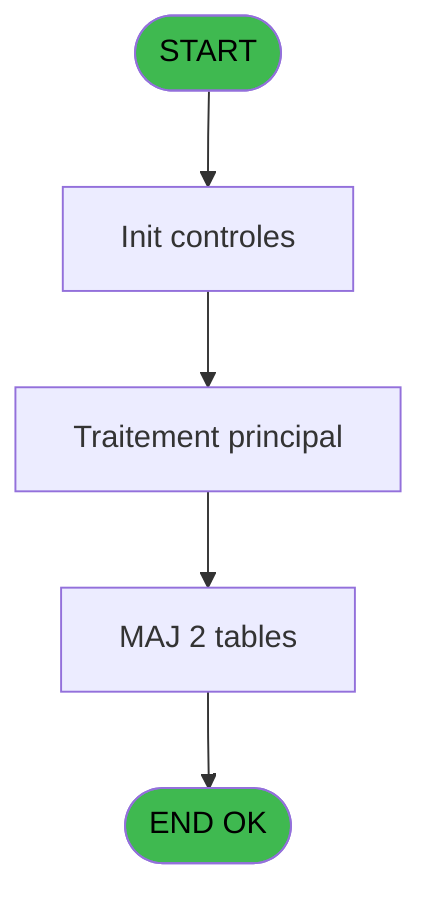

Generate a complete Zustand store for the "comptageHistorization" domain.

RULES (MANDATORY):
- Use import aliases: @/ for src root (e.g. @/stores/..., @/types/...)
- NEVER use `any` type - use `unknown` or precise types
- Tailwind v4 classes for styling (no tailwind.config.js)
- Arrow functions everywhere (no function declarations)
- `as const` instead of TypeScript enum
- verbatimModuleSyntax is enabled: use `import type { X }` ONLY for types/interfaces, use `import { X }` for values/consts
- File must be COMPLETE and ready to write - NO placeholders, NO TODOs, NO "// implement here"
- NO comments except for genuinely complex logic
- Output ONLY the code inside a single markdown code block (```typescript ... ``` or ```tsx ... ```)

SHARED INFRASTRUCTURE (use these exact imports):
- Data source toggle: `import { useDataSourceStore } from "@/stores/dataSourceStore"` (has .getState().isRealApi)
- API client: `import { apiClient } from "@/services/api/apiClient"` and `import type { ApiResponse } from "@/services/api/apiClient"`
- Screen layout: `import { ScreenLayout } from "@/components/layout"` (wrapper with sidebar, takes children + className)
- UI components: `import { Button, Dialog, Input } from "@/components/ui"`
- cn utility: `import { cn } from "@/lib/utils"`

STORE REQUIREMENTS:
- Use `create` from zustand (import { create } from "zustand")
- Import types from @/types/comptageHistorization
- Import useDataSourceStore from @/stores/dataSourceStore
- Mock/API branching via useDataSourceStore.getState().isRealApi
- try/catch with `e instanceof Error` for error handling
- Realistic mock data (not lorem ipsum)
- EVERY business rule from the analysis MUST be implemented
- Include reset() action to clear state

TYPES FILE (already generated):
import type { ApiResponse } from "@/services/api/apiClient";

// Comptage Historization - Backend service for saving caisse counting history

export interface ComptageHistoHeader {
  chronoHisto: number;
  chronoSession: number;
  dateValidation: Date;
  timeValidation: string;
  totalCaisse: number;
  quand: "O" | "F";
}

export interface ComptageHistoDevise {
  chronoHisto: number;
  deviseCode: string;
  montantCompte: number;
  ecart: number;
  total: number;
}

export interface SaveComptageHistorizationRequest {
  chronoSession: number;
  quand: "O" | "F";
  totalCaisse: number;
  deviseDetails: Array<{
    deviseCode: string;
    montantCompte: number;
    ecart: number;
    total: number;
  }>;
}

export interface SaveComptageHistorizationResponse {
  chronoHisto: number;
}

export interface ComptageHistorizationState {
  isLoading: boolean;
  error: string | null;
  lastHistoId: number | null;
  saveComptageHistorization: (
    request: SaveComptageHistorizationRequest
  ) => Promise<number>;
}

export const QUAND_OPTIONS = {
  OUVERTURE: "O",
  FERMETURE: "F",
} as const;

export type QuandType = typeof QUAND_OPTIONS[keyof typeof QUAND_OPTIONS];

export const createMockComptageHistoHeader = (
  overrides?: Partial<ComptageHistoHeader>
): ComptageHistoHeader => ({
  chronoHisto: Math.floor(Math.random() * 100000),
  chronoSession: 12345,
  dateValidation: new Date(),
  timeValidation: "14:30:45",
  totalCaisse: 5000,
  quand: "O",
  ...overrides,
});

export const createMockComptageHistoDevise = (
  chronoHisto: number,
  overrides?: Partial<ComptageHistoDevise>
): ComptageHistoDevise => ({
  chronoHisto,
  deviseCode: "EUR",
  montantCompte: 5000,
  ecart: 0,
  total: 5000,
  ...overrides,
});

export const generateMockHistorizationData = () => {
  const ouvertureHisto = createMockComptageHistoHeader({
    quand: "O",
    chronoHisto: 1000,
    dateValidation: new Date("2026-02-22T08:00:00"),
    timeValidation: "08:00:00",
    totalCaisse: 0,
  });

  const fermeture1Histo = createMockComptageHistoHeader({
    quand: "F",
    chronoHisto: 1001,
    dateValidation: new Date("2026-02-22T18:00:00"),
    timeValidation: "18:00:00",
    totalCaisse: 8750,
  });

  const fermeture2Histo = createMockComptageHistoHeader({
    quand: "F",
    chronoHisto: 1002,
    dateValidation: new Date("2026-02-23T18:00:00"),
    timeValidation: "18:00:00",
    totalCaisse: 9250,
  });

  return {
    headers: [ouvertureHisto, fermeture1Histo, fermeture2Histo],
    devises: [
      createMockComptageHistoDevise(1001, {
        deviseCode: "EUR",
        montantCompte: 7500,
        ecart: 0,
        total: 7500,
      }),
      createMockComptageHistoDevise(1001, {
        deviseCode: "USD",
        montantCompte: 1000,
        ecart: 50,
        total: 1050,
      }),
      createMockComptageHistoDevise(1001, {
        deviseCode: "GBP",
        montantCompte: 200,
        ecart: 0,
        total: 200,
      }),
      createMockComptageHistoDevise(1002, {
        deviseCode: "EUR",
        montantCompte: 8000,
        ecart: -50,
        total: 7950,
      }),
      createMockComptageHistoDevise(1002, {
        deviseCode: "USD",
        montantCompte: 1100,
        ecart: 100,
        total: 1200,
      }),
      createMockComptageHistoDevise(1002, {
        deviseCode: "GBP",
        montantCompte: 100,
        ecart: 0,
        total: 100,
      }),
    ],
  };
};

ANALYSIS DOCUMENT:
{
  "domain": "comptageHistorization",
  "domainPascal": "ComptageHistorization",
  "complexity": "LOW",
  "entities": [
    {
      "name": "ComptageHistoHeader",
      "fields": [
        {
          "name": "chronoHisto",
          "type": "number",
          "source": "comptage_caisse_histo.chrono_histo",
          "nullable": false
        },
        {
          "name": "chronoSession",
          "type": "number",
          "source": "comptage_caisse_histo.chrono_session",
          "nullable": false
        },
        {
          "name": "dateValidation",
          "type": "Date",
          "source": "comptage_caisse_histo.date_validation",
          "nullable": false
        },
        {
          "name": "timeValidation",
          "type": "string",
          "source": "comptage_caisse_histo.time_validation",
          "nullable": false
        },
        {
          "name": "totalCaisse",
          "type": "number",
          "source": "comptage_caisse_histo.total_caisse",
          "nullable": false
        },
        {
          "name": "quand",
          "type": "string",
          "source": "comptage_caisse_histo.quand",
          "nullable": false
        }
      ]
    },
    {
      "name": "ComptageHistoDevise",
      "fields": [
        {
          "name": "chronoHisto",
          "type": "number",
          "source": "comptage_caisse_devise_histo.chrono_histo",
          "nullable": false
        },
        {
          "name": "deviseCode",
          "type": "string",
          "source": "comptage_caisse_devise_histo.devise_code",
          "nullable": false
        },
        {
          "name": "montantCompte",
          "type": "number",
          "source": "comptage_caisse_devise_histo.montant_compte",
          "nullable": false
        },
        {
          "name": "ecart",
          "type": "number",
          "source": "comptage_caisse_devise_histo.ecart",
          "nullable": false
        },
        {
          "name": "total",
          "type": "number",
          "source": "comptage_caisse_devise_histo.total",
          "nullable": false
        }
      ]
    }
  ],
  "stateFields": [
    {
      "name": "isLoading",
      "type": "boolean",
      "default": "false"
    },
    {
      "name": "error",
      "type": "string | null",
      "default": "null"
    },
    {
      "name": "lastHistoId",
      "type": "number | null",
      "default": "null"
    }
  ],
  "actions": [
    {
      "name": "saveComptageHistorization",
      "params": [
        "chronoSession: number",
        "quand: 'O' | 'F'",
        "totalCaisse: number",
        "deviseDetails: Array<{ deviseCode: string; montantCompte: number; ecart: number; total: number }>"
      ],
      "businessRules": [
        "RM-001: Save history record based on 'quand' context (O=ouverture, F=fermeture)",
        "Insert header into comptage_caisse_histo with auto-generated chronoHisto",
        "Insert detail lines into comptage_caisse_devise_histo for each devise",
        "Timestamp with server dateValidation and timeValidation",
        "Transaction must be atomic - rollback if any insert fails"
      ],
      "returns": "Promise<{ chronoHisto: number }>"
    }
  ],
  "apiEndpoints": [
    {
      "method": "POST",
      "path": "/api/comptage-historization/save",
      "queryParams": [],
      "response": "{ chronoHisto: number }"
    }
  ],
  "uiLayout": {
    "type": "backend-only-service",
    "sections": [
      {
        "name": "no-ui",
        "controls": [
          "This program is backend-only WS - no frontend UI needed",
          "Called from frontend via API after comptage completion"
        ]
      }
    ]
  },
  "mockData": {
    "count": 3,
    "description": "Mock historization records: 1 ouverture (quand=O), 2 fermetures (quand=F) with multi-devise details (EUR, USD, GBP)"
  },
  "dependencies": {
    "stores": [],
    "sharedTypes": [
      "ComptageHistoHeader",
      "ComptageHistoDevise"
    ],
    "externalApis": []
  }
}

SPEC EXCERPT (business rules):
# ADH IDE 133 - Mise a jour comptage caisse WS

> **Analyse**: Phases 1-4 2026-02-08 03:12 -> 03:12 (4s) | Assemblage 03:12
> **Pipeline**: V7.2 Enrichi
> **Structure**: 4 onglets (Resume | Ecrans | Donnees | Connexions)

<!-- TAB:Resume -->

## 1. FICHE D'IDENTITE

| Attribut | Valeur |
|----------|--------|
| Projet | ADH |
| IDE Position | 133 |
| Nom Programme | Mise a jour comptage caisse WS |
| Fichier source | `Prg_133.xml` |
| Dossier IDE | Caisse |
| Taches | 6 (0 ecrans visibles) |
| Tables modifiees | 2 |
| Programmes appeles | 0 |
| Complexite | **BASSE** (score 14/100) |

## 2. DESCRIPTION FONCTIONNELLE

Ce programme met à jour l'historique du comptage de caisse en enregistrant l'état actuel des devises et des mouvements financiers. Il est appelé à plusieurs moments clés du cycle de caisse : lors de l'ouverture initiale (IDE 122), la saisie du contenu (IDE 120), et surtout à la fermeture (IDE 131). Son rôle principal est de créer une trace horodatée de chaque comptage pour permettre le suivi de la trésorerie et l'audit des opérations.

Le programme traite deux tables en parallèle : `comptage_caisse_histo` qui enregistre le comptage global avec ses paramètres (date, heure, opérateur, cumuls), et `comptage_caisse_devise_histo` qui détaille le comptage par devise (montants comptés, écarts, totaux). Cette double enregistrement permet de conserver un historique complet et consultable des états successifs de la caisse.

L'opération est relativement atomique : le programme insère d'abord l'en-tête du comptage, puis boucle sur chaque devise en calculant les sous-totaux et les écarts avant d'insérer les lignes de détail. En cas d'erreur lors de la sauvegarde, la transaction doit être entièrement annulée pour éviter d'avoir des enregistrements incohérents (en-tête sans détails ou vice versa).

## 3. BLOCS FONCTIONNELS

## 5. REGLES METIER

1 regles identifiees:

### Autres (1 regles)

#### <a id="rm-RM-001"></a>[RM-001] Param Quand [A]

| Element | Detail |
|---------|--------|
| **Condition** | `Param Quand [A]` |
| **Si vrai** | Action conditionnelle |
| **Variables** | EN (Param Quand) |
| **Expression source** | Expression 4 : `Param Quand [A]` |
| **Exemple** | Si Param Quand [A] → Action conditionnelle |

## 6. CONTEXTE

- **Appele par**: [Fermeture caisse (IDE 131)](ADH-IDE-131.md), [Saisie contenu caisse (IDE 120)](ADH-IDE-120.md), [Ouverture caisse (IDE 122)](ADH-IDE-122.md), [Ouverture caisse 143 (IDE 297)](ADH-IDE-297.md), [Fermeture caisse 144 (IDE 299)](ADH-IDE-299.md)
- **Appelle**: 0 programmes | **Tables**: 6 (W:2 R:3 L:3) | **Taches**: 6 | **Expressions**: 14

<!-- TAB:Ecrans -->

## 8. ECRANS

*(Programme sans ecran visible)*

## 9. NAVIGATION

### 9.3 Structure hierarchique (0 tache)

| Position | Tache | Type | Dimensions | Bloc |
|----------|-------|------|------------|------|

### 9.4 Algorigramme



> **Legende**: Vert = START/END OK | Rouge = END KO | Bleu = Decisions
> *Algorigramme auto-genere. Utiliser `/algorigramme` pour une synthese metier detaillee.*

<!-- TAB:Donnees -->

## 10. TABLES

### Tables utilisees (6)

| ID | Nom | Description | Type | R | W | L | Usages |
|----|-----|-------------|------|---|---|---|--------|
| 222 | comptage_caisse_histo | Sessions de caisse | DB |   | **W** | L | 2 |
| 220 | comptage_caisse_devise_histo | Sessions de caisse | DB |   | **W** | L | 2 |
| 493 | edition_ticket |  | TMP | R |   |   | 1 |
| 492 | edition_tableau_recap |  | DB | R |   |   | 1 |
| 491 | soldes_par_mop |  | TMP | R |   |   | 1 |
| 223 | comptage_caisse_montant_histo | Sessions de caisse | DB |   |   | L | 1 |

### Colonnes par table (3 / 5 tables avec colonnes identifiees)

<details>
<summary>Table 222 - comptage_caisse_histo (**W**/L) - 2 usages</summary>

| Lettre | Variable | Acces | Type |
|--------|----------|-------|------|
| EO | Param Chrono histo | W | Numeric |
| ES | Param Total caisse | W | Numeric |

</details>

<details>
<summary>Table 220 - comptage_caisse_devise_histo (**W**/L) - 2 usages</summary>

| Lettre | Variable | Acces | Type |
|--------|----------|-------|------|
| EO | Param Chrono histo | W | Numeric |
| ES | Param Total caisse | W | Numeric |

</details>

<details>
<summary>Table 493 - edition_ticket (R) - 1 usages</summary>

*Table utilisee uniquement en Link ou aucune colonne Real identifiee dans le DataView.*

</details>

<details>
<summary>Table 492 - edition_tableau_recap (R) - 1 usages</summary>

*Table utilisee uniquement en Link ou aucune colonne Real identifiee dans le DataView.*

</details>

<details>
<summary>Table 491 - soldes_par_mop (R) - 1 usages</summary>

*Table utilisee uniquement en Link ou aucune colonne Real identifiee dans le DataView.*

</details>

## 11. VARIABLES

### 11.1 Autres (6)

Variables diverses.

| Lettre | Nom | Type | Usage dans |
|--------|-----|------|-----------|
| EN | Param Quand | Alpha | 1x refs |
| EO | Param Chrono histo | Numeric | 1x refs |
| EP | Param Date Validation | Date | 1x refs |
| EQ | Param Time Validation | Time | 1x refs |
| ER | Param chrono session | Numeric | 1x refs |
| ES | Param Total caisse | Numeric | 1x refs |

## 12. EXPRESSIONS

**14 / 14 expressions decodees (100%)**

### 12.1 Repartition par type

| Type | Expressions | Regles |
|------|-------------|--------|
| REFERENCE_VG | 1 | 0 |
| OTHER | 13 | 0 |

### 12.2 Expressions cles par type

#### REFERENCE_VG (1 expressions)

| Type | IDE | Expression | Regle |
|------|-----|------------|-------|
| REFERENCE_VG | 1 | `VG1` | - |

#### OTHER (13 expressions)

| Type | IDE | Expression | Regle |
|------|-----|------------|-------|
| OTHER | 11 | `{1,4}` | - |
| OTHER | 10 | `{1,3}` | - |
| OTHER | 9 | `Param Total 

REFERENCE PATTERN (follow this exact structure):
```typescript
import { create } from 'zustand';
import type {
  ExtraitAccountInfo,
  ExtraitTransaction,
  ExtraitSummary,
  ExtraitPrintFormat,
} from '@/types/extrait';
import { extraitApi } from '@/services/api/endpoints-lot3';
import { useDataSourceStore } from './dataSourceStore';

interface ExtraitState {
  selectedAccount: ExtraitAccountInfo | null;
  transactions: ExtraitTransaction[];
  summary: ExtraitSummary | null;
  searchResults: ExtraitAccountInfo[];
  isSearching: boolean;
  isLoadingExtrait: boolean;
  isPrinting: boolean;
  error: string | null;
}

interface ExtraitActions {
  searchAccount: (societe: string, query: string) => Promise<void>;
  selectAccount: (account: ExtraitAccountInfo) => void;
  loadExtrait: (
    societe: string,
    codeAdherent: number,
    filiation: number,
    dateDebut?: string,
    dateFin?: string,
  ) => Promise<void>;
  printExtrait: (
    societe: string,
    codeAdherent: number,
    filiation: number,
    format: ExtraitPrintFormat,
  ) => Promise<void>;
  reset: () => void;
}

type ExtraitStore = ExtraitState & ExtraitActions;

const MOCK_ACCOUNTS: ExtraitAccountInfo[] = [
  { societe: 'SOC1', codeAdherent: 1001, filiation: 0, nom: 'DUPONT', prenom: 'Jean', statut: 'normal', hasGiftPass: false },
  { societe: 'SOC1', codeAdherent: 1002, filiation: 0, nom: 'MARTIN', prenom: 'Sophie', statut: 'normal', hasGiftPass: true },
  { societe: 'SOC1', codeAdherent: 1003, filiation: 1, nom: 'DURAND', prenom: 'Pierre', statut: 'bloque', hasGiftPass: false },
];

const MOCK_TRANSACTIONS: ExtraitTransaction[] = [
  { id: 1, date: '2026-02-10', heure: '09:15', libelle: 'Achat boutique', debit: 45.50, credit: 0, solde: -45.50, codeService: 'BTQ', codeImputation: 'IMP01', giftPassFlag: false, nbArticles: 3, status: 'debit', numeroPiece: 'VTE-001', modePaiement: 'CB', caissier: 'MARTIN S.' },
  { id: 2, date: '2026-02-10', heure: '14:30', libelle: 'Credit compte', debit: 0, credit: 200, solde: 154.50, codeService: 'CAI', codeImputation: 'IMP02', giftPassFlag: false, status: 'credit', numeroPiece: 'CRD-042', modePaiement: 'Especes', caissier: 'DUPONT J.' },
  { id: 3, date: '2026-02-09', heure: '12:45', libelle: 'Repas restaurant', libelleSupplementaire: 'Menu du jour', debit: 32.00, credit: 0, solde: 122.50, codeService: 'RST', codeImputation: 'IMP03', giftPassFlag: true, nbArticles: 1, status: 'debit', numeroPiece: 'RST-117', modePaiement: 'GiftPass', caissier: 'MARTIN S.' },
  { id: 4, date: '2026-02-08', heure: '16:00', libelle: 'Annulation vente', debit: 0, credit: 15.00, solde: 154.50, codeService: 'BTQ', codeImputation: 'IMP01', giftPassFlag: false, status: 'annule', numeroPiece: 'ANN-003', modePaiement: 'CB', caissier: 'DUPONT J.', commentaire: 'Erreur de saisie' },
  { id: 5, date: '2026-02-08', heure: '10:20', libelle: 'Regularisation solde', debit: 0, credit: 5.00, solde: 139.50, codeService: 'CAI', codeImputation: 'IMP02', giftPassFlag: false, status: 'regularise', numeroPiece: 'REG-007', modePaiement: 'Interne', caissier: 'ADMIN' },
];

const MOCK_SUMMARY: ExtraitSummary = {
  totalDebit: 77.50,
  totalCredit: 220,
  soldeActuel: 142.50,
  nbTransactions: 5,
};

const initialState: ExtraitState = {
  selectedAccount: null,
  transactions: [],
  summary: null,
  searchResults: [],
  isSearching: false,
  isLoadingExtrait: false,
  isPrinting: false,
  error: null,
};

export const useExtraitStore = create<ExtraitStore>()((set) => ({
  ...initialState,

  searchAccount: async (societe, query) => {
    const { isRealApi } = useDataSourceStore.getState();
    set({ isSearching: true, error: null });

    if (!isRealApi) {
      const filtered = MOCK_ACCOUNTS.filter(
        (a) =>
          a.nom.toLowerCase().includes(query.toLowerCase()) ||
          a.prenom.toLowerCase().includes(query.toLowerCase()) ||
          String(a.codeAdherent).includes(query),
      );
      set({ searchResults: filtered, isSearching: false });
      return;
    }

    try {
      const response = await extraitApi.searchAccount(societe, query);
      set({ searchResults: response.data.data ?? [] });
    } catch (e: unknown) {
      const message = e instanceof Error ? e.message : 'Erreur recherche compte';
      set({ searchResults: [], error: message });
    } finally {
      set({ isSearching: false });
    }
  },

  selectAccount: (account) => {
    set({ selectedAccount: account, transactions: [], summary: null, error: null });
  },

  loadExtrait: async (societe, codeAdherent, filiation, dateDebut, dateFin) => {
    const { isRealApi } = useDataSourceStore.getState();
    set({ isLoadingExtrait: true, error: null });

    if (!isRealApi) {
      set({
        transactions: MOCK_TRANSACTIONS,
        summary: MOCK_SUMMARY,
        isLoadingExtrait: false,
      });
      return;
    }

    try {
      const response = await extraitApi.getExtrait(
        societe,
        codeAdherent,
        filiation,
        dateDebut,
        dateFin,
      );
      const data = response.data.data;
      set({
        transactions: data?.transactions ?? [],
        summary: data?.summary ?? null,
      });
    } catch (e: unknown) {
      const message = e instanceof Error ? e.message : 'Erreur chargement extrait';
      set({ transactions: [], summary: null, error: message });
    } finally {
      set({ isLoadingExtrait: false });
    }
  },

  printExtrait: async (societe, codeAdherent, filiation, format) => {
    const { isRealApi } = useDataSourceStore.getState();
    set({ isPrinting: true, error: null });

    if (!isRealApi) {
      set({ isPrinting: false });
      return;
    }

    try {
      await extraitApi.printExtrait({
        societe,
        codeAdherent,
        filiation,
        format,
      });
    } catch (e: unknown) {
      const message = e instanceof Error ? e.message : 'Erreur impression';
      set({ error: message });
    } finally {
      set({ isPrinting: false });
    }
  },

  reset: () => set({ ...initialState }),
}));

```