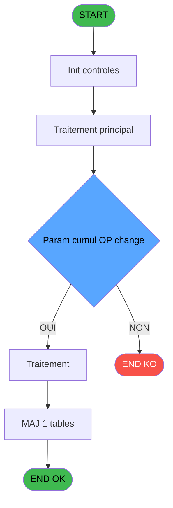

Generate a complete Zustand store for the "deviseSession" domain.

RULES (MANDATORY):
- Use import aliases: @/ for src root (e.g. @/stores/..., @/types/...)
- NEVER use `any` type - use `unknown` or precise types
- Tailwind v4 classes for styling (no tailwind.config.js)
- Arrow functions everywhere (no function declarations)
- `as const` instead of TypeScript enum
- verbatimModuleSyntax is enabled: use `import type { X }` ONLY for types/interfaces, use `import { X }` for values/consts
- File must be COMPLETE and ready to write - NO placeholders, NO TODOs, NO "// implement here"
- NO comments except for genuinely complex logic
- Output ONLY the code inside a single markdown code block (```typescript ... ``` or ```tsx ... ```)

SHARED INFRASTRUCTURE (use these exact imports):
- Data source toggle: `import { useDataSourceStore } from "@/stores/dataSourceStore"` (has .getState().isRealApi)
- API client: `import { apiClient } from "@/services/api/apiClient"` and `import type { ApiResponse } from "@/services/api/apiClient"`
- Screen layout: `import { ScreenLayout } from "@/components/layout"` (wrapper with sidebar, takes children + className)
- UI components: `import { Button, Dialog, Input } from "@/components/ui"`
- cn utility: `import { cn } from "@/lib/utils"`

STORE REQUIREMENTS:
- Use `create` from zustand (import { create } from "zustand")
- Import types from @/types/deviseSession
- Import useDataSourceStore from @/stores/dataSourceStore
- Mock/API branching via useDataSourceStore.getState().isRealApi
- try/catch with `e instanceof Error` for error handling
- Realistic mock data (not lorem ipsum)
- EVERY business rule from the analysis MUST be implemented
- Include reset() action to clear state

TYPES FILE (already generated):
import type { ApiResponse } from "@/services/api/apiClient";

export interface DeviseSession {
  codeDevise: string;
  modePaiement: string;
  quand: string;
  type: string;
  quantite: number;
  cumulOpChange: boolean;
}

export interface UpdateDeviseSes sionRequest {
  codeDevise: string;
  modePaiement: string;
  quand: string;
  type: string;
  quantite: number;
  cumulOpChange: boolean;
}

export type UpdateDeviseSes sionResponse = void;

export interface DeviseSes sionState {
  isLoading: boolean;
  error: string | null;
  updateDeviseSession: (
    codeDevise: string,
    modePaiement: string,
    quand: string,
    type: string,
    quantite: number,
    cumulOpChange: boolean
  ) => Promise<void>;
}

ANALYSIS DOCUMENT:
{
  "domain": "deviseSession",
  "domainPascal": "DeviseSession",
  "complexity": "LOW",
  "entities": [
    {
      "name": "DeviseSession",
      "fields": [
        {
          "name": "codeDevise",
          "type": "string",
          "source": "gestion_devise_session.code_devise",
          "nullable": false
        },
        {
          "name": "modePaiement",
          "type": "string",
          "source": "gestion_devise_session.mode_paiement",
          "nullable": false
        },
        {
          "name": "quand",
          "type": "string",
          "source": "gestion_devise_session.quand",
          "nullable": false
        },
        {
          "name": "type",
          "type": "string",
          "source": "gestion_devise_session.type",
          "nullable": false
        },
        {
          "name": "quantite",
          "type": "number",
          "source": "gestion_devise_session.quantite",
          "nullable": false
        },
        {
          "name": "cumulOpChange",
          "type": "boolean",
          "source": "gestion_devise_session.cumul_op_change",
          "nullable": false
        }
      ]
    }
  ],
  "stateFields": [
    {
      "name": "isLoading",
      "type": "boolean",
      "default": "false"
    },
    {
      "name": "error",
      "type": "string | null",
      "default": "null"
    }
  ],
  "actions": [
    {
      "name": "updateDeviseSession",
      "params": [
        "codeDevise: string",
        "modePaiement: string",
        "quand: string",
        "type: string",
        "quantite: number",
        "cumulOpChange: boolean"
      ],
      "businessRules": [
        "RM-001: If cumulOpChange is false, overwrite quantity; otherwise accumulate quantity to existing session record"
      ],
      "returns": "Promise<void>"
    }
  ],
  "apiEndpoints": [
    {
      "method": "PUT",
      "path": "/api/caisse/devise-session",
      "queryParams": [],
      "response": "void"
    }
  ],
  "uiLayout": {
    "type": "no-ui",
    "sections": [],
    "description": "Backend-only Web Service program with no visible UI. Called by 11 programs after significant devise operations to synchronize gestion_devise_session table."
  },
  "mockData": {
    "count": 0,
    "description": "No mock data required - backend-only service program"
  },
  "dependencies": {
    "stores": [
      "useSessionStore"
    ],
    "sharedTypes": [
      "DeviseSession"
    ],
    "externalApis": []
  }
}

SPEC EXCERPT (business rules):
# ADH IDE 142 - Devise update session WS

> **Analyse**: Phases 1-4 2026-02-08 03:27 -> 03:27 (4s) | Assemblage 03:27
> **Pipeline**: V7.2 Enrichi
> **Structure**: 4 onglets (Resume | Ecrans | Donnees | Connexions)

<!-- TAB:Resume -->

## 1. FICHE D'IDENTITE

| Attribut | Valeur |
|----------|--------|
| Projet | ADH |
| IDE Position | 142 |
| Nom Programme | Devise update session WS |
| Fichier source | `Prg_142.xml` |
| Dossier IDE | Caisse |
| Taches | 1 (0 ecrans visibles) |
| Tables modifiees | 1 |
| Programmes appeles | 0 |
| Complexite | **BASSE** (score 7/100) |

## 2. DESCRIPTION FONCTIONNELLE

ADH IDE 142 est un programme utilitaire responsable de la mise à jour de l'enregistrement de session de devise (gestion_devise_session). Il agit comme un point d'accès centralisé pour synchroniser l'état des devises manipulées durant une session de caisse. C'est un programme critique dans le flux de gestion des espèces, appelé à de multiples points du cycle caisse (ouverture, fermeture, contrôle d'écarts, remise en caisse).

Sa position stratégique dans l'architecture montre qu'il encapsule la logique de persistance pour les opérations de devise. Les 11 appelants (de IDE 120 à IDE 299) indiquent que ce programme est invoqué après chaque opération significative affectant le status des devises en session. Cela garantit que la table gestion_devise_session reste toujours synchronisée avec l'état réel de la caisse.

Le programme gère probablement plusieurs cas : initialisation de nouvelle devise en session, mise à jour des montants, modifications de statut (actif/fermé/contrôlé). Sa réutilisation systématique plutôt que des mises à jour directes dans chaque appelant reflète un principe de responsabilité unique bien appliqué — ADH IDE 142 centralise toute la logique métier de persistance devise pour éviter la duplication et les incohérences.

## 3. BLOCS FONCTIONNELS

## 5. REGLES METIER

1 regles identifiees:

### Autres (1 regles)

#### <a id="rm-RM-001"></a>[RM-001] Negation de (Param cumul OP change [F]) (condition inversee)

| Element | Detail |
|---------|--------|
| **Condition** | `NOT (Param cumul OP change [F])` |
| **Si vrai** | Action si vrai |
| **Variables** | ES (Param cumul OP change) |
| **Expression source** | Expression 8 : `NOT (Param cumul OP change [F])` |
| **Exemple** | Si NOT (Param cumul OP change [F]) → Action si vrai |

## 6. CONTEXTE

- **Appele par**: [Controle fermeture caisse WS (IDE 155)](ADH-IDE-155.md), [Fermeture caisse (IDE 131)](ADH-IDE-131.md), [Calcul solde initial WS (IDE 126)](ADH-IDE-126.md), [Gestion caisse 142 (IDE 298)](ADH-IDE-298.md), [Saisie contenu caisse (IDE 120)](ADH-IDE-120.md), [Ouverture caisse (IDE 122)](ADH-IDE-122.md), [Calcul solde ouverture WS (IDE 127)](ADH-IDE-127.md), [Ecart ouverture caisse (IDE 129)](ADH-IDE-129.md), [Ecart fermeture caisse (IDE 130)](ADH-IDE-130.md), [Fermeture caisse 144 (IDE 299)](ADH-IDE-299.md), [Remise en caisse (IDE 125)](ADH-IDE-125.md)
- **Appelle**: 0 programmes | **Tables**: 1 (W:1 R:0 L:0) | **Taches**: 1 | **Expressions**: 9

<!-- TAB:Ecrans -->

## 8. ECRANS

*(Programme sans ecran visible)*

## 9. NAVIGATION

### 9.3 Structure hierarchique (0 tache)

| Position | Tache | Type | Dimensions | Bloc |
|----------|-------|------|------------|------|

### 9.4 Algorigramme



> **Legende**: Vert = START/END OK | Rouge = END KO | Bleu = Decisions
> *Algorigramme auto-genere. Utiliser `/algorigramme` pour une synthese metier detaillee.*

<!-- TAB:Donnees -->

## 10. TABLES

### Tables utilisees (1)

| ID | Nom | Description | Type | R | W | L | Usages |
|----|-----|-------------|------|---|---|---|--------|
| 232 | gestion_devise_session | Sessions de caisse | DB |   | **W** |   | 1 |

### Colonnes par table (1 / 1 tables avec colonnes identifiees)

<details>
<summary>Table 232 - gestion_devise_session (**W**) - 1 usages</summary>

| Lettre | Variable | Acces | Type |
|--------|----------|-------|------|
| A | Param Code devise | W | Alpha |
| B | Param mode paiement | W | Alpha |
| C | Param Quand | W | Alpha |
| D | Param Type | W | Alpha |
| E | Param Quantite | W | Numeric |
| F | Param cumul OP change | W | Logical |

</details>

## 11. VARIABLES

### 11.1 Autres (6)

Variables diverses.

| Lettre | Nom | Type | Usage dans |
|--------|-----|------|-----------|
| EN | Param Code devise | Alpha | 1x refs |
| EO | Param mode paiement | Alpha | 1x refs |
| EP | Param Quand | Alpha | 1x refs |
| EQ | Param Type | Alpha | 1x refs |
| ER | Param Quantite | Numeric | 2x refs |
| ES | Param cumul OP change | Logical | 2x refs |

## 12. EXPRESSIONS

**9 / 9 expressions decodees (100%)**

### 12.1 Repartition par type

| Type | Expressions | Regles |
|------|-------------|--------|
| CALCULATION | 1 | 0 |
| NEGATION | 1 | 5 |
| REFERENCE_VG | 1 | 0 |
| OTHER | 6 | 0 |

### 12.2 Expressions cles par type

#### CALCULATION (1 expressions)

| Type | IDE | Expression | Regle |
|------|-----|------------|-------|
| CALCULATION | 7 | `[L]+Param Quantite [E]` | - |

#### NEGATION (1 expressions)

| Type | IDE | Expression | Regle |
|------|-----|------------|-------|
| NEGATION | 8 | `NOT (Param cumul OP change [F])` | [RM-001](#rm-RM-001) |

#### REFERENCE_VG (1 expressions)

| Type | IDE | Expression | Regle |
|------|-----|------------|-------|
| REFERENCE_VG | 1 | `VG1` | - |

#### OTHER (6 expressions)

| Type | IDE | Expression | Regle |
|------|-----|------------|-------|
| OTHER | 5 | `Para

REFERENCE PATTERN (follow this exact structure):
```typescript
import { create } from 'zustand';
import type {
  ExtraitAccountInfo,
  ExtraitTransaction,
  ExtraitSummary,
  ExtraitPrintFormat,
} from '@/types/extrait';
import { extraitApi } from '@/services/api/endpoints-lot3';
import { useDataSourceStore } from './dataSourceStore';

interface ExtraitState {
  selectedAccount: ExtraitAccountInfo | null;
  transactions: ExtraitTransaction[];
  summary: ExtraitSummary | null;
  searchResults: ExtraitAccountInfo[];
  isSearching: boolean;
  isLoadingExtrait: boolean;
  isPrinting: boolean;
  error: string | null;
}

interface ExtraitActions {
  searchAccount: (societe: string, query: string) => Promise<void>;
  selectAccount: (account: ExtraitAccountInfo) => void;
  loadExtrait: (
    societe: string,
    codeAdherent: number,
    filiation: number,
    dateDebut?: string,
    dateFin?: string,
  ) => Promise<void>;
  printExtrait: (
    societe: string,
    codeAdherent: number,
    filiation: number,
    format: ExtraitPrintFormat,
  ) => Promise<void>;
  reset: () => void;
}

type ExtraitStore = ExtraitState & ExtraitActions;

const MOCK_ACCOUNTS: ExtraitAccountInfo[] = [
  { societe: 'SOC1', codeAdherent: 1001, filiation: 0, nom: 'DUPONT', prenom: 'Jean', statut: 'normal', hasGiftPass: false },
  { societe: 'SOC1', codeAdherent: 1002, filiation: 0, nom: 'MARTIN', prenom: 'Sophie', statut: 'normal', hasGiftPass: true },
  { societe: 'SOC1', codeAdherent: 1003, filiation: 1, nom: 'DURAND', prenom: 'Pierre', statut: 'bloque', hasGiftPass: false },
];

const MOCK_TRANSACTIONS: ExtraitTransaction[] = [
  { id: 1, date: '2026-02-10', heure: '09:15', libelle: 'Achat boutique', debit: 45.50, credit: 0, solde: -45.50, codeService: 'BTQ', codeImputation: 'IMP01', giftPassFlag: false, nbArticles: 3, status: 'debit', numeroPiece: 'VTE-001', modePaiement: 'CB', caissier: 'MARTIN S.' },
  { id: 2, date: '2026-02-10', heure: '14:30', libelle: 'Credit compte', debit: 0, credit: 200, solde: 154.50, codeService: 'CAI', codeImputation: 'IMP02', giftPassFlag: false, status: 'credit', numeroPiece: 'CRD-042', modePaiement: 'Especes', caissier: 'DUPONT J.' },
  { id: 3, date: '2026-02-09', heure: '12:45', libelle: 'Repas restaurant', libelleSupplementaire: 'Menu du jour', debit: 32.00, credit: 0, solde: 122.50, codeService: 'RST', codeImputation: 'IMP03', giftPassFlag: true, nbArticles: 1, status: 'debit', numeroPiece: 'RST-117', modePaiement: 'GiftPass', caissier: 'MARTIN S.' },
  { id: 4, date: '2026-02-08', heure: '16:00', libelle: 'Annulation vente', debit: 0, credit: 15.00, solde: 154.50, codeService: 'BTQ', codeImputation: 'IMP01', giftPassFlag: false, status: 'annule', numeroPiece: 'ANN-003', modePaiement: 'CB', caissier: 'DUPONT J.', commentaire: 'Erreur de saisie' },
  { id: 5, date: '2026-02-08', heure: '10:20', libelle: 'Regularisation solde', debit: 0, credit: 5.00, solde: 139.50, codeService: 'CAI', codeImputation: 'IMP02', giftPassFlag: false, status: 'regularise', numeroPiece: 'REG-007', modePaiement: 'Interne', caissier: 'ADMIN' },
];

const MOCK_SUMMARY: ExtraitSummary = {
  totalDebit: 77.50,
  totalCredit: 220,
  soldeActuel: 142.50,
  nbTransactions: 5,
};

const initialState: ExtraitState = {
  selectedAccount: null,
  transactions: [],
  summary: null,
  searchResults: [],
  isSearching: false,
  isLoadingExtrait: false,
  isPrinting: false,
  error: null,
};

export const useExtraitStore = create<ExtraitStore>()((set) => ({
  ...initialState,

  searchAccount: async (societe, query) => {
    const { isRealApi } = useDataSourceStore.getState();
    set({ isSearching: true, error: null });

    if (!isRealApi) {
      const filtered = MOCK_ACCOUNTS.filter(
        (a) =>
          a.nom.toLowerCase().includes(query.toLowerCase()) ||
          a.prenom.toLowerCase().includes(query.toLowerCase()) ||
          String(a.codeAdherent).includes(query),
      );
      set({ searchResults: filtered, isSearching: false });
      return;
    }

    try {
      const response = await extraitApi.searchAccount(societe, query);
      set({ searchResults: response.data.data ?? [] });
    } catch (e: unknown) {
      const message = e instanceof Error ? e.message : 'Erreur recherche compte';
      set({ searchResults: [], error: message });
    } finally {
      set({ isSearching: false });
    }
  },

  selectAccount: (account) => {
    set({ selectedAccount: account, transactions: [], summary: null, error: null });
  },

  loadExtrait: async (societe, codeAdherent, filiation, dateDebut, dateFin) => {
    const { isRealApi } = useDataSourceStore.getState();
    set({ isLoadingExtrait: true, error: null });

    if (!isRealApi) {
      set({
        transactions: MOCK_TRANSACTIONS,
        summary: MOCK_SUMMARY,
        isLoadingExtrait: false,
      });
      return;
    }

    try {
      const response = await extraitApi.getExtrait(
        societe,
        codeAdherent,
        filiation,
        dateDebut,
        dateFin,
      );
      const data = response.data.data;
      set({
        transactions: data?.transactions ?? [],
        summary: data?.summary ?? null,
      });
    } catch (e: unknown) {
      const message = e instanceof Error ? e.message : 'Erreur chargement extrait';
      set({ transactions: [], summary: null, error: message });
    } finally {
      set({ isLoadingExtrait: false });
    }
  },

  printExtrait: async (societe, codeAdherent, filiation, format) => {
    const { isRealApi } = useDataSourceStore.getState();
    set({ isPrinting: true, error: null });

    if (!isRealApi) {
      set({ isPrinting: false });
      return;
    }

    try {
      await extraitApi.printExtrait({
        societe,
        codeAdherent,
        filiation,
        format,
      });
    } catch (e: unknown) {
      const message = e instanceof Error ? e.message : 'Erreur impression';
      set({ error: message });
    } finally {
      set({ isPrinting: false });
    }
  },

  reset: () => set({ ...initialState }),
}));

```