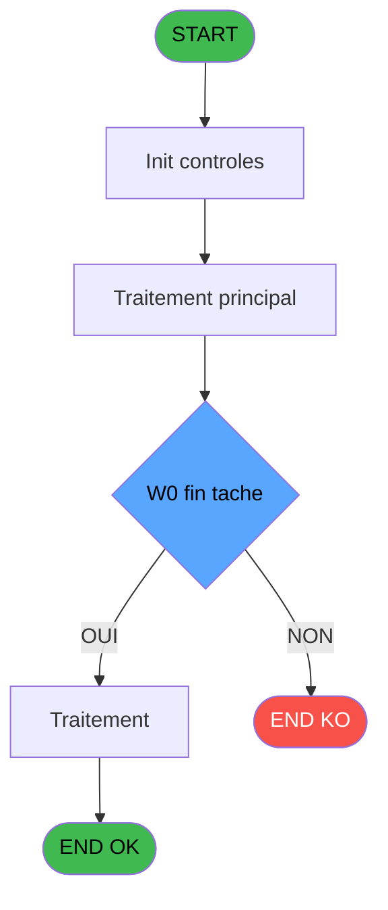

You are a software architect producing a design document for migrating a Magic Unipaas program to React/TypeScript.

Produce a JSON document following this EXACT structure:
```json
{
  "domain": "camelCaseDomainName",
  "domainPascal": "PascalCaseDomainName",
  "complexity": "LOW|MEDIUM|HIGH",
  "entities": [
    {
      "name": "EntityName",
      "fields": [
        {
          "name": "fieldName",
          "type": "string|number|boolean|Date",
          "source": "table.column",
          "nullable": false
        }
      ]
    }
  ],
  "stateFields": [
    {
      "name": "fieldName",
      "type": "TypeName[]",
      "default": "[]"
    }
  ],
  "actions": [
    {
      "name": "actionName",
      "params": [
        "param: type"
      ],
      "businessRules": [
        "Rule description"
      ],
      "returns": "Promise<void>"
    }
  ],
  "apiEndpoints": [
    {
      "method": "GET",
      "path": "/api/domain/resource",
      "queryParams": [
        "param?"
      ],
      "response": "ResponseType"
    }
  ],
  "uiLayout": {
    "type": "page-type",
    "sections": [
      {
        "name": "sectionName",
        "controls": [
          "control1"
        ]
      }
    ]
  },
  "mockData": {
    "count": 5,
    "description": "Description of mock data"
  },
  "dependencies": {
    "stores": [
      "useDataSourceStore"
    ],
    "sharedTypes": [],
    "externalApis": []
  }
}
```

IMPORTANT:
- Derive entity fields from actual DB column types when DB metadata is available
- Each business rule from the spec/contract MUST map to an action
- API endpoints should follow existing patterns: /api/{domain}/{resource}
- State fields must cover ALL data the UI needs to display
- Include isLoading, error, and filter states

PROGRAM SPEC:
# ADH IDE 138 - Ticket fermeture session

> **Analyse**: Phases 1-4 2026-02-08 03:18 -> 03:18 (4s) | Assemblage 03:18
> **Pipeline**: V7.2 Enrichi
> **Structure**: 4 onglets (Resume | Ecrans | Donnees | Connexions)

<!-- TAB:Resume -->

## 1. FICHE D'IDENTITE

| Attribut | Valeur |
|----------|--------|
| Projet | ADH |
| IDE Position | 138 |
| Nom Programme | Ticket fermeture session |
| Fichier source | `Prg_138.xml` |
| Dossier IDE | Caisse |
| Taches | 23 (0 ecrans visibles) |
| Tables modifiees | 0 |
| Programmes appeles | 4 |
| Complexite | **BASSE** (score 18/100) |

## 2. DESCRIPTION FONCTIONNELLE

Le programme ADH IDE 138 assure la génération d'un tableau récapitulatif pour la clôture de session. Il traite les données de fermeture de caisse (montants par mode de paiement, devises, articles) en construisant une synthèse structurée à partir de 25 paramètres d'entrée couvrant les montants (cartes, chèques, OD), les devises avec taux de change, et les informations de facturation (date comptable, numéro session, imputation). Le programme effectue une seule tâche sans écran visible, opérant en mode traitement batch avec calcul d'index sur la table temporaire `pv_discounts`.

Bien que statué comme orphelin potentiel (aucun caller direct identifié), ce programme doit logiquement être appelé depuis les modules de fermeture caisse (ADH IDE 131, 299) ou de réimpression de tickets (IDE 151) pour consigner les récapitulatifs de session. Il lit exclusivement la table `devise_in` (taux de change) sans écriture dans les tables permanentes, ce qui le positionne comme un utilitaire de mise en forme de données pour les rapports ou écrans de récapitulation.

Son intégration dans la migration se fera par transformation des 30 expressions (principalement des références de paramètres et une formule de calcul `[AA]+1`) en logique applicative C#, sans dépendance critique à d'autres programmes, rendant sa complexité faible et son impact de migration limité.

## 3. BLOCS FONCTIONNELS

## 5. REGLES METIER

3 regles identifiees:

### Autres (3 regles)

#### <a id="rm-RM-001"></a>[RM-001] Condition: W0 fin tache [V] egale 'F'

| Element | Detail |
|---------|--------|
| **Condition** | `W0 fin tache [V]='F'` |
| **Si vrai** | Action si vrai |
| **Variables** | FI (W0 fin tache) |
| **Expression source** | Expression 6 : `W0 fin tache [V]='F'` |
| **Exemple** | Si W0 fin tache [V]='F' → Action si vrai |

#### <a id="rm-RM-002"></a>[RM-002] Verification que l'imprimante courante est la n1

| Element | Detail |
|---------|--------|
| **Condition** | `GetParam ('CURRENTPRINTERNUM')=1` |
| **Si vrai** | Action si CURRENTPRINTERNUM = 1 |
| **Expression source** | Expression 7 : `GetParam ('CURRENTPRINTERNUM')=1` |
| **Exemple** | Si GetParam ('CURRENTPRINTERNUM')=1 → Action si CURRENTPRINTERNUM = 1 |

#### <a id="rm-RM-003"></a>[RM-003] Verification que l'imprimante courante est la n9

| Element | Detail |
|---------|--------|
| **Condition** | `GetParam ('CURRENTPRINTERNUM')=9` |
| **Si vrai** | Action si CURRENTPRINTERNUM = 9 |
| **Expression source** | Expression 8 : `GetParam ('CURRENTPRINTERNUM')=9` |
| **Exemple** | Si GetParam ('CURRENTPRINTERNUM')=9 → Action si CURRENTPRINTERNUM = 9 |

## 6. CONTEXTE

- **Appele par**: [Fermeture caisse (IDE 131)](ADH-IDE-131.md), [Reimpression tickets fermeture (IDE 151)](ADH-IDE-151.md), [Fermeture caisse 144 (IDE 299)](ADH-IDE-299.md)
- **Appelle**: 4 programmes | **Tables**: 8 (W:0 R:6 L:3) | **Taches**: 23 | **Expressions**: 10

<!-- TAB:Ecrans -->

## 8. ECRANS

*(Programme sans ecran visible)*

## 9. NAVIGATION

### 9.3 Structure hierarchique (0 tache)

| Position | Tache | Type | Dimensions | Bloc |
|----------|-------|------|------------|------|

### 9.4 Algorigramme



> **Legende**: Vert = START/END OK | Rouge = END KO | Bleu = Decisions
> *Algorigramme auto-genere. Utiliser `/algorigramme` pour une synthese metier detaillee.*

<!-- TAB:Donnees -->

## 10. TABLES

### Tables utilisees (8)

| ID | Nom | Description | Type | R | W | L | Usages |
|----|-----|-------------|------|---|---|---|--------|
| 463 | heure_de_passage |  | DB | R |   | L | 3 |
| 693 | devise_in | Devises / taux de change | DB | R |   |   | 6 |
| 266 | cc_comptable |  | DB | R |   |   | 3 |
| 30 | gm-recherche_____gmr | Index de recherche | DB | R |   |   | 2 |
| 70 | date_comptable___dat |  | DB | R |   |   | 1 |
| 249 | histo_sessions_caisse_detail | Sessions de caisse | DB | R |   |   | 1 |
| 513 | pv_invoiceprintfiliationtmp | Services / filieres | TMP |   |   | L | 4 |
| 511 | pv_invoicedisplaytmp |  | TMP |   |   | L | 2 |

### Colonnes par table (6 / 6 tables avec colonnes identifiees)

<details>
<summary>Table 463 - heure_de_passage (R/L) - 3 usages</summary>

| Lettre | Variable | Acces | Type |
|--------|----------|-------|------|
| FN | W0 heure debut session | R | Time |

</details>

<details>
<summary>Table 693 - devise_in (R) - 6 usages</summary>

| Lettre | Variable | Acces | Type |
|--------|----------|-------|------|
| ER | P0 devise locale | R | Alpha |

</details>

<details>
<summary>Table 266 - cc_comptable (R) - 3 usages</summary>

| Lettre | Variable | Acces | Type |
|--------|----------|-------|------|
| A | W1 cumul quantite | R | Numeric |
| B | W1 cumul montant | R | Numeric |
| C | W1 total montant | R | Numeric |
| D | W1 equivalent | R | Numeric |

</details>

<details>
<summary>Table 30 - gm-recherche_____gmr (R) - 2 usages</summary>

| Lettre | Variable | Acces | Type |
|--------|----------|-------|------|
| A | W1 sous total montant | R | Numeric |
| B | W1 total montant | R | Numeric |

</details>

<details>
<summary>Table 70 - date_comptable___dat (R) - 1 usages</summary>

| Lettre | Variable | Acces | Type |
|--------|----------|-------|------|
| EU | P0 date comptable | R | Date |
| FB | W0 date comptable | R | Date |
| FM | W0 date debut session | R | Date |

</details>

<details>
<summary>Table 249 - histo_sessions_caisse_detail (R) - 1 usages</summary>

| Lettre | Variable | Acces | Type |
|--------|----------|-------|------|
| EW | Edition detaillee | R | Logical |
| EX | W0 caisse depart | R | Numeric |
| EZ | W0 pièce caisse Rec | R | Numeric |
| FA | W0 pièce caisse Dep | R | Numeric |

</details>

## 11. VARIABLES

### 11.1 Parametres entrants (9)

Variables recues du programme appelant ([Fermeture caisse (IDE 131)](ADH-IDE-131.md)).

| Lettre | Nom | Type | Usage dans |
|--------|-----|------|-----------|
| EN | P0 societe | Alpha | - |
| EO | P0 nbre decimales | Numeric | - |
| EP | P0 nom village | Alpha | - |
| EQ | P0 masque cumul | Alpha | - |
| ER | P0 devise locale | Alpha | - |
| ES | P0 Uni/Bilateral | Alpha | - |
| ET | P0 village TAI | Alpha | - |
| EU | P0 date comptable | Date | - |
| EV | P0 session | Numeric | - |

### 11.2 Variables de travail (17)

Variables internes au programme.

| Lettre | Nom | Type | Usage dans |
|--------|-----|------|-----------|
| EX | W0 caisse depart | Numeric | - |
| EY | W0 apport coffre | Numeric | - |
| EZ | W0 pièce caisse Rec | Numeric | - |
| FA | W0 pièce caisse Dep | Numeric | - |
| FB | W0 date comptable | Date | - |
| FC | W0 versement | Numeric | - |
| FD | W0 retrait | Numeric | - |
| FE | W0 solde cash | Numeric | - |
| FF | W0 solde carte | Numeric | - |
| FG | W0 change | Numeric | - |
| FH | W0 frais de change | Numeric | - |
| FI | W0 fin tache | Alpha | 1x calcul interne |
| FJ | W0 Existe Carnet Bar | Logical | - |
| FK | W0 Existe TAI | Logical | - |
| FL | W0 titr

CONTRACT:
{
  "program": {
    "id": 138,
    "name": "",
    "complexity": "MEDIUM",
    "callers": [],
    "callees": [],
    "tasksCount": 23,
    "tablesCount": 0,
    "expressionsCount": 10
  },
  "rules": [
    {
      "id": "RM-001",
      "description": "Condition: W0 fin tache [V] egale 'F'",
      "condition": "W0 fin tache [V]='F'",
      "variables": [
        "FI"
      ],
      "status": "IMPL",
      "targetFile": "adh-web/src/stores/saisieContenuCaisseStore.ts",
      "gapNotes": ""
    },
    {
      "id": "RM-002",
      "description": "Verification que l'imprimante courante est la n1",
      "condition": "GetParam ('CURRENTPRINTERNUM')=1",
      "variables": [],
      "status": "IMPL",
      "targetFile": "adh-web/src/services/printer/generators/ouvertureTicketGenerator.ts",
      "gapNotes": ""
    },
    {
      "id": "RM-003",
      "description": "Verification que l'imprimante courante est la n9",
      "condition": "GetParam ('CURRENTPRINTERNUM')=9",
      "variables": [],
      "status": "IMPL",
      "targetFile": "adh-web/src/__tests__/approTicketStore.test.ts",
      "gapNotes": ""
    }
  ],
  "tables": [
    {
      "id": 463,
      "name": "heure_de_passage",
      "mode": "R",
      "status": "MISSING",
      "targetFile": "",
      "gapNotes": ""
    },
    {
      "id": 693,
      "name": "devise_in",
      "mode": "R",
      "status": "IMPL",
      "targetFile": "adh-web/src/components/caisse/transaction/schemas.ts",
      "gapNotes": ""
    },
    {
      "id": 266,
      "name": "cc_comptable",
      "mode": "R",
      "status": "MISSING",
      "targetFile": "",
      "gapNotes": ""
    },
    {
      "id": 30,
      "name": "gm-recherche_____gmr",
      "mode": "R",
      "status": "MISSING",
      "targetFile": "",
      "gapNotes": ""
    },
    {
      "id": 70,
      "name": "date_comptable___dat",
      "mode": "R",
      "status": "IMPL",
      "targetFile": "adh-web/src/components/caisse/sessionOuverture/SuccesPanel.tsx",
      "gapNotes": ""
    },
    {
      "id": 249,
      "name": "histo_sessions_caisse_detail",
      "mode": "R",
      "status": "MISSING",
      "targetFile": "",
      "gapNotes": ""
    },
    {
      "id": 513,
      "name": "pv_invoiceprintfiliationtmp",
      "mode": "R",
      "status": "MISSING",
      "targetFile": "",
      "gapNotes": ""
    },
    {
      "id": 511,
      "name": "pv_invoicedisplaytmp",
      "mode": "R",
      "status": "MISSING",
      "targetFile": "",
      "gapNotes": ""
    }
  ],
  "callees": [
    {
      "id": 43,
      "name": "Recuperation du titre",
      "calls": 1,
      "context": "Recuperation donnees",
      "status": "MISSING",
      "target": "",
      "gapNotes": ""
    },
    {
      "id": 179,
      "name": "Get Printer",
      "calls": 1,
      "context": "Impression ticket/document",
      "status": "N/A",
      "target": "",
      "gapNotes": "Legacy print/utility (N/A for web)"
    },
    {
      "id": 181,
      "name": "Set Listing Number",
      "calls": 1,
      "context": "Configuration impression",
      "status": "N/A",
      "target": "",
      "gapNotes": "Legacy print/utility (N/A for web)"
    },
    {
      "id": 182,
      "name": "Raz Current Printer",
      "calls": 1,
      "context": "Impression ticket/document",
      "status": "N/A",
      "target": "",
      "gapNotes": "Legacy print/utility (N/A for web)"
    }
  ],
  "variables": [
    {
      "localId": "FI",
      "name": "W0 fin tache",
      "type": "Real",
      "status": "MISSING",
      "targetFile": "",
      "gapNotes": ""
    }
  ]
}