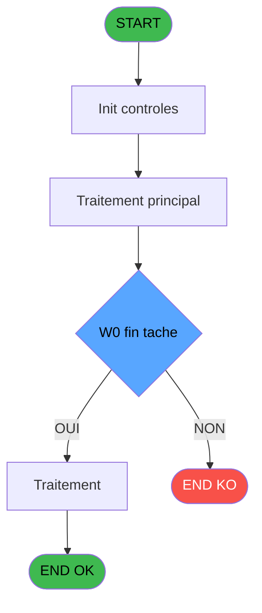

Generate a complete Zustand store for the "ticketFermetureSession" domain.

RULES (MANDATORY):
- Use import aliases: @/ for src root (e.g. @/stores/..., @/types/...)
- NEVER use `any` type - use `unknown` or precise types
- Tailwind v4 classes for styling (no tailwind.config.js)
- Arrow functions everywhere (no function declarations)
- `as const` instead of TypeScript enum
- verbatimModuleSyntax is enabled: use `import type { X }` ONLY for types/interfaces, use `import { X }` for values/consts
- File must be COMPLETE and ready to write - NO placeholders, NO TODOs, NO "// implement here"
- NO comments except for genuinely complex logic
- Output ONLY the code inside a single markdown code block (```typescript ... ``` or ```tsx ... ```)

SHARED INFRASTRUCTURE (use these exact imports):
- Data source toggle: `import { useDataSourceStore } from "@/stores/dataSourceStore"` (has .getState().isRealApi)
- API client: `import { apiClient } from "@/services/api/apiClient"` and `import type { ApiResponse } from "@/services/api/apiClient"`
- Screen layout: `import { ScreenLayout } from "@/components/layout"` (wrapper with sidebar, takes children + className)
- UI components: `import { Button, Dialog, Input } from "@/components/ui"`
- cn utility: `import { cn } from "@/lib/utils"`

STORE REQUIREMENTS:
- Use `create` from zustand (import { create } from "zustand")
- Import types from @/types/ticketFermetureSession
- Import useDataSourceStore from @/stores/dataSourceStore
- Mock/API branching via useDataSourceStore.getState().isRealApi
- try/catch with `e instanceof Error` for error handling
- Realistic mock data (not lorem ipsum)
- EVERY business rule from the analysis MUST be implemented
- Include reset() action to clear state

TYPES FILE (already generated):
import type { ApiResponse } from "@/services/api/apiClient";

export interface RecapFermetureSession {
  societe: string;
  session: number;
  dateComptable: Date;
  heureDebutSession: string;
  caisseDepart: number;
  apportCoffre: number;
  versement: number;
  retrait: number;
  soldeCash: number;
  soldeCarte: number;
  change: number;
  fraisChange: number;
  deviseLocale: string;
  nomVillage: string;
  editionDetaillee: boolean;
}

export interface MontantComptable {
  cumulQuantite: number;
  cumulMontant: number;
  totalMontant: number;
  equivalent: number;
}

export interface TicketFermetureSessionState {
  recapData: RecapFermetureSession | null;
  montantsComptables: MontantComptable[];
  isLoading: boolean;
  error: string | null;
  finTache: string;
  printerNum: number;
}

export interface LoadRecapDataRequest {
  societe: string;
  session: number;
}

export interface LoadRecapDataResponse extends ApiResponse<RecapFermetureSession> {}

export interface LoadMontantsRequest {
  societe: string;
  session: number;
}

export interface LoadMontantsResponse extends ApiResponse<MontantComptable[]> {}

export interface GenerateTicketRequest {
  societe: string;
  session: number;
  dateComptable: Date;
  printerNum: number;
}

export interface GenerateTicketResponse extends ApiResponse<void> {}

export interface ValidateFinTacheRequest {
  finTache: string;
}

export interface ValidateFinTacheResponse extends ApiResponse<boolean> {}

export interface SelectPrinterRequest {
  printerNum: number;
}

export type PrinterOption = 1 | 9;

export const PRINTER_OPTIONS = {
  PRIMARY: 1,
  SECONDARY: 9,
} as const;

export const BUSINESS_RULES = {
  FIN_TACHE_VALIDATION: 'RM-001: Vérifier que W0_fin_tache === "F" avant de procéder',
  PRIMARY_PRINTER: 'RM-002: Si CURRENTPRINTERNUM === 1, utiliser l\'imprimante principale',
  SECONDARY_PRINTER: 'RM-003: Si CURRENTPRINTERNUM === 9, utiliser l\'imprimante secondaire',
} as const;

ANALYSIS DOCUMENT:
{
  "domain": "ticketFermetureSession",
  "domainPascal": "TicketFermetureSession",
  "complexity": "LOW",
  "entities": [
    {
      "name": "RecapFermetureSession",
      "fields": [
        {
          "name": "societe",
          "type": "string",
          "source": "parameter.P0_societe",
          "nullable": false
        },
        {
          "name": "session",
          "type": "number",
          "source": "parameter.P0_session",
          "nullable": false
        },
        {
          "name": "dateComptable",
          "type": "Date",
          "source": "date_comptable___dat.P0_date_comptable",
          "nullable": false
        },
        {
          "name": "heureDebutSession",
          "type": "string",
          "source": "heure_de_passage.W0_heure_debut_session",
          "nullable": false
        },
        {
          "name": "caisseDepart",
          "type": "number",
          "source": "histo_sessions_caisse_detail.W0_caisse_depart",
          "nullable": false
        },
        {
          "name": "apportCoffre",
          "type": "number",
          "source": "parameter.W0_apport_coffre",
          "nullable": false
        },
        {
          "name": "versement",
          "type": "number",
          "source": "parameter.W0_versement",
          "nullable": false
        },
        {
          "name": "retrait",
          "type": "number",
          "source": "parameter.W0_retrait",
          "nullable": false
        },
        {
          "name": "soldeCash",
          "type": "number",
          "source": "parameter.W0_solde_cash",
          "nullable": false
        },
        {
          "name": "soldeCarte",
          "type": "number",
          "source": "parameter.W0_solde_carte",
          "nullable": false
        },
        {
          "name": "change",
          "type": "number",
          "source": "parameter.W0_change",
          "nullable": false
        },
        {
          "name": "fraisChange",
          "type": "number",
          "source": "parameter.W0_frais_de_change",
          "nullable": false
        },
        {
          "name": "deviseLocale",
          "type": "string",
          "source": "devise_in.P0_devise_locale",
          "nullable": false
        },
        {
          "name": "nomVillage",
          "type": "string",
          "source": "parameter.P0_nom_village",
          "nullable": false
        },
        {
          "name": "editionDetaillee",
          "type": "boolean",
          "source": "histo_sessions_caisse_detail.Edition_detaillee",
          "nullable": false
        }
      ]
    },
    {
      "name": "MontantComptable",
      "fields": [
        {
          "name": "cumulQuantite",
          "type": "number",
          "source": "cc_comptable.W1_cumul_quantite",
          "nullable": false
        },
        {
          "name": "cumulMontant",
          "type": "number",
          "source": "cc_comptable.W1_cumul_montant",
          "nullable": false
        },
        {
          "name": "totalMontant",
          "type": "number",
          "source": "cc_comptable.W1_total_montant",
          "nullable": false
        },
        {
          "name": "equivalent",
          "type": "number",
          "source": "cc_comptable.W1_equivalent",
          "nullable": false
        }
      ]
    }
  ],
  "stateFields": [
    {
      "name": "recapData",
      "type": "RecapFermetureSession | null",
      "default": "null"
    },
    {
      "name": "montantsComptables",
      "type": "MontantComptable[]",
      "default": "[]"
    },
    {
      "name": "isLoading",
      "type": "boolean",
      "default": "false"
    },
    {
      "name": "error",
      "type": "string | null",
      "default": "null"
    },
    {
      "name": "finTache",
      "type": "string",
      "default": "''"
    },
    {
      "name": "printerNum",
      "type": "number",
      "default": "1"
    }
  ],
  "actions": [
    {
      "name": "generateTicketFermeture",
      "params": [
        "societe: string",
        "session: number",
        "dateComptable: Date"
      ],
      "businessRules": [
        "RM-001: Vérifier que W0_fin_tache === 'F' avant de procéder",
        "RM-002: Si CURRENTPRINTERNUM === 1, utiliser l'imprimante principale",
        "RM-003: Si CURRENTPRINTERNUM === 9, utiliser l'imprimante secondaire"
      ],
      "returns": "Promise<void>"
    },
    {
      "name": "loadRecapData",
      "params": [
        "societe: string",
        "session: number"
      ],
      "businessRules": [
        "Charger les données depuis histo_sessions_caisse_detail",
        "Récupérer la devise locale depuis devise_in",
        "Calculer les montants comptables depuis cc_comptable"
      ],
      "returns": "Promise<RecapFermetureSession>"
    },
    {
      "name": "validateFinTache",
      "params": [
        "finTache: string"
      ],
      "businessRules": [
        "RM-001: Condition W0_fin_tache === 'F' doit être vraie pour continuer"
      ],
      "returns": "boolean"
    },
    {
      "name": "selectPrinter",
      "params": [
        "printerNum: number"
      ],
      "businessRules": [
        "RM-002: Si printerNum === 1, utiliser imprimante principale",
        "RM-003: Si printerNum === 9, utiliser imprimante secondaire"
      ],
      "returns": "void"
    }
  ],
  "apiEndpoints": [
    {
      "method": "GET",
      "path": "/api/ticketFermetureSession/recap",
      "queryParams": [
        "societe",
        "session"
      ],
      "response": "RecapFermetureSession"
    },
    {
      "method": "GET",
      "path": "/api/ticketFermetureSession/montants",
      "queryParams": [
        "societe",
        "session"
      ],
      "response": "MontantComptable[]"
    },
    {
      "method": "POST",
      "path": "/api/ticketFermetureSession/generate",
      "queryParams": [],
      "response": "void"
    }
  ],
  "uiLayout": {
    "type": "modal-dialog",
    "sections": [
      {
        "name": "header",
        "controls": [
          "SessionNumber (readonly)",
          "DateComptable (readonly)",
          "NomVillage (readonly)"
        ]
      },
      {
        "name": "montants",
        "controls": [
          "CaisseDepart (readonly)",
          "ApportCoffre (readonly)",
          "Versement (readonly)",
          "Retrait (readonly)",
          "SoldeCash (readonly)",
          "SoldeCarte (readonly)",
          "Change (readonly)",
          "FraisChange (readonly)"
        ]
      },
      {
        "name": "actions",
        "controls": [
          "PrinterSelector (dropdown: 1 ou 9)",
          "GenerateButton (primary)",
          "CancelButton (secondary)"
        ]
      }
    ]
  },
  "mockData": {
    "count": 3,
    "description": "3 sessions de fermeture avec montants variés (cash, carte, change) pour sociétés différentes, avec devises locales EUR/USD/CHF, édition détaillée activée/désactivée, et imprimantes 1 ou 9"
  },
  "dependencies": {
    "stores": [
      "usePrinterStore"
    ],
    "sharedTypes": [
      "DeviseInfo",
      "SessionInfo"
    ],
    "externalApis": [
      "/api/devise/taux",
      "/api/session/detail"
    ]
  }
}

SPEC EXCERPT (business rules):
# ADH IDE 138 - Ticket fermeture session

> **Analyse**: Phases 1-4 2026-02-08 03:18 -> 03:18 (4s) | Assemblage 03:18
> **Pipeline**: V7.2 Enrichi
> **Structure**: 4 onglets (Resume | Ecrans | Donnees | Connexions)

<!-- TAB:Resume -->

## 1. FICHE D'IDENTITE

| Attribut | Valeur |
|----------|--------|
| Projet | ADH |
| IDE Position | 138 |
| Nom Programme | Ticket fermeture session |
| Fichier source | `Prg_138.xml` |
| Dossier IDE | Caisse |
| Taches | 23 (0 ecrans visibles) |
| Tables modifiees | 0 |
| Programmes appeles | 4 |
| Complexite | **BASSE** (score 18/100) |

## 2. DESCRIPTION FONCTIONNELLE

Le programme ADH IDE 138 assure la génération d'un tableau récapitulatif pour la clôture de session. Il traite les données de fermeture de caisse (montants par mode de paiement, devises, articles) en construisant une synthèse structurée à partir de 25 paramètres d'entrée couvrant les montants (cartes, chèques, OD), les devises avec taux de change, et les informations de facturation (date comptable, numéro session, imputation). Le programme effectue une seule tâche sans écran visible, opérant en mode traitement batch avec calcul d'index sur la table temporaire `pv_discounts`.

Bien que statué comme orphelin potentiel (aucun caller direct identifié), ce programme doit logiquement être appelé depuis les modules de fermeture caisse (ADH IDE 131, 299) ou de réimpression de tickets (IDE 151) pour consigner les récapitulatifs de session. Il lit exclusivement la table `devise_in` (taux de change) sans écriture dans les tables permanentes, ce qui le positionne comme un utilitaire de mise en forme de données pour les rapports ou écrans de récapitulation.

Son intégration dans la migration se fera par transformation des 30 expressions (principalement des références de paramètres et une formule de calcul `[AA]+1`) en logique applicative C#, sans dépendance critique à d'autres programmes, rendant sa complexité faible et son impact de migration limité.

## 3. BLOCS FONCTIONNELS

## 5. REGLES METIER

3 regles identifiees:

### Autres (3 regles)

#### <a id="rm-RM-001"></a>[RM-001] Condition: W0 fin tache [V] egale 'F'

| Element | Detail |
|---------|--------|
| **Condition** | `W0 fin tache [V]='F'` |
| **Si vrai** | Action si vrai |
| **Variables** | FI (W0 fin tache) |
| **Expression source** | Expression 6 : `W0 fin tache [V]='F'` |
| **Exemple** | Si W0 fin tache [V]='F' → Action si vrai |

#### <a id="rm-RM-002"></a>[RM-002] Verification que l'imprimante courante est la n1

| Element | Detail |
|---------|--------|
| **Condition** | `GetParam ('CURRENTPRINTERNUM')=1` |
| **Si vrai** | Action si CURRENTPRINTERNUM = 1 |
| **Expression source** | Expression 7 : `GetParam ('CURRENTPRINTERNUM')=1` |
| **Exemple** | Si GetParam ('CURRENTPRINTERNUM')=1 → Action si CURRENTPRINTERNUM = 1 |

#### <a id="rm-RM-003"></a>[RM-003] Verification que l'imprimante courante est la n9

| Element | Detail |
|---------|--------|
| **Condition** | `GetParam ('CURRENTPRINTERNUM')=9` |
| **Si vrai** | Action si CURRENTPRINTERNUM = 9 |
| **Expression source** | Expression 8 : `GetParam ('CURRENTPRINTERNUM')=9` |
| **Exemple** | Si GetParam ('CURRENTPRINTERNUM')=9 → Action si CURRENTPRINTERNUM = 9 |

## 6. CONTEXTE

- **Appele par**: [Fermeture caisse (IDE 131)](ADH-IDE-131.md), [Reimpression tickets fermeture (IDE 151)](ADH-IDE-151.md), [Fermeture caisse 144 (IDE 299)](ADH-IDE-299.md)
- **Appelle**: 4 programmes | **Tables**: 8 (W:0 R:6 L:3) | **Taches**: 23 | **Expressions**: 10

<!-- TAB:Ecrans -->

## 8. ECRANS

*(Programme sans ecran visible)*

## 9. NAVIGATION

### 9.3 Structure hierarchique (0 tache)

| Position | Tache | Type | Dimensions | Bloc |
|----------|-------|------|------------|------|

### 9.4 Algorigramme



> **Legende**: Vert = START/END OK | Rouge = END KO | Bleu = Decisions
> *Algorigramme auto-genere. Utiliser `/algorigramme` pour une synthese metier detaillee.*

<!-- TAB:Donnees -->

## 10. TABLES

### Tables utilisees (8)

| ID | Nom | Description | Type | R | W | L | Usages |
|----|-----|-------------|------|---|---|---|--------|
| 463 | heure_de_passage |  | DB | R |   | L | 3 |
| 693 | devise_in | Devises / taux de change | DB | R |   |   | 6 |
| 266 | cc_comptable |  | DB | R |   |   | 3 |
| 30 | gm-recherche_____gmr | Index de recherche | DB | R |   |   | 2 |
| 70 | date_comptable___dat |  | DB | R |   |   | 1 |
| 249 | histo_sessions_caisse_detail | Sessions de caisse | DB | R |   |   | 1 |
| 513 | pv_invoiceprintfiliationtmp | Services / filieres | TMP |   |   | L | 4 |
| 511 | pv_invoicedisplaytmp |  | TMP |   |   | L | 2 |

### Colonnes par table (6 / 6 tables avec colonnes identifiees)

<details>
<summary>Table 463 - heure_de_passage (R/L) - 3 usages</summary>

| Lettre | Variable | Acces | Type |
|--------|----------|-------|------|
| FN | W0 heure debut session | R | Time |

</details>

<details>
<summary>Table 693 - devise_in (R) - 6 usages</summary>

| Lettre | Variable | Acces | Type |
|--------|----------|-------|------|
| ER | P0 devise locale | R | Alpha |

</details>

<details>
<summary>Table 266 - cc_comptable (R) - 3 usages</summary>

| Lettre | Variable | Acces | Type |
|--------|----------|-------|------|
| A | W1 cumul quantite | R | Numeric |
| B | W1 cumul montant | R | Numeric |
| C | W1 total montant | R | Numeric |
| D | W1 equivalent | R | Numeric |

</details>

<details>
<summary>Table 30 - gm-recherche_____gmr (R) - 2 usages</summary>

| Lettre | Variable | Acces | Type |
|--------|-

REFERENCE PATTERN (follow this exact structure):
```typescript
import { create } from 'zustand';
import type {
  ExtraitAccountInfo,
  ExtraitTransaction,
  ExtraitSummary,
  ExtraitPrintFormat,
} from '@/types/extrait';
import { extraitApi } from '@/services/api/endpoints-lot3';
import { useDataSourceStore } from './dataSourceStore';

interface ExtraitState {
  selectedAccount: ExtraitAccountInfo | null;
  transactions: ExtraitTransaction[];
  summary: ExtraitSummary | null;
  searchResults: ExtraitAccountInfo[];
  isSearching: boolean;
  isLoadingExtrait: boolean;
  isPrinting: boolean;
  error: string | null;
}

interface ExtraitActions {
  searchAccount: (societe: string, query: string) => Promise<void>;
  selectAccount: (account: ExtraitAccountInfo) => void;
  loadExtrait: (
    societe: string,
    codeAdherent: number,
    filiation: number,
    dateDebut?: string,
    dateFin?: string,
  ) => Promise<void>;
  printExtrait: (
    societe: string,
    codeAdherent: number,
    filiation: number,
    format: ExtraitPrintFormat,
  ) => Promise<void>;
  reset: () => void;
}

type ExtraitStore = ExtraitState & ExtraitActions;

const MOCK_ACCOUNTS: ExtraitAccountInfo[] = [
  { societe: 'SOC1', codeAdherent: 1001, filiation: 0, nom: 'DUPONT', prenom: 'Jean', statut: 'normal', hasGiftPass: false },
  { societe: 'SOC1', codeAdherent: 1002, filiation: 0, nom: 'MARTIN', prenom: 'Sophie', statut: 'normal', hasGiftPass: true },
  { societe: 'SOC1', codeAdherent: 1003, filiation: 1, nom: 'DURAND', prenom: 'Pierre', statut: 'bloque', hasGiftPass: false },
];

const MOCK_TRANSACTIONS: ExtraitTransaction[] = [
  { id: 1, date: '2026-02-10', heure: '09:15', libelle: 'Achat boutique', debit: 45.50, credit: 0, solde: -45.50, codeService: 'BTQ', codeImputation: 'IMP01', giftPassFlag: false, nbArticles: 3, status: 'debit', numeroPiece: 'VTE-001', modePaiement: 'CB', caissier: 'MARTIN S.' },
  { id: 2, date: '2026-02-10', heure: '14:30', libelle: 'Credit compte', debit: 0, credit: 200, solde: 154.50, codeService: 'CAI', codeImputation: 'IMP02', giftPassFlag: false, status: 'credit', numeroPiece: 'CRD-042', modePaiement: 'Especes', caissier: 'DUPONT J.' },
  { id: 3, date: '2026-02-09', heure: '12:45', libelle: 'Repas restaurant', libelleSupplementaire: 'Menu du jour', debit: 32.00, credit: 0, solde: 122.50, codeService: 'RST', codeImputation: 'IMP03', giftPassFlag: true, nbArticles: 1, status: 'debit', numeroPiece: 'RST-117', modePaiement: 'GiftPass', caissier: 'MARTIN S.' },
  { id: 4, date: '2026-02-08', heure: '16:00', libelle: 'Annulation vente', debit: 0, credit: 15.00, solde: 154.50, codeService: 'BTQ', codeImputation: 'IMP01', giftPassFlag: false, status: 'annule', numeroPiece: 'ANN-003', modePaiement: 'CB', caissier: 'DUPONT J.', commentaire: 'Erreur de saisie' },
  { id: 5, date: '2026-02-08', heure: '10:20', libelle: 'Regularisation solde', debit: 0, credit: 5.00, solde: 139.50, codeService: 'CAI', codeImputation: 'IMP02', giftPassFlag: false, status: 'regularise', numeroPiece: 'REG-007', modePaiement: 'Interne', caissier: 'ADMIN' },
];

const MOCK_SUMMARY: ExtraitSummary = {
  totalDebit: 77.50,
  totalCredit: 220,
  soldeActuel: 142.50,
  nbTransactions: 5,
};

const initialState: ExtraitState = {
  selectedAccount: null,
  transactions: [],
  summary: null,
  searchResults: [],
  isSearching: false,
  isLoadingExtrait: false,
  isPrinting: false,
  error: null,
};

export const useExtraitStore = create<ExtraitStore>()((set) => ({
  ...initialState,

  searchAccount: async (societe, query) => {
    const { isRealApi } = useDataSourceStore.getState();
    set({ isSearching: true, error: null });

    if (!isRealApi) {
      const filtered = MOCK_ACCOUNTS.filter(
        (a) =>
          a.nom.toLowerCase().includes(query.toLowerCase()) ||
          a.prenom.toLowerCase().includes(query.toLowerCase()) ||
          String(a.codeAdherent).includes(query),
      );
      set({ searchResults: filtered, isSearching: false });
      return;
    }

    try {
      const response = await extraitApi.searchAccount(societe, query);
      set({ searchResults: response.data.data ?? [] });
    } catch (e: unknown) {
      const message = e instanceof Error ? e.message : 'Erreur recherche compte';
      set({ searchResults: [], error: message });
    } finally {
      set({ isSearching: false });
    }
  },

  selectAccount: (account) => {
    set({ selectedAccount: account, transactions: [], summary: null, error: null });
  },

  loadExtrait: async (societe, codeAdherent, filiation, dateDebut, dateFin) => {
    const { isRealApi } = useDataSourceStore.getState();
    set({ isLoadingExtrait: true, error: null });

    if (!isRealApi) {
      set({
        transactions: MOCK_TRANSACTIONS,
        summary: MOCK_SUMMARY,
        isLoadingExtrait: false,
      });
      return;
    }

    try {
      const response = await extraitApi.getExtrait(
        societe,
        codeAdherent,
        filiation,
        dateDebut,
        dateFin,
      );
      const data = response.data.data;
      set({
        transactions: data?.transactions ?? [],
        summary: data?.summary ?? null,
      });
    } catch (e: unknown) {
      const message = e instanceof Error ? e.message : 'Erreur chargement extrait';
      set({ transactions: [], summary: null, error: message });
    } finally {
      set({ isLoadingExtrait: false });
    }
  },

  printExtrait: async (societe, codeAdherent, filiation, format) => {
    const { isRealApi } = useDataSourceStore.getState();
    set({ isPrinting: true, error: null });

    if (!isRealApi) {
      set({ isPrinting: false });
      return;
    }

    try {
      await extraitApi.printExtrait({
        societe,
        codeAdherent,
        filiation,
        format,
      });
    } catch (e: unknown) {
      const message = e instanceof Error ? e.message : 'Erreur impression';
      set({ error: message });
    } finally {
      set({ isPrinting: false });
    }
  },

  reset: () => set({ ...initialState }),
}));

```