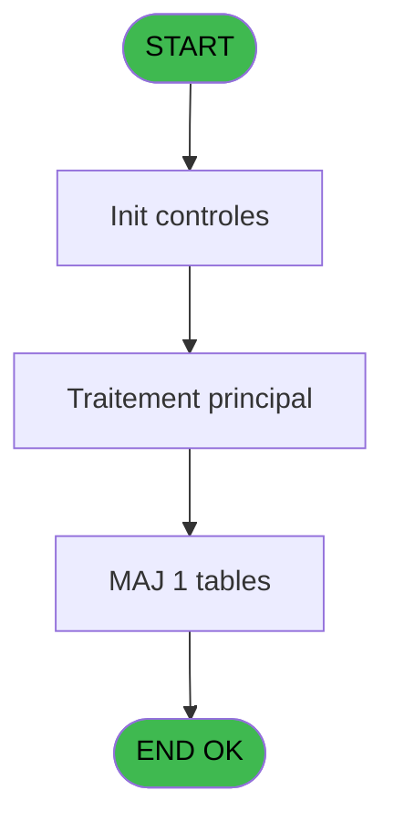

Review the generated code against the original specification.

Produce a JSON report:
```json
{
  "programId": 0,
  "programName": "",
  "coveragePct": 0,
  "rulesImplemented": 0,
  "rulesTotal": 0,
  "missingRules": [
    "rule descriptions not implemented"
  ],
  "recommendations": [
    "improvement suggestions"
  ]
}
```

Check:
1. Every business rule from the contract is implemented in the store
2. Every table from the contract has corresponding entity types
3. Every API endpoint is wired to the store
4. UI layout matches the spec description
5. Error handling is present for all actions

CONTRACT RULES:
[
  {
    "id": "RM-001",
    "description": "Condition composite: NOT([V]) OR [U]",
    "condition": "NOT([V]) OR [U]",
    "variables": [
      "EP (e.Caisse ouverte aujourd'hui?)",
      "EO (Po.Ouverture caisse possible?)"
    ],
    "status": "IMPL",
    "targetFile": "src/stores/sessionStore.ts",
    "gapNotes": "checkConcurrentSessions() returns ConcurrentSessionInfo if session already open, blocking new opening. Composite logic simplified: if concurrent session found, opening blocked unless VIL allows multiple sessions."
  }
]

SPEC EXCERPT:
# ADH IDE 156 - Verif session caisse ouverte2

> **Analyse**: Phases 1-4 2026-02-08 03:39 -> 03:39 (4s) | Assemblage 03:39
> **Pipeline**: V7.2 Enrichi
> **Structure**: 4 onglets (Resume | Ecrans | Donnees | Connexions)

<!-- TAB:Resume -->

## 1. FICHE D'IDENTITE

| Attribut | Valeur |
|----------|--------|
| Projet | ADH |
| IDE Position | 156 |
| Nom Programme | Verif session caisse ouverte2 |
| Fichier source | `Prg_156.xml` |
| Dossier IDE | Caisse |
| Taches | 1 (0 ecrans visibles) |
| Tables modifiees | 1 |
| Programmes appeles | 0 |
| Complexite | **BASSE** (score 7/100) |

## 2. DESCRIPTION FONCTIONNELLE

ADH IDE 156 effectue une vérification du statut des sessions de caisse existantes avant d'en ouvrir une nouvelle. Le programme interroge la table `histo_sessions_caisse_detail` pour déterminer si une session est actuellement ouverte pour la caisse et la devise spécifiées. Cette vérification est critique pour éviter les doubles ouvertures et garantir l'intégrité des données de comptabilité.

Le flux d'exécution consulte les enregistrements de session les plus récents, validant notamment le timestamp d'ouverture et l'absence de fermeture antérieure. Si une session active est détectée, le programme retourne un indicateur d'erreur qui bloque l'ouverture d'une nouvelle session dans ADH IDE 122. Cette logique prévient les conflits de concurrence où deux opérateurs tenteraient simultanément d'ouvrir la même caisse.

Les données manipulées concernent les sessions comptables (numéro session, dates, devises, statuts). Le programme s'inscrit dans la chaîne de gestion de caisse en tant que validateur préalable, intervenant après le menu principal (ADH IDE 121) et en amont de la création effective de session (ADH IDE 122). Les modifications apportées à `histo_sessions_caisse_detail` reflètent les mises à jour de statut de session lors de la validation.

## 3. BLOCS FONCTIONNELS

## 5. REGLES METIER

1 regles identifiees:

### Autres (1 regles)

#### <a id="rm-RM-001"></a>[RM-001] Condition composite: NOT([V]) OR [U]

| Element | Detail |
|---------|--------|
| **Condition** | `NOT([V]) OR [U]` |
| **Si vrai** | Action si vrai |
| **Expression source** | Expression 8 : `NOT([V]) OR [U]` |
| **Exemple** | Si NOT([V]) OR [U] → Action si vrai |

## 6. CONTEXTE

- **Appele par**: [Gestion caisse (IDE 121)](ADH-IDE-121.md), [Ouverture caisse (IDE 122)](ADH-IDE-122.md)
- **Appelle**: 0 programmes | **Tables**: 1 (W:1 R:0 L:0) | **Taches**: 1 | **Expressions**: 9

<!-- TAB:Ecrans -->

## 8. ECRANS

*(Programme sans ecran visible)*

## 9. NAVIGATION

### 9.3 Structure hierarchique (0 tache)

| Position | Tache | Type | Dimensions | Bloc |
|----------|-------|------|------------|------|

### 9.4 Algorigramme



> **Legende**: Vert = START/END OK | Rouge = END KO | Bleu = Decisions
> *Algorigramme auto-genere. Utiliser `/algorigramme` pour une synthese metier detaillee.*

<!-- TAB:Donnees -->

## 10. TABLES

### Tables utilisees (1)

| ID | Nom | Description | Type | R | W | L | Usages |
|----|-----|-------------|------|---|---|---|--------|
| 249 | histo_sessions_caisse_detail | Sessions de caisse | DB |   | **W** |   | 1 |

### Colonnes par table (1 / 1 tables avec colonnes identifiees)

<details>
<summary>Table 249 - histo_sessions_caisse_detail (**W**) - 1 usages</summary>

| Lettre | Variable | Acces | Type |
|--------|----------|-------|------|
| A | Pi.terminal | W | Numeric |
| B | Po.Ouverture caisse possible? | W | Logical |
| C | e.Caisse ouverte aujourd'hui? | W | Logical |
| D | e.Caisse fermée? | W | Logical |

</details>

## 11. VARIABLES

### 11.1 Parametres entrants (2)

Variables recues du programme appelant ([Gestion caisse (IDE 121)](ADH-IDE-121.md)).

| Lettre | Nom | Type | Usage dans |
|--------|-----|------|-----------|
| EN | Pi.terminal | Numeric | 1x parametre entrant |
| EO | Po.Ouverture caisse possible? | Logical | - |

### 11.2 Autres (2)

Variables diverses.

| Lettre | Nom | Type | Usage dans |
|--------|-----|------|-----------|
| EP | e.Caisse ouverte aujourd'hui? | Logical | - |
| EQ | e.Caisse fermée? | Logical | - |

## 12. EXPRESSIONS

**9 / 9 expressions decodees (100%)**

### 12.1 Repartition par type

| Type | Expressions | Regles |
|------|-------------|--------|
| CONDITION | 1 | 5 |
| CONSTANTE | 3 | 0 |
| DATE | 1 | 0 |
| OTHER | 1 | 0 |
| CAST_LOGIQUE | 1 | 0 |
| FORMAT | 1 | 0 |
| STRING | 1 | 0 |

### 12.2 Expressions cles par type

#### CONDITION (1 expressions)

| Type | IDE | Expression | Regle |
|------|-----|------------|-------|
| CONDITION | 8 | `NOT([V]) OR [U]` | [RM-001](#rm-RM-001) |

#### CONSTANTE (3 expressions)

| Type | IDE | Expression | Regle |
|------|-----|------

GENERATED FILES:

--- types/sessionConcurrency.ts ---
import type { ApiResponse } from "@/services/api/apiClient";

export type SessionConcurrencyCodeCalcul = 'C' | 'D';

export interface SessionConcurrency {
  societe: string;
  compte: number;
  filiation: number;
  terminalId: string;
  timestamp: Date;
  codeCalcul: string | null;
  coffreEnCoursComptage: boolean;
}

export interface SessionConflictResult {
  allowed: boolean;
  conflictingSession?: SessionConcurrency;
  reason?: string;
}

export interface RegisterSessionRequest {
  societe: string;
  compte: number;
  filiation: number;
  terminalId: string;
  codeCalcul: SessionConcurrencyCodeCalcul;
}

export interface ReleaseSessionRequest {
  societe: string;
  compte: number;
  filiation: number;
  terminalId: string;
}

export interface ForceOpenSessionRequest {
  societe: string;
  compte: number;
  filiation: number;
  terminalId: string;
  reason: string;
}

export interface CheckConcurrencyResponse extends ApiResponse {
  data: SessionConflictResult;
}

export interface RegisterSessionResponse extends ApiResponse {
  data: {
    success: boolean;
  };
}

export interface ReleaseSessionResponse extends ApiResponse {
  data: {
    success: boolean;
  };
}

export interface ForceOpenSessionResponse extends ApiResponse {
  data: {
    success: boolean;
  };
}

export interface SessionConcurrencyState {
  activeSessions: SessionConcurrency[];
  isLoading: boolean;
  error: string | null;
  conflictDetected: boolean;
  conflictingSession: SessionConcurrency | null;
  checkConcurrency: (
    societe: string,
    compte: number,
    filiation: number
  ) => Promise<SessionConflictResult>;
  registerSession: (
    societe: string,
    compte: number,
    filiation: number,
    terminalId: string,
    codeCalcul: SessionConcurrencyCodeCalcul
  ) => Promise<void>;
  releaseSession: (
    societe: string,
    compte: number,
    filiation: number,
    terminalId: string
  ) => P

--- stores/sessionConcurrencyStore.ts ---
import { create } from 'zustand';
import type {
  SessionConcurrency,
  SessionConflictResult,
  SessionConcurrencyCodeCalcul,
} from '@/types/sessionConcurrency';
import { apiClient } from '@/services/api/apiClient';
import type { ApiResponse } from '@/services/api/apiClient';
import { useDataSourceStore } from './dataSourceStore';

interface SessionConcurrencyState {
  activeSessions: SessionConcurrency[];
  isLoading: boolean;
  error: string | null;
  conflictDetected: boolean;
  conflictingSession: SessionConcurrency | null;
}

interface SessionConcurrencyActions {
  checkConcurrency: (
    societe: string,
    compte: number,
    filiation: number,
  ) => Promise<SessionConflictResult>;
  registerSession: (
    societe: string,
    compte: number,
    filiation: number,
    terminalId: string,
    codeCalcul: SessionConcurrencyCodeCalcul,
  ) => Promise<void>;
  releaseSession: (
    societe: string,
    compte: number,
    filiation: number,
    terminalId: string,
  ) => Promise<void>;
  forceOpenSession: (
    societe: string,
    compte: number,
    filiation: number,
    terminalId: string,
    reason: string,
  ) => Promise<void>;
  setError: (error: string | null) => void;
  clearConflict: () => void;
  reset: () => void;
}

type SessionConcurrencyStore = SessionConcurrencyState & SessionConcurrencyActions;

const MOCK_SESSIONS: SessionConcurrency[] = [
  {
    societe: 'SOC1',
    compte: 1001,
    filiation: 0,
    terminalId: 'TERM01',
    timestamp: new Date('2026-02-21T08:30:00'),
    codeCalcul: 'C',
    coffreEnCoursComptage: false,
  },
  {
    societe: 'SOC1',
    compte: 1002,
    filiation: 0,
    terminalId: 'TERM02',
    timestamp: new Date('2026-02-21T09:15:00'),
    codeCalcul: 'D',
    coffreEnCoursComptage: true,
  },
];

const initialState: SessionConcurrencyState = {
  activeSessions: [],
  isLoading: false,
  error: null,
  conflictDetected: false,
  conflic

--- services/api/endpoints-sessionConcurrency.ts ---
import { apiClient, type ApiResponse } from '@/services/api/apiClient';
import type {
  SessionConcurrency,
  RegisterSessionRequest,
  ReleaseSessionRequest,
  ForceOpenSessionRequest,
  CheckConcurrencyResponse,
  RegisterSessionResponse,
  ReleaseSessionResponse,
  ForceOpenSessionResponse,
} from '@/types/sessionConcurrency';

export const sessionConcurrencyApi = {
  getConcurrentSession: (terminal: string, devise?: string) =>
    apiClient.get<ApiResponse<SessionConcurrency | null>>(
      `/api/caisse/sessions/concurrent?terminal=${encodeURIComponent(terminal)}${devise ? `&devise=${encodeURIComponent(devise)}` : ''}`,
    ),

  checkConcurrency: (
    societe: string,
    compte: number,
    filiation: number,
  ) =>
    apiClient.get<CheckConcurrencyResponse>(
      `/api/caisse/sessions/check?societe=${encodeURIComponent(societe)}&compte=${compte}&filiation=${filiation}`,
    ),

  registerSession: (data: RegisterSessionRequest) =>
    apiClient.post<RegisterSessionResponse>(
      '/api/caisse/sessions/register',
      data,
    ),

  releaseSession: (data: ReleaseSessionRequest) =>
    apiClient.post<ReleaseSessionResponse>(
      '/api/caisse/sessions/release',
      data,
    ),

  forceOpenSession: (data: ForceOpenSessionRequest) =>
    apiClient.post<ForceOpenSessionResponse>(
      '/api/caisse/sessions/force-open',
      data,
    ),
};

--- pages/SessionConcurrencyPage.tsx ---
import { useState, useEffect, useCallback } from 'react';
import { useNavigate } from 'react-router-dom';
import { ScreenLayout } from '@/components/layout';
import { Dialog } from '@/components/ui';
import { useSessionConcurrencyStore } from '@/stores/sessionConcurrencyStore';
import { useAuthStore } from '@/stores';

export function SessionConcurrencyPage() {
  const navigate = useNavigate();
  const user = useAuthStore((s) => s.user);

  const activeSessions = useSessionConcurrencyStore((s) => s.activeSessions);
  const isLoading = useSessionConcurrencyStore((s) => s.isLoading);
  const error = useSessionConcurrencyStore((s) => s.error);
  const conflictDetected = useSessionConcurrencyStore((s) => s.conflictDetected);
  const conflictingSession = useSessionConcurrencyStore((s) => s.conflictingSession);
  const forceOpenSession = useSessionConcurrencyStore((s) => s.forceOpenSession);
  const setError = useSessionConcurrencyStore((s) => s.setError);
  const clearConflict = useSessionConcurrencyStore((s) => s.clearConflict);
  const reset = useSessionConcurrencyStore((s) => s.reset);

  const [showConflictDialog, setShowConflictDialog] = useState(false);
  const [forceReason, setForceReason] = useState('');

  useEffect(() => {
    setShowConflictDialog(conflictDetected && !!conflictingSession);
  }, [conflictDetected, conflictingSession]);

  useEffect(() => {
    return () => reset();
  }, [reset]);

  const handleCloseConflict = useCallback(() => {
    setShowConflictDialog(false);
    clearConflict();
    setForceReason('');
    navigate('/caisse/menu');
  }, [clearConflict, navigate]);

  const handleForceOpen = useCallback(async () => {
    if (!conflictingSession || !forceReason.trim()) {
      setError('Veuillez saisir une raison pour forcer l\'ouverture');
      return;
    }

    try {
      await forceOpenSession(
        conflictingSession.societe,
        conflictingSession.compte,
        conflictingSess

--- components/caisse/sessionConcurrency/BackgroundValidationPanel.tsx ---
import { useEffect } from 'react';
import { Dialog, Button } from '@/components/ui';
import { useSessionConcurrencyStore } from '@/stores/sessionConcurrencyStore';
import type { SessionConcurrency } from '@/types/sessionConcurrency';

interface BackgroundValidationPanelProps {
  societe: string;
  compte: number;
  filiation: number;
  onValidationComplete?: (allowed: boolean) => void;
}

export const BackgroundValidationPanel = ({
  societe,
  compte,
  filiation,
  onValidationComplete,
}: BackgroundValidationPanelProps) => {
  const conflictDetected = useSessionConcurrencyStore((s) => s.conflictDetected);
  const conflictingSession = useSessionConcurrencyStore((s) => s.conflictingSession);
  const checkConcurrency = useSessionConcurrencyStore((s) => s.checkConcurrency);
  const clearConflict = useSessionConcurrencyStore((s) => s.clearConflict);
  const isLoading = useSessionConcurrencyStore((s) => s.isLoading);

  useEffect(() => {
    const validateSession = async () => {
      const result = await checkConcurrency(societe, compte, filiation);
      onValidationComplete?.(result.allowed);
    };

    validateSession();
  }, [societe, compte, filiation, checkConcurrency, onValidationComplete]);

  const handleClose = () => {
    clearConflict();
    onValidationComplete?.(false);
  };

  const formatSessionDetails = (session: SessionConcurrency) => {
    const timestamp = new Date(session.timestamp);
    const dateStr = timestamp.toLocaleDateString('fr-FR');
    const timeStr = timestamp.toLocaleTimeString('fr-FR');
    
    return {
      terminal: session.terminalId,
      date: dateStr,
      time: timeStr,
      calcul: session.codeCalcul === 'C' ? 'Caisse' : session.codeCalcul === 'D' ? 'Détail' : 'Non défini',
      comptage: session.coffreEnCoursComptage ? 'Oui' : 'Non',
    };
  };

  if (!conflictDetected || !conflictingSession) {
    return null;
  }

  const details = formatSessionDetails(conflict

--- components/caisse/sessionConcurrency/ConflictWarningPanel.tsx ---
import { memo } from 'react';
import { Button, Dialog } from '@/components/ui';
import type { SessionConcurrency } from '@/types/sessionConcurrency';

interface ConflictWarningPanelProps {
  open: boolean;
  conflictingSession: SessionConcurrency | null;
  onCancel: () => void;
  onForceOpen: () => void;
  isLoading?: boolean;
}

export const ConflictWarningPanel = memo<ConflictWarningPanelProps>(({
  open,
  conflictingSession,
  onCancel,
  onForceOpen,
  isLoading = false,
}) => {
  if (!conflictingSession) return null;

  const formattedTimestamp = new Date(conflictingSession.timestamp).toLocaleString('fr-FR', {
    year: 'numeric',
    month: '2-digit',
    day: '2-digit',
    hour: '2-digit',
    minute: '2-digit',
    second: '2-digit',
  });

  return (
    <Dialog open={open} onClose={onCancel}>
      <div className="bg-white rounded-lg shadow-xl p-6 max-w-lg w-full">
        <div className="flex items-start gap-3 mb-4">
          <div className="flex-shrink-0 w-10 h-10 rounded-full bg-yellow-100 flex items-center justify-center">
            <svg className="w-6 h-6 text-yellow-600" fill="none" viewBox="0 0 24 24" stroke="currentColor">
              <path strokeLinecap="round" strokeLinejoin="round" strokeWidth={2} d="M12 9v2m0 4h.01m-6.938 4h13.856c1.54 0 2.502-1.667 1.732-3L13.732 4c-.77-1.333-2.694-1.333-3.464 0L3.34 16c-.77 1.333.192 3 1.732 3z" />
            </svg>
          </div>
          <div className="flex-1">
            <h3 className="text-lg font-semibold text-gray-900 mb-1">
              Session déjà ouverte
            </h3>
            <p className="text-sm text-gray-600">
              Une session est déjà active pour ce compte. Forcer l'ouverture fermera automatiquement la session existante.
            </p>
          </div>
        </div>

        <div className="bg-gray-50 rounded-lg p-4 mb-6 space-y-2">
          <div className="flex justify-between items-center">
            <span className="text-sm font-medium text-gray-700">Termi