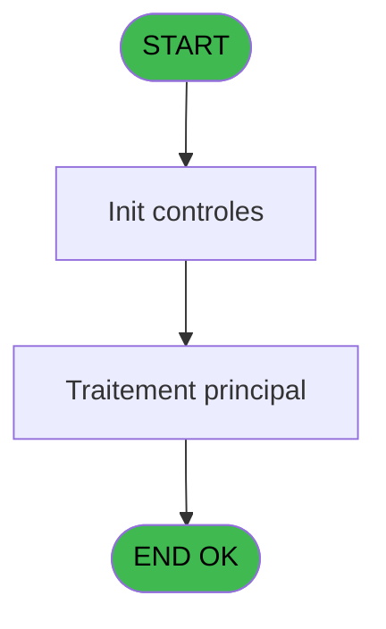

Review the generated code against the original specification.

Produce a JSON report:
```json
{
  "programId": 0,
  "programName": "",
  "coveragePct": 0,
  "rulesImplemented": 0,
  "rulesTotal": 0,
  "missingRules": [
    "rule descriptions not implemented"
  ],
  "recommendations": [
    "improvement suggestions"
  ]
}
```

Check:
1. Every business rule from the contract is implemented in the store
2. Every table from the contract has corresponding entity types
3. Every API endpoint is wired to the store
4. UI layout matches the spec description
5. Error handling is present for all actions

CONTRACT RULES:
[
  {
    "id": "RM-001",
    "description": "Condition Param UNI/BI different de B",
    "condition": "Param UNI/BI [C]<>'B'",
    "variables": [
      "EP (Param UNI/BI)"
    ],
    "status": "N/A",
    "targetFile": "",
    "gapNotes": "Backend-only WS validation - UNI/BI routing handled server-side"
  },
  {
    "id": "RM-002",
    "description": "Condition Param UNI/BI egale B",
    "condition": "Param UNI/BI [C]='B'",
    "variables": [
      "EP (Param UNI/BI)"
    ],
    "status": "N/A",
    "targetFile": "",
    "gapNotes": "Backend-only WS validation - UNI/BI routing handled server-side"
  }
]

SPEC EXCERPT:
# ADH IDE 128 - Controle ouverture caisse WS

> **Analyse**: Phases 1-4 2026-02-08 03:06 -> 03:06 (4s) | Assemblage 03:06
> **Pipeline**: V7.2 Enrichi
> **Structure**: 4 onglets (Resume | Ecrans | Donnees | Connexions)

<!-- TAB:Resume -->

## 1. FICHE D'IDENTITE

| Attribut | Valeur |
|----------|--------|
| Projet | ADH |
| IDE Position | 128 |
| Nom Programme | Controle ouverture caisse WS |
| Fichier source | `Prg_128.xml` |
| Dossier IDE | Caisse |
| Taches | 2 (0 ecrans visibles) |
| Tables modifiees | 0 |
| Programmes appeles | 0 |
| Complexite | **BASSE** (score 0/100) |

## 2. DESCRIPTION FONCTIONNELLE

Le programme ADH IDE 128 effectue un contrôle préalable avant l'ouverture d'une session de caisse. Il valide que les conditions nécessaires sont réunies : vérification que la caisse n'est pas déjà ouverte, que l'opérateur dispose des droits requis, et que les paramètres de session sont corrects. Ce programme agit comme un gatekeeper, bloquant les ouvertures invalides avant qu'elles n'affectent les données critiques.

Le flux d'exécution repose sur une série de vérifications conditionnelles. Pour chaque condition d'erreur rencontrée (caisse déjà ouverte, droits insuffisants, paramètres manquants), le programme retourne un code d'erreur spécifique permettant au programme appelant (IDE 122 ou IDE 297) de gérer l'erreur appropriée et d'afficher un message utilisateur adapté. Les validations s'exécutent dans un ordre logique : d'abord les vérifications d'état, puis celles de droits.

Le programme utilise probablement des tables de référence (droits opérateurs, configuration caisse) et des variables de session pour consulter l'état courant. Il s'inscrit dans le workflow critique d'ouverture caisse : tout passage obligatoire avant que l'IDE 122 ou IDE 297 ne créent une nouvelle session avec les mouvements initiaux de comptage.

## 3. BLOCS FONCTIONNELS

## 5. REGLES METIER

2 regles identifiees:

### Autres (2 regles)

#### <a id="rm-RM-001"></a>[RM-001] Condition: Param UNI/BI [C] different de 'B'

| Element | Detail |
|---------|--------|
| **Condition** | `Param UNI/BI [C]<>'B'` |
| **Si vrai** | Action si vrai |
| **Variables** | EP (Param UNI/BI) |
| **Expression source** | Expression 8 : `Param UNI/BI [C]<>'B'` |
| **Exemple** | Si Param UNI/BI [C]<>'B' → Action si vrai |

#### <a id="rm-RM-002"></a>[RM-002] Condition: Param UNI/BI [C] egale 'B'

| Element | Detail |
|---------|--------|
| **Condition** | `Param UNI/BI [C]='B'` |
| **Si vrai** | Action si vrai |
| **Variables** | EP (Param UNI/BI) |
| **Expression source** | Expression 9 : `Param UNI/BI [C]='B'` |
| **Exemple** | Si Param UNI/BI [C]='B' → Action si vrai |

## 6. CONTEXTE

- **Appele par**: [Ouverture caisse (IDE 122)](ADH-IDE-122.md), [Ouverture caisse 143 (IDE 297)](ADH-IDE-297.md)
- **Appelle**: 0 programmes | **Tables**: 3 (W:0 R:1 L:2) | **Taches**: 2 | **Expressions**: 9

<!-- TAB:Ecrans -->

## 8. ECRANS

*(Programme sans ecran visible)*

## 9. NAVIGATION

### 9.3 Structure hierarchique (0 tache)

| Position | Tache | Type | Dimensions | Bloc |
|----------|-------|------|------------|------|

### 9.4 Algorigramme



> **Legende**: Vert = START/END OK | Rouge = END KO | Bleu = Decisions
> *Algorigramme auto-genere. Utiliser `/algorigramme` pour une synthese metier detaillee.*

<!-- TAB:Donnees -->

## 10. TABLES

### Tables utilisees (3)

| ID | Nom | Description | Type | R | W | L | Usages |
|----|-----|-------------|------|---|---|---|--------|
| 139 | moyens_reglement_mor | Reglements / paiements | DB | R |   |   | 1 |
| 232 | gestion_devise_session | Sessions de caisse | DB |   |   | L | 1 |
| 141 | devises__________dev | Devises / taux de change | DB |   |   | L | 1 |

### Colonnes par table (2 / 1 tables avec colonnes identifiees)

<details>
<summary>Table 139 - moyens_reglement_mor (R) - 1 usages</summary>

*Table utilisee uniquement en Link ou aucune colonne Real identifiee dans le DataView.*

</details>

## 11. VARIABLES

### 11.1 Autres (21)

Variables diverses.

| Lettre | Nom | Type | Usage dans |
|--------|-----|------|-----------|
| EN | Param societe | Alpha | - |
| EO | Param devise locale | Alpha | - |
| EP | Param UNI/BI | Alpha | 2x refs |
| EQ | Param chrono session | Numeric | - |
| ER | Param solde initial | Numeric | 7x refs |
| ES | Param solde initial monnaie | Numeric | - |
| ET | Param solde initial produits | Numeric | - |
| EU | Param solde initial cartes | Numeric | - |
| EV | Param solde initial cheques | Numeric | - |
| EW | Param solde initial od | Numeric | 1x refs |
| EX | Param solde initial nbre devise | Numeric | - |
| EY | Param appro coffre | Numeric | 2x refs |
| EZ | Param appro articles | Numeric | 2x refs |
| FA | Param appro Nb

GENERATED FILES:

--- types/controleOuvertureCaisse.ts ---
import type { ApiResponse } from "@/services/api/apiClient";

export interface CaisseControl {
  societe: string;
  deviseLocale: string;
  modeUniBi: string;
  chronoSession: number;
  soldeInitial: number;
  soldeInitialMonnaie: number;
  soldeInitialProduits: number;
  soldeInitialCartes: number;
  soldeInitialCheques: number;
  soldeInitialOd: number;
  soldeInitialNbreDevise: number;
  approCoffre: number;
  approArticles: number;
  approNbreDevises: number;
}

export interface CaisseCalculee {
  caisseCalculee: number;
  caisseCalculeeMonnaie: number;
  caisseCalculeeProduits: number;
  caisseCalculeeCartes: number;
  caisseCalculeeCheque: number;
  caisseCalculeeOd: number;
  caisseCalculeeNbDevise: number;
}

export interface ValidationError {
  code: string;
  message: string;
  field: string | null;
}

export interface ModeUniCheck {
  isUni: boolean;
  isBi: boolean;
}

export interface ControleOuvertureCaisseRequest {
  params: CaisseControl;
}

export interface ControleOuvertureCaisseResponse extends ApiResponse {
  data?: CaisseCalculee;
  error?: ValidationError;
}

export interface ControleOuvertureCaisseState {
  isValidating: boolean;
  validationResult: CaisseCalculee | null;
  validationError: ValidationError | null;
  validateOuvertureCaisse: (params: CaisseControl) => Promise<CaisseCalculee>;
  checkModeUniBi: (mode: string) => Promise<ModeUniCheck>;
  clearValidation: () => void;
}

export const VALIDATION_ERROR_CODES = {
  SESSION_ALREADY_OPEN: "ERR_SESSION_ALREADY_OPEN",
  INSUFFICIENT_PERMISSIONS: "ERR_INSUFFICIENT_PERMISSIONS",
  MISSING_PARAMETERS: "ERR_MISSING_PARAMETERS",
  INVALID_MODE: "ERR_INVALID_MODE",
  CALCULATION_ERROR: "ERR_CALCULATION_ERROR",
} as const;

export type ValidationErrorCode = (typeof VALIDATION_ERROR_CODES)[keyof typeof VALIDATION_ERROR_CODES];

export const MODE_UNI_BI = {
  UNI: "U",
  BI: "B",
} as const;

export type ModeUniType = (typeof MODE_UNI_BI)[keyof typeof MODE_UNI_BI];

--- stores/controleOuvertureCaisseStore.ts ---
import { create } from 'zustand';
import type {
  CaisseControl,
  CaisseCalculee,
  ValidationError,
  ModeUniCheck,
} from '@/types/controleOuvertureCaisse';
import { useDataSourceStore } from './dataSourceStore';
import { apiClient } from '@/services/api/apiClient';
import type { ApiResponse } from '@/services/api/apiClient';

interface ControleOuvertureCaisseState {
  isValidating: boolean;
  validationResult: CaisseCalculee | null;
  validationError: ValidationError | null;
}

interface ControleOuvertureCaisseActions {
  validateOuvertureCaisse: (params: CaisseControl) => Promise<CaisseCalculee>;
  checkModeUniBi: (mode: string) => Promise<ModeUniCheck>;
  clearValidation: () => void;
  reset: () => void;
}

type ControleOuvertureCaisseStore = ControleOuvertureCaisseState & ControleOuvertureCaisseActions;

const MOCK_VALIDATION_SUCCESS_UNI: CaisseCalculee = {
  caisseCalculee: 1500,
  caisseCalculeeMonnaie: 800,
  caisseCalculeeProduits: 500,
  caisseCalculeeCartes: 150,
  caisseCalculeeCheque: 50,
  caisseCalculeeOd: 0,
  caisseCalculeeNbDevise: 10,
};

const MOCK_VALIDATION_SUCCESS_BI: CaisseCalculee = {
  caisseCalculee: 2200,
  caisseCalculeeMonnaie: 1200,
  caisseCalculeeProduits: 700,
  caisseCalculeeCartes: 250,
  caisseCalculeeCheque: 50,
  caisseCalculeeOd: 0,
  caisseCalculeeNbDevise: 15,
};

const MOCK_VALIDATION_ERROR: ValidationError = {
  code: 'ERR_SESSION_ALREADY_OPEN',
  message: 'Une session est déjà ouverte pour ce numéro de chrono',
  field: 'chronoSession',
};

const calculateCaisseTotals = (params: CaisseControl): CaisseCalculee => {
  const caisseCalculee = params.soldeInitial + params.approCoffre + params.approArticles;
  const caisseCalculeeMonnaie = params.soldeInitialMonnaie + params.approCoffre;
  const caisseCalculeeProduits = params.soldeInitialProduits + params.approArticles;
  const caisseCalculeeNbDevise = params.soldeInitialNbreDevise + params.approNbreDevises;

  return {
    caisseCalculee,
    caisseCalculeeMonnaie,
    cais

--- services/api/endpoints-controleOuvertureCaisse.ts ---
import { apiClient, type ApiResponse } from "./apiClient";
import type {
  CaisseControl,
  CaisseCalculee,
  ModeUniCheck,
  ValidationError,
} from "@/types/controleOuvertureCaisse";

export const controleOuvertureCaisseApi = {
  validateOuvertureCaisse: (params: CaisseControl) =>
    apiClient.post<
      ApiResponse<
        CaisseCalculee | null,
        {
          caisseCalculee: CaisseCalculee;
          validationErrors: ValidationError[];
        }
      >
    >("/api/caisse/controle-ouverture", {
      params,
    }),

  checkModeUniBi: (mode: string) =>
    apiClient.get<ApiResponse<ModeUniCheck>>(
      `/api/caisse/controle-ouverture/mode?mode=${encodeURIComponent(mode)}`,
    ),

  getModeOptions: () =>
    apiClient.get<
      ApiResponse<
        Array<{
          code: string;
          label: string;
        }>
      >
    >("/api/caisse/controle-ouverture/modes"),

  validateField: (fieldName: string, value: unknown) =>
    apiClient.post<
      ApiResponse<{
        isValid: boolean;
        error: ValidationError | null;
      }>
    >("/api/caisse/controle-ouverture/validate-field", {
      fieldName,
      value,
    }),

  getInitialBalance: (societe: string, chronoSession: number) =>
    apiClient.get<
      ApiResponse<{
        soldeInitial: number;
        soldeInitialMonnaie: number;
        soldeInitialProduits: number;
        soldeInitialCartes: number;
        soldeInitialCheques: number;
        soldeInitialOd: number;
        soldeInitialNbreDevise: number;
      }>
    >(
      `/api/caisse/controle-ouverture/initial-balance?societe=${encodeURIComponent(societe)}&chronoSession=${chronoSession}`,
    ),
};

--- pages/ControleOuvertureCaissePage.tsx ---
import { useEffect } from 'react';
import { useNavigate } from 'react-router-dom';
import { ScreenLayout } from '@/components/layout';
import { useControleOuvertureCaisseStore } from '@/stores/controleOuvertureCaisseStore';
import { useAuthStore } from '@/stores';

export function ControleOuvertureCaissePage() {
  const navigate = useNavigate();
  const user = useAuthStore((s) => s.user);

  const isValidating = useControleOuvertureCaisseStore((s) => s.isValidating);
  const validationResult = useControleOuvertureCaisseStore((s) => s.validationResult);
  const validationError = useControleOuvertureCaisseStore((s) => s.validationError);
  const reset = useControleOuvertureCaisseStore((s) => s.reset);

  useEffect(() => {
    return () => reset();
  }, [reset]);

  const handleBack = () => {
    navigate('/caisse/menu');
  };

  return (
    <ScreenLayout>
      <div className="space-y-6 max-w-4xl mx-auto">
        <div className="flex items-center justify-between">
          <div>
            <h2 className="text-xl font-semibold">Contrôle d'ouverture de caisse</h2>
            <p className="text-on-surface-muted text-sm mt-1">
              Service backend de validation - appelé par IDE 122 et IDE 297
            </p>
          </div>
          {user && (
            <span className="text-xs text-on-surface-muted">
              {user.prenom} {user.nom}
            </span>
          )}
        </div>

        <div className="bg-surface-elevated border border-border rounded-lg p-6 space-y-4">
          <div className="flex items-center gap-3">
            <div className="w-2 h-2 rounded-full bg-green-500" />
            <h3 className="text-lg font-medium">Service actif</h3>
          </div>

          <div className="space-y-2 text-sm text-on-surface-muted">
            <p>
              Ce service backend effectue les validations suivantes :
            </p>
            <ul className="list-disc list-inside space-y-1 ml-4">
              <li>Calcul des totaux de caiss

--- components/caisse/controleOuvertureCaisse/BackendValidationServicePanel.tsx ---
import { useState } from 'react';
import { cn } from '@/lib/utils';
import type { CaisseControl, CaisseCalculee, ValidationError, ModeUniCheck } from '@/types/controleOuvertureCaisse';

interface BackendValidationServicePanelProps {
  className?: string;
}

export const BackendValidationServicePanel = ({ className }: BackendValidationServicePanelProps) => {
  const [lastValidation, setLastValidation] = useState<{
    timestamp: Date;
    params: CaisseControl;
    result: CaisseCalculee;
  } | null>(null);
  const [lastError, setLastError] = useState<{
    timestamp: Date;
    error: ValidationError;
  } | null>(null);
  const [modeCheck, setModeCheck] = useState<{
    mode: string;
    result: ModeUniCheck;
  } | null>(null);

  return (
    <div className={cn("bg-surface-elevated border border-border rounded-lg p-6", className)}>
      <div className="space-y-6">
        <div className="flex items-center gap-3 pb-4 border-b border-border">
          <div className="w-3 h-3 rounded-full bg-green-500 animate-pulse" />
          <div>
            <h3 className="text-lg font-semibold">Service de Validation Backend</h3>
            <p className="text-sm text-on-surface-muted mt-1">
              Appelé automatiquement par IDE 122 et IDE 297
            </p>
          </div>
        </div>

        <div className="grid grid-cols-1 md:grid-cols-2 gap-4">
          <div className="bg-surface border border-border rounded-lg p-4">
            <h4 className="font-medium text-sm mb-3 flex items-center gap-2">
              <svg className="w-4 h-4 text-blue-500" fill="none" viewBox="0 0 24 24" stroke="currentColor">
                <path strokeLinecap="round" strokeLinejoin="round" strokeWidth={2} d="M9 12l2 2 4-4m6 2a9 9 0 11-18 0 9 9 0 0118 0z" />
              </svg>
              Validations effectuées
            </h4>
            <ul className="space-y-2 text-sm text-on-surface-muted">
              <li className="flex items-start gap-2">
                <span className=