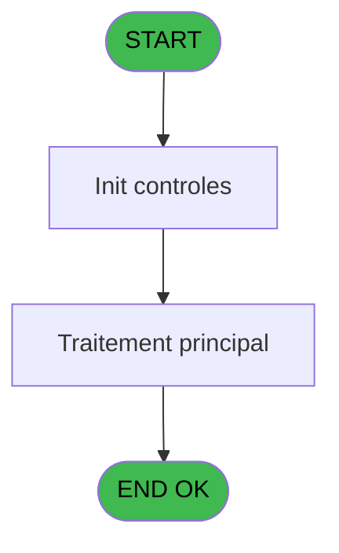
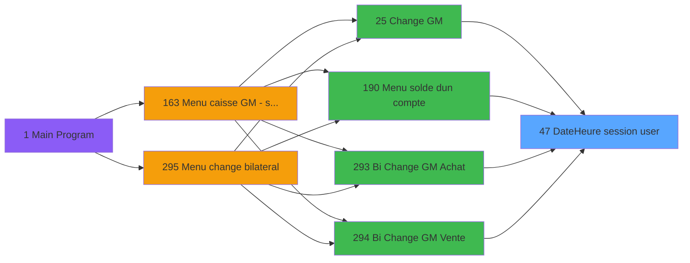

Review the generated code against the original specification.

Produce a JSON report:
```json
{
  "programId": 0,
  "programName": "",
  "coveragePct": 0,
  "rulesImplemented": 0,
  "rulesTotal": 0,
  "missingRules": [
    "rule descriptions not implemented"
  ],
  "recommendations": [
    "improvement suggestions"
  ]
}
```

Check:
1. Every business rule from the contract is implemented in the store
2. Every table from the contract has corresponding entity types
3. Every API endpoint is wired to the store
4. UI layout matches the spec description
5. Error handling is present for all actions

CONTRACT RULES:
[]

SPEC EXCERPT:
# ADH IDE 47 - Date/Heure session user

> **Analyse**: Phases 1-4 2026-02-07 06:48 -> 01:44 (18h56min) | Assemblage 01:44
> **Pipeline**: V7.2 Enrichi
> **Structure**: 4 onglets (Resume | Ecrans | Donnees | Connexions)

<!-- TAB:Resume -->

## 1. FICHE D'IDENTITE

| Attribut | Valeur |
|----------|--------|
| Projet | ADH |
| IDE Position | 47 |
| Nom Programme | Date/Heure session user |
| Fichier source | `Prg_47.xml` |
| Dossier IDE | Caisse |
| Taches | 1 (0 ecrans visibles) |
| Tables modifiees | 0 |
| Programmes appeles | 0 |
| Complexite | **BASSE** (score 0/100) |

## 2. DESCRIPTION FONCTIONNELLE

**ADH IDE 47** gère la date et l'heure de la session utilisateur. Ce programme intervient dans les flux de change de devises (changement manuel de devise achat/vente dans les écrans Change GM), la consultation du solde d'un compte, et les opérations de change bilatéral (achat/vente de devises entre deux tiers).

Le programme collecte ou valide le timestamp de la session en cours pour horodater les opérations de change. Il garantit la cohérence temporelle des transactions et permet de tracer précisément quand chaque échange de devise s'est effectué. C'est notamment critique pour les taux de change qui varient dans le temps et pour la réconciliation comptable.

Appelé systématiquement lors de chaque navigation vers les écrans de change, ADH IDE 47 assure que toutes les opérations monétaires conservent un historique temporel fiable et exploitable pour l'audit et le reporting financier.

## 3. BLOCS FONCTIONNELS

## 5. REGLES METIER

*(Aucune regle metier identifiee dans les expressions)*

## 6. CONTEXTE

- **Appele par**: [Change GM (IDE 25)](ADH-IDE-25.md), [Menu solde d'un compte (IDE 190)](ADH-IDE-190.md), [Bi  Change GM Achat (IDE 293)](ADH-IDE-293.md), [Bi  Change GM Vente (IDE 294)](ADH-IDE-294.md)
- **Appelle**: 0 programmes | **Tables**: 1 (W:0 R:1 L:0) | **Taches**: 1 | **Expressions**: 2

<!-- TAB:Ecrans -->

## 8. ECRANS

*(Programme sans ecran visible)*

## 9. NAVIGATION

### 9.3 Structure hierarchique (0 tache)

| Position | Tache | Type | Dimensions | Bloc |
|----------|-------|------|------------|------|

### 9.4 Algorigramme



> **Legende**: Vert = START/END OK | Rouge = END KO | Bleu = Decisions
> *Algorigramme auto-genere. Utiliser `/algorigramme` pour une synthese metier detaillee.*

<!-- TAB:Donnees -->

## 10. TABLES

### Tables utilisees (1)

| ID | Nom | Description | Type | R | W | L | Usages |
|----|-----|-------------|------|---|---|---|--------|
| 246 | histo_sessions_caisse | Sessions de caisse | DB | R |   |   | 1 |

### Colonnes par table (0 / 1 tables avec colonnes identifiees)

<details>
<summary>Table 246 - histo_sessions_caisse (R) - 1 usages</summary>

*Table utilisee uniquement en Link ou aucune colonne Real identifiee dans le DataView.*

</details>

## 11. VARIABLES

*(Programme sans variables locales mappees)*

## 12. EXPRESSIONS

**2 / 2 expressions decodees (100%)**

### 12.1 Repartition par type

| Type | Expressions | Regles |
|------|-------------|--------|
| CALCULATION | 1 | 0 |
| REFERENCE_VG | 1 | 0 |

### 12.2 Expressions cles par type

#### CALCULATION (1 expressions)

| Type | IDE | Expression | Regle |
|------|-----|------------|-------|
| CALCULATION | 2 | `[D]*10^5+[E]` | - |

#### REFERENCE_VG (1 expressions)

| Type | IDE | Expression | Regle |
|------|-----|------------|-------|
| REFERENCE_VG | 1 | `VG1` | - |

<!-- TAB:Connexions -->

## 13. GRAPHE D'APPELS

### 13.1 Chaine depuis Main (Callers)

Main -> ... -> [Change GM (IDE 25)](ADH-IDE-25.md) -> **Date/Heure session user (IDE 47)**

Main -> ... -> [Menu solde d'un compte (IDE 190)](ADH-IDE-190.md) -> **Date/Heure session user (IDE 47)**

Main -> ... -> [Bi  Change GM Achat (IDE 293)](ADH-IDE-293.md) -> **Date/Heure session user (IDE 47)**

Main -> ... -> [Bi  Change GM Vente (IDE 294)](ADH-IDE-294.md) -> **Date/Heure session user (IDE 47)**



### 13.2 Callers

| IDE | Nom Programme 

GENERATED FILES:

--- types/sessionTimestamp.ts ---
export interface SessionTimestamp {
  sessionDate: Date;
  sessionTime: string;
  timestamp: number;
}

export interface SessionInfo {
  sessionDate: Date;
  sessionTime: string;
  timestamp: number;
  sessionId: string;
  operatorId: string;
  isActive: boolean;
}

export interface SessionTimestampState {
  sessionDate: Date | null;
  sessionTime: string;
  timestamp: number;
  isLoading: boolean;
  error: string | null;
  getSessionTimestamp: () => Promise<void>;
  validateTimestamp: (timestamp: number) => Promise<boolean>;
  resetState: () => void;
}

export type GetSessionTimestampRequest = Record<string, never>;

export type GetSessionTimestampResponse = SessionTimestamp;

export type GetSessionCurrentRequest = Record<string, never>;

export type GetSessionCurrentResponse = SessionInfo;

export type ValidateTimestampRequest = {
  timestamp: number;
};

export type ValidateTimestampResponse = {
  isValid: boolean;
  message: string;
};

--- stores/sessionTimestampStore.ts ---
import { create } from 'zustand';
import type {
  SessionTimestamp,
  SessionInfo,
  GetSessionTimestampResponse,
  ValidateTimestampResponse,
} from '@/types/sessionTimestamp';
import { apiClient } from '@/services/api/apiClient';
import type { ApiResponse } from '@/services/api/apiClient';
import { useDataSourceStore } from '@/stores/dataSourceStore';

interface SessionTimestampState {
  sessionDate: Date | null;
  sessionTime: string;
  timestamp: number;
  isLoading: boolean;
  error: string | null;
}

interface SessionTimestampActions {
  getSessionTimestamp: () => Promise<void>;
  validateTimestamp: (timestamp: number) => Promise<boolean>;
  resetState: () => void;
}

type SessionTimestampStore = SessionTimestampState & SessionTimestampActions;

const MOCK_SESSION_TIMESTAMP: SessionTimestamp = {
  sessionDate: new Date('2026-02-21T09:15:00'),
  sessionTime: '09:15',
  timestamp: 20260221091500,
};

const _MOCK_SESSION_INFO: SessionInfo = {
  sessionDate: new Date('2026-02-21T09:15:00'),
  sessionTime: '09:15',
  timestamp: 20260221091500,
  sessionId: 'SES-2026-02-21-001',
  operatorId: 'OPR-123',
  isActive: true,
};

const initialState: SessionTimestampState = {
  sessionDate: null,
  sessionTime: '',
  timestamp: 0,
  isLoading: false,
  error: null,
};

export const useSessionTimestampStore = create<SessionTimestampStore>()((set) => ({
  ...initialState,

  getSessionTimestamp: async () => {
    const { isRealApi } = useDataSourceStore.getState();
    set({ isLoading: true, error: null });

    if (!isRealApi) {
      set({
        sessionDate: MOCK_SESSION_TIMESTAMP.sessionDate,
        sessionTime: MOCK_SESSION_TIMESTAMP.sessionTime,
        timestamp: MOCK_SESSION_TIMESTAMP.timestamp,
        isLoading: false,
      });
      return;
    }

    try {
      const response: ApiResponse<GetSessionTimestampResponse> = await apiClient.get(
        '/api/session/timestamp',
      );
      const data = response.data;
      set({
        sessionDate: new Date(d

--- services/api/endpoints-sessionTimestamp.ts ---
import { apiClient, type ApiResponse } from './apiClient';
import type {
  GetSessionTimestampResponse,
  GetSessionCurrentResponse,
  ValidateTimestampRequest,
  ValidateTimestampResponse,
} from '@/types/sessionTimestamp';

export const sessionTimestampApi = {
  getSessionTimestamp: () =>
    apiClient.get<ApiResponse<GetSessionTimestampResponse>>(
      '/api/session/timestamp',
    ),

  getSessionCurrent: () =>
    apiClient.get<ApiResponse<GetSessionCurrentResponse>>(
      '/api/session/current',
    ),

  validateTimestamp: (data: ValidateTimestampRequest) =>
    apiClient.post<ApiResponse<ValidateTimestampResponse>>(
      '/api/session/validate-timestamp',
      data,
    ),
};

--- pages/SessionTimestampPage.tsx ---
import { useEffect } from 'react';
import { useNavigate } from 'react-router-dom';
import { ScreenLayout } from '@/components/layout';
import { useSessionTimestampStore } from '@/stores/sessionTimestampStore';
import { useAuthStore } from '@/stores';

export function SessionTimestampPage() {
  const navigate = useNavigate();
  const user = useAuthStore((s) => s.user);

  const sessionDate = useSessionTimestampStore((s) => s.sessionDate);
  const sessionTime = useSessionTimestampStore((s) => s.sessionTime);
  const timestamp = useSessionTimestampStore((s) => s.timestamp);
  const isLoading = useSessionTimestampStore((s) => s.isLoading);
  const error = useSessionTimestampStore((s) => s.error);
  const getSessionTimestamp = useSessionTimestampStore((s) => s.getSessionTimestamp);
  const resetState = useSessionTimestampStore((s) => s.resetState);

  useEffect(() => {
    getSessionTimestamp();
    return () => resetState();
  }, [getSessionTimestamp, resetState]);

  const formatDate = (date: Date | null) => {
    if (!date) return '—';
    return new Intl.DateTimeFormat('fr-FR', {
      day: '2-digit',
      month: '2-digit',
      year: 'numeric',
    }).format(date);
  };

  const handleBack = () => {
    navigate('/caisse/menu');
  };

  return (
    <ScreenLayout>
      <div className="space-y-6 max-w-2xl mx-auto">
        <div className="flex items-center justify-between">
          <div>
            <h2 className="text-xl font-semibold">Timestamp Session</h2>
            <p className="text-on-surface-muted text-sm mt-1">
              Horodatage de la session en cours
            </p>
          </div>
          {user && (
            <span className="text-xs text-on-surface-muted">
              {user.prenom} {user.nom}
            </span>
          )}
        </div>

        {error && (
          <div className="bg-red-50 border border-red-200 text-red-700 px-4 py-3 rounded-md text-sm">
            {error}
          </div>
        )}

        {isLoading && (
  

--- components/caisse/sessionTimestamp/HiddenPanel.tsx ---
import type { FC } from 'react';
import { useSessionTimestampStore } from '@/stores/sessionTimestampStore';

export interface HiddenPanelProps {
  className?: string;
}

export const HiddenPanel: FC<HiddenPanelProps> = ({ className }) => {
  const timestamp = useSessionTimestampStore((s) => s.timestamp);

  return (
    <div className={className}>
      <input
        type="hidden"
        id="timestamp-provider"
        name="timestamp"
        value={timestamp}
      />
    </div>
  );
};