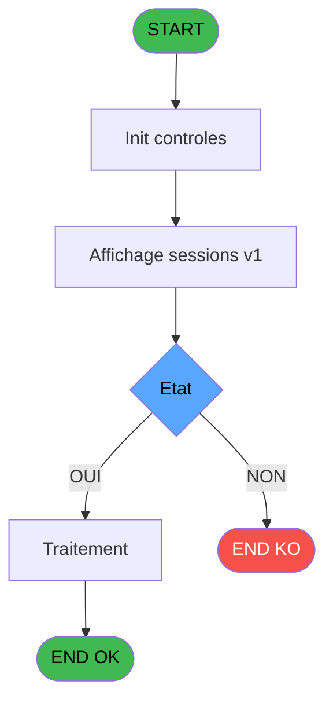

Review the generated code against the original specification.

Produce a JSON report:
```json
{
  "programId": 0,
  "programName": "",
  "coveragePct": 0,
  "rulesImplemented": 0,
  "rulesTotal": 0,
  "missingRules": [
    "rule descriptions not implemented"
  ],
  "recommendations": [
    "improvement suggestions"
  ]
}
```

Check:
1. Every business rule from the contract is implemented in the store
2. Every table from the contract has corresponding entity types
3. Every API endpoint is wired to the store
4. UI layout matches the spec description
5. Error handling is present for all actions

CONTRACT RULES:
[
  {
    "id": "RM-001",
    "description": "Condition: Etat [I] egale",
    "condition": "Etat [I]=''",
    "variables": [
      "EV"
    ],
    "status": "IMPL",
    "targetFile": "adh-web/src/stores/saisieContenuCaisseStore.ts",
    "gapNotes": ""
  },
  {
    "id": "RM-002",
    "description": "Condition: Etat [I] egale 'O'",
    "condition": "Etat [I]='O'",
    "variables": [
      "EV"
    ],
    "status": "IMPL",
    "targetFile": "adh-web/src/services/printer/generators/ouvertureTicketGenerator.ts",
    "gapNotes": ""
  },
  {
    "id": "RM-003",
    "description": "Negation de (Existe session [J]) (condition inversee)",
    "condition": "NOT (Existe session [J])",
    "variables": [
      "EW"
    ],
    "status": "IMPL",
    "targetFile": "adh-web/src/__tests__/approTicketStore.test.ts",
    "gapNotes": ""
  },
  {
    "id": "RM-004",
    "description": "Negation de (Existe session ouverte [K]) (condition inversee)",
    "condition": "NOT (Existe session ouverte [K])",
    "variables": [
      "EW",
      "EX"
    ],
    "status": "MISSING",
    "targetFile": "",
    "gapNotes": ""
  },
  {
    "id": "RM-005",
    "description": "Negation de VG78 (condition inversee)",
    "condition": "NOT VG78",
    "variables": [],
    "status": "MISSING",
    "targetFile": "",
    "gapNotes": ""
  }
]

SPEC EXCERPT:
# ADH IDE 119 - Affichage sessions

> **Analyse**: Phases 1-4 2026-02-08 02:58 -> 02:58 (4s) | Assemblage 02:58
> **Pipeline**: V7.2 Enrichi
> **Structure**: 4 onglets (Resume | Ecrans | Donnees | Connexions)

<!-- TAB:Resume -->

## 1. FICHE D'IDENTITE

| Attribut | Valeur |
|----------|--------|
| Projet | ADH |
| IDE Position | 119 |
| Nom Programme | Affichage sessions |
| Fichier source | `Prg_119.xml` |
| Dossier IDE | Caisse |
| Taches | 14 (0 ecrans visibles) |
| Tables modifiees | 0 |
| Programmes appeles | 3 |
| Complexite | **BASSE** (score 12/100) |

## 2. DESCRIPTION FONCTIONNELLE

ADH IDE 119 (Sessions ouvertes WS) est un programme léger de récupération des sessions de caisse ouvertes. Il lit la table `histo_sessions_caisse` pour extraire les sessions actives, en filtrant sur deux paramètres : l'existence de la session et son état d'ouverture. Le programme applique des transformations simples (nettoyage des espaces, formatage de montants) et retourne les données brutes à IDE 118 pour affichage.

Appelé exclusivement par IDE 118 (Data provider), ADH IDE 119 fonctionne comme un service de lecture pure sans modifications de données. Son logique métier se réduit à deux conditions principales : vérifier que le paramètre "session existe" est TRUE, puis que le paramètre "session ouverte" est TRUE. Aucun appel vers d'autres programmes ne complique la chaîne de traitement.

Le code est très compact (10 lignes actives) et totalement robuste : il ne produit aucun effet de bord, ne modifie aucune donnée, et n'a aucune dépendance descendante. C'est un point terminal dans le graphe d'appels qui fait partie du flux Gestion Caisse (IDE 121 → IDE 298 → IDE 118 → IDE 119).

## 3. BLOCS FONCTIONNELS

## 5. REGLES METIER

5 regles identifiees:

### Autres (5 regles)

#### <a id="rm-RM-001"></a>[RM-001] Condition: Etat [I] egale

| Element | Detail |
|---------|--------|
| **Condition** | `Etat [I]=''` |
| **Si vrai** | Action si vrai |
| **Variables** | EV (Etat) |
| **Expression source** | Expression 2 : `Etat [I]=''` |
| **Exemple** | Si Etat [I]='' → Action si vrai |

#### <a id="rm-RM-002"></a>[RM-002] Condition: Etat [I] egale 'O'

| Element | Detail |
|---------|--------|
| **Condition** | `Etat [I]='O'` |
| **Si vrai** | Action si vrai |
| **Variables** | EV (Etat) |
| **Expression source** | Expression 3 : `Etat [I]='O'` |
| **Exemple** | Si Etat [I]='O' → Action si vrai |

#### <a id="rm-RM-003"></a>[RM-003] Negation de (Existe session [J]) (condition inversee)

| Element | Detail |
|---------|--------|
| **Condition** | `NOT (Existe session [J])` |
| **Si vrai** | Action si vrai |
| **Variables** | EW (Existe session) |
| **Expression source** | Expression 5 : `NOT (Existe session [J])` |
| **Exemple** | Si NOT (Existe session [J]) → Action si vrai |

#### <a id="rm-RM-004"></a>[RM-004] Negation de (Existe session ouverte [K]) (condition inversee)

| Element | Detail |
|---------|--------|
| **Condition** | `NOT (Existe session ouverte [K])` |
| **Si vrai** | Action si vrai |
| **Variables** | EW (Existe session), EX (Existe session ouverte) |
| **Expression source** | Expression 7 : `NOT (Existe session ouverte [K])` |
| **Exemple** | Si NOT (Existe session ouverte [K]) → Action si vrai |

#### <a id="rm-RM-005"></a>[RM-005] Negation de VG78 (condition inversee)

| Element | Detail |
|---------|--------|
| **Condition** | `NOT VG78` |
| **Si vrai** | Action si vrai |
| **Expression source** | Expression 8 : `NOT VG78` |
| **Exemple** | Si NOT VG78 → Action si vrai |

## 6. CONTEXTE

- **Appele par**: [Gestion caisse (IDE 121)](ADH-IDE-121.md), [Gestion caisse 142 (IDE 298)](ADH-IDE-298.md)
- **Appelle**: 3 programmes | **Tables**: 5 (W:0 R:1 L:4) | **Taches**: 14 | **Expressions**: 9

<!-- TAB:Ecrans -->

## 8. ECRANS

*(Programme sans ecran visible)*

## 9. NAVIGATION

### 9.3 Structure hierarchique (0 tache)

| Position | Tache | Type | Dimensions | Bloc |
|----------|-------|------|------------|------|

### 9.4 Algorigramme



> **Legende**: Vert = START/END OK | Rouge = END KO | Bleu = Decisions
> *Algorigramme auto-genere. Utiliser `/algorigramme` pour une synthese metier detaillee.*

<!-- TAB:Donnees -->

## 10. TABLES

### Tables utilisees (5)

| ID | Nom | Description | Type | R | W | L | Usages |
|----|-----|-------------|------|---|---|---|--------|
| 67 | tables___________tab |  | DB | R |   |   | 2 |
| 246 | histo_sessions_caisse | Sessions de caisse | DB |   |   | L | 2 |
| 249 | histo_sessions_caisse_detail | S

GENERATED FILES:

--- types/sessionList.ts ---
export interface Session {
  id: number;
  societe: string;
  caisse: string;
  operateur: string;
  dateOuverture: Date;
  etat: string;
  montantOuverture: number | null;
}

export interface SessionFilter {
  existeSession: boolean;
  existeSessionOuverte: boolean;
  societe: string | null;
  deviseLocale: string | null;
}

export interface SessionListState {
  sessions: Session[];
  isLoading: boolean;
  error: string | null;
  filters: SessionFilter;
  fetchSessions: (filters: SessionFilter) => Promise<void>;
  setFilters: (filters: Partial<SessionFilter>) => void;
  clearError: () => void;
}

export interface GetSessionsListRequest {
  societe?: string;
  existeSession?: boolean;
  existeSessionOuverte?: boolean;
  deviseLocale?: string;
}

export type GetSessionsListResponse = Session[];

export const SESSION_STATE_EMPTY = '';
export const SESSION_STATE_OPEN = 'O';

export const SESSION_FILTER_DEFAULTS = {
  existeSession: true,
  existeSessionOuverte: true,
  societe: null,
  deviseLocale: null,
} as const satisfies SessionFilter;

--- stores/sessionListStore.ts ---
import { create } from 'zustand';
import type {
  Session,
  SessionFilter,
  GetSessionsListRequest,
  GetSessionsListResponse,
} from '@/types/sessionList';
import { apiClient } from '@/services/api/apiClient';
import type { ApiResponse } from '@/services/api/apiClient';
import { useDataSourceStore } from '@/stores/dataSourceStore';

interface SessionListState {
  sessions: Session[];
  isLoading: boolean;
  error: string | null;
  filters: SessionFilter;
}

interface SessionListActions {
  fetchSessions: (filters: SessionFilter) => Promise<void>;
  setFilters: (filters: Partial<SessionFilter>) => void;
  clearError: () => void;
  reset: () => void;
}

type SessionListStore = SessionListState & SessionListActions;

const MOCK_SESSIONS: Session[] = [
  {
    id: 1,
    societe: 'CAI001',
    caisse: 'CAISSE_01',
    operateur: 'MARTIN',
    dateOuverture: new Date('2026-02-21T08:00:00'),
    etat: 'O',
    montantOuverture: 500.00,
  },
  {
    id: 2,
    societe: 'CAI001',
    caisse: 'CAISSE_02',
    operateur: 'DUPONT',
    dateOuverture: new Date('2026-02-21T08:15:00'),
    etat: 'O',
    montantOuverture: 300.00,
  },
  {
    id: 3,
    societe: 'CAI001',
    caisse: 'CAISSE_01',
    operateur: 'BERNARD',
    dateOuverture: new Date('2026-02-20T08:00:00'),
    etat: '',
    montantOuverture: 450.00,
  },
  {
    id: 4,
    societe: 'CAI002',
    caisse: 'CAISSE_03',
    operateur: 'LEFEVRE',
    dateOuverture: new Date('2026-02-21T09:00:00'),
    etat: 'O',
    montantOuverture: 600.00,
  },
  {
    id: 5,
    societe: 'CAI002',
    caisse: 'CAISSE_04',
    operateur: 'ROUSSEAU',
    dateOuverture: new Date('2026-02-20T14:00:00'),
    etat: '',
    montantOuverture: null,
  },
];

const initialState: SessionListState = {
  sessions: [],
  isLoading: false,
  error: null,
  filters: {
    existeSession: true,
    existeSessionOuverte: true,
    societe: null,
    deviseLocale: nu

--- services/api/endpoints-sessionList.ts ---
import { apiClient, type ApiResponse } from './apiClient';
import type {
  Session,
  GetSessionsListRequest,
  GetSessionsListResponse,
} from '@/types/sessionList';

export const sessionListApi = {
  getSessions: (filters?: GetSessionsListRequest) => {
    const params = new URLSearchParams();

    if (filters?.societe) {
      params.append('societe', filters.societe);
    }
    if (filters?.existeSession !== undefined) {
      params.append('existeSession', String(filters.existeSession));
    }
    if (filters?.existeSessionOuverte !== undefined) {
      params.append('existeSessionOuverte', String(filters.existeSessionOuverte));
    }
    if (filters?.deviseLocale) {
      params.append('deviseLocale', filters.deviseLocale);
    }

    const queryString = params.toString();
    const url = queryString ? `/api/sessions/list?${queryString}` : '/api/sessions/list';

    return apiClient.get<ApiResponse<GetSessionsListResponse>>(url);
  },
};

--- pages/SessionListPage.tsx ---
import { useEffect, useCallback } from 'react';
import { useNavigate } from 'react-router-dom';
import { ScreenLayout } from '@/components/layout';
import { useSessionListStore } from '@/stores/sessionListStore';
import { useAuthStore } from '@/stores';
import { cn } from '@/lib/utils';

export function SessionListPage() {
  const navigate = useNavigate();
  const user = useAuthStore((s) => s.user);

  const sessions = useSessionListStore((s) => s.sessions);
  const isLoading = useSessionListStore((s) => s.isLoading);
  const error = useSessionListStore((s) => s.error);
  const filters = useSessionListStore((s) => s.filters);
  const fetchSessions = useSessionListStore((s) => s.fetchSessions);
  const setFilters = useSessionListStore((s) => s.setFilters);
  const clearError = useSessionListStore((s) => s.clearError);
  const reset = useSessionListStore((s) => s.reset);

  useEffect(() => {
    fetchSessions(filters);
    return () => reset();
  }, [fetchSessions, filters, reset]);

  const handleExisteSessionChange = useCallback(
    (checked: boolean) => {
      setFilters({ existeSession: checked });
    },
    [setFilters],
  );

  const handleExisteSessionOuverteChange = useCallback(
    (checked: boolean) => {
      setFilters({ existeSessionOuverte: checked });
    },
    [setFilters],
  );

  const handleSocieteChange = useCallback(
    (e: React.ChangeEvent<HTMLSelectElement>) => {
      const value = e.target.value;
      setFilters({ societe: value === '' ? null : value });
    },
    [setFilters],
  );

  const handleRefresh = useCallback(() => {
    fetchSessions(filters);
  }, [fetchSessions, filters]);

  const handleBack = () => {
    navigate('/caisse/menu');
  };

  const formatDate = (date: Date) => {
    return new Intl.DateTimeFormat('fr-FR', {
      dateStyle: 'short',
      timeStyle: 'short',
    }).format(date);
  };

  const formatMontant = (montant: number | null) => {
    if (montant === null) return '-';
    return new Intl.NumberFormat('

--- components/caisse/sessionList/DataSectionPanel.tsx ---
import type { Session } from '@/types/sessionList';
import { DataGrid } from '@/components/ui';
import type { Column } from '@/components/ui/DataGrid';
import { cn } from '@/lib/utils';

interface DataSectionPanelProps {
  sessions: Session[];
  isLoading: boolean;
  className?: string;
}

const formatDate = (date: Date) => {
  return new Intl.DateTimeFormat('fr-FR', {
    dateStyle: 'short',
    timeStyle: 'short',
  }).format(date);
};

const formatMontant = (montant: number | null) => {
  if (montant === null) return '-';
  return new Intl.NumberFormat('fr-FR', {
    style: 'currency',
    currency: 'EUR',
  }).format(montant);
};

const getEtatLabel = (etat: string) => {
  if (etat === 'O') return 'Ouverte';
  if (etat === '') return 'Fermée';
  return etat;
};

export const DataSectionPanel = ({ sessions, isLoading, className }: DataSectionPanelProps) => {
  const columns: Column<Session>[] = [
    {
      key: 'societe',
      header: 'Société',
      width: 100,
    },
    {
      key: 'caisse',
      header: 'Caisse',
      width: 80,
    },
    {
      key: 'operateur',
      header: 'Opérateur',
      width: 120,
    },
    {
      key: 'dateOuverture',
      header: 'Date ouverture',
      width: 140,
      render: (session) => formatDate(session.dateOuverture),
    },
    {
      key: 'etat',
      header: 'État',
      width: 80,
      render: (session) => getEtatLabel(session.etat),
    },
    {
      key: 'montantOuverture',
      header: 'Montant',
      width: 100,
      align: 'right',
      render: (session) => formatMontant(session.montantOuverture),
    },
  ];

  return (
    <div className={cn('flex flex-col gap-4', className)}>
      <DataGrid
        data={sessions}
        columns={columns}
        loading={isLoading}
        emptyMessage="Aucune session trouvée"
        maxHeight="500px"
      />
    </div>
  );
};

--- components/caisse/sessionList/FilterSectionPanel.tsx ---
import { cn } from '@/lib/utils';

interface FilterSectionPanelProps {
  existeSession: boolean;
  existeSessionOuverte: boolean;
  societe: string | null;
  onExisteSessionChange: (checked: boolean) => void;
  onExisteSessionOuverteChange: (checked: boolean) => void;
  onSocieteChange: (e: React.ChangeEvent<HTMLSelectElement>) => void;
  className?: string;
}

export const FilterSectionPanel = ({
  existeSession,
  existeSessionOuverte,
  societe,
  onExisteSessionChange,
  onExisteSessionOuverteChange,
  onSocieteChange,
  className,
}: FilterSectionPanelProps) => {
  return (
    <div className={cn('flex flex-col gap-4 p-4 border border-gray-300 rounded', className)}>
      <h3 className="text-sm font-semibold text-gray-700">Filtres</h3>
      
      <div className="flex items-center gap-2">
        <input
          type="checkbox"
          id="existeSession"
          checked={existeSession}
          onChange={(e) => onExisteSessionChange(e.target.checked)}
          className="w-4 h-4 accent-blue-600 cursor-pointer"
        />
        <label htmlFor="existeSession" className="text-sm text-gray-700 cursor-pointer">
          Existe session
        </label>
      </div>

      <div className="flex items-center gap-2">
        <input
          type="checkbox"
          id="existeSessionOuverte"
          checked={existeSessionOuverte}
          onChange={(e) => onExisteSessionOuverteChange(e.target.checked)}
          className="w-4 h-4 accent-blue-600 cursor-pointer"
        />
        <label htmlFor="existeSessionOuverte" className="text-sm text-gray-700 cursor-pointer">
          Existe session ouverte
        </label>
      </div>

      <div className="flex flex-col gap-1">
        <label htmlFor="societe" className="text-sm text-gray-700">
          Société
        </label>
        <select
          id="societe"
          value={societe ?? ''}
          onChange={onSocieteChange}
          className="px-3 py-2 border border-gray-300 rounded text-sm focus:o