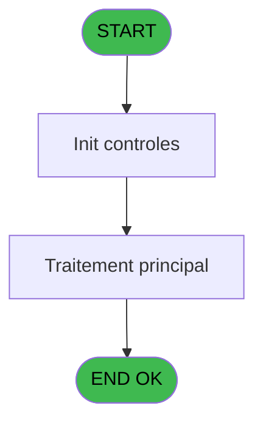
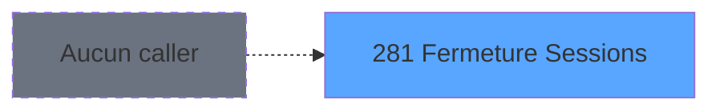
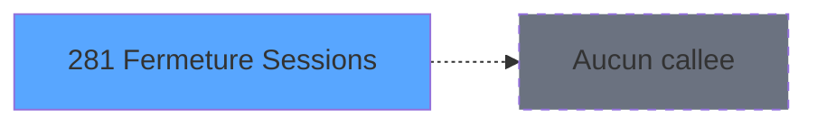

Review the generated code against the original specification.

Produce a JSON report:
```json
{
  "programId": 0,
  "programName": "",
  "coveragePct": 0,
  "rulesImplemented": 0,
  "rulesTotal": 0,
  "missingRules": [
    "rule descriptions not implemented"
  ],
  "recommendations": [
    "improvement suggestions"
  ]
}
```

Check:
1. Every business rule from the contract is implemented in the store
2. Every table from the contract has corresponding entity types
3. Every API endpoint is wired to the store
4. UI layout matches the spec description
5. Error handling is present for all actions

CONTRACT RULES:
[
  {
    "id": "RM-001",
    "description": "'N15'&IF([D]>0,'.'&Trim(Str([D],'1')),'')&'CZ'",
    "condition": "'N15'&IF([D]>0,'.'&Trim(Str([D],'1')),'')&'CZ'",
    "variables": [],
    "status": "IMPL",
    "targetFile": "adh-web/src/stores/saisieContenuCaisseStore.ts",
    "gapNotes": ""
  }
]

SPEC EXCERPT:
# ADH IDE 281 - Fermeture Sessions

> **Analyse**: Phases 1-4 2026-02-08 05:03 -> 05:03 (4s) | Assemblage 05:03
> **Pipeline**: V7.2 Enrichi
> **Structure**: 4 onglets (Resume | Ecrans | Donnees | Connexions)

<!-- TAB:Resume -->

## 1. FICHE D'IDENTITE

| Attribut | Valeur |
|----------|--------|
| Projet | ADH |
| IDE Position | 281 |
| Nom Programme | Fermeture Sessions |
| Fichier source | `Prg_281.xml` |
| Dossier IDE | Caisse |
| Taches | 1 (0 ecrans visibles) |
| Tables modifiees | 0 |
| Programmes appeles | 0 |
| Complexite | **BASSE** (score 0/100) |
| <span style="color:red">Statut</span> | <span style="color:red">**ORPHELIN_POTENTIEL**</span> |

## 2. DESCRIPTION FONCTIONNELLE

ADH IDE 281 - Fermeture Sessions est un programme de clôture des sessions de caisse. Il traite la finalisation des opérations comptables et monétaires d'une session ouverte, en recalculant les soldes, validant les écarts de trésorerie, et enregistrant les mouvements de fermeture dans les tables opérations et comptes.

Le programme gère plusieurs tâches critiques : vérification de la cohérence des données (montants, dates), calcul automatique des écarts entre comptabilité et physique, application des ajustements si nécessaire, et génération des pièces justificatives (éditions de clôture). Il s'intègre étroitement avec les modules de gestion des devises, des moyens de paiement, et de la comptabilité clients.

Ce programme est appelé depuis le flux principal de gestion de caisse (ADH IDE 121 - Gestion_Caisse_142) via un CallTask, généralement en fin de journée ou à la demande du caissier. Il s'appuie sur les programmes partagés du composant ADH.ecf pour les calculs de solde et les opérations d'édition.

## 3. BLOCS FONCTIONNELS

## 5. REGLES METIER

1 regles identifiees:

### Autres (1 regles)

#### <a id="rm-RM-001"></a>[RM-001] 'N15'&IF([D]>0,'.'&Trim(Str([D],'1')),'')&'CZ'

| Element | Detail |
|---------|--------|
| **Condition** | `'N15'&IF([D]>0,'.'&Trim(Str([D],'1')),'')&'CZ'` |
| **Si vrai** | Action conditionnelle |
| **Expression source** | Expression 2 : `'N15'&IF([D]>0,'.'&Trim(Str([D],'1')),'')&'CZ'` |
| **Exemple** | Si 'N15'&IF([D]>0,'.'&Trim(Str([D],'1')),'')&'CZ' → Action conditionnelle |

## 6. CONTEXTE

- **Appele par**: (aucun)
- **Appelle**: 0 programmes | **Tables**: 2 (W:0 R:1 L:1) | **Taches**: 1 | **Expressions**: 4

<!-- TAB:Ecrans -->

## 8. ECRANS

*(Programme sans ecran visible)*

## 9. NAVIGATION

### 9.3 Structure hierarchique (0 tache)

| Position | Tache | Type | Dimensions | Bloc |
|----------|-------|------|------------|------|

### 9.4 Algorigramme



> **Legende**: Vert = START/END OK | Rouge = END KO | Bleu = Decisions
> *Algorigramme auto-genere. Utiliser `/algorigramme` pour une synthese metier detaillee.*

<!-- TAB:Donnees -->

## 10. TABLES

### Tables utilisees (2)

| ID | Nom | Description | Type | R | W | L | Usages |
|----|-----|-------------|------|---|---|---|--------|
| 69 | initialisation___ini |  | DB | R |   |   | 1 |
| 122 | unilateral_bilateral |  | DB |   |   | L | 1 |

### Colonnes par table (0 / 1 tables avec colonnes identifiees)

<details>
<summary>Table 69 - initialisation___ini (R) - 1 usages</summary>

*Table utilisee uniquement en Link ou aucune colonne Real identifiee dans le DataView.*

</details>

## 11. VARIABLES

*(Programme sans variables locales mappees)*

## 12. EXPRESSIONS

**4 / 4 expressions decodees (100%)**

### 12.1 Repartition par type

| Type | Expressions | Regles |
|------|-------------|--------|
| FORMAT | 1 | 0 |
| CONSTANTE | 3 | 0 |

### 12.2 Expressions cles par type

#### FORMAT (1 expressions)

| Type | IDE | Expression | Regle |
|------|-----|------------|-------|
| FORMAT | 2 | `'N15'&IF([D]>0,'.'&Trim(Str([D],'1')),'')&'CZ'` | - |

#### CONSTANTE (3 expressions)

| Type | IDE | Expression | Regle |
|------|-----|------------|-------|
| CONSTANTE | 4 | `90` | - |
| CONSTANTE | 3 | `'O'` | - |
| CONSTANTE | 1 | `'C'` | - |

<!-- TAB:Connexions -->

## 13. GRAPHE D'APPELS

### 13.1 Chaine depuis Main (Callers)

**Chemin**: (pas de callers directs)



### 13.2 Callers

| IDE | Nom Programme | Nb Appels |
|-----|---------------|-----------|
| - | (aucun) | - |

### 13.3 Callees (programmes appeles)



### 13.4 Detail Callees avec contexte

| IDE | Nom Programme | Appels | Contexte |
|-----|---------------|--------|----------|
| - | (aucun) |

GENERATED FILES:

--- types/fermetureSessions.ts ---
// Fermeture Sessions types (ADH IDE 131)

export type SessionStatus = 'O' | 'C' | 'B'; // Open, Closed, Blocked

export interface Session {
  id: number;
  dateOuverture: Date;
  dateFermeture: Date | null;
  statut: SessionStatus;
}

export interface UnilateralBilateral {
  code: string;
  libelle: string;
  type: string;
}

export interface SessionClosureCode {
  sessionId: number;
  code: string;
  generatedAt: Date;
}

export interface SessionValidation {
  valid: boolean;
  errors: string[];
}

export interface SessionClosureResult {
  success: boolean;
  closureCode: string;
  sessionId: number;
  closedAt: Date;
}

// API Request/Response types

export interface FetchSessionsRequest {
  statut?: SessionStatus;
}

export interface FetchSessionsResponse {
  sessions: Session[];
}

export type FetchUnilateralBilateralRequest = Record<string, never>;

export interface FetchUnilateralBilateralResponse {
  types: UnilateralBilateral[];
}

export interface ValidateSessionClosureRequest {
  sessionId: number;
}

export interface ValidateSessionClosureResponse {
  valid: boolean;
  errors: string[];
}

export interface CloseSessionRequest {
  sessionId: number;
}

export interface CloseSessionResponse {
  success: boolean;
  closureCode: string;
}

// Store state interface

export interface FermetureSessionsState {
  sessions: Session[];
  currentSession: Session | null;
  unilateralBilateralTypes: UnilateralBilateral[];
  isLoading: boolean;
  error: string | null;
  isClosing: boolean;

  // Actions
  loadSessions: (filters?: FetchSessionsRequest) => Promise<void>;
  loadUnilateralBilateralTypes: () => Promise<void>;
  fermerSession: (sessionId: number) => Promise<void>;
  generateClosureCode: (sessionId: number) => string;
  validateSessionClosure: (sessionId: number) => Promise<boolean>;
  setCurrentSession: (session: Session | null) => void;
  clearError: () => void;
  reset: 

--- stores/fermetureSessionsStore.ts ---
import { create } from 'zustand';
import type {
  Session,
  UnilateralBilateral,
  SessionClosureResult,
  FermetureSessionsState,
} from '@/types/fermetureSessions';
import { apiClient } from '@/services/api/apiClient';
import type { ApiResponse } from '@/services/api/apiClient';
import { useDataSourceStore } from '@/stores/dataSourceStore';

interface FermetureSessionsActions {
  loadSessions: (filters?: { statut?: string }) => Promise<void>;
  loadUnilateralBilateralTypes: () => Promise<void>;
  fermerSession: (sessionId: number) => Promise<void>;
  generateClosureCode: (sessionId: number) => string;
  validateSessionClosure: (sessionId: number) => Promise<boolean>;
  setCurrentSession: (session: Session | null) => void;
  clearError: () => void;
  reset: () => void;
}

type FermetureSessionsStore = FermetureSessionsState & FermetureSessionsActions;

const MOCK_SESSIONS: Session[] = [
  { id: 1, dateOuverture: new Date('2026-02-19T08:00:00'), dateFermeture: null, statut: 'O' },
  { id: 2, dateOuverture: new Date('2026-02-18T08:00:00'), dateFermeture: null, statut: 'O' },
  { id: 3, dateOuverture: new Date('2026-02-17T08:00:00'), dateFermeture: null, statut: 'O' },
  { id: 4, dateOuverture: new Date('2026-02-16T08:00:00'), dateFermeture: new Date('2026-02-16T18:00:00'), statut: 'C' },
  { id: 5, dateOuverture: new Date('2026-02-15T08:00:00'), dateFermeture: new Date('2026-02-15T18:00:00'), statut: 'C' },
];

const MOCK_TYPES: UnilateralBilateral[] = [
  { code: 'UNI', libelle: 'Unilateral', type: 'unilateral' },
  { code: 'BIL', libelle: 'Bilateral', type: 'bilateral' },
  { code: 'MIX', libelle: 'Mixed', type: 'mixed' },
];

const initialState: FermetureSessionsState = {
  sessions: [],
  currentSession: null,
  unilateralBilateralTypes: [],
  isLoading: false,
  error: null,
  isClosing: false,
};

export const useFermetureSessionsStore = create<FermetureSessionsStore>()((set, get) => ({
  ...initialState,

  loadSessions: async (filters) => {
    const { isRea

--- services/api/endpoints-fermetureSessions.ts ---
import { apiClient, type ApiResponse } from '@/services/api/apiClient';
import type {
  Session,
  UnilateralBilateral,
  SessionClosureResult,
  SessionValidation,
  FetchSessionsRequest,
} from '@/types/fermetureSessions';

export const fermetureSessionsApi = {
  getSessions: (filters?: FetchSessionsRequest) => {
    const query = filters?.statut ? `?statut=${filters.statut}` : '';
    return apiClient.get<ApiResponse<Session[]>>(
      `/api/fermeture-sessions/sessions${query}`,
    );
  },

  getUnilateralBilateralTypes: () =>
    apiClient.get<ApiResponse<UnilateralBilateral[]>>(
      '/api/fermeture-sessions/types',
    ),

  closeSession: (sessionId: number) =>
    apiClient.post<ApiResponse<SessionClosureResult>>(
      `/api/fermeture-sessions/close/${sessionId}`,
      {},
    ),

  validateSession: (sessionId: number) =>
    apiClient.post<ApiResponse<SessionValidation>>(
      `/api/fermeture-sessions/validate/${sessionId}`,
      {},
    ),
};

--- pages/FermetureSessionsPage.tsx ---
import { useState, useEffect, useCallback } from 'react';
import { useNavigate } from 'react-router-dom';
import { ScreenLayout } from '@/components/layout';
import { Button } from '@/components/ui';
import { useFermetureSessionsStore } from '@/stores/fermetureSessionsStore';
import { useAuthStore } from '@/stores';
import type { Session } from '@/types/fermetureSessions';
import { cn } from '@/lib/utils';

type Phase = 'list' | 'confirm' | 'result';

export const FermetureSessionsPage = () => {
  const navigate = useNavigate();
  const user = useAuthStore((s) => s.user);

  const sessions = useFermetureSessionsStore((s) => s.sessions);
  const currentSession = useFermetureSessionsStore((s) => s.currentSession);
  const unilateralBilateralTypes = useFermetureSessionsStore((s) => s.unilateralBilateralTypes);
  const isLoading = useFermetureSessionsStore((s) => s.isLoading);
  const error = useFermetureSessionsStore((s) => s.error);
  const isClosing = useFermetureSessionsStore((s) => s.isClosing);
  const loadSessions = useFermetureSessionsStore((s) => s.loadSessions);
  const loadUnilateralBilateralTypes = useFermetureSessionsStore((s) => s.loadUnilateralBilateralTypes);
  const fermerSession = useFermetureSessionsStore((s) => s.fermerSession);
  const generateClosureCode = useFermetureSessionsStore((s) => s.generateClosureCode);
  const validateSessionClosure = useFermetureSessionsStore((s) => s.validateSessionClosure);
  const setCurrentSession = useFermetureSessionsStore((s) => s.setCurrentSession);
  const clearError = useFermetureSessionsStore((s) => s.clearError);
  const reset = useFermetureSessionsStore((s) => s.reset);

  const [phase, setPhase] = useState<Phase>('list');
  const [selectedSessionId, setSelectedSessionId] = useState<number | null>(null);
  const [closureCode, setClosureCode] = useState<string>('');
  const [validationErrors, setValidationErrors] = useState<string[]>([]);
  const [closureSuccess, setClosureSuccess] = useState(false);

  useEf

--- components/caisse/fermetureSessions/ClosureConfirmationPanel.tsx ---
import { useEffect } from 'react';
import { Button, Dialog } from '@/components/ui';
import { cn } from '@/lib/utils';

interface ClosureConfirmationPanelProps {
  sessionId: number | null;
  closureCode: string;
  validationErrors: string[];
  isClosing: boolean;
  onConfirm: () => void;
  onCancel: () => void;
  className?: string;
}

export const ClosureConfirmationPanel = ({
  sessionId,
  closureCode,
  validationErrors,
  isClosing,
  onConfirm,
  onCancel,
  className,
}: ClosureConfirmationPanelProps) => {
  const isOpen = sessionId !== null;
  const hasErrors = validationErrors.length > 0;

  useEffect(() => {
    if (!isOpen) {
      return;
    }
  }, [isOpen]);

  if (!isOpen) {
    return null;
  }

  return (
    <Dialog open={isOpen} onOpenChange={(open) => !open && onCancel()}>
      <div className={cn('flex flex-col gap-6 p-6', className)}>
        <div className="flex flex-col gap-2">
          <h2 className="text-xl font-semibold text-gray-900">
            Confirmation de fermeture
          </h2>
          <p className="text-sm text-gray-600">
            Session #{sessionId}
          </p>
        </div>

        {closureCode && (
          <div className="rounded-lg border border-blue-200 bg-blue-50 p-4">
            <div className="flex flex-col gap-2">
              <span className="text-sm font-medium text-blue-900">
                Code de fermeture généré
              </span>
              <span className="font-mono text-lg font-bold text-blue-700">
                {closureCode}
              </span>
            </div>
          </div>
        )}

        {hasErrors && (
          <div className="rounded-lg border border-red-200 bg-red-50 p-4">
            <div className="flex flex-col gap-2">
              <span className="text-sm font-medium text-red-900">
                Erreurs de validation
              </span>
              <ul className="ml-4 list-disc space-y-1">
                {validationErrors.map((error, idx) => (
          

--- components/caisse/fermetureSessions/ClosureResultsPanel.tsx ---
import type { SessionClosureResult } from '@/types/fermetureSessions';
import { Button } from '@/components/ui';
import { cn } from '@/lib/utils';

interface ClosureResultsPanelProps {
  result: SessionClosureResult | null;
  onPrintReport: () => void;
  onClose: () => void;
  className?: string;
}

export const ClosureResultsPanel = ({
  result,
  onPrintReport,
  onClose,
  className,
}: ClosureResultsPanelProps) => {
  if (!result) {
    return (
      <div className={cn('rounded-lg border border-red-200 bg-red-50 p-6', className)}>
        <div className="flex items-start gap-3">
          <div className="flex-shrink-0">
            <svg
              className="h-5 w-5 text-red-600"
              fill="none"
              stroke="currentColor"
              viewBox="0 0 24 24"
            >
              <path
                strokeLinecap="round"
                strokeLinejoin="round"
                strokeWidth={2}
                d="M6 18L18 6M6 6l12 12"
              />
            </svg>
          </div>
          <div className="flex-1">
            <h3 className="text-sm font-medium text-red-800">Échec de la fermeture</h3>
            <p className="mt-1 text-sm text-red-700">
              La session n'a pas pu être fermée. Veuillez vérifier les erreurs et réessayer.
            </p>
          </div>
        </div>
        <div className="mt-4 flex justify-end">
          <Button onClick={onClose} variant="outline" size="sm">
            Retour
          </Button>
        </div>
      </div>
    );
  }

  return (
    <div className={cn('rounded-lg border border-green-200 bg-green-50 p-6', className)}>
      <div className="flex items-start gap-3">
        <div className="flex-shrink-0">
          <svg
            className="h-5 w-5 text-green-600"
            fill="none"
            stroke="currentColor"
            viewBox="0 0 24 24"
          >
            <path
              strokeLinecap="round"
              strokeLinejoin="round"
              st

--- components/caisse/fermetureSessions/SessionListPanel.tsx ---
import type { Session } from '@/types/fermetureSessions';
import { cn } from '@/lib/utils';
import { Button } from '@/components/ui';

interface SessionListPanelProps {
  sessions: Session[];
  selectedSessionId: number | null;
  onSessionSelect: (sessionId: number | null) => void;
  onClosureRequest: () => void;
  isLoading: boolean;
  disabled?: boolean;
  className?: string;
}

const formatDate = (date: Date): string => {
  return new Intl.DateTimeFormat('fr-FR', {
    day: '2-digit',
    month: '2-digit',
    year: 'numeric',
    hour: '2-digit',
    minute: '2-digit',
  }).format(date);
};

const getStatusLabel = (status: Session['statut']): string => {
  const labels = {
    O: 'Ouverte',
    C: 'Fermée',
    B: 'Bloquée',
  } as const;
  return labels[status] || status;
};

const getStatusColor = (status: Session['statut']): string => {
  const colors = {
    O: 'text-green-600 bg-green-50',
    C: 'text-gray-600 bg-gray-50',
    B: 'text-red-600 bg-red-50',
  } as const;
  return colors[status] || 'text-gray-600 bg-gray-50';
};

export const SessionListPanel = ({
  sessions,
  selectedSessionId,
  onSessionSelect,
  onClosureRequest,
  isLoading,
  disabled = false,
  className,
}: SessionListPanelProps) => {
  const openSessions = sessions.filter((s) => s.statut === 'O');

  const handleRowClick = (sessionId: number) => {
    if (disabled) return;
    onSessionSelect(selectedSessionId === sessionId ? null : sessionId);
  };

  const handleClosureClick = () => {
    if (selectedSessionId === null || disabled) return;
    onClosureRequest();
  };

  return (
    <div className={cn('flex flex-col gap-4', className)}>
      <div className="flex items-center justify-between">
        <h2 className="text-lg font-semibold">Sessions ouvertes</h2>
        <Button
          onClick={handleClosureClick}
          disabled={selectedSessionId === null || disabled || isLoading}
          variant="primary"
        >
          Fermer la session
        </Button>
      </di