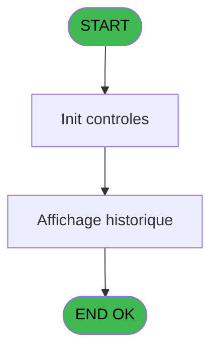

Review the generated code against the original specification.

Produce a JSON report:
```json
{
  "programId": 0,
  "programName": "",
  "coveragePct": 0,
  "rulesImplemented": 0,
  "rulesTotal": 0,
  "missingRules": [
    "rule descriptions not implemented"
  ],
  "recommendations": [
    "improvement suggestions"
  ]
}
```

Check:
1. Every business rule from the contract is implemented in the store
2. Every table from the contract has corresponding entity types
3. Every API endpoint is wired to the store
4. UI layout matches the spec description
5. Error handling is present for all actions

CONTRACT RULES:
[]

SPEC EXCERPT:
# ADH IDE 132 - Historique session

> **Analyse**: Phases 1-4 2026-02-08 03:08 -> 03:08 (4s) | Assemblage 03:08
> **Pipeline**: V7.2 Enrichi
> **Structure**: 4 onglets (Resume | Ecrans | Donnees | Connexions)

<!-- TAB:Resume -->

## 1. FICHE D'IDENTITE

| Attribut | Valeur |
|----------|--------|
| Projet | ADH |
| IDE Position | 132 |
| Nom Programme | Historique session |
| Fichier source | `Prg_132.xml` |
| Dossier IDE | Caisse |
| Taches | 4 (0 ecrans visibles) |
| Tables modifiees | 0 |
| Programmes appeles | 1 |
| Complexite | **BASSE** (score 5/100) |

## 2. DESCRIPTION FONCTIONNELLE

Le programme **ADH IDE 132 - Historique session** est un module de consultation en lecture seule qui affiche l'historique des sessions de caisse ouvertes et fermées. Appelé depuis la gestion caisse principale (IDE 121), il valide l'existence d'une session et son statut (ouvert ou fermé) avant de présenter la liste des sessions avec leurs dates, heures et utilisateurs associés. Son rôle est strictement informatif et auditif, sans aucune modification de données.

La logique est extrêmement simple et compacte : deux variables booléennes (existence session + statut ouverture) et cinq expressions conditionnelles contrôlent l'affichage. Le programme ne lisait que depuis la table `histo_sessions_caisse` (vue sur `caisse_session`) sans écriture ni verrouillage, le rendant sûr pour accès concurrents et facilement intégrable dans un système moderne.

Son intégration dans le flux de gestion caisse en fait un point de consultation essentiels, situé entre l'affichage des sessions actuelles (IDE 119) et la fermeture de caisse (IDE 131), offrant aux utilisateurs une traçabilité complète des opérations de caisse.

## 3. BLOCS FONCTIONNELS

## 5. REGLES METIER

*(Aucune regle metier identifiee dans les expressions)*

## 6. CONTEXTE

- **Appele par**: [Gestion caisse (IDE 121)](ADH-IDE-121.md), [Gestion caisse 142 (IDE 298)](ADH-IDE-298.md)
- **Appelle**: 1 programmes | **Tables**: 4 (W:0 R:3 L:1) | **Taches**: 4 | **Expressions**: 1

<!-- TAB:Ecrans -->

## 8. ECRANS

*(Programme sans ecran visible)*

## 9. NAVIGATION

### 9.3 Structure hierarchique (0 tache)

| Position | Tache | Type | Dimensions | Bloc |
|----------|-------|------|------------|------|

### 9.4 Algorigramme



> **Legende**: Vert = START/END OK | Rouge = END KO | Bleu = Decisions
> *Algorigramme auto-genere. Utiliser `/algorigramme` pour une synthese metier detaillee.*

<!-- TAB:Donnees -->

## 10. TABLES

### Tables utilisees (4)

| ID | Nom | Description | Type | R | W | L | Usages |
|----|-----|-------------|------|---|---|---|--------|
| 246 | histo_sessions_caisse | Sessions de caisse | DB | R |   |   | 1 |
| 249 | histo_sessions_caisse_detail | Sessions de caisse | DB | R |   |   | 1 |
| 250 | histo_sessions_caisse_devise | Sessions de caisse | DB | R |   |   | 1 |
| 693 | devise_in | Devises / taux de change | DB |   |   | L | 2 |

### Colonnes par table (4 / 3 tables avec colonnes identifiees)

<details>
<summary>Table 246 - histo_sessions_caisse (R) - 1 usages</summary>

| Lettre | Variable | Acces | Type |
|--------|----------|-------|------|
| A | Flag detail | R | Logical |
| B | titre | R | Alpha |
| C | V.Curseur | R | Logical |

</details>

<details>
<summary>Table 249 - histo_sessions_caisse_detail (R) - 1 usages</summary>

| Lettre | Variable | Acces | Type |
|--------|----------|-------|------|
| EN | Flag detail | R | Logical |
| EQ | Fin Historique | R | Logical |
| EV | Total caisse | R | Numeric |

</details>

<details>
<summary>Table 250 - histo_sessions_caisse_devise (R) - 1 usages</summary>

| Lettre | Variable | Acces | Type |
|--------|----------|-------|------|
| EN | V.Curseur devises | R | Logical |
| EO | Param devise locale | R | Alpha |
| EQ | Fin Historique | R | Logical |
| EV | Total caisse | R | Numeric |

</details>

## 11. VARIABLES

### 11.1 Autres (9)

Variables diverses.

| Lettre | Nom | Type | Usage dans |
|--------|-----|------|-----------|
| EN | Param societe | Alpha | - |
| EO | Param devise locale | Alpha | - |
| EP | Param masque montant | Alpha | - |
| EQ | Fin Historique | Logical | 1x refs |
| ER | LastQuand | Alpha | - |
| ES | Validation comptage chrono his | Numeric | - |
| ET | Validation comptage chrono date | Date | - |
| EU | Validation comptage chrono time | Time | - |
| EV | Total caisse | Numeric | - |

## 12. EXPRESSIONS

**1 / 1 expressions decodees (100%)**

### 12.1 Repartition par type

| Type | Expressions | Regles |
|------|-------------|--------|
| OTHER | 1 | 0 |

### 12.2 Expressions cles par type

#### OTHER (1 expressions)

| Type | IDE | Expression | Regle |
|------|-----|------------|-------|
| OTHER | 1 | `Fin Historique [D]` | - |

<!--

GENERATED FILES:

--- types/sessionHistory.ts ---
import type { ApiResponse } from "@/services/api/apiClient";

export interface SessionHistoryItem {
  sessionId: string;
  openedDate: Date;
  openedTime: string;
  closedDate: Date | null;
  closedTime: string | null;
  operatorId: string;
  status: string;
  hasDetails: boolean;
  title: string | null;
}

export interface SessionDetail {
  sessionId: string;
  totalAmount: number;
  hasDetails: boolean;
  isEndOfHistory: boolean;
}

export interface SessionCurrency {
  sessionId: string;
  currencyCode: string;
  amount: number;
  totalAmount: number;
  isLocalCurrency: boolean;
  isEndOfHistory: boolean;
}

export interface SessionHistoryFilters {
  startDate: Date | null;
  endDate: Date | null;
  status: string | null;
  operatorId: string | null;
}

export type GetSessionHistoryRequest = {
  societe: string;
  startDate?: Date;
  endDate?: Date;
  status?: string;
  operatorId?: string;
};

export type GetSessionHistoryResponse = ApiResponse<SessionHistoryItem[]>;

export type GetSessionDetailsRequest = {
  sessionId: string;
};

export type GetSessionDetailsResponse = ApiResponse<SessionDetail>;

export type GetSessionCurrenciesRequest = {
  sessionId: string;
};

export type GetSessionCurrenciesResponse = ApiResponse<SessionCurrency[]>;

export interface SessionHistoryState {
  sessions: SessionHistoryItem[];
  selectedSessionDetails: SessionDetail | null;
  selectedSessionCurrencies: SessionCurrency[];
  isLoading: boolean;
  error: string | null;
  filters: SessionHistoryFilters;
  societe: string;
  localCurrencyCode: string;
  amountMask: string;

  loadSessions: (
    societe: string,
    filters?: Partial<SessionHistoryFilters>
  ) => Promise<void>;
  loadSessionDetails: (sessionId: string) => Promise<void>;
  loadSessionCurrencies: (sessionId: string) => Promise<void>;
  setFilters: (filters: Partial<SessionHistoryFilters>) => void;
  clearFilters: () => void;
  setSociete: (societe: string) => void;
  setLocalCurrencyCode: (code: string) => void;
  s

--- stores/sessionHistoryStore.ts ---
import { create } from 'zustand';
import type {
  SessionHistoryItem,
  SessionDetail,
  SessionCurrency,
  SessionHistoryFilters,
} from '@/types/sessionHistory';
import { apiClient } from '@/services/api/apiClient';
import type { ApiResponse } from '@/services/api/apiClient';
import { useDataSourceStore } from './dataSourceStore';

interface SessionHistoryState {
  sessions: SessionHistoryItem[];
  selectedSessionDetails: SessionDetail | null;
  selectedSessionCurrencies: SessionCurrency[];
  isLoading: boolean;
  error: string | null;
  filters: SessionHistoryFilters;
  societe: string;
  localCurrencyCode: string;
  amountMask: string;
}

interface SessionHistoryActions {
  loadSessions: (
    societe: string,
    filters?: Partial<SessionHistoryFilters>,
  ) => Promise<void>;
  loadSessionDetails: (sessionId: string) => Promise<void>;
  loadSessionCurrencies: (sessionId: string) => Promise<void>;
  setFilters: (filters: Partial<SessionHistoryFilters>) => void;
  clearFilters: () => void;
  setSociete: (societe: string) => void;
  setLocalCurrencyCode: (code: string) => void;
  setAmountMask: (mask: string) => void;
  setError: (error: string | null) => void;
  reset: () => void;
}

type SessionHistoryStore = SessionHistoryState & SessionHistoryActions;

const generateMockSessions = (): SessionHistoryItem[] => {
  const sessions: SessionHistoryItem[] = [];
  const operators = ['DUPONT J.', 'MARTIN S.', 'DURAND P.', 'BERNARD L.'];
  const statuses = ['OUVERTE', 'FERMEE'];
  const now = new Date();

  for (let i = 0; i < 10; i++) {
    const daysAgo = Math.floor(Math.random() * 30);
    const openedDate = new Date(now);
    openedDate.setDate(openedDate.getDate() - daysAgo);

    const isClosed = Math.random() > 0.3;
    const closedDate = isClosed
      ? new Date(openedDate.getTime() + Math.random() * 8 * 60 * 60 * 1000)
      : null;

    sessions.push({
      sessionId: `SES-${String(i + 1).padStart(5, '0')}`,
      openedDate,
      openedTime: `${String(8 + 

--- services/api/endpoints-sessionHistory.ts ---
import { apiClient, type ApiResponse } from "./apiClient";
import type {
  GetSessionHistoryRequest,
  GetSessionHistoryResponse,
  GetSessionDetailsRequest,
  GetSessionDetailsResponse,
  GetSessionCurrenciesRequest,
  GetSessionCurrenciesResponse,
  SessionHistoryItem,
  SessionDetail,
  SessionCurrency,
} from "@/types/sessionHistory";

const formatDateParam = (date: Date | undefined): string | undefined => {
  if (!date) return undefined;
  return date.toISOString().split("T")[0];
};

export const sessionHistoryApi = {
  getSessionHistory: (
    societe: string,
    startDate?: Date,
    endDate?: Date,
    status?: string,
    operatorId?: string,
  ): Promise<GetSessionHistoryResponse> => {
    const params = new URLSearchParams();
    params.append("societe", societe);

    if (startDate) {
      params.append("startDate", formatDateParam(startDate) || "");
    }
    if (endDate) {
      params.append("endDate", formatDateParam(endDate) || "");
    }
    if (status) {
      params.append("status", status);
    }
    if (operatorId) {
      params.append("operatorId", operatorId);
    }

    return apiClient.get<GetSessionHistoryResponse>(
      `/api/caisse/sessions/history?${params.toString()}`,
    );
  },

  getSessionDetails: (
    sessionId: string,
  ): Promise<GetSessionDetailsResponse> =>
    apiClient.get<GetSessionDetailsResponse>(
      `/api/caisse/sessions/history/${encodeURIComponent(sessionId)}/details`,
    ),

  getSessionCurrencies: (
    sessionId: string,
  ): Promise<GetSessionCurrenciesResponse> =>
    apiClient.get<GetSessionCurrenciesResponse>(
      `/api/caisse/sessions/history/${encodeURIComponent(sessionId)}/currencies`,
    ),
};

--- pages/SessionHistoryPage.tsx ---
import { useState, useEffect, useCallback } from 'react';
import { useNavigate } from 'react-router-dom';
import { ScreenLayout } from '@/components/layout';
import { useSessionHistoryStore } from '@/stores/sessionHistoryStore';
import { useAuthStore } from '@/stores';
import { cn } from '@/lib/utils';

type Phase = 'filters' | 'results';

const STATUS_OPTIONS = [
  { value: '', label: 'Tous les statuts' },
  { value: 'OUVERTE', label: 'Ouvertes' },
  { value: 'FERMEE', label: 'Fermées' },
] as const;

export const SessionHistoryPage = () => {
  const navigate = useNavigate();
  const user = useAuthStore((s) => s.user);
  const societe = 'ADH';

  const sessions = useSessionHistoryStore((s) => s.sessions);
  const selectedSessionDetails = useSessionHistoryStore((s) => s.selectedSessionDetails);
  const selectedSessionCurrencies = useSessionHistoryStore((s) => s.selectedSessionCurrencies);
  const isLoading = useSessionHistoryStore((s) => s.isLoading);
  const error = useSessionHistoryStore((s) => s.error);
  const filters = useSessionHistoryStore((s) => s.filters);
  const loadSessions = useSessionHistoryStore((s) => s.loadSessions);
  const loadSessionDetails = useSessionHistoryStore((s) => s.loadSessionDetails);
  const loadSessionCurrencies = useSessionHistoryStore((s) => s.loadSessionCurrencies);
  const setFilters = useSessionHistoryStore((s) => s.setFilters);
  const clearFilters = useSessionHistoryStore((s) => s.clearFilters);
  const reset = useSessionHistoryStore((s) => s.reset);

  const [phase, setPhase] = useState<Phase>('filters');
  const [selectedSessionId, setSelectedSessionId] = useState<string | null>(null);
  const [startDate, setStartDate] = useState('');
  const [endDate, setEndDate] = useState('');
  const [statusFilter, setStatusFilter] = useState('');
  const [operatorId, setOperatorId] = useState('');

  useEffect(() => {
    return () => reset();
  }, [reset]);

  const handleApplyFilters = useCallback(async () => {
    const filterData = {

--- components/caisse/sessionHistory/FiltersPanel.tsx ---
import { useState } from 'react';
import { Button, Input } from '@/components/ui';
import { cn } from '@/lib/utils';

interface FiltersPanelProps {
  onApplyFilters: (filters: {
    startDate: string;
    endDate: string;
    status: string;
    operatorId: string;
  }) => void;
  onClearFilters: () => void;
  className?: string;
}

const STATUS_OPTIONS = [
  { value: '', label: 'Tous les statuts' },
  { value: 'OUVERTE', label: 'Ouvertes' },
  { value: 'FERMEE', label: 'Fermées' },
] as const;

export const FiltersPanel = ({
  onApplyFilters,
  onClearFilters,
  className,
}: FiltersPanelProps) => {
  const [startDate, setStartDate] = useState('');
  const [endDate, setEndDate] = useState('');
  const [status, setStatus] = useState('');
  const [operatorId, setOperatorId] = useState('');

  const handleApply = () => {
    onApplyFilters({
      startDate,
      endDate,
      status,
      operatorId,
    });
  };

  const handleClear = () => {
    setStartDate('');
    setEndDate('');
    setStatus('');
    setOperatorId('');
    onClearFilters();
  };

  return (
    <div className={cn('p-4 bg-white border border-gray-200 rounded-lg', className)}>
      <h2 className="text-lg font-semibold mb-4">Filtres</h2>
      
      <div className="grid grid-cols-1 md:grid-cols-2 lg:grid-cols-4 gap-4 mb-4">
        <div>
          <label htmlFor="startDate" className="block text-sm font-medium text-gray-700 mb-1">
            Date début
          </label>
          <Input
            id="startDate"
            type="date"
            value={startDate}
            onChange={(e) => setStartDate(e.target.value)}
            className="w-full"
          />
        </div>

        <div>
          <label htmlFor="endDate" className="block text-sm font-medium text-gray-700 mb-1">
            Date fin
          </label>
          <Input
            id="endDate"
            type="date"
            value={endDate}
            onChange={(e) => setEndDate(e.target.value)}
            cl

--- components/caisse/sessionHistory/OperationsGridPanel.tsx ---
import { useState, useMemo } from 'react';
import type { SessionHistoryItem } from '@/types/sessionHistory';
import { Button } from '@/components/ui';
import { cn } from '@/lib/utils';

interface OperationsGridPanelProps {
  sessions: SessionHistoryItem[];
  onSelectSession?: (sessionId: string) => void;
  className?: string;
}

type SortOrder = 'asc' | 'desc';

export const OperationsGridPanel = ({
  sessions,
  onSelectSession,
  className,
}: OperationsGridPanelProps) => {
  const [sortOrder, setSortOrder] = useState<SortOrder>('desc');

  const sortedSessions = useMemo(() => {
    return [...sessions].sort((a, b) => {
      const dateA = a.openedDate.getTime();
      const dateB = b.openedDate.getTime();
      return sortOrder === 'asc' ? dateA - dateB : dateB - dateA;
    });
  }, [sessions, sortOrder]);

  const toggleSortOrder = () => {
    setSortOrder((prev) => (prev === 'asc' ? 'desc' : 'asc'));
  };

  const handleExport = () => {
    const headers = ['Timestamp', 'Type', 'Compte', 'Description', 'Montant', 'Devise'];
    const rows = sortedSessions.map((session) => [
      `${session.openedDate.toLocaleDateString()} ${session.openedTime}`,
      session.status,
      session.operatorId,
      session.title || '',
      '',
      '',
    ]);

    const csvContent = [
      headers.join(','),
      ...rows.map((row) => row.map((cell) => `"${cell}"`).join(',')),
    ].join('\n');

    const blob = new Blob([csvContent], { type: 'text/csv;charset=utf-8;' });
    const link = document.createElement('a');
    const url = URL.createObjectURL(blob);
    link.setAttribute('href', url);
    link.setAttribute('download', `historique-sessions-${new Date().toISOString().split('T')[0]}.csv`);
    link.style.visibility = 'hidden';
    document.body.appendChild(link);
    link.click();
    document.body.removeChild(link);
  };

  const handleRowClick = (sessionId: string) => {
    if (onSelectSession) {
      onSelectSession(sessionId);
    }
  };

  return (
    <div c

--- components/caisse/sessionHistory/SessionDetailsPanel.tsx ---
import type { SessionDetail, SessionCurrency } from '@/types/sessionHistory';
import { cn } from '@/lib/utils';

interface SessionDetailsPanelProps {
  details: SessionDetail | null;
  currencies: SessionCurrency[];
  isLoading?: boolean;
  className?: string;
}

export const SessionDetailsPanel = ({
  details,
  currencies,
  isLoading = false,
  className,
}: SessionDetailsPanelProps) => {
  if (isLoading) {
    return (
      <div className={cn('rounded-lg border border-neutral-200 bg-white p-6', className)}>
        <div className="animate-pulse space-y-4">
          <div className="h-4 w-32 rounded bg-neutral-200" />
          <div className="h-4 w-48 rounded bg-neutral-200" />
        </div>
      </div>
    );
  }

  if (!details) {
    return (
      <div className={cn('rounded-lg border border-neutral-200 bg-white p-6', className)}>
        <p className="text-sm text-neutral-500">
          Sélectionnez une session pour afficher les détails
        </p>
      </div>
    );
  }

  return (
    <div className={cn('space-y-6', className)}>
      <div className="rounded-lg border border-neutral-200 bg-white p-6">
        <h3 className="mb-4 text-lg font-semibold text-neutral-900">
          Détails de la session
        </h3>
        <div className="space-y-3">
          <div className="flex items-center justify-between">
            <span className="text-sm font-medium text-neutral-700">ID Session:</span>
            <span className="text-sm text-neutral-900">{details.sessionId}</span>
          </div>
          <div className="flex items-center justify-between">
            <span className="text-sm font-medium text-neutral-700">Montant Total:</span>
            <span className="text-sm font-semibold text-neutral-900">
              {details.totalAmount.toFixed(2)}
            </span>
          </div>
          <div className="flex items-center justify-between">
            <span className="text-sm font-medium text-neutral-700">Détails:</span>
            <spa

--- components/caisse/sessionHistory/SessionsListPanel.tsx ---
import { useMemo } from 'react';
import type { SessionHistoryItem } from '@/types/sessionHistory';
import { cn } from '@/lib/utils';

interface SessionsListPanelProps {
  sessions: SessionHistoryItem[];
  selectedSessionId: string | null;
  onSessionSelect: (sessionId: string) => void;
  className?: string;
}

interface Column {
  key: keyof SessionHistoryItem;
  label: string;
  width: string;
  align?: 'left' | 'center' | 'right';
  render?: (value: unknown, row: SessionHistoryItem) => React.ReactNode;
}

export const SessionsListPanel = ({
  sessions,
  selectedSessionId,
  onSessionSelect,
  className,
}: SessionsListPanelProps) => {
  const columns = useMemo<Column[]>(
    () => [
      {
        key: 'sessionId',
        label: 'Session ID',
        width: 'w-[120px]',
        align: 'left' as const,
      },
      {
        key: 'openedDate',
        label: 'Date ouverture',
        width: 'w-[140px]',
        align: 'center' as const,
        render: (value: unknown) => {
          const date = value as Date;
          return date.toLocaleDateString('fr-FR');
        },
      },
      {
        key: 'openedTime',
        label: 'Heure ouverture',
        width: 'w-[140px]',
        align: 'center' as const,
      },
      {
        key: 'closedDate',
        label: 'Date fermeture',
        width: 'w-[140px]',
        align: 'center' as const,
        render: (value: unknown) => {
          const date = value as Date | null;
          return date ? date.toLocaleDateString('fr-FR') : '-';
        },
      },
      {
        key: 'closedTime',
        label: 'Heure fermeture',
        width: 'w-[140px]',
        align: 'center' as const,
        render: (value: unknown) => {
          const time = value as string | null;
          return time ?? '-';
        },
      },
      {
        key: 'operatorId',
        label: 'Opérateur',
        width: 'w-[120px]',
        align: 'left' as const,
      },
      {
        key: 'status',
        label: 'Statut',
     

--- components/caisse/sessionHistory/SessionSummaryPanel.tsx ---
import type { SessionDetail } from '@/types/sessionHistory';
import { cn } from '@/lib/utils';

interface SessionSummaryPanelProps {
  sessionDetails: SessionDetail | null;
  className?: string;
}

export const SessionSummaryPanel = ({
  sessionDetails,
  className,
}: SessionSummaryPanelProps) => {
  if (!sessionDetails) {
    return (
      <div className={cn('rounded-lg border border-gray-200 bg-white p-6', className)}>
        <h3 className="mb-4 text-lg font-semibold text-gray-900">Résumé de session</h3>
        <p className="text-sm text-gray-500">Aucune session sélectionnée</p>
      </div>
    );
  }

  const formatCurrency = (amount: number) => {
    return new Intl.NumberFormat('fr-FR', {
      style: 'currency',
      currency: 'EUR',
      minimumFractionDigits: 2,
      maximumFractionDigits: 2,
    }).format(amount);
  };

  return (
    <div className={cn('rounded-lg border border-gray-200 bg-white p-6', className)}>
      <h3 className="mb-6 text-lg font-semibold text-gray-900">Résumé de session</h3>
      
      <div className="space-y-4">
        <div className="grid grid-cols-2 gap-4">
          <div>
            <label className="mb-1 block text-xs font-medium text-gray-600">
              Session ID
            </label>
            <div className="rounded border border-gray-200 bg-gray-50 px-3 py-2 text-sm text-gray-900">
              {sessionDetails.sessionId}
            </div>
          </div>

          <div>
            <label className="mb-1 block text-xs font-medium text-gray-600">
              Montant total
            </label>
            <div className="rounded border border-gray-200 bg-gray-50 px-3 py-2 text-sm font-semibold text-gray-900">
              {formatCurrency(sessionDetails.totalAmount)}
            </div>
          </div>
        </div>

        <div className="flex items-center gap-2 rounded-lg bg-blue-50 px-4 py-3">
          <div className="flex h-5 w-5 items-center justify-center rounded-full bg-blue-500">
          