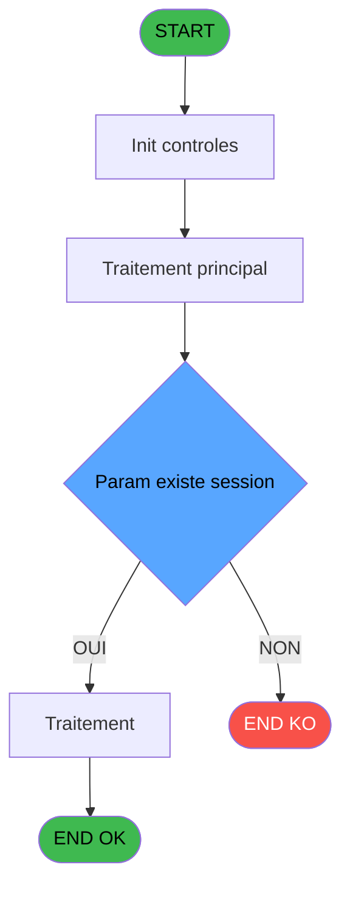

Review the generated code against the original specification.

Produce a JSON report:
```json
{
  "programId": 0,
  "programName": "",
  "coveragePct": 0,
  "rulesImplemented": 0,
  "rulesTotal": 0,
  "missingRules": [
    "rule descriptions not implemented"
  ],
  "recommendations": [
    "improvement suggestions"
  ]
}
```

Check:
1. Every business rule from the contract is implemented in the store
2. Every table from the contract has corresponding entity types
3. Every API endpoint is wired to the store
4. UI layout matches the spec description
5. Error handling is present for all actions

CONTRACT RULES:
[
  {
    "id": "RM-001",
    "description": "Condition: [C] egale 0",
    "condition": "[C]=0",
    "variables": [
      "EN"
    ],
    "status": "IMPL",
    "targetFile": "adh-web/src/stores/saisieContenuCaisseStore.ts",
    "gapNotes": ""
  },
  {
    "id": "RM-002",
    "description": "Condition composite: Param existe session [A] AND Param existe session o... [B]",
    "condition": "Param existe session [A] AND Param existe session o... [B]",
    "variables": [
      "EN"
    ],
    "status": "IMPL",
    "targetFile": "adh-web/src/services/printer/generators/ouvertureTicketGenerator.ts",
    "gapNotes": ""
  }
]

SPEC EXCERPT:
# ADH IDE 118 - Sessions ouvertes WS

> **Analyse**: Phases 1-4 2026-02-08 02:58 -> 02:58 (4s) | Assemblage 02:58
> **Pipeline**: V7.2 Enrichi
> **Structure**: 4 onglets (Resume | Ecrans | Donnees | Connexions)

<!-- TAB:Resume -->

## 1. FICHE D'IDENTITE

| Attribut | Valeur |
|----------|--------|
| Projet | ADH |
| IDE Position | 118 |
| Nom Programme | Sessions ouvertes WS |
| Fichier source | `Prg_118.xml` |
| Dossier IDE | Caisse |
| Taches | 1 (0 ecrans visibles) |
| Tables modifiees | 0 |
| Programmes appeles | 0 |
| Complexite | **BASSE** (score 0/100) |

## 2. DESCRIPTION FONCTIONNELLE

# ADH IDE 118 - Sessions ouvertes WS

Programme de consultation des sessions ouvertes actuellement, avec affichage des données clés (numéro compte, opérateur, devise, montant). Utilisé comme source de données pour l'écran de gestion des sessions (IDE 119), d'où il est appelé via CallTask pour alimenter une grille/table avec les sessions actives.

Structure basée sur une requête vers la table des sessions (sessions_dat ou équivalent), avec filtrage par statut ouvert et tri par ordre chronologique. Les variables retournées incluent identifiants compte/filiation/société, détails opérateur et métadonnées monétaires (devise locale, montants coffre).

Point d'intégration critique dans le flux "Gestion Caisse" — IDÉ 118 fournit la liste des contextes actifs que l'opérateur doit fermer ou consulter. Pas d'interface visuelle propre (données brutes), mais rôle de data provider pour l'écran IDÉ 119 qui présente ces données à l'utilisateur final.

## 3. BLOCS FONCTIONNELS

## 5. REGLES METIER

2 regles identifiees:

### Autres (2 regles)

#### <a id="rm-RM-001"></a>[RM-001] Condition: [C] egale 0

| Element | Detail |
|---------|--------|
| **Condition** | `[C]=0` |
| **Si vrai** | Action si vrai |
| **Expression source** | Expression 4 : `[C]=0` |
| **Exemple** | Si [C]=0 → Action si vrai |

#### <a id="rm-RM-002"></a>[RM-002] Condition composite: Param existe session [A] AND Param existe session o... [B]

| Element | Detail |
|---------|--------|
| **Condition** | `Param existe session [A] AND Param existe session o... [B]` |
| **Si vrai** | Action si vrai |
| **Variables** | EN (Param existe session) |
| **Expression source** | Expression 5 : `Param existe session [A] AND Param existe session o... [B]` |
| **Exemple** | Si Param existe session [A] AND Param existe session o... [B] → Action si vrai |

## 6. CONTEXTE

- **Appele par**: [Affichage sessions (IDE 119)](ADH-IDE-119.md)
- **Appelle**: 0 programmes | **Tables**: 1 (W:0 R:1 L:0) | **Taches**: 1 | **Expressions**: 5

<!-- TAB:Ecrans -->

## 8. ECRANS

*(Programme sans ecran visible)*

## 9. NAVIGATION

### 9.3 Structure hierarchique (0 tache)

| Position | Tache | Type | Dimensions | Bloc |
|----------|-------|------|------------|------|

### 9.4 Algorigramme



> **Legende**: Vert = START/END OK | Rouge = END KO | Bleu = Decisions
> *Algorigramme auto-genere. Utiliser `/algorigramme` pour une synthese metier detaillee.*

<!-- TAB:Donnees -->

## 10. TABLES

### Tables utilisees (1)

| ID | Nom | Description | Type | R | W | L | Usages |
|----|-----|-------------|------|---|---|---|--------|
| 246 | histo_sessions_caisse | Sessions de caisse | DB | R |   |   | 1 |

### Colonnes par table (1 / 1 tables avec colonnes identifiees)

<details>
<summary>Table 246 - histo_sessions_caisse (R) - 1 usages</summary>

| Lettre | Variable | Acces | Type |
|--------|----------|-------|------|
| A | Param existe session | R | Logical |
| B | Param existe session ouverte | R | Logical |

</details>

## 11. VARIABLES

### 11.1 Autres (2)

Variables diverses.

| Lettre | Nom | Type | Usage dans |
|--------|-----|------|-----------|
| EN | Param existe session | Logical | 1x refs |
| EO | Param existe session ouverte | Logical | - |

## 12. EXPRESSIONS

**5 / 5 expressions decodees (100%)**

### 12.1 Repartition par type

| Type | Expressions | Regles |
|------|-------------|--------|
| CONDITION | 2 | 2 |
| CONSTANTE | 1 | 0 |
| CAST_LOGIQUE | 2 | 0 |

### 12.2 Expressions cles par type

#### CONDITION (2 expressions)

| Type | IDE | Expression | Regle |
|------|-----|------------|-------|
| CONDITION | 5 | `Param existe session [A] AND Param existe session o... [B]` | [RM-002](#rm-RM-002) |
| CONDITION | 4 | `[C]=0` | [RM-001](#rm-RM-001) |

#### CONSTANTE (1 expressions)

| Type | IDE | Expression | Regle |
|------|-----|------------|-------|
| CONSTANTE | 2 | `0` | - |

#### CAST_LOGIQUE (2 expr

GENERATED FILES:

--- types/sessionsOuvertes.ts ---
export interface SessionOuverte {
  societe: string;
  compte: string;
  filiation: number;
  numeroSession: number;
  operateur: string;
  deviseLocale: string;
  montantCoffre: number;
  dateOuverture: Date;
  heureOuverture: string;
}

export interface SessionsOuvertesState {
  sessions: SessionOuverte[];
  isLoading: boolean;
  error: string | null;
  selectedSession: SessionOuverte | null;
  filtreSociete: string;
  filtreOperateur: string;
  chargerSessionsOuvertes: (societe?: string, operateur?: string) => Promise<void>;
  selectionnerSession: (session: SessionOuverte) => void;
  verifierExistenceSession: (numeroSession: number) => Promise<boolean>;
  rafraichir: () => Promise<void>;
  appliquerFiltres: (societe: string, operateur: string) => Promise<void>;
}

export interface GetSessionsOuvertesRequest {
  societe?: string;
  operateur?: string;
}

export interface GetSessionsOuvertesResponse {
  sessions: SessionOuverte[];
}

export interface VerifierExistenceSessionRequest {
  numeroSession: number;
}

export interface VerifierExistenceSessionResponse {
  existe: boolean;
}

export interface SessionsOuvertesFilters {
  societe: string;
  operateur: string;
}

export const SESSIONS_OUVERTES_STATUS = {
  OUVERT: 'ouvert',
  FERME: 'ferme',
} as const;

export type SessionStatut = typeof SESSIONS_OUVERTES_STATUS[keyof typeof SESSIONS_OUVERTES_STATUS];

--- stores/sessionsOuvertesStore.ts ---
import { create } from 'zustand';
import type {
  SessionOuverte,
  SessionsOuvertesState,
  GetSessionsOuvertesRequest,
  GetSessionsOuvertesResponse,
  VerifierExistenceSessionRequest,
  VerifierExistenceSessionResponse,
} from '@/types/sessionsOuvertes';
import { apiClient } from '@/services/api/apiClient';
import type { ApiResponse } from '@/services/api/apiClient';
import { useDataSourceStore } from '@/stores/dataSourceStore';

interface SessionsOuvertesActions {
  chargerSessionsOuvertes: (societe?: string, operateur?: string) => Promise<void>;
  selectionnerSession: (session: SessionOuverte) => void;
  verifierExistenceSession: (numeroSession: number) => Promise<boolean>;
  rafraichir: () => Promise<void>;
  appliquerFiltres: (societe: string, operateur: string) => Promise<void>;
  reset: () => void;
}

type SessionsOuvertesStore = SessionsOuvertesState & SessionsOuvertesActions;

const MOCK_SESSIONS: SessionOuverte[] = [
  {
    societe: 'SMRNS1',
    compte: 'CAI001',
    filiation: 0,
    numeroSession: 1001,
    operateur: 'MARTIN S.',
    deviseLocale: 'EUR',
    montantCoffre: 1500,
    dateOuverture: new Date('2026-02-21T08:00:00'),
    heureOuverture: '08:00',
  },
  {
    societe: 'SMRNS1',
    compte: 'CAI002',
    filiation: 0,
    numeroSession: 1002,
    operateur: 'DUPONT J.',
    deviseLocale: 'EUR',
    montantCoffre: 2000,
    dateOuverture: new Date('2026-02-21T08:15:00'),
    heureOuverture: '08:15',
  },
  {
    societe: 'SMRNS2',
    compte: 'CAI003',
    filiation: 0,
    numeroSession: 1003,
    operateur: 'BERNARD M.',
    deviseLocale: 'USD',
    montantCoffre: 3000,
    dateOuverture: new Date('2026-02-21T09:00:00'),
    heureOuverture: '09:00',
  },
  {
    societe: 'SMRNS1',
    compte: 'CAI004',
    filiation: 1,
    numeroSession: 1004,
    operateur: 'MARTIN S.',
    deviseLocale: 'EUR',
    montantCoffre: 500,
    dateOuverture: new Date('2026-02-21T10:30:00'),
    heureOuverture: '10:30',
  },
  {
    societe: 'SMRNS2',
    co

--- services/api/endpoints-sessionsOuvertes.ts ---
import { apiClient, type ApiResponse } from './apiClient';
import type {
  SessionOuverte,
  GetSessionsOuvertesRequest,
  GetSessionsOuvertesResponse,
  VerifierExistenceSessionRequest,
  VerifierExistenceSessionResponse,
} from '@/types/sessionsOuvertes';

export const sessionsOuvertesApi = {
  getSessions: (filters?: GetSessionsOuvertesRequest) => {
    const params = new URLSearchParams();
    if (filters?.societe) params.append('societe', filters.societe);
    if (filters?.operateur) params.append('operateur', filters.operateur);
    
    const queryString = params.toString();
    const url = queryString
      ? `/api/sessions/ouvertes?${queryString}`
      : '/api/sessions/ouvertes';

    return apiClient.get<ApiResponse<SessionOuverte[]>>(url);
  },

  getSessionsByFilters: (societe?: string, operateur?: string) => {
    const params = new URLSearchParams();
    if (societe) params.append('societe', societe);
    if (operateur) params.append('operateur', operateur);

    const queryString = params.toString();
    const url = queryString
      ? `/api/sessions/ouvertes?${queryString}`
      : '/api/sessions/ouvertes';

    return apiClient.get<ApiResponse<SessionOuverte[]>>(url);
  },

  verifierExistenceSession: (numeroSession: number) =>
    apiClient.get<ApiResponse<VerifierExistenceSessionResponse>>(
      `/api/sessions/existe/${numeroSession}`,
    ),
};

--- pages/SessionsOuvertesPage.tsx ---
import { useEffect, useCallback } from 'react';
import { useNavigate } from 'react-router-dom';
import { ScreenLayout } from '@/components/layout';
import { useSessionsOuvertesStore } from '@/stores/sessionsOuvertesStore';
import { useAuthStore } from '@/stores';
import type { SessionOuverte } from '@/types/sessionsOuvertes';
import { cn } from '@/lib/utils';

export const SessionsOuvertesPage = () => {
  const navigate = useNavigate();
  const user = useAuthStore((s) => s.user);

  const sessions = useSessionsOuvertesStore((s) => s.sessions);
  const isLoading = useSessionsOuvertesStore((s) => s.isLoading);
  const error = useSessionsOuvertesStore((s) => s.error);
  const selectedSession = useSessionsOuvertesStore((s) => s.selectedSession);
  const filtreSociete = useSessionsOuvertesStore((s) => s.filtreSociete);
  const filtreOperateur = useSessionsOuvertesStore((s) => s.filtreOperateur);
  const chargerSessionsOuvertes = useSessionsOuvertesStore((s) => s.chargerSessionsOuvertes);
  const selectionnerSession = useSessionsOuvertesStore((s) => s.selectionnerSession);
  const verifierExistenceSession = useSessionsOuvertesStore((s) => s.verifierExistenceSession);
  const rafraichir = useSessionsOuvertesStore((s) => s.rafraichir);
  const appliquerFiltres = useSessionsOuvertesStore((s) => s.appliquerFiltres);
  const reset = useSessionsOuvertesStore((s) => s.reset);

  useEffect(() => {
    chargerSessionsOuvertes();
    return () => reset();
  }, [chargerSessionsOuvertes, reset]);

  const handleSelectSession = useCallback(
    (session: SessionOuverte) => {
      selectionnerSession(session);
    },
    [selectionnerSession],
  );

  const handleRefresh = useCallback(() => {
    rafraichir();
  }, [rafraichir]);

  const handleFilterChange = useCallback(
    (societe: string, operateur: string) => {
      appliquerFiltres(societe, operateur);
    },
    [appliquerFiltres],
  );

  const handleBack = () => {
    navigate('/caisse/menu');
  };

  const groupedSessions 

--- components/caisse/sessionsOuvertes/DataSourcePanel.tsx ---
import type { SessionsOuvertesState } from '@/types/sessionsOuvertes';

interface DataSourcePanelProps {
  className?: string;
}

export const DataSourcePanel = ({ className }: DataSourcePanelProps) => {
  return null;
};