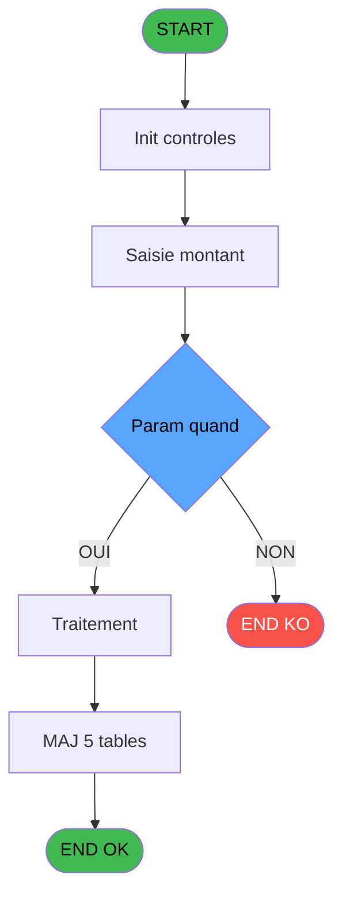

Review the generated code against the original specification.

Produce a JSON report:
```json
{
  "programId": 0,
  "programName": "",
  "coveragePct": 0,
  "rulesImplemented": 0,
  "rulesTotal": 0,
  "missingRules": [
    "rule descriptions not implemented"
  ],
  "recommendations": [
    "improvement suggestions"
  ]
}
```

Check:
1. Every business rule from the contract is implemented in the store
2. Every table from the contract has corresponding entity types
3. Every API endpoint is wired to the store
4. UI layout matches the spec description
5. Error handling is present for all actions

CONTRACT RULES:
[
  {
    "id": "RM-001",
    "description": "Condition: Param quand [D] different de 'P'",
    "condition": "Param quand [D]<>'P'",
    "variables": [
      "EQ"
    ],
    "status": "IMPL",
    "targetFile": "adh-web/src/stores/saisieContenuCaisseStore.ts",
    "gapNotes": ""
  }
]

SPEC EXCERPT:
# ADH IDE 125 - Remise en caisse

> **Analyse**: Phases 1-4 2026-02-08 03:05 -> 03:05 (4s) | Assemblage 03:05
> **Pipeline**: V7.2 Enrichi
> **Structure**: 4 onglets (Resume | Ecrans | Donnees | Connexions)

<!-- TAB:Resume -->

## 1. FICHE D'IDENTITE

| Attribut | Valeur |
|----------|--------|
| Projet | ADH |
| IDE Position | 125 |
| Nom Programme | Remise en caisse |
| Fichier source | `Prg_125.xml` |
| Dossier IDE | Caisse |
| Taches | 33 (0 ecrans visibles) |
| Tables modifiees | 5 |
| Programmes appeles | 3 |
| Complexite | **BASSE** (score 38/100) |

## 2. DESCRIPTION FONCTIONNELLE

ADH IDE 125 - REMISE EN CAISSE est un programme de gestion des remises d'articles et devises en session caisse. Il traite les mouvements de stock lors des dépôts en caisse : articles vendus, devises reçues, approvionnements. Le programme valide les quantités, contrôle les écarts de stock, et met à jour les tables de gestion de session (gestion_article_session, gestion_devise_session) ainsi que la trace des approvisionnements (saisie_approvisionnement).

Le flux principal récupère d'abord le titre du membre (IDE 43) pour contextualiser la remise, puis enregistre les mouvements de devises via une mise à jour de session WebSocket (IDE 142). Le programme calcule ensuite les stocks produits (IDE 149) pour vérifier la cohérence des quantités restantes. Les validations incluent les contrôles d'écart : si le montant remis ne correspond pas aux ventes enregistrées, le programme génère un PV de comptabilité (pv_comptable) documentant l'anomalie.

Ce programme est critique dans la chaîne de fermeture caisse - appelé depuis les écrans de Gestion Caisse (IDE 121, 298) et Fermeture Caisse (IDE 131, 299), il garantit que chaque remise d'argent et d'articles est tracée et équilibrée avant la clôture définitive de la session.

## 3. BLOCS FONCTIONNELS

## 5. REGLES METIER

1 regles identifiees:

### Autres (1 regles)

#### <a id="rm-RM-001"></a>[RM-001] Condition: Param quand [D] different de 'P'

| Element | Detail |
|---------|--------|
| **Condition** | `Param quand [D]<>'P'` |
| **Si vrai** | Action si vrai |
| **Variables** | EQ (Param quand) |
| **Expression source** | Expression 2 : `Param quand [D]<>'P'` |
| **Exemple** | Si Param quand [D]<>'P' → Action si vrai |

## 6. CONTEXTE

- **Appele par**: [Gestion caisse (IDE 121)](ADH-IDE-121.md), [Fermeture caisse (IDE 131)](ADH-IDE-131.md), [Gestion caisse 142 (IDE 298)](ADH-IDE-298.md), [Fermeture caisse 144 (IDE 299)](ADH-IDE-299.md)
- **Appelle**: 3 programmes | **Tables**: 9 (W:5 R:7 L:3) | **Taches**: 33 | **Expressions**: 2

<!-- TAB:Ecrans -->

## 8. ECRANS

*(Programme sans ecran visible)*

## 9. NAVIGATION

### 9.3 Structure hierarchique (0 tache)

| Position | Tache | Type | Dimensions | Bloc |
|----------|-------|------|------------|------|

### 9.4 Algorigramme



> **Legende**: Vert = START/END OK | Rouge = END KO | Bleu = Decisions
> *Algorigramme auto-genere. Utiliser `/algorigramme` pour une synthese metier detaillee.*

<!-- TAB:Donnees -->

## 10. TABLES

### Tables utilisees (9)

| ID | Nom | Description | Type | R | W | L | Usages |
|----|-----|-------------|------|---|---|---|--------|
| 505 | pv_comptable |  | TMP | R | **W** | L | 9 |
| 232 | gestion_devise_session | Sessions de caisse | DB | R | **W** | L | 7 |
| 244 | saisie_approvisionnement | Comptage approvisionnement | DB | R | **W** | L | 4 |
| 196 | gestion_article_session | Articles et stock | DB |   | **W** |   | 2 |
| 501 | email_reprise |  | TMP |   | **W** |   | 1 |
| 89 | moyen_paiement___mop |  | DB | R |   |   | 2 |
| 140 | moyen_paiement___mop |  | DB | R |   |   | 2 |
| 67 | tables___________tab |  | DB | R |   |   | 1 |
| 70 | date_comptable___dat |  | DB | R |   |   | 1 |

### Colonnes par table (4 / 9 tables avec colonnes identifiees)

<details>
<summary>Table 505 - pv_comptable (R/**W**/L) - 9 usages</summary>

| Lettre | Variable | Acces | Type |
|--------|----------|-------|------|
| EN | v date comptable | W | Date |

</details>

<details>
<summary>Table 232 - gestion_devise_session (R/**W**/L) - 7 usages</summary>

| Lettre | Variable | Acces | Type |
|--------|----------|-------|------|
| EO | Param devise locale | W | Alpha |
| ES | Nbre devises | W | Numeric |
| EX | Param Nbre devise comptees | W | Numeric |
| FE | Param Mt versement Nb devises | W | Numeric |

</details>

<details>
<summary>Table 244 - saisie_approvisionnement (R/**W**/L) - 4 usages</summary>

*Table utilisee 

GENERATED FILES:

--- types/saisieContenuCaisse.ts ---
import type { ApiResponse } from "@/services/api/apiClient";

export interface Denomination {
  id: number;
  deviseCode: string;
  valeur: number;
  libelle: string;
}

export interface ComptageDetail {
  denominationId: number;
  deviseCode: string;
  valeur: number;
  quantite: number;
  total: number;
}

export interface RecapMOP {
  moyenPaiement: string;
  moyenPaiementLibelle: string;
  attendu: number;
  compte: number;
  ecart: number;
}

export interface DeviseComptage {
  deviseCode: string;
  deviseLibelle: string;
  totalSaisi: number;
  denominations: ComptageDetail[];
}

export interface ValidationResult {
  totalCaisse: number;
  totalMonnaie: number;
  totalProduits: number;
  totalCartes: number;
  totalCheques: number;
  totalOD: number;
  shouldProcess: boolean;
  nbreDevise: number;
  fromIms: boolean;
}

export interface PersistanceResult {
  success: boolean;
  ticketUrl?: string;
  sessionId: number;
  timestamp: string;
}

export interface SaisieContenuCaisseState {
  activeDevise: string | null;
  comptageDevises: Map<string, DeviseComptage>;
  recapMOP: RecapMOP[];
  validationResult: ValidationResult | null;
  isValidating: boolean;
  validationError: string | null;
  isPersisting: boolean;
  canSubmit: boolean;
  devisesAutorisees: string[];
  sessionId: number | null;
  quand: "O" | "F" | null;

  initComptage: (
    sessionId: number,
    quand: "O" | "F",
    devisesAutorisees: string[]
  ) => Promise<void>;

  updateQuantite: (
    deviseCode: string,
    denominationId: number,
    quantite: number
  ) => void;

  switchDevise: (deviseCode: string) => void;

  validateComptage: () => Promise<ValidationResult>;

  loadRecapMOP: (sessionId: number) => Promise<RecapMOP[]>;

  persistComptage: (
    sessionId: number,
    validationResult: ValidationResult
  ) => Promise<PersistanceResult>;

  resetState: () => void;

  setValidationError: (error: s

--- stores/saisieContenuCaisseStore.ts ---
import { create } from "zustand";
import type {
  Denomination,
  ComptageDetail,
  DeviseComptage,
  RecapMOP,
  ValidationResult,
  PersistanceResult,
  GetDenominationsResponse,
  ValidateComptageResponse,
  GetRecapMOPResponse,
  PersistComptageResponse,
} from "@/types/saisieContenuCaisse";
import { apiClient } from "@/services/api/apiClient";
import { useDataSourceStore } from "@/stores/dataSourceStore";

interface SaisieContenuCaisseState {
  activeDevise: string | null;
  comptageDevises: Map<string, DeviseComptage>;
  recapMOP: RecapMOP[];
  validationResult: ValidationResult | null;
  isValidating: boolean;
  validationError: string | null;
  isPersisting: boolean;
  canSubmit: boolean;
  devisesAutorisees: string[];
  sessionId: number | null;
  quand: "O" | "F" | null;
}

interface SaisieContenuCaisseActions {
  initComptage: (
    sessionId: number,
    quand: "O" | "F",
    devisesAutorisees: string[]
  ) => Promise<void>;
  updateQuantite: (
    deviseCode: string,
    denominationId: number,
    quantite: number
  ) => void;
  switchDevise: (deviseCode: string) => void;
  validateComptage: () => Promise<ValidationResult>;
  loadRecapMOP: (sessionId: number) => Promise<RecapMOP[]>;
  persistComptage: (
    sessionId: number,
    validationResult: ValidationResult
  ) => Promise<PersistanceResult>;
  resetState: () => void;
  setValidationError: (error: string | null) => void;
}

type SaisieContenuCaisseStore = SaisieContenuCaisseState &
  SaisieContenuCaisseActions;

const MOCK_DENOMINATIONS: Record<string, Denomination[]> = {
  EUR: [
    { id: 1, deviseCode: "EUR", valeur: 500, libelle: "500 EUR" },
    { id: 2, deviseCode: "EUR", valeur: 200, libelle: "200 EUR" },
    { id: 3, deviseCode: "EUR", valeur: 100, libelle: "100 EUR" },
    { id: 4, deviseCode: "EUR", valeur: 50, libelle: "50 EUR" },
    { id: 5, deviseCode: "EUR", valeur: 20, libelle: "20 EUR" },
    { id: 6, deviseCode: "EUR"

--- services/api/endpoints-saisieContenuCaisse.ts ---
import { apiClient, type ApiResponse } from './apiClient';
import type {
  Denomination,
  RecapMOP,
  DeviseComptage,
  ValidationResult,
} from '@/types/saisieContenuCaisse';

export const saisieContenuCaisseApi = {
  getDenominations: (deviseCode: string) =>
    apiClient.get<ApiResponse<Denomination[]>>(
      `/api/caisse/denominations/${encodeURIComponent(deviseCode)}`,
    ),

  validateComptage: (data: {
    comptageDevises: Record<string, DeviseComptage>;
    nbreDevise: number;
    fromIms: boolean;
  }) =>
    apiClient.post<ApiResponse<ValidationResult>>(
      '/api/caisse/comptage/validate',
      data,
    ),

  getRecapMOP: (sessionId: number) =>
    apiClient.get<ApiResponse<RecapMOP[]>>(
      `/api/caisse/session/${sessionId}/recap-mop`,
    ),

  persistComptage: (data: {
    sessionId: number;
    validationResult: ValidationResult;
    comptageDevises: Record<string, DeviseComptage>;
    recapMOP: RecapMOP[];
  }) =>
    apiClient.post<
      ApiResponse<{
        success: boolean;
        ticketUrl?: string;
      }>
    >('/api/caisse/comptage/persist', data),
};

--- pages/SaisieContenuCaissePage.tsx ---
import { useState, useEffect, useCallback } from 'react';
import { useNavigate, useSearchParams } from 'react-router-dom';
import { ScreenLayout } from '@/components/layout';
import { Button } from '@/components/ui';
import { useSaisieContenuCaisseStore } from '@/stores/saisieContenuCaisseStore';
import { useAuthStore } from '@/stores';
import { cn } from '@/lib/utils';

type Phase = 'comptage' | 'recapitulatif' | 'confirmation';

export const SaisieContenuCaissePage = () => {
  const navigate = useNavigate();
  const [searchParams] = useSearchParams();
  const user = useAuthStore((s) => s.user);

  const sessionId = Number(searchParams.get('sessionId')) || null;
  const quand = (searchParams.get('quand') as 'O' | 'F') || null;

  const activeDevise = useSaisieContenuCaisseStore((s) => s.activeDevise);
  const comptageDevises = useSaisieContenuCaisseStore((s) => s.comptageDevises);
  const recapMOP = useSaisieContenuCaisseStore((s) => s.recapMOP);
  const validationResult = useSaisieContenuCaisseStore(
    (s) => s.validationResult,
  );
  const isValidating = useSaisieContenuCaisseStore((s) => s.isValidating);
  const validationError = useSaisieContenuCaisseStore((s) => s.validationError);
  const isPersisting = useSaisieContenuCaisseStore((s) => s.isPersisting);
  const canSubmit = useSaisieContenuCaisseStore((s) => s.canSubmit);
  const devisesAutorisees = useSaisieContenuCaisseStore(
    (s) => s.devisesAutorisees,
  );

  const initComptage = useSaisieContenuCaisseStore((s) => s.initComptage);
  const updateQuantite = useSaisieContenuCaisseStore((s) => s.updateQuantite);
  const switchDevise = useSaisieContenuCaisseStore((s) => s.switchDevise);
  const validateComptage = useSaisieContenuCaisseStore(
    (s) => s.validateComptage,
  );
  const loadRecapMOP = useSaisieContenuCaisseStore((s) => s.loadRecapMOP);
  const persistComptage = useSaisieContenuCaisseStore((s) => s.persistComptage);
  const resetState = useSaisieContenuCaisseStore((s) => s.resetState);
  c

--- components/caisse/saisieContenuCaisse/ActionsPanel.tsx ---
import { Button } from '@/components/ui';
import { useSaisieContenuCaisseStore } from '@/stores/saisieContenuCaisseStore';
import { cn } from '@/lib/utils';

interface ActionsPanelProps {
  onValidate: () => void;
  onCancel: () => void;
  onReset: () => void;
  className?: string;
}

export const ActionsPanel = ({
  onValidate,
  onCancel,
  onReset,
  className,
}: ActionsPanelProps) => {
  const canSubmit = useSaisieContenuCaisseStore((s) => s.canSubmit);
  const isValidating = useSaisieContenuCaisseStore((s) => s.isValidating);
  const isPersisting = useSaisieContenuCaisseStore((s) => s.isPersisting);

  const isProcessing = isValidating || isPersisting;

  return (
    <div
      className={cn(
        'flex items-center justify-end gap-3 border-t border-gray-200 bg-white px-6 py-4',
        className,
      )}
    >
      <Button variant="ghost" onClick={onReset} disabled={isProcessing}>
        Réinitialiser
      </Button>

      <Button variant="secondary" onClick={onCancel} disabled={isProcessing}>
        Annuler
      </Button>

      <Button
        variant="primary"
        onClick={onValidate}
        disabled={!canSubmit || isProcessing}
      >
        {isProcessing ? 'Traitement...' : 'Valider la remise'}
      </Button>
    </div>
  );
};

--- components/caisse/saisieContenuCaisse/ComptageDevisePanel.tsx ---
import { useMemo } from 'react';
import type { DeviseComptage, Denomination } from '@/types/saisieContenuCaisse';
import { cn } from '@/lib/utils';
import { Input } from '@/components/ui';

interface ComptageDevisePanelProps {
  deviseCode: string;
  deviseLibelle: string;
  comptage: DeviseComptage;
  denominations: Denomination[];
  onQuantiteChange: (denominationId: number, quantite: number) => void;
  className?: string;
}

export const ComptageDevisePanel = ({
  deviseCode,
  deviseLibelle,
  comptage,
  denominations,
  onQuantiteChange,
  className,
}: ComptageDevisePanelProps) => {
  const totalSaisi = useMemo(() => {
    return comptage.denominations.reduce((sum, d) => sum + d.total, 0);
  }, [comptage.denominations]);

  const formatCurrency = (value: number): string => {
    return new Intl.NumberFormat('fr-FR', {
      minimumFractionDigits: 2,
      maximumFractionDigits: 2,
    }).format(value);
  };

  const handleQuantiteChange = (denominationId: number, value: string) => {
    const quantite = value === '' ? 0 : parseInt(value, 10);
    if (isNaN(quantite) || quantite < 0) return;
    onQuantiteChange(denominationId, quantite);
  };

  return (
    <div className={cn('flex flex-col gap-4', className)}>
      <div className="flex items-center justify-between px-4 py-2 bg-blue-50 border border-blue-200 rounded">
        <h3 className="text-lg font-semibold text-blue-900">
          {deviseLibelle} ({deviseCode})
        </h3>
        <div className="text-right">
          <div className="text-xs text-blue-600 uppercase">Total saisi</div>
          <div className="text-xl font-bold text-blue-900">
            {formatCurrency(totalSaisi)} {deviseCode}
          </div>
        </div>
      </div>

      <div className="border border-gray-200 rounded overflow-hidden">
        <div className="bg-gray-50 border-b border-gray-200">
          <div className="grid grid-cols-4 gap-4 px-4 py-2 text-sm font-s

--- components/caisse/saisieContenuCaisse/ConfirmationPanel.tsx ---
import type { PersistanceResult } from "@/types/saisieContenuCaisse";
import { Button } from "@/components/ui";
import { cn } from "@/lib/utils";

interface ConfirmationPanelProps {
  result: PersistanceResult | null;
  onPrintTicket?: () => void;
  onReturn: () => void;
  className?: string;
}

export const ConfirmationPanel = ({
  result,
  onPrintTicket,
  onReturn,
  className,
}: ConfirmationPanelProps) => {
  if (!result) {
    return null;
  }

  return (
    <div
      className={cn(
        "flex flex-col items-center justify-center gap-6 rounded-lg border border-green-200 bg-green-50 p-8",
        className
      )}
    >
      <div className="flex items-center gap-3">
        <div className="flex h-12 w-12 items-center justify-center rounded-full bg-green-500">
          <svg
            className="h-6 w-6 text-white"
            fill="none"
            viewBox="0 0 24 24"
            stroke="currentColor"
            strokeWidth={2}
          >
            <path
              strokeLinecap="round"
              strokeLinejoin="round"
              d="M5 13l4 4L19 7"
            />
          </svg>
        </div>
        <h2 className="text-2xl font-semibold text-green-900">
          Comptage enregistré avec succès
        </h2>
      </div>

      <div className="text-center text-sm text-green-700">
        <p>Session: {result.sessionId}</p>
        <p>
          Date:{" "}
          {new Date(result.timestamp).toLocaleDateString("fr-FR", {
            day: "2-digit",
            month: "2-digit",
            year: "numeric",
            hour: "2-digit",
            minute: "2-digit",
          })}
        </p>
      </div>

      <div className="flex gap-3">
        {result.ticketUrl && onPrintTicket && (
          <Button
            variant="primary"
            size="lg"
            onClick={onPrintTicket}
            className="min-w-[160px]"
          >
            <svg
      

--- components/caisse/saisieContenuCaisse/EcartsPanel.tsx ---
import type { RecapMOP } from '@/types/saisieContenuCaisse';
import { cn } from '@/lib/utils';

interface EcartsPanelProps {
  recapMOP: RecapMOP[];
  className?: string;
}

export const EcartsPanel = ({ recapMOP, className }: EcartsPanelProps) => {
  const hasEcarts = recapMOP.some((r) => r.ecart !== 0);

  if (!hasEcarts) {
    return null;
  }

  const ecartsData = recapMOP.filter((r) => r.ecart !== 0);

  return (
    <div className={cn('space-y-3', className)}>
      <div className="flex items-center gap-2">
        <h3 className="text-sm font-semibold text-gray-900">
          Écarts détectés
        </h3>
        <div className="flex items-center gap-1.5 rounded-md bg-amber-50 px-2 py-1 text-xs font-medium text-amber-800 border border-amber-200">
          <svg
            className="h-3.5 w-3.5"
            fill="none"
            viewBox="0 0 24 24"
            stroke="currentColor"
          >
            <path
              strokeLinecap="round"
              strokeLinejoin="round"
              strokeWidth={2}
              d="M12 9v2m0 4h.01m-6.938 4h13.856c1.54 0 2.502-1.667 1.732-3L13.732 4c-.77-1.333-2.694-1.333-3.464 0L3.34 16c-.77 1.333.192 3 1.732 3z"
            />
          </svg>
          <span>Anomalies détectées</span>
        </div>
      </div>

      <div className="overflow-hidden rounded-lg border border-gray-200 bg-white shadow-sm">
        <table className="min-w-full divide-y divide-gray-200">
          <thead className="bg-gray-50">
            <tr>
              <th className="px-4 py-2.5 text-left text-xs font-semibold text-gray-700 uppercase tracking-wider">
                Type paiement
              </th>
              <th className="px-4 py-2.5 text-right text-xs font-semibold text-gray-700 uppercase tracking-wider">
                Montant compté
              </th>
              <th className="px-4 py-2.5 text-right text-xs font-semibold text-gray-700 uppercase tracking-wider">
                Montant versé
              </t

--- components/caisse/saisieContenuCaisse/HeaderPanel.tsx ---
import type { FC } from 'react';
import { cn } from '@/lib/utils';

interface HeaderPanelProps {
  societe: string;
  deviseLocale: string;
  className?: string;
}

export const HeaderPanel: FC<HeaderPanelProps> = ({
  societe,
  deviseLocale,
  className,
}) => {
  return (
    <div
      className={cn(
        'flex items-center justify-between border-b border-gray-300 bg-gray-100 px-4 py-3',
        className,
      )}
    >
      <h1 className="text-lg font-semibold text-gray-900">
        Remise en caisse
      </h1>
      <div className="flex items-center gap-6 text-sm">
        <div className="flex items-center gap-2">
          <span className="font-medium text-gray-700">Société:</span>
          <span className="text-gray-900">{societe}</span>
        </div>
        <div className="flex items-center gap-2">
          <span className="font-medium text-gray-700">Devise locale:</span>
          <span className="text-gray-900">{deviseLocale}</span>
        </div>
      </div>
    </div>
  );
};

--- components/caisse/saisieContenuCaisse/MontantsComptesPanel.tsx ---
import type { ValidationResult } from '@/types/saisieContenuCaisse';
import { cn } from '@/lib/utils';

interface MontantsComptesPanelProps {
  validationResult: ValidationResult | null;
  className?: string;
}

export const MontantsComptesPanel = ({
  validationResult,
  className,
}: MontantsComptesPanelProps) => {
  const formatAmount = (value: number): string => {
    return new Intl.NumberFormat('fr-FR', {
      minimumFractionDigits: 2,
      maximumFractionDigits: 2,
    }).format(value);
  };

  return (
    <div className={cn('space-y-3', className)}>
      <h3 className="text-sm font-semibold text-gray-700 mb-2">
        Montants comptés (lecture seule)
      </h3>

      <div className="grid grid-cols-[180px_1fr] gap-x-4 gap-y-2">
        <label className="text-sm text-gray-600 self-center">
          Monnaie comptée
        </label>
        <div className="bg-gray-50 border border-gray-300 rounded px-3 py-1.5 text-sm text-gray-800 font-mono text-right">
          {validationResult ? formatAmount(validationResult.totalMonnaie) : '0.00'}
        </div>

        <label className="text-sm text-gray-600 self-center">
          Produits comptés
        </label>
        <div className="bg-gray-50 border border-gray-300 rounded px-3 py-1.5 text-sm text-gray-800 font-mono text-right">
          {validationResult ? formatAmount(validationResult.totalProduits) : '0.00'}
        </div>

        <label className="text-sm text-gray-600 self-center">
          Cartes comptées
        </label>
        <div className="bg-gray-50 border border-gray-300 rounded px-3 py-1.5 text-sm text-gray-800 font-mono text-right">
          {validationResult ? formatAmount(validationResult.totalCartes) : '0.00'}
        </div>

        <label className="text-sm text-gray-600 self-center">
          Chèques comptés
        </label>
        <div className="bg-gray-50 border border-gray-300 rounded px-3 py-1.5 text-sm text-gray-800 font-mono text-right">
          {validationResult ? forma

--- components/caisse/saisieContenuCaisse/RecapitulatifPanel.tsx ---
import type { RecapMOP, ValidationResult } from '@/types/saisieContenuCaisse';
import { cn } from '@/lib/utils';

interface RecapitulatifPanelProps {
  recapMOP: RecapMOP[];
  validationResult: ValidationResult | null;
  validationError: string | null;
  isValidating: boolean;
  className?: string;
}

export const RecapitulatifPanel = ({
  recapMOP,
  validationResult,
  validationError,
  isValidating,
  className,
}: RecapitulatifPanelProps) => {
  const formatMontant = (value: number): string => {
    return new Intl.NumberFormat('fr-FR', {
      minimumFractionDigits: 2,
      maximumFractionDigits: 2,
    }).format(value);
  };

  const getEcartStyle = (ecart: number): string => {
    if (ecart === 0) return 'text-green-600';
    return Math.abs(ecart) > 0 ? 'text-red-600 font-semibold' : 'text-gray-900';
  };

  return (
    <div className={cn('flex flex-col gap-6', className)}>
      <div className="rounded-lg border border-gray-200 bg-white p-6">
        <h2 className="mb-4 text-lg font-semibold text-gray-900">
          Récapitulatif par Moyen de Paiement
        </h2>

        {recapMOP.length === 0 && !isValidating && (
          <p className="text-sm text-gray-500">
            Aucune donnée de récapitulatif disponible.
          </p>
        )}

        {recapMOP.length > 0 && (
          <div className="overflow-x-auto">
            <table className="w-full border-collapse">
              <thead>
                <tr className="border-b border-gray-200 bg-gray-50">
                  <th className="px-4 py-3 text-left text-sm font-semibold text-gray-700">
                    Moyen de Paiement
                  </th>
                  <th className="px-4 py-3 text-right text-sm font-semibold text-gray-700">
                    Attendu
                  </th>
                  <th className="px-4 py-3 text-right text-sm font-semibold text-gray-700">
                    Compté
                  </th>


--- components/caisse/saisieContenuCaisse/ResortCreditDisplayPanel.tsx ---
import type { FC } from 'react';
import { useState, useEffect } from 'react';
import { cn } from '@/lib/utils';
import { apiClient } from '@/services/api/apiClient';
import type { ApiResponse } from '@/services/api/apiClient';
import { useDataSourceStore } from '@/stores/dataSourceStore';

interface ResortCreditDisplayPanelProps {
  societe: number;
  compte: number;
  filiation: number;
  className?: string;
}

interface SoldeResortCredit {
  societe: number;
  compte: number;
  filiation: number;
  service: string;
  attribue: number;
  utilise: number;
  solde: number;
}

type GetSoldeResortCreditResponse = ApiResponse<SoldeResortCredit[]>;

const MOCK_RESORT_CREDITS: SoldeResortCredit[] = [
  {
    societe: 1,
    compte: 12345,
    filiation: 1,
    service: 'SPA',
    attribue: 500.0,
    utilise: 150.0,
    solde: 350.0,
  },
  {
    societe: 1,
    compte: 12345,
    filiation: 1,
    service: 'RESTAURANT',
    attribue: 1000.0,
    utilise: 450.0,
    solde: 550.0,
  },
  {
    societe: 1,
    compte: 12345,
    filiation: 1,
    service: 'BAR',
    attribue: 300.0,
    utilise: 300.0,
    solde: 0.0,
  },
];

const formatCurrency = (amount: number): string => {
  return new Intl.NumberFormat('fr-FR', {
    minimumFractionDigits: 2,
    maximumFractionDigits: 2,
  }).format(amount);
};

export const ResortCreditDisplayPanel: FC<ResortCreditDisplayPanelProps> = ({
  societe,
  compte,
  filiation,
  className,
}) => {
  const [soldes, setSoldes] = useState<SoldeResortCredit[]>([]);
  const [selectedService, setSelectedService] = useState<string>('ALL');
  const [isLoading, setIsLoading] = useState(true);
  const isRealApi = useDataSourceStore((s) => s.isRealApi);

  useEffect(() => {
    const fetchSolde = async () => {
      setIsLoading(true);

      if (!isRealApi) {
        await new Promise((resolve) => setTimeout(resolve, 300));
        setSoldes(MOCK_RESORT_CREDITS);
        setIsLoading(false);
        return;
      }

      try {
        const respo

--- components/caisse/saisieContenuCaisse/SaisieVersementsPanel.tsx ---
import type { ChangeEvent } from 'react';

export interface SaisieVersementsPanelProps {
  totalCaisse: number;
  totalMonnaie: number;
  totalProduits: number;
  totalCartes: number;
  totalCheques: number;
  totalOD: number;
  totalDevises: number;
  onUpdate: (values: {
    versementMonnaie: number;
    versementProduits: number;
    versementCartes: number;
    versementCheques: number;
    versementOD: number;
    versementDevises: number;
  }) => void;
  disabled?: boolean;
  className?: string;
}

export const SaisieVersementsPanel = ({
  totalCaisse,
  totalMonnaie,
  totalProduits,
  totalCartes,
  totalCheques,
  totalOD,
  totalDevises,
  onUpdate,
  disabled = false,
  className,
}: SaisieVersementsPanelProps) => {
  const handleChange = (field: string) => (e: ChangeEvent<HTMLInputElement>) => {
    const value = parseFloat(e.target.value) || 0;
    onUpdate({
      versementMonnaie: field === 'monnaie' ? value : totalMonnaie,
      versementProduits: field === 'produits' ? value : totalProduits,
      versementCartes: field === 'cartes' ? value : totalCartes,
      versementCheques: field === 'cheques' ? value : totalCheques,
      versementOD: field === 'od' ? value : totalOD,
      versementDevises: field === 'devises' ? value : totalDevises,
    });
  };

  return (
    <div className={className}>
      <div className="mb-4 border-b border-gray-300 pb-2">
        <h3 className="text-sm font-semibold text-gray-700">
          Saisie des versements
        </h3>
      </div>

      <div className="grid grid-cols-2 gap-4">
        <div className="flex flex-col gap-1">
          <label
            htmlFor="versement-monnaie"
            className="text-xs font-medium text-gray-600"
          >
            Versement monnaie
          </label>
          <input
            id="versement-monnaie"
            type="number"
            step="0.01"
            value={totalMonnaie}
            onChange={handleChange('monnaie')}
            disabled={disabled}
  