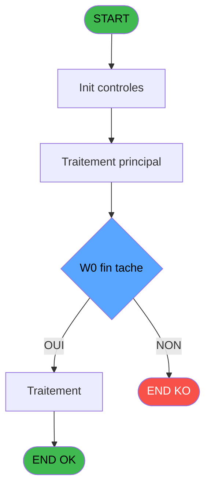

Review the generated code against the original specification.

Produce a JSON report:
```json
{
  "programId": 0,
  "programName": "",
  "coveragePct": 0,
  "rulesImplemented": 0,
  "rulesTotal": 0,
  "missingRules": [
    "rule descriptions not implemented"
  ],
  "recommendations": [
    "improvement suggestions"
  ]
}
```

Check:
1. Every business rule from the contract is implemented in the store
2. Every table from the contract has corresponding entity types
3. Every API endpoint is wired to the store
4. UI layout matches the spec description
5. Error handling is present for all actions

CONTRACT RULES:
[
  {
    "id": "RM-001",
    "description": "Condition: W0 fin tache [V] egale 'F'",
    "condition": "W0 fin tache [V]='F'",
    "variables": [
      "FI"
    ],
    "status": "IMPL",
    "targetFile": "adh-web/src/stores/saisieContenuCaisseStore.ts",
    "gapNotes": ""
  },
  {
    "id": "RM-002",
    "description": "Verification que l'imprimante courante est la n1",
    "condition": "GetParam ('CURRENTPRINTERNUM')=1",
    "variables": [],
    "status": "IMPL",
    "targetFile": "adh-web/src/services/printer/generators/ouvertureTicketGenerator.ts",
    "gapNotes": ""
  },
  {
    "id": "RM-003",
    "description": "Verification que l'imprimante courante est la n9",
    "condition": "GetParam ('CURRENTPRINTERNUM')=9",
    "variables": [],
    "status": "IMPL",
    "targetFile": "adh-web/src/__tests__/approTicketStore.test.ts",
    "gapNotes": ""
  }
]

SPEC EXCERPT:
# ADH IDE 138 - Ticket fermeture session

> **Analyse**: Phases 1-4 2026-02-08 03:18 -> 03:18 (4s) | Assemblage 03:18
> **Pipeline**: V7.2 Enrichi
> **Structure**: 4 onglets (Resume | Ecrans | Donnees | Connexions)

<!-- TAB:Resume -->

## 1. FICHE D'IDENTITE

| Attribut | Valeur |
|----------|--------|
| Projet | ADH |
| IDE Position | 138 |
| Nom Programme | Ticket fermeture session |
| Fichier source | `Prg_138.xml` |
| Dossier IDE | Caisse |
| Taches | 23 (0 ecrans visibles) |
| Tables modifiees | 0 |
| Programmes appeles | 4 |
| Complexite | **BASSE** (score 18/100) |

## 2. DESCRIPTION FONCTIONNELLE

Le programme ADH IDE 138 assure la génération d'un tableau récapitulatif pour la clôture de session. Il traite les données de fermeture de caisse (montants par mode de paiement, devises, articles) en construisant une synthèse structurée à partir de 25 paramètres d'entrée couvrant les montants (cartes, chèques, OD), les devises avec taux de change, et les informations de facturation (date comptable, numéro session, imputation). Le programme effectue une seule tâche sans écran visible, opérant en mode traitement batch avec calcul d'index sur la table temporaire `pv_discounts`.

Bien que statué comme orphelin potentiel (aucun caller direct identifié), ce programme doit logiquement être appelé depuis les modules de fermeture caisse (ADH IDE 131, 299) ou de réimpression de tickets (IDE 151) pour consigner les récapitulatifs de session. Il lit exclusivement la table `devise_in` (taux de change) sans écriture dans les tables permanentes, ce qui le positionne comme un utilitaire de mise en forme de données pour les rapports ou écrans de récapitulation.

Son intégration dans la migration se fera par transformation des 30 expressions (principalement des références de paramètres et une formule de calcul `[AA]+1`) en logique applicative C#, sans dépendance critique à d'autres programmes, rendant sa complexité faible et son impact de migration limité.

## 3. BLOCS FONCTIONNELS

## 5. REGLES METIER

3 regles identifiees:

### Autres (3 regles)

#### <a id="rm-RM-001"></a>[RM-001] Condition: W0 fin tache [V] egale 'F'

| Element | Detail |
|---------|--------|
| **Condition** | `W0 fin tache [V]='F'` |
| **Si vrai** | Action si vrai |
| **Variables** | FI (W0 fin tache) |
| **Expression source** | Expression 6 : `W0 fin tache [V]='F'` |
| **Exemple** | Si W0 fin tache [V]='F' → Action si vrai |

#### <a id="rm-RM-002"></a>[RM-002] Verification que l'imprimante courante est la n1

| Element | Detail |
|---------|--------|
| **Condition** | `GetParam ('CURRENTPRINTERNUM')=1` |
| **Si vrai** | Action si CURRENTPRINTERNUM = 1 |
| **Expression source** | Expression 7 : `GetParam ('CURRENTPRINTERNUM')=1` |
| **Exemple** | Si GetParam ('CURRENTPRINTERNUM')=1 → Action si CURRENTPRINTERNUM = 1 |

#### <a id="rm-RM-003"></a>[RM-003] Verification que l'imprimante courante est la n9

| Element | Detail |
|---------|--------|
| **Condition** | `GetParam ('CURRENTPRINTERNUM')=9` |
| **Si vrai** | Action si CURRENTPRINTERNUM = 9 |
| **Expression source** | Expression 8 : `GetParam ('CURRENTPRINTERNUM')=9` |
| **Exemple** | Si GetParam ('CURRENTPRINTERNUM')=9 → Action si CURRENTPRINTERNUM = 9 |

## 6. CONTEXTE

- **Appele par**: [Fermeture caisse (IDE 131)](ADH-IDE-131.md), [Reimpression tickets fermeture (IDE 151)](ADH-IDE-151.md), [Fermeture caisse 144 (IDE 299)](ADH-IDE-299.md)
- **Appelle**: 4 programmes | **Tables**: 8 (W:0 R:6 L:3) | **Taches**: 23 | **Expressions**: 10

<!-- TAB:Ecrans -->

## 8. ECRANS

*(Programme sans ecran visible)*

## 9. NAVIGATION

### 9.3 Structure hierarchique (0 tache)

| Position | Tache | Type | Dimensions | Bloc |
|----------|-------|------|------------|------|

### 9.4 Algorigramme



> **Legende**: Vert = START/END OK | Rouge = END KO | Bleu = Decisions
> *Algorigramme auto-genere. Utiliser `/algorigramme` pour une synthese metier detaillee.*

<!-- TAB:Donnees -->

## 10. TABLES

### Tables utilisees (8)

| ID | Nom | Description | Type | R | W | L | Usages |
|----|-----|-------------|------|---|---|---|--------|
| 463 | heure_de_passage |  | DB | R |   | L | 3 |
| 693 | devise_in | Devises / taux de change | DB | R |   |   | 6 |
| 266 | cc_comptable |  | DB | R |   |   | 3 |
| 30 | gm-recherche_____gmr | Index de recherche | DB | R |   |   | 2 |
| 70 | date_comptable___dat |  | DB | R |   |   | 1 |
| 249 | histo_sessions_caisse_detail | Sessions de caisse | DB | R |   |   | 1 |
| 513 | pv_invoiceprintfiliationtmp | 

GENERATED FILES:

--- types/ticketFermetureSession.ts ---
import type { ApiResponse } from "@/services/api/apiClient";

export interface RecapFermetureSession {
  societe: string;
  session: number;
  dateComptable: Date;
  heureDebutSession: string;
  caisseDepart: number;
  apportCoffre: number;
  versement: number;
  retrait: number;
  soldeCash: number;
  soldeCarte: number;
  change: number;
  fraisChange: number;
  deviseLocale: string;
  nomVillage: string;
  editionDetaillee: boolean;
}

export interface MontantComptable {
  cumulQuantite: number;
  cumulMontant: number;
  totalMontant: number;
  equivalent: number;
}

export interface TicketFermetureSessionState {
  recapData: RecapFermetureSession | null;
  montantsComptables: MontantComptable[];
  isLoading: boolean;
  error: string | null;
  finTache: string;
  printerNum: number;
}

export interface LoadRecapDataRequest {
  societe: string;
  session: number;
}

export type LoadRecapDataResponse = ApiResponse<RecapFermetureSession>;

export interface LoadMontantsRequest {
  societe: string;
  session: number;
}

export type LoadMontantsResponse = ApiResponse<MontantComptable[]>;

export interface GenerateTicketRequest {
  societe: string;
  session: number;
  dateComptable: Date;
  printerNum: number;
}

export type GenerateTicketResponse = ApiResponse<void>;

export interface ValidateFinTacheRequest {
  finTache: string;
}

export type ValidateFinTacheResponse = ApiResponse<boolean>;

export interface SelectPrinterRequest {
  printerNum: number;
}

export type PrinterOption = 1 | 9;

export const PRINTER_OPTIONS = {
  PRIMARY: 1,
  SECONDARY: 9,
} as const;

export const BUSINESS_RULES = {
  FIN_TACHE_VALIDATION: 'RM-001: Vérifier que W0_fin_tache === "F" avant de procéder',
  PRIMARY_PRINTER: 'RM-002: Si CURRENTPRINTERNUM === 1, utiliser l\'imprimante principale',
  SECONDARY_PRINTER: 'RM-003: Si CURRENTPRINTERNUM === 9, utiliser l\'imprimante secondaire',
} as const;

--- stores/ticketFermetureSessionStore.ts ---
import { create } from 'zustand';
import type {
  RecapFermetureSession,
  MontantComptable,
  PrinterOption,
} from '@/types/ticketFermetureSession';
import { apiClient } from '@/services/api/apiClient';
import type { ApiResponse } from '@/services/api/apiClient';
import { useDataSourceStore } from './dataSourceStore';

interface TicketFermetureSessionState {
  recapData: RecapFermetureSession | null;
  montantsComptables: MontantComptable[];
  isLoading: boolean;
  error: string | null;
  finTache: string;
  printerNum: PrinterOption;
}

interface TicketFermetureSessionActions {
  loadRecapData: (societe: string, session: number) => Promise<void>;
  loadMontantsComptables: (societe: string, session: number) => Promise<void>;
  generateTicketFermeture: (
    societe: string,
    session: number,
    dateComptable: Date,
  ) => Promise<void>;
  validateFinTache: (finTache: string) => boolean;
  selectPrinter: (printerNum: PrinterOption) => void;
  reset: () => void;
}

type TicketFermetureSessionStore = TicketFermetureSessionState &
  TicketFermetureSessionActions;

const MOCK_RECAP: RecapFermetureSession = {
  societe: 'SOC1',
  session: 142,
  dateComptable: new Date('2026-02-08'),
  heureDebutSession: '08:00',
  caisseDepart: 500,
  apportCoffre: 2000,
  versement: 1500,
  retrait: 300,
  soldeCash: 3200,
  soldeCarte: 1850,
  change: 450,
  fraisChange: 15,
  deviseLocale: 'EUR',
  nomVillage: 'Club Med Peisey-Vallandry',
  editionDetaillee: true,
};

const MOCK_MONTANTS: MontantComptable[] = [
  {
    cumulQuantite: 12,
    cumulMontant: 540,
    totalMontant: 540,
    equivalent: 540,
  },
  {
    cumulQuantite: 8,
    cumulMontant: 320,
    totalMontant: 320,
    equivalent: 320,
  },
  {
    cumulQuantite: 5,
    cumulMontant: 175,
    totalMontant: 175,
    equivalent: 175,
  },
];

const initialState: TicketFermetureSessionState = {
  recapData: null,
  montantsComptables: [],
  i

--- services/api/endpoints-ticketFermetureSession.ts ---
import { apiClient, type ApiResponse } from './apiClient';
import type {
  RecapFermetureSession,
  MontantComptable,
  GenerateTicketRequest,
} from '@/types/ticketFermetureSession';

export const ticketFermetureSessionApi = {
  getRecap: (societe: string, session: number) =>
    apiClient.get<ApiResponse<RecapFermetureSession>>(
      `/api/ticketFermetureSession/recap?societe=${societe}&session=${session}`,
    ),

  getMontants: (societe: string, session: number) =>
    apiClient.get<ApiResponse<MontantComptable[]>>(
      `/api/ticketFermetureSession/montants?societe=${societe}&session=${session}`,
    ),

  generateTicket: (data: GenerateTicketRequest) =>
    apiClient.post<ApiResponse<void>>(
      '/api/ticketFermetureSession/generate',
      data,
    ),
};

--- pages/TicketFermetureSessionPage.tsx ---
import { useState, useCallback, useEffect } from 'react';
import { useNavigate } from 'react-router-dom';
import { ScreenLayout } from '@/components/layout';
import { Button, Dialog, Input } from '@/components/ui';
import { useTicketFermetureSessionStore } from '@/stores/ticketFermetureSessionStore';
import { useAuthStore } from '@/stores';
import type { PrinterOption } from '@/types/ticketFermetureSession';

export function TicketFermetureSessionPage() {
  const navigate = useNavigate();
  const user = useAuthStore((s) => s.user);

  const recapData = useTicketFermetureSessionStore((s) => s.recapData);
  const montantsComptables = useTicketFermetureSessionStore((s) => s.montantsComptables);
  const isLoading = useTicketFermetureSessionStore((s) => s.isLoading);
  const error = useTicketFermetureSessionStore((s) => s.error);
  const finTache = useTicketFermetureSessionStore((s) => s.finTache);
  const printerNum = useTicketFermetureSessionStore((s) => s.printerNum);
  const loadRecapData = useTicketFermetureSessionStore((s) => s.loadRecapData);
  const loadMontantsComptables = useTicketFermetureSessionStore((s) => s.loadMontantsComptables);
  const generateTicketFermeture = useTicketFermetureSessionStore((s) => s.generateTicketFermeture);
  const validateFinTache = useTicketFermetureSessionStore((s) => s.validateFinTache);
  const selectPrinter = useTicketFermetureSessionStore((s) => s.selectPrinter);
  const reset = useTicketFermetureSessionStore((s) => s.reset);

  const [showDialog, setShowDialog] = useState(false);
  const [_selectedSession, _setSelectedSession] = useState<number>(142);

  const societe = 'ADH';

  useEffect(() => {
    loadRecapData(societe, _selectedSession);
    loadMontantsComptables(societe, _selectedSession);
    return () => reset();
  }, [loadRecapData, loadMontantsComptables, reset, _selectedSession]);

  const handleOpenDialog = useCallback(() => {
    if (!recapData) return;
    if (!validateFinTache(finTache)) {
      alert('Erreur: 

--- components/caisse/ticketFermetureSession/ActionsPanel.tsx ---
import { useTicketFermetureSessionStore } from "@/stores/ticketFermetureSessionStore";
import { Button } from "@/components/ui";
import { PRINTER_OPTIONS } from "@/types/ticketFermetureSession";
import { cn } from "@/lib/utils";

interface ActionsPanelProps {
  className?: string;
  onGenerate: () => void;
  onCancel: () => void;
  disabled?: boolean;
}

export const ActionsPanel = ({ className, onGenerate, onCancel, disabled }: ActionsPanelProps) => {
  const printerNum = useTicketFermetureSessionStore((s) => s.printerNum);
  const selectPrinter = useTicketFermetureSessionStore((s) => s.selectPrinter);
  const isLoading = useTicketFermetureSessionStore((s) => s.isLoading);

  const handlePrinterChange = (e: React.ChangeEvent<HTMLSelectElement>) => {
    const value = Number(e.target.value);
    if (value === PRINTER_OPTIONS.PRIMARY || value === PRINTER_OPTIONS.SECONDARY) {
      selectPrinter(value);
    }
  };

  return (
    <div className={cn("flex items-center justify-between gap-4 p-4 border-t", className)}>
      <div className="flex items-center gap-3">
        <label htmlFor="printer-select" className="text-sm font-medium text-gray-700">
          Imprimante :
        </label>
        <select
          id="printer-select"
          value={printerNum}
          onChange={handlePrinterChange}
          disabled={disabled || isLoading}
          className="px-3 py-2 border rounded-md bg-white text-sm focus:outline-none focus:ring-2 focus:ring-blue-500 disabled:opacity-50 disabled:cursor-not-allowed"
        >
          <option value={PRINTER_OPTIONS.PRIMARY}>Imprimante principale (1)</option>
          <option value={PRINTER_OPTIONS.SECONDARY}>Imprimante secondaire (9)</option>
        </select>
      </div>

      <div className="flex items-center gap-3">
        <Button
          variant="secondary"
          onClick={onCancel}
          disabled={isLoading}
        >
          Annuler
        </Button>
        <Button
          variant="primary"
          o

--- components/caisse/ticketFermetureSession/HeaderPanel.tsx ---
import type { RecapFermetureSession } from "@/types/ticketFermetureSession";
import { cn } from "@/lib/utils";

interface HeaderPanelProps {
  recapData: RecapFermetureSession | null;
  isLoading?: boolean;
  className?: string;
}

export const HeaderPanel = ({ recapData, isLoading, className }: HeaderPanelProps) => {
  return (
    <div className={cn("grid grid-cols-3 gap-4 p-4 bg-white rounded-lg shadow-sm border border-gray-200", className)}>
      <div className="space-y-1">
        <label className="text-sm font-medium text-gray-700">N° Session</label>
        <div className="px-3 py-2 bg-gray-50 border border-gray-300 rounded text-gray-900">
          {isLoading ? "..." : recapData?.session ?? "—"}
        </div>
      </div>

      <div className="space-y-1">
        <label className="text-sm font-medium text-gray-700">Date Comptable</label>
        <div className="px-3 py-2 bg-gray-50 border border-gray-300 rounded text-gray-900">
          {isLoading
            ? "..."
            : recapData?.dateComptable
              ? new Date(recapData.dateComptable).toLocaleDateString("fr-FR")
              : "—"}
        </div>
      </div>

      <div className="space-y-1">
        <label className="text-sm font-medium text-gray-700">Village</label>
        <div className="px-3 py-2 bg-gray-50 border border-gray-300 rounded text-gray-900">
          {isLoading ? "..." : recapData?.nomVillage ?? "—"}
        </div>
      </div>
    </div>
  );
};

--- components/caisse/ticketFermetureSession/MontantsPanel.tsx ---
import type { RecapFermetureSession } from "@/types/ticketFermetureSession";
import { cn } from "@/lib/utils";

interface MontantsPanelProps {
  data: RecapFermetureSession | null;
  className?: string;
}

export const MontantsPanel = ({ data, className }: MontantsPanelProps) => {
  if (!data) {
    return (
      <div className={cn("rounded-lg border border-gray-200 bg-white p-6", className)}>
        <h3 className="mb-4 text-lg font-semibold text-gray-900">Montants</h3>
        <p className="text-sm text-gray-500">Aucune donnée disponible</p>
      </div>
    );
  }

  const formatCurrency = (value: number): string => {
    return new Intl.NumberFormat("fr-FR", {
      minimumFractionDigits: 2,
      maximumFractionDigits: 2,
    }).format(value);
  };

  const fields = [
    { label: "Caisse Départ", value: data.caisseDepart },
    { label: "Apport Coffre", value: data.apportCoffre },
    { label: "Versement", value: data.versement },
    { label: "Retrait", value: data.retrait },
    { label: "Solde Cash", value: data.soldeCash },
    { label: "Solde Carte", value: data.soldeCarte },
    { label: "Change", value: data.change },
    { label: "Frais Change", value: data.fraisChange },
  ] as const;

  return (
    <div className={cn("rounded-lg border border-gray-200 bg-white p-6", className)}>
      <h3 className="mb-4 text-lg font-semibold text-gray-900">Montants</h3>
      
      <div className="space-y-3">
        {fields.map(({ label, value }) => (
          <div key={label} className="flex items-center justify-between gap-4">
            <label className="text-sm font-medium text-gray-700">{label}</label>
            <div className="flex min-w-[120px] items-center justify-end rounded-md border border-gray-300 bg-gray-50 px-3 py-2 text-right text-sm font-mono text-gray-900">
              {formatCurrency(value)} {data.deviseLocale}
            </div>
          </div>
        ))}
      </div>
    </div>
  );
};