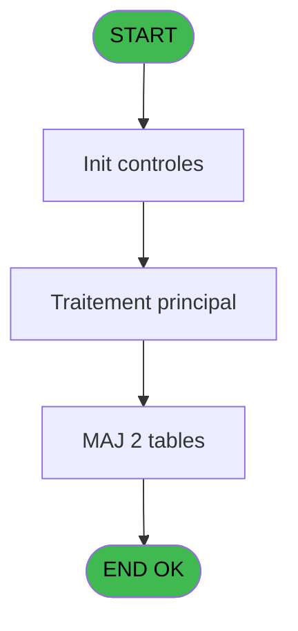

You are a software architect producing a design document for migrating a Magic Unipaas program to React/TypeScript.

Produce a JSON document following this EXACT structure:
```json
{
  "domain": "camelCaseDomainName",
  "domainPascal": "PascalCaseDomainName",
  "complexity": "LOW|MEDIUM|HIGH",
  "entities": [
    {
      "name": "EntityName",
      "fields": [
        {
          "name": "fieldName",
          "type": "string|number|boolean|Date",
          "source": "table.column",
          "nullable": false
        }
      ]
    }
  ],
  "stateFields": [
    {
      "name": "fieldName",
      "type": "TypeName[]",
      "default": "[]"
    }
  ],
  "actions": [
    {
      "name": "actionName",
      "params": [
        "param: type"
      ],
      "businessRules": [
        "Rule description"
      ],
      "returns": "Promise<void>"
    }
  ],
  "apiEndpoints": [
    {
      "method": "GET",
      "path": "/api/domain/resource",
      "queryParams": [
        "param?"
      ],
      "response": "ResponseType"
    }
  ],
  "uiLayout": {
    "type": "page-type",
    "sections": [
      {
        "name": "sectionName",
        "controls": [
          "control1"
        ]
      }
    ]
  },
  "mockData": {
    "count": 5,
    "description": "Description of mock data"
  },
  "dependencies": {
    "stores": [
      "useDataSourceStore"
    ],
    "sharedTypes": [],
    "externalApis": []
  }
}
```

IMPORTANT:
- Derive entity fields from actual DB column types when DB metadata is available
- Each business rule from the spec/contract MUST map to an action
- API endpoints should follow existing patterns: /api/{domain}/{resource}
- State fields must cover ALL data the UI needs to display
- Include isLoading, error, and filter states

PROGRAM SPEC:
# ADH IDE 154 - Tableau recap fermeture

> **Analyse**: Phases 1-4 2026-02-08 03:38 -> 03:38 (4s) | Assemblage 03:38
> **Pipeline**: V7.2 Enrichi
> **Structure**: 4 onglets (Resume | Ecrans | Donnees | Connexions)

<!-- TAB:Resume -->

## 1. FICHE D'IDENTITE

| Attribut | Valeur |
|----------|--------|
| Projet | ADH |
| IDE Position | 154 |
| Nom Programme | Tableau recap fermeture |
| Fichier source | `Prg_154.xml` |
| Dossier IDE | General |
| Taches | 93 (0 ecrans visibles) |
| Tables modifiees | 2 |
| Programmes appeles | 6 |
| Complexite | **BASSE** (score 37/100) |

## 2. DESCRIPTION FONCTIONNELLE

ADH IDE 154 génère un tableau récapitulatif détaillé de la fermeture de caisse, affichant l'ensemble des mouvements financiers effectués durant la session. Ce programme consolide les données de caisse en colonnes organisées (montants par devise, écarts détectés, totaux cumulés) et prépare le document pour validation avant clôture définitive. Il utilise les calculs d'équivalents de change via IDE 22 pour harmoniser les montants en devise de base.

Le flux d'impression est centralisé : le programme récupère le titre de la session (IDE 43), sélectionne l'imprimante active via IDE 180, configure le numéro de listing (IDE 181) et initialise les paramètres d'impression (IDE 182). Ces appels séquentiels garantissent que le bon périphérique et le bon format sont utilisés avant génération du rapport.

Les données saisies durant la fermeture (remises, ajustements, discounts) sont persistées dans les tables `saisie_remise_en_caisse` et `pv_discounts`. Le tableau récapitulatif sert à la fois de document d'audit interne et de justificatif pour les opérations de clôture ultérieures, validant ainsi l'intégrité financière de la session avant archivage.

## 3. BLOCS FONCTIONNELS

## 5. REGLES METIER

5 regles identifiees:

### Autres (5 regles)

#### <a id="rm-RM-001"></a>[RM-001] Condition: W0 fin tache [BH] egale 'F'

| Element | Detail |
|---------|--------|
| **Condition** | `W0 fin tache [BH]='F'` |
| **Si vrai** | Action si vrai |
| **Variables** | FU (W0 fin tache) |
| **Expression source** | Expression 6 : `W0 fin tache [BH]='F'` |
| **Exemple** | Si W0 fin tache [BH]='F' → Action si vrai |

#### <a id="rm-RM-002"></a>[RM-002] Verification que l'imprimante courante est la n1

| Element | Detail |
|---------|--------|
| **Condition** | `GetParam ('CURRENTPRINTERNUM')=1` |
| **Si vrai** | Action si CURRENTPRINTERNUM = 1 |
| **Expression source** | Expression 8 : `GetParam ('CURRENTPRINTERNUM')=1` |
| **Exemple** | Si GetParam ('CURRENTPRINTERNUM')=1 → Action si CURRENTPRINTERNUM = 1 |

#### <a id="rm-RM-003"></a>[RM-003] Verification que l'imprimante courante est la n9

| Element | Detail |
|---------|--------|
| **Condition** | `GetParam ('CURRENTPRINTERNUM')=9` |
| **Si vrai** | Action si CURRENTPRINTERNUM = 9 |
| **Expression source** | Expression 9 : `GetParam ('CURRENTPRINTERNUM')=9` |
| **Exemple** | Si GetParam ('CURRENTPRINTERNUM')=9 → Action si CURRENTPRINTERNUM = 9 |

#### <a id="rm-RM-004"></a>[RM-004] Condition toujours vraie (flag actif)

| Element | Detail |
|---------|--------|
| **Condition** | `P0 reimpression D/G [M]='D'` |
| **Si vrai** | 'TRUE'LOG |
| **Si faux** | 'FALSE'LOG) |
| **Variables** | EZ (P0 reimpression D/G) |
| **Expression source** | Expression 12 : `IF (P0 reimpression D/G [M]='D','TRUE'LOG,'FALSE'LOG)` |
| **Exemple** | Si P0 reimpression D/G [M]='D' → 'TRUE'LOG. Sinon → 'FALSE'LOG) |

#### <a id="rm-RM-005"></a>[RM-005] Condition: P0 reimpression D/G [M] different de

| Element | Detail |
|---------|--------|
| **Condition** | `P0 reimpression D/G [M]<>''` |
| **Si vrai** | Action si vrai |
| **Variables** | EZ (P0 reimpression D/G) |
| **Expression source** | Expression 13 : `P0 reimpression D/G [M]<>''` |
| **Exemple** | Si P0 reimpression D/G [M]<>'' → Action si vrai |

## 6. CONTEXTE

- **Appele par**: [Fermeture caisse (IDE 131)](ADH-IDE-131.md), [Reimpression tickets fermeture (IDE 151)](ADH-IDE-151.md), [Fermeture caisse 144 (IDE 299)](ADH-IDE-299.md)
- **Appelle**: 6 programmes | **Tables**: 24 (W:2 R:18 L:13) | **Taches**: 93 | **Expressions**: 13

<!-- TAB:Ecrans -->

## 8. ECRANS

*(Programme sans ecran visible)*

## 9. NAVIGATION

### 9.3 Structure hierarchique (0 tache)

| Position | Tache | Type | Dimensions | Bloc |
|----------|-------|------|------------|------|

### 9.4 Algorigramme



> **Legende**: Vert = START/END OK | Rouge = END KO | Bleu = Decisions
> *Algorigramme auto-genere. Utiliser `/algorigramme` pour une synthese metier detaillee.*

<!-- TAB:Donnees -->

## 10. TABLES

### Tables utilisees (24)

| ID | Nom | Description | Type | R | W | L | Usages |
|----|-----|-------------|------|---|---|---|--------|
| 487 | saisie_remise_en_caisse | Sessions de caisse | TMP | R | **W** | L | 16 |
| 510 | pv_discounts |  | TMP | R | **W** | L | 12 |
| 247 | histo_sessions_caisse_article | Articles et stock | DB | R |   | L | 10 |
| 232 | gestion_devise_session | Sessions de caisse | DB | R |   | L | 8 |
| 67 | tables___________tab |  | DB | R |   | L | 6 |
| 693 | devise_in | Devises / taux de change | DB | R |   | L | 6 |
| 463 | heure_de_passage |  | DB | R |   | L | 3 |
| 249 | histo_sessions_caisse_detail | Sessions de caisse | DB | R |   |   | 9 |
| 196 | gestion_article_session | Articles et stock | DB | R |   |   | 8 |
| 31 | gm-complet_______gmc |  | DB | R |   |   | 6 |
| 505 | pv_comptable |  | TMP | R |   |   | 4 |
| 222 | comptage_caisse_histo | Sessions de caisse | DB | R |   |   | 4 |
| 251 | histo_sessions_caisse_remise | Sessions de caisse | DB | R |   |   | 4 |
| 266 | cc_comptable |  | DB | R |   |   | 3 |
| 77 | articles_________art | Articles et stock | DB | R |   |   | 2 |
| 30 | gm-recherche_____gmr | Index de recherche | DB | R |   |   | 2 |
| 50 | moyens_reglement_mor | Reglements / paiements | DB | R |   |   | 2 |
| 70 | date_comptable___dat |  | DB | R |   |   | 1 |
| 324 | frais_change___fchg |  | DB |   |   | L | 6 |
| 44 | change___________chg |  | DB |   |   | L | 4 |
| 147 | change_vente_____chg | Donnees de ventes | DB |   |   | L | 2 |
| 139 | moyens_reglement_mor | Reglements / paiements | DB |   |   | L | 2 |
| 197 | articles_en_stock | Articles et stock | DB |   |   | L | 2 |
| 474 | comptage_caisse_devise | Sessions de caisse | TMP |   |   | L | 2 |

### Colonnes par table (22 / 18 tables avec colonnes identifiees)

<details>
<summary>Table 487 - saisie_remise_en_caisse (R/**W**/L) - 16 usages</summary>

| Lettre | Variable | Acces | Type |
|--------|----------|-------|------|
| EW | Detail produit remise edite | W | Logical |
| EX | P0 montant remise monnaie final | W | Numeric |
| EY | Detail remise finale edite | W | Logical |

</details>

<details>
<summary>Table 510 - pv_discounts (R/**W**/L) - 12 usages</summary>

*Table utilisee uniquement en Link ou aucune colonne Real identifiee dans le DataView.*

</details>

<details>
<summary>Table 247 - histo_sessions_caisse_article (R/L) - 10 usages</summary>

| Lettre | Variable | Acces | Type |
|--------|----------|-------|------|
| EN | DernierChronoHisto | R | Numeric |
| EQ | Total articles | R | Numeric |

</details>

<details>
<summary>Table 232 - gestion_devise_session (R/L) - 8 usages</summary>

| Lettre | Variable | Acces | Type |
|--------|----------|-------|------|
| EN | Nbre devise ouverture | R | Numeric |
| EO | Nbre devise fermeture | R | Numeric |
| FO | P0 nbre devises calcule | R | Numeric |
| FY | W0 date debut session | R | Date |
| FZ | W0 heure debut session | R | Time |
| ER | P0 devise locale | R | Alpha |
| EV | P0 session | R | Numeric |
| FH | P0 nbre devises compte | R | Numeric |

</details>

CONTRACT:
{
  "program": {
    "id": 0,
    "name": "",
    "complexity": "MEDIUM",
    "callers": [],
    "callees": [],
    "tasksCount": 93,
    "tablesCount": 2,
    "expressionsCount": 13
  },
  "rules": [
    {
      "id": "RM-001",
      "description": "Condition: W0 fin tache [BH] egale 'F'",
      "condition": "W0 fin tache [BH]='F'",
      "variables": [
        "FU"
      ],
      "status": "IMPL",
      "targetFile": "adh-web/src/stores/saisieContenuCaisseStore.ts",
      "gapNotes": ""
    },
    {
      "id": "RM-002",
      "description": "Verification que l'imprimante courante est la n1",
      "condition": "GetParam ('CURRENTPRINTERNUM')=1",
      "variables": [],
      "status": "IMPL",
      "targetFile": "adh-web/src/services/printer/generators/ouvertureTicketGenerator.ts",
      "gapNotes": ""
    },
    {
      "id": "RM-003",
      "description": "Verification que l'imprimante courante est la n9",
      "condition": "GetParam ('CURRENTPRINTERNUM')=9",
      "variables": [
        "EZ"
      ],
      "status": "IMPL",
      "targetFile": "adh-web/src/__tests__/approTicketStore.test.ts",
      "gapNotes": ""
    },
    {
      "id": "RM-004",
      "description": "Condition toujours vraie (flag actif)",
      "condition": "P0 reimpression D/G [M]='D'",
      "variables": [
        "EZ"
      ],
      "status": "MISSING",
      "targetFile": "",
      "gapNotes": ""
    },
    {
      "id": "RM-005",
      "description": "Condition: P0 reimpression D/G [M] different de",
      "condition": "P0 reimpression D/G [M]<>''",
      "variables": [
        "EZ"
      ],
      "status": "MISSING",
      "targetFile": "",
      "gapNotes": ""
    }
  ],
  "tables": [
    {
      "id": 487,
      "name": "saisie_remise_en_caisse",
      "mode": "RW",
      "status": "MISSING",
      "targetFile": "",
      "gapNotes": ""
    },
    {
      "id": 510,
      "name": "pv_discounts",
      "mode": "RW",
      "status": "MISSING",
      "targetFile": "",
      "gapNotes": ""
    },
    {
      "id": 247,
      "name": "histo_sessions_caisse_article",
      "mode": "R",
      "status": "MISSING",
      "targetFile": "",
      "gapNotes": ""
    },
    {
      "id": 232,
      "name": "gestion_devise_session",
      "mode": "R",
      "status": "IMPL",
      "targetFile": "adh-web/src/stores/soldeOuvertureStore.ts",
      "gapNotes": ""
    },
    {
      "id": 67,
      "name": "tables___________tab",
      "mode": "R",
      "status": "IMPL",
      "targetFile": "adh-web/src/pages/IntegriteDatesPage.tsx",
      "gapNotes": ""
    },
    {
      "id": 693,
      "name": "devise_in",
      "mode": "R",
      "status": "IMPL",
      "targetFile": "adh-web/src/components/caisse/transaction/schemas.ts",
      "gapNotes": ""
    },
    {
      "id": 463,
      "name": "heure_de_passage",
      "mode": "R",
      "status": "MISSING",
      "targetFile": "",
      "gapNotes": ""
    },
    {
      "id": 249,
      "name": "histo_sessions_caisse_detail",
      "mode": "R",
      "status": "MISSING",
      "targetFile": "",
      "gapNotes": ""
    },
    {
      "id": 196,
      "name": "gestion_article_session",
      "mode": "R",
      "status": "MISSING",
      "targetFile": "",
      "gapNotes": ""
    },
    {
      "id": 31,
      "name": "gm-complet_______gmc",
      "mode": "R",
      "status": "MISSING",
      "targetFile": "",
      "gapNotes": ""
    },
    {
      "id": 505,
      "name": "pv_comptable",
      "mode": "R",
      "status": "MISSING",
      "targetFile": "",
      "gapNotes": ""
    },
    {
      "id": 222,
      "name": "comptage_caisse_histo",
      "mode": "R",
      "status": "MISSING",
      "targetFile": "",
      "gapNotes": ""
    },
    {
      "id": 251,
      "name": "histo_sessions_caisse_remise",
      "mode": "R",
      "status": "MISSING",
      "targetFile": "",
      "gapNotes": ""
    },
    {
      "id": 266,
      "name": "cc_comptable",
      "mode": "R",
      "status": "MISSING",
      "targetFile": "",
      "gapNotes": ""
    },
    {
      "id": 77,
      "name": "articles_________art",
      "mode": "R",
      "status": "IMPL",
      "targetFile": "adh-web/src/components/caisse/apportArticles/ArticleEntryPanel.tsx",
      "gapNotes": ""
    },
    {
      "id": 30,
      "name": "gm-recherche_____gmr",
      "mode": "R",
      "status": "MISSING",
      "targetFile": "",
      "gapNotes": ""
    },
    {
      "id": 50,
      "name": "moyens_reglement_mor",
      "mode": "R",
      "status": "IMPL",
      "targetFile": "adh-web/src/pages/SoldeOuverturePage.tsx",
      "gapNotes": ""
    },
    {
      "id": 70,
      "name": "date_comptable___dat",
      "mode": "R",
      "status": "IMPL",
      "targetFile": "adh-web/src/components/caisse/recapWorksheet/FiltresPanel.tsx",
      "gapNotes": ""
    },
    {
      "id": 324,
      "name": "frais_change___fchg",
      "mode": "R",
      "status": "MISSING",
      "targetFile": "",
      "gapNotes": ""
    },
    {
      "id": 44,
      "name": "change___________chg",
      "mode": "R",
      "status": "IMPL",
      "targetFile": "adh-web/src/App.tsx",
      "gapNotes": ""
    },
    {
      "id": 147,
      "name": "change_vente_____chg",
      "mode": "R",
      "status": "MISSING",
      "targetFile": "",
      "gapNotes": ""
    },
    {
      "id": 139,
      "name": "moyens_reglement_mor",
      "mode": "R",
      "status": "IMPL",
      "targetFile": "adh-web/src/pages/SoldeOuverturePage.tsx",
      "gapNotes": ""
    },
    {
      "id": 197,
      "name": "articles_en_stock",
      "mode": "R",
      "status": "MISSING",
      "targetFile": "",
      "gapNotes": ""
    },
    {
      "id": 474,
      "name": "comptage_caisse_devise",
      "mode": "R",
      "status": "MISSING",
      "targetFile": "",
      "gapNotes": ""
    }
  ],
  "callees": [
    {
      "id": 22,
      "name": "Calcul equivalent",
      "calls": 6,
      "context": "Calcul de donnees",
      "status": "MISSING",
      "target": "",
      "gapNotes": ""
    },
    {
      "id": 43,
      "name": "Recuperation du titre",
      "calls": 1,
      "context": "Recuperation donnees",
      "status": "MISSING",
      "target": "",
      "gapNotes": ""
    },
    {
      "id": 179,
      "name": "Get Printer",
      "calls": 1,
      "context": "Impression ticket/document",
      "status": "N/A",
      "target": "",
      "gapNotes": "Legacy print/utility (N/A for web)"
    },
    {
      "id": 180,
      "name": "Printer choice",
      "calls": 1,
      "context": "Impression ticket/document",
      "status": "N/A",
      "target": "",
      "gapNotes": "Legacy print/utility (N/A for web)"
    },
    {
      "id": 181,
      "name": "Set Listing Number",
      "calls": 1,
      "context": "Configuration impression",
      "status": "N/A",
      "target": "",
      "gapNotes": "Legacy print/utility (N/A for web)"
    },
    {
      "id": 182,
      "name": "Raz Current Printer",
      "calls": 1,
      "context": "Impression ticket/document",
      "status": "N/A",
      "target": "",
      "gapNotes": "Legacy print/utility (N/A for web)"
    }
  ],
  "variables": [
    {
      "localId": "FU",
      "name": "W0 fin tache",
      "type": "Real",
      "status": "MISSING",
      "targetFile": "",
      "gapNotes": ""
    },
    {
      "localId": "EZ",
      "name": "P0 reimpression D/G",
      "type": "Parameter",
      "status": "MISSING",
      "targetFile": "",
      "gapNotes": ""
    }
  ]
}