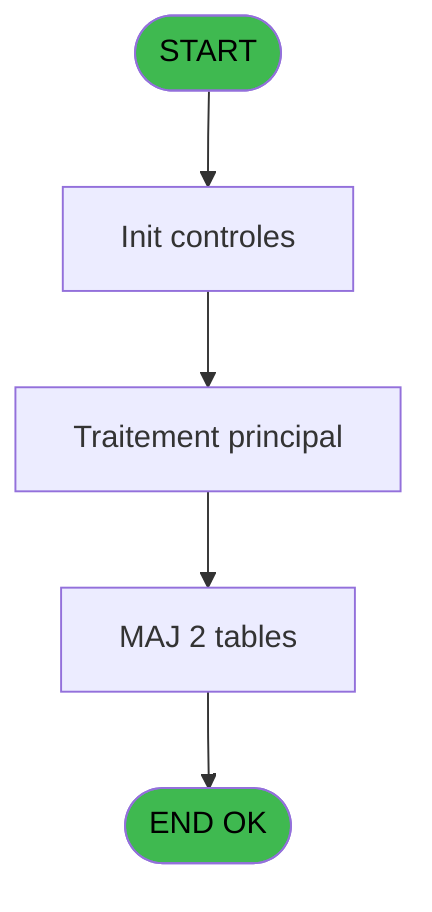

Generate a complete Zustand store for the "recapFermeture" domain.

RULES (MANDATORY):
- Use import aliases: @/ for src root (e.g. @/stores/..., @/types/...)
- NEVER use `any` type - use `unknown` or precise types
- Tailwind v4 classes for styling (no tailwind.config.js)
- Arrow functions everywhere (no function declarations)
- `as const` instead of TypeScript enum
- verbatimModuleSyntax is enabled: use `import type { X }` ONLY for types/interfaces, use `import { X }` for values/consts
- File must be COMPLETE and ready to write - NO placeholders, NO TODOs, NO "// implement here"
- NO comments except for genuinely complex logic
- Output ONLY the code inside a single markdown code block (```typescript ... ``` or ```tsx ... ```)

SHARED INFRASTRUCTURE (use these exact imports):
- Data source toggle: `import { useDataSourceStore } from "@/stores/dataSourceStore"` (has .getState().isRealApi)
- API client: `import { apiClient } from "@/services/api/apiClient"` and `import type { ApiResponse } from "@/services/api/apiClient"`
- Screen layout: `import { ScreenLayout } from "@/components/layout"` (wrapper with sidebar, takes children + className)
- UI components: `import { Button, Dialog, Input } from "@/components/ui"`
- cn utility: `import { cn } from "@/lib/utils"`

STORE REQUIREMENTS:
- Use `create` from zustand (import { create } from "zustand")
- Import types from @/types/recapFermeture
- Import useDataSourceStore from @/stores/dataSourceStore
- Mock/API branching via useDataSourceStore.getState().isRealApi
- try/catch with `e instanceof Error` for error handling
- Realistic mock data (not lorem ipsum)
- EVERY business rule from the analysis MUST be implemented
- Include reset() action to clear state

TYPES FILE (already generated):
import type { Session } from '@/types/session';
import type { Devise } from '@/types/devise';

export interface RecapFermeture {
  societe: string;
  session: number;
  deviseLocale: string;
  dateDebut: Date;
  heureDebut: string;
  nbreDeviseOuverture: number;
  nbreDeviseFermeture: number;
  nbreDevisesCalcule: number;
  nbreDevisesCompte: number;
}

export interface LigneRecap {
  typeOperation: string;
  montantDevise: number;
  codeDevise: string;
  tauxChange: number | null;
  montantEquivalent: number;
  ecart: number | null;
}

export interface RemiseEnCaisse {
  detailProduitRemiseEdite: boolean;
  montantRemiseMonnaie: number;
  detailRemiseFinaleEdite: boolean;
}

export interface ArticleSession {
  chronoHisto: number;
  totalArticles: number;
  codeArticle: string;
  libelleArticle: string;
}

export interface RecapFermetureState {
  recap: RecapFermeture | null;
  lignesRecap: LigneRecap[];
  remises: RemiseEnCaisse[];
  articles: ArticleSession[];
  isLoading: boolean;
  error: string | null;
  isPrinting: boolean;
  modeReimpression: 'D' | 'G' | null;
  printerCourant: number | null;
  finTache: boolean;
}

export interface LoadRecapFermetureRequest {
  societe: string;
  session: number;
}

export interface LoadRecapFermetureResponse {
  recap: RecapFermeture;
  lignesRecap: LigneRecap[];
  remises: RemiseEnCaisse[];
  articles: ArticleSession[];
}

export interface GenererTableauRequest {
  societe: string;
  session: number;
}

export interface GenererTableauResponse {
  success: boolean;
  documentUrl?: string;
}

export interface CalculerEquivalentRequest {
  montant: number;
  deviseSource: string;
  deviseCible: string;
}

export interface CalculerEquivalentResponse {
  montantEquivalent: number;
}

export interface SaveRemiseRequest {
  detailProduitRemiseEdite: boolean;
  montantRemiseMonnaie: number;
  detailRemiseFinaleEdite: boolean;
}

export interface SaveRemiseResponse {
  success: boolean;
}

export interface SaveDiscountRequest {
  [key: string]: unknown;
}

export interface SaveDiscountResponse {
  success: boolean;
}

export interface SetModeReimpressionRequest {
  mode: 'D' | 'G' | null;
}

export interface SetModeReimpressionResponse {
  success: boolean;
}

export interface CheckPrinterRequest {
  printerNum: number;
}

export interface CheckPrinterResponse {
  available: boolean;
}

export interface ExportRecapRequest {
  format: 'PDF' | 'EXCEL';
}

export interface RecapFermetureActions {
  loadRecapFermeture: (
    societe: string,
    session: number
  ) => Promise<void>;
  
  genererTableau: (
    societe: string,
    session: number
  ) => Promise<void>;
  
  calculerEquivalent: (
    montant: number,
    deviseSource: string,
    deviseCible: string
  ) => Promise<number>;
  
  saveRemise: (
    remise: RemiseEnCaisse
  ) => Promise<void>;
  
  saveDiscount: (
    discount: unknown
  ) => Promise<void>;
  
  setModeReimpression: (
    mode: 'D' | 'G' | null
  ) => Promise<void>;
  
  checkPrinter: (
    printerNum: number
  ) => Promise<boolean>;
  
  exportRecap: (
    format: 'PDF' | 'EXCEL'
  ) => Promise<Blob>;
  
  setIsLoading: (isLoading: boolean) => void;
  setError: (error: string | null) => void;
  setIsPrinting: (isPrinting: boolean) => void;
  setPrinterCourant: (printerNum: number | null) => void;
  setFinTache: (finTache: boolean) => void;
  reset: () => void;
}

ANALYSIS DOCUMENT:
{
  "domain": "recapFermeture",
  "domainPascal": "RecapFermeture",
  "complexity": "MEDIUM",
  "entities": [
    {
      "name": "RecapFermeture",
      "fields": [
        {
          "name": "societe",
          "type": "string",
          "source": "gestion_devise_session.societe",
          "nullable": false
        },
        {
          "name": "session",
          "type": "number",
          "source": "gestion_devise_session.session (EV)",
          "nullable": false
        },
        {
          "name": "deviseLocale",
          "type": "string",
          "source": "gestion_devise_session.devise_locale (ER)",
          "nullable": false
        },
        {
          "name": "dateDebut",
          "type": "Date",
          "source": "gestion_devise_session.date_debut (FY)",
          "nullable": false
        },
        {
          "name": "heureDebut",
          "type": "string",
          "source": "gestion_devise_session.heure_debut (FZ)",
          "nullable": false
        },
        {
          "name": "nbreDeviseOuverture",
          "type": "number",
          "source": "gestion_devise_session.nbre_devise_ouverture (EN)",
          "nullable": false
        },
        {
          "name": "nbreDeviseFermeture",
          "type": "number",
          "source": "gestion_devise_session.nbre_devise_fermeture (EO)",
          "nullable": false
        },
        {
          "name": "nbreDevisesCalcule",
          "type": "number",
          "source": "gestion_devise_session.nbre_devises_calcule (FO)",
          "nullable": false
        },
        {
          "name": "nbreDevisesCompte",
          "type": "number",
          "source": "gestion_devise_session.nbre_devises_compte (FH)",
          "nullable": false
        }
      ]
    },
    {
      "name": "LigneRecap",
      "fields": [
        {
          "name": "typeOperation",
          "type": "string",
          "source": "computed",
          "nullable": false
        },
        {
          "name": "montantDevise",
          "type": "number",
          "source": "various tables",
          "nullable": false
        },
        {
          "name": "codeDevise",
          "type": "string",
          "source": "devise_in.code",
          "nullable": false
        },
        {
          "name": "tauxChange",
          "type": "number",
          "source": "change___chg.taux",
          "nullable": true
        },
        {
          "name": "montantEquivalent",
          "type": "number",
          "source": "computed via IDE 22",
          "nullable": false
        },
        {
          "name": "ecart",
          "type": "number",
          "source": "computed",
          "nullable": true
        }
      ]
    },
    {
      "name": "RemiseEnCaisse",
      "fields": [
        {
          "name": "detailProduitRemiseEdite",
          "type": "boolean",
          "source": "saisie_remise_en_caisse.detail_produit_remise_edite (EW)",
          "nullable": false
        },
        {
          "name": "montantRemiseMonnaie",
          "type": "number",
          "source": "saisie_remise_en_caisse.montant_remise_monnaie_final (EX)",
          "nullable": false
        },
        {
          "name": "detailRemiseFinaleEdite",
          "type": "boolean",
          "source": "saisie_remise_en_caisse.detail_remise_finale_edite (EY)",
          "nullable": false
        }
      ]
    },
    {
      "name": "ArticleSession",
      "fields": [
        {
          "name": "chronoHisto",
          "type": "number",
          "source": "histo_sessions_caisse_article.dernier_chrono (EN)",
          "nullable": false
        },
        {
          "name": "totalArticles",
          "type": "number",
          "source": "histo_sessions_caisse_article.total_articles (EQ)",
          "nullable": false
        },
        {
          "name": "codeArticle",
          "type": "string",
          "source": "articles_art.code",
          "nullable": false
        },
        {
          "name": "libelleArticle",
          "type": "string",
          "source": "articles_art.libelle",
          "nullable": false
        }
      ]
    }
  ],
  "stateFields": [
    {
      "name": "recap",
      "type": "RecapFermeture | null",
      "default": "null"
    },
    {
      "name": "lignesRecap",
      "type": "LigneRecap[]",
      "default": "[]"
    },
    {
      "name": "remises",
      "type": "RemiseEnCaisse[]",
      "default": "[]"
    },
    {
      "name": "articles",
      "type": "ArticleSession[]",
      "default": "[]"
    },
    {
      "name": "isLoading",
      "type": "boolean",
      "default": "false"
    },
    {
      "name": "error",
      "type": "string | null",
      "default": "null"
    },
    {
      "name": "isPrinting",
      "type": "boolean",
      "default": "false"
    },
    {
      "name": "modeReimpression",
      "type": "'D' | 'G' | null",
      "default": "null"
    },
    {
      "name": "printerCourant",
      "type": "number | null",
      "default": "null"
    },
    {
      "name": "finTache",
      "type": "boolean",
      "default": "false"
    }
  ],
  "actions": [
    {
      "name": "loadRecapFermeture",
      "params": [
        "societe: string",
        "session: number"
      ],
      "businessRules": [
        "RM-001: Vérifie si W0 fin tache = 'F' pour déterminer l'état de finalisation",
        "Charge les données de la session depuis gestion_devise_session",
        "Consolide les mouvements financiers depuis histo_sessions_caisse_detail",
        "Calcule les équivalents de change via IDE 22 (Calcul equivalent)"
      ],
      "returns": "Promise<void>"
    },
    {
      "name": "genererTableau",
      "params": [
        "societe: string",
        "session: number"
      ],
      "businessRules": [
        "RM-002: Vérifie que l'imprimante courante est la n°1",
        "RM-003: Vérifie que l'imprimante courante est la n°9",
        "Récupère le titre de la session via IDE 43",
        "Configure les paramètres d'impression (IDE 180, 181, 182)",
        "Génère le document récapitulatif avec colonnes organisées par devise"
      ],
      "returns": "Promise<void>"
    },
    {
      "name": "calculerEquivalent",
      "params": [
        "montant: number",
        "deviseSource: string",
        "deviseCible: string"
      ],
      "businessRules": [
        "Appelle IDE 22 (Calcul equivalent) pour harmoniser les montants",
        "Utilise les taux de change depuis change___chg",
        "Retourne le montant converti en devise de base"
      ],
      "returns": "Promise<number>"
    },
    {
      "name": "saveRemise",
      "params": [
        "remise: RemiseEnCaisse"
      ],
      "businessRules": [
        "Persiste les remises saisies dans saisie_remise_en_caisse",
        "Met à jour les flags d'édition (detailProduitRemiseEdite, detailRemiseFinaleEdite)",
        "Enregistre le montant final de remise monnaie"
      ],
      "returns": "Promise<void>"
    },
    {
      "name": "saveDiscount",
      "params": [
        "discount: any"
      ],
      "businessRules": [
        "Persiste les discounts dans pv_discounts",
        "Valide les montants avant enregistrement"
      ],
      "returns": "Promise<void>"
    },
    {
      "name": "setModeReimpression",
      "params": [
        "mode: 'D' | 'G' | null"
      ],
      "businessRules": [
        "RM-004: Condition toujours vraie si mode = 'D'",
        "RM-005: Vérifie que mode <> '' avant de l'appliquer",
        "Configure le mode de réimpression (Droite/Gauche)"
      ],
      "returns": "Promise<void>"
    },
    {
      "name": "checkPrinter",
      "params": [
        "printerNum: number"
      ],
      "businessRules": [
        "RM-002: Retourne true si printerNum = 1",
        "RM-003: Retourne true si printerNum = 9",
        "Vérifie la disponibilité de l'imprimante"
      ],
      "returns": "Promise<boolean>"
    },
    {
      "name": "exportRecap",
      "params": [
        "format: 'PDF' | 'EXCEL'"
      ],
      "businessRules": [
        "Exporte le tableau récapitulatif au format demandé",
        "Inclut tous les mouvements financiers de la session",
        "Préserve la mise en forme (colonnes, totaux, écarts)"
      ],
      "returns": "Promise<Blob>"
    }
  ],
  "apiEndpoints": [
    {
      "method": "GET",
      "path": "/api/recap-fermeture/{societe}/{session}",
      "queryParams": [],
      "response": "RecapFermeture"
    },
    {
      "method": "GET",
      "path": "/api/recap-fermeture/{societe}/{session}/lignes",
      "queryParams": [],
      "response": "LigneRecap[]"
    },
    {
      "method": "GET",
      "path": "/api/recap-fermeture/{societe}/{session}/remises",
      "queryParams": [],
      "response": "RemiseEnCaisse[]"
    },
    {
      "method": "GET",
      "path": "/api/recap-fermeture/{societe}/{session}/articles",
      "queryParams": [],
      "response": "ArticleSession[]"
    },
    {
      "method": "POST",
      "path": "/api/recap-fermeture/remise",
      "queryParams": [],
      "response": "{ success: boolean }"
    },
    {
      "method": "POST",
      "path": "/api/recap-fermeture/discount",
      "queryParams": [],
      "response": "{ success: boolean }"
    },
    {
      "method": "POST",
      "path": "/api/recap-fermeture/generer",
      "queryParams": [],
      "response": "{ success: boolean, documentUrl?: string }"
    },
    {
      "method": "POST",
      "path": "/api/recap-fermeture/calculer-equivalent",
      "queryParams": [],
      "response": "{ montantEquivalent: number }"
    },
    {
      "method": "GET",
      "path": "/api/recap-fermeture/{societe}/{session}/export",
      "queryParams": [
        "format?"
      ],
      "response": "Blob"
    }
  ],
  "uiLayout": {
    "type": "report-page",
    "sections": [
      {
        "name": "header",
        "controls": [
          "sessionInfo",
          "dateHeureDebut",
          "deviseLocale",
          "printControls"
        ]
      },
      {
        "name": "tableauRecap",
        "controls": [
          "gridLignesRecap",
          "colonnesDevises",
          "totauxParDevise",
          "ecartsDetectes"
        ]
      },
      {
        "name": "remises",
        "controls": [
          "gridRemises",
          "montantRemiseMonnaie",
          "flagsEdition"
        ]
      },
      {
        "name": "articles",
        "controls": [
          "gridArticles",
          "totalArticles"
        ]
      },
      {
        "name": "footer",
        "controls": [
          "totauxGeneraux",
          "validationIntegrite",
          "exportButtons"
        ]
      }
    ]
  },
  "mockData": {
    "count": 5,
    "description": "Mock data for recap fermeture: 5 sessions with lignes recap (10-15 lignes each), remises (3-5 per session), articles sold (8-12 types), totaux by devise (EUR, USD, GBP), ecarts flagged when detected, printer settings (1 or 9), reimpression mode (D/G)"
  },
  "dependencies": {
    "stores": [
      "useSessionStore",
      "useDeviseStore",
      "usePrinterStore"
    ],
    "sharedTypes": [
      "Session",
      "Devise",
      "MoyenReglement"
    ],
    "externalApis": [
      "IDE 22 - Calcul equivalent (calcul de change)",
      "IDE 43 - Recuperation du titre",
      "IDE 180 - Printer choice",
      "IDE 181 - Set Listing Number",
      "IDE 182 - Raz Current Printer"
    ]
  }
}

SPEC EXCERPT (business rules):
# ADH IDE 154 - Tableau recap fermeture

> **Analyse**: Phases 1-4 2026-02-08 03:38 -> 03:38 (4s) | Assemblage 03:38
> **Pipeline**: V7.2 Enrichi
> **Structure**: 4 onglets (Resume | Ecrans | Donnees | Connexions)

<!-- TAB:Resume -->

## 1. FICHE D'IDENTITE

| Attribut | Valeur |
|----------|--------|
| Projet | ADH |
| IDE Position | 154 |
| Nom Programme | Tableau recap fermeture |
| Fichier source | `Prg_154.xml` |
| Dossier IDE | General |
| Taches | 93 (0 ecrans visibles) |
| Tables modifiees | 2 |
| Programmes appeles | 6 |
| Complexite | **BASSE** (score 37/100) |

## 2. DESCRIPTION FONCTIONNELLE

ADH IDE 154 génère un tableau récapitulatif détaillé de la fermeture de caisse, affichant l'ensemble des mouvements financiers effectués durant la session. Ce programme consolide les données de caisse en colonnes organisées (montants par devise, écarts détectés, totaux cumulés) et prépare le document pour validation avant clôture définitive. Il utilise les calculs d'équivalents de change via IDE 22 pour harmoniser les montants en devise de base.

Le flux d'impression est centralisé : le programme récupère le titre de la session (IDE 43), sélectionne l'imprimante active via IDE 180, configure le numéro de listing (IDE 181) et initialise les paramètres d'impression (IDE 182). Ces appels séquentiels garantissent que le bon périphérique et le bon format sont utilisés avant génération du rapport.

Les données saisies durant la fermeture (remises, ajustements, discounts) sont persistées dans les tables `saisie_remise_en_caisse` et `pv_discounts`. Le tableau récapitulatif sert à la fois de document d'audit interne et de justificatif pour les opérations de clôture ultérieures, validant ainsi l'intégrité financière de la session avant archivage.

## 3. BLOCS FONCTIONNELS

## 5. REGLES METIER

5 regles identifiees:

### Autres (5 regles)

#### <a id="rm-RM-001"></a>[RM-001] Condition: W0 fin tache [BH] egale 'F'

| Element | Detail |
|---------|--------|
| **Condition** | `W0 fin tache [BH]='F'` |
| **Si vrai** | Action si vrai |
| **Variables** | FU (W0 fin tache) |
| **Expression source** | Expression 6 : `W0 fin tache [BH]='F'` |
| **Exemple** | Si W0 fin tache [BH]='F' → Action si vrai |

#### <a id="rm-RM-002"></a>[RM-002] Verification que l'imprimante courante est la n1

| Element | Detail |
|---------|--------|
| **Condition** | `GetParam ('CURRENTPRINTERNUM')=1` |
| **Si vrai** | Action si CURRENTPRINTERNUM = 1 |
| **Expression source** | Expression 8 : `GetParam ('CURRENTPRINTERNUM')=1` |
| **Exemple** | Si GetParam ('CURRENTPRINTERNUM')=1 → Action si CURRENTPRINTERNUM = 1 |

#### <a id="rm-RM-003"></a>[RM-003] Verification que l'imprimante courante est la n9

| Element | Detail |
|---------|--------|
| **Condition** | `GetParam ('CURRENTPRINTERNUM')=9` |
| **Si vrai** | Action si CURRENTPRINTERNUM = 9 |
| **Expression source** | Expression 9 : `GetParam ('CURRENTPRINTERNUM')=9` |
| **Exemple** | Si GetParam ('CURRENTPRINTERNUM')=9 → Action si CURRENTPRINTERNUM = 9 |

#### <a id="rm-RM-004"></a>[RM-004] Condition toujours vraie (flag actif)

| Element | Detail |
|---------|--------|
| **Condition** | `P0 reimpression D/G [M]='D'` |
| **Si vrai** | 'TRUE'LOG |
| **Si faux** | 'FALSE'LOG) |
| **Variables** | EZ (P0 reimpression D/G) |
| **Expression source** | Expression 12 : `IF (P0 reimpression D/G [M]='D','TRUE'LOG,'FALSE'LOG)` |
| **Exemple** | Si P0 reimpression D/G [M]='D' → 'TRUE'LOG. Sinon → 'FALSE'LOG) |

#### <a id="rm-RM-005"></a>[RM-005] Condition: P0 reimpression D/G [M] different de

| Element | Detail |
|---------|--------|
| **Condition** | `P0 reimpression D/G [M]<>''` |
| **Si vrai** | Action si vrai |
| **Variables** | EZ (P0 reimpression D/G) |
| **Expression source** | Expression 13 : `P0 reimpression D/G [M]<>''` |
| **Exemple** | Si P0 reimpression D/G [M]<>'' → Action si vrai |

## 6. CONTEXTE

- **Appele par**: [Fermeture caisse (IDE 131)](ADH-IDE-131.md), [Reimpression tickets fermeture (IDE 151)](ADH-IDE-151.md), [Fermeture caisse 144 (IDE 299)](ADH-IDE-299.md)
- **Appelle**: 6 programmes | **Tables**: 24 (W:2 R:18 L:13) | **Taches**: 93 | **Expressions**: 13

<!-- TAB:Ecrans -->

## 8. ECRANS

*(Programme sans ecran visible)*

## 9. NAVIGATION

### 9.3 Structure hierarchique (0 tache)

| Position | Tache | Type | Dimensions | Bloc |
|----------|-------|------|------------|------|

### 9.4 Algorigramme



> **Legende**: Vert = START/END OK | Rouge = END KO | Bleu = Decisions
> *Algorigramme auto-genere. Utiliser `/algorigramme` pour une synthese metier detaillee.*

<!-- TAB:Donnees -->

## 10. TABLES

### Tables utilisees (24)

| ID | Nom | Description | Type | R | W | L | Usages |
|----|-----|-------------|------|---|---|---|--------|
| 487 | saisie_remise_en_caisse | Sessions de caisse | TMP | R | **W** | L | 16 |
| 510 | pv_discounts |  | TMP | R | **W** | L | 12 |
| 247 | histo_sessions_caisse_article | Articles et stock | DB | R |   | L | 10 |
| 232 | gestion_devise_session | Sessions de caisse | DB | R |   | L | 8 |
| 67 | tables___________tab |  | DB | R |   | L | 6 |
| 693 | devise_in | Devises / taux de change | DB | R |   | L | 6 |
| 463 | heure_de_passage |  | DB | R |   | L | 3 |
| 249 | histo_sessions_caisse_detail | Sessions de caisse | DB | R |   |   | 9 |
| 196 | gestion_article_session | Articles et stock | DB | R |   |   | 8 |
| 31 | gm-complet_______gmc |  | DB | R |   |   | 6 |
| 505 | pv_comptable |  | TMP | R |   |   | 4 |
| 222 | comptage_caisse_histo | Sessions de caisse | DB | R |   |   | 4 |
| 251 | histo_sessions_caisse_remise | Sessions de caisse | DB | R |   |   | 4 |
| 266 | cc_comptable |  | DB | R |   |   | 3 |
| 77 | articles_____

REFERENCE PATTERN (follow this exact structure):
```typescript
import { create } from 'zustand';
import type {
  ExtraitAccountInfo,
  ExtraitTransaction,
  ExtraitSummary,
  ExtraitPrintFormat,
} from '@/types/extrait';
import { extraitApi } from '@/services/api/endpoints-lot3';
import { useDataSourceStore } from './dataSourceStore';

interface ExtraitState {
  selectedAccount: ExtraitAccountInfo | null;
  transactions: ExtraitTransaction[];
  summary: ExtraitSummary | null;
  searchResults: ExtraitAccountInfo[];
  isSearching: boolean;
  isLoadingExtrait: boolean;
  isPrinting: boolean;
  error: string | null;
}

interface ExtraitActions {
  searchAccount: (societe: string, query: string) => Promise<void>;
  selectAccount: (account: ExtraitAccountInfo) => void;
  loadExtrait: (
    societe: string,
    codeAdherent: number,
    filiation: number,
    dateDebut?: string,
    dateFin?: string,
  ) => Promise<void>;
  printExtrait: (
    societe: string,
    codeAdherent: number,
    filiation: number,
    format: ExtraitPrintFormat,
  ) => Promise<void>;
  reset: () => void;
}

type ExtraitStore = ExtraitState & ExtraitActions;

const MOCK_ACCOUNTS: ExtraitAccountInfo[] = [
  { societe: 'SOC1', codeAdherent: 1001, filiation: 0, nom: 'DUPONT', prenom: 'Jean', statut: 'normal', hasGiftPass: false },
  { societe: 'SOC1', codeAdherent: 1002, filiation: 0, nom: 'MARTIN', prenom: 'Sophie', statut: 'normal', hasGiftPass: true },
  { societe: 'SOC1', codeAdherent: 1003, filiation: 1, nom: 'DURAND', prenom: 'Pierre', statut: 'bloque', hasGiftPass: false },
];

const MOCK_TRANSACTIONS: ExtraitTransaction[] = [
  { id: 1, date: '2026-02-10', heure: '09:15', libelle: 'Achat boutique', debit: 45.50, credit: 0, solde: -45.50, codeService: 'BTQ', codeImputation: 'IMP01', giftPassFlag: false, nbArticles: 3, status: 'debit', numeroPiece: 'VTE-001', modePaiement: 'CB', caissier: 'MARTIN S.' },
  { id: 2, date: '2026-02-10', heure: '14:30', libelle: 'Credit compte', debit: 0, credit: 200, solde: 154.50, codeService: 'CAI', codeImputation: 'IMP02', giftPassFlag: false, status: 'credit', numeroPiece: 'CRD-042', modePaiement: 'Especes', caissier: 'DUPONT J.' },
  { id: 3, date: '2026-02-09', heure: '12:45', libelle: 'Repas restaurant', libelleSupplementaire: 'Menu du jour', debit: 32.00, credit: 0, solde: 122.50, codeService: 'RST', codeImputation: 'IMP03', giftPassFlag: true, nbArticles: 1, status: 'debit', numeroPiece: 'RST-117', modePaiement: 'GiftPass', caissier: 'MARTIN S.' },
  { id: 4, date: '2026-02-08', heure: '16:00', libelle: 'Annulation vente', debit: 0, credit: 15.00, solde: 154.50, codeService: 'BTQ', codeImputation: 'IMP01', giftPassFlag: false, status: 'annule', numeroPiece: 'ANN-003', modePaiement: 'CB', caissier: 'DUPONT J.', commentaire: 'Erreur de saisie' },
  { id: 5, date: '2026-02-08', heure: '10:20', libelle: 'Regularisation solde', debit: 0, credit: 5.00, solde: 139.50, codeService: 'CAI', codeImputation: 'IMP02', giftPassFlag: false, status: 'regularise', numeroPiece: 'REG-007', modePaiement: 'Interne', caissier: 'ADMIN' },
];

const MOCK_SUMMARY: ExtraitSummary = {
  totalDebit: 77.50,
  totalCredit: 220,
  soldeActuel: 142.50,
  nbTransactions: 5,
};

const initialState: ExtraitState = {
  selectedAccount: null,
  transactions: [],
  summary: null,
  searchResults: [],
  isSearching: false,
  isLoadingExtrait: false,
  isPrinting: false,
  error: null,
};

export const useExtraitStore = create<ExtraitStore>()((set) => ({
  ...initialState,

  searchAccount: async (societe, query) => {
    const { isRealApi } = useDataSourceStore.getState();
    set({ isSearching: true, error: null });

    if (!isRealApi) {
      const filtered = MOCK_ACCOUNTS.filter(
        (a) =>
          a.nom.toLowerCase().includes(query.toLowerCase()) ||
          a.prenom.toLowerCase().includes(query.toLowerCase()) ||
          String(a.codeAdherent).includes(query),
      );
      set({ searchResults: filtered, isSearching: false });
      return;
    }

    try {
      const response = await extraitApi.searchAccount(societe, query);
      set({ searchResults: response.data.data ?? [] });
    } catch (e: unknown) {
      const message = e instanceof Error ? e.message : 'Erreur recherche compte';
      set({ searchResults: [], error: message });
    } finally {
      set({ isSearching: false });
    }
  },

  selectAccount: (account) => {
    set({ selectedAccount: account, transactions: [], summary: null, error: null });
  },

  loadExtrait: async (societe, codeAdherent, filiation, dateDebut, dateFin) => {
    const { isRealApi } = useDataSourceStore.getState();
    set({ isLoadingExtrait: true, error: null });

    if (!isRealApi) {
      set({
        transactions: MOCK_TRANSACTIONS,
        summary: MOCK_SUMMARY,
        isLoadingExtrait: false,
      });
      return;
    }

    try {
      const response = await extraitApi.getExtrait(
        societe,
        codeAdherent,
        filiation,
        dateDebut,
        dateFin,
      );
      const data = response.data.data;
      set({
        transactions: data?.transactions ?? [],
        summary: data?.summary ?? null,
      });
    } catch (e: unknown) {
      const message = e instanceof Error ? e.message : 'Erreur chargement extrait';
      set({ transactions: [], summary: null, error: message });
    } finally {
      set({ isLoadingExtrait: false });
    }
  },

  printExtrait: async (societe, codeAdherent, filiation, format) => {
    const { isRealApi } = useDataSourceStore.getState();
    set({ isPrinting: true, error: null });

    if (!isRealApi) {
      set({ isPrinting: false });
      return;
    }

    try {
      await extraitApi.printExtrait({
        societe,
        codeAdherent,
        filiation,
        format,
      });
    } catch (e: unknown) {
      const message = e instanceof Error ? e.message : 'Erreur impression';
      set({ error: message });
    } finally {
      set({ isPrinting: false });
    }
  },

  reset: () => set({ ...initialState }),
}));

```