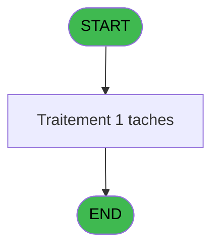
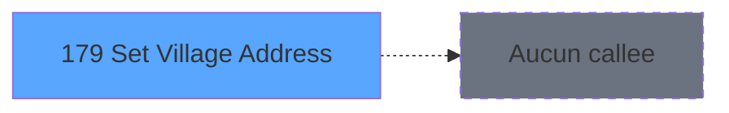

Generate a complete Zustand store for the "villageAddress" domain.

RULES (MANDATORY):
- Use import aliases: @/ for src root (e.g. @/stores/..., @/types/...)
- NEVER use `any` type - use `unknown` or precise types
- Tailwind v4 classes for styling (no tailwind.config.js)
- Arrow functions everywhere (no function declarations)
- `as const` instead of TypeScript enum
- verbatimModuleSyntax is enabled: use `import type { X }` ONLY for types/interfaces, use `import { X }` for values/consts
- File must be COMPLETE and ready to write - NO placeholders, NO TODOs, NO "// implement here"
- NO comments except for genuinely complex logic
- Output ONLY the code inside a single markdown code block (```typescript ... ``` or ```tsx ... ```)

SHARED INFRASTRUCTURE (use these exact imports):
- Data source toggle: `import { useDataSourceStore } from "@/stores/dataSourceStore"` (has .getState().isRealApi)
- API client: `import { apiClient } from "@/services/api/apiClient"` and `import type { ApiResponse } from "@/services/api/apiClient"`
- Screen layout: `import { ScreenLayout } from "@/components/layout"` (wrapper with sidebar, takes children + className)
- UI components: `import { Button, Dialog, Input } from "@/components/ui"`
- cn utility: `import { cn } from "@/lib/utils"`

STORE REQUIREMENTS:
- Use `create` from zustand (import { create } from "zustand")
- Import types from @/types/villageAddress
- Import useDataSourceStore from @/stores/dataSourceStore
- Mock/API branching via useDataSourceStore.getState().isRealApi
- try/catch with `e instanceof Error` for error handling
- Realistic mock data (not lorem ipsum)
- EVERY business rule from the analysis MUST be implemented
- Include reset() action to clear state

TYPES FILE (already generated):
export interface VillageAddress {
  clubCode: string;
  name: string;
  address1: string;
  address2: string | null;
  zipCode: string;
  phone: string | null;
  email: string | null;
  siret: string | null;
  vatNumber: string | null;
}

export interface VillageAddressFormData {
  clubCode: string;
  name: string;
  address1: string;
  address2: string;
  zipCode: string;
  phone: string;
  email: string;
  siret: string;
  vatNumber: string;
}

export interface VillageAddressState {
  villageAddress: VillageAddress | null;
  isLoading: boolean;
  error: string | null;
  setVillageAddress: (address: VillageAddress) => Promise<void>;
  loadVillageAddress: () => Promise<VillageAddress | null>;
  clearError: () => void;
}

export interface SetVillageAddressRequest {
  clubCode: string;
  name: string;
  address1: string;
  address2?: string;
  zipCode: string;
  phone?: string;
  email?: string;
  siret?: string;
  vatNumber?: string;
}

export interface SetVillageAddressResponse {
  success: boolean;
  message?: string;
}

export interface GetVillageAddressResponse extends VillageAddress {
  retrievedAt: string;
}

export const VILLAGE_ADDRESS_MOCK_DATA = [
  {
    clubCode: 'CLUB001',
    name: 'Village Principal',
    address1: '123 Rue de la Paix',
    address2: 'Bâtiment A',
    zipCode: '75001',
    phone: '+33123456789',
    email: 'contact@village.fr',
    siret: '12345678901234',
    vatNumber: 'FR12345678901',
  },
  {
    clubCode: 'CLUB002',
    name: 'Village Secondaire',
    address1: '456 Avenue du Soleil',
    address2: null,
    zipCode: '13001',
    phone: null,
    email: 'info@village2.fr',
    siret: null,
    vatNumber: null,
  },
  {
    clubCode: 'CLUB003',
    name: 'Village Côtier',
    address1: '789 Boulevard de la Mer',
    address2: 'Suite 200',
    zipCode: '06000',
    phone: '+33987654321',
    email: null,
    siret: '98765432109876',
    vatNumber: 'FR98765432109',
  },
] as const satisfies readonly VillageAddress[];

ANALYSIS DOCUMENT:
{
  "domain": "villageAddress",
  "domainPascal": "VillageAddress",
  "complexity": "LOW",
  "entities": [
    {
      "name": "VillageAddress",
      "fields": [
        {
          "name": "clubCode",
          "type": "string",
          "source": "parameter VI_CLUB",
          "nullable": false
        },
        {
          "name": "name",
          "type": "string",
          "source": "parameter VI_NAME",
          "nullable": false
        },
        {
          "name": "address1",
          "type": "string",
          "source": "parameter VI_ADR1",
          "nullable": false
        },
        {
          "name": "address2",
          "type": "string",
          "source": "parameter VI_ADR2",
          "nullable": true
        },
        {
          "name": "zipCode",
          "type": "string",
          "source": "parameter VI_ZIPC",
          "nullable": false
        },
        {
          "name": "phone",
          "type": "string",
          "source": "parameter VI_PHON",
          "nullable": true
        },
        {
          "name": "email",
          "type": "string",
          "source": "parameter VI_MAIL",
          "nullable": true
        },
        {
          "name": "siret",
          "type": "string",
          "source": "parameter VI_SIRE",
          "nullable": true
        },
        {
          "name": "vatNumber",
          "type": "string",
          "source": "parameter VI_VATN",
          "nullable": true
        }
      ]
    }
  ],
  "stateFields": [
    {
      "name": "villageAddress",
      "type": "VillageAddress | null",
      "default": "null"
    },
    {
      "name": "isLoading",
      "type": "boolean",
      "default": "false"
    },
    {
      "name": "error",
      "type": "string | null",
      "default": "null"
    }
  ],
  "actions": [
    {
      "name": "setVillageAddress",
      "params": [
        "address: VillageAddress"
      ],
      "businessRules": [
        "Trim whitespace from phone, email, SIRET, VAT number, and zip code before setting",
        "Store all address components as global parameters (VI_CLUB, VI_NAME, VI_ADR1, VI_ADR2, VI_ZIPC, VI_PHON, VI_MAIL, VI_SIRE, VI_VATN)",
        "Club code, name, address1, and zip code are required fields",
        "Address2, phone, email, SIRET, and VAT number are optional"
      ],
      "returns": "Promise<void>"
    },
    {
      "name": "loadVillageAddress",
      "params": [],
      "businessRules": [
        "Retrieve current village address from global parameters",
        "Populate state with existing values if available"
      ],
      "returns": "Promise<VillageAddress | null>"
    }
  ],
  "apiEndpoints": [
    {
      "method": "PUT",
      "path": "/api/village-address",
      "queryParams": [],
      "response": "void"
    },
    {
      "method": "GET",
      "path": "/api/village-address",
      "queryParams": [],
      "response": "VillageAddress"
    }
  ],
  "uiLayout": {
    "type": "form",
    "sections": [
      {
        "name": "villageInfo",
        "controls": [
          "clubCode (text input, required)",
          "name (text input, required)",
          "address1 (text input, required)",
          "address2 (text input, optional)",
          "zipCode (text input, required)"
        ]
      },
      {
        "name": "contactInfo",
        "controls": [
          "phone (text input, optional)",
          "email (email input, optional)"
        ]
      },
      {
        "name": "legalInfo",
        "controls": [
          "siret (text input, optional)",
          "vatNumber (text input, optional)"
        ]
      },
      {
        "name": "actions",
        "controls": [
          "saveButton (primary action)",
          "cancelButton (secondary action)"
        ]
      }
    ]
  },
  "mockData": {
    "count": 3,
    "description": "Sample village addresses with varying levels of completeness - one with all fields, one with minimal required fields, one with partial contact info"
  },
  "dependencies": {
    "stores": [
      "useVillageAddressStore"
    ],
    "sharedTypes": [
      "VillageAddress"
    ],
    "externalApis": []
  }
}

SPEC EXCERPT (business rules):
# ADH IDE 179 - Set Village Address

> **Analyse**: Phases 1-4 2026-02-07 07:24 -> 07:25 (16s) | Assemblage 07:25
> **Pipeline**: V7.2 Enrichi
> **Structure**: 4 onglets (Resume | Ecrans | Donnees | Connexions)

<!-- TAB:Resume -->

## 1. FICHE D'IDENTITE

| Attribut | Valeur |
|----------|--------|
| Projet | ADH |
| IDE Position | 179 |
| Nom Programme | Set Village Address |
| Fichier source | `Prg_179.xml` |
| Dossier IDE | Printer |
| Taches | 1 (0 ecrans visibles) |
| Tables modifiees | 0 |
| Programmes appeles | 0 |

## 2. DESCRIPTION FONCTIONNELLE

**Set Village Address** assure la gestion complete de ce processus.

## 3. BLOCS FONCTIONNELS

## 5. REGLES METIER

*(Aucune regle metier identifiee)*

## 6. CONTEXTE

- **Appele par**: (aucun)
- **Appelle**: 0 programmes | **Tables**: 1 (W:0 R:1 L:0) | **Taches**: 1 | **Expressions**: 10

<!-- TAB:Ecrans -->

## 8. ECRANS

*(Programme sans ecran visible)*

## 9. NAVIGATION

### 9.3 Structure hierarchique (0 tache)

| Position | Tache | Type | Dimensions | Bloc |
|----------|-------|------|------------|------|

### 9.4 Algorigramme



> *algo-data indisponible. Utiliser `/algorigramme` pour generer.*

<!-- TAB:Donnees -->

## 10. TABLES

### Tables utilisees (1)

| ID | Nom | Description | Type | R | W | L | Usages |
|----|-----|-------------|------|---|---|---|--------|
| 372 | pv_budget |  | DB | R |   |   | 1 |

### Colonnes par table (0 / 1 tables avec colonnes identifiees)

<details>
<summary>Table 372 - pv_budget (R) - 1 usages</summary>

*Table utilisee uniquement en Link ou aucune colonne Real identifiee dans le DataView.*

</details>

## 11. VARIABLES

*(Programme sans variables locales mappees)*

## 12. EXPRESSIONS

**10 / 10 expressions decodees (100%)**

### 12.1 Repartition par type

| Type | Expressions | Regles |
|------|-------------|--------|
| OTHER | 4 | 0 |
| STRING | 6 | 0 |

### 12.2 Expressions cles par type

#### OTHER (4 expressions)

| Type | IDE | Expression | Regle |
|------|-----|------------|-------|
| OTHER | 3 | `SetParam ('VI_ADR1',[D])` | - |
| OTHER | 4 | `SetParam ('VI_ADR2',[E])` | - |
| OTHER | 1 | `SetParam ('VI_CLUB',[B])` | - |
| OTHER | 2 | `SetParam ('VI_NAME',[C])` | - |

#### STRING (6 expressions)

| Type | IDE | Expression | Regle |
|------|-----|------------|-------|
| STRING | 8 | `SetParam ('VI_MAIL',Trim([I]))` | - |
| STRING | 9 | `SetParam ('VI_SIRE',Trim([J]))` | - |
| STRING | 10 | `SetParam ('VI_VATN',Trim([K]))` | - |
| STRING | 5 | `SetParam ('VI_ZIPC',Trim([F]))` | - |
| STRING | 6 | `SetParam ('VI_PHON',Trim([G]))` | - |
| ... | | *+1 autres* | |

<!-- TAB:Connexions -->

## 13. GRAPHE D'APPELS

### 13.1 Chaine depuis Main (Callers)

**Chemin**: (pas de callers directs)


### 13.2 Callers

| IDE | Nom Programme | Nb Appels |
|-----|---------------|-----------|
| - | (aucun) | - |

### 13.3 Callees (programmes appeles)



### 13.4 Detail Callees avec contexte

| IDE | Nom Programme | Appels | Contexte |
|-----|---------------|--------|----------|
| - | (aucun) | - | - |

## 14. RECOMMANDATIONS MIGRATION

### 14.1 Profil du programme

| Metrique | Valeur | Impact migration |
|----------|--------|-----------------|
| Lignes de logique | 30 | Programme compact |
| Expressions | 10 | Peu de logique |
| Tables WRITE | 0 | Impact faible |
| Sous-programmes | 0 | Peu de dependances |
| Ecrans visibles | 0 | Ecran unique ou traitement batch |
| Code desactive | 0% (0 / 30) | Code sain |
| Regles metier | 0 | Pas de regle identifiee |

### 14.2 Plan de migration par bloc

### 14.3 Dependances critiques

| Dependance | Type | Appels | Impact |
|------------|------|--------|--------|

---
*Spec DETAILED generee par Pipeline V7.2 - 2026-02-07 07:25*


REFERENCE PATTERN (follow this exact structure):
```typescript
import { create } from 'zustand';
import type {
  ExtraitAccountInfo,
  ExtraitTransaction,
  ExtraitSummary,
  ExtraitPrintFormat,
} from '@/types/extrait';
import { extraitApi } from '@/services/api/endpoints-lot3';
import { useDataSourceStore } from './dataSourceStore';

interface ExtraitState {
  selectedAccount: ExtraitAccountInfo | null;
  transactions: ExtraitTransaction[];
  summary: ExtraitSummary | null;
  searchResults: ExtraitAccountInfo[];
  isSearching: boolean;
  isLoadingExtrait: boolean;
  isPrinting: boolean;
  error: string | null;
}

interface ExtraitActions {
  searchAccount: (societe: string, query: string) => Promise<void>;
  selectAccount: (account: ExtraitAccountInfo) => void;
  loadExtrait: (
    societe: string,
    codeAdherent: number,
    filiation: number,
    dateDebut?: string,
    dateFin?: string,
  ) => Promise<void>;
  printExtrait: (
    societe: string,
    codeAdherent: number,
    filiation: number,
    format: ExtraitPrintFormat,
  ) => Promise<void>;
  reset: () => void;
}

type ExtraitStore = ExtraitState & ExtraitActions;

const MOCK_ACCOUNTS: ExtraitAccountInfo[] = [
  { societe: 'SOC1', codeAdherent: 1001, filiation: 0, nom: 'DUPONT', prenom: 'Jean', statut: 'normal', hasGiftPass: false },
  { societe: 'SOC1', codeAdherent: 1002, filiation: 0, nom: 'MARTIN', prenom: 'Sophie', statut: 'normal', hasGiftPass: true },
  { societe: 'SOC1', codeAdherent: 1003, filiation: 1, nom: 'DURAND', prenom: 'Pierre', statut: 'bloque', hasGiftPass: false },
];

const MOCK_TRANSACTIONS: ExtraitTransaction[] = [
  { id: 1, date: '2026-02-10', heure: '09:15', libelle: 'Achat boutique', debit: 45.50, credit: 0, solde: -45.50, codeService: 'BTQ', codeImputation: 'IMP01', giftPassFlag: false, nbArticles: 3, status: 'debit', numeroPiece: 'VTE-001', modePaiement: 'CB', caissier: 'MARTIN S.' },
  { id: 2, date: '2026-02-10', heure: '14:30', libelle: 'Credit compte', debit: 0, credit: 200, solde: 154.50, codeService: 'CAI', codeImputation: 'IMP02', giftPassFlag: false, status: 'credit', numeroPiece: 'CRD-042', modePaiement: 'Especes', caissier: 'DUPONT J.' },
  { id: 3, date: '2026-02-09', heure: '12:45', libelle: 'Repas restaurant', libelleSupplementaire: 'Menu du jour', debit: 32.00, credit: 0, solde: 122.50, codeService: 'RST', codeImputation: 'IMP03', giftPassFlag: true, nbArticles: 1, status: 'debit', numeroPiece: 'RST-117', modePaiement: 'GiftPass', caissier: 'MARTIN S.' },
  { id: 4, date: '2026-02-08', heure: '16:00', libelle: 'Annulation vente', debit: 0, credit: 15.00, solde: 154.50, codeService: 'BTQ', codeImputation: 'IMP01', giftPassFlag: false, status: 'annule', numeroPiece: 'ANN-003', modePaiement: 'CB', caissier: 'DUPONT J.', commentaire: 'Erreur de saisie' },
  { id: 5, date: '2026-02-08', heure: '10:20', libelle: 'Regularisation solde', debit: 0, credit: 5.00, solde: 139.50, codeService: 'CAI', codeImputation: 'IMP02', giftPassFlag: false, status: 'regularise', numeroPiece: 'REG-007', modePaiement: 'Interne', caissier: 'ADMIN' },
];

const MOCK_SUMMARY: ExtraitSummary = {
  totalDebit: 77.50,
  totalCredit: 220,
  soldeActuel: 142.50,
  nbTransactions: 5,
};

const initialState: ExtraitState = {
  selectedAccount: null,
  transactions: [],
  summary: null,
  searchResults: [],
  isSearching: false,
  isLoadingExtrait: false,
  isPrinting: false,
  error: null,
};

export const useExtraitStore = create<ExtraitStore>()((set) => ({
  ...initialState,

  searchAccount: async (societe, query) => {
    const { isRealApi } = useDataSourceStore.getState();
    set({ isSearching: true, error: null });

    if (!isRealApi) {
      const filtered = MOCK_ACCOUNTS.filter(
        (a) =>
          a.nom.toLowerCase().includes(query.toLowerCase()) ||
          a.prenom.toLowerCase().includes(query.toLowerCase()) ||
          String(a.codeAdherent).includes(query),
      );
      set({ searchResults: filtered, isSearching: false });
      return;
    }

    try {
      const response = await extraitApi.searchAccount(societe, query);
      set({ searchResults: response.data.data ?? [] });
    } catch (e: unknown) {
      const message = e instanceof Error ? e.message : 'Erreur recherche compte';
      set({ searchResults: [], error: message });
    } finally {
      set({ isSearching: false });
    }
  },

  selectAccount: (account) => {
    set({ selectedAccount: account, transactions: [], summary: null, error: null });
  },

  loadExtrait: async (societe, codeAdherent, filiation, dateDebut, dateFin) => {
    const { isRealApi } = useDataSourceStore.getState();
    set({ isLoadingExtrait: true, error: null });

    if (!isRealApi) {
      set({
        transactions: MOCK_TRANSACTIONS,
        summary: MOCK_SUMMARY,
        isLoadingExtrait: false,
      });
      return;
    }

    try {
      const response = await extraitApi.getExtrait(
        societe,
        codeAdherent,
        filiation,
        dateDebut,
        dateFin,
      );
      const data = response.data.data;
      set({
        transactions: data?.transactions ?? [],
        summary: data?.summary ?? null,
      });
    } catch (e: unknown) {
      const message = e instanceof Error ? e.message : 'Erreur chargement extrait';
      set({ transactions: [], summary: null, error: message });
    } finally {
      set({ isLoadingExtrait: false });
    }
  },

  printExtrait: async (societe, codeAdherent, filiation, format) => {
    const { isRealApi } = useDataSourceStore.getState();
    set({ isPrinting: true, error: null });

    if (!isRealApi) {
      set({ isPrinting: false });
      return;
    }

    try {
      await extraitApi.printExtrait({
        societe,
        codeAdherent,
        filiation,
        format,
      });
    } catch (e: unknown) {
      const message = e instanceof Error ? e.message : 'Erreur impression';
      set({ error: message });
    } finally {
      set({ isPrinting: false });
    }
  },

  reset: () => set({ ...initialState }),
}));

```