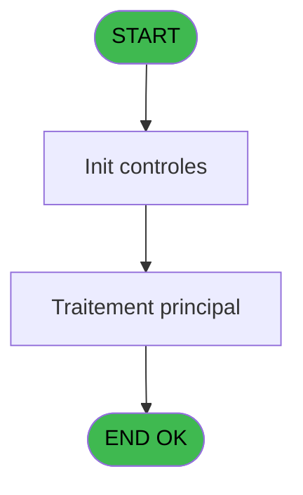

Generate a complete Zustand store for the "printConfiguration" domain.

RULES (MANDATORY):
- Use import aliases: @/ for src root (e.g. @/stores/..., @/types/...)
- NEVER use `any` type - use `unknown` or precise types
- Tailwind v4 classes for styling (no tailwind.config.js)
- Arrow functions everywhere (no function declarations)
- `as const` instead of TypeScript enum
- verbatimModuleSyntax is enabled: use `import type { X }` ONLY for types/interfaces, use `import { X }` for values/consts
- File must be COMPLETE and ready to write - NO placeholders, NO TODOs, NO "// implement here"
- NO comments except for genuinely complex logic
- Output ONLY the code inside a single markdown code block (```typescript ... ``` or ```tsx ... ```)

SHARED INFRASTRUCTURE (use these exact imports):
- Data source toggle: `import { useDataSourceStore } from "@/stores/dataSourceStore"` (has .getState().isRealApi)
- API client: `import { apiClient } from "@/services/api/apiClient"` and `import type { ApiResponse } from "@/services/api/apiClient"`
- Screen layout: `import { ScreenLayout } from "@/components/layout"` (wrapper with sidebar, takes children + className)
- UI components: `import { Button, Dialog, Input } from "@/components/ui"`
- cn utility: `import { cn } from "@/lib/utils"`

STORE REQUIREMENTS:
- Use `create` from zustand (import { create } from "zustand")
- Import types from @/types/printConfiguration
- Import useDataSourceStore from @/stores/dataSourceStore
- Mock/API branching via useDataSourceStore.getState().isRealApi
- try/catch with `e instanceof Error` for error handling
- Realistic mock data (not lorem ipsum)
- EVERY business rule from the analysis MUST be implemented
- Include reset() action to clear state

TYPES FILE (already generated):
export interface PrintConfig {
  currentListingNum: number;
  currentPrinterName: string;
  currentPrinterNum: number;
  numberCopies: number;
  specificPrint: string;
}

export interface SetListingRequest {
  listingNumber: number;
}

export interface ResetPrintParametersRequest {}

export interface GetPrintConfigRequest {}

export type PrintConfigAction = 
  | { type: 'SET_CONFIG'; payload: PrintConfig }
  | { type: 'SET_LOADING'; payload: boolean }
  | { type: 'SET_ERROR'; payload: string | null }
  | { type: 'RESET' };

export interface PrintConfigState {
  currentConfig: PrintConfig | null;
  isInitializing: boolean;
  error: string | null;
  setListingNumber: (listingNumber: number) => Promise<void>;
  resetPrintParameters: () => Promise<void>;
  getPrintConfig: () => Promise<PrintConfig>;
  setError: (error: string | null) => void;
  reset: () => void;
}

export const DEFAULT_PRINT_CONFIG: PrintConfig = {
  currentListingNum: 0,
  currentPrinterName: 'VOID',
  currentPrinterNum: 0,
  numberCopies: 0,
  specificPrint: 'VOID',
};

ANALYSIS DOCUMENT:
{
  "domain": "printConfiguration",
  "domainPascal": "PrintConfiguration",
  "complexity": "LOW",
  "entities": [
    {
      "name": "PrintConfig",
      "fields": [
        {
          "name": "currentListingNum",
          "type": "number",
          "source": "parameter",
          "nullable": false
        },
        {
          "name": "currentPrinterName",
          "type": "string",
          "source": "parameter",
          "nullable": false
        },
        {
          "name": "currentPrinterNum",
          "type": "number",
          "source": "parameter",
          "nullable": false
        },
        {
          "name": "numberCopies",
          "type": "number",
          "source": "parameter",
          "nullable": false
        },
        {
          "name": "specificPrint",
          "type": "string",
          "source": "parameter",
          "nullable": false
        }
      ]
    }
  ],
  "stateFields": [
    {
      "name": "currentConfig",
      "type": "PrintConfig | null",
      "default": "null"
    },
    {
      "name": "isInitializing",
      "type": "boolean",
      "default": "false"
    },
    {
      "name": "error",
      "type": "string | null",
      "default": "null"
    }
  ],
  "actions": [
    {
      "name": "setListingNumber",
      "params": [
        "listingNumber: number"
      ],
      "businessRules": [
        "[RM-001] Si SPECIFICPRINT = 'VOID', initialiser les paramètres d'impression par défaut",
        "SetParam CURRENTLISTINGNUM avec le numéro de listing fourni",
        "SetParam CURRENTPRINTERNAME à 'VOID'",
        "SetParam CURRENTPRINTERNUM à 0",
        "SetParam NUMBERCOPIES à 0"
      ],
      "returns": "Promise<void>"
    },
    {
      "name": "resetPrintParameters",
      "params": [],
      "businessRules": [
        "Réinitialiser CURRENTPRINTERNAME à 'VOID'",
        "Réinitialiser CURRENTPRINTERNUM à 0",
        "Réinitialiser NUMBERCOPIES à 0"
      ],
      "returns": "Promise<void>"
    },
    {
      "name": "getPrintConfig",
      "params": [],
      "businessRules": [
        "Récupérer la configuration d'impression courante"
      ],
      "returns": "Promise<PrintConfig>"
    }
  ],
  "apiEndpoints": [
    {
      "method": "POST",
      "path": "/api/print-config/set-listing",
      "queryParams": [],
      "response": "void"
    },
    {
      "method": "POST",
      "path": "/api/print-config/reset",
      "queryParams": [],
      "response": "void"
    },
    {
      "method": "GET",
      "path": "/api/print-config",
      "queryParams": [],
      "response": "PrintConfig"
    }
  ],
  "uiLayout": {
    "type": "utility-service",
    "sections": [
      {
        "name": "configuration",
        "controls": [
          "No visible UI - backend utility service only"
        ]
      }
    ]
  },
  "mockData": {
    "count": 1,
    "description": "Default print configuration with CURRENTLISTINGNUM=0, CURRENTPRINTERNAME='VOID', CURRENTPRINTERNUM=0, NUMBERCOPIES=0, SPECIFICPRINT='VOID'"
  },
  "dependencies": {
    "stores": [
      "usePrintConfigStore"
    ],
    "sharedTypes": [
      "PrintConfig"
    ],
    "externalApis": []
  }
}

SPEC EXCERPT (business rules):
# ADH IDE 181 - Set Listing Number

> **Analyse**: Phases 1-4 2026-02-07 03:52 -> 04:01 (24h08min) | Assemblage 04:01
> **Pipeline**: V7.2 Enrichi
> **Structure**: 4 onglets (Resume | Ecrans | Donnees | Connexions)

<!-- TAB:Resume -->

## 1. FICHE D'IDENTITE

| Attribut | Valeur |
|----------|--------|
| Projet | ADH |
| IDE Position | 181 |
| Nom Programme | Set Listing Number |
| Fichier source | `Prg_181.xml` |
| Dossier IDE | General |
| Taches | 1 (0 ecrans visibles) |
| Tables modifiees | 0 |
| Programmes appeles | 0 |
| Complexite | **BASSE** (score 0/100) |

## 2. DESCRIPTION FONCTIONNELLE

**Set Listing Number (ADH IDE 181)** est un utilitaire de configuration impression sans interface visible. Il initialise le numéro de listing courant et réinitialise les paramètres d'impression (nom imprimante, nombre copies, numéro imprimante) à leurs valeurs par défaut. Ce programme fait partie intégrante du **subsystème d'impression en chaîne** (Chained Listing) du module caisse ADH, utilisé pour orchestrer une série d'impressions de documents (factures, garanties, tickets) sur une imprimante configurée.

Le programme reçoit en paramètre un **numéro de listing** et exécute 5 appels `SetParam()` simples pour configurer les paramètres globaux du système d'impression. Aucune table n'est modifiée, aucun sous-programme n'est appelé : c'est une opération purement paramétrée qui sert de **point d'entrée de configuration** avant de lancer les chaînes d'impression. Il est appelé depuis le menu impression (ADH IDE 214) et son résultat est utilisé par tous les programmes d'impression qui lisent ces paramètres via `GetParam()`.

Avec seulement 11 lignes de logique et 0 dépendances horizontales, c'est l'un des programmes les plus simples du module ADH. La migration vers TypeScript ou C# est triviale : transformer en fonction utilitaire d'un service de configuration impression, sans aucune complexité métier à préserver.

## 3. BLOCS FONCTIONNELS

### 3.1 Traitement (1 tache)

Traitements internes.

---

#### <a id="t1"></a>181 - Set Listing Number

**Role** : Traitement : Set Listing Number.
**Variables liees** : EN (Param Listing number)


## 5. REGLES METIER

1 regles identifiees:

### Autres (1 regles)

#### <a id="rm-RM-001"></a>[RM-001] Condition: parametre SPECIFICPRINT egale 'VOID'

| Element | Detail |
|---------|--------|
| **Condition** | `GetParam ('SPECIFICPRINT')='VOID'` |
| **Si vrai** | Action si SPECIFICPRINT = 'VOID' |
| **Expression source** | Expression 5 : `GetParam ('SPECIFICPRINT')='VOID'` |
| **Exemple** | Si GetParam ('SPECIFICPRINT')='VOID' → Action si SPECIFICPRINT = 'VOID' |

## 6. CONTEXTE

- **Appele par**: (aucun)
- **Appelle**: 0 programmes | **Tables**: 0 (W:0 R:0 L:0) | **Taches**: 1 | **Expressions**: 5

<!-- TAB:Ecrans -->

## 8. ECRANS

*(Programme sans ecran visible)*

## 9. NAVIGATION

### 9.3 Structure hierarchique (1 tache)

| Position | Tache | Type | Dimensions | Bloc |
|----------|-------|------|------------|------|
| **181.1** | [**Set Listing Number** (181)](#t1) | MDI | - | Traitement |

### 9.4 Algorigramme



> **Legende**: Vert = START/END OK | Rouge = END KO | Bleu = Decisions
> *Algorigramme auto-genere. Utiliser `/algorigramme` pour une synthese metier detaillee.*

<!-- TAB:Donnees -->

## 10. TABLES

### Tables utilisees (0)

| ID | Nom | Description | Type | R | W | L | Usages |
|----|-----|-------------|------|---|---|---|--------|

### Colonnes par table (0 / 0 tables avec colonnes identifiees)

## 11. VARIABLES

*(Programme sans variables locales mappees)*

## 12. EXPRESSIONS

**5 / 5 expressions decodees (100%)**

### 12.1 Repartition par type

| Type | Expressions | Regles |
|------|-------------|--------|
| CONDITION | 1 | 5 |
| OTHER | 4 | 0 |

### 12.2 Expressions cles par type

#### CONDITION (1 expressions)

| Type | IDE | Expression | Regle |
|------|-----|------------|-------|
| CONDITION | 5 | `GetParam ('SPECIFICPRINT')='VOID'` | [RM-001](#rm-RM-001) |

#### OTHER (4 expressions)

| Type | IDE | Expression | Regle |
|------|-----|------------|-------|
| OTHER | 3 | `SetParam ('CURRENTPRINTERNAME','VOID')` | - |
| OTHER | 4 | `SetParam ('NUMBERCOPIES',0)` | - |
| OTHER | 1 | `SetParam ('CURRENTLISTINGNUM',Param Listing number [A])` | - |
| OTHER | 2 | `SetParam ('CURRENTPRINTERNUM',0)` | - |

<!-- TAB:Connexions -->

## 13. GRAPHE D'APPELS

### 13.1 Chaine depuis Main (Callers)

**Chemin**: (pas de callers directs)


### 13.2 Callers

| IDE | Nom Programme | Nb Appels |
|-----|---------------|-----------|
| - | (aucun) | - |

### 13.3 Callees (programmes appeles)


### 13.4 Detail Callees avec contexte

| IDE | Nom Programme | Appels | Contexte |
|-----|---------------|--------|----------|
| - | (aucun) | - | - |

## 14. RECOMMANDATIONS MIGRATION

### 14.1 Profil du programme

| Metrique | Valeur | Impact migration |
|----------|--------|-----------------|
| Lignes de logique | 11 | Programme compact |
| Expressions | 5 | Peu de logique |
| Tables WRITE | 0 | Impact faible |
| Sous-programmes | 0 | Peu de dependances |
| Ecrans visibles | 0 | Ecran unique ou traitement batch |
| Code desactive | 0% (0 / 11) | Code sain |
| Regles metier | 1 | Quelques regles a preserver |

### 14.2 Plan de migration par bloc

#### Traitement (1 tache: 0 ecran, 1 traitement)

- **Strategie** : 1 service(s) backend injectable(s) (Domain Services).
- Deco

REFERENCE PATTERN (follow this exact structure):
```typescript
import { create } from 'zustand';
import type {
  ExtraitAccountInfo,
  ExtraitTransaction,
  ExtraitSummary,
  ExtraitPrintFormat,
} from '@/types/extrait';
import { extraitApi } from '@/services/api/endpoints-lot3';
import { useDataSourceStore } from './dataSourceStore';

interface ExtraitState {
  selectedAccount: ExtraitAccountInfo | null;
  transactions: ExtraitTransaction[];
  summary: ExtraitSummary | null;
  searchResults: ExtraitAccountInfo[];
  isSearching: boolean;
  isLoadingExtrait: boolean;
  isPrinting: boolean;
  error: string | null;
}

interface ExtraitActions {
  searchAccount: (societe: string, query: string) => Promise<void>;
  selectAccount: (account: ExtraitAccountInfo) => void;
  loadExtrait: (
    societe: string,
    codeAdherent: number,
    filiation: number,
    dateDebut?: string,
    dateFin?: string,
  ) => Promise<void>;
  printExtrait: (
    societe: string,
    codeAdherent: number,
    filiation: number,
    format: ExtraitPrintFormat,
  ) => Promise<void>;
  reset: () => void;
}

type ExtraitStore = ExtraitState & ExtraitActions;

const MOCK_ACCOUNTS: ExtraitAccountInfo[] = [
  { societe: 'SOC1', codeAdherent: 1001, filiation: 0, nom: 'DUPONT', prenom: 'Jean', statut: 'normal', hasGiftPass: false },
  { societe: 'SOC1', codeAdherent: 1002, filiation: 0, nom: 'MARTIN', prenom: 'Sophie', statut: 'normal', hasGiftPass: true },
  { societe: 'SOC1', codeAdherent: 1003, filiation: 1, nom: 'DURAND', prenom: 'Pierre', statut: 'bloque', hasGiftPass: false },
];

const MOCK_TRANSACTIONS: ExtraitTransaction[] = [
  { id: 1, date: '2026-02-10', heure: '09:15', libelle: 'Achat boutique', debit: 45.50, credit: 0, solde: -45.50, codeService: 'BTQ', codeImputation: 'IMP01', giftPassFlag: false, nbArticles: 3, status: 'debit', numeroPiece: 'VTE-001', modePaiement: 'CB', caissier: 'MARTIN S.' },
  { id: 2, date: '2026-02-10', heure: '14:30', libelle: 'Credit compte', debit: 0, credit: 200, solde: 154.50, codeService: 'CAI', codeImputation: 'IMP02', giftPassFlag: false, status: 'credit', numeroPiece: 'CRD-042', modePaiement: 'Especes', caissier: 'DUPONT J.' },
  { id: 3, date: '2026-02-09', heure: '12:45', libelle: 'Repas restaurant', libelleSupplementaire: 'Menu du jour', debit: 32.00, credit: 0, solde: 122.50, codeService: 'RST', codeImputation: 'IMP03', giftPassFlag: true, nbArticles: 1, status: 'debit', numeroPiece: 'RST-117', modePaiement: 'GiftPass', caissier: 'MARTIN S.' },
  { id: 4, date: '2026-02-08', heure: '16:00', libelle: 'Annulation vente', debit: 0, credit: 15.00, solde: 154.50, codeService: 'BTQ', codeImputation: 'IMP01', giftPassFlag: false, status: 'annule', numeroPiece: 'ANN-003', modePaiement: 'CB', caissier: 'DUPONT J.', commentaire: 'Erreur de saisie' },
  { id: 5, date: '2026-02-08', heure: '10:20', libelle: 'Regularisation solde', debit: 0, credit: 5.00, solde: 139.50, codeService: 'CAI', codeImputation: 'IMP02', giftPassFlag: false, status: 'regularise', numeroPiece: 'REG-007', modePaiement: 'Interne', caissier: 'ADMIN' },
];

const MOCK_SUMMARY: ExtraitSummary = {
  totalDebit: 77.50,
  totalCredit: 220,
  soldeActuel: 142.50,
  nbTransactions: 5,
};

const initialState: ExtraitState = {
  selectedAccount: null,
  transactions: [],
  summary: null,
  searchResults: [],
  isSearching: false,
  isLoadingExtrait: false,
  isPrinting: false,
  error: null,
};

export const useExtraitStore = create<ExtraitStore>()((set) => ({
  ...initialState,

  searchAccount: async (societe, query) => {
    const { isRealApi } = useDataSourceStore.getState();
    set({ isSearching: true, error: null });

    if (!isRealApi) {
      const filtered = MOCK_ACCOUNTS.filter(
        (a) =>
          a.nom.toLowerCase().includes(query.toLowerCase()) ||
          a.prenom.toLowerCase().includes(query.toLowerCase()) ||
          String(a.codeAdherent).includes(query),
      );
      set({ searchResults: filtered, isSearching: false });
      return;
    }

    try {
      const response = await extraitApi.searchAccount(societe, query);
      set({ searchResults: response.data.data ?? [] });
    } catch (e: unknown) {
      const message = e instanceof Error ? e.message : 'Erreur recherche compte';
      set({ searchResults: [], error: message });
    } finally {
      set({ isSearching: false });
    }
  },

  selectAccount: (account) => {
    set({ selectedAccount: account, transactions: [], summary: null, error: null });
  },

  loadExtrait: async (societe, codeAdherent, filiation, dateDebut, dateFin) => {
    const { isRealApi } = useDataSourceStore.getState();
    set({ isLoadingExtrait: true, error: null });

    if (!isRealApi) {
      set({
        transactions: MOCK_TRANSACTIONS,
        summary: MOCK_SUMMARY,
        isLoadingExtrait: false,
      });
      return;
    }

    try {
      const response = await extraitApi.getExtrait(
        societe,
        codeAdherent,
        filiation,
        dateDebut,
        dateFin,
      );
      const data = response.data.data;
      set({
        transactions: data?.transactions ?? [],
        summary: data?.summary ?? null,
      });
    } catch (e: unknown) {
      const message = e instanceof Error ? e.message : 'Erreur chargement extrait';
      set({ transactions: [], summary: null, error: message });
    } finally {
      set({ isLoadingExtrait: false });
    }
  },

  printExtrait: async (societe, codeAdherent, filiation, format) => {
    const { isRealApi } = useDataSourceStore.getState();
    set({ isPrinting: true, error: null });

    if (!isRealApi) {
      set({ isPrinting: false });
      return;
    }

    try {
      await extraitApi.printExtrait({
        societe,
        codeAdherent,
        filiation,
        format,
      });
    } catch (e: unknown) {
      const message = e instanceof Error ? e.message : 'Erreur impression';
      set({ error: message });
    } finally {
      set({ isPrinting: false });
    }
  },

  reset: () => set({ ...initialState }),
}));

```