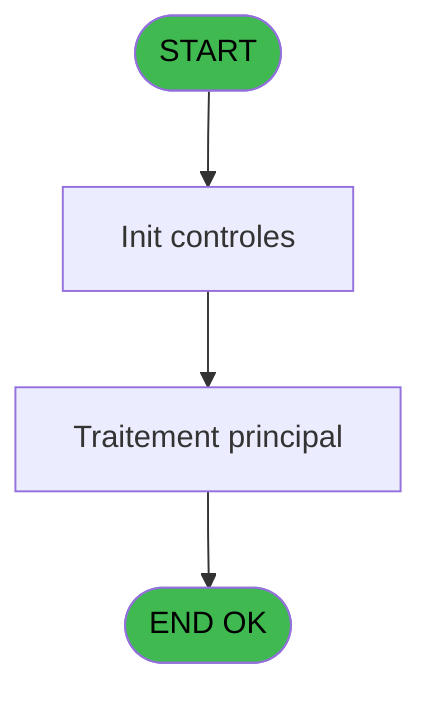
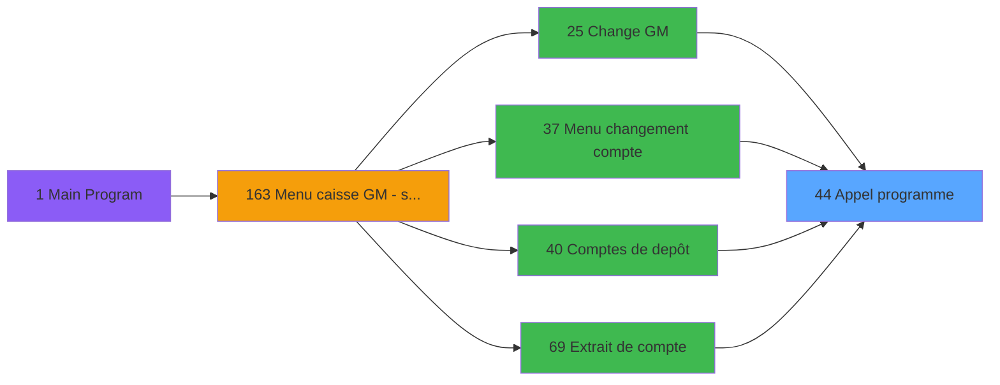

You are a software architect producing a design document for migrating a Magic Unipaas program to React/TypeScript.

Produce a JSON document following this EXACT structure:
```json
{
  "domain": "camelCaseDomainName",
  "domainPascal": "PascalCaseDomainName",
  "complexity": "LOW|MEDIUM|HIGH",
  "entities": [
    {
      "name": "EntityName",
      "fields": [
        {
          "name": "fieldName",
          "type": "string|number|boolean|Date",
          "source": "table.column",
          "nullable": false
        }
      ]
    }
  ],
  "stateFields": [
    {
      "name": "fieldName",
      "type": "TypeName[]",
      "default": "[]"
    }
  ],
  "actions": [
    {
      "name": "actionName",
      "params": [
        "param: type"
      ],
      "businessRules": [
        "Rule description"
      ],
      "returns": "Promise<void>"
    }
  ],
  "apiEndpoints": [
    {
      "method": "GET",
      "path": "/api/domain/resource",
      "queryParams": [
        "param?"
      ],
      "response": "ResponseType"
    }
  ],
  "uiLayout": {
    "type": "page-type",
    "sections": [
      {
        "name": "sectionName",
        "controls": [
          "control1"
        ]
      }
    ]
  },
  "mockData": {
    "count": 5,
    "description": "Description of mock data"
  },
  "dependencies": {
    "stores": [
      "useDataSourceStore"
    ],
    "sharedTypes": [],
    "externalApis": []
  }
}
```

IMPORTANT:
- Derive entity fields from actual DB column types when DB metadata is available
- Each business rule from the spec/contract MUST map to an action
- API endpoints should follow existing patterns: /api/{domain}/{resource}
- State fields must cover ALL data the UI needs to display
- Include isLoading, error, and filter states

PROGRAM SPEC:
# ADH IDE 44 - Appel programme

> **Analyse**: Phases 1-4 2026-02-07 06:47 -> 01:42 (18h55min) | Assemblage 01:42
> **Pipeline**: V7.2 Enrichi
> **Structure**: 4 onglets (Resume | Ecrans | Donnees | Connexions)

<!-- TAB:Resume -->

## 1. FICHE D'IDENTITE

| Attribut | Valeur |
|----------|--------|
| Projet | ADH |
| IDE Position | 44 |
| Nom Programme | Appel programme |
| Fichier source | `Prg_44.xml` |
| Dossier IDE | General |
| Taches | 1 (0 ecrans visibles) |
| Tables modifiees | 0 |
| Programmes appeles | 0 |
| Complexite | **BASSE** (score 0/100) |

## 2. DESCRIPTION FONCTIONNELLE

ADH IDE 44 est un programme de **routage centralisé d'appels** sans interface visuelle. Il capture le dernier contrôle cliqué (via `LastClicked()`) et l'utilise comme clé de dispatch pour acheminer vers le bon programme cible. C'est un pattern de factorisation typique dans Magic Unipaas : au lieu que 21 menus différents gèrent individuellement le routage des clics, ils delegent tous à ce programme unique qui applique une logique uniforme.

Le programme ne lit ni n'écrit en base de données, n'accepte aucun paramètre formel, et termine sans appeler d'autres programmes—c'est un **point terminal** dans la chaîne d'appels. Sa structure est minimale (1 tâche, 1 handler, 1 expression) mais critique pour l'UX caisse, puisqu'il est appelé depuis 21 écrans différents (changement de compte, garanties, facturation, télephonie, etc.).

Ce pattern économise du code répétitif et garantit que la logique de routage reste cohérente sur toute l'application. Si le comportement du dispatch devait évoluer (par exemple, ajouter un log ou une validation avant appel), une seule modification suffirait.

## 3. BLOCS FONCTIONNELS

## 5. REGLES METIER

*(Aucune regle metier identifiee dans les expressions)*

## 6. CONTEXTE

- **Appele par**: [Change GM (IDE 25)](ADH-IDE-25.md), [Comptes de depôt (IDE 40)](ADH-IDE-40.md), [Garantie sur compte PMS-584 (IDE 0)](ADH-IDE-0.md), [Garantie sur compte (IDE 111)](ADH-IDE-111.md), [Garantie sur compte PMS-584 (IDE 112)](ADH-IDE-112.md), [Gratuités (IDE 168)](ADH-IDE-168.md), [Versement/Retrait (IDE 174)](ADH-IDE-174.md), [Menu telephone (IDE 217)](ADH-IDE-217.md), [Garantie sur compte (IDE 288)](ADH-IDE-288.md), [Gratuités P157 (IDE 317)](ADH-IDE-317.md), [Menu changement compte (IDE 37)](ADH-IDE-37.md), [Extrait de compte (IDE 69)](ADH-IDE-69.md), [Club Med Pass menu (IDE 77)](ADH-IDE-77.md), [Bar Limit (IDE 86)](ADH-IDE-86.md), [Menu Great Member (IDE 158)](ADH-IDE-158.md), [Menu caisse GM - scroll (IDE 163)](ADH-IDE-163.md), [Gestion forfait TAI LOCAL (IDE 173)](ADH-IDE-173.md), [Menu solde d'un compte (IDE 190)](ADH-IDE-190.md), [Menu impression des appels (IDE 214)](ADH-IDE-214.md), [Menu Choix Saisie/Annul vente (IDE 242)](ADH-IDE-242.md)
- **Appelle**: 0 programmes | **Tables**: 0 (W:0 R:0 L:0) | **Taches**: 1 | **Expressions**: 1

<!-- TAB:Ecrans -->

## 8. ECRANS

*(Programme sans ecran visible)*

## 9. NAVIGATION

### 9.3 Structure hierarchique (0 tache)

| Position | Tache | Type | Dimensions | Bloc |
|----------|-------|------|------------|------|

### 9.4 Algorigramme



> **Legende**: Vert = START/END OK | Rouge = END KO | Bleu = Decisions
> *Algorigramme auto-genere. Utiliser `/algorigramme` pour une synthese metier detaillee.*

<!-- TAB:Donnees -->

## 10. TABLES

### Tables utilisees (0)

| ID | Nom | Description | Type | R | W | L | Usages |
|----|-----|-------------|------|---|---|---|--------|

### Colonnes par table (0 / 0 tables avec colonnes identifiees)

## 11. VARIABLES

*(Programme sans variables locales mappees)*

## 12. EXPRESSIONS

**1 / 1 expressions decodees (100%)**

### 12.1 Repartition par type

| Type | Expressions | Regles |
|------|-------------|--------|
| OTHER | 1 | 0 |

### 12.2 Expressions cles par type

#### OTHER (1 expressions)

| Type | IDE | Expression | Regle |
|------|-----|------------|-------|
| OTHER | 1 | `LastClicked ()` | - |

<!-- TAB:Connexions -->

## 13. GRAPHE D'APPELS

### 13.1 Chaine depuis Main (Callers)

Main -> ... -> [Change GM (IDE 25)](ADH-IDE-25.md) -> **Appel programme (IDE 44)**

Main -> ... -> [Comptes de depôt (IDE 40)](ADH-IDE-40.md) -> **Appel programme (IDE 44)**

Main -> ... -> [Garantie sur compte PMS-584 (IDE 0)](ADH-IDE-0.md) -> **Appel programme (IDE 44)**

Main -> ... -> [Garantie sur compte (IDE 111)](ADH-IDE-111.md) -> **Appel programme (IDE 44)**

Main -> ... -> [Garantie sur compte PMS-584 (IDE 112)](ADH-IDE-112.md) -> **Appel programme (IDE 44)**

Main -> ... -> [Gratuités (IDE 168)](ADH-IDE-168.md) -> **Appel programme (IDE 44)**

Main -> ... -> [Versement/Retrait (IDE 174)](ADH-IDE-174.md) -> **Appel programme (IDE 44)**

Main -> ... -> [Menu telephone (IDE 217)](ADH-IDE-217.md) -> **Appel programme (IDE 44)**

Main -> ... -> [Garantie sur compte (IDE 288)](ADH-IDE-288.md) -> **Appel programme (IDE 44)**

Main -> ... -> [Gratuités P157 (IDE 317)](ADH-IDE-317.md) -> **Appel programme (IDE 44)**

Main -> ... -> [Menu changement compte (IDE 37)](ADH-IDE-37.md) -> **Appel programme (IDE 44)**

Main -> ... -> [Extrait de compte (IDE 69)](ADH-IDE-69.md) -> **Appel programme (IDE 44)**

Main -> ... -> [Club Med Pass menu (IDE 77)](ADH-IDE-77.md) -> **Appel programme (IDE 44)**

Main -> ... -> [Bar Limit (IDE 86)](ADH-IDE-86.md) -> **Appel programme (IDE 44)**

Main -> ... -> [Menu Great Member (IDE 158)](ADH-IDE-158.md) -> **Appel programme (IDE 44)**

Main -> ... -> [Menu caisse GM - scroll (IDE 163)](ADH-IDE-163.md) -> **Appel programme (IDE 44)**

Main -> ... -> [Gestion forfait TAI LOCAL (IDE 173)](ADH-IDE-173.md) -> **Appel programme (IDE 44)**

Main -> ... -> [Menu solde d'un compte (IDE 190)](ADH-IDE-190.md) -> **Appel programme (IDE 44)**

Main -> ... -> [Menu impression des appels (IDE 214)](ADH-IDE-214.md) -> **Appel programme (IDE 44)**

Main -> ... -> [Menu Choix Saisie/Annul vente (IDE 242)](ADH-IDE-242.md) -> **Appel programme (IDE 44)**



### 13.2 Callers

| IDE | Nom Programme | Nb Appels |
|-----|---------------|-----------|
| [25](ADH-IDE-25.md) | Change GM | 3 |
| [40](ADH-IDE-40.md) | Comptes de depôt | 3 |
| [0](ADH-IDE-0.md) | Garantie sur compte PMS-584 | 2 |
| [111](ADH-IDE-111.md) | Garantie sur compte | 2 |
| [112](ADH-IDE-112.md) | Garantie sur compte PMS-584 | 2 |
| [168](ADH-IDE-168.md) | Gratuités | 2 |
| [174](ADH-IDE-174.md) | Versement/Retrait | 2 |
| [217](ADH-IDE-217.md) | Menu telephone | 2 |
| [288](ADH-IDE-288.md) | Garantie sur compte | 2 |
| [317](ADH-IDE-317.md) | Gratuités P157 | 2 |
| [37](ADH-IDE-37.md) | Menu changement compte | 1 |
| [69](ADH-IDE-69.md) | Extrait de compte | 1 |
| [77](ADH-IDE-77.md) | Club Med Pass menu | 1 |
| [86](ADH-IDE-86.md) | Bar Limit | 1 |
| [158](ADH-IDE-158.md) | Menu Great Member | 1 |
| [163](ADH-IDE-163.md) | Menu caisse GM - scroll | 1 |
| [173](ADH-IDE-173.md) | Gestion forfait TAI LOCAL | 1 |
| [190](ADH-IDE-190.md) | Menu solde d'un compte | 1 |
| [214](ADH-IDE-214.md) | Menu impression des appels | 1 |
| [242](ADH-IDE-242.md) | Menu Choix Saisie/Annul vente | 1 |

### 13.3 Callees (programmes appeles)

```mermaid
graph LR
    T44[44 Appel programme]
    sty

CONTRACT:
{
  "program": {
    "id": 0,
    "name": "",
    "complexity": "MEDIUM",
    "callers": [],
    "callees": [],
    "tasksCount": 1,
    "tablesCount": 0,
    "expressionsCount": 1
  },
  "rules": [],
  "tables": [],
  "callees": [],
  "variables": []
}